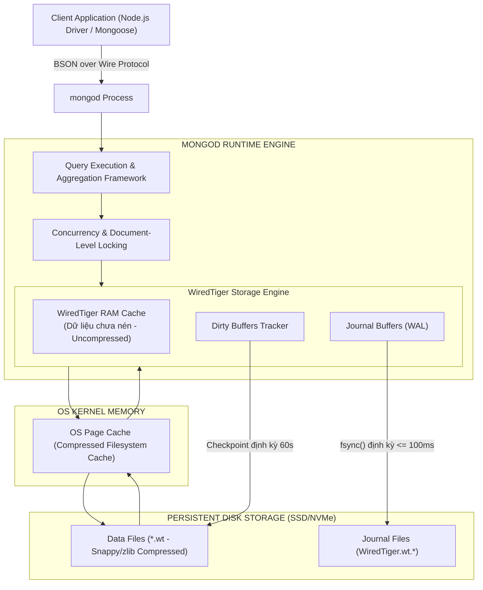
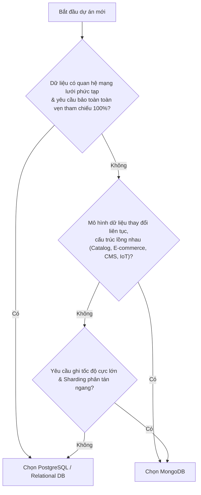
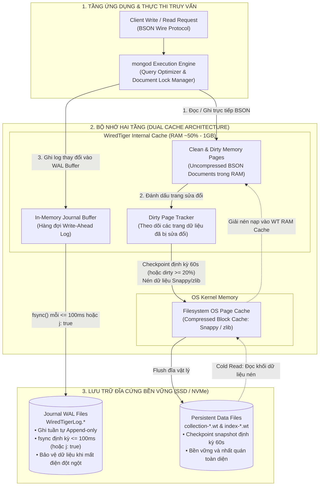
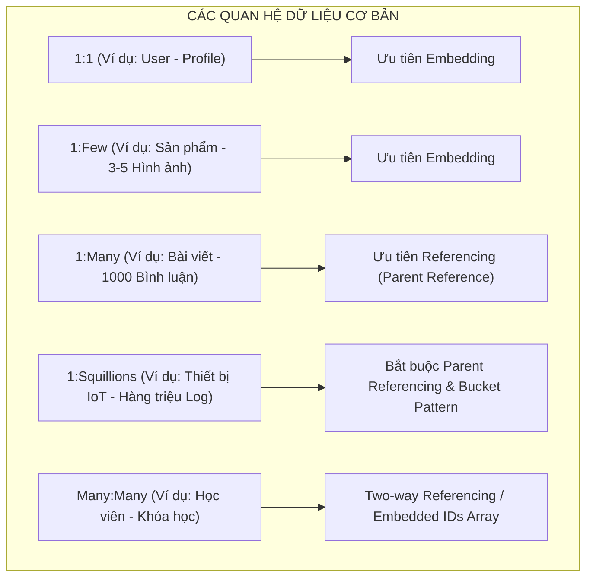
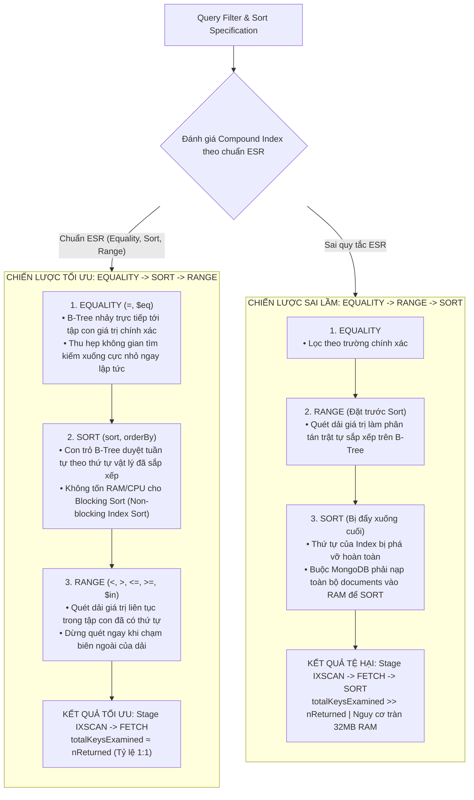
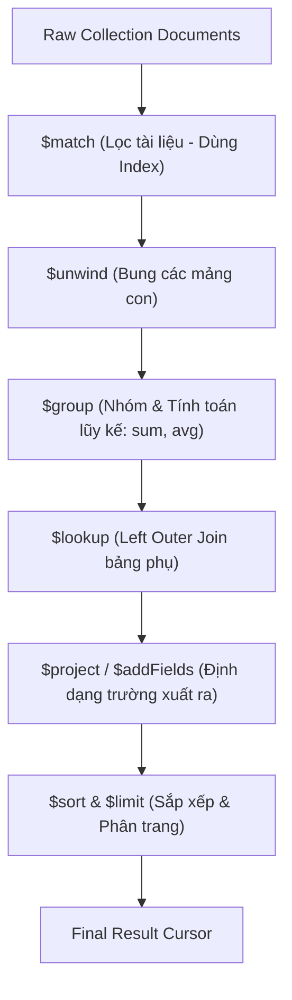
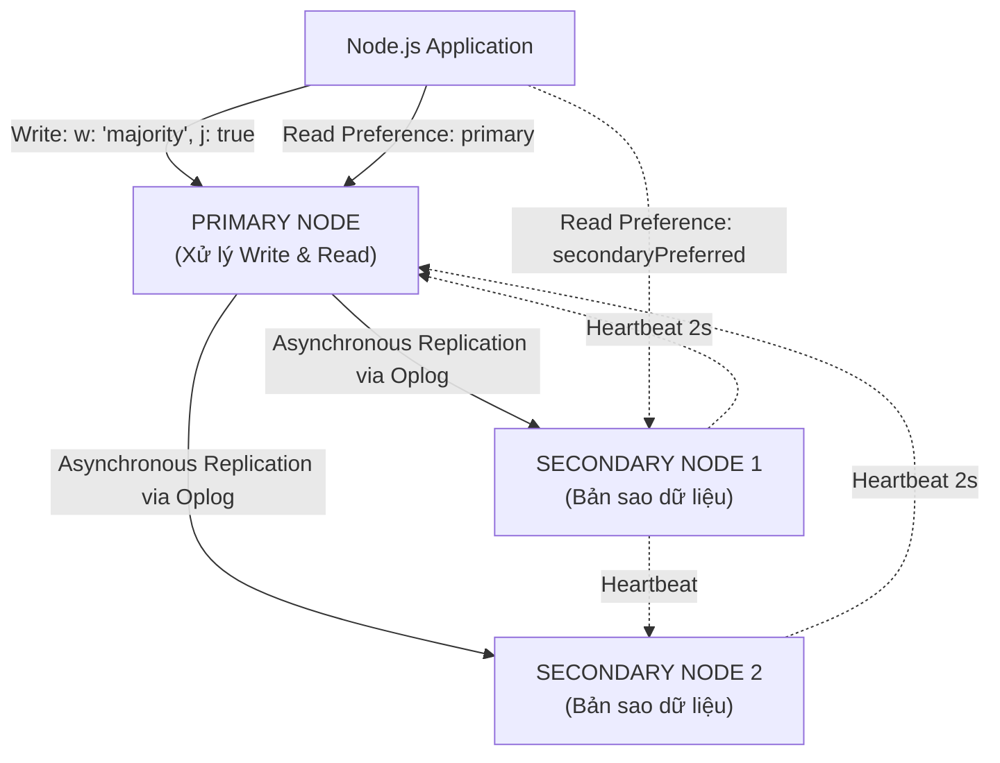

## I. KHÁI QUÁT (OVERVIEW)

### 1. Bản chất Kiến trúc Document-Oriented của MongoDB
MongoDB là hệ quản trị cơ sở dữ liệu phi quan hệ (NoSQL) phân tán, hướng tài liệu (Document-Oriented Database) hàng đầu thế giới. Khác biệt cốt lõi của MongoDB so với các RDBMS truyền thống là khả năng lưu trữ dữ liệu dưới dạng các tài liệu linh hoạt (**BSON - Binary JSON**) thay vì các dòng (Tuples) và cột cố định trong bảng.

Trong MongoDB:
* Một **Database** chứa nhiều **Collections** (tương đương với các Tables trong SQL).
* Một **Collection** chứa nhiều **Documents** (tương đương với các Rows/Tuples).
* Mỗi **Document** là một cấu trúc dữ liệu JSON nhị phân (BSON) hỗ trợ đa dạng kiểu dữ liệu (chuỗi, số nguyên, mảng mảng lồng nhau, tài liệu con nhúng - Subdocuments, Date, Decimal128, Binary, ObjectId).



---

### 2. So sánh Document Model vs Relational Model: Khi nào chọn MongoDB?

| Tiêu chí | SQL / Relational (PostgreSQL, MySQL) | NoSQL / Document (MongoDB) |
| :--- | :--- | :--- |
| **Cấu trúc dữ liệu** | Nghiêm ngặt (Schema-first), quan hệ bảng 2 chiều phẳng | Linh hoạt (Polymorphic / Dynamic Schema), cây dữ liệu lồng nhau (Hierarchical) |
| **Mô hình chuẩn hóa** | Normalization (3NF / BCNF) để triệt tiêu dữ liệu trùng lặp | Denormalization & Embedding (Gom dữ liệu đọc cùng nhau vào 1 tài liệu) |
| **Mở rộng (Scalability)** | Chủ yếu mở rộng theo chiều dọc (Vertical Scaling - Tăng RAM/CPU) | Tối ưu mở rộng theo chiều ngang (Horizontal Scaling / Native Sharding) |
| **Xử lý quan hệ** | Các phép `JOIN` mạnh mẽ, đa dạng và được tối ưu sâu | Khuyến khích Embedding; hỗ trợ `$lookup` (Left Outer Join) nhưng chi phí cao |
| **Triết lý CAP** | Thường thiên về **CA** hoặc **CP** (Tập trung tính Nhất quán nghiêm ngặt) | Thiết kế dạng **CP** (Consistency & Partition Tolerance) với tính sẵn sàng cao |
| **Mô hình Giao dịch** | ACID nguyên tử toàn diện đa bảng mặc định | ACID mặc định cho tài liệu đơn (Single-document); ACID đa tài liệu từ MongoDB 4.0+ |



---

## II. CHI TIẾT KỸ THUẬT (DETAILED DEEP DIVE)

### 1. Kiến trúc Động cơ Lưu trữ WiredTiger (WiredTiger Storage Engine)

MongoDB sử dụng **WiredTiger** làm công cụ lưu trữ mặc định với các tính chất vật lý vượt trội:
1. **Document-Level Concurrency Control:** WiredTiger áp dụng cơ chế khóa ở cấp độ tài liệu (Document-level Locking) và kỹ thuật **Optimistic Concurrency Control (OCC)**. Các thao tác ghi đồng thời vào các documents khác nhau trong cùng một collection diễn ra hoàn toàn song song mà không khóa lẫn nhau.
2. **Bộ nhớ hai tầng (Dual Cache Architecture):**
   * **WiredTiger Internal Cache:** Mặc định chiếm khoảng $50\% \text{ RAM} - 1\text{GB}$. Dữ liệu trên bộ đệm này ở dạng giải nén (Uncompressed) để CPU xử lý trực tiếp với tốc độ nano-giây.
   * **Filesystem (OS) Page Cache:** Phần RAM còn lại của hệ điều hành được tận dụng để lưu trữ các khối dữ liệu đã nén (Snappy hoặc zlib compression), giúp tăng mật độ lưu trữ lên 300% - 400% so với ổ cứng.
3. **Checkpoint & Journaling:**
   * **Journaling:** Ghi nhận mọi thay đổi dữ liệu vào Journal Files trên đĩa (tương tự WAL trong Postgres) với chu kỳ `commitIntervalMs` (mặc định 100ms hoặc ngay lập tức khi dùng `j: true`).
   * **Checkpointing:** Cứ mỗi **60 giây** (hoặc khi dung lượng log đạt 2GB), WiredTiger đồng bộ toàn bộ snapshot bộ nhớ sạch xuống các tệp tin `*.wt` trên đĩa cứng.



---

### 2. Schema Design Patterns (Nghệ thuật Thiết kế Lược đồ Dữ liệu)

> [!IMPORTANT]
> **Quy tắc vàng trong MongoDB Data Modeling:** 
> *"Dữ liệu được truy vấn cùng nhau thì nên được lưu trữ cùng nhau"* (**Data that is accessed together should be stored together**).



#### a. Kỹ thuật Embedding (Nhúng) vs Referencing (Tham chiếu)
* **Embedding (Denormalization):** Lưu trực tiếp đối tượng hoặc mảng đối tượng con bên trong Document cha. 
  * *Ưu điểm:* 1 thao tác đọc lấy toàn bộ thông tin; đảm bảo tính toàn vẹn ACID nguyên tử mà không cần transaction.
  * *Nhược điểm:* Giới hạn kích thước Document tối đa của BSON là **16MB**; có thể gây phân mảnh RAM nếu mảng con tăng trưởng liên tục.
* **Referencing (Normalization):** Lưu trữ `ObjectId` trỏ sang Collection khác.
  * *Ưu điểm:* Linh hoạt, tránh trùng lặp dữ liệu, không bị giới hạn 16MB.
  * *Nhược điểm:* Cần thêm câu truy vấn phụ hoặc dùng toán tử `$lookup` tốn kém CPU và bộ nhớ.

#### b. Các Design Patterns nâng cao trong MongoDB
1. **Bucket Pattern (Mô hình gom cụm thời gian):**
   * Sử dụng cho dữ liệu Time-series, IoT, Metrics. Thay vì mỗi giây chèn 1 document (gây bùng nổ số lượng document và chỉ mục), ta gom 60 giây hoặc 1 giờ dữ liệu vào 1 document duy nhất chứa mảng các mẫu đo (`samples: [{ t, v }]`).
2. **Subset Pattern (Mô hình tập con tối ưu Cache):**
   * Giải quyết bài toán Document chứa quá nhiều dữ liệu ít dùng (ví dụ: sản phẩm có 500 bài review, nhưng người dùng vào trang chủ chỉ cần xem 5 review mới nhất). Ta nhúng 5 review mới nhất vào Document chính, còn 495 review cũ được chuyển sang collection `reviews` riêng.
3. **Extended Reference Pattern (Mô hình tham chiếu mở rộng):**
   * Khi cần tham chiếu đến Document khác (ví dụ: `Order` tham chiếu tới `User`), thay vì chỉ lưu `user_id`, ta lưu thêm các trường hay hiển thị nhất như `{ user_id, name, phone }` để tránh phải `$lookup` trong 95% trường hợp.
4. **Computed Pattern (Mô hình tính toán trước):**
   * Tính toán và cập nhật sẵn các giá trị tổng (`total_spent`, `average_rating`, `view_count`) ngay khi có sự kiện ghi thay vì dùng Aggregation tính lại từ đầu trong mỗi lượt đọc.
5. **Schema Versioning Pattern (Phiên bản hóa cấu trúc):**
   * Thêm trường `schema_version: 1` vào document. Cho phép cập nhật cấu trúc database từng bước (Zero-downtime lazy migration) mà không cần chạy migration chặn toàn bộ hệ thống.

---

### 3. Indexing trong MongoDB & Quy tắc ESR Vàng (The ESR Rule)

MongoDB sử dụng cấu trúc **B-Tree** cho hầu hết các loại chỉ mục.



#### a. Giải thích sâu về Quy tắc ESR (Equality, Sort, Range)
* **Equality (E) đặt lên đầu:** Giúp Index thu hẹp không gian tìm kiếm về một tập con rất nhỏ các nút lá trên cây B-Tree.
* **Sort (S) đặt ở giữa (trước Range):** Nếu trường Sort đứng trước Range, MongoDB có thể duyệt các nút lá của Index theo đúng thứ tự sắp xếp mong muốn $\to$ Loại bỏ hoàn toàn bước **In-Memory Blocking Sort** (tránh lỗi vượt quá 32MB RAM khi sort).
* **Range (R) đặt ở cuối:** Khi điều kiện Range được áp dụng, con trỏ Index phải quét qua nhiều giá trị khác nhau. Nếu đặt Range trước Sort, MongoDB sẽ không thể sử dụng cấu trúc thứ tự của Index cho thao tác sắp xếp nữa.

#### b. Các loại Index chuyên dụng trong MongoDB
1. **Single Field & Compound Index:** Chỉ mục đơn và chỉ mục kết hợp nhiều trường.
2. **Multikey Index:** Tự động kích hoạt khi lập index trên một trường có kiểu dữ liệu là **Array**. MongoDB tạo một mục index cho từng phần tử trong mảng.
3. **TTL Index (Time-To-Live):** Tự động xóa các documents sau một khoảng thời gian nhất định (dựa trên trường có kiểu `Date`). Thích hợp cho Session, OTP, Caching, Log tạm thời.
   ```javascript
   db.sessions.createIndex({ createdAt: 1 }, { expireAfterSeconds: 3600 });
   ```
4. **Partial Index:** Chỉ lập chỉ mục cho các tài liệu thỏa mãn điều kiện bộ lọc:
   ```javascript
   db.users.createIndex(
     { email: 1 }, 
     { unique: true, partialFilterExpression: { email: { $exists: true, $ne: null } } }
   );
   ```
5. **Text Index & Wildcard Index (`"$**"`):** Phục vụ tìm kiếm từ khóa văn bản hoặc lập chỉ mục toàn bộ các thuộc tính động không xác định trước.

#### c. Đọc và Phân tích Execution Stats với `explain("executionStats")`
* `nReturned`: Số lượng tài liệu thực tế khớp và trả về cho client.
* `totalKeysExamined`: Số lượng khóa Index mà engine đã phải quét qua.
* `totalDocsExamined`: Số lượng Document thực tế trong bộ nhớ/đĩa mà engine phải nạp lên để kiểm tra.
* **Tỷ lệ vàng của một truy vấn tối ưu:** `totalKeysExamined / nReturned ≈ 1` và `totalDocsExamined ≈ nReturned`
* **Các Execution Stages cần lưu ý:**
  * `IXSCAN`: Quét Index (Rất tốt).
  * `FETCH`: Lấy Document từ Disk/Memory dựa trên con trỏ từ IXSCAN.
  * `COLLSCAN`: Quét toàn bộ Collection (Rất tệ - Cần tối ưu khẩn cấp).
  * `SORT`: Sắp xếp trong bộ nhớ (Tốn RAM - Cần tối ưu bằng cách đưa trường Sort vào Compound Index).

---

### 4. Aggregation Pipeline Deep Dive (Xử lý Dữ liệu Nâng cao)

Khung xử lý Aggregation hoạt động theo mô hình đường ống (**Unix Pipeline**): Dữ liệu đi qua chuỗi các Stages, đầu ra của Stage trước là đầu vào của Stage tiếp theo.



#### a. Các Stages cốt lõi và Kỹ thuật tối ưu
1. **`$match`:** Lọc các documents. **Luôn đặt `$match` ở vị trí đầu tiên** của Pipeline để tận dụng tối đa Index và giảm kích thước dữ liệu truyền vào các stages sau.
2. **`$project` / `$addFields` / `$set`:** Tạo mới, sửa đổi hoặc loại bỏ các trường. Sử dụng `$unset` để loại bỏ các trường dung lượng lớn không cần thiết.
3. **`$group`:** Nhóm các tài liệu theo `_id` chỉ định và tính toán số liệu thống kê qua các accumulators: `$sum`, `$avg`, `$min`, `$max`, `$push`, `$addToSet`, `$first`, `$last`.
4. **`$unwind`:** Tách từng phần tử trong một mảng thành các document riêng biệt. Sử dụng cờ `{ preserveNullAndEmptyArrays: true }` nếu không muốn làm mất các document có mảng rỗng hoặc null.
5. **`$lookup` (Correlated Subqueries):** Thực hiện phép JOIN với collection khác. Hỗ trợ 2 cú pháp:
   * *Basic Lookup:* Khớp `localField` và `foreignField`.
   * *Pipeline Lookup:* Sử dụng biến `let` và pipeline con bên trong để lọc và giới hạn dữ liệu trước khi JOIN (tránh quét toàn bộ bảng phụ).
6. **`$facet`:** Cho phép thực thi nhiều pipeline con song song trên cùng một tập dữ liệu đầu vào trong 1 lượt round-trip duy nhất (cực kỳ hữu ích cho tính năng **Tìm kiếm Phân trang kết hợp Thống kê Danh mục**).
7. **`$bucket` & `$bucketAuto`:** Phân loại documents thành các dải giá trị (ví dụ: nhóm khoảng giá sản phẩm: $0-$50, $50-$100, $100+).

> [!WARNING]
> Mỗi Stage trong Aggregation Pipeline bị giới hạn bộ nhớ RAM tối đa là **100MB**. Nếu vượt quá ngưỡng này, MongoDB sẽ ném lỗi. Để xử lý các tập dữ liệu lớn, cần bật tùy chọn `{ allowDiskUse: true }`.

---

### 5. Tính Nhất quán, Phân tán và Giao dịch (Transactions & Consistency)



#### a. Replica Sets & Oplog (Operations Log)
Một cụm MongoDB tiêu chuẩn bao gồm ít nhất 3 nodes (1 Primary và 2 Secondaries).
* Mọi thao tác ghi (`INSERT`, `UPDATE`, `DELETE`) chỉ được thực hiện trên **Primary Node**.
* Mọi thay đổi được ghi tuần tự vào một collection đặc biệt gọi là **`local.oplog.rs` (Operations Log)**.
* Các Secondary nodes liên tục đọc Oplog từ Primary và replay lại các thao tác đó trên bộ nhớ của chúng để đồng bộ dữ liệu.
* Cơ chế bầu cử tự động (**Automatic Failover**): Nếu Primary node mất liên lạc quá 10 giây (dựa trên Heartbeat 2 giây), các Secondaries sẽ tổ chức bỏ phiếu bầu ra Primary mới.

#### b. Mô hình Cấu hình Ghi/Đọc (Write Concern & Read Concern)
* **Write Concern (`w`, `j`, `wtimeout`):**
  * `w: 1`: Primary ghi vào bộ nhớ thành công là trả về kết quả ngay (Nhanh nhất, rủi ro mất dữ liệu nếu Primary sập trước khi đồng bộ sang Secondary).
  * `w: "majority"`: Phép ghi phải được xác nhận bởi đa số các nodes trong cụm (an toàn nhất, chống mất dữ liệu khi phân rã mạng).
  * `j: true`: Chờ WiredTiger ghi log xuống Journal File trên đĩa trước khi trả về.
* **Read Concern:**
  * `"local"` / `"available"`: Đọc dữ liệu mới nhất trên node hiện tại (chưa chắc đã được commit đa số).
  * `"majority"`: Chỉ đọc dữ liệu đã được xác nhận bởi đa số nodes (chống hiện tượng đọc phải dữ liệu bị Rollback khi failover).
  * `"linearizable"`: Đảm bảo tính tuần tự tuyến tính thời gian thực (chờ Primary xác nhận với các nodes khác).
  * `"snapshot"`: Cung cấp snapshot cô lập phục vụ Multi-document Transactions.

#### c. Multi-Document ACID Transactions
Từ phiên bản MongoDB 4.0 (cho Replica Sets) và 4.2 (cho Sharded Clusters), MongoDB hỗ trợ đầy đủ các giao dịch ACID đa tài liệu thông qua cơ chế **Session API**:
* Hỗ trợ Transaction Isolation Level ở cấp độ **Snapshot Isolation**.
* Giới hạn thời gian sống tối đa của một transaction mặc định là **60 giây** (`transactionLifetimeLimitSeconds`).

---

## III. VÍ DỤ MINH HỌA VÀ PHÂN TÍCH CODE

### 1. Minh họa Thực tế Quy tắc ESR (Equality - Sort - Range)

Giả sử chúng ta có collection `orders` với các trường:
* `status`: Trạng thái đơn (`"COMPLETED"`, `"PENDING"`) $\to$ Phép so sánh Bằng (Equality).
* `createdAt`: Ngày đặt hàng $\to$ Sắp xếp giảm dần (Sort).
* `totalAmount`: Tổng tiền đơn hàng $\to$ Lọc theo dải (Range).

#### Truy vấn nghiệp vụ:
```javascript
db.orders.find({
  status: "COMPLETED",
  totalAmount: { $gte: 100, $lte: 500 }
}).sort({ createdAt: -1 });
```

#### Thiết lập Index SAI (Vi phạm ESR - Đặt Range trước Sort):
```javascript
// Index vi phạm: Equality -> Range -> Sort
db.orders.createIndex({ status: 1, totalAmount: 1, createdAt: -1 });
```
**Phân tích Execution Stats của Index SAI:**
```json
{
  "executionStages": {
    "stage": "SORT", // Phải thực hiện In-Memory Blocking Sort vì Range phá vỡ thứ tự Index!
    "totalKeysExamined": 15000,
    "totalDocsExamined": 15000,
    "nReturned": 200,
    "memUsage": 2450123
  }
}
```

#### Thiết lập Index ĐÚNG theo chuẩn ESR:
```javascript
// Index chuẩn: Equality -> Sort -> Range
db.orders.createIndex({ status: 1, createdAt: -1, totalAmount: 1 });
```
**Phân tích Execution Stats của Index ĐÚNG:**
```json
{
  "executionStages": {
    "stage": "FETCH",
    "inputStage": {
      "stage": "IXSCAN", // Không hề có stage SORT! MongoDB duyệt index đã có sẵn thứ tự.
      "indexName": "status_1_createdAt_-1_totalAmount_1",
      "totalKeysExamined": 200,
      "totalDocsExamined": 200,
      "nReturned": 200
    }
  }
}
```
* **Kết quả:** Index chuẩn ESR loại bỏ hoàn toàn việc tốn CPU/RAM để sắp xếp và giảm số lượng khóa quét từ **15,000 xuống đúng 200 khóa**!

---

### 2. Aggregation Pipeline Nâng cao: Báo cáo Doanh thu & Khách hàng VIP

Dưới đây là đoạn mã Aggregation hoàn chỉnh thực hiện thống kê doanh số bán hàng theo từng danh mục sản phẩm, tính toán giá trị đơn trung bình và nhóm các khách hàng chi tiêu nhiều nhất:

```javascript
db.orders.aggregate([
  // Giai đoạn 1: Lọc các đơn hàng hoàn tất trong năm 2026 (Tận dụng Index)
  {
    $match: {
      status: "COMPLETED",
      orderDate: {
        $gte: ISODate("2026-01-01T00:00:00Z"),
        $lt: ISODate("2027-01-01T00:00:00Z")
      }
    }
  },

  // Giai đoạn 2: Bung mảng các mặt hàng bên trong đơn hàng
  {
    $unwind: {
      path: "$items",
      preserveNullAndEmptyArrays: false
    }
  },

  // Giai đoạn 3: JOIN với collection sản phẩm để lấy thông tin danh mục chi tiết
  {
    $lookup: {
      from: "products",
      localField: "items.productId",
      foreignField: "_id",
      as: "productDetails"
    }
  },

  // Giai đoạn 4: Trích xuất phần tử đầu tiên của mảng vừa JOIN
  {
    $set: {
      product: { $arrayElemAt: ["$productDetails", 0] }
    }
  },

  // Giai đoạn 5: Nhóm theo Danh mục và tính toán số liệu tổng hợp
  {
    $group: {
      _id: "$product.category",
      totalRevenue: { 
        $sum: { $multiply: ["$items.quantity", "$items.unitPrice"] } 
      },
      totalUnitsSold: { $sum: "$items.quantity" },
      uniqueBuyers: { $addToSet: "$customerId" },
      avgOrderValue: { $avg: "$totalAmount" }
    }
  },

  // Giai đoạn 6: Tính toán thêm trường số lượng người mua duy nhất
  {
    $project: {
      category: "$_id",
      _id: 0,
      totalRevenue: { $round: ["$totalRevenue", 2] },
      totalUnitsSold: 1,
      totalUniqueCustomers: { $size: "$uniqueBuyers" },
      avgOrderValue: { $round: ["$avgOrderValue", 2] }
    }
  },

  // Giai đoạn 7: Sắp xếp theo doanh thu giảm dần
  {
    $sort: { totalRevenue: -1 }
  }
]);
```

---

### 3. Thực thi Multi-Document ACID Transaction trong Node.js / TypeScript

```typescript
import { MongoClient, ClientSession } from 'mongodb';

interface CheckoutInput {
  customerId: string;
  items: Array<{ productId: string; quantity: number; price: number }>;
  totalAmount: number;
}

async function processOrderCheckout(client: MongoClient, orderData: CheckoutInput) {
  const session: ClientSession = client.startSession();

  try {
    // Thực thi transaction với mức cô lập Snapshot Isolation
    const result = await session.withTransaction(
      async () => {
        const db = client.db('ecommerce');
        const ordersColl = db.collection('orders');
        const productsColl = db.collection('products');
        const logsColl = db.collection('audit_logs');

        // 1. Kiểm tra tồn kho và trừ số lượng sản phẩm
        for (const item of orderData.items) {
          const updateResult = await productsColl.updateOne(
            { 
              _id: item.productId, 
              stockQuantity: { $gte: item.quantity } // Đảm bảo đủ tồn kho
            },
            { 
              $inc: { stockQuantity: -item.quantity } 
            },
            { session } // Bắt buộc truyền session vào mọi thao tác
          );

          if (updateResult.matchedCount === 0) {
            throw new Error(`Sản phẩm ${item.productId} không đủ hàng tồn kho!`);
          }
        }

        // 2. Tạo đơn hàng mới
        const orderInsertResult = await ordersColl.insertOne(
          {
            customerId: orderData.customerId,
            items: orderData.items,
            totalAmount: orderData.totalAmount,
            status: 'CONFIRMED',
            createdAt: new Date()
          },
          { session }
        );

        // 3. Ghi audit log
        await logsColl.insertOne(
          {
            action: 'ORDER_CHECKOUT',
            orderId: orderInsertResult.insertedId,
            customerId: orderData.customerId,
            timestamp: new Date()
          },
          { session }
        );

        return { orderId: orderInsertResult.insertedId, success: true };
      },
      {
        readPreference: 'primary',
        readConcern: { level: 'snapshot' },
        writeConcern: { w: 'majority', j: true }
      }
    );

    return result;
  } finally {
    // Giải phóng session về pool
    await session.endSession();
  }
}
```

---

## IV. LƯU Ý, CẠM BẪY VÀ QUY TẮC CỐT LÕI (BEST PRACTICES)

> [!CAUTION]
> ### 1. Cạm bẫy Bùng nổ Kích thước Document (The 16MB Document Limit & Memory Churn)
> BSON giới hạn kích thước tối đa của một document là **16MB**. 
> - **Sai lầm phổ biến:** Thiết kế mảng con không giới hạn (Unbounded Array), ví dụ nhúng trực tiếp toàn bộ lượt xem (View logs) hoặc toàn bộ bình luận của bài viết vào Document bài viết.
> - Khi mảng phình to vượt quá 16MB, database sẽ báo lỗi ghi `BSONObjectTooLarge`. Hơn nữa, việc liên tục mở rộng document trên đĩa khiến WiredTiger phải tái cấp phát không gian bộ nhớ liên tục (Document Relocation), làm phân mảnh và suy giảm nghiêm trọng tốc độ I/O.
> 
> **Quy tắc cốt lõi:** Nếu mảng con có tiềm năng vượt quá **100 - 200 phần tử**, bắt buộc chuyển sang mô hình **Parent Referencing** (`{ postId: ObjectId(...) }`).

> [!WARNING]
> ### 2. Cạm bẫy Sử dụng Regex không có Prefix Index
> Truy vấn Regex dạng chứa chuỗi (`.*keyword.*`) hoặc không phân biệt hoa thường (`$options: 'i'`) sẽ **vô hiệu hóa B-Tree Index** và ép MongoDB thực hiện quét toàn bộ Collection (`COLLSCAN`):
> 
> ```javascript
> // TRUY VẤN XẤU: Ép quét toàn bảng (COLLSCAN)
> db.users.find({ username: { $regex: /admin/i } });
> 
> // TRUY VẤN TỐI ƯU: Tận dụng Index tiền tố (Prefix Regex)
> db.users.find({ username: { $regex: /^admin/ } });
> 
> // HOẶC: Sử dụng Text Index / Atlas Search nếu cần Full-text Search
> ```

> [!IMPORTANT]
> ### 3. Cạm bẫy Lạm dụng Multi-document Transactions
> Mặc dù MongoDB hỗ trợ Transactions ACID, việc lạm dụng chúng cho mọi thao tác sẽ làm giảm hiệu năng hệ thống gấp nhiều lần so với thiết kế Document Model chuẩn:
> - Multi-document Transactions giữ các khóa ghi và snapshot trong WiredTiger Cache.
> - Transaction sống quá lâu sẽ gây nghẽn Cache và dễ bị hủy bỏ do xung đột (**Write Conflict Error**).
> 
> **Quy tắc cốt lõi:** Thiết kế cấu trúc dữ liệu theo hướng **Single-Document Embedding** bất cứ khi nào có thể, vì mọi thao tác cập nhật trên 1 document đơn lẻ trong MongoDB đều đã có tính nguyên tử (**Atomicity**) mặc định mà không cần khởi tạo Transaction.

> [!TIP]
> ### 4. Chiến lược Phân trang Hiệu năng cao (Bucket / Keyset Pagination vs `skip`)
> Sử dụng `.skip(10000).limit(20)` là nguyên nhân hàng đầu gây sập RAM database khi dữ liệu lớn, vì MongoDB vẫn phải đọc và duyệt qua toàn bộ 10,000 documents đầu tiên trước khi trả về 20 dòng.
> 
> **Giải pháp tối ưu: Keyset Pagination (Sử dụng con trỏ `_id` hoặc Timestamp):**
> ```javascript
> // Thay vì dùng skip(page * limit):
> db.orders.find({
>   _id: { $lt: lastSeenObjectId } // Sử dụng trực tiếp Index trên _id
> })
> .sort({ _id: -1 })
> .limit(20);
> ```
