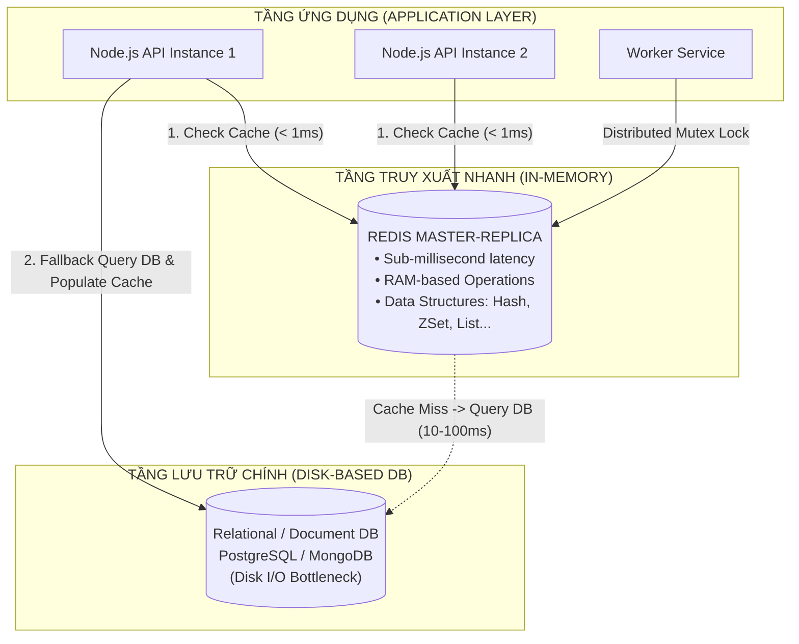
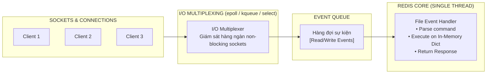
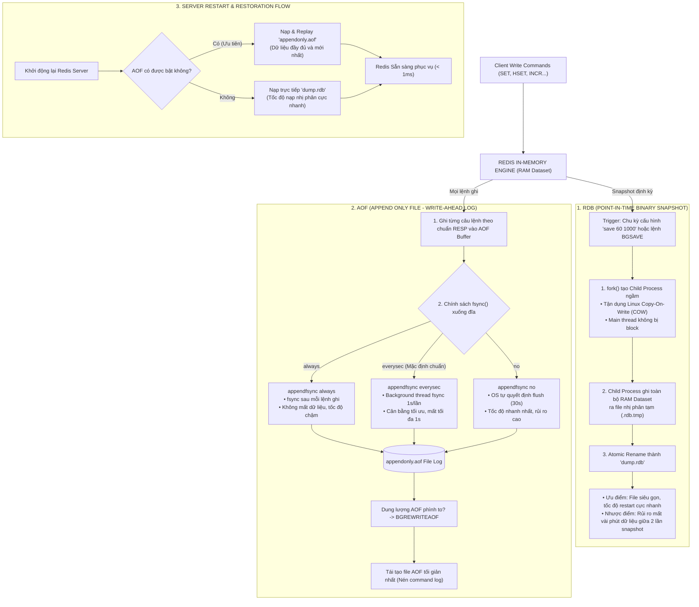
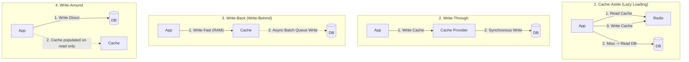
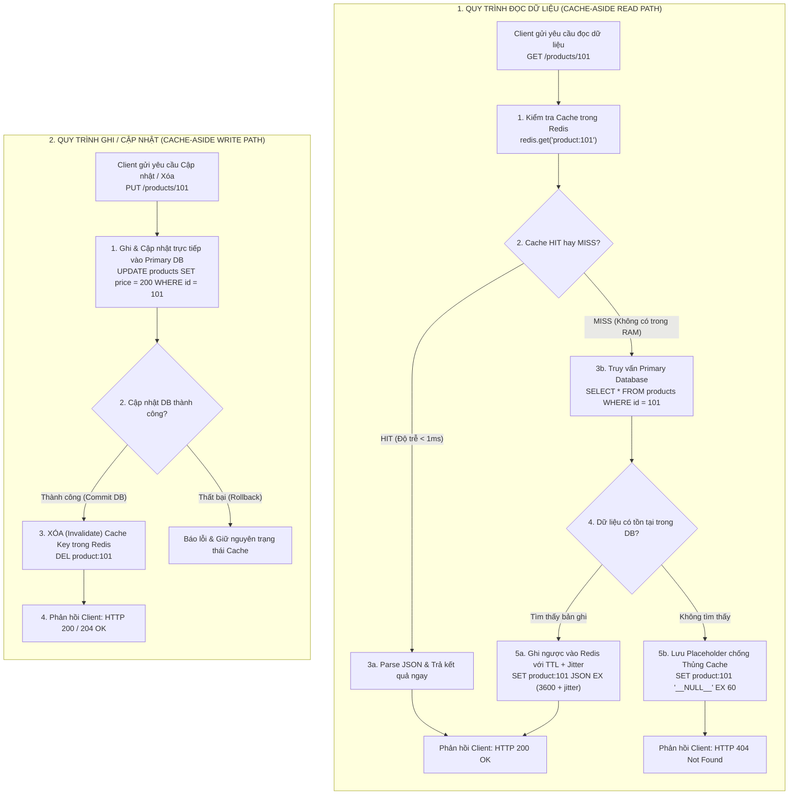
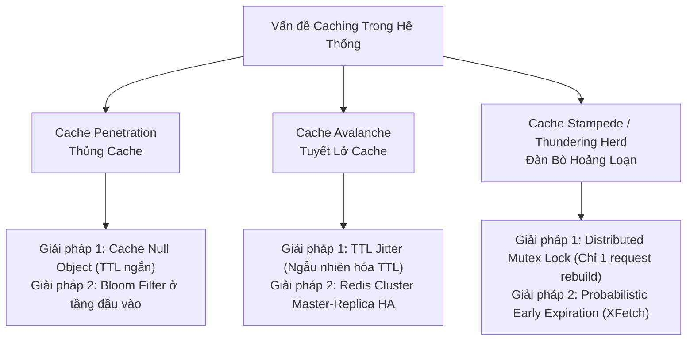
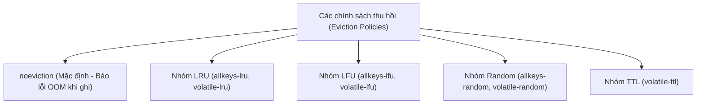
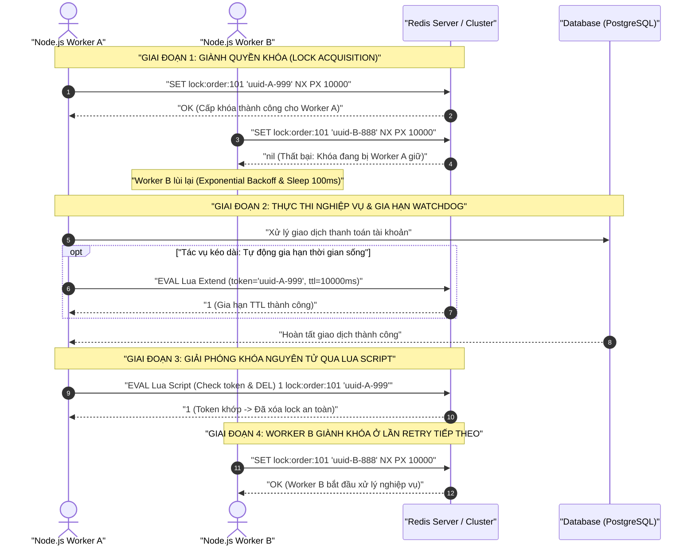
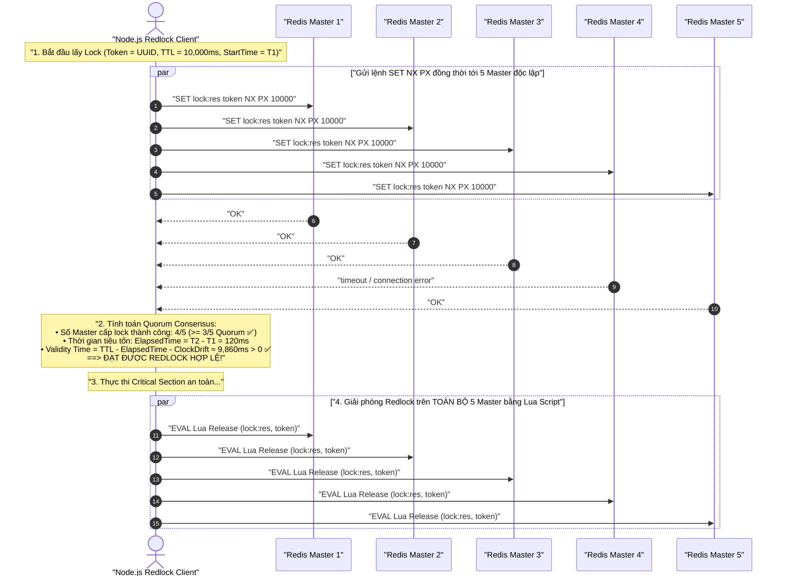

## I. KHÁI QUÁT (OVERVIEW)

### 1. Redis là gì và Vị trí trong Hệ thống Hiện đại
**Redis (Remote Dictionary Server)** là một kho lưu trữ cấu trúc dữ liệu trong bộ nhớ (In-Memory Data Structure Store) mã nguồn mở, hoạt động với hiệu năng cực cao và độ trễ dưới một mili-giây (sub-millisecond latency). Redis có thể được sử dụng linh hoạt như một **Cơ sở dữ liệu (Database)**, **Bộ nhớ đệm (Cache)**, **Hàng đợi tin nhắn (Message Broker)**, và **Bộ điều phối khóa phân tán (Distributed Lock Coordinator)**.



### 2. Kiến trúc Đơn luồng (Single-Threaded Event Loop) & I/O Multiplexing
Một trong những hiểu lầm phổ biến là hệ thống đa luồng (Multi-threaded) luôn nhanh hơn đơn luồng. Redis chứng minh điều ngược lại: bằng cách sử dụng **Single-threaded Event Loop** kết hợp với **I/O Multiplexing**, Redis có thể xử lý hơn 100.000 đến 1.000.000 requests mỗi giây trên một node đơn lẻ.

#### Vì sao Redis chọn mô hình Single-Threaded cho Execution Core?
1. **Loại bỏ hoàn toàn chi phí Context Switching:** Trong CPU, việc chuyển đổi ngữ cảnh giữa hàng ngàn thread tốn rất nhiều chu kỳ CPU (CPU cycles) và làm mất hiệu lực bộ đệm CPU Cache (L1/L2/L3 cache misses).
2. **Không xảy ra Race Condition & Lock Contention nội bộ:** Không cần dùng `pthread_mutex`, semaphore hay spinlocks để bảo vệ các cấu trúc dữ liệu nội bộ. Mọi thao tác ghi/đọc cấu trúc dữ liệu trên RAM đều là nguyên tử (Atomic).
3. **Nghẽn cổ chai của Redis không nằm ở CPU:** Với cơ sở dữ liệu In-memory, điểm nghẽn thực tế là **băng thông bộ nhớ (Memory Bandwidth)** và **băng thông mạng (Network I/O)**, chứ không phải xung nhịp CPU.



> [!NOTE]
> **Redis 6.0+ I/O Threading:** Từ phiên bản 6.0, Redis giới thiệu **I/O Threads đa luồng** (Multi-threaded I/O) để song song hóa việc đọc/ghi dữ liệu từ network socket và giải mã giao thức (protocol parsing). Tuy nhiên, **luồng thực thi lệnh (Core Command Execution Engine)** vẫn hoàn toàn là **Single-Threaded**, đảm bảo tính toàn vẹn và nguyên tử tuyệt đối của dữ liệu.

---

## II. CHI TIẾT KỸ THUẬT (DETAILED DEEP DIVE)

### 1. Cơ chế Lưu trữ Bền vững (Persistence: RDB vs AOF)
Dữ liệu lưu trên RAM sẽ biến mất khi tắt nguồn hoặc tiến trình crash. Để đảm bảo tính bền vững (Durability), Redis cung cấp hai cơ chế lưu trữ xuống ổ đĩa:



#### a. RDB (Redis Database Snapshots)
* **Nguyên lý:** Redis tạo một bản sao lưu nhị phân (Snapshot) toàn bộ dữ liệu tại một thời điểm xác định và lưu vào file nhị phân (mặc định: `dump.rdb`).
* **Cơ chế hoạt động ngầm (Copy-On-Write):** Redis gọi hàm hệ thống `fork()` để tạo ra một tiến trình con (Child Process). Nhờ cơ chế **Copy-On-Write (COW)** của Linux OS, tiến trình con chia sẻ chung các trang bộ nhớ vật lý với tiến trình cha. Tiến trình con chỉ việc tuần tự ghi bộ nhớ này ra đĩa, trong khi tiến trình cha tiếp tục phục vụ client. Nếu cha sửa một trang bộ nhớ, OS mới sao chép riêng trang đó ra cho cha.
* **Ưu điểm:**
  * File RDB cực kỳ gọn nhẹ, tối ưu cho việc tạo backup định kỳ (Disaster Recovery).
  * Tốc độ phục hồi dữ liệu khi restart Redis cực nhanh so với AOF.
* **Nhược điểm:**
  * Có nguy cơ mất dữ liệu: Nếu Redis crash giữa hai chu kỳ snapshot (ví dụ snapshot mỗi 5 phút), toàn bộ dữ liệu trong khoảng thời gian đó sẽ bị mất vĩnh viễn.
  * Tốn tài nguyên khi `fork()` nếu RAM dataset quá lớn (> 20GB-50GB), có thể gây khựng nhẹ (latency spike) vài mili-giây đến hàng trăm mili-giây.

#### b. AOF (Append-Only File)
* **Nguyên lý:** Mỗi khi có lệnh ghi (`SET`, `HSET`, `DEL`...), Redis sẽ ghi log lại chính xác câu lệnh đó vào file nhật ký `appendonly.aof` theo định dạng giao thức RESP.
* **Các chế độ `fsync` (Tần suất đồng bộ đĩa):**
  * `appendfsync always`: Mỗi câu lệnh ghi đều gọi `fsync()` ngay lập tức. Cực kỳ an toàn (không mất dữ liệu) nhưng hiệu năng chậm vì thắt nút cổ chai I/O đĩa.
  * `appendfsync everysec` (**Khuyến nghị chuẩn Production**): Ghi vào buffer và thực hiện `fsync()` định kỳ 1 giây/lần trong background thread. Cân bằng hoàn hảo giữa hiệu năng và an toàn (tối đa mất 1 giây dữ liệu).
  * `appendfsync no`: Để hệ điều hành tự quyết định khi nào flush buffer xuống đĩa (thường là 30 giây). Hiệu năng cao nhất nhưng rủi ro mất nhiều dữ liệu nhất.
* **Cơ chế AOF Rewrite (`BGREWRITEAOF`):** Khi file AOF quá lớn (ví dụ 1000 lệnh `INCR counter` làm file dài 1000 dòng), Redis sẽ tự động chạy tiến trình ngầm để tái tạo file AOF tối giản nhất đại diện cho trạng thái hiện tại (chỉ giữ lại 1 lệnh `SET counter 1000`).

#### c. So sánh Bảng chọn Chiến lược Bền vững

| Tiêu chí | RDB (Snapshot) | AOF (Append Only File) | Hybrid (RDB + AOF từ Redis 4.0+) |
| :--- | :--- | :--- | :--- |
| **Mức độ mất dữ liệu** | Có thể mất vài phút | Tối đa 1 giây (`everysec`) | Tối đa 1 giây |
| **Tốc độ khởi động lại** | Rất nhanh (Binary load) | Chậm (Phải replay toàn bộ log) | Rất nhanh (Load RDB base + replay AOF diff) |
| **Kích thước file** | Rất nhỏ gọn (Binary nén) | Lớn hơn đáng kể | Vừa phải |
| **Tác động hiệu năng** | Khựng khi `fork()` dataset lớn | I/O đĩa liên tục mỗi giây | Tối ưu |
| **Khuyến nghị sử dụng** | Data không cần độ chính xác 100% | Cần bảo vệ dữ liệu tối đa | **Mặc định chuẩn Production hiện đại** |

---

### 2. Cấu trúc Dữ liệu Chuyên sâu (Redis Core Data Structures)

```mermaid
flowchart TD
    root["Redis Data Structures"] --> STR["Strings"]
    root --> HASH["Hashes"]
    root --> LIST["Lists"]
    root --> SET["Sets"]
    root --> ZSET["Sorted Sets (ZSET)"]
    root --> BIT["Bitmaps"]
    root --> HLL["HyperLogLog"]

    STR --> STR1["Text / JSON Caching"]
    STR --> STR2["Atomic Counters INCR"]
    STR --> STR3["Distributed Locks SETNX"]

    HASH --> HASH1["User Profiles"]
    HASH --> HASH2["Shopping Cart"]
    HASH --> HASH3["Object fields storage"]

    LIST --> LIST1["LPUSH / RPOP Message Queue"]
    LIST --> LIST2["Activity Feeds"]
    LIST --> LIST3["Capped Collection LTRIM"]

    SET --> SET1["Unique Tags"]
    SET --> SET2["SINTER Friend Recommendations"]
    SET --> SET3["SISMEMBER Unique Check"]

    ZSET --> ZSET1["Real-time Leaderboard"]
    ZSET --> ZSET2["Rate Limiter Sliding Window"]
    ZSET --> ZSET3["Delayed Task Queue"]

    BIT --> BIT1["User Daily Active Check-in"]
    BIT --> BIT2["Feature Flags"]

    HLL --> HLL1["Unique Visitors Count UV"]
    HLL --> HLL2["Cardinality Estimation 12KB"]
```



#### 1. Strings (Chuỗi nhị phân - Binary Safe)
* **Bản chất:** Giới hạn tối đa 512MB. Là mảng nhị phân nên có thể lưu text thuần, JSON, HTML, hoặc file ảnh/Buffer nhị phân.
* **Lệnh cốt lõi:** `SET`, `GET`, `MSET`, `MGET`, `INCR`, `DECR`, `SETNX`, `SETEX`.
* **Use case:** Caching response, đếm lượt xem (Atomic Counter), Rate Limiter cơ bản.

#### 2. Hashes (Bảng băm trường - giá trị)
* **Bản chất:** Là một bảng ánh xạ giữa các field và value bên trong một key (tương tự một Object trong JS).
* **Tối ưu RAM:** Nếu số lượng field nhỏ và độ dài ngắn, Redis sử dụng cấu trúc `listpack` (hoặc `ziplist` ở bản cũ) để nén dữ liệu liên tục trong RAM, tiết kiệm bộ nhớ hơn 50-70% so với việc lưu JSON String phẳng.
* **Lệnh cốt lõi:** `HSET`, `HGET`, `HMGET`, `HGETALL`, `HDEL`, `HINCRBY`.
* **Use case:** Lưu thông tin tài khoản User (`user:1000` -> `{ name: "An", role: "admin", points: 50 }`), Giỏ hàng thương mại điện tử.

#### 3. Lists (Danh sách liên kết đôi - Linked List / Quicklist)
* **Bản chất:** Danh sách các chuỗi sắp xếp theo thứ tự thêm vào. Thêm và xóa ở 2 đầu (Head/Tail) đạt độ phức tạp $O(1)$.
* **Lệnh cốt lõi:** `LPUSH`, `RPUSH`, `LPOP`, `RPOP`, `BRPOP` (Blocking Pop), `LRANGE`, `LTRIM`.
* **Use case:** Hàng đợi tin nhắn đơn giản (Simple Job Queue với `LPUSH` + `BRPOP`), Feed hoạt động mới nhất (Latest 100 activities với `LTRIM`).

#### 4. Sets (Tập hợp không trùng lặp & Không thứ tự)
* **Bản chất:** Lưu trữ tập hợp các chuỗi duy nhất dựa trên bảng băm. Tìm kiếm phần tử `SISMEMBER` đạt $O(1)$.
* **Phép toán tập hợp:** Hỗ trợ giao nhau (`SINTER`), hợp (`SUNION`), và hiệu (`SDIFF`) cực nhanh ở phía server.
* **Lệnh cốt lõi:** `SADD`, `SREM`, `SMEMBERS`, `SISMEMBER`, `SCARD`, `SINTER`.
* **Use case:** Tagging hệ thống bài viết, Bạn chung trên mạng xã hội (`SINTER user:1:friends user:2:friends`), Lọc trùng IP/Vote.

#### 5. Sorted Sets (ZSET - Tập hợp có sắp xếp theo Điểm số)
* **Bản chất:** Mỗi phần tử là duy nhất nhưng gắn liền với một số thực gọi là **Score** (Điểm số).
* **Cấu trúc dữ liệu ngầm:** Kết hợp giữa **SkipList (Bảng nhảy)** và **Hash Table**. Nhờ đó, thao tác thêm, xóa, tìm kiếm phần tử theo điểm đều đạt $O(\log N)$.
* **Lệnh cốt lõi:** `ZADD`, `ZREM`, `ZRANGE`, `ZREVRANGE`, `ZRANGEBYSCORE`, `ZRANK`, `ZINCRBY`.
* **Use case:** Bảng xếp hạng Real-time Game/E-commerce (Leaderboard), Hàng đợi tác vụ hẹn giờ (Delayed Task Queue - Score là Timestamp thực thi), Giới hạn tần suất trượt (Sliding Window Rate Limiter).

#### 6. Bitmaps (Mảng Bit nhị phân)
* **Bản chất:** Không phải cấu trúc dữ liệu riêng mà là các thao tác cấp độ Bit trên `Strings`. Mỗi bit nhận giá trị `0` hoặc `1`.
* **Hiệu quả bộ nhớ:** 1 Byte = 8 bits. Để theo dõi trạng thái điểm danh của 1.000.000 người dùng mỗi ngày chỉ tốn:
  $$\frac{1.000.000 \text{ bits}}{8 \times 1024} \approx 122 \text{ KB RAM!}$$
* **Lệnh cốt lõi:** `SETBIT`, `GETBIT`, `BITCOUNT`, `BITOP` (AND, OR, XOR, NOT).
* **Use case:** Điểm danh người dùng hàng ngày (Daily User Check-in), Thống kê Daily Active Users (DAU), Feature Flags người dùng.

#### 7. HyperLogLog (Ước lượng tập hợp lực lượng lớn)
* **Bản chất:** Cấu trúc dữ liệu xác suất (Probabilistic Data Structure) dùng để đếm số lượng phần tử phân biệt (Cardinality Estimation).
* **Ưu điểm tuyệt đối:** Bất kể bạn đếm 100 hay 10 tỷ phần tử duy nhất, HyperLogLog chỉ tiêu tốn cố định **tối đa 12KB RAM** với độ lệch chuẩn sai số cực nhỏ chỉ **~0.81%**.
* **Lệnh cốt lõi:** `PFADD`, `PFCOUNT`, `PFMERGE`.
* **Use case:** Đếm số lượng Unique Visitors (UV) của website hàng triệu lượt truy cập mỗi ngày, đếm số lượt tìm kiếm từ khóa duy nhất.

---

### 3. Các Chiến lược Caching (Caching Strategies)



#### a. Cache-Aside (Lazy Loading - Phổ biến nhất)
* **Cơ chế:** Ứng dụng chịu trách nhiệm điều phối. Khi đọc: Kiểm tra Cache -> Nếu Hit: Trả về -> Nếu Miss: Đọc Database, ghi ngược lại Cache với TTL, sau đó trả về. Khi ghi: Cập nhật Database, sau đó xóa (Invalidate) Cache Key tương ứng.
* **Ưu điểm:** Chỉ cache dữ liệu thực sự được yêu cầu (tiết kiệm RAM); hệ thống vẫn hoạt động (chậm hơn) nếu Redis tạm thời sập.
* **Nhược điểm:** Phải chịu độ trễ cho lần đọc đầu tiên (Cold Start / Cache Miss).



#### b. Write-Through
* **Cơ chế:** Ứng dụng luôn ghi vào Cache. Tầng Cache đảm nhận việc ghi đồng bộ vào Database trước khi báo thành công cho ứng dụng.
* **Ưu điểm:** Dữ liệu trong Cache luôn mới nhất, không bao giờ bị Cache Miss cho dữ liệu mới ghi.
* **Nhược điểm:** Tăng độ trễ khi ghi (phải chờ cả Cache lẫn DB xác nhận).

#### c. Write-Back (Write-Behind)
* **Cơ chế:** Ứng dụng ghi vào Cache và nhận phản hồi thành công ngay lập tức. Sau đó, Cache gom dữ liệu theo lô (batch) và ghi bất đồng bộ (Asynchronously) xuống Database.
* **Ưu điểm:** Tốc độ ghi siêu nhanh, chịu tải ghi khổng lồ (Ví dụ: lượt like, view, IoT Sensor).
* **Nhược điểm:** Rủi ro mất mát dữ liệu cao nếu Redis server bị sập đột ngột trước khi kịp xả buffer xuống Database.

#### d. Write-Around
* **Cơ chế:** Dữ liệu được ghi thẳng vào Database, hoàn toàn bỏ qua Cache. Cache chỉ được nạp dữ liệu khi có truy vấn đọc tiếp theo (theo cơ chế Cache-Aside).
* **Ưu điểm:** Tránh làm tràn ngập bộ nhớ đệm với các dữ liệu chỉ ghi một lần và hiếm khi đọc lại (Write-heavy, low-read data như log, sao kê ngân hàng cũ).

---

### 4. Các Vấn đề Lớn trong Caching và Giải pháp Xử lý Triệt để



#### 1. Cache Penetration (Thủng Cache)
* **Hiện tượng:** Kẻ tấn công hoặc người dùng truy vấn liên tục các khóa **hoàn toàn không tồn tại** trong cả Cache lẫn Database (Ví dụ: `GET /products?id=-99999` hoặc chuỗi UUID ngẫu nhiên). Vì Cache không có, mọi truy vấn đều đâm thẳng xuống Database, khiến Database quá tải và sập.
* **Giải pháp 1: Cache Null Value (Lưu giá trị rỗng có TTL ngắn):**
  * Khi Database trả về `null` / `not found`, lưu `key: null` vào Redis với TTL ngắn (ví dụ: 30 - 60 giây). Các request sau sẽ bị chặn lại ở Redis.
* **Giải pháp 2: Bloom Filter (Bộ lọc xác suất Bloom):**
  * Đặt một Bloom Filter phía trước Redis chứa tất cả các `id` hợp lệ. Nếu Bloom Filter báo "Chắc chắn không tồn tại", lập tức trả về 404 mà không cần đụng tới Redis hay Database.

#### 2. Cache Avalanche (Tuyết lở Cache)
* **Hiện tượng:** Một lượng lớn các Cache Key cùng được cài đặt một thời gian hết hạn (TTL) giống hệt nhau (ví dụ: cache 10.000 sản phẩm với TTL đúng 1 giờ). Đến thời điểm hết hạn, toàn bộ 10.000 key đồng loạt biến mất, hàng triệu request ập vào Database cùng một giây làm sập toàn bộ hệ thống. Hoặc xảy ra khi toàn bộ cụm Redis bị sập.
* **Giải pháp 1: TTL Jitter (Ngẫu nhiên hóa TTL):**
  * Không set cứng TTL, mà cộng thêm một khoảng ngẫu nhiên (Jitter).
  $$\text{Final TTL} = \text{Base TTL} + \text{random}(0, \text{Jitter Range})$$
  * Ví dụ: Base TTL = 3600s, Jitter = 300s $\rightarrow$ TTL sẽ phân tán đều từ 3600s đến 3900s.
* **Giải pháp 2: Thiết lập Cụm Redis Độ sẵn sàng cao (High Availability):**
  * Sử dụng **Redis Sentinel** hoặc **Redis Cluster** với mô hình Master-Replica và tự động chuyển đổi dự phòng (Automatic Failover).

#### 3. Cache Stampede / Thundering Herd (Giẫm đạp Cache / Đàn bò hoảng loạn)
* **Hiện tượng:** Xảy ra với một **Hot Key** (Ví dụ: Dữ liệu trang chủ, Thông tin đợt Flash Sale). Khi Hot Key này vừa hết hạn, trong đúng mili-giây đó có 10.000 concurrent requests ập đến. Tất cả đều thấy Cache Miss và đồng loạt thực hiện câu truy vấn SQL cực nặng xuống Database để tính toán và ghi lại cache.
* **Giải pháp 1: Distributed Mutex Lock (Khóa tương hỗ phân tán):**
  * Khi Cache Miss, request đầu tiên phải giành được Mutex Lock trên Redis (`SET lock:key token NX PX 5000`).
  * Chỉ duy nhất luồng giữ lock mới được phép truy vấn Database và cập nhật Cache.
  * 9.999 luồng còn lại không lấy được lock sẽ tạm dừng (`sleep 50ms`) rồi đọc lại Cache.
* **Giải pháp 2: Early Background Refresh (XFetch Algorithm):**
  * Thuật toán xác suất tính toán thời gian sắp hết hạn dựa trên thời gian tính toán DB và tần suất đọc để chủ động nạp lại cache ngầm trước khi key thực sự hết hạn.

---

### 5. Chính sách Thu hồi Bộ nhớ (Eviction Policies)

Khi Redis đạt tới giới hạn bộ nhớ cấu hình (`maxmemory`), nó bắt buộc phải giải phóng dữ liệu cũ để nạp dữ liệu mới theo chính sách được cấu hình:



* **`noeviction` (Mặc định):** Không xóa bất kỳ dữ liệu nào. Khi đầy RAM, mọi lệnh ghi mới sẽ trả về lỗi `OOM command not allowed when used memory > 'maxmemory'`. Thích hợp khi dùng Redis làm Database chính.
* **`allkeys-lru` (Least Recently Used):** Xóa các key có thời gian truy cập gần nhất lâu nhất trong toàn bộ cơ sở dữ liệu. **(Khuyến nghị cho tầng Caching tổng quát)**.
* **`allkeys-lfu` (Least Frequently Used):** Xóa các key có tần suất truy cập thấp nhất. Khác với LRU, LFU bảo vệ các Hot Key dù lâu rồi chưa đọc trong vài giây qua nhưng lịch sử được gọi hàng triệu lần.
* **`volatile-lru` / `volatile-lfu`:** Giống trên nhưng chỉ áp dụng trên tập hợp các key có cài đặt TTL (`EXPIRE`).
* **`volatile-ttl`:** Ưu tiên xóa các key có thời gian sống (TTL) còn lại ngắn nhất.

---

### 6. Khóa Phân tán (Distributed Locking with Redis)

Trong hệ thống Microservices hoặc nhiều Node.js Worker chạy song song, cơ chế khóa nội bộ của JavaScript (như Mutex trong RAM) là vô dụng vì các tiến trình nằm trên các máy chủ vật lý khác nhau. Chúng ta cần một **Distributed Lock** tập trung.



#### Quy tắc Cốt lõi của một Distributed Lock An Toàn:
1. **Mutual Exclusion (Độc quyền tương hỗ):** Tại một thời điểm, chỉ một client duy nhất nắm giữ lock.
2. **Deadlock Free (Chống khóa chết):** Lock luôn luôn phải có TTL (`PX milliseconds`). Nếu client giữ lock bị crash hoặc mất điện, lock sẽ tự động hết hạn và giải phóng.
3. **Fault Tolerance (Chống xóa nhầm của người khác):**
   * **Kịch bản hiểm họa:** Node A lấy lock (TTL 5s). Node A bị tắc nghẽn Garbage Collection hoặc truy vấn chậm mất 7s. Lock tự hết hạn. Node B nhảy vào lấy lock. Lúc này Node A xử lý xong, gọi lệnh `DEL lock`. Nếu không có định danh an toàn, Node A sẽ **xóa mất lock của Node B**, cho phép Node C nhảy vào tạo thành 2 tiến trình chạy song song!
   * **Giải pháp:** Giá trị gán vào lock phải là một chuỗi ngẫu nhiên duy nhất (UUID v4 + Worker ID). Khi mở khóa, bắt buộc phải dùng **Lua Script** để kiểm tra `GET key == token` thì mới thực hiện `DEL`.

#### Thuật toán Redlock (Redlock Algorithm cho Cụm Multi-Master)
Khi Redis chạy trong cụm phân tán gồm $N$ Redis Master độc lập (thường là 5 nodes không replica lẫn nhau):
* Client lấy timestamp hiện tại ($T_1$).
* Cố gắng lấy lock trên tuần tự hoặc song song $N$ nodes với cùng một key và token ngẫu nhiên.
* Khóa được coi là thành công nếu client lấy được lock trên **đa số** node ($N/2 + 1$, tức ít nhất 3/5 nodes) và tổng thời gian lấy lock ($T_2 - T_1$) nhỏ hơn thời gian hiệu lực của lock ($TTL$).
* Nếu thất bại, client lập tức mở khóa (Unlock via Lua) trên **toàn bộ** các nodes.



---

## III. VÍ DỤ MINH HỌA VÀ PHÂN TÍCH CODE (CODE ANALYSIS)

Dưới đây là mã nguồn TypeScript sản xuất chuyên sâu sử dụng thư viện `ioredis`.

### 1. Khởi tạo Redis Client với Cơ chế Tự phục hồi Kết nối

```typescript
// ==============================================================
// File: src/config/redis.config.ts
// Cấu hình Redis Client chuẩn Production với Retry Strategy
// ==============================================================
import Redis, { RedisOptions } from 'ioredis';

const redisOptions: RedisOptions = {
  host: process.env.REDIS_HOST || '127.0.0.1',
  port: Number(process.env.REDIS_PORT) || 6379,
  password: process.env.REDIS_PASSWORD || undefined,
  db: 0,
  maxRetriesPerRequest: 3,
  enableReadyCheck: true,
  // Chiến lược tái kết nối thông minh với Exponential Backoff
  retryStrategy(times: number) {
    const delay = Math.min(times * 100, 3000);
    console.warn(`[Redis] Đang thử kết nối lại lần ${times} sau ${delay}ms...`);
    return delay;
  },
  reconnectOnError(err) {
    const targetError = 'READONLY';
    if (err.message.includes(targetError)) {
      // Tự động kết nối lại nếu Master chuyển thành Readonly (do Failover)
      return true;
    }
    return false;
  },
};

export const redisClient = new Redis(redisOptions);

redisClient.on('connect', () => console.log('✅ [Redis] Đã kết nối TCP tới Redis'));
redisClient.on('ready', () => console.log('🚀 [Redis] Server sẵn sàng nhận lệnh'));
redisClient.on('error', (err) => console.error('❌ [Redis Error]:', err.message));
```

---

### 2. Triển khai Cache-Aside Pattern Toàn Diện (Chống Avalanche, Penetration & Stampede)

```typescript
// ==============================================================
// File: src/services/cache-aside.service.ts
// Service Caching cao cấp tích hợp Mutex Lock và Jitter TTL
// ==============================================================
import { redisClient } from '../config/redis.config';
import { randomUUID } from 'crypto';

interface CacheOptions {
  ttlSeconds: number;
  jitterSeconds?: number;
  cacheNull?: boolean;
  nullTtlSeconds?: number;
}

export class AdvancedCacheService {
  /**
   * Phương thức Get-or-Set với khả năng chống sập toàn diện:
   * 1. Thủng cache (Penetration) -> Lưu Placeholder Null.
   * 2. Tuyết lở (Avalanche) -> Tính toán TTL Jitter ngẫu nhiên.
   * 3. Giẫm đạp cache (Stampede) -> Sử dụng Redis Mutex Lock cho luồng đầu tiên.
   */
  public static async getOrSet<T>(
    key: string,
    fetcher: () => Promise<T>,
    options: CacheOptions
  ): Promise<T | null> {
    const {
      ttlSeconds,
      jitterSeconds = 30,
      cacheNull = true,
      nullTtlSeconds = 60,
    } = options;

    // BƯỚC 1: Đọc từ Cache
    const cachedData = await redisClient.get(key);

    if (cachedData !== null) {
      if (cachedData === '__REDIS_NULL_PLACEHOLDER__') {
        // Ngăn chặn Cache Penetration: Dữ liệu này chắc chắn không tồn tại trong DB
        return null;
      }
      return JSON.parse(cachedData) as T;
    }

    // BƯỚC 2: Xử lý Cache Stampede bằng Mutex Lock
    const lockKey = `lock:${key}`;
    const lockToken = randomUUID();
    const lockTtlMs = 5000; // Giữ lock tối đa 5 giây phòng ngừa worker crash

    // Cố gắng giành quyền truy vấn DB (SET NX PX)
    const acquiredLock = await redisClient.set(lockKey, lockToken, 'PX', lockTtlMs, 'NX');

    if (acquiredLock === 'OK') {
      try {
        // Luồng chiến thắng: Truy vấn Database gốc
        const freshData = await fetcher();

        if (freshData === null || freshData === undefined) {
          if (cacheNull) {
            // Lưu placeholder tránh penetration
            await redisClient.set(key, '__REDIS_NULL_PLACEHOLDER__', 'EX', nullTtlSeconds);
          }
          return null;
        }

        // Tính toán TTL Jitter chống Cache Avalanche
        const jitter = Math.floor(Math.random() * jitterSeconds);
        const finalTtl = ttlSeconds + jitter;

        await redisClient.set(key, JSON.stringify(freshData), 'EX', finalTtl);
        return freshData;
      } finally {
        // Giải phóng lock an toàn bằng Lua script
        await this.releaseLock(lockKey, lockToken);
      }
    } else {
      // Các luồng còn lại không giành được lock: Tạm dừng và thử đọc lại Cache
      await new Promise((resolve) => setTimeout(resolve, 100));
      return this.getOrSet(key, fetcher, options);
    }
  }

  private static async releaseLock(lockKey: string, lockToken: string): Promise<boolean> {
    // Lua script: Chỉ xóa khi token trùng khớp
    const luaScript = `
      if redis.call("get", KEYS[1]) == ARGV[1] then
        return redis.call("del", KEYS[1])
      else
        return 0
      end
    `;
    const result = await redisClient.eval(luaScript, 1, lockKey, lockToken);
    return result === 1;
  }
}
```

---

### 3. Hiện thực hóa Distributed Lock Manager Chuyên nghiệp

```typescript
// ==============================================================
// File: src/services/distributed-lock.service.ts
// Bộ quản lý Distributed Lock với Auto Renewal & Safe Release
// ==============================================================
import { redisClient } from '../config/redis.config';
import { randomBytes } from 'crypto';

export interface LockHandle {
  resource: string;
  token: string;
  ttlMs: number;
}

export class DistributedLockService {
  private static readonly RELEASE_LUA = `
    if redis.call("get", KEYS[1]) == ARGV[1] then
      return redis.call("del", KEYS[1])
    else
      return 0
    end
  `;

  private static readonly EXTEND_LUA = `
    if redis.call("get", KEYS[1]) == ARGV[1] then
      return redis.call("pexpire", KEYS[1], ARGV[2])
    else
      return 0
    end
  `;

  /**
   * Giành quyền sở hữu Lock với cơ chế Retry có giới hạn
   */
  public static async acquire(
    resource: string,
    ttlMs = 10000,
    retryCount = 5,
    retryDelayMs = 200
  ): Promise<LockHandle | null> {
    const lockKey = `dlock:${resource}`;
    const token = randomBytes(16).toString('hex');

    for (let attempt = 1; attempt <= retryCount; attempt++) {
      const result = await redisClient.set(lockKey, token, 'PX', ttlMs, 'NX');

      if (result === 'OK') {
        return { resource, token, ttlMs };
      }

      // Thêm jitter nhỏ vào khoảng thời gian delay để chống retry đồng loạt
      const jitter = Math.floor(Math.random() * 50);
      await new Promise((resolve) => setTimeout(resolve, retryDelayMs + jitter));
    }

    return null;
  }

  /**
   * Mở khóa an toàn bằng Lua script
   */
  public static async release(lock: LockHandle): Promise<boolean> {
    const lockKey = `dlock:${lock.resource}`;
    const result = await redisClient.eval(this.RELEASE_LUA, 1, lockKey, lockTokenToString(lock.token));
    return result === 1;
  }

  /**
   * Gia hạn thời gian sống cho Lock (Heartbeat / Watchdog Pattern)
   */
  public static async extend(lock: LockHandle, extraTtlMs: number): Promise<boolean> {
    const lockKey = `dlock:${lock.resource}`;
    const result = await redisClient.eval(this.EXTEND_LUA, 1, lockKey, lock.token, extraTtlMs);
    return result === 1;
  }

  /**
   * Wrapper Helper: Tự động khóa, chạy logic nghiệp vụ và tự động giải phóng
   */
  public static async runWithLock<T>(
    resource: string,
    ttlMs: number,
    task: () => Promise<T>
  ): Promise<T> {
    const lock = await this.acquire(resource, ttlMs);
    if (!lock) {
      throw new Error(`[DistributedLock] Không thể giành quyền kiểm soát tài nguyên: ${resource}`);
    }

    try {
      return await task();
    } finally {
      await this.release(lock);
    }
  }
}

function lockTokenToString(token: string): string {
  return token;
}
```

---

### 4. Triển khai Real-Time Leaderboard với Sorted Sets (ZSET)

```typescript
// ==============================================================
// File: src/services/leaderboard.service.ts
// Bảng xếp hạng điểm số thời gian thực hàng triệu người dùng
// ==============================================================
import { redisClient } from '../config/redis.config';

export class LeaderboardService {
  private static readonly LEADERBOARD_KEY = 'leaderboard:global_rank';

  // Cập nhật điểm số người dùng (Atomic Increment)
  public static async addScore(userId: string, points: number): Promise<number> {
    const newScore = await redisClient.zincrby(this.LEADERBOARD_KEY, points, userId);
    return parseFloat(newScore);
  }

  // Lấy thứ hạng của một người dùng cụ thể (0-indexed -> 1-indexed)
  public static async getUserRank(userId: string): Promise<{ rank: number | null; score: number | null }> {
    const [rank, score] = await Promise.all([
      redisClient.zrevrank(this.LEADERBOARD_KEY, userId),
      redisClient.zscore(this.LEADERBOARD_KEY, userId),
    ]);

    return {
      rank: rank !== null ? rank + 1 : null, // Đổi sang hạng 1-based
      score: score !== null ? parseFloat(score) : null,
    };
  }

  // Lấy danh sách Top N người dùng điểm cao nhất
  public static async getTopUsers(topN = 10): Promise<Array<{ userId: string; score: number; rank: number }>> {
    // WITHSCORES trả về mảng phẳng: ['user1', '100', 'user2', '90', ...]
    const rawResults = await redisClient.zrevrange(this.LEADERBOARD_KEY, 0, topN - 1, 'WITHSCORES');
    const leaderboard: Array<{ userId: string; score: number; rank: number }> = [];

    for (let i = 0; i < rawResults.length; i += 2) {
      leaderboard.push({
        rank: i / 2 + 1,
        userId: rawResults[i],
        score: parseFloat(rawResults[i + 1]),
      });
    }

    return leaderboard;
  }
}
```

---

## IV. LƯU Ý, CẠM BẪY VÀ QUY TẮC CỐT LÕI (BEST PRACTICES)

> [!CAUTION]
> ### 1. Tuyệt đối CẤM sử dụng lệnh `KEYS *` trên môi trường Production
> Lệnh `KEYS pattern` duyệt qua toàn bộ database để tìm kiếm. Vì Redis là **Single-Threaded**, nếu hệ thống có 50.000.000 keys, lệnh này sẽ làm block (đóng băng) toàn bộ Redis Server trong vài giây đến vài phút. Tất cả API của toàn bộ công ty sẽ bị timeout hàng loạt.
> * **Giải pháp chuẩn:** Luôn luôn sử dụng lệnh con trỏ không khóa **`SCAN`** (`HSCAN`, `SSCAN`, `ZSCAN`) để duyệt từng đợt dữ liệu nhỏ (chunked iteration).

> [!WARNING]
> ### 2. Cạm bẫy "Big Key" (Dữ liệu đơn lẻ kích thước khổng lồ)
> Một Hash hay List chứa hàng trăm ngàn phần tử (ví dụ: Hash 500MB) được gọi là Big Key.
> * Khi gọi `HGETALL` hoặc `DEL big_key`, Redis sẽ tốn rất nhiều thời gian CPU để giải phóng bộ nhớ, gây nghẽn Event Loop.
> * **Quy tắc cốt lõi:** Giới hạn mỗi collection dưới 5.000 - 10.000 phần tử. Nếu cần xóa Big Key, hãy dùng **`UNLINK`** (xóa bất đồng bộ trong background thread) thay vì `DEL`.

> [!IMPORTANT]
> ### 3. Luôn luôn gán thời gian sống (TTL) cho mọi Cache Key
> Không bao giờ để dữ liệu cache tồn tại vĩnh viễn (`TTL = -1`) trừ khi có lý do kiến trúc đặc biệt. Việc thiếu TTL sẽ dần dần làm đầy RAM, kích hoạt Eviction Policy không mong muốn và gây phân mảnh bộ nhớ (Memory Fragmentation).

> [!TIP]
> ### 4. Tối ưu Serialization / Deserialization trong Node.js
> Lệnh `JSON.stringify()` và `JSON.parse()` chạy đồng bộ trên Main Thread của Node.js. Với các JSON Object kích thước lớn (> 1MB), việc parse JSON liên tục hàng ngàn lần mỗi giây sẽ làm bão hòa CPU của Node.js.
> * Hãy chỉ cache các trường thực sự cần thiết, hoặc sử dụng các bộ tuần tự hóa nhị phân tốc độ cao như **MessagePack (`msgpackr`)** hoặc **Protocol Buffers**.
