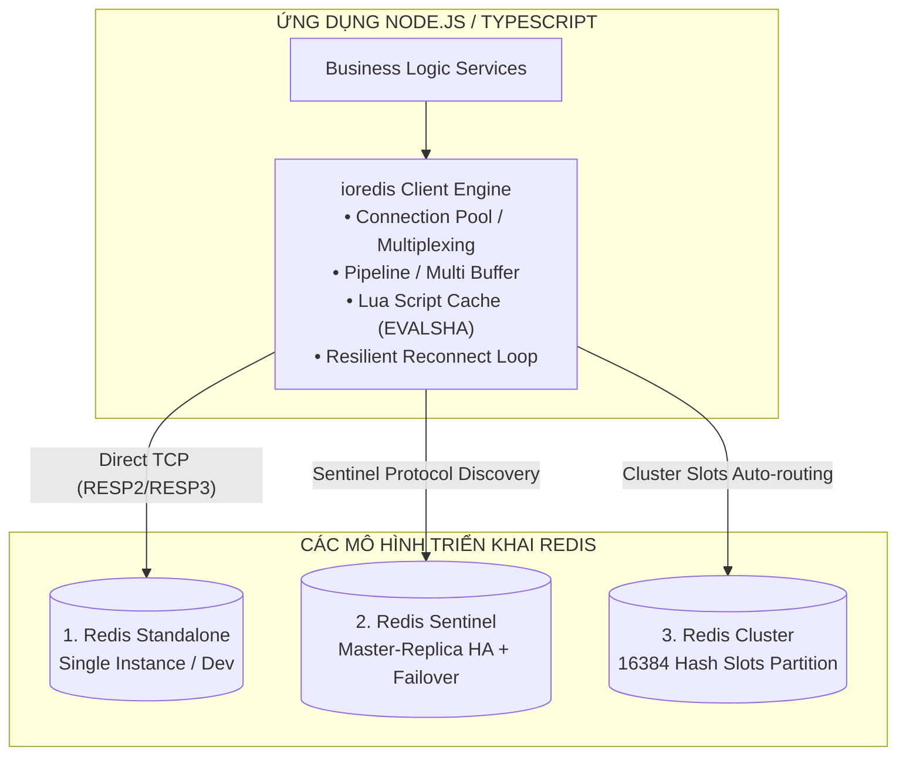
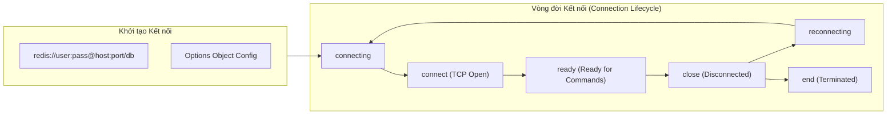
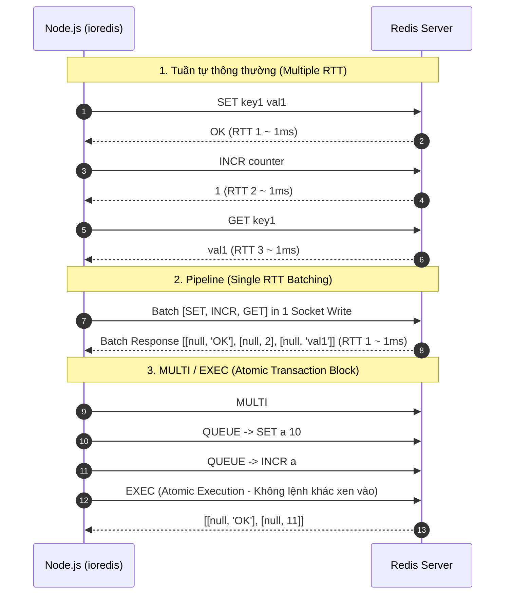
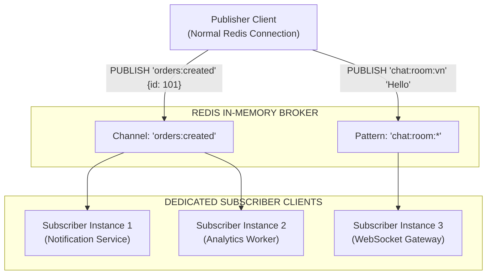
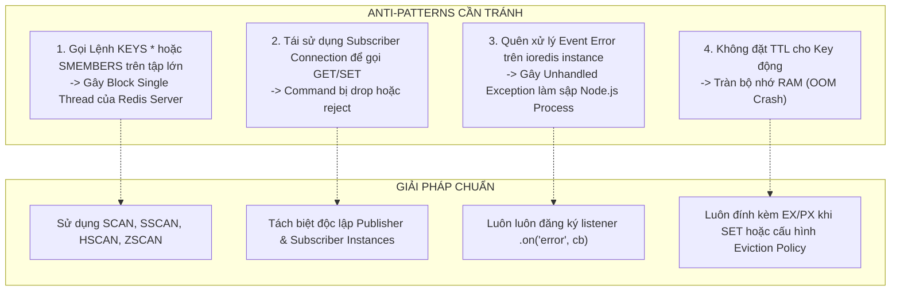

## I. KHÁI QUÁT (OVERVIEW)

### 1. Giới thiệu về `ioredis` và Vị trí trong Hệ sinh thái Node.js
Trong thế giới Node.js, việc tương tác với Redis Server đòi hỏi một thư viện Client mạnh mẽ, có độ trễ cực thấp, hỗ trợ đầy đủ các tính năng nâng cao và tương thích hoàn hảo với TypeScript. **`ioredis`** là thư viện client Redis chuẩn công nghiệp (battle-tested), được tin dùng hàng đầu trong các hệ sinh thái backend quy mô lớn (như các framework BullMQ, NestJS, AdonisJS, microservices) nhờ những ưu điểm vượt trội:

- **Hỗ trợ toàn diện các kiến trúc Redis:** Standalone (Node đơn lẻ), Sentinel (High Availability tự động chuyển đổi Master-Slave), và Redis Cluster (Sharding dữ liệu phân tán trên nhiều node).
- **Thiết kế tối ưu cho Asynchronous & Promises:** Tích hợp 100% Promise/async-await bản địa, cho phép viết code phi đồng bộ mạch lạc và xử lý lỗi chuẩn xác.
- **Pipeline & Transaction mượt mà:** Khả năng gom cụm hàng ngàn câu lệnh trong một lượt truyền mạng (RTT - Round Trip Time) giúp tăng thông lượng xử lý lên gấp hàng chục lần.
- **Khả năng mở rộng qua Lua Scripting:** Tự động đăng ký các custom command thông qua Lua scripts với cơ chế quản lý mã hash `EVALSHA` tự động.
- **Hệ thống phục hồi kết nối bền bỉ (Resilient Reconnection):** Tùy biến linh hoạt chiến lược kết nối lại (`retryStrategy`) khi có sự cố mạng hoặc chuyển dịch node master.



---

### 2. So sánh `ioredis` và `node-redis` (redis npm package)
Cả hai đều là những thư viện phổ biến, nhưng `ioredis` chiếm ưu thế trong các hệ thống phân tán phức tạp nhờ thiết kế hướng kiến trúc:

| Tiêu chí | `ioredis` | `node-redis` (phiên bản v4+) |
| :--- | :--- | :--- |
| **Redis Cluster Support** | Cực kỳ ổn định, tự động cập nhật slots mapping, hỗ trợ lệnh phân tán phức tạp | Hỗ trợ cluster nhưng cấu hình và xử lý MOVED/ASK redirect thủ công hơn |
| **Redis Sentinel Support** | Tích hợp sẵn chuẩn mực (Native Sentinel Failover Discovery) | Hỗ trợ cơ bản, cần thêm wrapper xử lý khi failover phức tạp |
| **Lua Script Custom Commands** | Hỗ trợ hàm `redis.defineCommand()` cực kỳ trực quan, tự động tính SHA | Hỗ trợ qua `scripts` configuration |
| **Prefix Key (`keyPrefix`)** | Tự động thêm prefix vào tất cả các lệnh dữ liệu và Lua script | Cần cấu hình prefix qua middleware hoặc xử lý thủ công |
| **Hệ sinh thái hàng đợi (Bull/BullMQ)** | Là client **bắt buộc mặc định** của BullMQ nhờ khả năng quản lý connection chuẩn | Ít được các queue framework ưu tiên |
| **Chế độ Drop-in Pipelining** | Hỗ trợ song song pipeline và multi độc lập, API tường minh | Hỗ trợ `.multi()` cho cả pipeline và transaction |

---

## II. CHI TIẾT KỸ THUẬT (TECHNICAL DETAILS)

### 1. Khởi tạo Kết nối & Cấu hình Chuyên sâu (Connection & Configurations)

`ioredis` hỗ trợ khởi tạo kết nối thông qua Connection String (URI) hoặc Options Object với hàng loạt tham số tinh chỉnh chuyên sâu.



#### A. Cấu hình Standalone Instance (Cơ bản & Nâng cao)

```typescript
import Redis, { RedisOptions } from 'ioredis';

// 1. Khởi tạo qua URI
const redisFromUri = new Redis('redis://:MySecurePassword@127.0.0.1:6379/0');

// 2. Khởi tạo qua Options Object toàn diện cho Production
const redisConfig: RedisOptions = {
  host: process.env.REDIS_HOST || '127.0.0.1',
  port: Number(process.env.REDIS_PORT) || 6379,
  username: process.env.REDIS_USERNAME || 'default', // Hỗ trợ Redis 6+ ACL
  password: process.env.REDIS_PASSWORD || 'SecretAuth123',
  db: 0, // Logical database index (0 - 15)
  keyPrefix: 'ecommerce:prod:', // Tự động gắn tiền tố vào mọi key thao tác
  connectionName: 'api-gateway-service', // Đặt tên định danh trên Redis Server (CLIENT LIST)
  connectTimeout: 10000, // Timeout kết nối ban đầu (10s)
  lazyConnect: true, // Không kết nối ngay khi khởi tạo, chờ gọi .connect() thủ công
  maxRetriesPerRequest: 3, // Số lần retry tối đa cho 1 lệnh khi mất kết nối (null: retry vô hạn)
  enableReadyCheck: true, // Kiểm tra trạng thái INFO server trước khi chuyển sang event 'ready'
  autoResubscribe: true, // Tự động đăng ký lại các Pub/Sub channel sau khi reconnect
  autoResendUnfulfilledCommands: true, // Gửi lại các lệnh đang nằm trong hàng đợi khi reconnect

  // Chiến lược kết nối lại (Exponential Backoff với Jitter)
  retryStrategy(times: number) {
    if (times > 10) {
      // Dừng thử lại sau 10 lần thất bại, chuyển lỗi cho application xử lý
      return null;
    }
    // Độ trễ tăng dần: 50ms, 100ms, 200ms... tối đa 3000ms + ngẫu nhiên để tránh Thundering Herd
    const delay = Math.min(times * 100, 3000) + Math.floor(Math.random() * 200);
    return delay;
  },

  // Tái kết nối có điều kiện theo lỗi
  reconnectOnError(err: Error) {
    const targetError = 'READONLY';
    if (err.message.includes(targetError)) {
      // Khi gặp lỗi READONLY (do Master bị failover thành Replica), buộc client reconnect tìm Master mới
      return true; // 1 hoặc true: reconnect và gửi lại lệnh
    }
    return false;
  },
};

export const redisClient = new Redis(redisConfig);
```

#### B. Cấu hình High-Availability qua Redis Sentinel
Mô hình Sentinel tự động phát hiện node Master hiện tại, tự động failover và cập nhật địa chỉ Master mới cho `ioredis` mà ứng dụng không cần khởi động lại.

```typescript
import Redis from 'ioredis';

const sentinelRedis = new Redis({
  sentinels: [
    { host: 'sentinel-node-1.internal', port: 26379 },
    { host: 'sentinel-node-2.internal', port: 26379 },
    { host: 'sentinel-node-3.internal', port: 26379 },
  ],
  name: 'mymaster', // Tên cụm Master được khai báo trong sentinel.conf
  password: 'MasterNodePassword', // Mật khẩu của Redis Master/Replica
  sentinelPassword: 'SentinelAuthPassword', // Mật khẩu truy cập các node Sentinel (nếu có)
  db: 0,
  role: 'master', // 'master' để thực hiện ghi/đọc, hoặc 'slave'/'replica' cho các tác vụ chỉ đọc
  preferredSlaves: [
    // Ưu tiên đọc từ replica cụ thể (khi role = 'slave')
    { host: 'replica-local-az.internal', port: 6379, prio: 1 },
  ],
});
```

#### C. Cấu hình Phân tán qua Redis Cluster
Redis Cluster chia toàn bộ không gian dữ liệu thành **16384 Hash Slots**. `ioredis` tự động truy vấn cấu hình bảng băm (slots mapping), định tuyến lệnh trực tiếp đến đúng Node lưu giữ key và xử lý mã điều hướng `MOVED` / `ASK`.

```typescript
import Redis from 'ioredis';

const clusterNodes = [
  { host: 'cluster-node-1.internal', port: 6379 },
  { host: 'cluster-node-2.internal', port: 6379 },
  { host: 'cluster-node-3.internal', port: 6379 },
];

const clusterClient = new Redis.Cluster(clusterNodes, {
  clusterRetryStrategy(times: number) {
    return Math.min(times * 100, 3000);
  },
  enableOfflineQueue: true, // Xếp hàng các lệnh trong thời gian cluster đang resharding/failover
  enableReadyCheck: true,
  scaleReads: 'slave', // 'master': chỉ đọc/ghi master; 'slave': chia tải đọc ra các replica; 'all': đọc ngẫu nhiên
  maxRedirections: 16, // Giới hạn tối đa số lần redirect lệnh (MOVED/ASK) trước khi quăng lỗi
  redisOptions: {
    password: 'ClusterGlobalPassword',
    connectTimeout: 5000,
  },
});
```

> [!CAUTION]
> **Cảnh báo `keyPrefix` trong Redis Cluster:**
> Khi sử dụng `keyPrefix` với Redis Cluster, nếu thực hiện các thao tác đa key (`MGET`, `MSET`, `MGET`, Transaction, Pipeline đa key), các key đó phải nằm trên cùng một Hash Slot. Việc thêm prefix tự động có thể làm thay đổi Hash Slot nếu không sử dụng **Hash Tags** dạng `{user:123}:profile` và `{user:123}:orders`.

---

### 2. Các Sự kiện Vòng đời Kết nối (Lifecycle Events)

Việc lắng nghe các sự kiện socket giúp hệ thống giám sát sức khỏe kết nối (Health Check), ghi log cảnh báo và ngăn chặn rò rỉ bộ nhớ.

```typescript
import { redisClient } from './redisClient';

// 1. Đang thiết lập kết nối TCP
redisClient.on('connect', () => {
  console.log('[Redis] TCP socket connection established.');
});

// 2. Redis đã kiểm tra xong lệnh AUTH/INFO, sẵn sàng tiếp nhận query
redisClient.on('ready', () => {
  console.log('[Redis] Connection is READY to receive commands.');
});

// 3. Xảy ra lỗi kết nối hoặc socket error
redisClient.on('error', (error: Error) => {
  console.error('[Redis] Connection Error:', error.message);
});

// 4. Socket đóng kết nối
redisClient.on('close', () => {
  console.warn('[Redis] Connection closed.');
});

// 5. Client bắt đầu quá trình retry
redisClient.on('reconnecting', (timeToNextRetry: number) => {
  console.info(`[Redis] Reconnecting in ${timeToNextRetry}ms...`);
});

// 6. Kết thúc hoàn toàn (khi retryStrategy trả về null hoặc gọi .disconnect())
redisClient.on('end', () => {
  console.error('[Redis] Connection permanently terminated.');
});
```

---

## III. VÍ DỤ MINH HỌA VÀ PHÂN TÍCH CODE (CODE EXAMPLES & DEEP DIVE)

### 1. Thao tác Chi tiết trên các Cấu trúc Dữ liệu Cốt lõi (Core Data Structures)

#### A. Strings: Lưu trữ Chuỗi, JSON, Counter & Khóa Đơn giản
String là cấu trúc dữ liệu cơ bản nhất trong Redis, có dung lượng tối đa 512MB cho một key.

```typescript
import { redisClient } from './redisConfig';

export async function demonstrateStringOperations(): Promise<void> {
  console.log('--- 1. STRING OPERATIONS ---');

  // SET cơ bản & SET kèm thời gian hết hạn (EX: seconds, PX: milliseconds)
  await redisClient.set('session:token:usr_999', 'jwt_payload_data', 'EX', 3600); // Hết hạn sau 1 giờ

  // SETNX: Chỉ set nếu key chưa tồn tại (Atomic Set If Not Exists - Thường dùng cho Mutex Lock cơ bản)
  const isAcquired = await redisClient.set('lock:order:1001', 'worker_process_id', 'EX', 30, 'NX');
  console.log('Lock acquired result:', isAcquired); // Trả về 'OK' nếu tạo mới thành công, null nếu key đã có

  // GET: Lấy giá trị
  const sessionData = await redisClient.get('session:token:usr_999');
  console.log('Session Data:', sessionData);

  // MSET & MGET: Thao tác hàng loạt (Atomic multi-key batch)
  await redisClient.mset({
    'config:site_name': 'My Enterprise App',
    'config:max_upload_mb': '50',
    'config:maintenance_mode': 'false',
  });

  const [siteName, maxUpload, notFoundKey] = await redisClient.mget(
    'config:site_name',
    'config:max_upload_mb',
    'config:non_existing'
  );
  console.log('Batch get:', { siteName, maxUpload, notFoundKey }); // notFoundKey là null

  // Atomic Counters: INCR, DECR, INCRBY, DECRBY, INCRBYFLOAT
  await redisClient.set('metrics:page_views:home', 100);
  const newViews = await redisClient.incr('metrics:page_views:home'); // 101
  const afterIncrementBy = await redisClient.incrby('metrics:page_views:home', 25); // 126
  const rating = await redisClient.incrbyfloat('metrics:product:avg_rating', 0.5);

  console.log('Counter metrics:', { newViews, afterIncrementBy, rating });

  // Quản lý TTL (Time-To-Live): EXPIRE, TTL, PTTL, PERSIST
  await redisClient.expire('metrics:page_views:home', 86400); // Đặt TTL 24h
  const remainingSeconds = await redisClient.ttl('metrics:page_views:home'); // Trả về số giây còn lại (-1: vĩnh viễn, -2: không tồn tại)
  console.log(`Key will expire in ${remainingSeconds}s`);

  // Xóa bỏ thời gian hết hạn, giữ key vĩnh viễn
  await redisClient.persist('metrics:page_views:home');
}
```

---

#### B. Hashes: Lưu trữ Đối tượng (Object), Field-Value Mapping
Hash đại diện cho một bản đồ cặp trường-giá trị (field-value map). Cực kỳ tối ưu dung lượng RAM khi lưu trữ bản ghi người dùng, metadata sản phẩm nhờ cơ chế nén nội bộ `ziplist` / `listpack`.

```typescript
export async function demonstrateHashOperations(): Promise<void> {
  console.log('--- 2. HASH OPERATIONS ---');
  const userKey = 'user:profile:10042';

  // HSET: Lưu đối tượng nhiều trường (object payload)
  await redisClient.hset(userKey, {
    id: '10042',
    name: 'Nguyen Van A',
    email: 'nva@example.com',
    loginAttempts: '0',
    isActive: 'true',
  });

  // HGET: Lấy 1 trường cụ thể
  const email = await redisClient.hget(userKey, 'email');
  console.log('User email:', email);

  // HMGET: Lấy nhiều trường được chỉ định
  const [name, isActive] = await redisClient.hmget(userKey, 'name', 'isActive');
  console.log('Specific fields:', { name, isActive });

  // HGETALL: Lấy toàn bộ bản đồ trường-giá trị (Trả về Record<string, string>)
  const fullProfile = await redisClient.hgetall(userKey);
  console.log('Full User Profile:', fullProfile);

  // HINCRBY: Tăng giá trị số của một trường bên trong Hash
  const attempts = await redisClient.hincrby(userKey, 'loginAttempts', 1);
  console.log('Updated Login Attempts:', attempts);

  // HEXISTS & HDEL: Kiểm tra và xóa trường
  const hasEmail = await redisClient.hexists(userKey, 'email'); // 1: có, 0: không
  await redisClient.hdel(userKey, 'loginAttempts'); // Xóa trường loginAttempts

  // HKEYS & HVALS: Lấy danh sách tất cả các keys hoặc values
  const fields = await redisClient.hkeys(userKey);
  const values = await redisClient.hvals(userKey);
  console.log('Hash metadata:', { fields, values, hasEmail });
}
```

---

#### C. Lists: Hàng đợi (Queue), Ngăn xếp (Stack), Sliding Buffer
List trong Redis được hiện thực bằng Doubly Linked List / Quicklist. Hỗ trợ chèn/xóa ở cả 2 đầu với độ phức tạp $O(1)$.

```typescript
export async function demonstrateListOperations(): Promise<void> {
  console.log('--- 3. LIST OPERATIONS ---');
  const jobQueueKey = 'queue:email_jobs';

  // LPUSH / RPUSH: Chèn phần tử vào đầu (Left) hoặc đuôi (Right)
  await redisClient.del(jobQueueKey); // Xóa sạch trước khi test
  await redisClient.rpush(jobQueueKey, JSON.stringify({ id: 1, to: 'user1@test.com' }));
  await redisClient.rpush(jobQueueKey, JSON.stringify({ id: 2, to: 'user2@test.com' }));
  await redisClient.lpush(jobQueueKey, JSON.stringify({ id: 0, to: 'priority@test.com' })); // Ưu tiên chèn đầu

  // LLEN: Lấy độ dài danh sách
  const queueLength = await redisClient.llen(jobQueueKey);
  console.log('Total jobs in queue:', queueLength);

  // LRANGE: Lấy danh sách phần tử theo khoảng index (0 là đầu tiên, -1 là phần tử cuối)
  const allJobs = await redisClient.lrange(jobQueueKey, 0, -1);
  console.log('All jobs:', allJobs.map((j) => JSON.parse(j)));

  // LPOP / RPOP: Lấy và xóa phần tử ra khỏi List (FIFO Queue: RPUSH + LPOP)
  const processedJob = await redisClient.lpop(jobQueueKey);
  console.log('Popped job for processing:', processedJob ? JSON.parse(processedJob) : null);

  // LTRIM: Giới hạn độ dài danh sách (Sliding Log / Capped Collections - ví dụ giữ lại 50 tin nhắn gần nhất)
  const chatLogKey = 'chat:room:public';
  await redisClient.lpush(chatLogKey, 'msg1', 'msg2', 'msg3', 'msg4', 'msg5');
  await redisClient.ltrim(chatLogKey, 0, 2); // Chỉ giữ lại 3 tin nhắn mới nhất (index 0, 1, 2)

  // BLPOP / BRPOP: Blocking Pop - Chờ cho đến khi có dữ liệu xuất hiện (Dành riêng cho Worker Loop)
  // LƯU Ý: Lệnh blocking sẽ chiếm dụng socket connection cho đến khi có kết quả hoặc hết timeout!
  console.log('Waiting for new job (blocking 2s)...');
  const blockResult = await redisClient.blpop(jobQueueKey, 2); // [keyName, poppedValue] hoặc null nếu timeout
  console.log('Block pop result:', blockResult);
}
```

---

#### D. Sets: Tập hợp Phần tử Duy nhất Không thứ tự (Unordered Unique Collections)
Set lưu trữ các phần tử duy nhất, tự động loại trừ trùng lặp. Cực kỳ mạnh mẽ cho các phép toán giao tập (`SINTER`), hợp tập (`SUNION`), hiệu tập (`SDIFF`).

```typescript
export async function demonstrateSetOperations(): Promise<void> {
  console.log('--- 4. SET OPERATIONS ---');
  const user1Interests = 'user:101:interests';
  const user2Interests = 'user:102:interests';

  // SADD: Thêm phần tử vào tập hợp (Tự động bỏ qua trùng lặp)
  await redisClient.sadd(user1Interests, 'nodejs', 'typescript', 'redis', 'microservices');
  await redisClient.sadd(user2Interests, 'golang', 'redis', 'kubernetes', 'typescript');

  // SISMEMBER: Kiểm tra phần tử có thuộc tập hợp không (O(1))
  const isInterestedInRedis = await redisClient.sismember(user1Interests, 'redis'); // 1: có, 0: không
  console.log('Is User 101 interested in Redis?', Boolean(isInterestedInRedis));

  // SMEMBERS: Lấy toàn bộ phần tử (CẢNH BÁO: Không dùng cho Set có hàng triệu phần tử, dùng SSCAN thay thế)
  const allUser1Skills = await redisClient.smembers(user1Interests);
  console.log('User 101 Interests:', allUser1Skills);

  // SINTER: Tìm phần tử chung (Giao tập - ví dụ: bạn chung, sở thích chung)
  const commonInterests = await redisClient.sinter(user1Interests, user2Interests);
  console.log('Common Interests (Intersection):', commonInterests); // ['redis', 'typescript']

  // SUNION: Gộp tất cả các phần tử (Hợp tập)
  const allUniqueInterests = await redisClient.sunion(user1Interests, user2Interests);
  console.log('All Combined Interests (Union):', allUniqueInterests);

  // SDIFF: Tìm phần tử có ở User1 nhưng không có ở User2 (Hiệu tập)
  const uniqueToUser1 = await redisClient.sdiff(user1Interests, user2Interests);
  console.log('Interests unique to User 101:', uniqueToUser1); // ['nodejs', 'microservices']

  // SCARD: Đếm số lượng phần tử trong tập hợp
  const count = await redisClient.scard(user1Interests);

  // SREM: Xóa phần tử khỏi tập hợp
  await redisClient.srem(user1Interests, 'microservices');
}
```

---

#### E. Sorted Sets (ZSet): Bảng xếp hạng (Leaderboards), Priority & Range Queries
Mỗi phần tử trong ZSet gắn liền với một điểm số thực `score`. Redis tự động sắp xếp các phần tử theo thứ tự điểm số tăng dần bằng cấu trúc dữ liệu **SkipList** kết hợp **HashTable** ($O(\log N)$ cho thao tác chèn, xóa, tìm kiếm).

```typescript
export async function demonstrateSortedSetOperations(): Promise<void> {
  console.log('--- 5. SORTED SET (ZSET) OPERATIONS ---');
  const leaderboardKey = 'leaderboard:game_season_1';

  // ZADD: Thêm thành viên kèm score
  // Cú pháp 1: (key, score1, member1, score2, member2, ...)
  await redisClient.zadd(
    leaderboardKey,
    1500, 'player_alpha',
    3200, 'player_bravo',
    2100, 'player_charlie',
    4500, 'player_delta'
  );

  // ZINCRBY: Tăng điểm số nguyên tử cho một thành viên
  const updatedScore = await redisClient.zincrby(leaderboardKey, 500, 'player_alpha'); // 1500 + 500 = 2000
  console.log('Updated score of player_alpha:', updatedScore);

  // ZSCORE: Lấy điểm số của một thành viên
  const currentScore = await redisClient.zscore(leaderboardKey, 'player_bravo');
  console.log('Player Bravo Score:', currentScore);

  // ZRANK & ZREVRANK: Lấy thứ hạng (Rank)
  // ZRANK: Thứ hạng tăng dần (điểm thấp nhất là rank 0)
  // ZREVRANK: Thứ hạng giảm dần (điểm cao nhất là rank 0 - Top 1)
  const rankAsc = await redisClient.zrank(leaderboardKey, 'player_delta');
  const rankDesc = await redisClient.zrevrank(leaderboardKey, 'player_delta');
  console.log(`Player Delta Rank: Top ${rankDesc !== null ? rankDesc + 1 : 'N/A'}`);

  // ZREVRANGE: Lấy danh sách Top cao nhất kèm điểm (WITHSCORES)
  // Lấy Top 3 người chơi dẫn đầu (index 0 đến 2)
  const top3Raw = await redisClient.zrevrange(leaderboardKey, 0, 2, 'WITHSCORES');
  // Kết quả trả về mảng phẳng: ['player_delta', '4500', 'player_bravo', '3200', 'player_alpha', '2000']
  const formattedTop3: Array<{ player: string; score: number }> = [];
  for (let i = 0; i < top3Raw.length; i += 2) {
    formattedTop3.push({ player: top3Raw[i], score: parseFloat(top3Raw[i + 1]) });
  }
  console.log('Leaderboard Top 3:', formattedTop3);

  // ZRANGEBYSCORE: Lấy các phần tử có điểm trong khoảng [min, max]
  const midTierPlayers = await redisClient.zrangebyscore(leaderboardKey, 2000, 4000);
  console.log('Players with score between 2000 and 4000:', midTierPlayers);

  // ZREMRANGEBYSCORE: Xóa các phần tử theo khoảng điểm (ví dụ: dọn dẹp task quá hạn trong delay queue)
  const removedCount = await redisClient.zremrangebyscore(leaderboardKey, '-inf', 1000);
  console.log(`Removed ${removedCount} low score players.`);
}
```

---

### 2. Tối ưu Hiệu năng với Pipeline vs Transaction (MULTI/EXEC)



#### A. Pipeline: Gom cụm Lệnh để Cắt giảm Round-Trip Time (RTT)
Pipeline là kỹ thuật gửi liên tiếp một loạt lệnh đến Redis server mà không cần đợi phản hồi của từng lệnh riêng lẻ. Toàn bộ phản hồi được đóng gói và trả về trong một lượt truyền socket duy nhất.

```typescript
export async function demonstratePipeline(): Promise<void> {
  console.log('--- 6. PIPELINE DEMONSTRATION ---');

  const pipeline = redisClient.pipeline();

  // Đưa các lệnh vào hàng đợi buffer ở client
  pipeline.set('pipeline:item:1', 'Value One');
  pipeline.set('pipeline:item:2', 'Value Two');
  pipeline.incr('pipeline:counter');
  pipeline.get('pipeline:item:1');
  pipeline.hset('pipeline:user:hash', { name: 'Bob', role: 'admin' });

  // Thực thi pipeline qua 1 network hop duy nhất
  // Kết quả trả về dạng mảng tuple: [ [Error | null, Result], ... ]
  const results = await pipeline.exec();

  if (!results) {
    throw new Error('Pipeline execution failed to return results.');
  }

  results.forEach(([err, result], index) => {
    if (err) {
      console.error(`Command at index ${index} failed:`, err.message);
    } else {
      console.log(`Command at index ${index} success:`, result);
    }
  });
}
```

#### B. Transaction (MULTI / EXEC): Đảm bảo Thực thi Nguyên tử (Atomicity Block)
Khối lệnh giữa `MULTI` và `EXEC` được đảm bảo thực thi tuần tự và cô lập (Isolated). Không một client nào khác có thể chen lệnh vào giữa quá trình này.

```typescript
export async function demonstrateTransaction(): Promise<void> {
  console.log('--- 7. TRANSACTION (MULTI / EXEC) ---');

  const accountA = 'bank:account:A';
  const accountB = 'bank:account:B';

  await redisClient.set(accountA, '1000');
  await redisClient.set(accountB, '500');

  // Khởi tạo Transaction Multi Block
  const multi = redisClient.multi();

  // Trừ 200 từ tài khoản A và cộng 200 vào tài khoản B
  multi.decrby(accountA, 200);
  multi.incrby(accountB, 200);

  // Thực thi toàn bộ khối lệnh
  const results = await multi.exec();

  console.log('Transaction Executed Results:', results);
  // results: [ [null, 800], [null, 700] ]
}
```

> [!IMPORTANT]
> **Đặc tính ACID của Redis Transaction:**
> - **Không hỗ trợ Rollback khi xảy ra Runtime Error:** Nếu một lệnh trong khối `MULTI/EXEC` bị lỗi kiểu dữ liệu (ví dụ: `HSET` trên một key dạng `String`), lệnh đó sẽ thất bại nhưng các lệnh trước và sau nó **vẫn được thực thi và duy trì trạng thái thay đổi**. Redis không tự rollback về trạng thái ban đầu!
> - Để có logic rẽ nhánh có điều kiện và rollback dữ liệu toàn diện, **Lua Scripting** là giải pháp bắt buộc.

---

### 3. Thực thi Logic Phức tạp bằng Lua Scripting

Lua script chạy trực tiếp bên trong tiến trình đơn luồng của Redis Server, đảm bảo **tính nguyên tử tuyệt đối (100% Atomic)**. Trong thời gian script đang chạy, không một lệnh nào khác từ bất kỳ client nào có thể xen ngang.

#### A. Định nghĩa Custom Command bằng `defineCommand` (Khuyên dùng)
`ioredis` cung cấp hàm `defineCommand` giúp biên dịch script một lần, tự động quản lý SHA1 hash và gọi bằng cú pháp method TypeScript tự nhiên.

```typescript
import Redis from 'ioredis';

// Mở rộng TypeScript interface để có gợi ý code chuẩn xác
declare module 'ioredis' {
  interface RedisCommander<Context> {
    acquireLock(
      lockKey: string,
      requestId: string,
      expireSeconds: number
    ): Promise<number>;

    releaseLock(
      lockKey: string,
      requestId: string
    ): Promise<number>;

    rateLimiter(
      rateLimitKey: string,
      windowSeconds: number,
      maxRequests: number
    ): Promise<[number, number]>; // [isAllowed (0 or 1), remainingQuota]
  }
}

const customRedis = new Redis();

// 1. Đăng ký Script Acquiring Lock (Atomic Check & Set with TTL)
customRedis.defineCommand('acquireLock', {
  numberOfKeys: 1,
  lua: `
    local key = KEYS[1]
    local requestId = ARGV[1]
    local ttl = tonumber(ARGV[2])

    if redis.call('SET', key, requestId, 'NX', 'EX', ttl) then
      return 1
    else
      return 0
    end
  `,
});

// 2. Đăng ký Script Releasing Lock An Toàn (Chỉ người sở hữu requestId mới được xóa lock)
customRedis.defineCommand('releaseLock', {
  numberOfKeys: 1,
  lua: `
    local key = KEYS[1]
    local expectedValue = ARGV[1]

    if redis.call('GET', key) == expectedValue then
      return redis.call('DEL', key)
    else
      return 0
    end
  `,
});

// 3. Đăng ký Script Sliding Window Rate Limiter
customRedis.defineCommand('rateLimiter', {
  numberOfKeys: 1,
  lua: `
    local key = KEYS[1]
    local window = tonumber(ARGV[1])
    local limit = tonumber(ARGV[2])

    local current = redis.call('INCR', key)
    if current == 1 then
      redis.call('EXPIRE', key, window)
    end

    if current > limit then
      return {0, 0}
    else
      return {1, limit - current}
    end
  `,
});

export async function demonstrateLuaScript(): Promise<void> {
  console.log('--- 8. LUA SCRIPTING DEMO ---');
  const lockKey = 'resource:payment_gateway';
  const ownerToken = `node_worker_${Date.now()}`;

  // Gọi Custom Command vừa định nghĩa
  const lockAcquired = await customRedis.acquireLock(lockKey, ownerToken, 10);
  console.log('Is Lock Acquired via Lua?:', lockAcquired === 1);

  if (lockAcquired === 1) {
    try {
      console.log('Executing critical financial operation inside lock...');
    } finally {
      // Giải phóng lock an toàn
      const released = await customRedis.releaseLock(lockKey, ownerToken);
      console.log('Is Lock Released via Lua?:', released === 1);
    }
  }

  // Test Rate Limiter Script
  const ipKey = 'ratelimit:ip:192.168.1.100';
  const [allowed, remaining] = await customRedis.rateLimiter(ipKey, 60, 5); // 5 requests / 60s
  console.log(`Rate Limit Status: Allowed=${allowed === 1}, Remaining=${remaining}`);
}
```

#### B. Thực thi Script trực tiếp qua `eval` / `evalsha`
Khi không muốn đăng ký command toàn cục, bạn có thể truyền script thô qua `eval`:

```typescript
export async function directEvalExample(): Promise<void> {
  const luaScript = `
    local userKey = KEYS[1]
    local cost = tonumber(ARGV[1])

    local balance = tonumber(redis.call('HGET', userKey, 'balance') or '0')
    if balance >= cost then
      redis.call('HINCRBY', userKey, 'balance', -cost)
      return {1, balance - cost}
    else
      return {0, balance}
    end
  `;

  // params: script, số lượng KEYS, key1, key2..., arg1, arg2...
  const result = (await redisClient.eval(
    luaScript,
    1,
    'user:wallet:555',
    '150'
  )) as [number, number];

  const [isSuccess, remainingBalance] = result;
  console.log('Direct Lua Execution Wallet Result:', { isSuccess: Boolean(isSuccess), remainingBalance });
}
```

---

### 4. Kiến trúc Xuất bản / Đăng ký Tin nhắn (Pub/Sub Model)

Mô hình Publish/Subscribe cho phép các thành phần trong hệ thống phân tán giao tiếp với nhau theo cơ chế decoupled 1-to-many.



> [!CAUTION]
> **Quy tắc Vàng cho Subscriber Client:**
> Khi một kết nối Redis thực hiện lệnh `SUBSCRIBE` hoặc `PSUBSCRIBE`, kết nối đó sẽ lập tức bước vào **Subscriber Mode**. Client này **KHÔNG ĐƯỢC PHÉP** gọi bất kỳ lệnh thao tác dữ liệu thông thường nào khác (`GET`, `SET`, `HSET`...). Vì vậy, trong ứng dụng Node.js, bạn luôn cần tối thiểu **2 instance Redis riêng biệt**: một instance chuyên cho Data Commands và một instance chuyên cho Subscriptions.

#### Code Hoàn chỉnh cho Hệ thống Pub/Sub Production-Ready

```typescript
import Redis from 'ioredis';

export class RedisPubSubManager {
  private publisher: Redis;
  private subscriber: Redis;

  constructor(redisOptions: Redis.RedisOptions) {
    // 1. Tạo 2 connection riêng biệt
    this.publisher = new Redis(redisOptions);
    this.subscriber = new Redis(redisOptions);

    this.setupListeners();
  }

  private setupListeners(): void {
    // Lắng nghe tin nhắn từ các kênh đăng ký cụ thể (SUBSCRIBE)
    this.subscriber.on('message', (channel: string, message: string) => {
      console.log(`[PubSub] Received message from channel [${channel}]:`, message);
      this.handleIncomingMessage(channel, message);
    });

    // Lắng nghe tin nhắn từ các kênh đăng ký theo Pattern (PSUBSCRIBE)
    this.subscriber.on('pmessage', (pattern: string, channel: string, message: string) => {
      console.log(`[PubSub Pattern] Pattern [${pattern}] matched on channel [${channel}]:`, message);
    });

    this.subscriber.on('subscribe', (channel: string, count: number) => {
      console.log(`[PubSub] Subscribed to [${channel}]. Total active subscriptions: ${count}`);
    });
  }

  // Hàm xuất bản tin nhắn
  public async publishMessage(channel: string, payload: Record<string, unknown>): Promise<number> {
    const serialized = JSON.stringify(payload);
    // Trả về số lượng subscriber đã nhận được tin nhắn
    const receiversCount = await this.publisher.publish(channel, serialized);
    return receiversCount;
  }

  // Đăng ký nhận tin từ channel cụ thể
  public async subscribeChannel(channel: string): Promise<void> {
    await this.subscriber.subscribe(channel);
  }

  // Đăng ký nhận tin theo Wildcard Pattern (ví dụ: 'notifications:*')
  public async subscribePattern(pattern: string): Promise<void> {
    await this.subscriber.psubscribe(pattern);
  }

  // Hủy đăng ký
  public async unsubscribeChannel(channel: string): Promise<void> {
    await this.subscriber.unsubscribe(channel);
  }

  private handleIncomingMessage(channel: string, message: string): void {
    try {
      const parsedData = JSON.parse(message);
      // Điều phối xử lý sự kiện tùy theo channel
      if (channel === 'orders:created') {
        console.log('Triggering Email and Inventory Check for Order:', parsedData.orderId);
      }
    } catch {
      console.warn('Received non-JSON payload:', message);
    }
  }

  public async shutdown(): Promise<void> {
    await Promise.all([this.publisher.quit(), this.subscriber.quit()]);
  }
}
```

---

## IV. LƯU Ý CẠM BẪY VÀ QUY TẮC CỐT LÕI (PITFALLS & CORE RULES)

### 1. Cạm bẫy Nghiêm trọng & Cách Phòng chống (Production Pitfalls)



#### A. Cạm bẫy Block Single Thread (`KEYS *`, `SMEMBERS`, `HGETALL` khổng lồ)
> [!CAUTION]
> **Tuyệt đối KHÔNG sử dụng `KEYS *` trong môi trường Production.**
> Lệnh `KEYS *` duyệt qua toàn bộ database theo độ phức tạp $O(N)$. Với một database có hàng triệu key, lệnh này sẽ chiếm dụng Event Loop của Redis trong vài giây đến vài phút, khiến tất cả request của toàn bộ hệ thống bị nghẽn (Timeout Cascade).
>
> **Giải pháp:** Sử dụng cơ chế con trỏ phân trang `SCAN`, `SSCAN`, `HSCAN`, `ZSCAN` với cú pháp stream của `ioredis`:

```typescript
// Quét key an toàn bằng Scan Stream mà không gây nghẽn Redis Server
export async function safeScanKeys(pattern: string): Promise<string[]> {
  const matchingKeys: string[] = [];
  const stream = redisClient.scanStream({
    match: pattern,
    count: 100, // Mỗi batch quét 100 keys
  });

  return new Promise((resolve, reject) => {
    stream.on('data', (resultKeys: string[]) => {
      for (const k of resultKeys) {
        matchingKeys.push(k);
      }
    });

    stream.on('end', () => {
      resolve(matchingKeys);
    });

    stream.on('error', (err) => {
      reject(err);
    });
  });
}
```

#### B. Cạm bẫy Unhandled Error Crash Process
`ioredis` phát ra event `'error'` bất cứ khi nào kết nối TCP bị ngắt hoặc không thể kết nối tới server. Nếu bạn khởi tạo `new Redis()` mà **không gán listener `.on('error', ...)`**, Node.js runtime sẽ xem đây là một *Unhandled EventEmitter Error* và **ngay lập tức crash toàn bộ tiến trình ứng dụng**.

```typescript
// BẮT BUỘC: Luôn luôn khai báo error handler
const redis = new Redis({ host: '127.0.0.1' });

redis.on('error', (err) => {
  // Ghi log vào file hoặc APM (Datadog/Sentry) thay vì để ứng dụng crash
  console.error('[Redis Socket Error Logged]:', err.message);
});
```

#### C. Cạm bẫy Tràn RAM (OOM - Out of Memory)
Redis lưu 100% dữ liệu trên RAM. Khi bộ nhớ đạt giới hạn `maxmemory`:
1. Nếu không cấu hình `maxmemory-policy`, Redis sẽ trả về lỗi `OOM command not allowed when used memory > 'maxmemory'`.
2. Nếu không đặt TTL cho các session/cache key tạm thời, các key này sẽ chiếm dụng RAM vĩnh viễn.

> [!TIP]
> **Quy tắc đặt TTL:** Bất kỳ key nào sinh ra từ thao tác của người dùng (User Session, Verification Code, OTP, Rate Limit Bucket, Cache Query) **BẮT BUỘC PHẢI CÓ TTL** (`EX`, `PX`, hoặc gọi `EXPIRE` ngay sau khi tạo).

---

### 2. Bảng Tổng hợp Cú pháp Lệnh (Quick Cheat Sheet)

| Cấu trúc | Tác vụ | Lệnh `ioredis` | Độ phức tạp |
| :--- | :--- | :--- | :--- |
| **String** | Ghi kèm TTL & Not Exists | `redis.set(key, val, 'EX', 3600, 'NX')` | $O(1)$ |
| **String** | Tăng counter số nguyên | `redis.incrby(key, 5)` | $O(1)$ |
| **String** | Đọc/Ghi hàng loạt | `redis.mget(...keys)` / `redis.mset(obj)` | $O(N)$ ($N$ là số key) |
| **Hash** | Ghi nhiều trường Object | `redis.hset(key, { f1: 'v1', f2: 'v2' })` | $O(K)$ ($K$ là số field) |
| **Hash** | Lấy toàn bộ fields | `redis.hgetall(key)` | $O(K)$ |
| **List** | Đẩy phần tử vào Queue | `redis.rpush(key, ...items)` | $O(K)$ |
| **List** | Lấy phần tử (FIFO) | `redis.lpop(key)` | $O(1)$ |
| **List** | Giới hạn dung lượng List | `redis.ltrim(key, 0, 99)` (Giữ 100 phần tử) | $O(N)$ |
| **Set** | Thêm thành viên duy nhất | `redis.sadd(key, ...members)` | $O(K)$ |
| **Set** | Giao tập (Tìm phần tử chung) | `redis.sinter(key1, key2)` | $O(N \cdot M)$ |
| **ZSet** | Thêm thành viên kèm Score | `redis.zadd(key, score, member)` | $O(\log N)$ |
| **ZSet** | Lấy Top bảng xếp hạng | `redis.zrevrange(key, 0, 9, 'WITHSCORES')` | $O(\log N + M)$ |
| **ZSet** | Tăng điểm số thành viên | `redis.zincrby(key, 100, member)` | $O(\log N)$ |
| **Batching** | Gom cụm giảm RTT | `const p = redis.pipeline(); ...; await p.exec()` | $O(N)$ |
| **Atomic** | Khối lệnh cô lập | `const m = redis.multi(); ...; await m.exec()` | $O(N)$ |
| **Lua Script** | Đăng ký lệnh tùy biến | `redis.defineCommand(name, { numberOfKeys, lua })` | Tùy theo script |

---

### 3. Tóm tắt 5 Quy tắc Cốt lõi cho Kỹ sư Backend

1. **Phân tách Connection:** Luôn tách biệt instance dành cho Data Commands và instance dành cho Pub/Sub Subscriptions hoặc Blocking Commands (`BLPOP`, `BRPOP`).
2. **Khai thác Pipeline tối đa:** Bất cứ khi nào cần gửi từ 2 lệnh độc lập trở lên trong cùng một request handler, hãy dùng `pipeline()` để giảm độ trễ mạng xuống mức tối thiểu.
3. **Lua Script cho Logic Nguyên tử:** Không dùng chuỗi `GET` -> Tính toán ở Node.js -> `SET` nếu có nguy cơ Race Condition. Hãy đóng gói logic đó vào **Lua Script**.
4. **Không bao giờ dùng lệnh chặn:** Tránh xa `KEYS *`, `FLUSHALL` trên production. Sử dụng `scanStream()`, `unlink()` (xóa bất đồng bộ ngầm) để bảo vệ Event Loop.
5. **Cấu hình Reconnect và Timeout chuẩn xác:** Luôn thiết lập `retryStrategy`, `connectTimeout`, và lắng nghe event `'error'` để hệ thống tự phục hồi mà không bị crash process.
