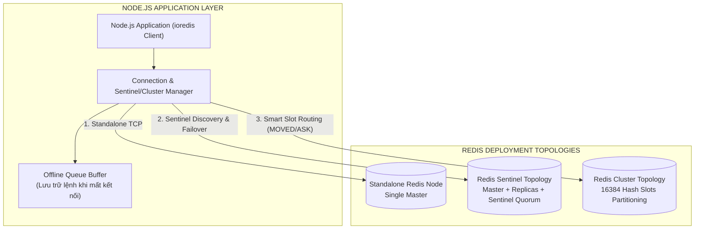
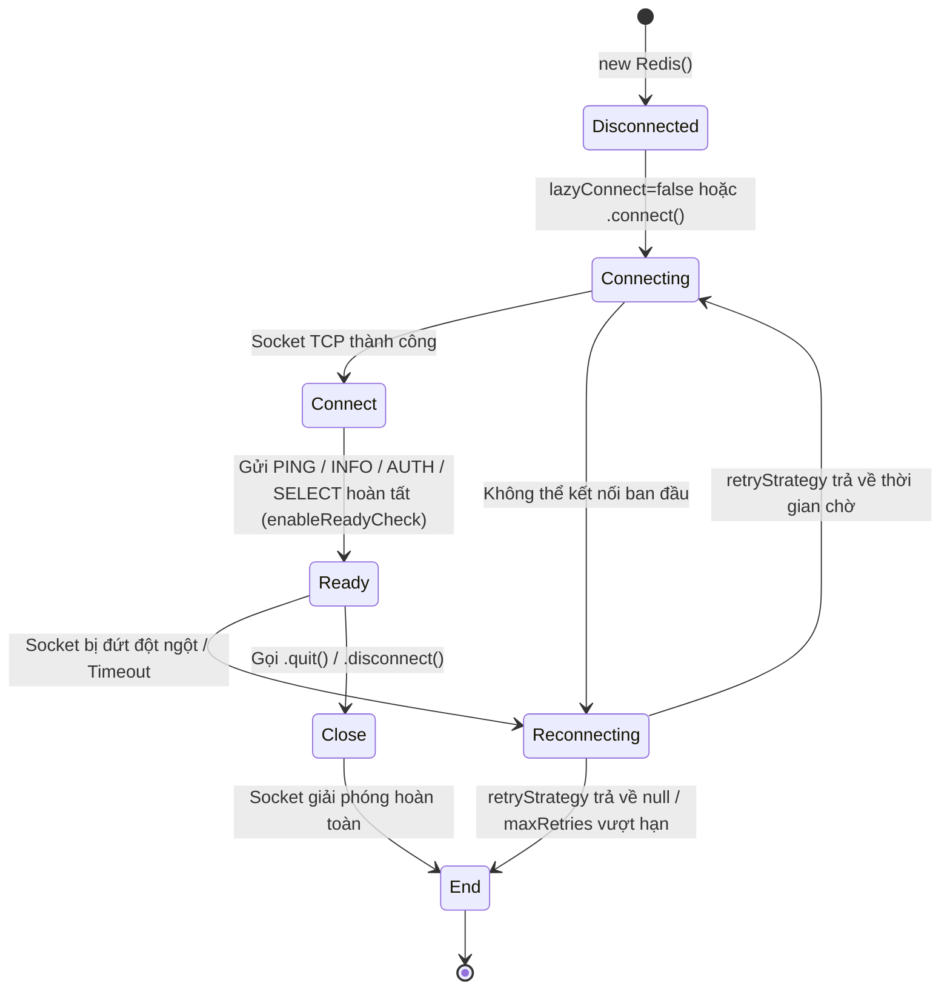
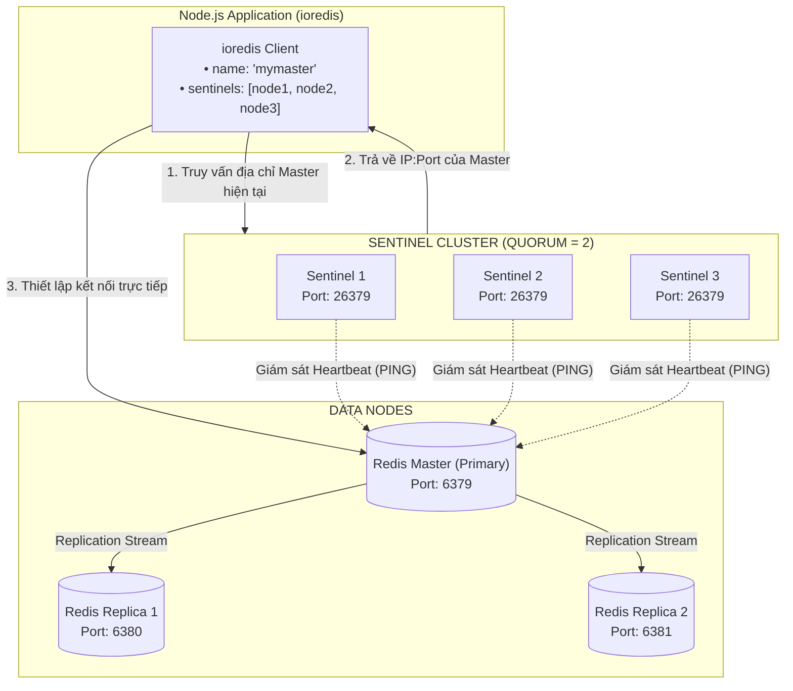
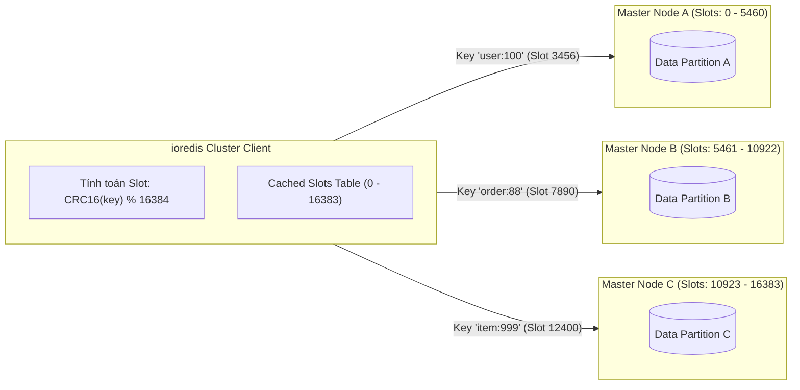
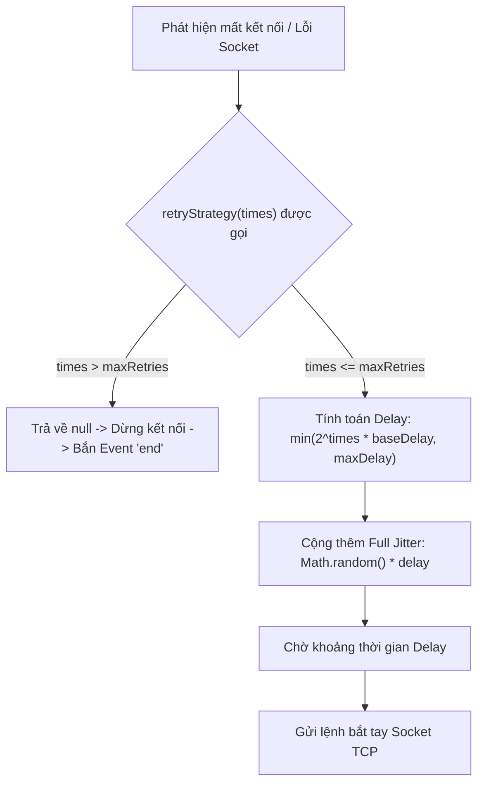

## I. KHÁI QUÁT (OVERVIEW)

### 1. Giới thiệu Thư viện `ioredis`
Trong hệ sinh thái Node.js, `ioredis` là một trong những client Redis mạnh mẽ, ổn định và giàu tính năng nhất dành cho môi trường Enterprise. Được thiết kế tối ưu cho hiệu năng cao và độ sẵn sàng liên tục, `ioredis` giải quyết triệt để những bài toán phức tạp của kiến trúc phân tán mà các thư viện cơ bản thường gặp khó khăn.



#### Vì sao ioredis là lựa chọn hàng đầu cho Production?
1. **Hỗ trợ toàn diện các mô hình kiến trúc:** Tích hợp sẵn và hoàn thiện cho Standalone, Master-Replica, Redis Sentinel và Redis Cluster mà không cần thư viện bọc ngoài.
2. **Quản lý kết nối linh hoạt:** Tự động kết nối lại (Auto-reconnection), tùy biến thuật toán Exponential Backoff kết hợp Jitter, phát hiện sự cố mạng nhanh chóng thông qua Heartbeat/Keep-Alive.
3. **Buffer Offline Queue:** Lưu giữ các câu lệnh phát sinh trong giai đoạn mất kết nối tạm thời và tự động gửi lại ngay khi kết nối được khôi phục (có thể cấu hình bật/tắt để tránh tràn RAM).
4. **Hỗ trợ First-Class cho Lua Scripting & Pipelines:** Tự động tính toán SHA1, gom cụm lệnh (Auto-pipelining) và đăng ký Custom Command trực tiếp vào prototype của client.
5. **TypeScript Ready & Thân thiện với Stream:** Cung cấp đầy đủ kiểu dữ liệu type definition và hỗ trợ Node.js Stream API (`scanStream`, `hscanStream`).

---

### 2. Kiến trúc Kết nối và Vòng đời Trạng thái (Connection State Machine)
`ioredis` quản lý kết nối TCP thông qua một máy trạng thái (State Machine) nghiêm ngặt dựa trên Node.js `EventEmitter`. Khi ứng dụng gửi lệnh, client sẽ kiểm tra trạng thái của socket để quyết định thực thi ngay, đưa vào queue chờ, hoặc từ chối yêu cầu.



---

## II. CHI TIẾT KỸ THUẬT (DETAILED DEEP DIVE)

### 1. Khởi tạo Client Đơn lẻ (Standalone Node) & Chi tiết Connection Options

Client có thể được khởi tạo bằng chuỗi URL kết nối (Connection URI) hoặc đối tượng cấu hình (`RedisOptions`).

#### Các tham số cấu hình cốt lõi (`RedisOptions`):

| Tham số | Kiểu dữ liệu | Mặc định | Mô tả chi tiết |
| :--- | :--- | :--- | :--- |
| `host` | `string` | `'127.0.0.1'` | Địa chỉ IP hoặc hostname của Redis Server |
| `port` | `number` | `6379` | Cổng dịch vụ Redis |
| `username` | `string` | `undefined` | Username cho Redis 6.0+ Access Control Lists (ACL) |
| `password` | `string` | `undefined` | Mật khẩu truy cập (`AUTH`) |
| `db` | `number` | `0` | Database index (mặc định từ 0 đến 15) |
| `keyPrefix` | `string` | `''` | Tiền tố tự động gắn vào mọi Key trước khi gửi lên Redis |
| `lazyConnect` | `boolean` | `false` | Nếu `true`, client KHÔNG tự động kết nối ngay khi khởi tạo mà phải gọi `client.connect()` thủ công |
| `keepAlive` | `number` | `0` | Chu kỳ gửi TCP Keep-Alive probe (ms). Khuyến nghị `10000` (10s) để tránh NAT router ngắt kết nối idle |
| `family` | `number` | `4` | Phiên bản IP: `4` (IPv4) hoặc `6` (IPv6) |
| `connectTimeout` | `number` | `10000` | Thời gian tối đa (ms) chờ socket TCP thiết lập trước khi timeout |
| `commandTimeout` | `number` | `undefined` | Thời gian tối đa (ms) một lệnh chờ phản hồi từ Redis trước khi ném lỗi |
| `maxRetriesPerRequest`| `number` | `20` | Số lần thử lại tối đa cho mỗi lệnh nếu gặp lỗi rớt kết nối. Đặt `null` để đợi vô hạn trong offline queue |
| `enableOfflineQueue` | `boolean` | `true` | Nếu `false`, mọi lệnh gọi khi client chưa `ready` sẽ bị reject ngay lập tức |
| `enableReadyCheck` | `boolean` | `true` | Kiểm tra server có thực sự sẵn sàng xử lý dữ liệu hay không (bằng lệnh `INFO`) sau khi bắt tay TCP |
| `enableAutoPipelining`| `boolean` | `false` | Tự động gom nhóm các câu lệnh gọi trong cùng một tick của Node.js Event Loop thành một Pipeline |
| `tls` | `object` | `undefined` | Cấu hình mã hóa TLS/SSL (Node.js `tls.ConnectionOptions`) |

> [!IMPORTANT]
> **Vai trò của `lazyConnect: true`:** Trong kiến trúc microservices hoặc container (Docker/Kubernetes), bạn nên bật `lazyConnect: true`. Điều này cho phép ứng dụng khởi động máy chủ HTTP trước, sau đó chủ động gọi `await client.connect()` trong tiến trình Health Check / Bootstrap, tránh tình trạng ứng dụng bị crash đột ngột nếu Redis khởi động chậm hơn Node.js một vài giây.

---

### 2. Cấu hình High-Availability với Redis Sentinel
Mô hình Redis Sentinel cung cấp tính năng giám sát (Monitoring), thông báo (Notification), và tự động chuyển đổi dự phòng (Automatic Failover).



#### Cơ chế hoạt động của ioredis với Sentinel:
1. `ioredis` kết nối tuần tự tới danh sách các Sentinel nodes được khai báo.
2. Gửi lệnh `SENTINEL get-master-addr-by-name <name>` để lấy IP và Port của Master hiện tại.
3. Tự động lắng nghe qua kênh Pub/Sub của Sentinel (`+switch-master`) để nhận thông báo tức thì khi có sự kiện Failover xảy ra, lập tức điều hướng kết nối sang Master mới mà không cần khởi động lại tiến trình Node.js.
4. Hỗ trợ cấu hình `role: 'slave'` nếu muốn định tuyến các câu lệnh đọc xuống Replica để giảm tải cho Master.

---

### 3. Cấu hình Redis Cluster (Sharding Phân Tán)
Redis Cluster phân chia toàn bộ không gian dữ liệu thành **16,384 Hash Slots**. Mỗi Master Node chịu trách nhiệm cho một dải Hash Slots nhất định.



#### Xử lý Chuyển hướng Lệnh (Redirection Handling):
- **Lỗi `MOVED <slot> <ip:port>`:** Xảy ra khi Hash Slot đã được di chuyển vĩnh viễn sang Node khác (do rebalancing/resharding). `ioredis` sẽ tự động cập nhật lại bảng định tuyến (Slots Table) và gửi lại lệnh tới Node mới một cách trong suốt.
- **Lỗi `ASK <slot> <ip:port>`:** Xảy ra khi Hash Slot đang trong quá trình di chuyển (Migrating). `ioredis` sẽ gửi lệnh `ASKING` tới Node mới rồi mới gửi lệnh truy vấn thực tế, không cập nhật Slots Table vĩnh viễn.

#### Các Options chuyên biệt cho Cluster:
- `scaleReads`: Phân phối tải đọc dữ liệu.
  - `'master'` (mặc định): Mọi thao tác đọc/ghi đều tới Master.
  - `'slave'`: Chỉ đọc từ Replica/Slave.
  - `'all'`: Phân bổ lệnh đọc ngẫu nhiên trên cả Master và Replica.
- `maxRedirections`: Số lần tối đa thử chuyển hướng (`MOVED`/`ASK`) trước khi ném lỗi (mặc định: `16`).
- `clusterRetryStrategy`: Hàm tính toán thời gian chờ kết nối lại riêng cho cụm Cluster.
- `natMap`: Cấu hình ánh xạ IP nội bộ thành IP ngoại vi khi chạy Redis Cluster sau tường lửa, Docker Network hoặc Kubernetes NodePort.

---

### 4. Cơ chế Retry & Reconnection Nâng cao

Khi kết nối mạng chập chờn hoặc Redis Server khởi động lại, nếu hàng ngàn client cùng gửi lệnh kết nối lại tại một thời điểm chính xác, hệ thống sẽ sập do hiện tượng **Thundering Herd**. Để xử lý, `ioredis` cung cấp cơ chế `retryStrategy` kết hợp **Exponential Backoff và Jitter**.



#### Cơ chế `reconnectOnError`:
Khi một lệnh gửi đi bị từ chối với thông báo lỗi cụ thể từ Redis (ví dụ: Node Master vừa bị giáng cấp thành Replica và trả về lỗi `READONLY You can't write against a read only replica.`), hàm `reconnectOnError` cho phép bạn chặn lỗi này và ép `ioredis` chủ động cắt socket cũ để tái kết nối tới đúng Master mới ngay lập tức mà không cần đợi timeout.

---

### 5. Vòng đời Kết nối (Connection Lifecycle & Events)

Client `ioredis` kế thừa từ `EventEmitter`. Việc giám sát chặt chẽ các sự kiện sau là bắt buộc trong môi trường Production:

1. `'connect'`: Socket TCP đã mở thành công tới server. Chưa thể gửi lệnh an toàn nếu `enableReadyCheck: true`.
2. `'ready'`: Server đã xác thực quyền, chọn DB thành công, sẵn sàng nhận và xử lý lệnh.
3. `'error'`: Bắn ra khi có lỗi socket hoặc giao thức. **Bắt buộc phải lắng nghe**, nếu không Node.js sẽ ném `Unhandled 'error' event` và làm crash toàn bộ tiến trình ứng dụng.
4. `'close'`: Socket TCP đã bị đóng.
5. `'reconnecting'`: Client đang tính toán delay và bắt đầu quá trình kết nối lại (kèm tham số thời gian chờ ms).
6. `'end'`: Client đã cạn kiệt số lần retry hoặc gọi hàm đóng kết nối dứt điểm. Không thể tái kết nối từ instance này nữa.

---

## III. VÍ DỤ MINH HỌA VÀ PHÂN TÍCH CODE (PRACTICAL CODE & ANALYSIS)

### 1. Kiến trúc Singleton Redis Client chuẩn Production (Hỗ trợ Standalone)

Dưới đây là module quản trị kết nối Redis theo mô hình Singleton, tích hợp đầy đủ Exponential Backoff + Full Jitter, `reconnectOnError`, và Graceful Shutdown.

```typescript
// src/database/redis.client.ts
import Redis, { RedisOptions } from 'ioredis';

export class RedisService {
  private static instance: Redis | null = null;

  private constructor() {}

  public static getInstance(): Redis {
    if (!RedisService.instance) {
      const options: RedisOptions = {
        host: process.env.REDIS_HOST || '127.0.0.1',
        port: Number(process.env.REDIS_PORT) || 6379,
        password: process.env.REDIS_PASSWORD || undefined,
        db: Number(process.env.REDIS_DB) || 0,
        keyPrefix: 'app:', // Mọi key sẽ có prefix 'app:...'
        lazyConnect: true, // Chủ động connect khi bootstrap ứng dụng
        keepAlive: 10000,  // Gửi TCP keep-alive probe mỗi 10 giây
        family: 4,         // Ép buộc dùng IPv4
        connectTimeout: 5000, // Timeout kết nối TCP sau 5 giây
        maxRetriesPerRequest: 3, // Giới hạn số lần thử lại cho mỗi lệnh
        enableOfflineQueue: true, // Cho phép lưu buffer lệnh khi đứt kết nối ngắn hạn
        enableReadyCheck: true,   // Kiểm tra trạng thái INFO của Redis trước khi ready

        // Thuật toán Exponential Backoff kết hợp Full Jitter
        retryStrategy(times: number) {
          const maxRetries = 10;
          if (times > maxRetries) {
            console.error(`[Redis] Đã vượt quá số lần kết nối lại tối đa (${maxRetries}). Dừng kết nối.`);
            return null; // Trả về null để kết thúc retry, chuyển client sang trạng thái 'end'
          }

          // Delay cơ bản: 2^times * 100ms (tối đa 3000ms)
          const baseDelay = 100;
          const calculatedDelay = Math.min(Math.pow(2, times) * baseDelay, 3000);
          
          // Full Jitter: Tạo độ lệch ngẫu nhiên từ 0 đến calculatedDelay
          const jitterDelay = Math.floor(Math.random() * calculatedDelay);

          console.warn(`[Redis] Thử kết nối lại lần thứ ${times}. Thời gian chờ: ${jitterDelay}ms`);
          return jitterDelay;
        },

        // Xử lý tái kết nối khi gặp lỗi READONLY (Master-Replica failover)
        reconnectOnError(err: Error) {
          const targetError = 'READONLY';
          if (err.message.includes(targetError)) {
            // Trả về true hoặc 1 để ép buộc client ngắt socket và kết nối lại ngay
            console.warn('[Redis] Phát hiện lỗi READONLY. Ép buộc tái kết nối tới Master mới...');
            return true;
          }
          return false; // Các lỗi khác giữ nguyên luồng xử lý thông thường
        },
      };

      const client = new Redis(options);

      // Đăng ký Event Listeners quản lý vòng đời
      client.on('connect', () => {
        console.log('[Redis Event] TCP Socket đã kết nối thành công.');
      });

      client.on('ready', () => {
        console.log('[Redis Event] Client đã ở trạng thái READY để nhận lệnh.');
      });

      client.on('error', (error) => {
        // Cực kỳ quan trọng: Luôn lắng nghe sự kiện error để tránh crash tiến trình Node.js
        console.error('[Redis Event] Lỗi kết nối Redis:', error.message);
      });

      client.on('close', () => {
        console.warn('[Redis Event] Kết nối TCP đã bị đóng.');
      });

      client.on('reconnecting', (delay: number) => {
        console.log(`[Redis Event] Đang trong tiến trình Reconnecting sau ${delay}ms...`);
      });

      client.on('end', () => {
        console.error('[Redis Event] Client đã đóng hoàn toàn (Trạng thái END).');
      });

      RedisService.instance = client;
    }

    return RedisService.instance;
  }

  // Phương thức Graceful Shutdown dọn dẹp kết nối
  public static async gracefulShutdown(): Promise<void> {
    if (RedisService.instance) {
      console.log('[Redis] Đang tiến hành ngắt kết nối an toàn (Graceful Shutdown)...');
      try {
        // quit() sẽ đợi toàn bộ các câu lệnh đang chờ xử lý hoàn tất rồi mới đóng socket
        await RedisService.instance.quit();
        console.log('[Redis] Đã đóng kết nối Redis an toàn.');
      } catch (err) {
        console.error('[Redis] Lỗi khi đóng bằng quit(), buộc ngắt bằng disconnect():', err);
        RedisService.instance.disconnect(); // Ngắt tức thì nếu quit() bị timeout/treo
      } finally {
        RedisService.instance = null;
      }
    }
  }
}
```

---

### 2. Cấu hình Redis Sentinel với Read/Write Separation

Ví dụ dưới đây thiết lập 2 Client: một Client ghi kết nối tới Sentinel Master, và một Client đọc kết nối tới Sentinel Replica nhằm tối ưu hóa tải truy vấn.

```typescript
// src/database/redis-sentinel.ts
import Redis, { RedisOptions } from 'ioredis';

const sentinelEndpoints = [
  { host: '192.168.1.10', port: 26379 },
  { host: '192.168.1.11', port: 26379 },
  { host: '192.168.1.12', port: 26379 },
];

const masterName = 'mymaster';
const redisPassword = 'StrongProductionPassword';

// 1. Master Client (Dành riêng cho thao tác GHI: SET, HSET, DEL...)
export const redisMasterClient = new Redis({
  sentinels: sentinelEndpoints,
  name: masterName,
  password: redisPassword,
  sentinelPassword: redisPassword, // Nếu Sentinel yêu cầu mật khẩu
  role: 'master',                  // Mặc định kết nối tới Master
  keyPrefix: 'prod:data:',
  connectTimeout: 5000,
});

// 2. Replica Client (Dành riêng cho thao tác ĐỌC: GET, HGET, MGET...)
export const redisReadClient = new Redis({
  sentinels: sentinelEndpoints,
  name: masterName,
  password: redisPassword,
  sentinelPassword: redisPassword,
  role: 'slave',                   // Định tuyến tới một trong các Replica nodes
  preferredSlaves: [               // Ưu tiên chọn Replica nằm cùng datacenter
    { ip: '192.168.1.20', port: 6379, prio: 10 },
    { ip: '192.168.1.21', port: 6379, prio: 5 },
  ],
  keyPrefix: 'prod:data:',
  readOnly: true,                  // Bật chế độ READONLY trên connection
});

redisMasterClient.on('ready', () => console.log('[Sentinel] Master Client đã sẵn sàng.'));
redisReadClient.on('ready', () => console.log('[Sentinel] Read Replica Client đã sẵn sàng.'));
```

---

### 3. Cấu hình Redis Cluster với NAT Mapping & Smart Routing

Khi triển khai Redis Cluster trên môi trường Cloud (AWS ElastiCache, GCP Memorystore) hoặc Kubernetes (các Pod có IP nội bộ khác với IP NodePort công khai bên ngoài), cấu hình `natMap` là bắt buộc để client không kết nối nhầm vào IP cục bộ của container.

```typescript
// src/database/redis-cluster.ts
import Redis from 'ioredis';

// Danh sách các seed nodes ban đầu để phát hiện topology của cụm
const clusterSeedNodes = [
  { host: '10.0.0.1', port: 7000 },
  { host: '10.0.0.2', port: 7001 },
  { host: '10.0.0.3', port: 7002 },
];

export const clusterClient = new Redis.Cluster(clusterSeedNodes, {
  // Cấu hình định tuyến lệnh đọc
  scaleReads: 'slave', // Tự động cân bằng tải đọc sang các Slave nodes trong từng Shard

  // Cấu hình NAT mapping nếu client nằm ngoài mạng nội bộ của Redis Cluster
  natMap: {
    '10.0.0.1:7000': { host: '203.0.113.1', port: 30000 },
    '10.0.0.2:7001': { host: '203.0.113.2', port: 30001 },
    '10.0.0.3:7002': { host: '203.0.113.3', port: 30002 },
  },

  redisOptions: {
    password: 'ClusterSecurePassword',
    connectTimeout: 5000,
  },

  // Số lần thử chuyển hướng tối đa khi gặp MOVED hoặc ASK
  maxRedirections: 16,

  // Tự động làm mới bảng mapping Slots định kỳ (60s một lần) để bắt kịp biến động topology
  slotsRefreshInterval: 60000,

  // Chiến lược retry riêng biệt cho cụm Cluster
  clusterRetryStrategy(times: number) {
    console.warn(`[Cluster] Thử kết nối lại Cluster lần ${times}...`);
    return Math.min(100 * Math.pow(2, times), 5000);
  },
});

clusterClient.on('ready', () => {
  console.log('[Cluster] Kết nối Redis Cluster thành công và sẵn sàng.');
});

clusterClient.on('node error', (err, node) => {
  console.error(`[Cluster] Lỗi phát sinh tại node ${node.options.host}:${node.options.port}:`, err.message);
});
```

---

## IV. LƯU Ý CẠM BẪY VÀ QUY TẮC CỐT LÕI (TRAPS & BEST PRACTICES)

### 1. Cạm bẫy Offline Queue tràn bộ nhớ RAM (Memory Leak)
Mặc định `enableOfflineQueue: true`. Khi Redis server bị treo hoặc mất mạng trong thời gian dài:
- Mọi câu lệnh Node.js gửi đi sẽ được dồn vào một mảng bộ nhớ (In-memory buffer queue).
- Nếu lượng traffic vào ứng dụng liên tục cao (vài ngàn req/s), hàng triệu câu lệnh sẽ tích tụ trên RAM của tiến trình Node.js, dẫn đến lỗi **`JavaScript heap out of memory`** và làm sập Node.js.

> [!CAUTION]
> **Giải pháp khắc phục:** 
> 1. Thiết lập `maxRetriesPerRequest: 3` (hoặc một giá trị nhỏ hơn `20`) thay vì để `null`. Khi lệnh xếp hàng quá số lần quy định, `ioredis` sẽ lập tức Reject Promise để giải phóng RAM.
> 2. Đối với các dịch vụ yêu cầu Fail-Fast nghiêm ngặt, hãy cấu hình `enableOfflineQueue: false`.

---

### 2. Cạm bẫy `keyPrefix` trong Redis Cluster & Lua Scripts
- **Trong Lua Scripts:** Tham số `keyPrefix` **KHÔNG** tự động áp dụng vào các chuỗi Key được truyền bên trong code Lua hoặc mảng `KEYS`. Bạn phải tự xử lý prefix trong mã nguồn Lua.
- **Trong Multi-Key Operations trên Cluster:** Nếu dùng `keyPrefix: 'prefix:'`, lệnh `mget('a', 'b')` thực tế sẽ gửi `mget('prefix:a', 'prefix:b')`. Trên Redis Cluster, hai key này có thể rơi vào hai Hash Slots khác nhau, gây lỗi:
  `CROSSSLOT Keys in request don't hash to the same slot`.
  *Cách khắc phục:* Sử dụng **Hash Tags** chuẩn dạng `{user:123}:profile` và `{user:123}:orders` để đảm bảo chúng luôn nằm trên cùng một Slot.

---

### 3. Cạm bẫy Bỏ qua Sự kiện `'error'` (Unhandled Error Event)
Trong Node.js, `EventEmitter` quy định rằng nếu một sự kiện `'error'` được kích hoạt mà không có bất kỳ listener nào đăng ký xử lý (`client.on('error', ...)`), tiến trình Node.js sẽ ngay lập tức bị **TERMINATED** (Crash ứng dụng).

```javascript
// ❌ SAI LẦM NGUY HIỂM: Khởi tạo nhưng không bắt error event
const redis = new Redis();

// ✅ ĐÚNG CHUẨN: Luôn luôn đăng ký error handler ngay sau khi khởi tạo
const redis = new Redis();
redis.on('error', (err) => {
  console.error('[Redis Safe Catch] Bắt lỗi kết nối socket:', err.message);
});
```

---

### 4. Cạm bẫy Socket Timeout do Firewall / NAT Router ngắt kết nối âm thầm
Trên các môi trường Cloud (AWS VPC, Azure VNet), các NAT Gateway hoặc Firewall thường tự động hủy các kết nối TCP không có dữ liệu truyền qua (Idle Connections) sau một khoảng thời gian (thường là 300 giây). Client Node.js không hề biết socket đã chết cho đến khi cố gắng gửi một câu lệnh mới và bị treo chờ timeout.

> [!TIP]
> **Quy tắc vàng:** Luôn thiết lập `keepAlive: 10000` (10 giây) trong `RedisOptions`. Hệ điều hành sẽ định kỳ gửi gói tin TCP Keep-Alive Probe để giữ cho session trên Firewall luôn ở trạng thái Active.

---

### 5. Bảng Tổng hợp Bộ Cấu hình Khuyến nghị cho Production (Production Checklist)

```typescript
const productionRecommendedOptions: RedisOptions = {
  host: process.env.REDIS_HOST,
  port: Number(process.env.REDIS_PORT),
  password: process.env.REDIS_PASSWORD,
  db: 0,
  
  // 1. Quản lý vòng đời khởi động
  lazyConnect: true,
  enableReadyCheck: true,
  
  // 2. Bảo vệ Socket và Network
  keepAlive: 10000,
  connectTimeout: 5000,
  family: 4,
  
  // 3. Chống tràn RAM và giới hạn chờ
  enableOfflineQueue: true,
  maxRetriesPerRequest: 3,
  
  // 4. Retry Strategy tối ưu
  retryStrategy: (times) => {
    if (times > 10) return null;
    return Math.min(Math.floor(Math.random() * (Math.pow(2, times) * 100)), 3000);
  },
  
  // 5. Failover tức thì
  reconnectOnError: (err) => err.message.includes('READONLY'),
};
```
