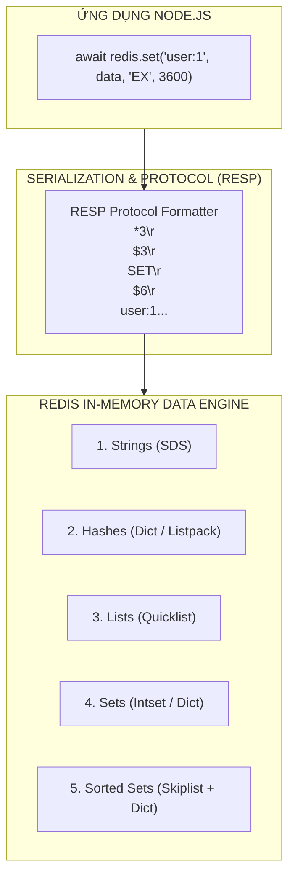
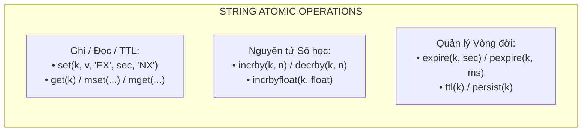
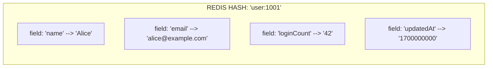
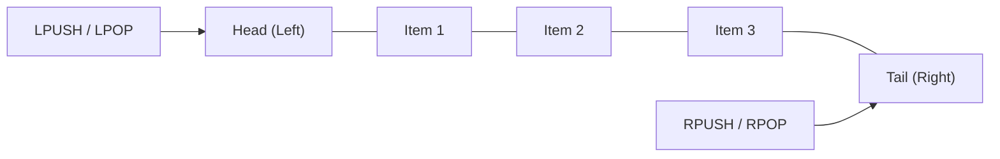
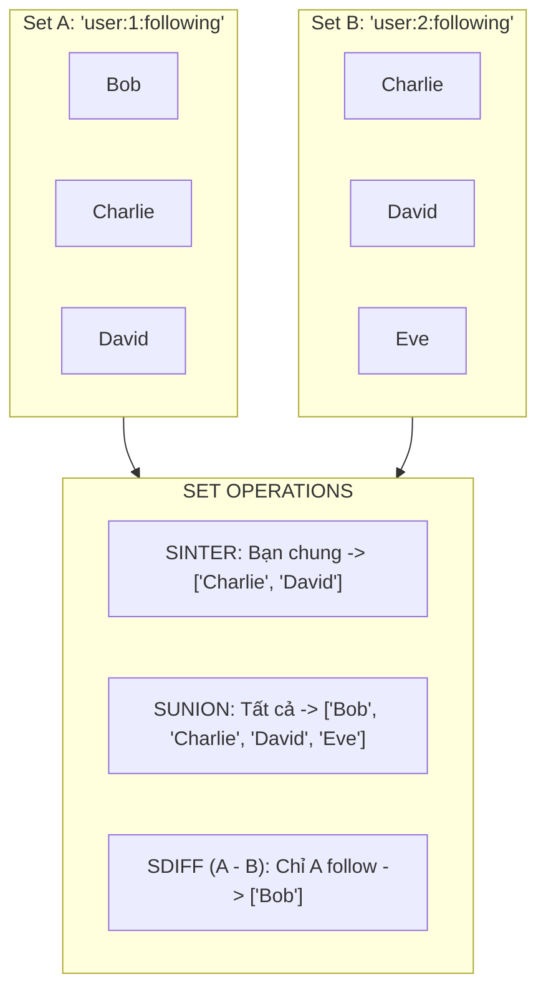
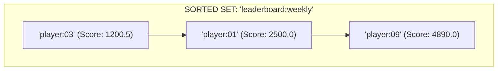

## I. KHÁI QUÁT (OVERVIEW)

### 1. Mô hình Giao tiếp Lệnh trong `ioredis`
Mọi câu lệnh Redis nguyên bản (Redis Native Commands) đều được ánh xạ thành các phương thức (methods) tương ứng trong instance của `ioredis`. Thư viện hỗ trợ mô hình bất đồng bộ hiện đại thông qua **Promises (`async/await`)**, đồng thời duy trì khả năng tương thích ngược với Node.js Style Callbacks.



#### Quy ước chung về Dữ liệu trong `ioredis`:
1. **Kiểu dữ liệu hỗ trợ:** Mặc định các phương thức nhận tham số là `string`, `number`, hoặc `Buffer`. Khi lưu trữ các đối tượng phức tạp (JavaScript Objects, Arrays), lập trình viên phải chủ động tuần tự hóa sang JSON (`JSON.stringify`) hoặc định dạng nhị phân (Protocol Buffers, MessagePack).
2. **Chế độ Buffer Mode:** Khi cần xử lý dữ liệu nhị phân dung lượng cao (hình ảnh, file nén, serialized byte streams), `ioredis` cung cấp các biến thể hàm hậu tố `Buffer` như: `getBuffer()`, `hgetBuffer()`, `lpopBuffer()`.
3. **Giá trị trả về khi Key không tồn tại:** 
   - `get()`, `hget()` trả về `null`.
   - `mget()` trả về mảng chứa `null` tại các vị trí tương ứng (`['val1', null, 'val3']`).
   - `hgetall()`, `smembers()`, `lrange()` trả về object rỗng `{}` hoặc mảng rỗng `[]`.

---

## II. CHI TIẾT KỸ THUẬT (DETAILED DEEP DIVE)

### 1. Nhóm Lệnh Strings & Quản lý Thời hạn (Expiration)
String là kiểu dữ liệu cơ bản nhất trong Redis, có thể lưu trữ chuỗi văn bản thô, chuỗi JSON, số nguyên, số thực hoặc nhị phân (tối đa 512MB).



#### Bảng tổng hợp Lệnh String:

| Phương thức trong ioredis | Cú pháp Redis | Độ phức tạp | Mô tả chi tiết |
| :--- | :--- | :--- | :--- |
| `redis.set(key, val, ...args)` | `SET key val [EX sec] [PX ms] [NX\|XX] [KEEPTTL] [GET]` | $O(1)$ | Ghi giá trị kèm các flag điều khiển điều kiện ghi và thời gian hết hạn |
| `redis.get(key)` | `GET key` | $O(1)$ | Đọc giá trị String. Trả về `string` hoặc `null` |
| `redis.mset(key1, v1, ...)` hoặc `redis.mset({ k1: v1, k2: v2 })` | `MSET k1 v1 k2 v2` | $O(N)$ | Ghi đồng thời nhiều key một cách nguyên tử |
| `redis.mget(k1, k2, ...)` hoặc `redis.mget(['k1', 'k2'])` | `MGET k1 k2 ...` | $O(N)$ | Đọc đồng thời nhiều key, giảm tối đa độ trễ Round-Trip Time |
| `redis.incrby(key, increment)` | `INCRBY key increment` | $O(1)$ | Tăng giá trị số nguyên một cách nguyên tử (Tự tạo key=0 nếu chưa tồn tại) |
| `redis.decrby(key, decrement)` | `DECRBY key decrement` | $O(1)$ | Giảm giá trị số nguyên một cách nguyên tử |
| `redis.setnx(key, value)` | `SETNX key value` | $O(1)$ | Set if Not Exists. Trả về `1` nếu ghi thành công, `0` nếu key đã tồn tại |
| `redis.setex(key, seconds, val)` | `SETEX key seconds val` | $O(1)$ | Ghi giá trị kèm thời gian sống tính bằng giây |
| `redis.expire(key, seconds)` | `EXPIRE key seconds` | $O(1)$ | Thiết lập thời gian sống (TTL) cho một key có sẵn |
| `redis.ttl(key)` | `TTL key` | $O(1)$ | Lấy TTL còn lại: `>0` (giây còn lại), `-1` (vô thời hạn), `-2` (key không tồn tại) |
| `redis.persist(key)` | `PERSIST key` | $O(1)$ | Xóa bỏ TTL, biến key thành vĩnh viễn |

> [!TIP]
> **Các Flag nâng cao của lệnh `SET` hiện đại:** Thay vì dùng `setnx()` hay `setex()`, chuẩn hiện đại khuyến khích dùng cú pháp `redis.set(key, val, 'EX', 60, 'NX')` hoặc cú pháp `KEEPTTL` (giữ nguyên TTL hiện có khi cập nhật giá trị mới) và `GET` (trả về giá trị cũ trước khi ghi giá trị mới).

---

### 2. Nhóm Lệnh Hashes (Bảng Băm)
Hash lưu trữ danh sách các cặp Field-Value bên trong một Key duy nhất. Đây là cấu trúc lý tưởng để biểu diễn các thực thể đối tượng (User Profile, Product Metadata, Configuration Settings).



#### Bảng tổng hợp Lệnh Hashes:

| Phương thức trong ioredis | Cú pháp Redis | Độ phức tạp | Mô tả chi tiết |
| :--- | :--- | :--- | :--- |
| `redis.hset(key, field, val)` hoặc `redis.hset(key, { f1: v1, f2: v2 })` | `HSET key f1 v1 [f2 v2 ...]` | $O(N)$ | Thiết lập một hoặc nhiều cặp Field-Value trong Hash |
| `redis.hget(key, field)` | `HGET key field` | $O(1)$ | Lấy giá trị của một Field cụ thể |
| `redis.hmget(key, f1, f2...)` | `HMGET key f1 f2 ...` | $O(N)$ | Lấy giá trị của nhiều Field cùng lúc |
| `redis.hgetall(key)` | `HGETALL key` | $O(N)$ | Lấy toàn bộ Field-Value. `ioredis` tự động chuyển đổi thành Plain JavaScript Object |
| `redis.hdel(key, f1, f2...)` | `HDEL key f1 f2 ...` | $O(N)$ | Xóa một hoặc nhiều Field khỏi Hash |
| `redis.hexists(key, field)` | `HEXISTS key field` | $O(1)$ | Kiểm tra Field có tồn tại trong Hash hay không (Trả về `1` hoặc `0`) |
| `redis.hlen(key)` | `HLEN key` | $O(1)$ | Đếm tổng số lượng Field trong Hash |
| `redis.hkeys(key)` | `HKEYS key` | $O(N)$ | Lấy danh sách toàn bộ tên Field |
| `redis.hvals(key)` | `HVALS key` | $O(N)$ | Lấy danh sách toàn bộ Giá trị của các Field |
| `redis.hincrby(key, field, inc)` | `HINCRBY key field inc` | $O(1)$ | Tăng giá trị số nguyên của một Field nguyên tử |

---

### 3. Nhóm Lệnh Lists (Danh Sách Tuyến Tính)
List trong Redis được triển khai bằng cấu trúc **Quicklist** (kết hợp giữa Doubly Linked List và Ziplists), tối ưu cho các thao tác chèn/xóa cực nhanh ở hai đầu đầu ($O(1)$). Phù hợp cho Message Queue, Activity Feeds, Recent Event Logs.



#### Bảng tổng hợp Lệnh Lists:

| Phương thức trong ioredis | Cú pháp Redis | Độ phức tạp | Mô tả chi tiết |
| :--- | :--- | :--- | :--- |
| `redis.lpush(key, v1, v2...)` | `LPUSH key v1 v2 ...` | $O(N)$ | Chèn một hoặc nhiều phần tử vào đầu danh sách (Head/Left) |
| `redis.rpush(key, v1, v2...)` | `RPUSH key v1 v2 ...` | $O(N)$ | Chèn một hoặc nhiều phần tử vào cuối danh sách (Tail/Right) |
| `redis.lpop(key, [count])` | `LPOP key [count]` | $O(N)$ | Lấy và xóa phần tử ở đầu danh sách |
| `redis.rpop(key, [count])` | `RPOP key [count]` | $O(N)$ | Lấy và xóa phần tử ở cuối danh sách |
| `redis.blpop(key, timeout)` | `BLPOP key timeout` | $O(1)$ | Blocking LPOP: Chờ đến khi có phần tử xuất hiện hoặc timeout (giây) |
| `redis.brpop(key, timeout)` | `BRPOP key timeout` | $O(1)$ | Blocking RPOP: Chờ đến khi có phần tử xuất hiện hoặc timeout (giây) |
| `redis.lrange(key, start, stop)` | `LRANGE key start stop` | $O(S+N)$ | Lấy danh sách phần tử theo chỉ số (ví dụ: `0, -1` để lấy toàn bộ) |
| `redis.ltrim(key, start, stop)` | `LTRIM key start stop` | $O(N)$ | Cắt tỉa danh sách, chỉ giữ lại các phần tử trong khoảng index chỉ định |
| `redis.llen(key)` | `LLEN key` | $O(1)$ | Trả về độ dài hiện tại của danh sách |
| `redis.rpoplpush(src, dest)` | `RPOPLPUSH src dest` | $O(1)$ | Chuyển phần tử từ cuối `src` sang đầu `dest` nguyên tử (Reliable Queue) |

---

### 4. Nhóm Lệnh Sets (Tập Hợp Không Trùng Lặp)
Set là tập hợp các phần tử chuỗi duy nhất, không theo thứ tự nhất định. Cung cấp các phép toán tập hợp đại số kinh điển như Giao (Intersection), Hợp (Union), Hiệu (Difference).



#### Bảng tổng hợp Lệnh Sets:

| Phương thức trong ioredis | Cú pháp Redis | Độ phức tạp | Mô tả chi tiết |
| :--- | :--- | :--- | :--- |
| `redis.sadd(key, m1, m2...)` | `SADD key m1 m2 ...` | $O(N)$ | Thêm một hoặc nhiều phần tử vào tập hợp |
| `redis.srem(key, m1, m2...)` | `SREM key m1 m2 ...` | $O(N)$ | Xóa một hoặc nhiều phần tử khỏi tập hợp |
| `redis.sismember(key, member)` | `SISMEMBER key member` | $O(1)$ | Kiểm tra phần tử có thuộc tập hợp hay không (`1` hoặc `0`) |
| `redis.smembers(key)` | `SMEMBERS key` | $O(N)$ | Lấy toàn bộ phần tử trong tập hợp |
| `redis.scard(key)` | `SCARD key` | $O(1)$ | Đếm tổng số phần tử (Cardinality) |
| `redis.sinter(k1, k2...)` | `SINTER k1 k2 ...` | $O(N \times M)$ | Phép Giao: Tìm phần tử chung giữa các tập hợp |
| `redis.sunion(k1, k2...)` | `SUNION k1 k2 ...` | $O(N)$ | Phép Hợp: Gom toàn bộ phần tử duy nhất của các tập hợp |
| `redis.sdiff(k1, k2...)` | `SDIFF k1 k2 ...` | $O(N)$ | Phép Hiệu: Lấy phần tử có trong tập đầu tiên nhưng không có ở các tập sau |
| `redis.spop(key, [count])` | `SPOP key [count]` | $O(N)$ | Lấy ngẫu nhiên và xóa phần tử khỏi tập hợp |
| `redis.srandmember(key, [cnt])` | `SRANDMEMBER key [cnt]` | $O(N)$ | Lấy ngẫu nhiên nhưng KHÔNG xóa phần tử (bốc thăm trúng thưởng) |

---

### 5. Nhóm Lệnh Sorted Sets (ZSets - Tập Hợp Có Thứ Hạng)
Mỗi phần tử trong Sorted Set đi kèm một giá trị điểm số số thực (**Score**). Các phần tử được sắp xếp tự động tăng dần theo Score bằng cấu trúc dữ liệu **SkipList kết hợp Hash Table**. Phù hợp làm Bảng xếp hạng (Leaderboards), Hệ thống Rate Limiting dạng Sliding Window, hoặc Hàng đợi ưu tiên (Priority Queue).



#### Bảng tổng hợp Lệnh Sorted Sets:

| Phương thức trong ioredis | Cú pháp Redis | Độ phức tạp | Mô tả chi tiết |
| :--- | :--- | :--- | :--- |
| `redis.zadd(key, score, member)` | `ZADD key score member` | $O(\log N)$ | Thêm phần tử kèm score (có thể thêm nhiều cặp `score, member`) |
| `redis.zrem(key, m1, m2...)` | `ZREM key m1 m2 ...` | $O(M \log N)$ | Xóa một hoặc nhiều phần tử khỏi ZSet |
| `redis.zrange(key, min, max, ...)` | `ZRANGE key min max [WITHSCORES]` | $O(\log N + M)$ | Lấy danh sách phần tử theo khoảng index hoặc score (tăng dần) |
| `redis.zrevrange(key, start, stop)` | `ZREVRANGE key start stop [WITHSCORES]` | $O(\log N + M)$ | Lấy danh sách phần tử giảm dần theo thứ hạng (Top 1, Top 2...) |
| `redis.zrangebyscore(key, min, max)` | `ZRANGEBYSCORE key min max` | $O(\log N + M)$ | Lấy phần tử nằm trong khoảng score `[min, max]` |
| `redis.zrank(key, member)` | `ZRANK key member` | $O(\log N)$ | Lấy thứ hạng của phần tử từ thấp lên cao (0-indexed) |
| `redis.zrevrank(key, member)` | `ZREVRANK key member` | $O(\log N)$ | Lấy thứ hạng của phần tử từ cao xuống thấp (Hạng 0 là quán quân) |
| `redis.zscore(key, member)` | `ZSCORE key member` | $O(1)$ | Lấy giá trị Score của phần tử |
| `redis.zincrby(key, inc, member)` | `ZINCRBY key inc member` | $O(\log N)$ | Tăng điểm Score cho phần tử một cách nguyên tử |
| `redis.zcard(key)` | `ZCARD key` | $O(1)$ | Đếm tổng số phần tử trong ZSet |
| `redis.zcount(key, min, max)` | `ZCOUNT key min max` | $O(\log N)$ | Đếm số phần tử có Score nằm trong khoảng `[min, max]` |
| `redis.zremrangebyscore(key, min, max)` | `ZREMRANGEBYSCORE key min max` | $O(\log N + M)$ | Xóa các phần tử có Score nằm trong khoảng `[min, max]` |

---

## III. VÍ DỤ MINH HỌA VÀ PHÂN TÍCH CODE (PRACTICAL CODE & ANALYSIS)

### 1. Triển khai Generic Caching Service với JSON Serialization & Jittered TTL

```typescript
// src/services/cache.service.ts
import { RedisService } from '../database/redis.client';
import Redis from 'ioredis';

export class CacheService {
  private redis: Redis;

  constructor() {
    this.redis = RedisService.getInstance();
  }

  /**
   * Pattern: Get-Or-Set (Cache-Aside)
   * Đọc dữ liệu từ cache. Nếu miss, thực thi hàm callback, ghi vào Redis và trả về kết quả.
   */
  public async getOrSet<T>(
    key: string,
    ttlSeconds: number,
    fetchFunction: () => Promise<T>
  ): Promise<T> {
    // 1. Đọc dữ liệu từ Redis
    const cachedData = await this.redis.get(key);
    if (cachedData !== null) {
      try {
        return JSON.parse(cachedData) as T;
      } catch (err) {
        console.error(`[Cache] Lỗi Parse JSON key=${key}, bỏ qua cache:`, err);
      }
    }

    // 2. Cache Miss: Gọi hàm nghiệp vụ thực thi (Database / External API)
    const freshData = await fetchFunction();

    // 3. Tính toán TTL kèm Jitter ngẫu nhiên (5% - 15%) để chống Cache Stampede
    const jitter = Math.floor(ttlSeconds * (0.05 + Math.random() * 0.1));
    const finalTTL = ttlSeconds + jitter;

    // 4. Lưu lại vào Redis
    const serializedData = JSON.stringify(freshData);
    await this.redis.set(key, serializedData, 'EX', finalTTL);

    return freshData;
  }

  /**
   * Xóa key cache
   */
  public async invalidate(key: string): Promise<number> {
    return await this.redis.del(key);
  }
}
```

---

### 2. Quản trị User Profile & Online Presence bằng Hashes và Sets

```typescript
// src/services/user-presence.service.ts
import { RedisService } from '../database/redis.client';

export interface UserProfile {
  id: string;
  name: string;
  email: string;
  role: string;
  lastLoginAt: number;
}

export class UserPresenceService {
  private redis = RedisService.getInstance();

  /**
   * Lưu hoặc Cập nhật User Profile vào Redis Hash
   */
  public async saveUserProfile(user: UserProfile): Promise<void> {
    const key = `user:profile:${user.id}`;
    
    // hset chấp nhận trực tiếp một Plain JavaScript Object
    await this.redis.hset(key, {
      id: user.id,
      name: user.name,
      email: user.email,
      role: user.role,
      lastLoginAt: user.lastLoginAt.toString(),
    });

    // Gia hạn TTL cho profile (ví dụ: 7 ngày)
    await this.redis.expire(key, 7 * 24 * 60 * 60);
  }

  /**
   * Lấy User Profile từ Hash
   */
  public async getUserProfile(userId: string): Promise<UserProfile | null> {
    const key = `user:profile:${userId}`;
    const data = await this.redis.hgetall(key);

    // hgetall trả về {} nếu key không tồn tại
    if (Object.keys(data).length === 0) {
      return null;
    }

    return {
      id: data.id,
      name: data.name,
      email: data.email,
      role: data.role,
      lastLoginAt: Number(data.lastLoginAt),
    };
  }

  /**
   * Đánh dấu người dùng Online bằng Redis Set
   */
  public async markUserOnline(userId: string): Promise<void> {
    const today = new Date().toISOString().slice(0, 10); // 'YYYY-MM-DD'
    const dailyOnlineKey = `analytics:online_users:${today}`;
    
    await this.redis.sadd(dailyOnlineKey, userId);
    await this.redis.expire(dailyOnlineKey, 48 * 60 * 60); // Lưu 48h
  }

  /**
   * Tìm danh sách người dùng cùng online trong cả 2 ngày (Set Intersection)
   */
  public async getRetainedUsers(day1: string, day2: string): Promise<string[]> {
    const key1 = `analytics:online_users:${day1}`;
    const key2 = `analytics:online_users:${day2}`;

    return await this.redis.sinter(key1, key2);
  }
}
```

---

### 3. Xây dựng Real-time Gaming Leaderboard với Sorted Sets (ZSets)

```typescript
// src/services/leaderboard.service.ts
import { RedisService } from '../database/redis.client';

export interface LeaderboardEntry {
  userId: string;
  score: number;
  rank: number;
}

export class LeaderboardService {
  private redis = RedisService.getInstance();
  private leaderboardKey = 'leaderboard:season_10';

  /**
   * Cập nhật hoặc Cộng thêm điểm cho người chơi
   */
  public async recordScore(userId: string, addedScore: number): Promise<number> {
    // zincrby tăng điểm nguyên tử và trả về điểm số mới nhất
    const newScore = await this.redis.zincrby(this.leaderboardKey, addedScore, userId);
    return parseFloat(newScore);
  }

  /**
   * Lấy Top N người chơi điểm cao nhất (Kèm Score và Rank thực tế)
   */
  public async getTopPlayers(topN: number = 10): Promise<LeaderboardEntry[]> {
    // 'WITHSCORES' yêu cầu Redis trả về cả Member và Score xen kẽ: [userA, scoreA, userB, scoreB...]
    const rawData = await this.redis.zrevrange(this.leaderboardKey, 0, topN - 1, 'WITHSCORES');
    
    const results: LeaderboardEntry[] = [];
    for (let i = 0; i < rawData.length; i += 2) {
      results.push({
        userId: rawData[i],
        score: parseFloat(rawData[i + 1]),
        rank: Math.floor(i / 2) + 1, // Thứ hạng 1-indexed
      });
    }

    return results;
  }

  /**
   * Lấy thứ hạng và điểm của một cá nhân cụ thể
   */
  public async getPlayerStats(userId: string): Promise<LeaderboardEntry | null> {
    const [scoreStr, rankZeroIndexed] = await Promise.all([
      this.redis.zscore(this.leaderboardKey, userId),
      this.redis.zrevrank(this.leaderboardKey, userId),
    ]);

    if (scoreStr === null || rankZeroIndexed === null) {
      return null;
    }

    return {
      userId,
      score: parseFloat(scoreStr),
      rank: rankZeroIndexed + 1,
    };
  }
}
```

---

### 4. Sliding Window Rate Limiter bằng Sorted Sets

Thuật toán trượt thời gian chính xác theo từng mili-giây, loại bỏ hoàn toàn nhược điểm Spike tại ranh giới của Fixed Window.

```typescript
// src/services/rate-limiter.service.ts
import { RedisService } from '../database/redis.client';

export class SlidingWindowRateLimiter {
  private redis = RedisService.getInstance();

  /**
   * Kiểm tra và ghi nhận Request
   * @param identifier ID định danh (IP Address, User ID, API Key)
   * @param limit Số request tối đa trong cửa sổ
   * @param windowMs Kích thước cửa sổ (ms)
   */
  public async isAllowed(
    identifier: string,
    limit: number,
    windowMs: number
  ): Promise<{ allowed: boolean; remaining: number; retryAfterMs: number }> {
    const key = `ratelimit:${identifier}`;
    const now = Date.now();
    const windowStart = now - windowMs;

    // Sử dụng Pipeline để thực hiện các thao tác nguyên tử trong 1 Round-Trip
    const pipeline = this.redis.pipeline();

    // 1. Xóa các request cũ nằm ngoài cửa sổ hiện tại (Score < windowStart)
    pipeline.zremrangebyscore(key, 0, windowStart);

    // 2. Đếm số request hiện có trong cửa sổ
    pipeline.zcard(key);

    // 3. Thêm request hiện tại vào ZSet (Score = now, Member = unique value)
    const uniqueMember = `${now}:${Math.random()}`;
    pipeline.zadd(key, now, uniqueMember);

    // 4. Gia hạn TTL cho Key để giải phóng RAM khi client dừng gửi request
    pipeline.pexpire(key, windowMs + 1000);

    const results = await pipeline.exec();
    if (!results) {
      throw new Error('Pipeline execution failed');
    }

    // Kết quả zcard nằm ở index 1 của results: [[err, res0], [err, res1], ...]
    const currentCount = (results[1][1] as number) || 0;

    if (currentCount >= limit) {
      // Nếu vượt ngưỡng, ta lấy request cũ nhất trong window để tính retry-after
      const oldestEntries = await this.redis.zrange(key, 0, 0, 'WITHSCORES');
      let oldestTimestamp = now;
      if (oldestEntries.length >= 2) {
        oldestTimestamp = parseFloat(oldestEntries[1]);
      }
      const retryAfterMs = Math.max(0, oldestTimestamp + windowMs - now);

      return {
        allowed: false,
        remaining: 0,
        retryAfterMs,
      };
    }

    return {
      allowed: true,
      remaining: limit - (currentCount + 1),
      retryAfterMs: 0,
    };
  }
}
```

---

## IV. LƯU Ý CẠM BẪY VÀ QUY TẮC CỐT LÕI (TRAPS & BEST PRACTICES)

### 1. Cạm bẫy Lệnh $O(N)$ trên Dữ liệu Lớn (`HGETALL`, `SMEMBERS`, `KEYS`)
Trong kiến trúc Single-Threaded của Redis, lệnh `hgetall` trên một Hash có 500,000 fields hoặc `smembers` trên một Set hàng triệu members sẽ chiếm dụng CPU trong hàng trăm mili-giây, khiến toàn bộ các request khác từ tất cả client bị treo (Blocked).

> [!CAUTION]
> **Giải pháp:** 
> - Tuyệt đối không dùng `hgetall` nếu không kiểm soát được số lượng field. Hãy thay thế bằng `hmget` để lấy đúng field cần thiết hoặc dùng Cursor-based scanning: `redis.hscanStream()`.
> - Tương tự với Set, thay thế `smembers` bằng `redis.sscanStream()`.

---

### 2. Cạm bẫy Cross-Slot Error khi dùng Multi-Key Commands trên Redis Cluster
Các câu lệnh thao tác trên nhiều key như `mget()`, `mset()`, `sinter()`, `sunion()` sẽ thất bại ngay lập tức trên môi trường Redis Cluster nếu các key nằm trên các Shard/Hash Slot khác nhau.

```typescript
// ❌ LỖI TRÊN CLUSTER: CROSSSLOT Keys in request don't hash to the same slot
await redis.mget('user:100:name', 'user:200:name');

// ✅ GIẢI PHÁP: Sử dụng Hash Tag '{...}' để ép buộc các key cùng thuộc 1 slot
// Cả hai key sẽ được băm dựa trên chuỗi 'tenant:42'
await redis.mget('{tenant:42}:user:100:name', '{tenant:42}:user:200:name');
```

---

### 3. Cạm bẫy Blocking Commands (`BLPOP`, `BRPOP`) chiếm dụng Socket
Khi bạn gọi `await redis.blpop('job_queue', 0)` (chờ vô hạn), socket TCP của client này sẽ bị khóa hoàn toàn để chờ phản hồi từ Redis Server. Nếu ứng dụng dùng chung instance này để thực hiện các lệnh khác (`get`, `set`), các lệnh đó sẽ bị xếp hàng chờ hoặc nghẽn.

> [!IMPORTANT]
> **Quy tắc cốt lõi:** Khi sử dụng các câu lệnh Blocking (`BLPOP`, `BRPOP`, `BLMOVE`), luôn khởi tạo một instance `Redis` riêng biệt dành riêng cho Worker lắng nghe, tách rời hoàn toàn khỏi Client phục vụ HTTP API.

---

### 4. Bảng Tra Cứu Đặc Tính Kỹ Thuật và Use-Cases Các Data Types

| Data Type | Cấu trúc dữ liệu nội bộ | Bộ nhớ tối đa | Use-Cases Khuyến nghị | Tránh Sử Dụng Khi |
| :--- | :--- | :--- | :--- | :--- |
| **String** | Simple Dynamic String (SDS) | 512 MB | Cache HTML/JSON, Counters, Distributed Locks | Lưu trữ danh sách phần tử thay đổi động |
| **Hash** | Listpack / Dict | $2^{32} - 1$ fields | Lưu trữ Object thực thể, User Profile, Session | Cần sắp xếp theo thứ tự hoặc phân trang |
| **List** | Quicklist (Linked List of Listpacks) | $2^{32} - 1$ items | Message Queue, Audit Log gần nhất, LIFO/FIFO | Tìm kiếm phần tử ở giữa danh sách (O(N)) |
| **Set** | Intset / Hashtable | $2^{32} - 1$ members | Tagging system, Deduplication, Social Graphs | Cần lưu trữ các phần tử trùng lặp |
| **Sorted Set**| SkipList + Dict | $2^{32} - 1$ members | Real-time Leaderboard, Sliding Window Limiter, Priority Queue | Dữ liệu chỉ đọc đơn thuần không cần Score |
