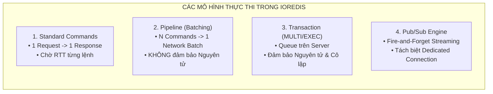
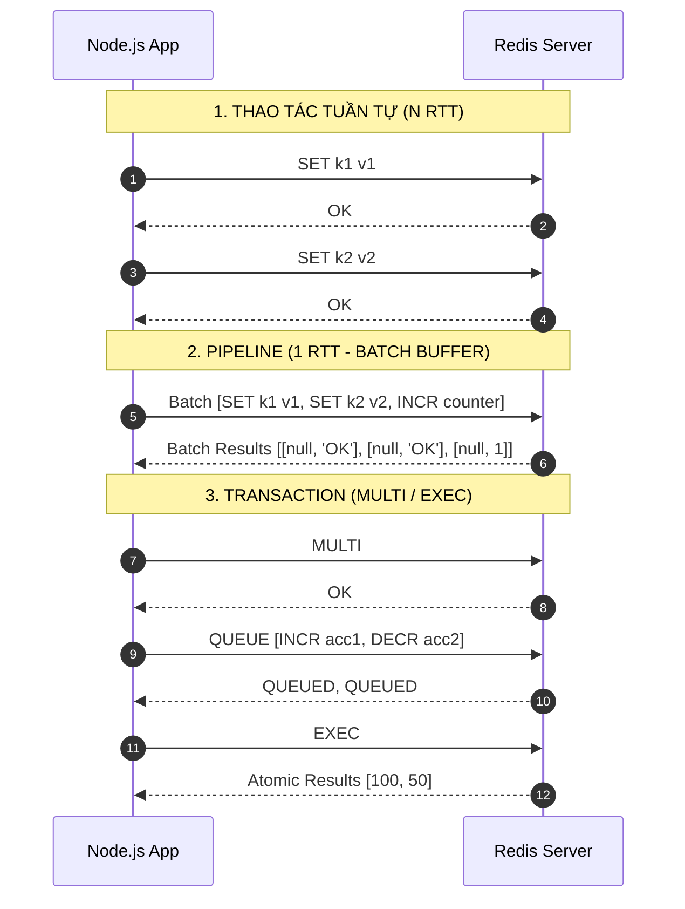
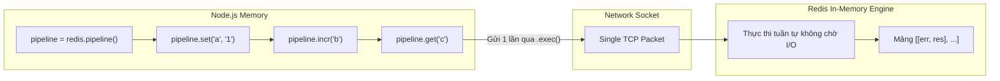
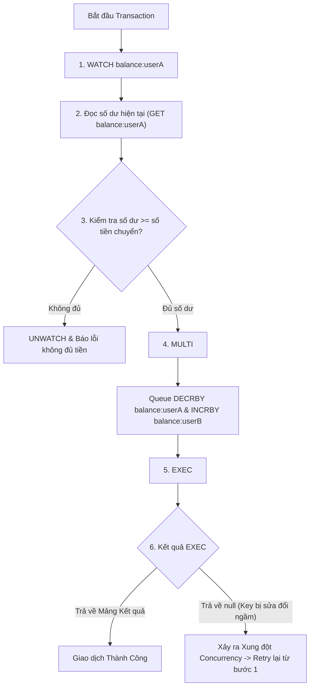
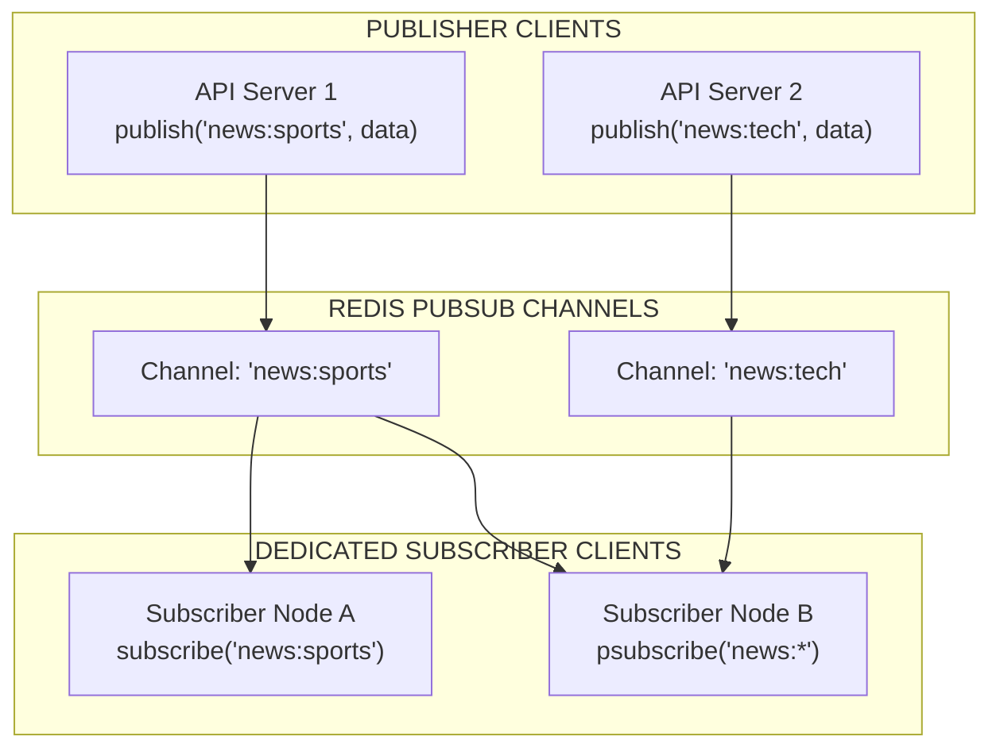

## I. KHÁI QUÁT (OVERVIEW)

### 1. Vấn đề Độ trễ Mạng (Round-Trip Time - RTT) và Giao tiếp Nâng cao
Trong các ứng dụng phân tán, chi phí thực thi một câu lệnh Redis thường chỉ mất vài micro-giây ($\mu s$) trên RAM, nhưng độ trễ truyền tải qua mạng (Round-Trip Time - RTT) giữa ứng dụng Node.js và Redis Server có thể mất từ 0.5ms đến 5ms. Nếu một tác vụ cần gửi 100 câu lệnh tuần tự, tổng thời gian xử lý sẽ bị đội lên tới 500ms chỉ vì chờ đợi mạng (Network I/O Wait).

Để giải quyết bài toán này và cung cấp các mô hình điều phối dữ liệu phức tạp, `ioredis` hỗ trợ 3 cơ chế chuyên biệt:
1. **Pipelines:** Gom nhiều câu lệnh vào một gói tin TCP duy nhất để giảm thiểu RTT.
2. **Transactions (MULTI / EXEC / WATCH):** Thực thi tập hợp lệnh có tính cô lập và bảo đảm tính toàn vẹn thông qua Khóa Lạc Quan (Optimistic Locking).
3. **Pub/Sub (Publish / Subscribe):** Mô hình truyền tin sự kiện thời gian thực phân tán (One-to-Many Fanout).



---

### 2. So sánh Kiến trúc Thực thi Giữa Các Mô hình



---

## II. CHI TIẾT KỸ THUẬT (DETAILED DEEP DIVE)

### 1. Redis Pipelines (`redis.pipeline()`)
Pipeline là cơ chế gửi hàng loạt câu lệnh lên Redis Server mà **không cần chờ phản hồi** của câu lệnh trước đó. Toàn bộ câu lệnh được đệm ở client, gửi đi trong một hoặc một vài TCP packets, và Redis Server xử lý liên tục rồi trả về một mảng kết quả duy nhất.



#### Cú pháp và Xử lý Kết quả:
```typescript
const pipeline = redis.pipeline();
pipeline.set('key1', 'value1');
pipeline.get('key1');
pipeline.incr('counter');

// Kết quả trả về dạng Tuple Array: [ [Error | null, Result], ... ]
const results = await pipeline.exec();
```

- **Mảng kết quả dạng 2 chiều:** Mỗi phần tử tương ứng với một lệnh theo đúng thứ tự chèn. Phần tử là một cặp `[error, result]`.
- **Error Isolation:** Nếu một lệnh trong pipeline bị lỗi (ví dụ: `INCR` trên một string không phải số), **chỉ riêng lệnh đó có `error != null`**, tất cả các lệnh hợp lệ khác trong pipeline vẫn thực thi thành công và trả về kết quả bình thường.

#### Tính năng `enableAutoPipelining`:
Khi khởi tạo client với `enableAutoPipelining: true`, `ioredis` sẽ tự động gom các câu lệnh độc lập được gọi trong cùng một tick của Node.js Event Loop vào một Pipeline ngầm, giúp tăng Throughput lên từ 2x đến 5x mà không cần viết code `redis.pipeline()` thủ công.

---

### 2. Redis Transactions (`redis.multi()` & `WATCH` Optimistic Locking)
Redis Transaction gom nhóm các lệnh nằm giữa khối `MULTI` và `EXEC`.

#### Các đặc tính sống còn của Redis Transaction:
1. **Tính Tuần tự và Cô lập (Sequential & Isolated):** Khi khối `MULTI` đã bước vào pha `EXEC`, Redis sẽ thực thi toàn bộ danh sách lệnh liên tục. Không một request nào từ các client khác có thể chen ngang vào giữa.
2. **Không hỗ trợ Rollback khi gặp lỗi Logic thời gian thực (No Runtime Rollback):** Nếu một lệnh trong `MULTI` bị lỗi kiểu dữ liệu khi chạy (Runtime Error), Redis vẫn thực thi tiếp các lệnh còn lại chứ không hoàn tác (Rollback) các lệnh đã thực hiện trước đó.
3. **Cơ chế Khóa Lạc Quan với `WATCH` (Optimistic Concurrency Control):**
   - Lệnh `WATCH key1 key2` giám sát các key được chỉ định.
   - Nếu có bất kỳ client nào khác thay đổi giá trị của `key1` trước khi client hiện tại kịp gọi `EXEC`, toàn bộ Transaction sẽ bị hủy bỏ và `exec()` trả về `null`.



---

### 3. Pub/Sub Model (Publish / Subscribe Pattern)
Redis Pub/Sub là hệ thống truyền tin theo mô hình Publish-Subscribe phân tán, cho phép một hoặc nhiều Publisher phát tin nhắn đến một hoặc nhiều Subscriber thông qua các Kênh (Channels) hoặc Khớp mẫu (Pattern Matching).



#### Nguyên tắc Bắt buộc về Kiến trúc Kết nối:
> [!CAUTION]
> **Quy tắc Dedicated Connection:** Khi một client `ioredis` thực thi lệnh `subscribe()` hoặc `psubscribe()`, socket kết nối đó sẽ chuyển hoàn toàn sang trạng thái **Subscriber Mode**. Client này **KHÔNG ĐƯỢC PHÉP** thực hiện bất kỳ câu lệnh dữ liệu nào khác (`get`, `set`, `hset`, `publish`). Do đó, hệ thống luôn luôn phải duy trì tối thiểu **2 Client Instances độc lập**:
> 1. `redisClient` thông thường (dùng cho CRUD commands và `publish()`).
> 2. `subClient` chuyên biệt (chỉ dùng cho `subscribe()`, `psubscribe()` và lắng nghe events).

---

## III. VÍ DỤ MINH HỌA VÀ PHÂN TÍCH CODE (PRACTICAL CODE & ANALYSIS)

### 1. Tối ưu Hiệu năng Batch Ingestion bằng Pipeline

Đoạn code sau minh họa việc nạp 10,000 bản ghi vào Redis. Thay vì gửi 10,000 requests đơn lẻ (mất ~15 giây), Pipeline gom nhóm và thực thi chỉ trong ~80ms.

```typescript
// src/services/batch-importer.service.ts
import { RedisService } from '../database/redis.client';

export interface MetricPoint {
  deviceId: string;
  timestamp: number;
  temperature: number;
  humidity: number;
}

export class BatchImporterService {
  private redis = RedisService.getInstance();

  /**
   * Nạp hàng ngàn số liệu đo lường theo từng Batch bằng Pipeline
   */
  public async importMetricsBatch(metrics: MetricPoint[], batchSize: number = 1000): Promise<void> {
    console.time('BatchImportDuration');

    for (let i = 0; i < metrics.length; i += batchSize) {
      const chunk = metrics.slice(i, i + batchSize);
      const pipeline = this.redis.pipeline();

      for (const item of chunk) {
        const key = `metric:${item.deviceId}:${item.timestamp}`;
        pipeline.hset(key, {
          temp: item.temperature.toString(),
          hum: item.humidity.toString(),
        });
        pipeline.expire(key, 86400); // 24 giờ
      }

      // Thực thi toàn bộ lệnh trong chunk hiện tại
      const results = await pipeline.exec();

      if (!results) {
        throw new Error('[Pipeline] Thực thi thất bại (Results null).');
      }

      // Kiểm tra lỗi từng câu lệnh trong Pipeline
      for (const [err, res] of results) {
        if (err) {
          console.error('[Pipeline Error] Lỗi tại câu lệnh con:', err.message);
        }
      }
    }

    console.timeEnd('BatchImportDuration');
  }
}
```

---

### 2. Giao dịch Chuyển tiền An toàn bằng Khóa Lạc Quan (`WATCH` + `MULTI/EXEC`)

Xây dựng hàm chuyển tiền giữa 2 tài khoản, xử lý tranh chấp đồng thời (Concurrency Contention) bằng vòng lặp Retry khi `WATCH` phát hiện dữ liệu bị thay đổi.

```typescript
// src/services/bank-transfer.service.ts
import { RedisService } from '../database/redis.client';

export class BankTransferService {
  private redis = RedisService.getInstance();

  /**
   * Chuyển tiền nguyên tử giữa 2 ví với Optimistic Concurrency Control
   */
  public async transferFunds(
    fromUser: string,
    toUser: string,
    amount: number,
    maxRetries: number = 5
  ): Promise<boolean> {
    const fromKey = `wallet:${fromUser}:balance`;
    const toKey = `wallet:${toUser}:balance`;

    for (let attempt = 1; attempt <= maxRetries; attempt++) {
      try {
        // 1. WATCH key tài khoản nguồn để giám sát thay đổi
        await this.redis.watch(fromKey);

        // 2. Đọc số dư hiện tại
        const rawBalance = await this.redis.get(fromKey);
        const currentBalance = rawBalance ? parseFloat(rawBalance) : 0;

        if (currentBalance < amount) {
          // Không đủ tiền -> Hủy giám sát và trả về false
          await this.redis.unwatch();
          throw new Error(`Số dư không đủ. Hiện có: ${currentBalance}, Cần chuyển: ${amount}`);
        }

        // 3. Khởi tạo khối Transaction MULTI
        const transaction = this.redis.multi();
        transaction.decrby(fromKey, amount);
        transaction.incrby(toKey, amount);

        // 4. Thực thi EXEC
        const results = await transaction.exec();

        // Nếu results === null, nghĩa là fromKey đã bị thay đổi bởi request khác trong lúc ta đang tính toán
        if (results === null) {
          console.warn(`[Transfer Conflict] Xung đột đồng thời tại lần thử ${attempt}. Đang thử lại...`);
          // Delay nhỏ trước khi retry để giảm xung đột
          await new Promise((resolve) => setTimeout(resolve, Math.random() * 50));
          continue;
        }

        console.log(`[Transfer Success] Chuyển ${amount}$ từ ${fromUser} sang ${toUser} thành công.`);
        return true;
      } catch (err: any) {
        // Nếu là lỗi nghiệp vụ (hết tiền), ném lỗi ra ngoài ngay
        if (err.message.includes('Số dư không đủ')) {
          throw err;
        }
        // Luôn unwatch nếu có exception bất thường
        await this.redis.unwatch();
        if (attempt === maxRetries) {
          throw new Error(`Giao dịch thất bại sau ${maxRetries} lần thử lại do xung đột dữ liệu.`);
        }
      }
    }

    return false;
  }
}
```

---

### 3. Hệ thống Real-time Pub/Sub Chat & Notification Đa Server

Dưới đây là kiến trúc phân tán cho WebSocket Servers chia sẻ tin nhắn thông qua Redis Pub/Sub, hỗ trợ cả Kênh cụ thể và Khớp mẫu Pattern.

```typescript
// src/services/pubsub-broker.service.ts
import Redis from 'ioredis';
import { RedisService } from '../database/redis.client';

export interface ChatMessage {
  roomId: string;
  senderId: string;
  text: string;
  timestamp: number;
}

export class PubSubBrokerService {
  // Client thông thường để gửi tin (Publish)
  private publisherClient: Redis;
  // Client chuyên biệt chỉ để Lắng nghe (Subscribe)
  private subscriberClient: Redis;

  constructor() {
    this.publisherClient = RedisService.getInstance();
    
    // Khởi tạo kết nối riêng biệt cho Subscriber
    this.subscriberClient = this.publisherClient.duplicate();
    this.initSubscriberEvents();
  }

  private initSubscriberEvents(): void {
    // 1. Lắng nghe sự kiện từ kênh cụ thể (subscribe)
    this.subscriberClient.on('message', (channel: string, messageStr: string) => {
      try {
        const payload: ChatMessage = JSON.parse(messageStr);
        console.log(`[PubSub Direct] Nhận tin nhắn từ kênh [${channel}]:`, payload);
        // Chuyển tiếp tin nhắn tới Local WebSockets kết nối trên server này...
      } catch (err) {
        console.error('[PubSub] Lỗi parse JSON message:', err);
      }
    });

    // 2. Lắng nghe sự kiện từ kênh khớp mẫu (psubscribe)
    this.subscriberClient.on('pmessage', (pattern: string, channel: string, messageStr: string) => {
      console.log(`[PubSub Pattern] Khớp mẫu [${pattern}] trên kênh [${channel}]:`, messageStr);
    });

    this.subscriberClient.on('ready', () => {
      console.log('[PubSub] Subscriber Client đã sẵn sàng lắng nghe.');
    });
  }

  /**
   * Đăng ký nhận tin từ một Chat Room cụ thể
   */
  public async subscribeToRoom(roomId: string): Promise<void> {
    const channel = `chat:room:${roomId}`;
    await this.subscriberClient.subscribe(channel);
    console.log(`[PubSub] Đã subscribe vào channel: ${channel}`);
  }

  /**
   * Đăng ký nhận tin từ toàn bộ các kênh thông báo hệ thống bằng Pattern
   */
  public async subscribeToSystemAlerts(): Promise<void> {
    const pattern = 'system:alerts:*';
    await this.subscriberClient.psubscribe(pattern);
    console.log(`[PubSub] Đã psubscribe vào pattern: ${pattern}`);
  }

  /**
   * Phát tin nhắn tới một Room
   */
  public async publishToRoom(roomId: string, message: ChatMessage): Promise<number> {
    const channel = `chat:room:${roomId}`;
    const payload = JSON.stringify(message);
    
    // publish trả về số lượng subscribers đang nhận tin nhắn
    const receiverCount = await this.publisherClient.publish(channel, payload);
    console.log(`[PubSub Publish] Tin nhắn gửi tới ${receiverCount} subscribers.`);
    return receiverCount;
  }

  /**
   * Hủy đăng ký kênh khi không còn nhu cầu
   */
  public async unsubscribeRoom(roomId: string): Promise<void> {
    const channel = `chat:room:${roomId}`;
    await this.subscriberClient.unsubscribe(channel);
  }
}
```

---

## IV. LƯU Ý CẠM BẪY VÀ QUY TẮC CỐT LÕI (TRAPS & BEST PRACTICES)

### 1. Cạm bẫy Nhầm lẫn giữa Pipeline và Multi/Exec (Transaction)
- **Pipeline KHÔNG mang tính nguyên tử:** Nếu Client A gửi một Pipeline gồm 10 lệnh, Redis Server có thể xen kẽ các lệnh của Client B vào giữa 10 lệnh này. Pipeline chỉ đơn thuần là kỹ thuật tối ưu hóa I/O Network.
- **Multi/Exec MANG TÍNH NGUYÊN TỬ:** Khi lệnh `EXEC` được chạy, không một lệnh nào khác từ client khác có thể chen ngang.

```
Pipeline:    [Cmd 1] -----> [Cmd 2] --- (Client B Cmd) ---> [Cmd 3]  (KHÔNG ATOMIC)
MULTI/EXEC:  [================ MULTI BẮT ĐẦU ================]
             [Cmd 1] -> [Cmd 2] -> [Cmd 3] (Khóa toàn phần, không chen ngang)
             [================ EXEC HOÀN TẤT ===============]
```

---

### 2. Cạm bẫy Không có Rollback trong Redis Transactions
Nhiều lập trình viên quen với SQL RDBMS thường lầm tưởng `MULTI/EXEC` sẽ tự động rollback toàn bộ dữ liệu nếu có lỗi xảy ra.

```typescript
// VÍ DỤ MINH HỌA CẠM BẪY RUNTIME ERROR:
const multi = redis.multi();
multi.set('user:score', 'string_value'); // Set kiểu String
multi.incr('user:score');               // ❌ LỖI: INCR trên chuỗi ký tự -> ERR value is not an integer
multi.set('user:status', 'active');     // Lệnh này VẪN ĐƯỢC THỰC THI THÀNH CÔNG!

const results = await multi.exec();
// results[0] -> [null, 'OK']
// results[1] -> [Error: ERR value is not an integer..., null]
// results[2] -> [null, 'OK'] -> Dữ liệu 'user:status' VẪN BỊ GHI VÀO DB!
```

> [!WARNING]
> **Quy tắc:** Để đảm bảo tính nguyên tử tuyệt đối và có khả năng Rollback logic có điều kiện phức tạp, hãy sử dụng **Lua Scripting** (Bài 05) thay vì `MULTI/EXEC`.

---

### 3. Cạm bẫy Mất mát Dữ liệu trong Pub/Sub (At-Most-Once Delivery)
Redis Pub/Sub hoạt động theo cơ chế **Fire-and-Forget**:
1. Redis không lưu lại lịch sử tin nhắn trong bộ nhớ.
2. Nếu tại thời điểm Publish, một Subscriber bị rớt mạng hoặc khởi động lại, tin nhắn đó sẽ **vĩnh viễn biến mất** đối với subscriber đó.
3. Không có cơ chế Acknowledgment (ACK) hay Retry.

> [!TIP]
> **Khi nào nên dùng Redis Streams thay vì Pub/Sub?**
> Nếu hệ thống yêu cầu: Đảm bảo không mất tin (Persistent Messages), Hỗ trợ Consumer Groups, Đọc lại lịch sử tin nhắn, và Cơ chế ACK xử lý lỗi -> Hãy chuyển sang sử dụng **Redis Streams (`XADD`, `XREADGROUP`, `XACK`)**. Chỉ dùng Pub/Sub cho các tác vụ thời gian thực thuần túy như gửi tọa độ bản đồ, thông báo live typing, hoặc làm mới cache nội bộ của server.

---

### 4. Bảng So Sánh Toàn Diện: Pipeline vs Multi/Exec vs Pub/Sub

| Tiêu chí | Pipeline | Multi / Exec (Transaction) | Pub / Sub |
| :--- | :--- | :--- | :--- |
| **Mục đích chính** | Giảm thiểu độ trễ RTT mạng khi gửi nhiều lệnh | Đảm bảo tính nguyên tử và cô lập khi thực thi | Phân phát sự kiện thời gian thực (Fanout) |
| **Tính Nguyên tử (Atomicity)** | ❌ Không | ✅ Có (Không bị chen ngang) | ❌ Không áp dụng |
| **Hỗ trợ Khóa Lạc Quan** | ❌ Không | ✅ Có (Dùng kết hợp với `WATCH`) | ❌ Không |
| **Kết nối Yêu cầu** | Dùng chung Connection pool thông thường | Dùng chung Connection pool | Bắt buộc 1 Connection Subscriber riêng biệt |
| **Lưu trữ Bền vững** | Có (Theo cấu hình RDB/AOF) | Có (Theo cấu hình RDB/AOF) | ❌ Hoàn toàn không lưu trữ |
| **Xử lý Lỗi** | Trả về mảng `[err, res]` cho từng lệnh | Trả về `null` nếu WATCH fail; Lệnh lỗi không rollback lệnh khác | Bỏ qua nếu không có người nghe |
