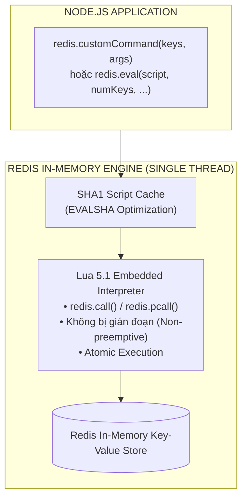
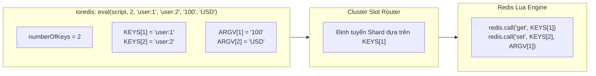
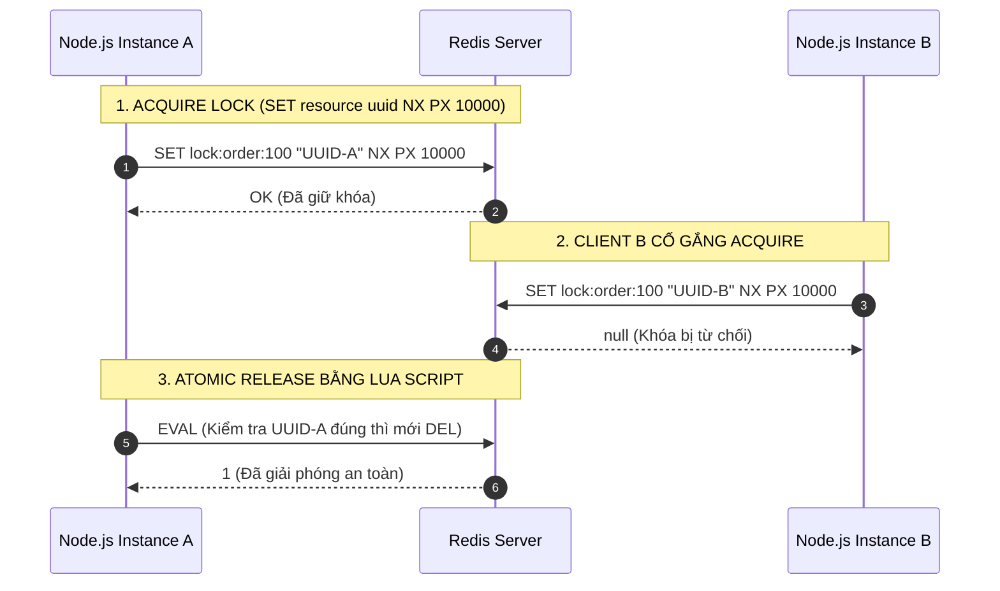
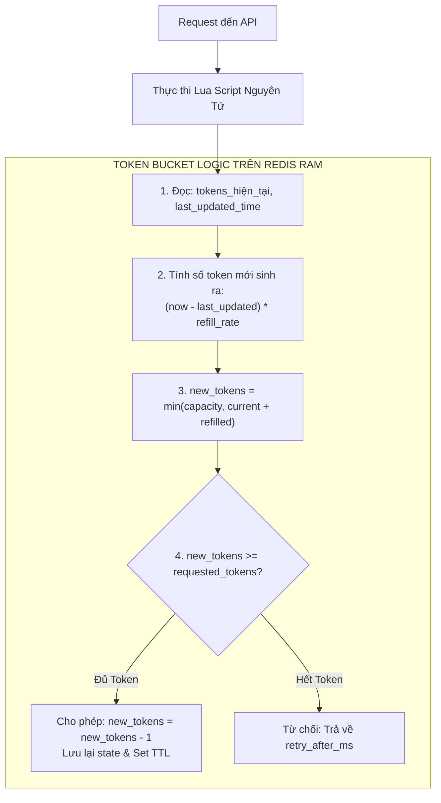
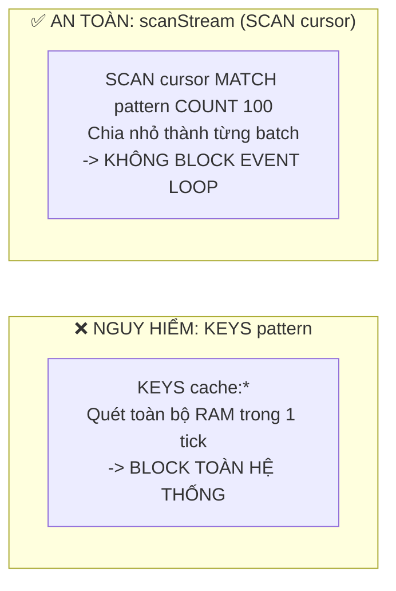

## I. KHÁI QUÁT (OVERVIEW)

### 1. Sức mạnh của Lua Scripting trong Redis
Mặc dù Redis cung cấp `MULTI/EXEC` cho các giao dịch cơ bản, nó không thể xử lý các nghiệp vụ phụ thuộc vào kết quả trung gian (Conditional Logic / Check-and-Set) mà không phải dùng `WATCH` kèm rủi ro Retry liên tục. **Lua Scripting** ra đời như một giải pháp tối thượng: cho phép nhúng mã nguồn Lua để thực thi trực tiếp trên Server Redis với **tính Nguyên tử tuyệt đối (100% Atomic)**.



#### Vì sao Lua Scripting là công cụ bắt buộc cho Senior Backend:
1. **Tính Nguyên tử hoàn hảo (Guaranteed Atomicity):** Khi một Lua script đang chạy, toàn bộ Redis Server dành trọn vẹn Event Loop cho script đó. Không một câu lệnh nào khác từ bất kỳ client nào có thể xen vào giữa.
2. **Loại bỏ hoàn toàn Race Condition:** Không cần đến các kỹ thuật khóa phân tán phức tạp cho các tác vụ Check-and-Set cục bộ.
3. **Tiết kiệm Băng thông & RTT:** Thay vì phải gửi 5 câu lệnh qua lại giữa Node.js và Redis, toàn bộ logic được đóng gói và thực thi một lần duy nhất trên server.
4. **Tối ưu hóa Tốc độ với SHA1 (`EVALSHA`):** Redis lưu mã bytecode đã biên dịch của script trong bộ nhớ đệm. `ioredis` sẽ tự động gửi mã băm SHA1 40 ký tự thay vì gửi toàn bộ đoạn code Lua dài, giảm tối đa dung lượng gói tin mạng.

---

## II. CHI TIẾT KỸ THUẬT (DETAILED DEEP DIVE)

### 1. Cú pháp `eval()` và Nguyên tắc Vàng: `KEYS` vs `ARGV`

Khi thực thi một đoạn mã Lua trong Redis, tất cả các tham số truyền vào bắt buộc phải được phân loại thành **Khóa (`KEYS`)** hoặc **Tham số (`ARGV`)**.



#### Sự khác biệt cốt tử giữa `KEYS` và `ARGV`:
- **`KEYS` (1-indexed):** Chứa danh sách tên các Key trong Redis mà script sẽ truy cập hoặc thay đổi. 
  > [!IMPORTANT]
  > **Quy tắc Cluster:** Trong Redis Cluster, Redis dựa vào mảng `KEYS` để xác định Hash Slot và gửi script tới đúng Shard. Nếu bạn truy cập một key được giấu trong `ARGV` hoặc hardcode trong code Lua, Redis Cluster sẽ không thể phát hiện và ném lỗi `CROSSSLOT Keys in request don't hash to the same slot`.
- **`ARGV` (1-indexed):** Chứa các tham số dữ liệu thông thường (số tiền, chuỗi JSON, thời gian timeout, metadata...).

#### `redis.call()` vs `redis.pcall()`:
- `redis.call()`: Nếu câu lệnh bên trong Redis gặp lỗi (ví dụ sai kiểu dữ liệu), nó sẽ **ném Runtime Exception**, dừng script ngay lập tức và trả lỗi về cho Node.js Client.
- `redis.pcall()`: Bắt lỗi nội bộ (Protected Call) và trả về một Lua Table chứa thông tin lỗi (`{ err = "..." }`), cho phép script tiếp tục chạy và tự xử lý logic fallback.

---

### 2. Đăng ký Custom Command với `redis.defineCommand()`

Thay vì phải gọi `redis.eval(luaCode, ...)` rải rác khắp ứng dụng, `ioredis` cung cấp phương thức `redis.defineCommand()`. Kỹ thuật này giúp đăng ký câu lệnh Lua thành một Method chính thức trên instance của `Redis`.

```typescript
redis.defineCommand('releaseLock', {
  numberOfKeys: 1,
  lua: `
    if redis.call("get", KEYS[1]) == ARGV[1] then
      return redis.call("del", KEYS[1])
    else
      return 0
    end
  `,
});

// Sau khi định nghĩa, có thể gọi trực tiếp như native method:
// @ts-ignore (hoặc khai báo module declaration)
const result = await redis.releaseLock('lock:order:100', 'client-uuid-token');
```

`ioredis` ngầm quản lý quá trình:
1. Tính toán mã SHA1 của chuỗi `lua`.
2. Gửi lệnh `EVALSHA <sha1> ...`.
3. Nếu Redis Server vừa bị khởi động lại và xóa cache script (trả về lỗi `NOSCRIPT No matching script`), `ioredis` sẽ tự động fallback gửi toàn bộ đoạn code bằng lệnh `EVAL` và nạp lại script vào cache một cách trong suốt.

---

### 3. Advanced Pattern 1: Safe Distributed Mutex Lock (Khóa Phân Tán An Toàn)

Khóa phân tán là mô hình sống còn để ngăn chặn Race Condition khi nhiều Node.js instances cùng xử lý một tài nguyên (ví dụ: thanh toán đơn hàng, trừ kho sản phẩm).



#### Vì sao giải phóng Lock BẮT BUỘC phải dùng Lua Script?
Nếu không dùng Lua Script mà dùng 2 lệnh riêng biệt: `GET` -> kiểm tra nếu trùng `UUID` thì gọi `DEL`:
1. Client A đọc thấy `UUID-A` hợp lệ.
2. Đúng lúc đó GC (Garbage Collection) của Node.js dừng luồng trong vài giây, khiến Lock của Client A bị hết hạn TTL trên Redis.
3. Client B tranh thủ chiếm được Lock với `UUID-B`.
4. Client A tiếp tục chạy và gửi lệnh `DEL lock:order:100`. Hậu quả: **Client A đã xóa nhầm Lock của Client B**, mở toang cánh cửa cho Client C nhảy vào gây lỗi dữ liệu nghiêm trọng!

---

### 4. Advanced Pattern 2: Token Bucket Rate Limiter bằng Lua

Thuật toán Token Bucket nạp liên tục các Token vào bình theo thời gian thực ($refillRate$). Khi có request tới, hệ thống kiểm tra và trừ Token một cách nguyên tử.



---

### 5. Safe Iteration: Thay thế `KEYS *` bằng `scanStream()`

Lệnh `KEYS *` hoặc `KEYS prefix:*` là một trong những lệnh nguy hiểm nhất trong môi trường Production:
- Độ phức tạp $O(N)$ quét toàn bộ hàng chục triệu key trong cơ sở dữ liệu.
- Làm nghẽn đơn luồng Redis trong nhiều giây đến nhiều phút, gây sập toàn bộ hệ thống dịch vụ phụ thuộc.



`ioredis` tích hợp sẵn **Node.js Readable Streams** cho các lệnh quét dữ liệu: `scanStream()`, `hscanStream()`, `sscanStream()`, `zscanStream()`. Thư viện tự động quản lý con trỏ `cursor`, phát sự kiện `data` khi có từng mảng key, và tự động dừng khi con trỏ quay về `0`.

---

## III. VÍ DỤ MINH HỌA VÀ PHÂN TÍCH CODE (PRACTICAL CODE & ANALYSIS)

### 1. Module Quản lý Khóa Phân Tán (Distributed Mutex Lock) Hoàn Chỉnh

Dưới đây là một triển khai chuẩn Enterprise với tính năng: Acquire kèm Exponential Retry, Tự động gia hạn Lock (Heartbeat Watchdog), và Giải phóng nguyên tử bằng Lua Script.

```typescript
// src/services/distributed-lock.service.ts
import Redis from 'ioredis';
import { randomUUID } from 'crypto';
import { RedisService } from '../database/redis.client';

export class DistributedLock {
  private redis: Redis;

  constructor() {
    this.redis = RedisService.getInstance();
    this.registerLuaCommands();
  }

  private registerLuaCommands(): void {
    // Đăng ký Lua Script giải phóng Lock an toàn
    this.redis.defineCommand('releaseSafeLock', {
      numberOfKeys: 1,
      lua: `
        if redis.call("get", KEYS[1]) == ARGV[1] then
          return redis.call("del", KEYS[1])
        else
          return 0
        end
      `,
    });

    // Đăng ký Lua Script gia hạn Lock (Heartbeat Watchdog)
    this.redis.defineCommand('renewLockTTL', {
      numberOfKeys: 1,
      lua: `
        if redis.call("get", KEYS[1]) == ARGV[1] then
          return redis.call("pexpire", KEYS[1], ARGV[2])
        else
          return 0
        end
      `,
    });
  }

  /**
   * Chiếm khóa với TTL và cơ chế thử lại (Retry)
   */
  public async acquire(
    resourceKey: string,
    ttlMs: number = 10000,
    acquireTimeoutMs: number = 3000
  ): Promise<{ lockId: string; unlock: () => Promise<boolean> } | null> {
    const lockKey = `lock:${resourceKey}`;
    const lockId = randomUUID(); // Giá trị định danh độc nhất của Client
    const startTime = Date.now();

    while (Date.now() - startTime < acquireTimeoutMs) {
      // SET key value NX PX ttlMs
      const result = await this.redis.set(lockKey, lockId, 'PX', ttlMs, 'NX');

      if (result === 'OK') {
        // Chiếm khóa thành công -> Khởi chạy Heartbeat Watchdog để tự động gia hạn
        const watchdogInterval = setInterval(async () => {
          try {
            // @ts-ignore
            const renewed = await this.redis.renewLockTTL(lockKey, lockId, ttlMs);
            if (renewed !== 1) {
              clearInterval(watchdogInterval);
            }
          } catch {
            clearInterval(watchdogInterval);
          }
        }, Math.floor(ttlMs / 3));

        // Trả về hàm unlock đóng gói sẵn
        const unlock = async (): Promise<boolean> => {
          clearInterval(watchdogInterval);
          // @ts-ignore
          const released = await this.redis.releaseSafeLock(lockKey, lockId);
          return released === 1;
        };

        return { lockId, unlock };
      }

      // Nếu chưa lấy được lock, chờ ngẫu nhiên từ 20ms - 50ms rồi thử lại
      await new Promise((resolve) => setTimeout(resolve, 20 + Math.random() * 30));
    }

    return null; // Quá thời gian acquireTimeoutMs mà không lấy được lock
  }
}
```

---

### 2. Token Bucket Rate Limiter bằng Custom Lua Command

```typescript
// src/services/token-bucket.service.ts
import Redis from 'ioredis';
import { RedisService } from '../database/redis.client';

export interface RateLimitResult {
  allowed: boolean;
  tokensLeft: number;
  retryAfterMs: number;
}

export class TokenBucketLimiter {
  private redis: Redis;

  constructor() {
    this.redis = RedisService.getInstance();
    this.initCommand();
  }

  private initCommand(): void {
    this.redis.defineCommand('consumeTokenBucket', {
      numberOfKeys: 1,
      lua: `
        local key = KEYS[1]
        local capacity = tonumber(ARGV[1])
        local refillRatePerMs = tonumber(ARGV[2])
        local requested = tonumber(ARGV[3])
        local now = tonumber(ARGV[4])

        local state = redis.call("HMGET", key, "tokens", "lastUpdated")
        local tokens = tonumber(state[1])
        local lastUpdated = tonumber(state[2])

        if tokens == nil then
          tokens = capacity
          lastUpdated = now
        else
          -- Tính toán số token sinh thêm dựa trên thời gian trôi qua
          local elapsed = math.max(0, now - lastUpdated)
          local generatedTokens = elapsed * refillRatePerMs
          tokens = math.min(capacity, tokens + generatedTokens)
          lastUpdated = now
        end

        if tokens >= requested then
          tokens = tokens - requested
          redis.call("HMSET", key, "tokens", tokens, "lastUpdated", lastUpdated)
          -- Đặt TTL gấp đôi thời gian đầy bình để tự dọn dẹp RAM
          local ttlSeconds = math.ceil((capacity / (refillRatePerMs * 1000)) * 2)
          redis.call("EXPIRE", key, math.max(60, ttlSeconds))
          return {1, math.floor(tokens), 0}
        else
          redis.call("HMSET", key, "tokens", tokens, "lastUpdated", lastUpdated)
          local missingTokens = requested - tokens
          local retryAfterMs = math.ceil(missingTokens / refillRatePerMs)
          return {0, math.floor(tokens), retryAfterMs}
        end
      `,
    });
  }

  /**
   * Tiêu thụ Token từ Bucket
   * @param identifier Định danh Client (User ID, IP)
   * @param capacity Dung lượng tối đa của bình (ví dụ: 100 tokens)
   * @param refillPerSecond Tốc độ nạp (ví dụ: 10 tokens/giây)
   * @param cost Số token cần tiêu thụ cho request này (mặc định: 1)
   */
  public async consume(
    identifier: string,
    capacity: number = 100,
    refillPerSecond: number = 10,
    cost: number = 1
  ): Promise<RateLimitResult> {
    const key = `rate_bucket:${identifier}`;
    const refillRatePerMs = refillPerSecond / 1000;
    const now = Date.now();

    // @ts-ignore
    const [status, tokensLeft, retryAfterMs] = await this.redis.consumeTokenBucket(
      key,
      capacity.toString(),
      refillRatePerMs.toString(),
      cost.toString(),
      now.toString()
    );

    return {
      allowed: status === 1,
      tokensLeft,
      retryAfterMs,
    };
  }
}
```

---

### 3. Xóa Hàng Loạt Keys An Toàn bằng `scanStream()` và Pipeline

Đoạn code sau tìm và xóa tất cả các key theo pattern (ví dụ: `cache:user:*`) mà **không bao giờ làm treo single thread của Redis**.

```typescript
// src/services/safe-cleaner.service.ts
import { RedisService } from '../database/redis.client';

export class SafeCleanerService {
  private redis = RedisService.getInstance();

  /**
   * Quét và xóa hàng triệu key an toàn theo Pattern
   */
  public async deleteKeysByPattern(pattern: string, batchSize: number = 500): Promise<number> {
    let totalDeleted = 0;

    return new Promise((resolve, reject) => {
      // Khởi tạo stream quét key với COUNT gợi ý kích thước mỗi lần lặp cursor
      const stream = this.redis.scanStream({
        match: pattern,
        count: batchSize,
      });

      let currentBatch: string[] = [];

      stream.on('data', async (keys: string[]) => {
        if (keys.length === 0) return;

        currentBatch.push(...keys);

        if (currentBatch.length >= batchSize) {
          // Tạm dừng Stream để tránh tràn bộ nhớ RAM (Backpressure Handling)
          stream.pause();

          const keysToDelete = [...currentBatch];
          currentBatch = [];

          try {
            // Sử dụng Pipeline để xóa batch key trong 1 Round-Trip
            const pipeline = this.redis.pipeline();
            for (const key of keysToDelete) {
              pipeline.del(key);
            }
            await pipeline.exec();
            totalDeleted += keysToDelete.length;
            console.log(`[SafeCleaner] Đã xóa ${totalDeleted} keys...`);
          } catch (err) {
            stream.destroy(err as Error);
            return reject(err);
          }

          // Tiếp tục đọc Stream sau khi xử lý xong batch
          stream.resume();
        }
      });

      stream.on('end', async () => {
        // Xóa nốt số key còn lại trong batch cuối cùng
        if (currentBatch.length > 0) {
          const pipeline = this.redis.pipeline();
          for (const key of currentBatch) {
            pipeline.del(key);
          }
          await pipeline.exec();
          totalDeleted += currentBatch.length;
        }
        console.log(`[SafeCleaner] Hoàn tất dọn dẹp. Tổng số keys đã xóa: ${totalDeleted}`);
        resolve(totalDeleted);
      });

      stream.on('error', (err) => {
        console.error('[SafeCleaner] Lỗi Stream scanning:', err);
        reject(err);
      });
    });
  }
}
```

---

## IV. LƯU Ý CẠM BẪY VÀ QUY TẮC CỐT LÕI (TRAPS & BEST PRACTICES)

### 1. Cạm bẫy Hardcode Key bên trong Lua Script
Nếu bạn viết một đoạn Lua Script truy cập trực tiếp vào một chuỗi Key cứng mà không truyền qua mảng `KEYS`:

```lua
-- ❌ SAI LẦM TAI HẠI TRÊN REDIS CLUSTER:
redis.call("SET", "global_counter", 1)
```

> [!CAUTION]
> Khi chạy trên Redis Cluster, Redis không thể phân tích trước đoạn mã Lua để biết key `"global_counter"` thuộc slot nào. Nó sẽ thực thi trên node tiếp nhận yêu cầu ban đầu. Nếu node đó không sở hữu slot của `"global_counter"`, script sẽ crash ngay lập tức.
> 
> **Quy tắc:** MỌI Key tương tác bên trong Lua script BẮT BUỘC phải được truyền thông qua mảng `KEYS[1]`, `KEYS[2]...` từ phía Node.js.

---

### 2. Cạm bẫy Lua Script Chạy Quá Lâu (Lua Script Timeout)
Mặc định trong file cấu hình Redis: `lua-time-limit 5000` (5 giây).
- Nếu Lua script chạy lâu hơn 5 giây (do vòng lặp vô tận, thuật toán phức tạp, hoặc duyệt qua mảng dữ liệu quá khổng lồ), Redis sẽ **từ chối tất cả các lệnh của client khác** và trả về lỗi:
  `BUSY Redis is busy running a script. You can only call SCRIPT KILL or SHUTDOWN NOSAVE.`
- Lúc này, Redis hoàn toàn bị tê liệt.

> [!WARNING]
> **Quy tắc thiết kế Lua Script:** Lua Script chỉ nên chứa các phép tính logic đơn giản, so sánh điều kiện và vài thao tác đọc/ghi cơ bản. Thời gian thực thi một script **không bao giờ được vượt quá 10 mili-giây (10ms)**.

---

### 3. Cạm bẫy Ép kiểu Dữ liệu giữa Lua và JavaScript / RESP
Hệ thống kiểu dữ liệu của Lua và JavaScript có sự khác biệt lớn mà lập trình viên rất dễ mắc lỗi:

| Trả về từ Lua Script | Giá trị nhận được trong `ioredis` (Node.js) | Chú thích quan trọng |
| :--- | :--- | :--- |
| `return nil` | `null` | Giá trị rỗng |
| `return false` | `null` | **Cạm bẫy:** Lua `false` được RESP chuyển thành `null` chứ không phải boolean `false`! |
| `return true` | `1` | Lua `true` được RESP chuyển thành số nguyên `1` |
| `return 1` | `1` (number) | Số nguyên giữ nguyên |
| `return 3.14` | `3` (bị mất phần thập phân!) | **Cạm bẫy:** RESP2 chỉ hỗ trợ integer. Muốn trả về float, phải dùng `return tostring(3.14)` |
| `return {1, 2, "hello"}` | `[1, 2, 'hello']` | Lua Array Table chuyển thành JS Array |
| `return { key = "val" }` | `[]` (Mảng rỗng!) | **Cạm bẫy:** Lua Key-Value Table (Dictionary) không được RESP2 hỗ trợ trực tiếp |

---

### 4. 10 Nguyên Tắc Vàng Khi Viết Lua Scripts trong ioredis

1. **Luôn dùng `KEYS` cho khóa và `ARGV` cho tham số:** Tuyệt đối không hardcode key bên trong thân script.
2. **Luôn nhớ Lua là 1-indexed:** Phần tử đầu tiên của `KEYS` và `ARGV` là `KEYS[1]`, `ARGV[1]`, không phải chỉ số `0`.
3. **Giữ Script cực kỳ ngắn và nhẹ:** Mục tiêu dưới 5ms thực thi. Không thực hiện các vòng lặp duyệt hàng trăm ngàn phần tử.
4. **Sử dụng `redis.defineCommand()`:** Tận dụng khả năng tự động tính SHA1 và fallback `EVALSHA` của `ioredis`.
5. **Không dùng các hàm Non-Deterministic:** Tránh gọi `math.random()` hay `os.time()` trong script vì chúng có thể làm sai lệch dữ liệu giữa Master và Replica khi replication. Hãy truyền timestamp ngẫu nhiên từ Node.js qua `ARGV`.
6. **Xử lý số thực dạng String:** Khi tính toán số thực (Float), hãy `tostring()` kết quả trước khi `return` để tránh bị cắt cụt phần thập phân.
7. **Tránh `KEYS *` vĩnh viễn:** Thay thế toàn bộ bằng `scanStream()` kết hợp xử lý Backpressure (`pause` / `resume`).
8. **Giải phóng Lock luôn luôn dùng Lua:** Không bao giờ tách rời thao tác `GET` và `DEL` khi viết Distributed Lock.
9. **Tận dụng `pcall` khi cần bắt lỗi nội bộ:** Giúp script không bị sập giữa chừng khi một lệnh con thất bại.
10. **Tự dọn dẹp RAM:** Luôn gọi `EXPIRE` hoặc `PEXPIRE` trên các key tạo ra bởi Lua script để tránh rò rỉ bộ nhớ.
