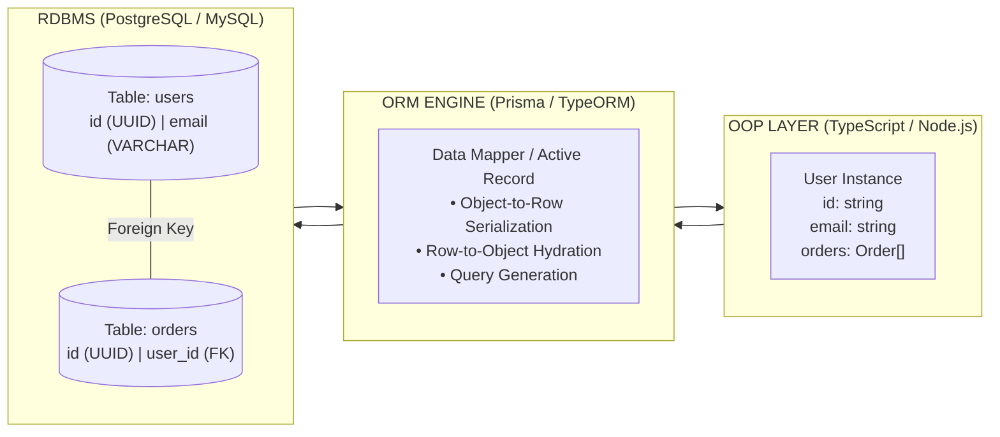
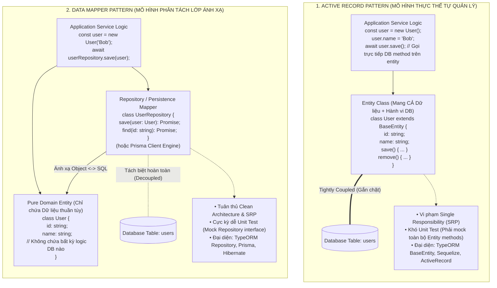
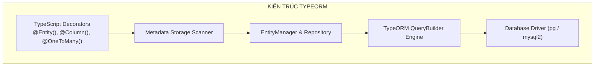
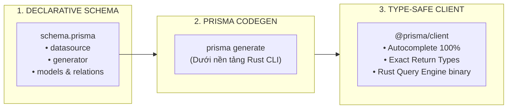
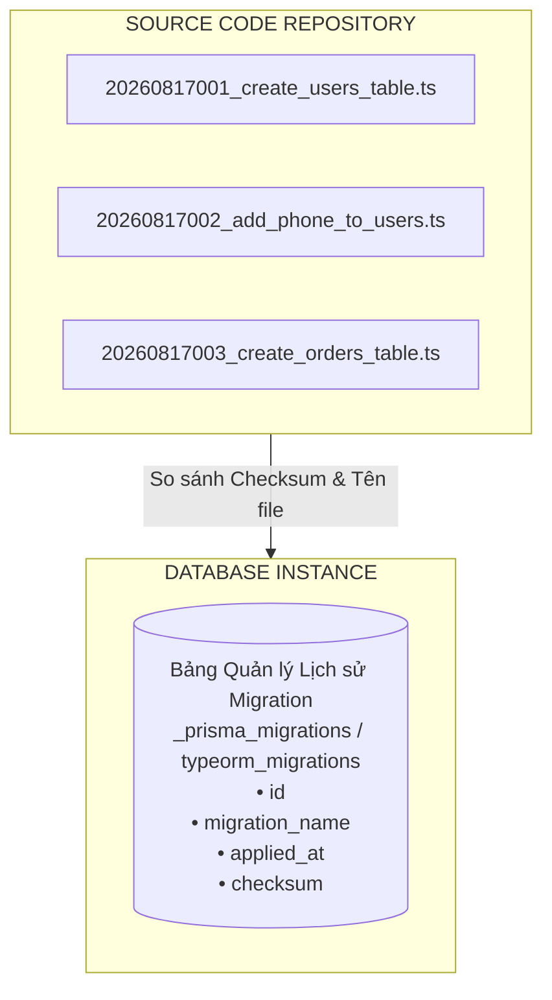
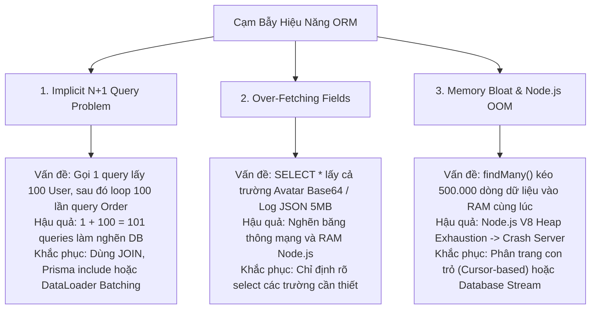

## I. KHÁI QUÁT (OVERVIEW)

### 1. ORM (Object-Relational Mapping) là gì?
**ORM (Object-Relational Mapping)** là một kỹ thuật lập trình và tầng trừu tượng (Abstraction Layer) đóng vai trò làm cầu nối chuyển đổi dữ liệu giữa hai thế giới không tương thích:
1. **Thế giới Lập trình Hướng đối tượng (OOP):** Dữ liệu được biểu diễn dưới dạng các Object, Class, Instances, con trỏ và mối quan hệ cha-con.
2. **Thế giới Cơ sở Dữ liệu Quan hệ (RDBMS):** Dữ liệu được lưu trữ trong các bảng 2 chiều (Tables) gồm các hàng (Rows) và cột (Columns), ràng buộc bằng Khóa chính (Primary Key) và Khóa ngoại (Foreign Key).



---

### 2. Hai Mô hình Thiết kế Cốt lõi: Active Record vs Data Mapper

Trong thế giới ORM, có hai trường phái thiết kế kiến trúc đối lập nhau được định nghĩa bởi Martin Fowler:



#### a. Active Record Pattern
* **Nguyên lý:** Một Entity đại diện trực tiếp cho một hàng trong Database và chứa luôn các phương thức CRUD tương tác cơ sở dữ liệu (`save()`, `remove()`, `find()`).
* **Ưu điểm:** Đơn giản, trực quan, viết code ngắn gọn, cực kỳ phù hợp cho các dự án nhỏ, CRUD cơ bản.
* **Nhược điểm:** Vi phạm nguyên lý **Single Responsibility Principle (SRP)**. Domain Model bị gắn chặt chẽ (tightly coupled) với tầng Persistence của Database, gây khó khăn cho việc viết Unit Test và tách kiến trúc Clean Architecture / Hexagonal Architecture.

#### b. Data Mapper Pattern
* **Nguyên lý:** Tách rời hoàn toàn Entity (chỉ chứa thuộc tính dữ liệu và Domain Logic) khỏi tầng Persistence. Việc lưu trữ, truy vấn được ủy quyền cho một lớp riêng biệt gọi là **Repository** hoặc **Prisma Client Engine**.
* **Ưu điểm:** Tuân thủ nguyên lý thiết kế SRP, Domain Model độc lập hoàn toàn với cấu trúc bảng, dễ dàng Mocking và Unit Test.
* **Nhược điểm:** Phức tạp hơn, cần khởi tạo và tiêm phụ thuộc (Dependency Injection) các Repository.

---

### 3. Toàn cảnh Phổ Giải pháp Truy cập Dữ liệu trong Node.js

| Tiêu chí | Raw SQL Driver (`pg`, `mysql2`) | Query Builder (Kysely, Knex) | Heavyweight ORM (TypeORM) | Schema-First ORM (Prisma) |
| :--- | :--- | :--- | :--- | :--- |
| **Mức độ trừu tượng** | Cực thấp (Raw string) | Trung bình (Fluent API) | Cao (Decorators / OOP) | Cao (Schema DSL / Rust Engine) |
| **Type Safety** | Không có (hoặc thủ công) | Rất cao (Kysely) | Trung bình (Dựa trên Decorators) | **Tuyệt đối (Auto Generated)** |
| **Hiệu năng & Tối ưu** | Cực đại ($100\%$) | Rất cao ($95-98\%$) | Trung bình (Overhead hydration) | Cao (Tối ưu Rust Engine) |
| **Độ phức tạp Migration** | Tự quản lý file `.sql` | Tự viết mã migration JS/TS | TypeORM CLI / Sync | **Prisma Migrate cực kỳ mượt mà** |
| **Hỗ trợ SQL Phức tạp** | Không giới hạn | Rất tốt (Subqueries, CTE, Window) | Khá (QueryBuilder) | Hạn chế (Thường cần `$queryRaw`) |

---

## II. CHI TIẾT KỸ THUẬT (DETAILED DEEP DIVE)

### 1. TypeORM Chuyên Sâu (TypeORM Deep Dive)

TypeORM là ORM đầu tiên mang phong cách Hibernate/JPA (Java) vào hệ sinh thái TypeScript/Node.js, sử dụng Decorators làm trung tâm.



#### a. Entity & Cột dữ liệu (Columns)
* Khai báo bằng `@Entity('table_name')`, `@PrimaryGeneratedColumn('uuid')`, `@Column()`, `@CreateDateColumn()`, `@UpdateDateColumn()`, `@DeleteDateColumn()` (Soft Delete).
* Hỗ trợ các Column Type phong phú: `varchar`, `int`, `numeric`, `jsonb`, `enum`.

#### b. Thiết lập Quan hệ (Relations)
* **`@OneToOne()`:** Cần `@JoinColumn()` ở phía sở hữu Khóa ngoại (Owning Side).
* **`@ManyToOne()` & `@OneToMany()`:** `@ManyToOne()` luôn luôn giữ Khóa ngoại (`user_id`). `@OneToMany()` là quan hệ đảo ngược (Inverse Side).
* **`@ManyToMany()`:** Cần `@JoinTable()` để tự động tạo bảng trung gian (Junction Table).
* **Cascade Operations:** `cascade: ['insert', 'update']` cho phép lưu tự động cả cha lẫn con trong một thao tác.

#### c. Sức mạnh của TypeORM QueryBuilder
Khi các phương thức cơ bản `find()`, `findOne()` không đáp ứng được yêu cầu nghiệp vụ phức tạp, `SelectQueryBuilder` cho phép lập trình viên tạo câu truy vấn SQL động, có tham số hóa chống SQL Injection:

```typescript
const users = await userRepository
  .createQueryBuilder('user')
  .leftJoinAndSelect('user.orders', 'order')
  .where('user.isActive = :isActive', { isActive: true })
  .andWhere('order.totalAmount > :minAmount', { minAmount: 500000 })
  .orderBy('order.createdAt', 'DESC')
  .take(20)
  .getMany();
```

#### d. Quản lý Transactions trong TypeORM
TypeORM cung cấp 2 cách xử lý Transaction:
1. **Declarative Callback:** `dataSource.transaction(async (transactionalEntityManager) => { ... })`
2. **Explicit QueryRunner (Khuyên dùng cho logic phức tạp):**

```mermaid
sequenceDiagram
    autonumber
    participant App as "Service Logic"
    participant QR as "QueryRunner"
    participant DB as "PostgreSQL Database"

    App->>QR: "dataSource.createQueryRunner()"
    App->>QR: "connect()"
    App->>QR: "startTransaction()"
    Note over QR,DB: "BEGIN TRANSACTION"
    App->>QR: "manager.save(order)"
    App->>QR: "manager.decrement(Wallet, { id: userId }, 'balance', amount)"
    App->>QR: "commitTransaction()"
    Note over QR,DB: "COMMIT;"
    App->>QR: "release() (Giải phóng connection về Pool)"
```

---

### 2. Prisma Chuyên Sâu (Prisma Deep Dive)

Prisma tiếp cận hoàn toàn khác biệt với triết lý **Schema-First** và **Type-Safe tuyệt đối**, không dựa dẫm vào TypeScript Decorators hay Reflection Metadata vốn dễ gây lỗi thời gian chạy (Runtime Errors).



#### a. Cấu trúc file `schema.prisma`
```prisma
datasource db {
  provider = "postgresql"
  url      = env("DATABASE_URL")
}

generator client {
  provider = "prisma-client-js"
}

enum OrderStatus {
  PENDING
  PAID
  CANCELLED
}

model User {
  id        String   @id @default(uuid()) @db.Uuid
  email     String   @unique @db.VarChar(255)
  fullName  String   @map("full_name") @db.VarChar(100)
  orders    Order[]
  createdAt DateTime @default(now()) @map("created_at")

  @@map("users")
  @@index([email])
}

model Order {
  id          String      @id @default(uuid()) @db.Uuid
  userId      String      @map("user_id") @db.Uuid
  user        User        @relation(fields: [userId], references: [id], onDelete: Cascade)
  totalAmount Decimal     @map("total_amount") @db.Decimal(12, 2)
  status      OrderStatus @default(PENDING)
  createdAt   DateTime    @default(now()) @map("created_at")

  @@map("orders")
  @@index([userId, createdAt])
}
```

#### b. Prisma Relations: `include` vs `select`
* **`include`:** Lấy toàn bộ các trường của bảng chính kèm theo toàn bộ thực thể liên kết.
* **`select`:** Lấy chính xác các trường được chỉ định, loại bỏ triệt để hiện tượng thừa thãi dữ liệu (Over-fetching).

#### c. Prisma Transactions
* **Sequential Batch Transactions:** Thực thi một mảng các Promise đồng thời trong 1 transaction:
  ```typescript
  const [user, order] = await prisma.$transaction([
    prisma.user.update({ where: { id: 'u-1' }, data: { points: { increment: 10 } } }),
    prisma.order.create({ data: { userId: 'u-1', totalAmount: 200000 } }),
  ]);
  ```
* **Interactive Transactions:** Cho phép thực hiện logic có phụ thuộc kết quả trung gian:
  ```typescript
  const result = await prisma.$transaction(async (tx) => {
    const user = await tx.user.findUnique({ where: { id: 'u-1' } });
    if (!user) throw new Error('User not found');
    return tx.order.create({ data: { userId: user.id, totalAmount: 100 } });
  }, { timeout: 10000 });
  ```

#### d. Prisma Client Extensions ($extends)
Cho phép mở rộng logic toàn cục (Global Soft Delete, Audit Logs, Read/Write splitting):
```typescript
const prisma = new PrismaClient().$extends({
  query: {
    user: {
      async findMany({ args, query }) {
        // Tự động gán bộ lọc soft-delete
        args.where = { ...args.where, deletedAt: null };
        return query(args);
      },
    },
  },
});
```

---

### 3. Bảng So Sánh Đối Đầu: Prisma vs TypeORM

| Tiêu chí | Prisma | TypeORM |
| :--- | :--- | :--- |
| **Mô hình định nghĩa Schema** | File DSL riêng (`schema.prisma`) | TypeScript Classes + Decorators |
| **Mức độ Type-Safe** | **Cực đại 10/10** (Payload types sinh động từ câu query) | **7/10** (Type cố định theo Entity, quan hệ dễ `undefined`) |
| **Công cụ Migrations** | **`prisma migrate` cực mạnh & trực quan** | TypeORM CLI (Dễ lỗi cú pháp sinh tự động) |
| **Quan hệ N-N** | Tự động hoàn toàn không cần can thiệp | Cần `@JoinTable()` thủ công |
| **Performance Overhead** | Thấp (Engine Rust nhúng) | Trung bình (TypeScript Hydration qua Reflection) |
| **Hỗ trợ Raw SQL phức tạp** | `$queryRaw` trả về `unknown[]` | `QueryBuilder` linh hoạt, map về Entity tốt hơn |
| **Hệ sinh thái NestJS** | Tích hợp qua Service thông thường | Tích hợp sâu qua `@nestjs/typeorm` |

---

### 4. Quản trị Database Migration Chuyên nghiệp (Migration Management)

#### a. Database Migration là gì và Cơ chế hoạt động ngầm
Migration là cơ chế kiểm soát phiên bản (Version Control) cho cấu trúc cơ sở dữ liệu. Thay vì chỉnh sửa database bằng tay (bằng pgAdmin hay DBeaver), mọi thay đổi cấu trúc (thêm bảng, đổi cột, tạo index) đều được viết thành các file mã nguồn có thứ tự thời gian.



* **Quy trình thực thi:**
  1. Khi chạy lệnh `migrate deploy`, ORM đọc bảng `migrations` trong Database.
  2. So sánh danh sách file trong thư mục mã nguồn với danh sách đã chạy trong Database.
  3. Tuần tự thực thi các file mới chưa được ghi nhận trong một Transaction duy nhất.
  4. Ghi lại bản ghi lịch sử vào bảng migration nếu thành công.

#### b. Chiến lược Di chuyển Không Gián đoạn Dịch vụ: Expand and Contract Pattern (Zero-Downtime Migrations)

Khi hệ thống có hàng triệu người dùng, bạn **tuyệt đối không thể** đổi tên cột hoặc xóa cột trực tiếp vì trong lúc triển khai (Rolling Deployment / Canary), cả phiên bản ứng dụng cũ (App v1) và mới (App v2) đang cùng chạy song song.

```mermaid
flowchart TD
    subgraph Phase1["BƯỚC 1: EXPAND (MỞ RỘNG CƠ SỞ DỮ LIỆU)"]
        direction TB
        P1_Migration["1. Chạy Database Migration Script:<br/>ALTER TABLE users ADD COLUMN first_name VARCHAR(100) NULL,<br/>ADD COLUMN last_name VARCHAR(100) NULL;"]
        P1_State["Trạng thái Database:<br/>• Cột cũ: 'fullname' (NOT NULL)<br/>• Cột mới: 'first_name', 'last_name' (Tạm thời NULLABLE)"]
        P1_App["Trạng thái Code (App v1 đang chạy):<br/>• Tiếp tục đọc và ghi bình thường vào cột 'fullname' (Không ảnh hưởng)"]
        P1_Migration --> P1_State --> P1_App
    end

    subgraph Phase2["BƯỚC 2: DUAL-WRITING (GHI ĐỒNG THỜI CẢ 2 CỘT)"]
        direction TB
        P2_Deploy["2. Triển khai Code mới (App v2.0 Rolling Deployment):"]
        P2_Logic["Logic đọc/ghi của App v2.0:<br/>• READ: Đọc từ 'first_name', 'last_name' (Fallback sang 'fullname' nếu NULL)<br/>• WRITE: Ghi đồng thời vào CẢ HAI ('fullname' VÀ 'first_name', 'last_name')"]
        P2_Sync["Đảm bảo an toàn 100%: Dễ dàng Rollback về App v1 nếu có lỗi"]
        P2_Deploy --> P2_Logic --> P2_Sync
    end

    subgraph Phase3["BƯỚC 3: BACKFILL (DI CHUYỂN DỮ LIỆU CŨ TRONG NỀN)"]
        direction TB
        P3_Worker["3. Chạy Background Job / Worker di chuyển dữ liệu cũ:"]
        P3_Script["UPDATE users<br/>SET first_name = split_part(fullname, ' ', 1),<br/>    last_name = split_part(fullname, ' ', 2)<br/>WHERE first_name IS NULL;<br/>(Thực thi theo từng Batch 1.000 dòng tránh Lock bảng)"]
        P3_Done["Xác nhận dữ liệu: 100% các dòng cũ đã được đồng bộ sang cột mới"]
        P3_Worker --> P3_Script --> P3_Done
    end

    subgraph Phase4["BƯỚC 4: CONTRACT (THU HẸP & DỌN DẸP SCHEMA)"]
        direction TB
        P4_DeployApp["4. Triển khai App v2.1 (Contract Code):<br/>• Hoàn toàn ngắt kết nối với cột cũ 'fullname'<br/>• Chỉ đọc và ghi duy nhất vào cột mới"]
        P4_FinalMigration["5. Chạy Final Cleanup Migration:<br/>ALTER TABLE users ALTER COLUMN first_name SET NOT NULL,<br/>ALTER COLUMN last_name SET NOT NULL,<br/>DROP COLUMN fullname;"]
        P4_Complete["HOÀN TẤT ZERO-DOWNTIME MIGRATION THÀNH CÔNG 🎉"]
        P4_DeployApp --> P4_FinalMigration --> P4_Complete
    end

    Phase1 ==> Phase2 ==> Phase3 ==> Phase4
```



---

### 5. Ba Cạm bẫy Thảm họa khi dùng ORM trong Thực tế



---

## III. VÍ DỤ MINH HỌA VÀ PHÂN TÍCH CODE (CODE ANALYSIS)

### 1. Triển khai TypeORM: Order & Inventory Management với Strict QueryRunner Transaction

```typescript
// ==============================================================
// File: src/services/typeorm-order.service.ts
// Xử lý Transaction khắt khe chống Race Condition và Rollback toàn vẹn
// ==============================================================
import { DataSource, QueryRunner } from 'typeorm';
import { UserEntity } from '../entities/user.entity';
import { ProductEntity } from '../entities/product.entity';
import { OrderEntity, OrderStatus } from '../entities/order.entity';
import { OrderItemEntity } from '../entities/order-item.entity';

interface CheckoutItem {
  productId: string;
  quantity: number;
}

export class TypeORMOrderService {
  constructor(private readonly dataSource: DataSource) {}

  public async placeOrder(
    userId: string,
    items: CheckoutItem[]
  ): Promise<{ orderId: string; totalAmount: number }> {
    // BƯỚC 1: Khởi tạo QueryRunner độc lập từ Connection Pool
    const queryRunner: QueryRunner = this.dataSource.createQueryRunner();
    await queryRunner.connect();
    await queryRunner.startTransaction();

    try {
      // BƯỚC 2: Kiểm tra và Khóa Người dùng (Pessimistic Lock hoặc kiểm tra Balance)
      const user = await queryRunner.manager.findOne(UserEntity, {
        where: { id: userId },
      });
      if (!user) throw new Error('Người dùng không tồn tại');

      let totalAmount = 0;
      const orderItemsToInsert: OrderItemEntity[] = [];

      // BƯỚC 3: Duyệt danh sách sản phẩm và Trừ Tồn Kho
      for (const item of items) {
        // Khóa bi quan (Pessimistic Write Lock) ngăn ngừa 2 request cùng mua sản phẩm cuối cùng
        const product = await queryRunner.manager.findOne(ProductEntity, {
          where: { id: item.productId },
          lock: { mode: 'pessimistic_write' },
        });

        if (!product) {
          throw new Error(`Sản phẩm ${item.productId} không tồn tại`);
        }

        if (product.stockQuantity < item.quantity) {
          throw new Error(`Sản phẩm '${product.name}' không đủ tồn kho (Còn: ${product.stockQuantity})`);
        }

        // Trừ tồn kho và lưu lại
        product.stockQuantity -= item.quantity;
        await queryRunner.manager.save(product);

        const itemSubtotal = Number(product.price) * item.quantity;
        totalAmount += itemSubtotal;

        const orderItem = new OrderItemEntity();
        orderItem.product = product;
        orderItem.quantity = item.quantity;
        orderItem.unitPrice = product.price;
        orderItem.subtotal = itemSubtotal;
        orderItemsToInsert.push(orderItem);
      }

      // BƯỚC 4: Tạo Bản ghi Đơn hàng chính
      const order = new OrderEntity();
      order.user = user;
      order.totalAmount = totalAmount;
      order.status = OrderStatus.PAID;
      const savedOrder = await queryRunner.manager.save(order);

      // BƯỚC 5: Gán foreign key và lưu các Order Items
      for (const orderItem of orderItemsToInsert) {
        orderItem.order = savedOrder;
        await queryRunner.manager.save(orderItem);
      }

      // BƯỚC 6: Xác nhận Transaction thành công
      await queryRunner.commitTransaction();
      return { orderId: savedOrder.id, totalAmount };
    } catch (error) {
      // BƯỚC 7: Hoàn tác toàn bộ nếu có bất kỳ lỗi nào xảy ra
      await queryRunner.rollbackTransaction();
      throw error;
    } finally {
      // BƯỚC 8: BẮT BUỘC giải phóng QueryRunner về Pool tránh rò rỉ Connection
      await queryRunner.release();
    }
  }
}
```

---

### 2. Triển khai Prisma: Tránh Triệt Để N+1 và Phân Trang Cursor Stream

```typescript
// ==============================================================
// File: src/services/prisma-optimized.service.ts
// Tối ưu hóa truy vấn Prisma: Giải quyết N+1, Over-fetching & Chống tràn RAM
// ==============================================================
import { PrismaClient } from '@prisma/client';

const prisma = new PrismaClient();

export class PrismaOptimizedService {
  /**
   * 1. GIẢI PHÁP CHỐNG N+1 & OVER-FETCHING:
   * Sử dụng select kết hợp include chỉ định trường cần lấy
   */
  public async getAuthorsWithTopArticles(authorIds: string[]) {
    return prisma.user.findMany({
      where: {
        id: { in: authorIds },
      },
      select: {
        id: true,
        fullName: true,
        email: true,
        // Eager fetch bài viết liên kết trong DUY NHẤT 1 câu lệnh tối ưu
        orders: {
          take: 5,
          orderBy: { createdAt: 'desc' },
          select: {
            id: true,
            totalAmount: true,
            status: true,
            createdAt: true,
          },
        },
      },
    });
  }

  /**
   * 2. GIẢI PHÁP CHỐNG TRÀN BỘ NHỚ (OOM - MEMORY BLOAT):
   * Xử lý hàng triệu bản ghi theo lô bằng Cursor-based Batching
   */
  public async processLargeDatasetInBatches(
    batchSize = 1000,
    processChunk: (users: any[]) => Promise<void>
  ): Promise<number> {
    let cursor: string | undefined = undefined;
    let totalProcessed = 0;

    while (true) {
      const users = await prisma.user.findMany({
        take: batchSize,
        skip: cursor ? 1 : 0, // Bỏ qua bản ghi con trỏ hiện tại
        cursor: cursor ? { id: cursor } : undefined,
        orderBy: { id: 'asc' }, // Bắt buộc sắp xếp theo cột duy nhất
        select: {
          id: true,
          email: true,
          fullName: true,
        },
      });

      if (users.length === 0) {
        break; // Đã quét hết toàn bộ Database
      }

      // Xử lý logic trên batch hiện tại
      await processChunk(users);
      totalProcessed += users.length;

      // Cập nhật con trỏ cho vòng lặp tiếp theo
      cursor = users[users.length - 1].id;
    }

    return totalProcessed;
  }
}
```

---

## IV. LƯU Ý, CẠM BẪY VÀ QUY TẮC CỐT LÕI (BEST PRACTICES)

> [!CAUTION]
> ### 1. TUYỆT ĐỐI CẤM bật `synchronize: true` trong Môi trường Production (TypeORM)
> Cấu hình `synchronize: true` khiến TypeORM tự động so sánh TypeScript Entity với Database khi khởi động và tự ý thực hiện `DROP COLUMN`, `ALTER TABLE`. 
> * Chỉ một sự cố đổi tên trường trên code cũng có thể khiến TypeORM xóa vĩnh viễn toàn bộ cột dữ liệu triệu người dùng trên Production.
> * **Quy tắc bất di bất dịch:** Chỉ sử dụng `synchronize: true` trên môi trường Local Development. Trên Staging & Production, bắt buộc quản lý 100% bằng **Migration Scripts**.

> [!WARNING]
> ### 2. Cạm bẫy N+1 ẩn nấp trong vòng lặp `Array.map(async ...)`
> Đừng bao giờ viết code theo dạng:
> ```typescript
> // ❌ CỰC KỲ NGUY HIỂM (N+1 Queries)
> const users = await prisma.user.findMany();
> const result = await Promise.all(
>   users.map(async (u) => ({
>     ...u,
>     orders: await prisma.order.findMany({ where: { userId: u.id } }) // Bắn N queries liên tiếp!
>   }))
> );
> ```
> * **Quy tắc:** Luôn luôn gom ID lại và truy vấn bằng toán tử `IN` (`userId: { in: userIds }`) hoặc tận dụng quan hệ lồng nhau (`include` / `relations`) của ORM.

> [!IMPORTANT]
> ### 3. Luôn bọc việc giải phóng `QueryRunner` trong khối `finally`
> Khi tự quản lý Transaction thủ công bằng `QueryRunner` trong TypeORM, nếu quên gọi `await queryRunner.release()` khi xảy ra lỗi, Connection đó sẽ bị treo vĩnh viễn. Chỉ sau vài chục request lỗi, Connection Pool của Database sẽ cạn kiệt (Database Connection Exhaustion), làm sập toàn bộ hệ thống API.

> [!TIP]
> ### 4. Phối hợp Đa tầng: Khi nào nên thoát khỏi ORM?
> ORM cực kỳ tối ưu cho 80% các nghiệp vụ CRUD hàng ngày. Nhưng với 20% các tác vụ phức tạp (Báo cáo tổng hợp tài chính, Bulk Insert 100.000 dòng, Truy vấn đệ quy CTE, Window Functions), đừng cố ép ORM thực hiện. 
> * Hãy tự tin viết **Raw SQL (`$queryRaw` / `manager.query()`)** hoặc sử dụng Type-safe Query Builder như **Kysely** để đạt hiệu năng tối đa.
