## I. KHÁI QUÁT (OVERVIEW)

### 1. Giới thiệu về TypeORM trong Hệ sinh thái TypeScript / Node.js
**TypeORM** là một thư viện Object-Relational Mapping (ORM) toàn diện, trưởng thành và được sử dụng rộng rãi bậc nhất trong hệ sinh thái Node.js/TypeScript. Lấy cảm hứng trực tiếp từ các framework ORM hướng đối tượng kinh điển của Java (Hibernate/JPA) và .NET (Entity Framework), TypeORM được thiết kế nhằm mục tiêu:
1. Cho phép lập trình viên định nghĩa cấu trúc cơ sở dữ liệu (Schema) và các quan hệ (Relationships) trực tiếp thông qua **TypeScript Classes & Metadata Decorators**.
2. Hỗ trợ cả hai mẫu thiết kế kiến trúc: **Data Mapper** (khuyến nghị cho kiến trúc Enterprise, Clean Architecture) và **Active Record** (cho các ứng dụng đơn giản, nhanh gọn).
3. Cung cấp bộ công cụ tương tác cơ sở dữ liệu đa tầng: từ **Repository API** trực quan, **QueryBuilder API** mạnh mẽ tối ưu hóa câu truy vấn SQL phức tạp, cho đến **Raw SQL QueryRunner** tương tác mức thấp và quản lý Transaction chặt chẽ.
4. Tương thích đa nền tảng cơ sở dữ liệu: PostgreSQL, MySQL, MariaDB, SQLite, Microsoft SQL Server, Oracle, CockroachDB và MongoDB.

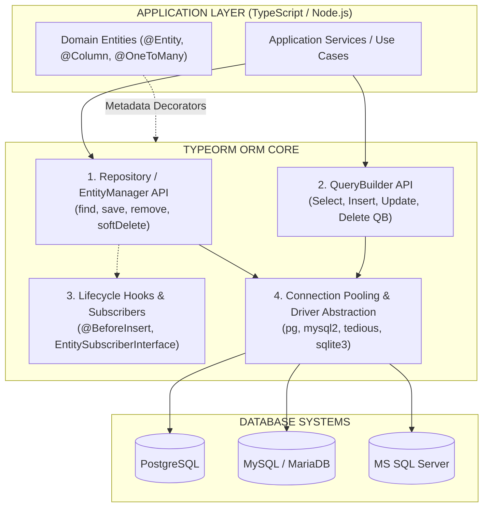

---

### 2. Hai Mô hình: Active Record vs Data Mapper trong TypeORM

TypeORM là một trong số ít ORM hỗ trợ song song cả hai pattern. Tuy nhiên, việc nắm rõ bản chất kiến trúc của từng mô hình là tối quan trọng để đưa ra lựa chọn đúng đắn cho dự án:

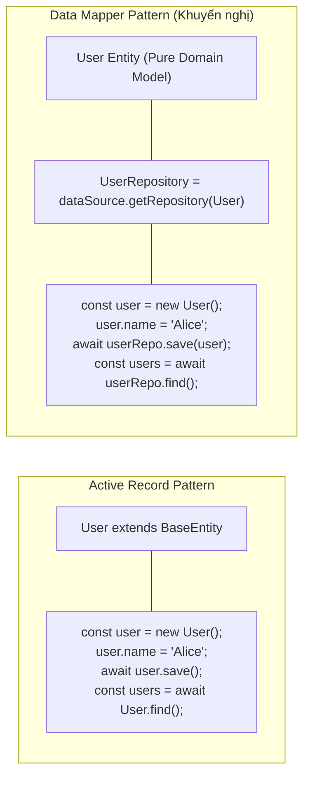

| Tiêu chí | Active Record Pattern (`BaseEntity`) | Data Mapper Pattern (`Repository<T>`) |
| :--- | :--- | :--- |
| **Định nghĩa** | Entity kế thừa từ `BaseEntity`, mang cả Data và DB Methods. | Entity chỉ chứa Data Model/Logic nghiệp vụ; Repository quản lý DB. |
| **Mức độ phụ thuộc** | Gắn chặt (Tightly Coupled) giữa Domain và Database. | Tách rời hoàn toàn (Decoupled), tuân thủ Single Responsibility (SRP). |
| **Khả năng Test** | Khó viết Unit Test (cần Mock static methods trên chính Entity). | Cực kỳ dễ Unit Test (chỉ cần Mock interface `Repository`). |
| **Phù hợp với** | Ứng dụng nhỏ (Small App, PoC, Scripting, CRUD nhanh). | Ứng dụng Enterprise, Domain-Driven Design (DDD), Clean Architecture. |

---

## II. CHI TIẾT KỸ THUẬT (TECHNICAL DEEP DIVE)

### 1. Toàn bộ Decorators Định nghĩa Thực thể & Cột (Entity & Column Decorators)

Metadata Decorators là trái tim của TypeORM, cho phép ánh xạ các thuộc tính của TypeScript Class sang cấu trúc Cột và Bảng trong Cơ sở dữ liệu quan hệ.

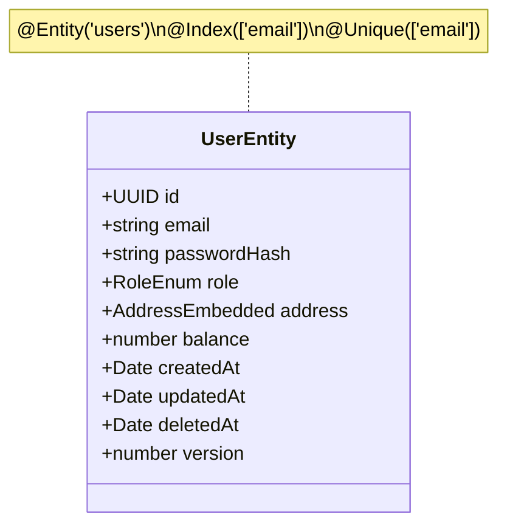

#### a. `@Entity(options?: EntityOptions)`
Khai báo class là một Table trong Database.

* **Cú pháp:** `@Entity(tableName?: string, options?: EntityOptions)`
* **Các options quan trọng:**
  * `name`: Tên bảng tùy chỉnh trong DB (nếu không khai báo, TypeORM lấy tên Class).
  * `schema`: Tên schema (PostgreSQL/SQL Server), ví dụ: `public`, `auth`, `inventory`.
  * `database`: Tên database chứa bảng (nếu kết nối multi-database trên cùng server).
  * `synchronize`: `boolean` (mặc định `true`). Đặt `false` nếu muốn tắt tự động sync schema riêng cho bảng này.
  * `orderBy`: Khai báo thứ tự sắp xếp mặc định khi query bảng, ví dụ: `{ createdAt: "DESC" }`.
  * `withoutRowid`: `boolean` (Dành cho SQLite optimize).

#### b. Các Decorators Khóa chính (Primary Key Decorators)

| Decorator | Cú pháp | Mô tả chi tiết |
| :--- | :--- | :--- |
| `@PrimaryColumn()` | `@PrimaryColumn(type, options)` | Khóa chính thông thường. Lập trình viên **tự gán giá trị** trước khi `save`/`insert` (ví dụ: Custom String ID, ULID tự tạo, Composite Key). |
| `@PrimaryGeneratedColumn('increment')` | `@PrimaryGeneratedColumn()` | Khóa chính tự tăng (PostgreSQL `SERIAL` / MySQL `AUTO_INCREMENT` / Identity). Kiểu dữ liệu TypeScript là `number`. |
| `@PrimaryGeneratedColumn('uuid')` | `@PrimaryGeneratedColumn('uuid')` | Khóa chính UUID v4 tự sinh tự động bởi Database hoặc ORM. Kiểu dữ liệu TypeScript là `string`. |
| `@PrimaryGeneratedColumn('identity')` | `@PrimaryGeneratedColumn('identity', { ... })` | Ánh xạ chuẩn `GENERATED ALWAYS AS IDENTITY` trong PostgreSQL 10+ và Oracle. |
| `@PrimaryGeneratedColumn('rowid')` | `@PrimaryGeneratedColumn('rowid')` | Ánh xạ ROWID (CockroachDB). |

#### c. `@Column(options?: ColumnOptions)` Toàn tập
Cấu hình chi tiết kiểu dữ liệu, ràng buộc và hành vi ánh xạ cho cột dữ liệu:

```typescript
import { Entity, PrimaryGeneratedColumn, Column, ValueTransformer } from 'typeorm';

// 1. Custom ValueTransformer: Chuyển đổi qua lại giữa DB Type và TS Type
export const BigIntTransformer: ValueTransformer = {
  to: (value: bigint | number | null): string | null => {
    if (value === null || value === undefined) return null;
    return value.toString();
  },
  from: (value: string | null): bigint | null => {
    if (value === null || value === undefined) return null;
    return BigInt(value);
  }
};

export const EncryptedJsonTransformer: ValueTransformer = {
  to: (value: any): string => JSON.stringify(value),
  from: (value: string): any => {
    try {
      return JSON.parse(value);
    } catch {
      return value;
    }
  }
};
```

Các thuộc tính trong `ColumnOptions`:
* `type`: Kiểu dữ liệu SQL tường minh (`varchar`, `text`, `int`, `bigint`, `numeric`, `decimal`, `boolean`, `timestamp`, `timestamptz`, `json`, `jsonb`, `enum`, `uuid`, `bytea`, v.v.).
* `name`: Tên cột trong DB nếu muốn khác với tên biến trong TypeScript Class (ví dụ: `name: 'first_name'`).
* `length`: Độ dài chuỗi (ví dụ: `varchar(255)` -> `length: 255`).
* `width`: Độ rộng hiển thị số (cho MySQL `int(11)`).
* `nullable`: `boolean` (Mặc định `false`). Đặt `true` để cho phép `NULL`.
* `unique`: `boolean` (Mặc định `false`). Tự động sinh `UNIQUE CONSTRAINT` trên cột.
* `default`: Giá trị mặc định (Ví dụ: `default: () => "CURRENT_TIMESTAMP"`, `default: 0`, `default: 'ACTIVE'`).
* `select`: `boolean` (Mặc định `true`). Đặt `false` để **loại trừ cột này khỏi mọi câu query mặc định** (Cực kỳ hữu ích cho trường nhạy cảm như `passwordHash`).
* `precision`: Tổng số chữ số có nghĩa cho kiểu `numeric`/`decimal` (Ví dụ: `precision: 18`).
* `scale`: Số chữ số phần thập phân cho kiểu `numeric`/`decimal` (Ví dụ: `scale: 4` -> `numeric(18, 4)`).
* `array`: `boolean` (Chỉ dành cho PostgreSQL). Cho phép tạo kiểu mảng 1 chiều hoặc đa chiều (Ví dụ: `type: 'text', array: true` -> `text[]`).
* `enum`: Khai báo Enum JS/TS hoặc mảng giá trị hợp lệ.
* `enumName`: Tên của Native ENUM Type trong PostgreSQL.
* `comment`: Chú thích tài liệu hóa trực tiếp vào schema database.
* `transformer`: Một instance `ValueTransformer` hoặc mảng `ValueTransformer[]` để xử lý serialize/deserialize giá trị.

#### d. Các Decorators Đặc biệt và Timestamp Tự động

```typescript
import {
  Entity,
  PrimaryGeneratedColumn,
  CreateDateColumn,
  UpdateDateColumn,
  DeleteDateColumn,
  VersionColumn,
  Generated,
  Index,
  Unique,
  Check
} from 'typeorm';

@Entity('accounts')
@Index('idx_accounts_status_created', ['status', 'createdAt']) // Composite Index
@Unique('uq_accounts_org_code', ['organizationId', 'code'])     // Composite Unique Constraint
@Check('chk_positive_balance', `"balance" >= 0`)                // Database Check Constraint
export class Account {
  @PrimaryGeneratedColumn('uuid')
  id!: string;

  @Column()
  @Generated('increment') // Cột số thứ tự tự tăng phụ không phải Primary Key
  accountNumber!: number;

  @Column({ type: 'numeric', precision: 14, scale: 2, default: 0 })
  balance!: number;

  @Column({ type: 'varchar', default: 'ACTIVE' })
  status!: string;

  @Column({ type: 'uuid' })
  organizationId!: string;

  @Column({ type: 'varchar', length: 50 })
  code!: string;

  // Tự động gán thời điểm INSERT bản ghi
  @CreateDateColumn({ type: 'timestamptz', comment: 'Thời gian tạo bản ghi' })
  createdAt!: Date;

  // Tự động cập nhật mỗi khi bản ghi được SAVE / UPDATE thông qua Repository
  @UpdateDateColumn({ type: 'timestamptz', comment: 'Thời gian cập nhật lần cuối' })
  updatedAt!: Date;

  // Kích hoạt tính năng Soft Delete: Cột này sẽ nhận timestamp khi gọi softRemove/softDelete
  @DeleteDateColumn({ type: 'timestamptz', nullable: true, comment: 'Thời điểm xóa mềm' })
  deletedAt!: Date | null;

  // Optimistic Locking (Khóa lạc quan): Tự động tăng 1 mỗi khi Entity được update
  @VersionColumn({ comment: 'Phiên bản concurrency control' })
  version!: number;
}
```

> [!IMPORTANT]
> **Về `@VersionColumn()` (Optimistic Locking):**
> Khi bạn gọi `repository.save(entity)`, TypeORM sẽ sinh câu lệnh SQL có mệnh đề `WHERE id = :id AND version = :currentVersion`. Nếu một tiến trình khác đã cập nhật bản ghi trong lúc đó (làm version tăng lên), câu lệnh UPDATE sẽ không ảnh hưởng dòng nào và TypeORM ngay lập tức ném ra lỗi `OptimisticLockVersionMismatchError`, giúp ngăn chặn hoàn toàn lỗi **Lost Update** khi ghi đè đồng thời.

---

### 2. Thiết kế Quan hệ Thực thể Chuyên sâu (Entity Relations Deep Dive)

TypeORM quản lý các quan hệ quan hệ thông qua 4 decorators chính: `@OneToOne`, `@ManyToOne`, `@OneToMany`, `@ManyToMany`, kết hợp với quy tắc **Owning Side** và **Inverse Side**.

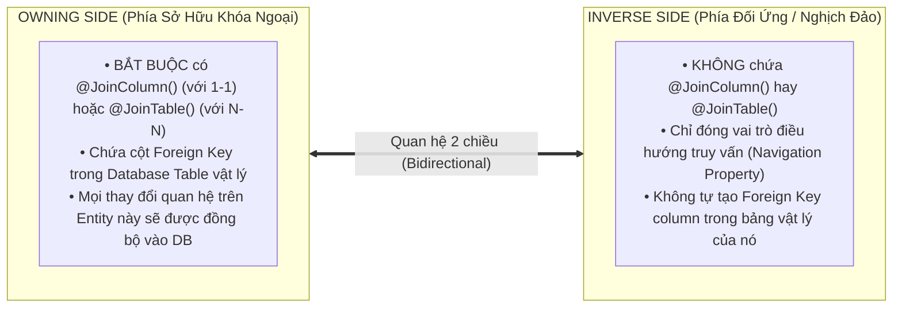

#### a. Quy tắc Vàng: Owning Side vs Inverse Side
1. **Quan hệ `@OneToOne`**: Bạn **bắt buộc phải đặt `@JoinColumn()` trên một và chỉ một bên** (Bên nào chứa `@JoinColumn()` sẽ là Owning Side và bảng của nó sẽ chứa cột Foreign Key `xxxId`).
2. **Quan hệ `@ManyToOne` / `@OneToMany`**: Bên `@ManyToOne` **luôn luôn là Owning Side** theo thiết kế chuẩn CSDL quan hệ (Bảng "Nhiều" luôn chứa Foreign Key trỏ tới bảng "Một"). Vì vậy `@ManyToOne` tự động quản lý Foreign Key mà không bắt buộc phải viết `@JoinColumn()`, trừ khi bạn muốn đổi tên cột Foreign Key trong DB.
3. **Quan hệ `@ManyToMany`**: Bạn **bắt buộc phải đặt `@JoinTable()` trên một bên** để TypeORM tự động tạo bảng trung gian (Junction / Pivot Table).

#### b. Chi tiết Cú pháp Cấu hình Quan hệ

```typescript
import {
  Entity,
  PrimaryGeneratedColumn,
  Column,
  OneToOne,
  ManyToOne,
  OneToMany,
  ManyToMany,
  JoinColumn,
  JoinTable
} from 'typeorm';

// -------------------------------------------------------------
// 1. One-to-One: User <-> UserProfile
// -------------------------------------------------------------
@Entity('users')
export class User {
  @PrimaryGeneratedColumn('uuid')
  id!: string;

  @Column({ unique: true })
  email!: string;

  // OWNING SIDE của 1-1: Chứa @JoinColumn() -> Cột profileId sẽ nằm trong bảng `users`
  @OneToOne(() => UserProfile, (profile) => profile.user, {
    cascade: ['insert', 'update'], // Tự động lưu/sửa Profile khi lưu User
    onDelete: 'CASCADE',           // Xóa User thì DB tự xóa Profile liên quan
    eager: false,                  // Không tự động join mỗi lần query User
    nullable: true
  })
  @JoinColumn({
    name: 'profile_id',                      // Tên cột FK vật lý trong DB
    referencedColumnName: 'id',              // Cột trỏ tới bên bảng UserProfile
    foreignKeyConstraintName: 'fk_users_profile'
  })
  profile!: UserProfile | null;

  @OneToMany(() => Order, (order) => order.user)
  orders!: Order[];

  @ManyToMany(() => Role, (role) => role.users)
  @JoinTable({
    name: 'users_roles', // Tên bảng trung gian
    joinColumn: { name: 'user_id', referencedColumnName: 'id' },
    inverseJoinColumn: { name: 'role_id', referencedColumnName: 'id' }
  })
  roles!: Role[];
}

@Entity('user_profiles')
export class UserProfile {
  @PrimaryGeneratedColumn('uuid')
  id!: string;

  @Column()
  phoneNumber!: string;

  @Column({ nullable: true })
  avatarUrl!: string;

  // INVERSE SIDE của 1-1: Không có @JoinColumn()
  @OneToOne(() => User, (user) => user.profile)
  user!: User;
}

// -------------------------------------------------------------
// 2. Many-to-One & One-to-Many: User (1) <-> Order (N)
// -------------------------------------------------------------
@Entity('orders')
export class Order {
  @PrimaryGeneratedColumn('uuid')
  id!: string;

  @Column({ type: 'numeric', precision: 12, scale: 2 })
  totalAmount!: number;

  @Column({ type: 'uuid' })
  userId!: string; // Khai báo rõ ràng FK property để truy xuất nhanh không cần join

  // OWNING SIDE của N-1: Bảng `orders` chứa cột `user_id`
  @ManyToOne(() => User, (user) => user.orders, {
    onDelete: 'RESTRICT', // Ngăn xóa User nếu vẫn còn Order
    nullable: false
  })
  @JoinColumn({ name: 'user_id' })
  user!: User;

  @OneToMany(() => OrderItem, (item) => item.order, {
    cascade: true // Tự động insert/update toàn bộ OrderItems khi save Order
  })
  items!: OrderItem[];
}

@Entity('order_items')
export class OrderItem {
  @PrimaryGeneratedColumn('uuid')
  id!: string;

  @Column()
  productName!: string;

  @Column({ type: 'int' })
  quantity!: number;

  @Column({ type: 'numeric', precision: 10, scale: 2 })
  unitPrice!: number;

  @ManyToOne(() => Order, (order) => order.items, { onDelete: 'CASCADE' })
  @JoinColumn({ name: 'order_id' })
  order!: Order;
}

// -------------------------------------------------------------
// 3. Many-to-Many: User (N) <-> Role (N)
// -------------------------------------------------------------
@Entity('roles')
export class Role {
  @PrimaryGeneratedColumn('uuid')
  id!: string;

  @Column({ unique: true })
  code!: string; // e.g., 'ADMIN', 'CUSTOMER'

  // INVERSE SIDE của N-N: Không có @JoinTable()
  @ManyToMany(() => User, (user) => user.roles)
  users!: User[];
}
```

#### c. Các Tùy chọn Quan hệ (Relation Options) Cốt lõi

| Tùy chọn | Kiểu dữ liệu | Ý nghĩa kỹ thuật |
| :--- | :--- | :--- |
| `cascade` | `boolean \| ("insert" \| "update" \| "remove" \| "soft-remove" \| "recover")[]` | Khi thực hiện thao tác lưu trên Entity cha, TypeORM sẽ tự động lan truyền (cascade) thao tác đó xuống các Entity con liên kết. |
| `eager` | `boolean` (Mặc định `false`) | Nếu `true`, bất cứ khi nào bạn dùng `find()` hay `findOne()` trên Entity này, TypeORM sẽ **luôn luôn tự động LEFT JOIN** quan hệ này. |
| `lazy` | `boolean` (Mặc định `false`) | Nếu `true`, thuộc tính quan hệ phải được khai báo dạng `Promise<T>`. Quan hệ chỉ được query từ DB khi bạn `await entity.relationProperty`. |
| `onDelete` | `'CASCADE' \| 'SET NULL' \| 'RESTRICT' \| 'NO ACTION' \| 'SET DEFAULT'` | Tạo ràng buộc `ON DELETE` trực tiếp mức Foreign Key trong bảng cơ sở dữ liệu. |
| `onUpdate` | `'CASCADE' \| 'SET NULL' \| 'RESTRICT' \| 'NO ACTION' \| 'SET DEFAULT'` | Tạo ràng buộc `ON UPDATE` trực tiếp mức Foreign Key trong bảng cơ sở dữ liệu. |
| `nullable` | `boolean` | Xác định Foreign Key column có được phép `NULL` hay không. |

> [!WARNING]
> **Cạm bẫy `eager: true` và `lazy: true`:**
> 1. **Tuyệt đối tránh lạm dụng `eager: true`**: Nó áp dụng cho TOÀN BỘ các câu `find()` trên toàn ứng dụng. Nếu bạn cấu hình eager trên nhiều quan hệ lồng nhau, một câu query đơn giản có thể biến thành một câu SQL JOIN khổng lồ làm sập hiệu năng hệ thống. Hãy chủ động dùng `relations: [...]` hoặc `QueryBuilder` khi cần.
> 2. **Cẩn trọng với `lazy: true`**: Do trả về `Promise`, nó dễ gây ra lỗi **N+1 Query ngầm** khi lặp qua danh sách Entity và `await` quan hệ của từng phần tử.

---

### 3. Cẩm nang Repository API Toàn diện (Repository API Reference)

Repository là interface trung tâm của Data Mapper Pattern trong TypeORM, cung cấp đầy đủ các hàm thao tác CRUD.

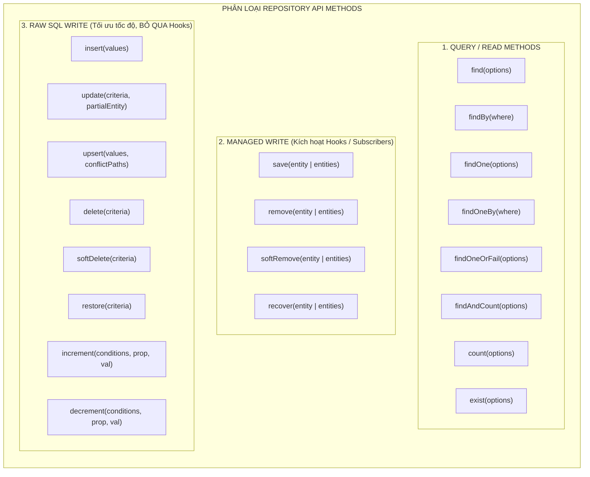

#### Bảng Tra cứu Cú pháp và Hành vi Chi tiết:

```typescript
import { Repository, DataSource, In, MoreThan } from 'typeorm';
import { User } from './entities/User';

declare const userRepository: Repository<User>;
```

| Phương thức | Cú pháp ví dụ | Mô tả & Hành vi chuyên sâu |
| :--- | :--- | :--- |
| **`find()`** | `await repo.find({ where: { status: 'ACTIVE' }, relations: ['profile'] })` | Tìm kiếm tất cả bản ghi thỏa mãn `FindManyOptions`. Trả về mảng Entity `T[]`. |
| **`findBy()`** | `await repo.findBy({ status: 'ACTIVE', role: 'ADMIN' })` | Cú pháp rút gọn, chỉ truyền trực tiếp điều kiện `FindOptionsWhere<T>`. |
| **`findOne()`** | `await repo.findOne({ where: { id: userId }, relations: { profile: true } })` | Tìm bản ghi đầu tiên khớp điều kiện. Trả về `T \| null`. |
| **`findOneBy()`** | `await repo.findOneBy({ email: 'user@example.com' })` | Cú pháp rút gọn tìm 1 bản ghi theo object `where`. Trả về `T \| null`. |
| **`findOneOrFail()`** | `await repo.findOneOrFail({ where: { id: userId } })` | Tìm 1 bản ghi; nếu không thấy, **tự động ném lỗi `EntityNotFoundError`**. |
| **`findAndCount()`** | `const [items, total] = await repo.findAndCount({ skip: 0, take: 10 })` | Trả về Tuple `[T[], number]` gồm danh sách bản ghi theo trang và tổng số lượng toàn bảng. |
| **`save()`** | `await repo.save(userInstance)` hoặc `await repo.save([u1, u2])` | **Insert hoặc Update thông minh**: Nếu entity chưa có PK -> INSERT; Nếu đã có PK trong DB -> UPDATE. Kích hoạt toàn bộ Listeners/Subscribers và Cascades. |
| **`insert()`** | `await repo.insert({ email: 'a@b.com', passwordHash: 'hash' })` | Bắn trực tiếp câu lệnh SQL `INSERT INTO`. **Không load entity, không chạy Hooks, cực nhanh**. |
| **`update()`** | `await repo.update({ status: 'PENDING' }, { status: 'ACTIVE' })` | Bắn trực tiếp câu lệnh SQL `UPDATE ... WHERE`. **Không kích hoạt Entity Listeners**. |
| **`upsert()`** | `await repo.upsert({ id: '123', email: 'a@b.com' }, ['id'])` | Thực hiện `INSERT ... ON CONFLICT DO UPDATE` (PostgreSQL) hoặc `ON DUPLICATE KEY UPDATE` (MySQL). |
| **`delete()`** | `await repo.delete({ status: 'INACTIVE' })` hoặc `await repo.delete(id)` | Xóa cứng trực tiếp bằng SQL `DELETE FROM ... WHERE`. Không load bản ghi vào bộ nhớ. |
| **`remove()`** | `await repo.remove(userInstance)` | Xóa cứng các instance truyền vào. **Có kích hoạt `@BeforeRemove`, `@AfterRemove`**. |
| **`softDelete()`** | `await repo.softDelete(id)` hoặc `await repo.softDelete({ role: 'GUEST' })` | Cập nhật cột `@DeleteDateColumn` thành thời gian hiện tại qua câu SQL UPDATE. Không chạy Hooks. |
| **`softRemove()`** | `await repo.softRemove(userInstance)` | Xóa mềm các instance được truyền vào, có chạy `@BeforeSoftRemove`, `@AfterSoftRemove`. |
| **`restore()`** | `await repo.restore(id)` | Khôi phục bản ghi bị xóa mềm (set `@DeleteDateColumn = NULL`) qua raw SQL. |
| **`increment()`** | `await repo.increment({ id: accountId }, 'balance', 500)` | Tăng giá trị số nguyên tử: `UPDATE ... SET balance = balance + 500 WHERE id = :id`. Tránh Race Condition! |
| **`decrement()`** | `await repo.decrement({ id: accountId }, 'balance', 200)` | Giảm giá trị số nguyên tử: `UPDATE ... SET balance = balance - 200 WHERE id = :id`. |
| **`count()`** | `await repo.count({ where: { status: 'ACTIVE' } })` | Đếm số lượng bản ghi thỏa mãn điều kiện (`SELECT COUNT(1)`). |
| **`exist()`** | `await repo.exist({ where: { email: 'test@domain.com' } })` | Kiểm tra sự tồn tại (`SELECT 1 ... LIMIT 1`), trả về `boolean`. |
| **`create()`** | `const user = repo.create({ email: 'a@b.com' })` | Tạo instance Entity trong RAM (chưa lưu vào DB). Rất hữu ích để gán default values. |
| **`merge()`** | `repo.merge(user, { email: 'new@b.com' })` | Gộp dữ liệu từ object mới vào instance Entity hiện tại. |
| **`preload()`** | `const user = await repo.preload({ id, email: 'new@b.com' })` | Tìm entity theo ID trong DB, nếu thấy thì gộp object mới vào rồi trả về instance. |
| **`query()`** | `await repo.query('SELECT * FROM users WHERE status = $1', ['ACTIVE'])` | Chạy câu lệnh Raw SQL tùy ý trực tiếp xuống database driver. |

---

### 4. Bộ lọc Nâng cao (Advanced Find Options & Query Operators)

TypeORM cung cấp cấu trúc `FindOptionsWhere` kết hợp với các **Utility Operators** để xây dựng các câu truy vấn phức tạp một cách type-safe.

#### a. Danh mục Operators Tích hợp

```typescript
import {
  Equal,
  Not,
  LessThan,
  LessThanOrEqual,
  MoreThan,
  MoreThanOrEqual,
  Between,
  Like,
  ILike,
  In,
  Any,
  IsNull,
  ArrayContains,
  ArrayContainedBy,
  ArrayOverlap,
  Raw
} from 'typeorm';
```

| Operator | SQL Tương đương | Ví dụ TypeORM |
| :--- | :--- | :--- |
| `Not(value)` | `<> value` hoặc `NOT (...)` | `where: { status: Not('DELETED') }` |
| `LessThan(val)` | `< val` | `where: { age: LessThan(18) }` |
| `LessThanOrEqual(val)` | `<= val` | `where: { score: LessThanOrEqual(5.0) }` |
| `MoreThan(val)` | `> val` | `where: { balance: MoreThan(0) }` |
| `MoreThanOrEqual(val)` | `>= val` | `where: { stock: MoreThanOrEqual(10) }` |
| `Between(from, to)` | `BETWEEN from AND to` | `where: { createdAt: Between(startDate, endDate) }` |
| `Like('%abc%')` | `LIKE '%abc%'` (Phân biệt hoa thường) | `where: { name: Like('%MacBook%') }` |
| `ILike('%abc%')` | `ILIKE '%abc%'` (Không phân biệt hoa thường - Postgres) | `where: { email: ILike('%@GMAIL.COM') }` |
| `In([...])` | `IN (v1, v2, ...)` | `where: { role: In(['ADMIN', 'MANAGER']) }` |
| `IsNull()` | `IS NULL` | `where: { verifiedAt: IsNull() }` |
| `Not(IsNull())` | `IS NOT NULL` | `where: { deletedAt: Not(IsNull()) }` |
| `ArrayContains([...])` | `@> ARRAY[...]` (PostgreSQL) | `where: { tags: ArrayContains(['typescript', 'backend']) }` |
| `ArrayOverlap([...])` | `&& ARRAY[...]` (PostgreSQL) | `where: { permissions: ArrayOverlap(['READ_USER', 'WRITE_USER']) }` |
| `Raw(sqlFn)` | Custom SQL Expression có Parameter Binding | `where: { createdAt: Raw((alias) => `${alias} >= NOW() - INTERVAL '7 DAYS'`) }` |

#### b. Tổ hợp Logic AND vs OR trong `FindOptionsWhere`

```typescript
// 1. Phép toán AND: Khai báo các thuộc tính bên trong cùng 1 Object
const activeAdmins = await userRepository.find({
  where: {
    status: 'ACTIVE',
    role: 'ADMIN',
    balance: MoreThan(1000)
  }
});
// SQL: WHERE status = 'ACTIVE' AND role = 'ADMIN' AND balance > 1000

// 2. Phép toán OR: Truyền vào một MẢNG các Object điều kiện
const activeOrVipUsers = await userRepository.find({
  where: [
    { status: 'ACTIVE', role: 'ADMIN' },    // Mệnh đề 1
    { balance: MoreThanOrEqual(100000) }   // HOẶC Mệnh đề 2
  ]
});
// SQL: WHERE (status = 'ACTIVE' AND role = 'ADMIN') OR (balance >= 100000)
```

#### c. Cấu hình Toàn diện `FindManyOptions`

```typescript
const result = await userRepository.find({
  // 1. Chỉ lấy những trường cần thiết (Sparse Fieldsets)
  select: {
    id: true,
    email: true,
    createdAt: true,
    profile: {
      avatarUrl: true,
      phoneNumber: true
    }
  },

  // 2. Điều kiện lọc
  where: {
    status: 'ACTIVE',
    createdAt: MoreThan(new Date('2026-01-01'))
  },

  // 3. Nạp quan hệ (Eager Loading chủ động)
  relations: {
    profile: true,
    orders: {
      items: true // Nạp quan hệ lồng nhau 2 cấp (Nested Relations)
    }
  },

  // 4. Sắp xếp đa cột và hỗ trợ NULLS FIRST/LAST
  order: {
    createdAt: 'DESC',
    email: 'ASC'
  },

  // 5. Phân trang (Skip & Take)
  skip: 20, // Bỏ qua 20 bản ghi đầu (Page 3 với PageSize 10)
  take: 10, // Lấy tối đa 10 bản ghi

  // 6. Truy vấn cả các bản ghi đã bị Soft-Delete
  withDeleted: false,

  // 7. Caching tầng kết quả Query (ms hoặc custom ID)
  cache: {
    id: 'active_users_cache',
    milliseconds: 30000 // Cache trong 30 giây
  },

  // 8. Database Locking (Pessimistic Locking)
  lock: {
    mode: 'pessimistic_write' // Khóa SELECT ... FOR UPDATE
  }
});
```

---

### 5. Bậc thầy QueryBuilder API (QueryBuilder API Mastery)

Khi các câu truy vấn vượt quá khả năng của `find()`, đòi hỏi các phép toán JOIN phức tạp, Subqueries, Aggregate Functions (`SUM`, `AVG`, `COUNT`), Group By, Having, hoặc Bulk Operations, **QueryBuilder** là công cụ tối thượng.

```mermaid
flowchart LR
    QB["createQueryBuilder('user')"]
    
    subgraph Selection["Projections"]
        select["select() / addSelect()"]
    end
    
    subgraph Joins["Joins"]
        join1["leftJoinAndSelect()<br/>(Hydrates Entities)"]
        join2["leftJoin()<br/>(Raw Join SQL)"]
    end

    subgraph Filters["Filtering & Parameters"]
        where["where() / andWhere() / orWhere()"]
        brackets["new Brackets(...)"]
        params["setParameters({ ... })"]
    end

    subgraph Execution["Execution & Output"]
        getMany["getMany() -> Entity[]"]
        getOne["getOne() -> Entity"]
        getRawMany["getRawMany() -> Flat Objects"]
        getRawAndEntities["getRawAndEntities()"]
    end

    QB --> Selection --> Joins --> Filters --> Execution
```

#### a. Danh mục Phương thức Toàn diện của `SelectQueryBuilder`

| Nhóm Phương thức | Phương thức API | Chức năng kỹ thuật |
| :--- | :--- | :--- |
| **Projections** | `.select('user.id', 'userId')`<br/>`.addSelect('user.email')`<br/>`.addSelect('COUNT(order.id)', 'orderCount')`<br/>`.distinct(true)` | Chỉ định danh sách cột, biểu thức tính toán cần SELECT. `.addSelect` giúp bổ sung cột mà không ghi đè danh sách đã chọn trước đó. |
| **Entity Joins (Hydration)** | `.innerJoinAndSelect('user.orders', 'order')`<br/>`.leftJoinAndSelect('user.profile', 'profile')` | Thực hiện JOIN đồng thời **tự động bóc tách (Hydrate)** kết quả trả về thành cây Object phân cấp TypeScript (`user.orders = [...]`). |
| **Raw SQL Joins** | `.leftJoin('orders', 'o', 'o.user_id = user.id')`<br/>`.innerJoin('user.roles', 'role', 'role.status = :s', { s: 'A' })` | Thực hiện JOIN SQL thuần mà không tự động hydrate vào quan hệ của Entity. Rất tối ưu khi chỉ cần join để filter hoặc aggregate. |
| **Map Custom Joins** | `.leftJoinAndMapOne('user.latestOrder', ...)`<br/>`.leftJoinAndMapMany('user.topProducts', ...)` | Map kết quả join vào một thuộc tính tùy biến trên Entity không nhất thiết phải có decorator quan hệ. |
| **Where Filters** | `.where('user.status = :status', { status: 'ACTIVE' })`<br/>`.andWhere('user.age >= :minAge', { minAge: 18 })`<br/>`.orWhere('user.isVip = :vip', { vip: true })`<br/>`.andWhere(new Brackets(qb => ...))` | Xây dựng mệnh đề `WHERE`. `where()` sẽ reset toàn bộ điều kiện trước; `andWhere()` và `orWhere()` nối tiếp điều kiện. |
| **Grouping & Having** | `.groupBy('user.id')`<br/>`.addGroupBy('user.status')`<br/>`.having('COUNT(order.id) > :minOrders', { minOrders: 5 })`<br/>`.andHaving(...)` | Gom nhóm dữ liệu và lọc điều kiện trên kết quả tính toán aggregate. |
| **Sorting & Pagination** | `.orderBy('user.createdAt', 'DESC')`<br/>`.addOrderBy('user.id', 'ASC')`<br/>`.take(10).skip(20)`<br/>`.limit(10).offset(20)` | Sắp xếp và phân trang. **Lưu ý: Dùng `take`/`skip` cho Entity queries có One-to-Many JOIN, dùng `limit`/`offset` cho Raw queries**. |
| **Parameters Binding** | `.setParameter('name', value)`<br/>`.setParameters({ key1: val1, key2: val2 })` | Truyền tham số an toàn ngăn chặn 100% nguy cơ SQL Injection. |
| **Execution** | `.getOne()` / `.getOneOrFail()`<br/>`.getMany()` / `.getManyAndCount()`<br/>`.getRawOne<T>()` / `.getRawMany<T>()`<br/>`.getRawAndEntities()`<br/>`.getCount()` / `.getExists()`<br/>`.stream()` | Các phương thức thực thi câu query và chỉ định kiểu dữ liệu trả về mong muốn. |

#### b. Kỹ thuật Lồng ghép Logic phức tạp với `Brackets` & `NotBrackets`

Khi cần tạo câu truy vấn có dạng: `WHERE status = 'ACTIVE' AND (role = 'ADMIN' OR email LIKE '%@vip.com')`, nếu bạn gọi trực tiếp `.andWhere().orWhere()` sẽ tạo ra logic sai lệch. TypeORM cung cấp lớp `Brackets`:

```typescript
import { Brackets, NotBrackets } from 'typeorm';

const users = await userRepository.createQueryBuilder('user')
  .where('user.status = :status', { status: 'ACTIVE' })
  .andWhere(
    new Brackets((qb) => {
      qb.where('user.role = :adminRole', { adminRole: 'ADMIN' })
        .orWhere('user.email LIKE :domain', { domain: '%@enterprise.com' });
    })
  )
  .andWhere(
    new NotBrackets((qb) => {
      qb.where('user.isBlacklisted = :b', { b: true });
    })
  )
  .getMany();

// Sinh ra SQL:
// WHERE user.status = 'ACTIVE' 
//   AND (user.role = 'ADMIN' OR user.email LIKE '%@enterprise.com')
//   AND NOT (user.isBlacklisted = true)
```

---

### 6. Lifecycle Hooks & Event Subscribers (Lắng nghe & Can thiệp Vòng đời Thực thể)

TypeORM cung cấp cơ chế Event-driven mạnh mẽ cho phép can thiệp trước hoặc sau các sự kiện biến đổi trạng thái của Entity.

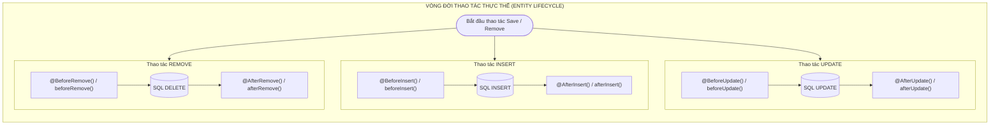

#### a. Method Listeners (Trực tiếp bên trong Entity Class)
Các Decorators phương thức lắng nghe trực tiếp trên instance:

* `@BeforeInsert()`: Chạy ngay trước khi entity được insert qua `repository.save()`. Thường dùng để hash password, normalize text, tạo slug.
* `@AfterInsert()`: Chạy ngay sau khi insert thành công vào DB.
* `@BeforeUpdate()`: Chạy ngay trước khi entity được update qua `repository.save()`.
* `@AfterUpdate()`: Chạy ngay sau khi update thành công vào DB.
* `@BeforeRemove()` / `@AfterRemove()`: Can thiệp trước/sau khi gọi `repository.remove()`.
* `@BeforeSoftRemove()` / `@AfterSoftRemove()`: Can thiệp trước/sau khi gọi `repository.softRemove()`.
* `@BeforeRecover()` / `@AfterRecover()`: Can thiệp trước/sau khi khôi phục entity.
* `@AfterLoad()`: Tự động chạy mỗi khi entity được load từ DB lên RAM qua bất kỳ câu lệnh query nào (Thích hợp tính toán các trường ảo - Virtual Computed Fields).

```typescript
import {
  Entity,
  PrimaryGeneratedColumn,
  Column,
  BeforeInsert,
  BeforeUpdate,
  AfterLoad
} from 'typeorm';
import * as bcrypt from 'bcrypt';

@Entity('users')
export class User {
  @PrimaryGeneratedColumn('uuid')
  id!: string;

  @Column()
  firstName!: string;

  @Column()
  lastName!: string;

  @Column({ select: false })
  password!: string;

  // Thuộc tính ảo (Virtual field) không lưu trong DB
  fullName!: string;

  @AfterLoad()
  computeFullName() {
    this.fullName = `${this.firstName} ${this.lastName}`.trim();
  }

  @BeforeInsert()
  @BeforeUpdate()
  async hashPassword() {
    // Chỉ hash nếu password có giá trị và chưa được hash bằng bcrypt ($2b$)
    if (this.password && !this.password.startsWith('$2b$')) {
      this.password = await bcrypt.hash(this.password, 10);
    }
  }
}
```

#### b. Event Subscribers Toàn cục (`EntitySubscriberInterface`)
Tách rời logic nghiệp vụ ghi vết (Audit Log, Metrics, CDC) ra khỏi Entity bằng Subscriber:

```typescript
import {
  EventSubscriber,
  EntitySubscriberInterface,
  InsertEvent,
  UpdateEvent,
  RemoveEvent,
  TransactionStartEvent,
  TransactionCommitEvent,
  TransactionRollbackEvent
} from 'typeorm';
import { User } from './entities/User';

@EventSubscriber()
export class UserAuditSubscriber implements EntitySubscriberInterface<User> {
  // Chỉ định Subscriber này chỉ lắng nghe riêng Entity User
  listenTo() {
    return User;
  }

  beforeInsert(event: InsertEvent<User>) {
    console.log(`[SUBSCRIBER] Chuẩn bị INSERT user:`, event.entity.firstName);
  }

  afterInsert(event: InsertEvent<User>) {
    console.log(`[SUBSCRIBER] Đã INSERT thành công user với ID: ${event.entity.id}`);
  }

  beforeUpdate(event: UpdateEvent<User>) {
    console.log(`[SUBSCRIBER] Chuẩn bị UPDATE user ID: ${event.databaseEntity?.id}`);
    
    // Kiểm tra danh sách các cột thực sự bị thay đổi
    const changedColumns = event.updatedColumns.map((col) => col.propertyName);
    console.log(`[SUBSCRIBER] Các cột bị thay đổi:`, changedColumns);

    // Truy xuất giá trị cũ từ DB vs giá trị mới từ Entity
    if (event.entity && event.databaseEntity) {
      console.log(`Email cũ: ${event.databaseEntity.email} -> Email mới: ${event.entity.email}`);
    }
  }

  afterTransactionStart(event: TransactionStartEvent) {
    console.log(`[TRANSACTION] Một giao dịch DB mới vừa bắt đầu.`);
  }

  afterTransactionCommit(event: TransactionCommitEvent) {
    console.log(`[TRANSACTION] Giao dịch đã COMMIT thành công.`);
  }

  afterTransactionRollback(event: TransactionRollbackEvent) {
    console.warn(`[TRANSACTION] Giao dịch đã bị ROLLBACK do có lỗi xảy ra!`);
  }
}
```

---

## III. VÍ DỤ MINH HỌA VÀ PHÂN TÍCH CODE (CODE EXAMPLES & ANALYSIS)

### 1. Hệ thống Thực thể Thương mại Điện tử Thực tế (Production E-Commerce Domain Model)

Dưới đây là thiết kế hoàn chỉnh hệ thống Entity thực tế, áp dụng trọn vẹn các Decorators, Custom Transformer, Value Objects, Audit Fields và Soft Delete.

```typescript
// src/entities/BaseCustomEntity.ts
import {
  PrimaryGeneratedColumn,
  CreateDateColumn,
  UpdateDateColumn,
  DeleteDateColumn,
  VersionColumn
} from 'typeorm';

export abstract class BaseCustomEntity {
  @PrimaryGeneratedColumn('uuid')
  id!: string;

  @CreateDateColumn({ type: 'timestamptz', name: 'created_at' })
  createdAt!: Date;

  @UpdateDateColumn({ type: 'timestamptz', name: 'updated_at' })
  updatedAt!: Date;

  @DeleteDateColumn({ type: 'timestamptz', name: 'deleted_at', nullable: true })
  deletedAt!: Date | null;

  @VersionColumn({ name: 'version', default: 1 })
  version!: number;
}
```

```typescript
// src/entities/Product.ts
import {
  Entity,
  Column,
  Index,
  OneToMany,
  ValueTransformer
} from 'typeorm';
import { BaseCustomEntity } from './BaseCustomEntity';
import { OrderItem } from './OrderItem';

// Transformer xử lý kiểu Decimal/Numeric của PostgreSQL (vốn trả về string) thành Number
export const NumericColumnTransformer: ValueTransformer = {
  to: (data: number | null): number | null => data,
  from: (data: string | null): number | null => (data !== null ? parseFloat(data) : null)
};

export enum ProductStatus {
  DRAFT = 'DRAFT',
  PUBLISHED = 'PUBLISHED',
  OUT_OF_STOCK = 'OUT_OF_STOCK',
  ARCHIVED = 'ARCHIVED'
}

@Entity('products')
@Index('idx_products_status_price', ['status', 'price'])
export class Product extends BaseCustomEntity {
  @Column({ type: 'varchar', length: 255 })
  @Index({ fulltext: true }) // Hỗ trợ Fulltext search trên MySQL hoặc GIN index trên PG
  title!: string;

  @Column({ type: 'varchar', length: 255, unique: true })
  slug!: string;

  @Column({ type: 'text', nullable: true })
  description!: string;

  @Column({
    type: 'numeric',
    precision: 12,
    scale: 2,
    transformer: NumericColumnTransformer
  })
  price!: number;

  @Column({ type: 'int', default: 0 })
  stockQuantity!: number;

  @Column({
    type: 'enum',
    enum: ProductStatus,
    default: ProductStatus.DRAFT,
    enumName: 'product_status_enum'
  })
  status!: ProductStatus;

  @Column({ type: 'jsonb', default: {} })
  attributes!: Record<string, any>; // Lưu cấu hình linh hoạt: { color: 'red', size: 'XL' }

  @Column({ type: 'text', array: true, default: '{}' })
  tags!: string[];

  @OneToMany(() => OrderItem, (item) => item.product)
  orderItems!: OrderItem[];
}
```

```typescript
// src/entities/Order.ts
import {
  Entity,
  Column,
  ManyToOne,
  OneToMany,
  JoinColumn,
  Index
} from 'typeorm';
import { BaseCustomEntity } from './BaseCustomEntity';
import { User } from './User';
import { OrderItem } from './OrderItem';
import { NumericColumnTransformer } from './Product';

export enum OrderStatus {
  PENDING = 'PENDING',
  PROCESSING = 'PROCESSING',
  PAID = 'PAID',
  SHIPPED = 'SHIPPED',
  CANCELLED = 'CANCELLED'
}

@Entity('orders')
@Index('idx_orders_customer_status', ['userId', 'status'])
export class Order extends BaseCustomEntity {
  @Column({ type: 'varchar', length: 64, unique: true, name: 'order_number' })
  orderNumber!: string;

  @Column({ type: 'uuid', name: 'user_id' })
  userId!: string;

  @ManyToOne(() => User, (user) => user.orders, { onDelete: 'RESTRICT' })
  @JoinColumn({ name: 'user_id' })
  user!: User;

  @Column({
    type: 'enum',
    enum: OrderStatus,
    default: OrderStatus.PENDING,
    enumName: 'order_status_enum'
  })
  status!: OrderStatus;

  @Column({
    type: 'numeric',
    precision: 14,
    scale: 2,
    default: 0,
    transformer: NumericColumnTransformer
  })
  subtotal!: number;

  @Column({
    type: 'numeric',
    precision: 14,
    scale: 2,
    default: 0,
    transformer: NumericColumnTransformer
  })
  discountAmount!: number;

  @Column({
    type: 'numeric',
    precision: 14,
    scale: 2,
    default: 0,
    transformer: NumericColumnTransformer
  })
  totalAmount!: number;

  @OneToMany(() => OrderItem, (item) => item.order, {
    cascade: ['insert', 'update']
  })
  items!: OrderItem[];
}
```

```typescript
// src/entities/OrderItem.ts
import { Entity, Column, ManyToOne, JoinColumn } from 'typeorm';
import { BaseCustomEntity } from './BaseCustomEntity';
import { Order } from './Order';
import { Product, NumericColumnTransformer } from './Product';

@Entity('order_items')
export class OrderItem extends BaseCustomEntity {
  @Column({ type: 'uuid', name: 'order_id' })
  orderId!: string;

  @ManyToOne(() => Order, (order) => order.items, { onDelete: 'CASCADE' })
  @JoinColumn({ name: 'order_id' })
  order!: Order;

  @Column({ type: 'uuid', name: 'product_id' })
  productId!: string;

  @ManyToOne(() => Product, (product) => product.orderItems, { onDelete: 'RESTRICT' })
  @JoinColumn({ name: 'product_id' })
  product!: Product;

  @Column({ type: 'int' })
  quantity!: number;

  @Column({
    type: 'numeric',
    precision: 12,
    scale: 2,
    transformer: NumericColumnTransformer
  })
  unitPrice!: number;

  @Column({
    type: 'numeric',
    precision: 12,
    scale: 2,
    transformer: NumericColumnTransformer
  })
  totalPrice!: number;
}
```

---

### 2. Dynamic Search & Aggregation Service với QueryBuilder

Dưới đây là một Service hoàn chỉnh trong ứng dụng thực tế xử lý tìm kiếm đa tiêu chí, lọc theo khoảng giá, phân trang an toàn và tính toán Aggregate:

```typescript
import { Injectable } from '@nestjs/common';
import { DataSource, Repository, Brackets } from 'typeorm';
import { Product, ProductStatus } from '../entities/Product';

export interface ProductFilterDto {
  searchTerm?: string;
  minPrice?: number;
  maxPrice?: number;
  status?: ProductStatus;
  tags?: string[];
  page?: number;
  limit?: number;
  sortBy?: 'price' | 'createdAt' | 'title';
  sortOrder?: 'ASC' | 'DESC';
}

export interface PaginatedResult<T> {
  data: T[];
  meta: {
    total: number;
    page: number;
    limit: number;
    totalPages: number;
  };
  metrics?: {
    avgPrice: number;
    maxPrice: number;
  };
}

@Injectable()
export class ProductSearchService {
  private productRepo: Repository<Product>;

  constructor(private dataSource: DataSource) {
    this.productRepo = this.dataSource.getRepository(Product);
  }

  async searchProducts(filter: ProductFilterDto): Promise<PaginatedResult<Product>> {
    const page = Math.max(1, filter.page || 1);
    const limit = Math.min(100, Math.max(1, filter.limit || 10));
    const skip = (page - 1) * limit;

    // Khởi tạo QueryBuilder với alias 'p'
    const qb = this.productRepo.createQueryBuilder('p');

    // 1. Lọc theo trạng thái
    if (filter.status) {
      qb.andWhere('p.status = :status', { status: filter.status });
    } else {
      qb.andWhere('p.status != :archived', { archived: ProductStatus.ARCHIVED });
    }

    // 2. Tìm kiếm chuỗi (Search Term) trên cả Title và Description sử dụng Brackets
    if (filter.searchTerm?.trim()) {
      const keyword = `%${filter.searchTerm.trim()}%`;
      qb.andWhere(
        new Brackets((subQb) => {
          subQb.where('p.title ILIKE :keyword', { keyword })
               .orWhere('p.description ILIKE :keyword', { keyword });
        })
      );
    }

    // 3. Lọc theo khoảng giá
    if (filter.minPrice !== undefined) {
      qb.andWhere('p.price >= :minPrice', { minPrice: filter.minPrice });
    }
    if (filter.maxPrice !== undefined) {
      qb.andWhere('p.price <= :maxPrice', { maxPrice: filter.maxPrice });
    }

    // 4. Lọc PostgreSQL Array Tags (Toán tử Overlap &&)
    if (filter.tags && filter.tags.length > 0) {
      qb.andWhere('p.tags && :tags', { tags: filter.tags });
    }

    // 5. Tính toán Aggregate song song (Average Price & Max Price) trên cùng tập filter
    const statsQuery = qb.clone()
      .select('AVG(p.price)', 'avgPrice')
      .addSelect('MAX(p.price)', 'maxPrice');
    
    const statsRaw = await statsQuery.getRawOne<{ avgPrice: string; maxPrice: string }>();

    // 6. Sắp xếp & Phân trang
    const sortBy = filter.sortBy ? `p.${filter.sortBy}` : 'p.createdAt';
    const sortOrder = filter.sortOrder || 'DESC';
    qb.orderBy(sortBy, sortOrder);

    // Phân trang chuẩn cho Single Entity
    qb.skip(skip).take(limit);

    // 7. Thực thi truy vấn lấy dữ liệu và tổng số dòng
    const [data, total] = await qb.getManyAndCount();

    return {
      data,
      meta: {
        total,
        page,
        limit,
        totalPages: Math.ceil(total / limit)
      },
      metrics: {
        avgPrice: statsRaw?.avgPrice ? parseFloat(statsRaw.avgPrice) : 0,
        maxPrice: statsRaw?.maxPrice ? parseFloat(statsRaw.maxPrice) : 0
      }
    };
  }
}
```

---

### 3. Transaction Management & Unit of Work (`QueryRunner` vs `manager.transaction`)

Xử lý giao dịch đảm bảo tính toàn vẹn dữ liệu (ACID) khi đặt hàng: trừ tồn kho, tạo Order, tạo OrderItems, cập nhật số dư ví.

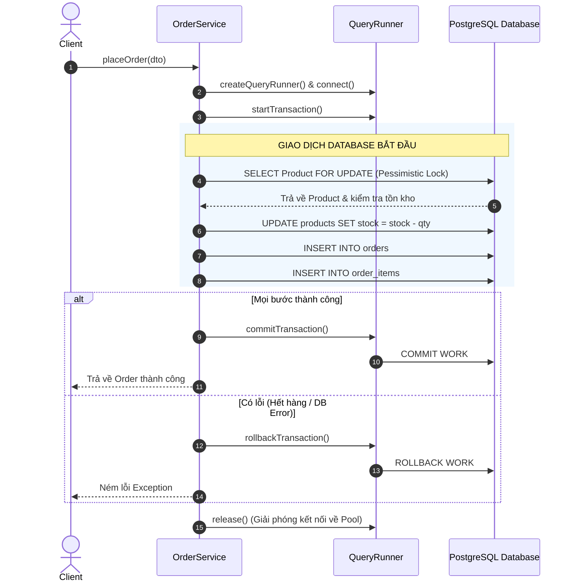

#### a. Phương pháp 1: Sử dụng `QueryRunner` Kiểm soát Thủ công Từng Bước (Khuyên dùng cho Logic Phức tạp)

```typescript
import { Injectable, BadRequestException } from '@nestjs/common';
import { DataSource } from 'typeorm';
import { Order, OrderStatus } from '../entities/Order';
import { OrderItem } from '../entities/OrderItem';
import { Product } from '../entities/Product';

export interface CreateOrderDto {
  userId: string;
  items: { productId: string; quantity: number }[];
}

@Injectable()
export class OrderCheckoutService {
  constructor(private dataSource: DataSource) {}

  async checkoutOrder(dto: CreateOrderDto): Promise<Order> {
    // 1. Tạo QueryRunner từ DataSource
    const queryRunner = this.dataSource.createQueryRunner();

    // 2. Kết nối tới Connection Pool và Mở Transaction
    await queryRunner.connect();
    await queryRunner.startTransaction();

    try {
      let subtotal = 0;
      const orderItemsToInsert: OrderItem[] = [];

      // 3. Duyệt qua từng sản phẩm và thực hiện Pessimistic Write Lock
      for (const itemDto of dto.items) {
        // SELECT ... FOR UPDATE nhằm ngăn chặn Race Condition đặt mua cùng lúc
        const product = await queryRunner.manager
          .createQueryBuilder(Product, 'p')
          .setLock('pessimistic_write')
          .where('p.id = :id', { id: itemDto.productId })
          .getOne();

        if (!product) {
          throw new BadRequestException(`Sản phẩm với ID ${itemDto.productId} không tồn tại.`);
        }

        if (product.stockQuantity < itemDto.quantity) {
          throw new BadRequestException(
            `Sản phẩm "${product.title}" chỉ còn ${product.stockQuantity} món trong kho (yêu cầu: ${itemDto.quantity}).`
          );
        }

        // Trừ tồn kho nguyên tử
        product.stockQuantity -= itemDto.quantity;
        await queryRunner.manager.save(product);

        // Tính tiền item
        const itemTotalPrice = product.price * itemDto.quantity;
        subtotal += itemTotalPrice;

        const orderItem = queryRunner.manager.create(OrderItem, {
          productId: product.id,
          quantity: itemDto.quantity,
          unitPrice: product.price,
          totalPrice: itemTotalPrice
        });
        orderItemsToInsert.push(orderItem);
      }

      // 4. Tạo hóa đơn Order
      const newOrder = queryRunner.manager.create(Order, {
        userId: dto.userId,
        orderNumber: `ORD-${Date.now()}-${Math.floor(Math.random() * 1000)}`,
        status: OrderStatus.PENDING,
        subtotal: subtotal,
        discountAmount: 0,
        totalAmount: subtotal,
        items: orderItemsToInsert
      });

      const savedOrder = await queryRunner.manager.save(newOrder);

      // 5. Cam kết Transaction (COMMIT)
      await queryRunner.commitTransaction();
      return savedOrder;
    } catch (error) {
      // 6. Hoàn tác Transaction nếu gặp bất kỳ lỗi nào (ROLLBACK)
      await queryRunner.rollbackTransaction();
      throw error;
    } finally {
      // 7. BẮT BUỘC giải phóng QueryRunner để trả connection về Pool!
      await queryRunner.release();
    }
  }
}
```

#### b. Phương pháp 2: Sử dụng `dataSource.transaction()` (Ngắn gọn, Tự động Quản lý)

```typescript
async checkoutWithTransactionScope(dto: CreateOrderDto): Promise<Order> {
  return await this.dataSource.transaction('READ COMMITTED', async (transactionalEntityManager) => {
    // Toàn bộ logic DB bên trong hàm này sử dụng transactionalEntityManager
    // Nếu hàm này throw exception -> Auto Rollback
    // Nếu hàm hoàn thành bình thường -> Auto Commit
    
    const user = await transactionalEntityManager.findOneOrFail(User, {
      where: { id: dto.userId }
    });

    const order = transactionalEntityManager.create(Order, {
      userId: user.id,
      orderNumber: `ORD-${Date.now()}`,
      status: OrderStatus.PENDING,
      totalAmount: 100
    });

    return await transactionalEntityManager.save(order);
  });
}
```

---

## IV. LƯU Ý CẠM BẪY VÀ QUY TẮC CỐT LÕI (PITFALLS & CORE RULES)

### 1. Cạm bẫy Phân trang: `take`/`skip` vs `limit`/`offset` khi có JOIN quan hệ 1-N

> [!CAUTION]
> **Sự cố phân trang sai dữ liệu nghiêm trọng nhất trong TypeORM:**
> Khi bạn thực hiện `LEFT JOIN` giữa bảng Cha (1) và bảng Con (N) - ví dụ `User` và `Order`:
> - Nếu một User có 3 Orders, câu lệnh SQL JOIN sẽ trả về **3 dòng dữ liệu** trong ResultSet.
> - Nếu bạn sử dụng `.limit(10).offset(0)` trên SQL, Database sẽ cắt đúng 10 dòng raw SQL đầu tiên. Nếu 3 dòng đầu thuộc về User 1, 4 dòng tiếp theo thuộc User 2, 3 dòng còn lại thuộc User 3 -> Kết quả bạn chỉ nhận được 3 Users thay vì 10 Users như mong muốn!

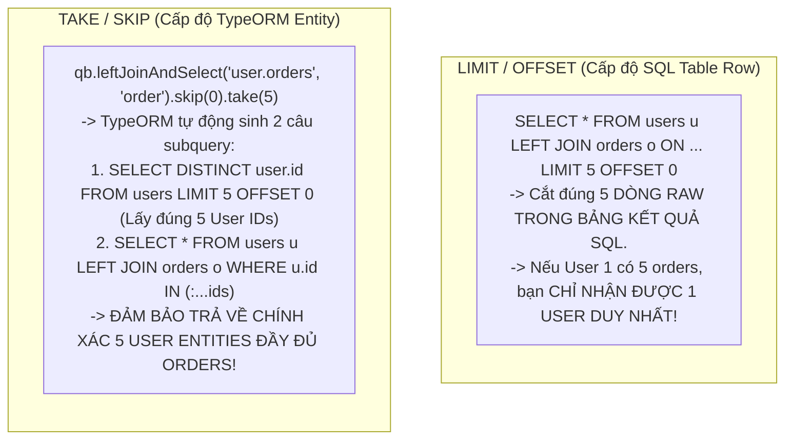

* **Quy tắc cốt lõi:**
  * **LUÔN DÙNG `.take()` và `.skip()`** khi làm việc với `createQueryBuilder` có nạp quan hệ `OneToMany` hoặc `ManyToMany` (`leftJoinAndSelect`).
  * **CHỈ DÙNG `.limit()` và `.offset()`** khi bạn truy vấn dữ liệu thô (`getRawMany()`), không JOIN One-to-Many, hoặc truy vấn trên bảng đơn lẻ.

---

### 2. Sự khác biệt sống còn giữa `save()`/`remove()` vs `insert()`/`update()`/`delete()`

Nhiều lập trình viên nhầm lẫn giữa hai nhóm API này dẫn đến suy giảm hiệu năng nghiêm trọng hoặc bị lọt lỗi bảo mật do thiếu Lifecycle Hooks:

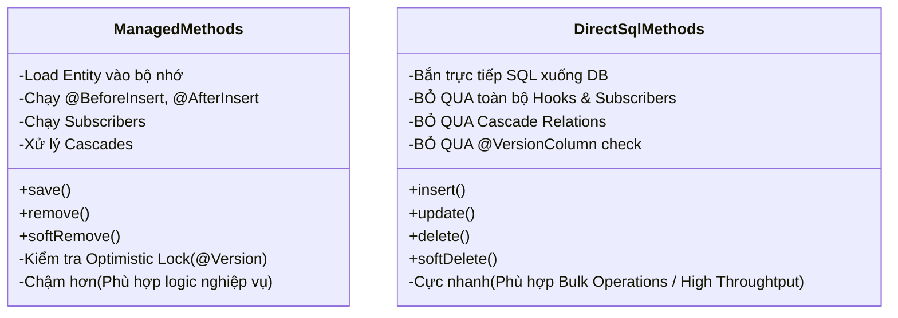

> [!WARNING]
> Nếu bạn đặt logic mã hóa mật khẩu trong `@BeforeInsert()` hoặc `@BeforeUpdate()` trên Entity `User`:
> - Khi bạn gọi `userRepository.save(user)`: Mật khẩu **SẼ ĐƯỢC HASH**.
> - Khi bạn gọi `userRepository.update({ id }, { password: 'plain' })` hoặc `userRepository.insert(...)`: Mật khẩu **SẼ LƯU NGUYÊN VĂN DẠNG PLAIN TEXT VÀO DATABASE** vì hàm `update()` bắn thẳng SQL và bỏ qua hoàn toàn lifecycle hooks!

---

### 3. Vấn đề Kiểu dữ liệu: `BigInt`, `Decimal`/`Numeric` trong TypeScript & Node.js

JavaScript chỉ hỗ trợ số thực an toàn (Safe Integers) trong khoảng từ $-(2^{53} - 1)$ đến $2^{53} - 1$ (`Number.MAX_SAFE_INTEGER` $\approx 9 \times 10^{15}$).
- Kiểu `bigint` trong SQL có giá trị lên tới $2^{63} - 1$.
- Kiểu `numeric`/`decimal` trong SQL được thiết kế cho độ chính xác tài chính tuyệt đối, không có sai số dấu phẩy động.

Do đó, các driver cơ sở dữ liệu (`pg`, `mysql2`) và TypeORM theo mặc định **luôn trả về giá trị kiểu `string`** cho các cột `bigint` và `decimal`/`numeric` để chống tràn số.

```typescript
// ❌ SAI LẦM PHỔ BIẾN: Khai báo type number nhưng nhận về string
@Column({ type: 'numeric', precision: 10, scale: 2 })
price!: number; // Ở runtime, giá trị thực tế typeof product.price === 'string' !
// Thực hiện phép cộng: product.price + 10 => "99.9910" (Ghép chuỗi sai lệch tài chính)

// ✅ GIẢI PHÁP CHUẨN: Sử dụng ValueTransformer
export const ColumnNumericTransformer: ValueTransformer = {
  to: (val: number | null): number | null => val,
  from: (val: string | null): number | null => (val === null ? null : parseFloat(val))
};

@Column({
  type: 'numeric',
  precision: 10,
  scale: 2,
  transformer: ColumnNumericTransformer
})
price!: number; // Runtime luôn đảm bảo là number
```

---

### 4. Vòng lặp Vô tận trong Event Subscribers & Deadlocks

> [!CAUTION]
> **Hiểm họa Vòng lặp Vô tận (Infinite Loop):**
> Bên trong một Subscriber (ví dụ `afterUpdate`), nếu bạn gọi tiếp `event.manager.getRepository(User).save(user)` trên cùng Entity đó -> Nó sẽ tiếp tục kích hoạt lại sự kiện `beforeUpdate` -> `afterUpdate` -> Tiếp tục gọi `save()` -> **Gây đệ quy vô tận và làm treo cứng Node.js Event Loop!**

```typescript
// ❌ SAI: Gây Infinite Loop
@EventSubscriber()
export class BadUserSubscriber implements EntitySubscriberInterface<User> {
  listenTo() { return User; }

  async afterUpdate(event: UpdateEvent<User>) {
    if (event.entity) {
      event.entity.updatedAt = new Date();
      // NGUY HIỂM: Lệnh save này sẽ gọi lại afterUpdate vĩnh viễn!
      await event.manager.getRepository(User).save(event.entity);
    }
  }
}

// ✅ ĐÚNG: Sử dụng update() trực tiếp để bỏ qua Subscribers hoặc xử lý trong beforeUpdate
@EventSubscriber()
export class GoodUserSubscriber implements EntitySubscriberInterface<User> {
  listenTo() { return User; }

  async afterUpdate(event: UpdateEvent<User>) {
    if (event.entity?.id) {
      // Bắn trực tiếp UPDATE để không kích hoạt lại Subscriber
      await event.manager.getRepository(User).update(event.entity.id, {
        // Chỉ update các trường audit cần thiết
      });
    }
  }
}
```

---

### 5. Bảng Tổng kết 10 Quy tắc Vàng khi phát triển dự án với TypeORM

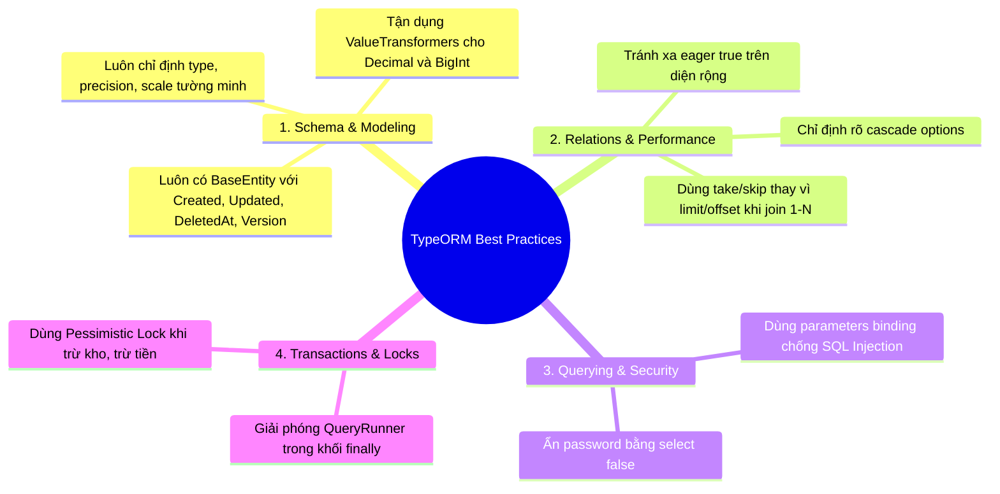

1. **Luôn bật `strictNullChecks: true` trong `tsconfig.json`**: Đảm bảo type safety chính xác cho các cột `nullable: true` (TypeScript type phải là `string | null`).
2. **Ẩn các cột nhạy cảm bằng `select: false`**: Không bao giờ để lộ mật khẩu hay token bảo mật trong các câu `find()` mặc định.
3. **Phân biệt rõ ràng `take/skip` và `limit/offset`**: Nắm vững cơ chế sinh subquery của `take/skip` khi JOIN quan hệ 1-N.
4. **Không lạm dụng `cascade: true` và `eager: true`**: Chỉ bật cascade trên các quan hệ phụ thuộc hoàn toàn (Aggregate Root - e.g., `Order` -> `OrderItems`). Tuyệt đối không bật eager tràn lan.
5. **Chống Race Condition bằng Pessimistic Lock hoặc Optimistic Lock**: Với các giao dịch tiền tệ/kho bãi, luôn dùng `setLock('pessimistic_write')` hoặc tận dụng `@VersionColumn()`.
6. **Sử dụng `ValueTransformer` cho các kiểu số thực**: Đảm bảo tính nhất quán giữa JavaScript runtime và PostgreSQL Numeric/Decimal.
7. **Luôn bọc `queryRunner.release()` trong khối `finally`**: Tránh hoàn toàn lỗi rò rỉ kết nối (Connection Pool Exhaustion / Leak).
8. **Ưu tiên `Data Mapper Pattern` với `Repository<T>`**: Giúp mã nguồn dễ bảo trì, dễ viết Unit Test và tương thích hoàn hảo với Clean Architecture/NestJS.
9. **Tận dụng `Brackets` cho các logic boolean phức tạp**: Đảm bảo câu lệnh SQL sinh ra đúng thứ tự ưu tiên các toán tử AND / OR.
10. **Tách biệt thao tác ghi nhận Hooks và Bulk Operations**: Dùng `save()`/`remove()` cho luồng nghiệp vụ thông thường cần kiểm soát; dùng `insert()`/`update()`/`delete()` khi cần tối ưu hiệu năng xử lý hàng loạt dữ liệu lớn.
