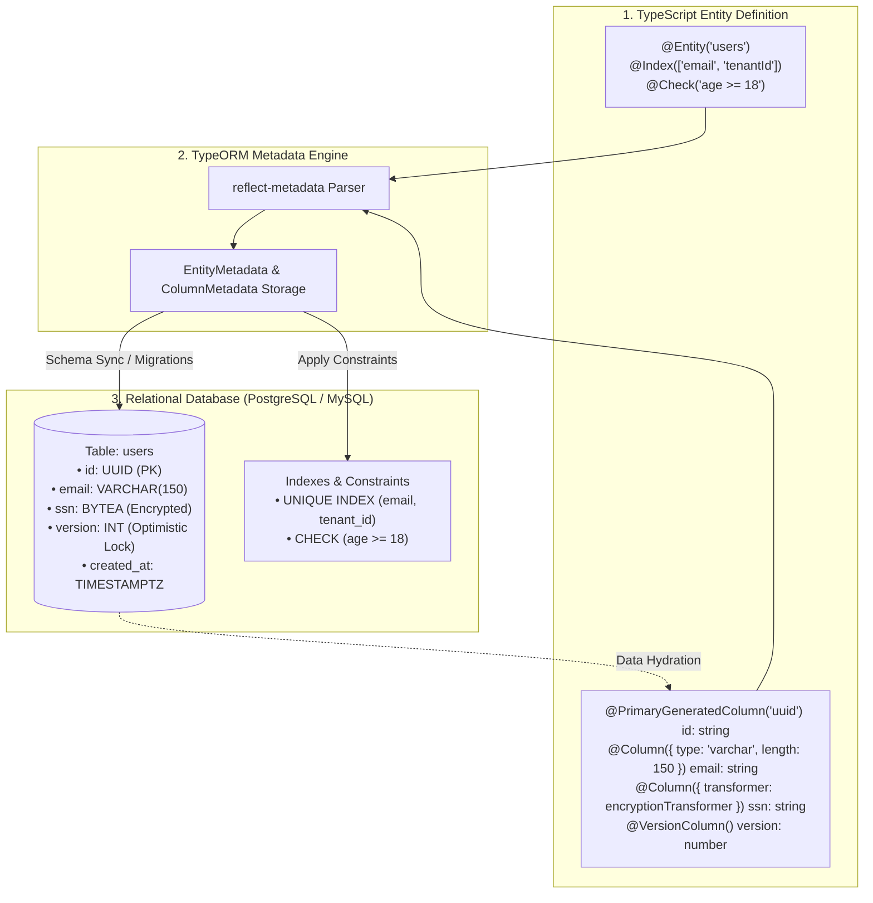
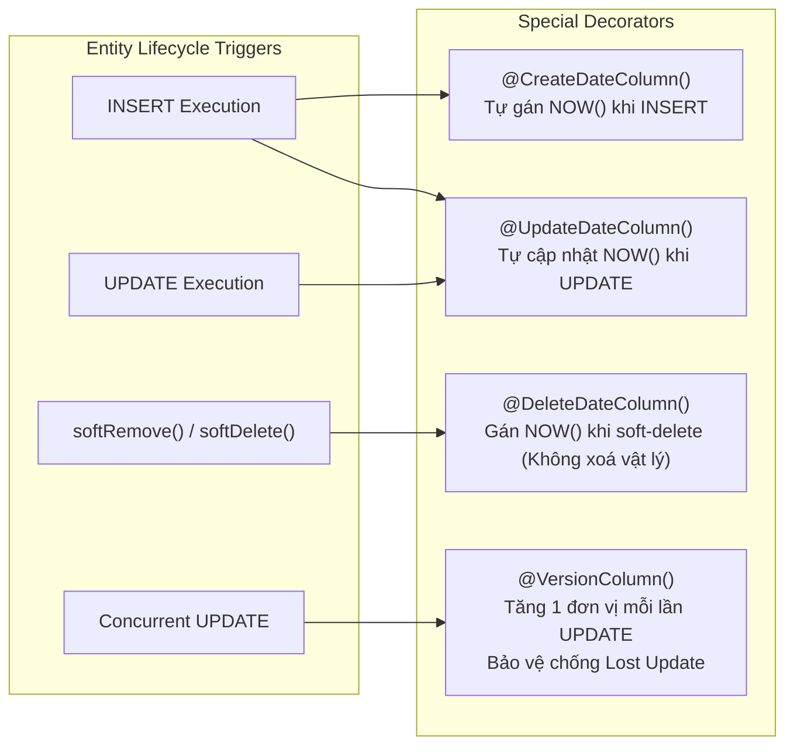
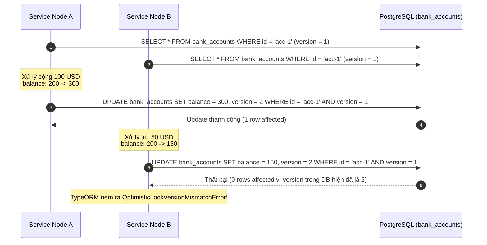

## I. KHÁI QUÁT (OVERVIEW)

Trong kiến trúc của **TypeORM**, **Entity** là trung tâm của toàn bộ hệ thống Object-Relational Mapping (ORM). Một Entity là một TypeScript Class được trang trí (decorated) bởi các Decorators nhằm thiết lập cầu nối ánh xạ trực tiếp cấu trúc dữ liệu hướng đối tượng (OOP) thành lược đồ bảng (Schema DDL) và các hàng dữ liệu trong Cơ sở dữ liệu quan hệ (RDBMS).

TypeORM tận dụng sức mạnh của **TypeScript Metadata Reflection API** (`reflect-metadata`) để phân tích định nghĩa lớp, kiểu dữ liệu của các thuộc tính, cùng các cấu hình khai báo thông qua Decorators nhằm:
1. Tự động sinh mã DDL (`CREATE TABLE`, `ALTER TABLE`, `CREATE INDEX`, `ADD CONSTRAINT`) khi kích hoạt cơ chế đồng bộ hóa hoặc tạo migration.
2. Tự động chuyển đổi kiểu dữ liệu hai chiều: Serialization (OOP Instance $\rightarrow$ SQL Parameters) và Hydration (SQL Result Row $\rightarrow$ OOP Instance).
3. Quản lý trạng thái thực thể, theo dõi thay đổi (Dirty Checking), và kích hoạt các quy tắc nghiệp vụ tự động (Auditing, Optimistic Locking, Soft Deletion).



---

## II. CHI TIẾT KỸ THUẬT

### 1. Khai báo Bảng với `@Entity()`

Decorator `@Entity()` đánh dấu một class là một thực thể cơ sở dữ liệu. TypeORM sẽ coi mỗi instance của class này tương ứng với một bản ghi trong bảng.

```typescript
@Entity(options?: EntityOptions)
@Entity(name?: string, options?: EntityOptions)
```

#### Các tùy chọn chi tiết trong `EntityOptions`:
* `name`: Tên của bảng trong cơ sở dữ liệu (mặc định lấy theo tên Class nếu bỏ trống).
* `schema`: Schema chứa bảng (đặc thù trong PostgreSQL, SQL Server, Oracle).
* `database`: Tên cơ sở dữ liệu (đối với MySQL, SQL Server khi hỗ trợ đa database trên một kết nối).
* `engine`: Engine lưu trữ của bảng (ví dụ: `InnoDB`, `MyISAM` trong MySQL).
* `synchronize`: boolean. Nếu đặt `false`, TypeORM Schema Synchronization sẽ bỏ qua bảng này, không tự động sinh DDL.
* `orderBy`: Định nghĩa sắp xếp mặc định khi gọi các hàm truy vấn `find()`.

---

### 2. Khóa chính (Primary Key Decorators)

TypeORM cung cấp hai decorator chính để xác định khóa chính:

#### a. `@PrimaryColumn(options?: ColumnOptions)`
Đánh dấu một cột là Primary Key nhưng **không tự động sinh giá trị**. Lập trình viên phải tự cung cấp giá trị duy nhất trước khi lưu (`save()` / `insert()`).

```typescript
@PrimaryColumn({ type: 'varchar', length: 32 })
code: string;
```

#### b. `@PrimaryGeneratedColumn(strategy?: 'increment' | 'uuid' | 'rowid' | 'identity', options?: PrimaryGeneratedColumnOptions)`
Đánh dấu một cột là Primary Key và **tự động sinh giá trị** theo chiến lược chỉ định:
* `'increment'` *(Mặc định)*: Sử dụng kiểu số tự tăng (`AUTO_INCREMENT` trong MySQL, `SERIAL` / `BIGSERIAL` trong PostgreSQL).
* `'uuid'`: Tự động sinh chuỗi UUID v4 duy nhất.
* `'identity'`: Sử dụng chuẩn SQL:2003 `GENERATED ALWAYS / BY DEFAULT AS IDENTITY` (PostgreSQL 10+, Oracle 12c+).
* `'rowid'`: Dành riêng cho SQLite / CockroachDB.

```typescript
// 1. Tự tăng theo kiểu BigInt (khuyến nghị cho hệ thống phân tán hoặc dữ liệu lớn)
@PrimaryGeneratedColumn('increment', { type: 'bigint' })
id: string;

// 2. Tự động sinh UUID v4
@PrimaryGeneratedColumn('uuid')
id: string;
```

---

### 3. Cấu hình Cột Chi Tiết với `@Column()`

Decorator `@Column()` dùng để ánh xạ một property của TypeScript thành một cột (Column) trong bảng Database.

```typescript
@Column(options?: ColumnOptions)
@Column(type?: ColumnType, options?: ColumnOptions)
```

#### Bảng tra cứu toàn bộ thuộc tính của `ColumnOptions`:

| Thuộc tính | Kiểu dữ liệu | Mô tả chi tiết |
| :--- | :--- | :--- |
| `type` | `ColumnType` | Kiểu dữ liệu SQL trong DB (`varchar`, `text`, `int`, `bigint`, `decimal`, `numeric`, `boolean`, `timestamp`, `timestamptz`, `json`, `jsonb`, `enum`, `bytea`, v.v.). |
| `name` | `string` | Tên cột trong DB. Nếu không khai báo, TypeORM dùng tên property theo chuẩn camelCase hoặc snake_case tuỳ NamingStrategy. |
| `length` | `string \| number` | Độ dài tối đa của kiểu chuỗi (`varchar(255)`, `char(10)`). |
| `nullable` | `boolean` | Cho phép giá trị `NULL` trong DB (`false` tương ứng `NOT NULL`). Mặc định là `false`. |
| `unique` | `boolean` | Tạo ràng buộc `UNIQUE` đơn cột trên DB. Mặc định là `false`. |
| `default` | `any` | Giá trị mặc định ở mức Database DDL (chuỗi, số, hoặc raw SQL expression như `() => 'CURRENT_TIMESTAMP'`). |
| `select` | `boolean` | Nếu đặt `false`, cột này sẽ bị loại khỏi danh sách `SELECT` mặc định của `find()` (thường dùng cho `password_hash`, `secret_token`). |
| `precision` | `number` | Tổng số chữ số có nghĩa cho kiểu `decimal`, `numeric`, `time`, `timestamp`. |
| `scale` | `number` | Số chữ số phần thập phân cho kiểu `decimal`, `numeric` (ví dụ `precision: 10, scale: 2` $\rightarrow$ `DECIMAL(10,2)`). |
| `array` | `boolean` | Xác định kiểu mảng đa chiều (chỉ hỗ trợ trên PostgreSQL: `varchar[]`, `int[]`). |
| `enum` | `Array \| Object` | Danh sách giá trị hợp lệ cho cột kiểu `enum`. |
| `enumName` | `string` | Tên của ENUM Type trong PostgreSQL DDL. |
| `comment` | `string` | Đoạn chú thích tài liệu hóa cho cột trong bảng DB (`COMMENT ON COLUMN`). |
| `transformer` | `ValueTransformer \| ValueTransformer[]` | Hàm chuyển đổi dữ liệu hai chiều khi đọc từ DB lên và khi ghi xuống DB. |

---

### 4. Cơ chế Custom ValueTransformer

`ValueTransformer` là interface mạnh mẽ cho phép can thiệp vào tiến trình chuyển đổi dữ liệu giữa Database và ứng dụng.

```typescript
export interface ValueTransformer {
    // Chuyển đổi từ dữ liệu TS sang định dạng lưu trữ Database (trước khi ghi)
    to(value: any): any;
    // Chuyển đổi từ dữ liệu Database sang đối tượng TS (sau khi đọc)
    from(value: any): any;
}
```

#### Ứng dụng tiêu biểu của ValueTransformer:
1. **Chuyển đổi kiểu `bigint` / `decimal`**: Mặc định Node.js nhận `bigint` hoặc `decimal` từ driver PostgreSQL dưới dạng `string` để chống tràn số (overflow). Transformer giúp parse tự động sang `number` hoặc `BigInt`.
2. **Mã hóa dữ liệu nhạy cảm (Encryption at Rest)**: Tự động mã hóa AES-256 trước khi `INSERT`/`UPDATE` và giải mã khi `SELECT`.
3. **Chuẩn hóa định dạng**: Chuyển đổi Email về dạng viết thường (`lowercase`), cắt khoảng trắng (`trim`).

---

### 5. Cột Đặc Biệt: Auditing & Optimistic Locking

TypeORM cung cấp các Decorator quản lý dữ liệu đặc thù tự động:



* `@CreateDateColumn()`: Tự động ghi nhận thời điểm bản ghi được tạo (`timestamp with time zone`).
* `@UpdateDateColumn()`: Tự động cập nhật thời điểm mỗi khi entity có sự thay đổi và được gọi `save()`.
* `@DeleteDateColumn()`: Cột đánh dấu xóa mềm (**Soft Delete**). Khi thực hiện `softRemove()` hoặc `softDelete()`, TypeORM chỉ cập nhật timestamp vào cột này thay vì thực thi lệnh SQL `DELETE`. Mọi truy vấn `find()` thông thường sẽ tự động gán thêm điều kiện `WHERE deleted_at IS NULL`.
* `@VersionColumn()`: Kích hoạt cơ chế **Khóa Lạc Quan (Optimistic Locking)**. Mỗi lần Entity được cập nhật, TypeORM sẽ tự động tăng giá trị cột version lên 1 đơn vị và kiểm tra tính toàn vẹn:
  $$\text{WHERE id} = :id \text{ AND version} = :currentVersion$$
  Nếu một transaction khác đã thay đổi bản ghi trước đó (khiến version trong DB bị lệch), TypeORM sẽ ném ra lỗi `OptimisticLockVersionMismatchError`, ngăn chặn hoàn toàn lỗi ghi đè dữ liệu mất mát (**Lost Update Problem**).

---

### 6. Ràng buộc và Chỉ mục: `@Index()`, `@Unique()`, `@Check()`

#### a. `@Index(name?: string, fields?: string[], options?: IndexOptions)`
Tạo chỉ mục tìm kiếm nhằm tăng tốc độ truy vấn:
* Đặt trực tiếp trên một property: Tạo Single-column Index.
* Đặt trên Class: Tạo **Composite Index** (Chỉ mục kết hợp nhiều cột) hoặc Partial Index.
* `options.unique`: Biến Index thành Unique Index.
* `options.spatial`: Tạo Spatial Index (cho dữ liệu GIS/PostGIS).
* `options.where`: Tạo **Partial Index** trên PostgreSQL (chỉ index các bản ghi thỏa mãn điều kiện `WHERE status = 'ACTIVE'`).

#### b. `@Unique(name?: string, fields: string[])`
Đặt trên Class để khai báo ràng buộc **Composite Unique Constraint** (Tổ hợp nhiều cột phải là duy nhất trên toàn bảng).

#### c. `@Check(expression: string)`
Đặt trên Class để khai báo ràng buộc **SQL CHECK Constraint** ở mức Database (ví dụ kiểm tra số dư ví $\ge 0$, tuổi $\ge 18$, v.v.).

---

## III. VÍ DỤ MINH HỌA VÀ PHÂN TÍCH CODE

Dưới đây là ví dụ triển khai thực tế một Entity Quản lý Tài khoản Ngân hàng / Thanh toán (`BankAccountEntity`) và Sản phẩm (`ProductEntity`), ứng dụng toàn diện các decorators, transformers, constraints và optimistic locking.

### 1. Triển khai ValueTransformer cho BigInt và Mã Hóa Dữ Liệu

```typescript
import { ValueTransformer } from 'typeorm';
import * as crypto from 'crypto';

// 1. Transformer xử lý chuyển đổi kiểu DECIMAL / NUMERIC sang Number an toàn
export class DecimalToNumberTransformer implements ValueTransformer {
  to(value: number | null): number | null {
    return value;
  }
  from(value: string | null): number | null {
    if (value === null || value === undefined) return null;
    const parsed = parseFloat(value);
    return isNaN(parsed) ? null : parsed;
  }
}

// 2. Transformer mã hóa và giải mã chuỗi nhạy cảm (AES-256-CBC)
export class EncryptionTransformer implements ValueTransformer {
  private readonly algorithm = 'aes-256-cbc';
  private readonly key = Buffer.from('12345678901234567890123456789012', 'utf-8'); // 32 bytes key
  private readonly ivLength = 16;

  to(value: string | null): string | null {
    if (!value) return null;
    const iv = crypto.randomBytes(this.ivLength);
    const cipher = crypto.createCipheriv(this.algorithm, this.key, iv);
    let encrypted = cipher.update(value, 'utf8', 'hex');
    encrypted += cipher.final('hex');
    // Lưu định dạng: iv:encrypted_payload
    return `${iv.toString('hex')}:${encrypted}`;
  }

  from(value: string | null): string | null {
    if (!value) return null;
    try {
      const [ivHex, encryptedText] = value.split(':');
      if (!ivHex || !encryptedText) return null;
      const iv = Buffer.from(ivHex, 'hex');
      const decipher = crypto.createDecipheriv(this.algorithm, this.key, iv);
      let decrypted = decipher.update(encryptedText, 'hex', 'utf8');
      decrypted += decipher.final('utf8');
      return decrypted;
    } catch {
      return null;
    }
  }
}
```

---

### 2. Triển khai Entity Hoàn Chỉnh

```typescript
import {
  Entity,
  PrimaryGeneratedColumn,
  Column,
  CreateDateColumn,
  UpdateDateColumn,
  DeleteDateColumn,
  VersionColumn,
  Index,
  Unique,
  Check,
} from 'typeorm';
import { DecimalToNumberTransformer, EncryptionTransformer } from './transformers';

export enum AccountStatus {
  PENDING = 'PENDING',
  ACTIVE = 'ACTIVE',
  FROZEN = 'FROZEN',
  CLOSED = 'CLOSED',
}

export enum CurrencyCode {
  USD = 'USD',
  VND = 'VND',
  EUR = 'EUR',
}

@Entity({ name: 'bank_accounts' })
// Ràng buộc Unique kết hợp: Một User không thể mở 2 tài khoản cùng loại tiền tệ trong cùng một Chi nhánh
@Unique('UQ_user_currency_branch', ['userId', 'currency', 'branchCode'])
// Ràng buộc Check: Số dư khả dụng không được phép âm, hạn mức thấu chi >= 0
@Check('CHK_non_negative_balance', `"balance" >= 0`)
@Check('CHK_valid_overdraft', `"overdraft_limit" >= 0`)
// Composite Index để tối ưu truy vấn tìm kiếm danh sách tài khoản theo trạng thái và ngày tạo
@Index('IDX_status_created_at', ['status', 'createdAt'])
// Partial Index trong PostgreSQL: Chỉ index các tài khoản đang ACTIVE để tăng tốc tìm kiếm
@Index('IDX_active_accounts_only', ['userId'], { where: `"status" = 'ACTIVE' AND "deleted_at" IS NULL` })
export class BankAccountEntity {
  @PrimaryGeneratedColumn('uuid')
  id: string;

  @Column({ name: 'user_id', type: 'uuid' })
  @Index('IDX_bank_account_user_id')
  userId: string;

  @Column({ name: 'account_number', type: 'varchar', length: 30, unique: true })
  accountNumber: string;

  // Cột CCCD/SSN được mã hóa tự động khi lưu xuống DB
  @Column({
    name: 'tax_identification_number',
    type: 'varchar',
    length: 255,
    nullable: true,
    transformer: new EncryptionTransformer(),
    comment: 'Mã số thuế / CCCD chủ sở hữu (Đã mã hóa AES-256)',
  })
  taxIdentificationNumber: string | null;

  @Column({
    type: 'enum',
    enum: AccountStatus,
    enumName: 'account_status_enum',
    default: AccountStatus.PENDING,
  })
  status: AccountStatus;

  @Column({
    type: 'enum',
    enum: CurrencyCode,
    enumName: 'currency_code_enum',
    default: CurrencyCode.VND,
  })
  currency: CurrencyCode;

  @Column({ name: 'branch_code', type: 'varchar', length: 20 })
  branchCode: string;

  // Số dư tài khoản: kiểu Decimal(18, 4) kết hợp Transformer parse sang Number
  @Column({
    type: 'decimal',
    precision: 18,
    scale: 4,
    default: 0.0,
    transformer: new DecimalToNumberTransformer(),
  })
  balance: number;

  @Column({
    name: 'overdraft_limit',
    type: 'decimal',
    precision: 18,
    scale: 4,
    default: 0.0,
    transformer: new DecimalToNumberTransformer(),
  })
  overdraftLimit: number;

  // Dữ liệu cấu hình phụ lưu trữ dưới dạng JSONB (chỉ có trên PostgreSQL)
  @Column({
    type: 'jsonb',
    nullable: true,
    default: () => `'{"notifications": {"email": true, "sms": false}}'`,
  })
  metadata: {
    notifications?: { email: boolean; sms: boolean };
    dailyTransferLimit?: number;
    tags?: string[];
  } | null;

  // Mảng chuỗi nhãn phân loại (PostgreSQL Native Array)
  @Column({ type: 'varchar', array: true, default: '{}' })
  tags: string[];

  // Mã PIN hoặc Secret Token: Đặt select: false để không bị lọt vào response find() mặc định
  @Column({ name: 'security_pin_hash', type: 'varchar', length: 255, select: false })
  securityPinHash: string;

  // Khóa lạc quan chống Lost Update
  @VersionColumn({ name: 'version' })
  version: number;

  // Quản lý Audit Timestamps
  @CreateDateColumn({ name: 'created_at', type: 'timestamptz' })
  createdAt: Date;

  @UpdateDateColumn({ name: 'updated_at', type: 'timestamptz' })
  updatedAt: Date;

  // Hỗ trợ Soft Delete
  @DeleteDateColumn({ name: 'deleted_at', type: 'timestamptz', nullable: true, select: false })
  deletedAt: Date | null;
}
```

---

### 3. Mã SQL DDL Tương Đương do TypeORM Tự Động Sinh Ra (PostgreSQL)

```sql
-- 1. Khởi tạo ENUM Types
CREATE TYPE "account_status_enum" AS ENUM ('PENDING', 'ACTIVE', 'FROZEN', 'CLOSED');
CREATE TYPE "currency_code_enum" AS ENUM ('USD', 'VND', 'EUR');

-- 2. Tạo cấu trúc Bảng
CREATE TABLE "bank_accounts" (
    "id" uuid NOT NULL DEFAULT uuid_generate_v4(),
    "user_id" uuid NOT NULL,
    "account_number" character varying(30) NOT NULL,
    "tax_identification_number" character varying(255),
    "status" "account_status_enum" NOT NULL DEFAULT 'PENDING',
    "currency" "currency_code_enum" NOT NULL DEFAULT 'VND',
    "branch_code" character varying(20) NOT NULL,
    "balance" numeric(18,4) NOT NULL DEFAULT '0',
    "overdraft_limit" numeric(18,4) NOT NULL DEFAULT '0',
    "metadata" jsonb DEFAULT '{"notifications": {"email": true, "sms": false}}',
    "tags" character varying[] NOT NULL DEFAULT '{}',
    "security_pin_hash" character varying(255) NOT NULL,
    "version" integer NOT NULL,
    "created_at" TIMESTAMP WITH TIME ZONE NOT NULL DEFAULT now(),
    "updated_at" TIMESTAMP WITH TIME ZONE NOT NULL DEFAULT now(),
    "deleted_at" TIMESTAMP WITH TIME ZONE,
    CONSTRAINT "PK_bank_accounts_id" PRIMARY KEY ("id"),
    CONSTRAINT "UQ_bank_accounts_account_number" UNIQUE ("account_number"),
    CONSTRAINT "UQ_user_currency_branch" UNIQUE ("user_id", "currency", "branch_code"),
    CONSTRAINT "CHK_non_negative_balance" CHECK ("balance" >= 0),
    CONSTRAINT "CHK_valid_overdraft" CHECK ("overdraft_limit" >= 0)
);

-- 3. Tạo Indexes
CREATE INDEX "IDX_bank_account_user_id" ON "bank_accounts" ("user_id");
CREATE INDEX "IDX_status_created_at" ON "bank_accounts" ("status", "created_at");
CREATE INDEX "IDX_active_accounts_only" ON "bank_accounts" ("user_id") 
    WHERE "status" = 'ACTIVE' AND "deleted_at" IS NULL;

-- 4. Thêm Comment
COMMENT ON COLUMN "bank_accounts"."tax_identification_number" IS 'Mã số thuế / CCCD chủ sở hữu (Đã mã hóa AES-256)';
```

---

## IV. LƯU Ý CẠM BẪY VÀ QUY TẮC CỐT LÕI

### 1. Cạm bẫy Mất độ chính xác Số học (`bigint` và `decimal`)

> [!WARNING]
> Mặc định trong Node.js Driver (`pg`, `mysql2`), kiểu `bigint` và `decimal/numeric` được trả về dưới dạng chuỗi (`string`) để tránh việc JavaScript ép kiểu sang `Number` (IEEE 754 float 64-bit) gây sai lệch số học ngoài khoảng `Number.MAX_SAFE_INTEGER` ($2^{53} - 1$).
> * **Giải pháp:** Luôn sử dụng `ValueTransformer` nếu muốn tự động parse về `number` (chỉ khi đảm bảo giá trị không vượt quá $9.007.199.254.740.991$) hoặc sử dụng kiểu `BigInt` / thư viện `decimal.js` / `bignumber.js` cho các hệ thống tính toán tài chính chính xác tuyệt đối.

---

### 2. Cạm bẫy với `select: false` khi sử dụng QueryBuilder

> [!IMPORTANT]
> Cấu hình `@Column({ select: false })` **chỉ có hiệu lực** khi sử dụng các hàm Repository chuẩn (`find()`, `findOne()`, `findBy()`).
> * Khi sử dụng `createQueryBuilder('account')`, TypeORM mặc định **bỏ qua** thuộc tính `select: false` nếu bạn chỉ định `select('account')` hoặc dùng `addSelect()`.
> * Muốn lấy cột ẩn trong `find()`: Phải dùng `select: { id: true, securityPinHash: true }`.
> * Muốn lấy cột ẩn trong `QueryBuilder`: Bắt buộc phải gọi tường minh `.addSelect('account.securityPinHash')`.

```typescript
// Lấy trường select: false bằng Repository findOne
const account = await repo.findOne({
  where: { id: 'some-uuid' },
  select: { id: true, accountNumber: true, securityPinHash: true } // Phải bật rõ ràng
});

// Lấy trường select: false bằng QueryBuilder
const accountQB = await repo.createQueryBuilder('account')
  .where('account.id = :id', { id: 'some-uuid' })
  .addSelect('account.securityPinHash') // Bắt buộc gọi addSelect
  .getOne();
```

---

### 3. Cạm bẫy Đồng bộ hóa Schema (`synchronize: true`)

> [!CAUTION]
> Tuyệt đối **KHÔNG BAO GIỜ** bật `synchronize: true` trên môi trường Production hoặc Staging.
> * TypeORM `synchronize` sẽ tự động so sánh Entities với Database Schema thực tế. Nếu một property bị xóa, đổi tên hoặc sửa kiểu dữ liệu trong code, TypeORM có thể thực thi lệnh `ALTER TABLE DROP COLUMN` hoặc `DROP TABLE`, dẫn đến **mất dữ liệu vĩnh viễn không thể phục hồi**.
> * Trên Production, quy trình chuẩn bắt buộc là: Khóa `synchronize: false` và chỉ áp dụng thay đổi thông qua **TypeORM Migrations** có kiểm duyệt mã nguồn.

---

### 4. Cạm bẫy với `@VersionColumn()` và Lỗi Xung đột Cập nhật



> [!TIP]
> Khi sử dụng `@VersionColumn()`, ứng dụng của bạn phải luôn có khối `try...catch` bắt lỗi `OptimisticLockVersionMismatchError` để thực hiện cơ chế **Retry Logic** (đọc lại dữ liệu mới nhất và tính toán lại) hoặc thông báo cho người dùng biết dữ liệu vừa bị thay đổi bởi phiên làm việc khác.

---

### 5. Bảng Quy Tắc Vàng Khi Thiết Kế Entity trong TypeORM

| STT | Nguyên Tắc Vàng | Lý Do Kỹ Thuật |
| :--- | :--- | :--- |
| **1** | Luôn đặt tên bảng và tên cột ở dạng `snake_case` thông qua `name` option. | Tránh xung đột phân biệt hoa thường giữa các hệ quản trị DB (PostgreSQL tự lowercase tên không đặt trong nháy kép). |
| **2** | Luôn dùng `timestamptz` (`timestamp with time zone`) cho thời gian. | Ngăn chặn lỗi lệch múi giờ khi server app và server DB đặt tại các khu vực địa lý khác nhau. |
| **3** | Khai báo giá trị khởi tạo hoặc toán tử non-null assertion `!:` trong TypeScript. | Tránh lỗi biên dịch `strictPropertyInitialization: true` của TypeScript Compiler. |
| **4** | Đặt đầy đủ các chỉ mục `@Index` trên các cột Foreign Key (`userId`, `orderId`). | Tăng tốc độ thực thi các câu lệnh `JOIN` và tránh Table Scan khi lọc dữ liệu liên kết. |
| **5** | Định nghĩa rõ ràng `precision` và `scale` cho mọi trường tiền tệ / tỷ giá. | Đảm bảo tính nhất quán và chính xác tuyệt đối trong các phép tính tài chính. |
