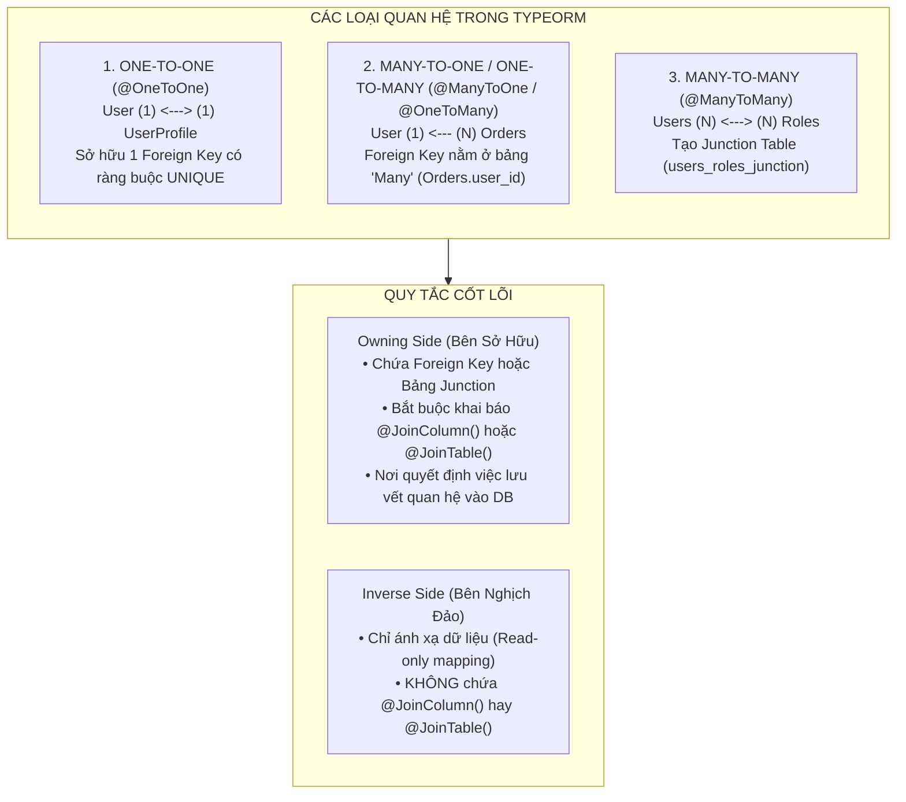
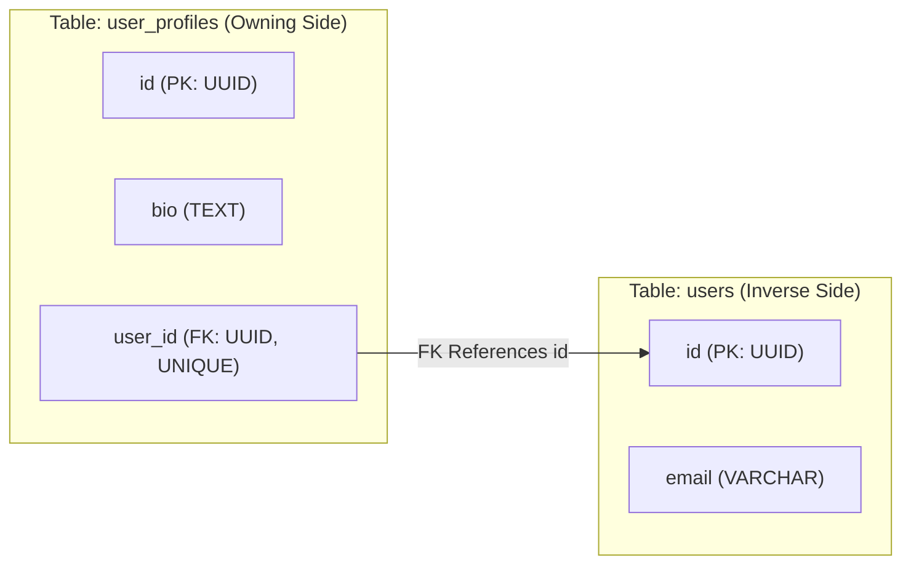
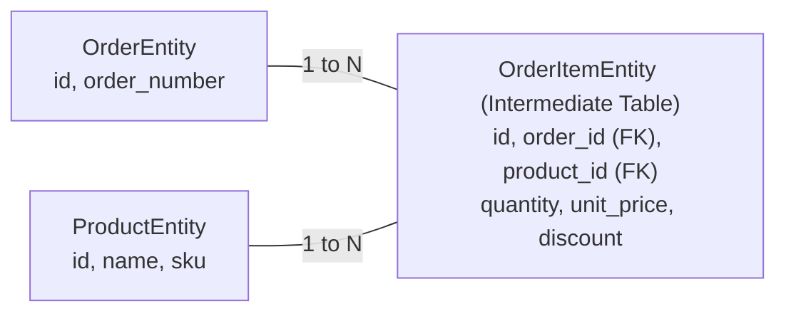
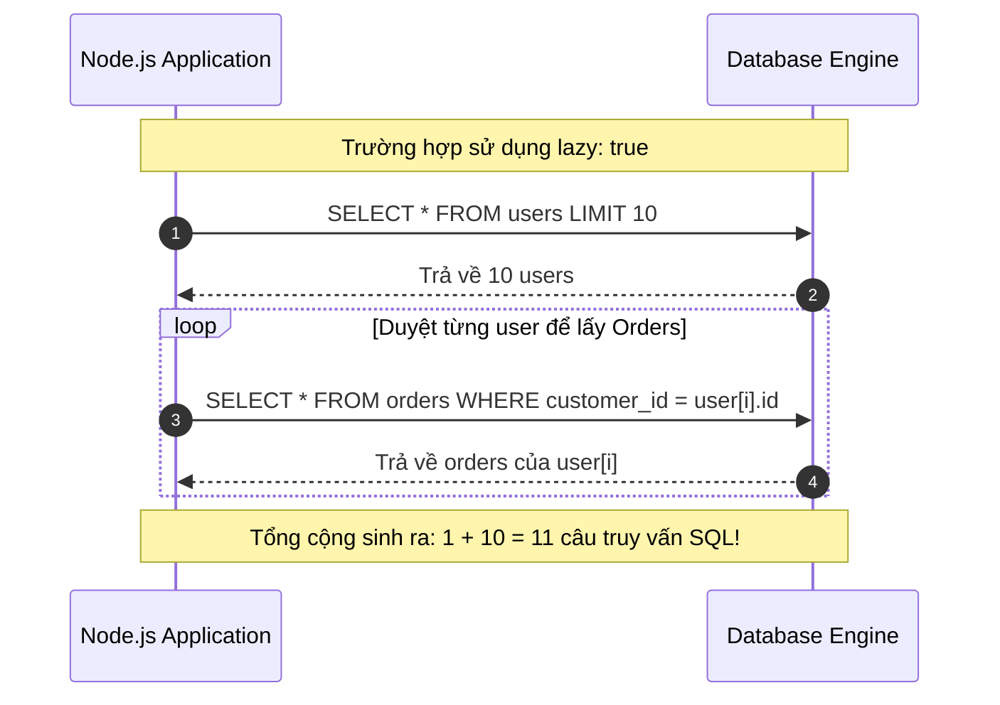

## I. KHÁI QUÁT (OVERVIEW)

Trong các hệ thống Cơ sở dữ liệu quan hệ (RDBMS), dữ liệu giữa các bảng được liên kết chặt chẽ thông qua các cơ chế **Khóa ngoại (Foreign Key - FK)** và **Bảng trung gian (Junction/Pivot Table)**. 

**TypeORM** cung cấp một hệ thống Decorators quan hệ mạnh mẽ, mô hình hóa 4 loại quan hệ kinh điển trong lập trình hướng đối tượng:
1. **One-to-One (1 - 1):** Một thực thể A liên kết duy nhất với một thực thể B (ví dụ: `User` $\leftrightarrow$ `UserProfile`).
2. **Many-to-One / One-to-Many (N - 1 / 1 - N):** Nhiều thực thể A thuộc về một thực thể B, và một thực thể B sở hữu nhiều thực thể A (ví dụ: `Order` $\rightarrow$ `User`, `User` $\rightarrow$ `Order[]`).
3. **Many-to-Many (N - N):** Nhiều thực thể A liên kết với nhiều thực thể B thông qua một bảng liên kết (ví dụ: `User` $\leftrightarrow$ `Role`, `Post` $\leftrightarrow$ `Tag`).



---

## II. CHI TIẾT KỸ THUẬT

### 1. Nguyên lý Owning Side (Bên Sở Hữu) vs Inverse Side (Bên Nghịch Đảo)

Hiểu rõ **Owning Side** và **Inverse Side** là yếu tố quan trọng nhất để tránh các lỗi logic quan hệ trong TypeORM:

* **Owning Side:** Là phía trực tiếp giữ thông tin quan hệ vật lý trong Database.
  * Trong quan hệ **One-to-One**: Phía chứa cột Foreign Key là Owning Side (phải khai báo `@JoinColumn()`).
  * Trong quan hệ **Many-to-One / One-to-Many**: Phía `@ManyToOne` **luôn luôn là Owning Side** vì cột Foreign Key luôn nằm trong bảng chứa dữ liệu "Nhiều". (Không cần `@JoinColumn()` trừ khi muốn đổi tên cột).
  * Trong quan hệ **Many-to-Many**: Phía nào khai báo `@JoinTable()` sẽ là Owning Side chịu trách nhiệm quản lý bảng liên kết trung gian.
* **Inverse Side:** Là phía đối ngẫu, chỉ đóng vai trò tham chiếu ngược lại để ORM có thể nạp dữ liệu hai chiều.



---

### 2. Cú pháp & Tùy chọn của Các Decorator Quan Hệ

#### a. `@OneToOne()` & `@JoinColumn()`

```typescript
@OneToOne(() => TargetEntity, (target) => target.inverseProperty, options?: RelationOptions)
@JoinColumn(options?: JoinColumnOptions)
```

* `TargetEntity`: Hàm trả về Class của Entity đích (dùng hàm mũi tên `() => UserProfile` để giải quyết Circular Dependency).
* `inverseProperty`: Thuộc tính đối ngẫu ở Entity đích.
* `@JoinColumn(options)`:
  * `name`: Tên cột Foreign Key trong DB (mặc định là `targetPropertyName + 'Id'`, ví dụ `profileId`).
  * `referencedColumnName`: Tên cột ở bảng đích mà FK trỏ tới (mặc định là `id`).

```typescript
// Owning Side
@Entity('user_profiles')
export class UserProfileEntity {
  @PrimaryGeneratedColumn('uuid')
  id: string;

  @OneToOne(() => UserEntity, (user) => user.profile, { onDelete: 'CASCADE' })
  @JoinColumn({ name: 'user_id', referencedColumnName: 'id' })
  user: UserEntity;
}

// Inverse Side
@Entity('users')
export class UserEntity {
  @PrimaryGeneratedColumn('uuid')
  id: string;

  @OneToOne(() => UserProfileEntity, (profile) => profile.user)
  profile: UserProfileEntity;
}
```

---

#### b. `@ManyToOne()` & `@OneToMany()`

* `@ManyToOne()`: Đặt ở bảng chứa Foreign Key. **Không thể thiếu decorator này trong mối quan hệ 1-N**.
* `@OneToMany()`: Đặt ở bảng cha (bảng 1), luôn trả về một mảng các thực thể `TargetEntity[]`. `@OneToMany` **bắt buộc** phải khai báo tham chiếu `inverseSide`.

```typescript
// Bảng Con (Owning Side - Chứa Foreign Key)
@Entity('orders')
export class OrderEntity {
  @PrimaryGeneratedColumn('uuid')
  id: string;

  @ManyToOne(() => UserEntity, (user) => user.orders, {
    nullable: false,
    onDelete: 'RESTRICT',
  })
  @JoinColumn({ name: 'customer_id' })
  customer: UserEntity;
}

// Bảng Cha (Inverse Side)
@Entity('users')
export class UserEntity {
  @PrimaryGeneratedColumn('uuid')
  id: string;

  @OneToMany(() => OrderEntity, (order) => order.customer, {
    cascade: ['insert', 'update'],
  })
  orders: OrderEntity[];
}
```

---

#### c. `@ManyToMany()` & `@JoinTable()`

Decorator `@ManyToMany()` tạo mối quan hệ Nhiều - Nhiều. Phía Owning Side **bắt buộc phải có `@JoinTable()`**.

```typescript
@JoinTable(options?: JoinTableOptions)
```
* `name`: Tên bảng trung gian (Junction Table).
* `joinColumn`: Cấu hình cột khóa ngoại trỏ về Entity hiện tại (`name`, `referencedColumnName`).
* `inverseJoinColumn`: Cấu hình cột khóa ngoại trỏ về Entity đích.

```typescript
// Owning Side
@Entity('users')
export class UserEntity {
  @PrimaryGeneratedColumn('uuid')
  id: string;

  @ManyToMany(() => RoleEntity, (role) => role.users, { cascade: true })
  @JoinTable({
    name: 'users_roles_map',
    joinColumn: { name: 'user_id', referencedColumnName: 'id' },
    inverseJoinColumn: { name: 'role_id', referencedColumnName: 'id' },
  })
  roles: RoleEntity[];
}

// Inverse Side
@Entity('roles')
export class RoleEntity {
  @PrimaryGeneratedColumn('uuid')
  id: string;

  @ManyToMany(() => UserEntity, (user) => user.roles)
  users: UserEntity[];
}
```

---

### 3. Thiết kế Bảng Trung Gian Mở Rộng (Junction Entity with Custom Attributes)

> [!IMPORTANT]
> Khi bảng trung gian cần lưu trữ thêm các cột dữ liệu nghiệp vụ (ví dụ: `quantity`, `unit_price`, `enrolled_at`, `status`), bạn **KHÔNG ĐƯỢC** dùng `@ManyToMany()` thuần túy. 
> Bắt buộc phải tách bảng trung gian thành một **Explicit Entity** kết hợp với hai cặp `@ManyToOne` / `@OneToMany`.



---

### 4. Chi tiết các Tùy chọn Quan hệ (Relation Options)

#### a. `cascade` (Lan truyền thao tác)
Cho phép tự động thực thi các hành động ghi/xóa trên các Entity liên quan khi Entity cha được lưu:
* `cascade: true`: Bật toàn bộ các cờ cascade bên dưới.
* `cascade: ['insert']`: Tự động `INSERT` các thực thể con mới khi gọi `repo.save(parent)`.
* `cascade: ['update']`: Tự động cập nhật các thay đổi của thực thể con khi lưu cha.
* `cascade: ['remove']`: Tự động xóa các bản ghi con khi cha bị xóa thông qua `repo.remove(parent)`.
* `cascade: ['soft-remove']`, `cascade: ['recover']`: Tự động đánh dấu xóa mềm / phục hồi các thực thể con.

#### b. `onDelete` & `onUpdate` (Ràng buộc toàn vẹn ở mức Database)
Xác định hành vi của Foreign Key Constraint trên Database Engine (`CASCADE`, `SET NULL`, `RESTRICT`, `NO ACTION`, `SET DEFAULT`):
* `CASCADE`: Khi bản ghi cha bị xóa trong DB, toàn bộ bản ghi con chứa FK trỏ tới nó sẽ bị DB tự động xóa theo.
* `SET NULL`: Cột Foreign Key của bản ghi con sẽ được đặt thành `NULL`.
* `RESTRICT`: DB chặn không cho phép xóa bản ghi cha nếu vẫn còn bản ghi con đang tham chiếu tới nó.
* `NO ACTION`: Tương tự `RESTRICT` nhưng việc kiểm tra ràng buộc có thể được trì hoãn đến cuối transaction (`DEFERRABLE`).

| Tiêu chí | `cascade: ['remove']` (TypeORM Level) | `onDelete: 'CASCADE'` (Database Level) |
| :--- | :--- | :--- |
| **Nơi thực thi** | Mã nguồn TypeScript / Node.js Engine | Trực tiếp trong Database Engine |
| **Kích hoạt Hook** | Kích hoạt đầy đủ `@BeforeRemove`, `@AfterRemove` | **KHÔNG** kích hoạt Listener hay Subscriber trong TypeORM |
| **Hiệu năng** | Chậm hơn (Thực thi nhiều lệnh SQL riêng lẻ) | Cực nhanh (Thực thi nội bộ trong DB bằng C engine) |
| **Độ tin cậy** | Phụ thuộc vào việc gọi qua `repo.remove()` | Tuyệt đối (Ngay cả khi chạy Raw SQL ngoài DB) |

#### c. `eager` vs `lazy` (Chiến lược tải dữ liệu)
* `eager: true`: Tự động tải quan hệ này bằng lệnh `LEFT JOIN` mỗi khi gọi `repo.find()`, `repo.findOne()`.
* `lazy: true`: Biến thuộc tính quan hệ thành một `Promise<T>`. Dữ liệu chỉ được tải từ DB khi ta gọi `await entity.relation`.

---

## III. VÍ DỤ MINH HỌA VÀ PHÂN TÍCH CODE

Dưới đây là kiến trúc dữ liệu đầy đủ cho Hệ thống Thương mại Điện tử gồm `User`, `UserProfile`, `Order`, `Product`, và Bảng trung gian chi tiết đơn hàng `OrderItem`.

### 1. Khai báo Toàn bộ Hệ Thống Entities

```typescript
import {
  Entity,
  PrimaryGeneratedColumn,
  Column,
  OneToOne,
  OneToMany,
  ManyToOne,
  JoinColumn,
  CreateDateColumn,
  UpdateDateColumn,
} from 'typeorm';

// ==========================================
// 1. USER PROFILE ENTITY (1-1 Owning Side)
// ==========================================
@Entity('user_profiles')
export class UserProfileEntity {
  @PrimaryGeneratedColumn('uuid')
  id: string;

  @Column({ type: 'varchar', length: 100, nullable: true })
  fullName: string;

  @Column({ type: 'varchar', length: 20, nullable: true })
  phoneNumber: string;

  @Column({ type: 'text', nullable: true })
  address: string;

  @OneToOne(() => UserEntity, (user) => user.profile, {
    onDelete: 'CASCADE', // Xóa User thì Profile tự động bị xóa ở DB
  })
  @JoinColumn({ name: 'user_id' }) // Owning side đặt @JoinColumn
  user: UserEntity;
}

// ==========================================
// 2. USER ENTITY (Root Aggregate)
// ==========================================
@Entity('users')
export class UserEntity {
  @PrimaryGeneratedColumn('uuid')
  id: string;

  @Column({ type: 'varchar', length: 150, unique: true })
  email: string;

  // Quan hệ 1 - 1 (Inverse side)
  @OneToOne(() => UserProfileEntity, (profile) => profile.user, {
    cascade: true, // Tự động lưu Profile khi lưu User
  })
  profile: UserProfileEntity;

  // Quan hệ 1 - N với Orders (Inverse side)
  @OneToMany(() => OrderEntity, (order) => order.customer, {
    cascade: ['insert', 'update'],
  })
  orders: OrderEntity[];
}

// ==========================================
// 3. PRODUCT ENTITY
// ==========================================
@Entity('products')
export class ProductEntity {
  @PrimaryGeneratedColumn('uuid')
  id: string;

  @Column({ type: 'varchar', length: 200 })
  name: string;

  @Column({ type: 'varchar', length: 50, unique: true })
  sku: string;

  @Column({ type: 'decimal', precision: 12, scale: 2 })
  price: number;

  @Column({ type: 'int', default: 0 })
  stockQuantity: number;

  @OneToMany(() => OrderItemEntity, (item) => item.product)
  orderItems: OrderItemEntity[];
}

// ==========================================
// 4. ORDER ENTITY (Many-to-One với User, One-to-Many với Items)
// ==========================================
@Entity('orders')
export class OrderEntity {
  @PrimaryGeneratedColumn('uuid')
  id: string;

  @Column({ name: 'order_number', type: 'varchar', length: 50, unique: true })
  orderNumber: string;

  @Column({ type: 'decimal', precision: 12, scale: 2, default: 0 })
  totalAmount: number;

  // Owning side của mối quan hệ User - Order
  @ManyToOne(() => UserEntity, (user) => user.orders, {
    nullable: false,
    onDelete: 'RESTRICT', // Không cho xóa User nếu đã phát sinh Order
  })
  @JoinColumn({ name: 'customer_id' })
  customer: UserEntity;

  // Quan hệ 1 - N với OrderItems (Cascade All)
  @OneToMany(() => OrderItemEntity, (item) => item.order, {
    cascade: true,
  })
  items: OrderItemEntity[];

  @CreateDateColumn({ name: 'created_at', type: 'timestamptz' })
  createdAt: Date;
}

// ==========================================
// 5. ORDER ITEM ENTITY (Explicit Junction Table)
// ==========================================
@Entity('order_items')
export class OrderItemEntity {
  @PrimaryGeneratedColumn('uuid')
  id: string;

  @ManyToOne(() => OrderEntity, (order) => order.items, {
    nullable: false,
    onDelete: 'CASCADE', // Xóa đơn hàng thì xóa toàn bộ items
  })
  @JoinColumn({ name: 'order_id' })
  order: OrderEntity;

  @ManyToOne(() => ProductEntity, (product) => product.orderItems, {
    nullable: false,
    onDelete: 'RESTRICT', // Không thể xóa sản phẩm khi đang nằm trong đơn hàng
  })
  @JoinColumn({ name: 'product_id' })
  product: ProductEntity;

  @Column({ type: 'int' })
  quantity: number;

  @Column({ name: 'unit_price', type: 'decimal', precision: 12, scale: 2 })
  unitPrice: number;

  @Column({ type: 'decimal', precision: 5, scale: 2, default: 0 })
  discountPercent: number;
}
```

---

### 2. Thao Tác Lưu Dữ Liệu Cascading Chuyên Sâu

```typescript
import { DataSource } from 'typeorm';
import { UserEntity, UserProfileEntity, OrderEntity, OrderItemEntity, ProductEntity } from './entities';

export async function createCompleteOrderUseCase(dataSource: DataSource) {
  const userRepo = dataSource.getRepository(UserEntity);
  const productRepo = dataSource.getRepository(ProductEntity);
  const orderRepo = dataSource.getRepository(OrderEntity);

  // 1. Tạo sản phẩm mẫu
  const product1 = productRepo.create({
    name: 'MacBook Pro M3 Max',
    sku: 'MBP-M3-001',
    price: 3499.0,
    stockQuantity: 50,
  });
  await productRepo.save(product1);

  // 2. Tạo User kèm Profile (Tận dụng cascade: true trên UserEntity)
  const newUser = userRepo.create({
    email: 'alex.developer@example.com',
    profile: {
      fullName: 'Alex Nguyen',
      phoneNumber: '+84901234567',
      address: '123 High-tech Park, District 9, HCMC',
    },
  });
  // TypeORM sẽ tự động INSERT Profile trước, lấy profile_id và INSERT User
  const savedUser = await userRepo.save(newUser);

  // 3. Tạo Đơn Hàng kèm các OrderItems (Tận dụng cascade: true trên OrderEntity)
  const order = new OrderEntity();
  order.orderNumber = `ORD-${Date.now()}`;
  order.customer = savedUser;

  const item1 = new OrderItemEntity();
  item1.product = product1;
  item1.quantity = 2;
  item1.unitPrice = product1.price;
  item1.discountPercent = 5;

  order.items = [item1];
  order.totalAmount = item1.quantity * item1.unitPrice * (1 - item1.discountPercent / 100);

  // Lưu Order: TypeORM sẽ tự động lưu cả Order và toàn bộ mảng OrderItemEntity
  const savedOrder = await orderRepo.save(order);

  console.log('Tạo đơn hàng thành công, ID:', savedOrder.id);
  return savedOrder;
}
```

---

## IV. LƯU Ý CẠM BẪY VÀ QUY TẮC CỐT LÕI

### 1. Thảm họa Hiệu năng: N+1 Query Problem với `lazy: true`



> [!CAUTION]
> Tuyệt đối hạn chế sử dụng `lazy: true` trong các API xử lý danh sách. Khi lặp qua $N$ bản ghi và truy cập thuộc tính lazy (`await user.orders`), TypeORM sẽ kích hoạt $N$ truy vấn độc lập gửi về DB, gây nghẽn Connection Pool và tê liệt hệ thống.
> * **Giải pháp chuẩn:** Luôn nạp quan hệ tường minh qua `relations: ['orders']` trong `find()` hoặc sử dụng `leftJoinAndSelect()` trong `QueryBuilder`.

---

### 2. Cạm bẫy Lỗi Vòng Lặp Vô Tận (Circular JSON Serialization)

Khi hai Entity liên kết 2 chiều (ví dụ `User` trỏ tới `Profile`, và `Profile` trỏ ngược lại `User`), khi serialize thành JSON qua `JSON.stringify(user)` hoặc trả về HTTP Response trong Express/NestJS, ứng dụng sẽ bị crash ngay lập tức với lỗi:
`TypeError: Converting circular structure to JSON`

```typescript
// Giải pháp 1: Sử dụng class-transformer @Exclude() trong NestJS DTOs
// Giải pháp 2: Chỉ nạp quan hệ 1 chiều khi query (không select profile.user)
const user = await userRepo.findOne({
  where: { id: userId },
  relations: { profile: true }, // Chỉ lấy profile, không lấy ngược lại user bên trong profile
});
```

---

### 3. Cạm bẫy Bỏ Quên `@JoinColumn()` trong Quan Hệ One-to-One

> [!WARNING]
> Trong quan hệ `@OneToOne()`, nếu bạn không khai báo `@JoinColumn()` ở bất kỳ bên nào, TypeORM sẽ **không tạo cột Foreign Key** trong cả 2 bảng Database. 
> Ngược lại, nếu bạn khai báo `@JoinColumn()` ở **cả 2 bên**, TypeORM sẽ tạo 2 cột Foreign Key chéo nhau, dẫn đến hiện tượng Deadlock khi insert dữ liệu mới.
> * **Quy tắc:** Chỉ đặt `@JoinColumn()` tại duy nhất một Entity đóng vai trò là Bên Sở Hữu (Owning Side).

---

### 4. Bảng So Sánh Toàn Diện Các Chiến Lược Nạp Dữ Liệu Quan Hệ

| Phương thức | Cơ chế Truy vấn | Ưu điểm | Nhược điểm & Rủi ro | Ngữ cảnh Phù hợp |
| :--- | :--- | :--- | :--- | :--- |
| **`relations: [...]` (Find Options)** | Thực hiện `LEFT JOIN` tự động | Ngắn gọn, an toàn, dễ bảo trì | Khó tùy biến điều kiện lọc trên bảng liên kết | Đọc dữ liệu CRUD cơ bản |
| **`leftJoinAndSelect()` (QueryBuilder)** | Sinh câu lệnh `LEFT JOIN` tùy chỉnh | Kiểm soát tuyệt đối mệnh đề `ON`, `WHERE`, `ORDER BY` | Phải viết alias chuỗi, code dài hơn | Báo cáo, danh sách phân trang phức tạp |
| **`eager: true` (Decorator)** | Luôn tự động JOIN trong mọi hàm `find()` | Tiện lợi, không cần khai báo `relations` khi gọi | Dễ gây overfetching dữ liệu khổng lồ không cần thiết | Bảng từ điển danh mục nhỏ (vd: `Country`, `Currency`) |
| **`lazy: true` (Promise-based)** | Truy vấn riêng lẻ khi `await` thuộc tính | Chỉ tốn tài nguyên khi thực sự cần dùng | **Rất dễ dính N+1 Query**, phá vỡ tính đồng bộ | Xử lý logic nghiệp vụ đơn lẻ theo từng bản ghi |
