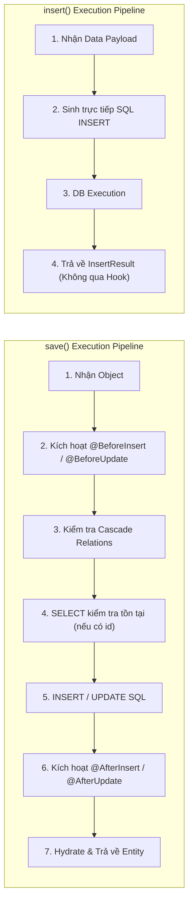

## I. KHÁI QUÁT (OVERVIEW)

Trong kiến trúc của **TypeORM**, tầng **Repository** là hiện thân tiêu biểu của mẫu thiết kế **Data Mapper Pattern**. Repository đóng vai trò như một tập hợp đối tượng trong bộ nhớ (In-memory Collection) trung gian, cô lập hoàn toàn tầng Domain/Business Logic khỏi các câu lệnh SQL vật lý.

Mỗi Entity có một Repository tương ứng được quản lý bởi `EntityManager` và `DataSource`. TypeORM chia các API trong Repository thành 3 nhóm tác vụ chính:
1. **Nhóm Truy Vấn (Read API):** Đọc dữ liệu từ DB và chuyển đổi (hydrate) thành các thực thể TypeScript Class.
2. **Nhóm Ghi có Quản Lý Vòng Đời (Lifecycle-aware / Hook-enabled Mutations):** `save()`, `remove()`, `softRemove()`, `recover()` – Tự động kích hoạt Cascading, Dirty Checking, Entity Listeners & Subscribers, và Optimistic Locking.
3. **Nhóm Ghi Trực Tiếp Tốc Độ Cao (Direct Raw Mutations):** `insert()`, `update()`, `delete()`, `softDelete()`, `restore()`, `upsert()` – Bỏ qua toàn bộ Entity Hooks và Cascading, sinh trực tiếp một câu lệnh SQL duy nhất xuống Database để đạt hiệu năng tối đa.

```mermaid
flowchart TD
    subgraph RepoAPI["TYPEORM REPOSITORY API"]
        direction TB
        ReadGroup["1. READ OPERATIONS<br/>• find(), findBy()<br/>• findOne(), findOneBy()<br/>• findAndCount()<br/>• count(), exists()"]
        LifecycleGroup["2. LIFECYCLE MUTATIONS (Hooks + Cascade)<br/>• save()<br/>• remove()<br/>• softRemove(), recover()<br/>(Chậm hơn, bảo vệ toàn vẹn cao)"]
        RawGroup["3. DIRECT RAW MUTATIONS (Bypass Hooks)<br/>• insert(), update(), delete()<br/>• softDelete(), restore()<br/>• upsert()<br/>(Hiệu năng cực cao, 1 SQL duy nhất)"]
    end

    subgraph DecisionNode{"Quyết định sử dụng"}
        NeedHooks["Cần kích hoạt @BeforeInsert / Hash mật khẩu / Cascade?"]
        NeedSpeed["Batch 10,000 items / Cập nhật nhanh không cần load Entity?"]
    end

    RepoAPI --> DecisionNode
    DecisionNode -->|"CÓ"| LifecycleGroup
    DecisionNode -->|"CẦN TỐC ĐỘ / BULK"| RawGroup
```

---

## II. CHI TIẾT KỸ THUẬT

### 1. Chi Tiết Các Phương Thức Đọc (Read Operations)

```typescript
// Khởi tạo Repository từ DataSource
const userRepository = dataSource.getRepository(UserEntity);
```

#### a. Danh sách các hàm tìm kiếm chính:
* `find(options?: FindManyOptions<Entity>): Promise<Entity[]>`: Tìm kiếm danh sách thực thể thỏa mãn điều kiện phức tạp.
* `findBy(where: FindOptionsWhere<Entity>): Promise<Entity[]>`: Cú pháp rút gọn khi chỉ cần truyền điều kiện `where`.
* `findOne(options: FindOneOptions<Entity>): Promise<Entity | null>`: Tìm bản ghi đầu tiên khớp điều kiện, trả về `null` nếu không tìm thấy.
* `findOneBy(where: FindOptionsWhere<Entity>): Promise<Entity | null>`: Rút gọn của `findOne({ where })`.
* `findOneOrFail(options: FindOneOptions<Entity>): Promise<Entity>`: Tương tự `findOne`, nhưng ném ra ngoại lệ `EntityNotFoundError` nếu không có bản ghi (rất hữu ích trong Clean Architecture để Controller/Filter tự động trả về HTTP 404).
* `findAndCount(options?: FindManyOptions<Entity>): Promise<[Entity[], number]>`: Trả về một tuple gồm danh sách bản ghi và tổng số lượng bản ghi thỏa mãn điều kiện (phục vụ phân trang).
* `count(options?: FindManyOptions<Entity>): Promise<number>`: Đếm tổng số bản ghi thỏa điều kiện.
* `exists(options?: FindManyOptions<Entity>): Promise<boolean>`: Kiểm tra sự tồn tại của bản ghi (sinh câu lệnh `SELECT 1 FROM table WHERE ... LIMIT 1`).

---

### 2. So Sánh Chuyên Sâu: Entity Methods vs Raw Mutation Methods



#### Bảng so sánh chi tiết giữa hai trường phái:

| Tiêu chí | `save()` / `remove()` / `softRemove()` | `insert()` / `update()` / `delete()` / `softDelete()` |
| :--- | :--- | :--- |
| **Cơ chế hoạt động** | Quản lý vòng đời thực thể (Lifecycle Management) | Thực thi lệnh SQL trực tiếp (Direct Execution) |
| **Kích hoạt Hooks** | **CÓ** (`@BeforeInsert`, `@AfterUpdate`, Subscribers) | **KHÔNG** (Bỏ qua hoàn toàn mọi Listeners/Subscribers) |
| **Cascade Persistence** | **CÓ** (Tự động insert/update các quan hệ con) | **KHÔNG** (Chỉ tác động duy nhất bảng chỉ định) |
| **Optimistic Locking** | **CÓ** (Tự tăng và kiểm tra `@VersionColumn`) | **KHÔNG** (Phải tự viết logic tăng version nếu muốn) |
| **Số lượng Query SQL** | Thường tốn $1 \rightarrow N$ queries (SELECT trước khi UPDATE) | Duy nhất $1$ câu query SQL (`INSERT INTO...`, `UPDATE...`) |
| **Giá trị trả về** | Instance Entity hoàn chỉnh sau khi lưu | Đối tượng kết quả: `InsertResult`, `UpdateResult`, `DeleteResult` |
| **Hiệu năng Bulk Data** | Kém khi lưu hàng ngàn bản ghi cùng lúc | **Cực nhanh** (Thích hợp cho ETL, Seeding, Batch update) |

---

### 3. Phương Thức `upsert()` (Insert or Update on Conflict)

Phương thức `upsert()` cho phép thêm mới bản ghi nếu chưa tồn tại, hoặc cập nhật nếu bị trùng khóa chính / khóa duy nhất (tương ứng với `INSERT ... ON CONFLICT DO UPDATE` trong PostgreSQL hoặc `ON DUPLICATE KEY UPDATE` trong MySQL).

```typescript
await userRepository.upsert(
  [
    { email: 'john@example.com', name: 'John Doe', age: 30 },
    { email: 'jane@example.com', name: 'Jane Doe', age: 25 },
  ],
  {
    conflictPaths: ['email'], // Cột có ràng buộc UNIQUE hoặc PRIMARY KEY
    skipUpdateIfNoValuesChanged: true, // Bỏ qua nếu dữ liệu không đổi
    upsertType: 'on-conflict-do-update',
  }
);
```

---

### 4. Chi Tiết Các Find Options Nâng Cao

#### a. Cấu hình Cột (`select`) và Nạp Quan Hệ (`relations`)

```typescript
const users = await userRepo.find({
  select: {
    id: true,
    email: true,
    profile: {
      fullName: true,
    },
  },
  relations: {
    profile: true,
    orders: true,
  },
});
```

#### b. Logic Điều Kiện Tìm Kiếm (`where`): AND vs OR

* **Điều kiện AND:** Khai báo các thuộc tính trong cùng một Object.
* **Điều kiện OR:** Khai báo một **Mảng các Object** `[ { ... }, { ... } ]`.

```typescript
// WHERE (status = 'ACTIVE' AND age >= 18) OR (role = 'ADMIN')
const results = await userRepo.find({
  where: [
    { status: 'ACTIVE', age: MoreThanOrEqual(18) }, // Điều kiện 1
    { role: 'ADMIN' },                              // Điều kiện 2 (OR)
  ],
});
```

#### c. Toàn bộ Hệ thống Toán tử Tìm Kiếm (Find Operators)

TypeORM cung cấp các helper functions chuyên biệt để tạo điều kiện SQL chuẩn xác:

| Find Operator | Cú pháp Ví dụ | Câu SQL Tương Đương |
| :--- | :--- | :--- |
| `Equal(val)` | `Equal('ACTIVE')` | `= 'ACTIVE'` |
| `Not(val)` | `Not(Equal('DELETED'))` | `!= 'DELETED'` |
| `LessThan(val)` | `LessThan(100)` | `< 100` |
| `LessThanOrEqual(val)` | `LessThanOrEqual(100)` | `<= 100` |
| `MoreThan(val)` | `MoreThan(50)` | `> 50` |
| `MoreThanOrEqual(val)` | `MoreThanOrEqual(50)` | `>= 50` |
| `Between(from, to)` | `Between(10, 50)` | `BETWEEN 10 AND 50` |
| `In(array)` | `In(['ADMIN', 'MODERATOR'])` | `IN ('ADMIN', 'MODERATOR')` |
| `Like(pattern)` | `Like('%nestjs%')` | `LIKE '%nestjs%'` (Phân biệt hoa thường) |
| `ILike(pattern)` | `ILike('%nestjs%')` | `ILIKE '%nestjs%'` (PostgreSQL - Không phân biệt hoa thường) |
| `IsNull()` | `IsNull()` | `IS NULL` |
| `ArrayContains(val)` | `ArrayContains(['typescript'])` | `@> ARRAY['typescript']` (PostgreSQL) |
| `ArrayContainedBy(val)`| `ArrayContainedBy(['a', 'b'])` | `<@ ARRAY['a', 'b']` (PostgreSQL) |
| `ArrayOverlap(val)` | `ArrayOverlap(['node', 'go'])` | `&& ARRAY['node', 'go']` (PostgreSQL) |
| `Raw(sqlFn)` | `Raw(alias => \`LOWER(${alias}) = :query\`, { query: 'test' })` | Cho phép nhúng hàm SQL Native an toàn tham số |

#### d. Khóa Bi Quan (Pessimistic Locking trong Repository)

TypeORM cho phép khóa dòng dữ liệu trực tiếp trong `findOne`:
* `pessimistic_read`: Sinh `FOR SHARE` (ngăn transaction khác ghi, cho phép đọc).
* `pessimistic_write`: Sinh `FOR UPDATE` (ngăn mọi transaction khác đọc để ghi hoặc sửa đổi).

```typescript
const account = await bankRepo.findOne({
  where: { id: accountId },
  lock: { mode: 'pessimistic_write' }, // SELECT ... FOR UPDATE
});
```

---

## III. VÍ DỤ MINH HỌA VÀ PHÂN TÍCH CODE

Dưới đây là một dịch vụ thương mại điện tử thực tế (`OrderProcessingService`), thể hiện đầy đủ các kỹ thuật: Tìm kiếm nâng cao với Find Operators, Phân trang, Bulk Upsert 10,000 bản ghi, và Pessimistic Locking xử lý thanh toán trừ kho.

```typescript
import {
  DataSource,
  Repository,
  Between,
  In,
  ILike,
  IsNull,
  MoreThan,
  Raw,
  ArrayContains,
} from 'typeorm';
import { OrderEntity, OrderStatus } from './entities/order.entity';
import { ProductEntity } from './entities/product.entity';
import { InventoryLogEntity } from './entities/inventory-log.entity';

export class OrderProcessingService {
  private readonly orderRepo: Repository<OrderEntity>;
  private readonly productRepo: Repository<ProductEntity>;
  private readonly logRepo: Repository<InventoryLogEntity>;

  constructor(private readonly dataSource: DataSource) {
    this.orderRepo = dataSource.getRepository(OrderEntity);
    this.productRepo = dataSource.getRepository(ProductEntity);
    this.logRepo = dataSource.getRepository(InventoryLogEntity);
  }

  // 1. TÌM KIẾM NÂNG CAO VỚI FIND OPERATORS & PHÂN TRANG
  async searchOrdersAdvanced(filter: {
    keyword?: string;
    statuses?: OrderStatus[];
    minTotal?: number;
    maxTotal?: number;
    startDate?: Date;
    endDate?: Date;
    tag?: string;
    page: number;
    limit: number;
  }) {
    const { keyword, statuses, minTotal, maxTotal, startDate, endDate, tag, page, limit } = filter;

    const skip = (page - 1) * limit;

    const [orders, total] = await this.orderRepo.findAndCount({
      where: {
        // Tìm kiếm không phân biệt hoa thường theo mã đơn
        ...(keyword && { orderNumber: ILike(`%${keyword}%`) }),
        // Lọc theo tập hợp trạng thái IN (...)
        ...(statuses && statuses.length > 0 && { status: In(statuses) }),
        // Lọc khoảng giá trị BETWEEN ... AND ...
        ...(minTotal !== undefined && maxTotal !== undefined && {
          totalAmount: Between(minTotal, maxTotal),
        }),
        // Lọc theo khoảng ngày tạo
        ...(startDate && endDate && {
          createdAt: Between(startDate, endDate),
        }),
        // Lọc mảng tags PostgreSQL (@> ARRAY['electronics'])
        ...(tag && {
          tags: ArrayContains([tag]),
        }),
        // Chỉ lấy đơn hàng chưa bị xóa mềm
        deletedAt: IsNull(),
      },
      relations: {
        customer: true,
        items: {
          product: true,
        },
      },
      order: {
        createdAt: 'DESC',
      },
      skip: skip,
      take: limit,
      // Bật Query Cache trong 30 giây cho truy vấn này
      cache: {
        id: `orders_search_page_${page}_limit_${limit}`,
        milliseconds: 30000,
      },
    });

    return {
      data: orders,
      pagination: {
        total,
        page,
        limit,
        totalPages: Math.ceil(total / limit),
      },
    };
  }

  // 2. XỬ LÝ THANH TOÁN TRỪ KHO VỚI PESSIMISTIC LOCKING
  async processPaymentAndDeductStock(orderId: string, paymentAmount: number) {
    // Bắt buộc thực thi trong Transaction
    return await this.dataSource.transaction(async (manager) => {
      const txOrderRepo = manager.getRepository(OrderEntity);
      const txProductRepo = manager.getRepository(ProductEntity);

      // Bước 1: Khóa bi quan bản ghi Order để tránh concurrent webhook callbacks
      const order = await txOrderRepo.findOne({
        where: { id: orderId, status: OrderStatus.PENDING },
        relations: { items: { product: true } },
        lock: { mode: 'pessimistic_write' }, // SELECT ... FOR UPDATE
      });

      if (!order) {
        throw new Error('Đơn hàng không tồn tại hoặc đã được xử lý!');
      }

      if (order.totalAmount !== paymentAmount) {
        throw new Error('Số tiền thanh toán không khớp!');
      }

      // Bước 2: Khóa và trừ tồn kho từng sản phẩm
      for (const item of order.items) {
        const product = await txProductRepo.findOne({
          where: { id: item.product.id },
          lock: { mode: 'pessimistic_write' }, // SELECT ... FOR UPDATE
        });

        if (!product || product.stockQuantity < item.quantity) {
          throw new Error(`Sản phẩm ${item.product.name} đã hết hàng trong kho!`);
        }

        // Cập nhật tồn kho nhanh bằng update()
        await txProductRepo.update(
          { id: product.id },
          { stockQuantity: product.stockQuantity - item.quantity }
        );
      }

      // Bước 3: Cập nhật trạng thái đơn hàng
      order.status = OrderStatus.PAID;
      order.paidAt = new Date();
      await txOrderRepo.save(order);

      return { success: true, orderId: order.id };
    });
  }

  // 3. BULK UPSERT HIỆU NĂNG CAO (10.000 SẢN PHẨM / ĐỒNG BỘ TỒN KHO)
  async bulkSyncProductPrices(
    items: Array<{ sku: string; name: string; price: number; stockQuantity: number }>
  ) {
    // Chia nhỏ chunk 1,000 bản ghi mỗi batch để tránh vượt quá giới hạn parameter của PostgreSQL
    const CHUNK_SIZE = 1000;
    for (let i = 0; i < items.length; i += CHUNK_SIZE) {
      const chunk = items.slice(i, i + CHUNK_SIZE);

      await this.productRepo.upsert(chunk, {
        conflictPaths: ['sku'], // Cột duy nhất kiểm tra xung đột
        skipUpdateIfNoValuesChanged: true,
      });
    }

    console.log(`Đã đồng bộ thành công ${items.length} sản phẩm.`);
  }

  // 4. SOFT DELETE VÀ RESTORE
  async cancelAndSoftDeleteOrder(orderId: string) {
    // softDelete chạy nhanh 1 lệnh UPDATE orders SET deleted_at = NOW() WHERE id = :orderId
    const result = await this.orderRepo.softDelete(orderId);
    return result.affected ? true : false;
  }

  async restoreCancelledOrder(orderId: string) {
    // Khôi phục lại bản ghi đã soft-delete (deleted_at = NULL)
    const result = await this.orderRepo.restore(orderId);
    return result.affected ? true : false;
  }
}
```

---

## IV. LƯU Ý CẠM BẪY VÀ QUY TẮC CỐT LÕI

### 1. Cạm bẫy Gọi `save()` với Object Một Phần (Partial Object)

```typescript
// NGUY HIỂM: Ghi đè hoặc sinh SELECT thừa
const partialUser = { id: 'uuid-1', name: 'New Name' }; // Không có trường email, role
await userRepo.save(partialUser);
```

> [!CAUTION]
> Khi gọi `save(partialObject)`:
> 1. TypeORM sẽ thực thi một câu lệnh `SELECT` để nạp toàn bộ entity cũ lên bộ nhớ, hợp nhất (merge) các trường rồi mới chạy `UPDATE`. Điều này gây lãng phí 1 query `SELECT` không cần thiết.
> 2. Nếu bạn dùng plain object mà không load trước, các trường có transformer hoặc logic dirty check có thể hoạt động sai.
> * **Giải pháp chuẩn:** Khi chỉ cần cập nhật một vài cột mà không cần chạy hooks, hãy dùng `update({ id }, { name: 'New Name' })`.

---

### 2. Cạm bẫy Hiệu Năng: Phân Biệt `remove()` vs `delete()`

```typescript
// Cách 1: remove() - Chậm, tốn bộ nhớ
const users = await userRepo.find({ where: { status: 'INACTIVE' } }); // Load 10,000 entities vào RAM
await userRepo.remove(users); // Chạy 10,000 câu lệnh DELETE riêng lẻ!

// Cách 2: delete() - Cực nhanh, 1 câu SQL duy nhất
await userRepo.delete({ status: 'INACTIVE' }); // DELETE FROM users WHERE status = 'INACTIVE';
```

> [!IMPORTANT]
> * Sử dụng `remove()` khi: Cần kích hoạt `@BeforeRemove`, `@AfterRemove`, Subscribers hoặc cần cơ chế `cascade: ['remove']` để xóa dữ liệu cha-con trong Node.js.
> * Sử dụng `delete()` khi: Xóa hàng loạt, tối ưu hiệu năng, hoặc khi DB đã có sẵn ràng buộc `ON DELETE CASCADE`.

---

### 3. Cạm bẫy với Find Operator `Raw()` và Nguy Cơ SQL Injection

```typescript
// SAI - LỖ HỔNG BẢO MẬT SQL INJECTION:
const userInput = "admin' OR 1=1 --";
await userRepo.find({
  where: {
    username: Raw(alias => `${alias} = '${userInput}'`) // NGUY HIỂM!
  }
});

// ĐÚNG - SỬ DỤNG PARAMETER BINDINGS:
await userRepo.find({
  where: {
    username: Raw(alias => `${alias} = :input`, { input: userInput }) // AN TOÀN TUYỆT ĐỐI
  }
});
```

---

### 4. Bảng Tra Cứu Toàn Diện Lựa Chọn Phương Thức Ghi Dữ Liệu

| Thao Tác Nghiệp Vụ | Phương Thức Khuyến Nghị | Lý Do Kỹ Thuật |
| :--- | :--- | :--- |
| **Đăng ký tài khoản mới** | `repository.save(user)` | Cần kích hoạt `@BeforeInsert` để băm mật khẩu (Bcrypt) và lưu `UserProfile` qua cascade. |
| **Cập nhật Profile người dùng** | `repository.update(id, dto)` | Bỏ qua hooks, cập nhật trực tiếp chỉ các cột thay đổi với 1 câu lệnh `UPDATE`. |
| **Import 50.000 sản phẩm từ Excel**| `repository.insert(chunks)` hoặc `upsert()` | Chạy theo từng Batch 1.000 dòng, đạt tốc độ hàng chục ngàn dòng/giây. |
| **Thanh toán trừ tiền ví** | `repository.save(wallet)` kết hợp `lock: { mode: 'pessimistic_write' }` | Đảm bảo tính toán đúng số dư và bảo vệ bằng khóa bi quan chống Race Condition. |
| **Xóa mềm tài khoản** | `repository.softDelete(userId)` | Cập nhật `deleted_at = NOW()` nhanh chóng mà không cần tốn công load Entity lên RAM. |
