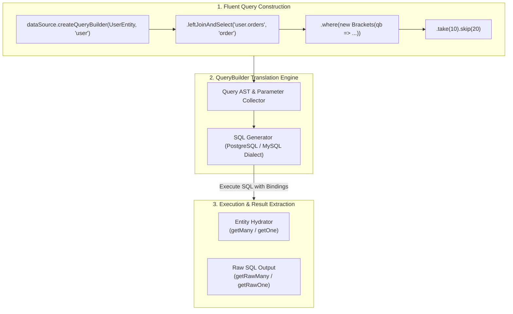
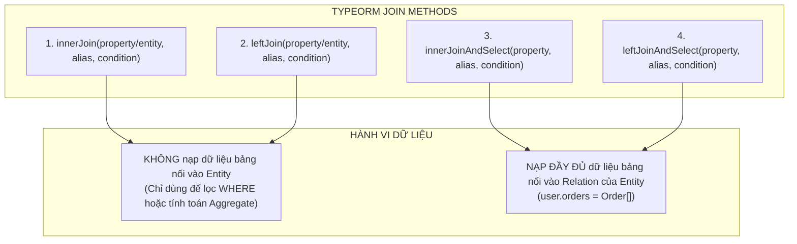
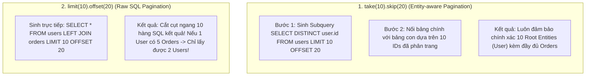

## I. KHÁI QUÁT (OVERVIEW)

**TypeORM QueryBuilder** là công cụ xây dựng truy vấn hướng đối tượng theo phong cách **Fluent Interface (Method Chaining)** mạnh mẽ và linh hoạt nhất trong hệ sinh thái TypeORM.

Trong khi `Repository Find Options` (`find()`, `findOne()`) chỉ đáp ứng tốt các câu truy vấn CRUD cơ bản, **QueryBuilder** được thiết kế để giải quyết toàn bộ các kịch bản tương tác dữ liệu phức tạp trong thực tế:
1. **Phép Nối Đa Dạng (Complex Joins):** Nối nhiều bảng có điều kiện tùy biến sâu, hỗ trợ cả nối bảng liên kết quan hệ và nối các bảng độc lập tùy ý.
2. **Tổng Hợp & Phân Nhóm (Aggregations):** Thực thi các hàm tính toán `COUNT()`, `SUM()`, `AVG()`, `MIN()`, `MAX()` kết hợp `GROUP BY` và `HAVING`.
3. **Mệnh Đề Điều Kiện Động & Phức Tạp:** Xây dựng các khối điều kiện lồng nhau (Nested Boolean Logic) với `Brackets` và `NotBrackets`.
4. **Truy Vấn Con (Subqueries) & CTE (Common Table Expressions):** Nhúng truy vấn lồng nhau vào `SELECT`, `FROM`, hoặc `WHERE`.
5. **Kiểm Soát Tinh Vi Quá Trình Hydration:** Cho phép lập trình viên lựa chọn lấy về Thực thể Class hoàn chỉnh (`getMany()`, `getOne()`) hoặc Dữ liệu thô hiệu năng cao (`getRawMany()`, `getRawOne()`).



---

## II. CHI TIẾT KỸ THUẬT

### 1. Chọn Cột & Phép Nối Bảng (Select & Joins)

#### a. `select()` vs `addSelect()`
* `select(selection, selectionAlias)`: Xác định danh sách các cột cần lấy. **Lưu ý:** Nếu gọi `select()` lần thứ hai, nó sẽ **ghi đè hoàn toàn** danh sách cột đã khai báo trước đó.
* `addSelect(selection, selectionAlias)`: Bổ sung thêm cột vào danh sách `SELECT` hiện tại (thường dùng để lấy thêm các cột có `select: false` hoặc các cột tính toán aggregate).

```typescript
const qb = dataSource.getRepository(UserEntity).createQueryBuilder('user')
  .select(['user.id', 'user.email']) // Chỉ lấy id, email
  .addSelect('user.passwordHash')    // Lấy thêm passwordHash (vốn có select: false)
  .addSelect('COUNT(orders.id)', 'orderCount'); // Thêm cột tính toán
```

---

#### b. Phân Biệt 4 Phương Thức JOIN Cốt Lõi

TypeORM cung cấp 4 phương thức nối bảng với các mục đích chuyên biệt:



| Phương thức | Loại SQL JOIN | Cơ Chế Hydrate Dữ Liệu | Mục Đích Sử Dụng |
| :--- | :--- | :--- | :--- |
| `innerJoin()` | `INNER JOIN` | **KHÔNG** lấy cột của bảng nối | Lọc bản ghi chính dựa trên điều kiện của bảng phụ mà không cần nạp dữ liệu bảng phụ lên RAM. |
| `leftJoin()` | `LEFT JOIN` | **KHÔNG** lấy cột của bảng nối | Nối bảng để thực hiện `GROUP BY`, tính tổng hoặc đếm số lượng bản ghi phụ. |
| `innerJoinAndSelect()` | `INNER JOIN` | **CÓ** nạp vào thuộc tính quan hệ | Lấy bản ghi cha kèm toàn bộ danh sách con (loại bỏ cha nếu không có con). |
| `leftJoinAndSelect()` | `LEFT JOIN` | **CÓ** nạp vào thuộc tính quan hệ | Lấy bản ghi cha kèm toàn bộ danh sách con (giữ nguyên cha dù con rỗng - phổ biến nhất). |

---

### 2. Lọc Điều Kiện Nâng Cao: `where`, `andWhere`, `orWhere`, `Brackets`

#### a. Quy tắc nối điều kiện
* `where(condition, parameters)`: Thiết lập điều kiện `WHERE` ban đầu. **Nếu gọi `.where()` lần thứ 2, toàn bộ điều kiện `WHERE` trước đó sẽ bị xóa sạch và ghi đè**.
* `andWhere(condition, parameters)`: Nối thêm điều kiện bằng toán tử logic `AND`.
* `orWhere(condition, parameters)`: Nối thêm điều kiện bằng toán tử logic `OR`.

#### b. Xử lý Logic Phức Tạp với `Brackets` và `NotBrackets`
Trong SQL, độ ưu tiên của toán tử `AND` cao hơn `OR`. Để tạo biểu thức điều kiện có dấu ngoặc đơn:
$$\text{WHERE status} = 'ACTIVE' \text{ AND (email LIKE }\%kw\% \text{ OR full\_name LIKE }\%kw\%) $$
Ta bắt buộc phải sử dụng class `Brackets`:

```typescript
import { Brackets } from 'typeorm';

qb.where('user.status = :status', { status: 'ACTIVE' })
  .andWhere(
    new Brackets((subQb) => {
      subQb
        .where('user.email ILIKE :kw', { kw: `%${keyword}%` })
        .orWhere('profile.fullName ILIKE :kw', { kw: `%${keyword}%` });
    })
  );
```

---

### 3. Phân Trang: `take()` / `skip()` vs `limit()` / `offset()`

Đây là một trong những điểm khác biệt kỹ thuật quan trọng nhất trong TypeORM:



> [!IMPORTANT]
> * **Luôn dùng `take()` và `skip()`** khi truy vấn Entity có kèm theo `leftJoinAndSelect` hoặc `innerJoinAndSelect` các quan hệ Một-Nhiều (`OneToMany`) hoặc Nhiều-Nhiều (`ManyToMany`).
> * **Chỉ dùng `limit()` và `offset()`** khi truy vấn dữ liệu thô (`getRawMany()`, `getRawOne()`) hoặc khi câu truy vấn hoàn toàn không có phép nối bảng Một-Nhiều.

---

### 4. Tham Số Hóa An Toàn (Parameterized Queries)

Tuyệt đối không bao giờ nối chuỗi trực tiếp (`string interpolation`) vào mệnh đề SQL. Luôn sử dụng cú pháp tham số hóa `:paramName` để phòng chống triệt để **SQL Injection**.

```typescript
// NGUY HIỂM: SQL Injection Vulnerability
qb.where(`user.name = '${userInput}'`); 

// AN TOÀN TUYỆT ĐỐI:
qb.where('user.name = :name', { name: userInput });
// Hoặc gán tham số hàng loạt:
qb.setParameters({
  name: userInput,
  minAge: 18,
  status: 'ACTIVE',
});
```

---

### 5. Các Phương Thức Thực Thi & Trích Xuất Dữ Liệu

| Phương thức | Dữ liệu trả về | Mô tả chi tiết |
| :--- | :--- | :--- |
| `getMany()` | `Promise<Entity[]>` | Nạp và cấu trúc hóa toàn bộ kết quả thành mảng các thực thể Entity Class kèm các quan hệ. |
| `getOne()` | `Promise<Entity \| null>` | Trả về Entity đầu tiên hoặc `null` nếu không tìm thấy. |
| `getOneOrFail()` | `Promise<Entity>` | Trả về Entity đầu tiên, tự động ném ngoại lệ `EntityNotFoundError` nếu rỗng. |
| `getManyAndCount()` | `Promise<[Entity[], number]>` | Trả về một tuple gồm danh sách Entities sau khi phân trang và tổng số lượng bản ghi thỏa mãn điều kiện lọc. |
| `getCount()` | `Promise<number>` | Đếm tổng số bản ghi thỏa điều kiện. |
| `getRawMany<T>()` | `Promise<T[]>` | Trả về mảng Plain JavaScript Object nguyên bản từ Database driver (không qua hydration, cực nhanh). |
| `getRawOne<T>()` | `Promise<T \| null>` | Trả về một Plain JavaScript Object đơn lẻ chứa các trường thô / cột tính toán Aggregate. |
| `execute()` | `Promise<any>` | Thực thi câu lệnh `INSERT`, `UPDATE`, `DELETE` dạng QueryBuilder và trả về kết quả tác động. |

---

## III. VÍ DỤ MINH HỌA VÀ PHÂN TÍCH CODE

Dưới đây là ví dụ triển khai một API Báo Cáo Phân Tích Khách Hàng Doanh Nghiệp & Doanh Số Bán Hàng phức tạp (`CustomerAnalyticsReportService`), kết hợp toàn bộ kỹ thuật nâng cao: `leftJoinAndSelect`, `innerJoin`, `Brackets`, `groupBy`, `having`, `addOrderBy`, `take/skip`, `Subquery`, và `getRawMany`.

### 1. Báo Cáo Doanh Thu Khách Hàng (Aggregation & Group By với Raw Data)

```typescript
import { DataSource, Brackets } from 'typeorm';
import { UserEntity } from './entities/user.entity';
import { OrderStatus } from './entities/order.entity';

export interface CustomerRevenueReportDTO {
  customerId: string;
  customerEmail: string;
  fullName: string;
  totalOrders: number;
  totalSpent: number;
  averageOrderValue: number;
  lastOrderDate: Date;
}

export class CustomerAnalyticsService {
  constructor(private readonly dataSource: DataSource) {}

  // 1. TRUY VẤN BÁO CÁO TỔNG HỢP VỚI AGGREGATE & GROUP BY (Raw Output)
  async getTopSpendingCustomers(filter: {
    minSpent?: number;
    startDate?: Date;
    endDate?: Date;
    limit: number;
  }): Promise<CustomerRevenueReportDTO[]> {
    const qb = this.dataSource
      .getRepository(UserEntity)
      .createQueryBuilder('user')
      // Nối bảng Profile để lấy thông tin cá nhân
      .innerJoin('user.profile', 'profile')
      // Nối bảng Orders với điều kiện đơn hàng đã thanh toán thành công
      .innerJoin('user.orders', 'order', 'order.status = :paidStatus', {
        paidStatus: OrderStatus.PAID,
      });

    // Lọc theo khoảng thời gian đặt hàng nếu có
    if (filter.startDate && filter.endDate) {
      qb.andWhere('order.createdAt BETWEEN :startDate AND :endDate', {
        startDate: filter.startDate,
        endDate: filter.endDate,
      });
    }

    // Định nghĩa các cột lựa chọn và hàm tính toán Aggregate
    qb.select('user.id', 'customerId')
      .addSelect('user.email', 'customerEmail')
      .addSelect('profile.fullName', 'fullName')
      .addSelect('COUNT(order.id)', 'totalOrders')
      .addSelect('SUM(order.totalAmount)', 'totalSpent')
      .addSelect('AVG(order.totalAmount)', 'averageOrderValue')
      .addSelect('MAX(order.createdAt)', 'lastOrderDate')
      // Gom nhóm theo Khách hàng
      .groupBy('user.id')
      .addGroupBy('user.email')
      .addGroupBy('profile.fullName');

    // Lọc trên tập kết quả tính toán bằng HAVING
    if (filter.minSpent !== undefined) {
      qb.having('SUM(order.totalAmount) >= :minSpent', {
        minSpent: filter.minSpent,
      });
    }

    // Sắp xếp người chi tiêu nhiều nhất lên đầu và giới hạn số lượng
    qb.orderBy('"totalSpent"', 'DESC')
      .limit(filter.limit);

    // Lấy dữ liệu thô (Raw) để đạt hiệu năng tối đa cho bảng thống kê
    const rawResults = await qb.getRawMany();

    // Map dữ liệu sang DTO chuẩn xác
    return rawResults.map((row) => ({
      customerId: row.customerId,
      customerEmail: row.customerEmail,
      fullName: row.fullName,
      totalOrders: parseInt(row.totalOrders, 10),
      totalSpent: parseFloat(row.totalSpent),
      averageOrderValue: parseFloat(row.averageOrderValue),
      lastOrderDate: new Date(row.lastOrderDate),
    }));
  }

  // 2. TÌM KIẾM DANH SÁCH KHÁCH HÀNG NÂNG CAO VỚI PHÂN TRANG CHUẨN (Hydrated Entities)
  async searchCustomersPaginated(options: {
    keyword?: string;
    city?: string;
    hasActiveOrders?: boolean;
    page: number;
    limit: number;
  }) {
    const { keyword, city, hasActiveOrders, page, limit } = options;

    const qb = this.dataSource
      .getRepository(UserEntity)
      .createQueryBuilder('user')
      // Nạp quan hệ 1-1 với Profile
      .leftJoinAndSelect('user.profile', 'profile')
      // Nạp quan hệ 1-N với Orders
      .leftJoinAndSelect('user.orders', 'order');

    // Tìm kiếm đa trường với Brackets
    if (keyword) {
      qb.andWhere(
        new Brackets((nested) => {
          nested
            .where('user.email ILIKE :kw', { kw: `%${keyword}%` })
            .orWhere('profile.fullName ILIKE :kw', { kw: `%${keyword}%` })
            .orWhere('profile.phoneNumber ILIKE :kw', { kw: `%${keyword}%` });
        })
      );
    }

    // Lọc theo thành phố trong Profile
    if (city) {
      qb.andWhere('profile.city = :city', { city });
    }

    // Nhúng Subquery: Chỉ lấy khách hàng có ít nhất một đơn hàng giá trị > 1000 USD
    if (hasActiveOrders) {
      qb.andWhere((subQb) => {
        const subQuery = subQb
          .subQuery()
          .select('subOrder.customer_id')
          .from('orders', 'subOrder')
          .where('subOrder.total_amount > :highValue', { highValue: 1000 })
          .getQuery();
        return `user.id IN ${subQuery}`;
      });
    }

    // Sắp xếp đa tầng
    qb.orderBy('user.createdAt', 'DESC')
      .addOrderBy('order.createdAt', 'DESC', 'NULLS LAST');

    // Phân trang chuẩn Entity bằng take/skip
    qb.skip((page - 1) * limit)
      .take(limit);

    // Trả về cả Entities hoàn chỉnh và tổng số lượng
    const [customers, totalCount] = await qb.getManyAndCount();

    return {
      data: customers,
      meta: {
        total: totalCount,
        page,
        limit,
        totalPages: Math.ceil(totalCount / limit),
      },
    };
  }
}
```

---

### 2. Phân Tích Câu Lệnh SQL do TypeORM Tự Động Sinh Ra

Khi chạy phương thức `searchCustomersPaginated` với `take(10).skip(0)`, TypeORM sẽ thực thi một chuỗi truy vấn phức tạp gồm 2 giai đoạn:

```sql
-- GIAI ĐOẠN 1: Subquery xác định chính xác danh sách 10 User IDs
SELECT DISTINCT "distinctAlias"."user_id" AS "ids_user_id"
FROM (
    SELECT "user"."id" AS "user_id", "user"."created_at" AS "user_created_at"
    FROM "users" "user"
    LEFT JOIN "user_profiles" "profile" ON "profile"."user_id" = "user"."id"
    LEFT JOIN "orders" "order" ON "order"."customer_id" = "user"."id"
    WHERE ("user"."email" ILIKE '%alex%' OR "profile"."full_name" ILIKE '%alex%')
) "distinctAlias"
ORDER BY "distinctAlias"."user_created_at" DESC
LIMIT 10 OFFSET 0;

-- GIAI ĐOẠN 2: Nối nạp toàn bộ thông tin chi tiết của 10 User IDs tìm được
SELECT "user"."id" AS "user_id", "user"."email" AS "user_email",
       "profile"."id" AS "profile_id", "profile"."full_name" AS "profile_full_name",
       "order"."id" AS "order_id", "order"."total_amount" AS "order_total_amount"
FROM "users" "user"
LEFT JOIN "user_profiles" "profile" ON "profile"."user_id" = "user"."id"
LEFT JOIN "orders" "order" ON "order"."customer_id" = "user"."id"
WHERE "user"."id" IN ('uuid-1', 'uuid-2', 'uuid-3', ...)
ORDER BY "user"."created_at" DESC, "order"."created_at" DESC NULLS LAST;
```

---

## IV. LƯU Ý CẠM BẪY VÀ QUY TẮC CỐT LÕI

### 1. Cạm bẫy Ghi Đè Điều Kiện khi Dùng Sai `.where()`

```typescript
// SAI LẦM PHỔ BIẾN:
qb.where('user.tenantId = :tenantId', { tenantId: 'tenant-1' });

if (filter.status) {
  // LỖI NGHIÊM TRỌNG: Câu lệnh này sẽ XÓA SẠCH điều kiện tenantId phía trên!
  // Dẫn đến nguy cơ rò rỉ dữ liệu giữa các khách hàng (Multi-tenancy Data Leak)
  qb.where('user.status = :status', { status: filter.status }); 
}

// ĐÚNG CHUẨN:
qb.where('user.tenantId = :tenantId', { tenantId: 'tenant-1' });

if (filter.status) {
  qb.andWhere('user.status = :status', { status: filter.status }); // Giữ nguyên tenantId
}
```

---

### 2. Cạm bẫy Xung Đột Alias (Alias Collision)

> [!WARNING]
> Mọi alias trong toàn bộ cây QueryBuilder phải là **duy nhất**.
> Nếu bạn đặt trùng tên alias:
> `qb.createQueryBuilder('user').leftJoin('user.createdByUser', 'user')`
> TypeORM sẽ bị xung đột metadata, sinh ra các câu lệnh SQL với các mệnh đề `ON` bị sai lệch hoàn toàn. Hãy luôn đặt tên alias có ngữ cảnh rõ ràng (ví dụ: `creator`, `updater`, `parentOrder`).

---

### 3. Cạm bẫy Tên Key Trả Về Trong `getRawOne()` và `getRawMany()`

> [!TIP]
> Khi sử dụng `getRawOne()` hoặc `getRawMany()`, Database Driver sẽ trả về key theo đúng tên cột được gán trong câu SQL.
> * Với PostgreSQL, các tên cột không bọc nháy kép sẽ bị tự động chuyển về chữ thường (`lowercase`).
> * Luôn đặt Alias rõ ràng: `.addSelect('SUM(order.totalAmount)', 'totalAmount')` thay vì chỉ viết `.addSelect('SUM(order.totalAmount)')`.

---

### 4. Bảng So Sánh Quyết Định: `take/skip` vs `limit/offset`

| Tiêu Chí Kỹ Thuật | `take()` / `skip()` | `limit()` / `offset()` |
| :--- | :--- | :--- |
| **Bản chất SQL** | Sinh truy vấn bọc Subquery `DISTINCT RootId` | Gắn trực tiếp `LIMIT ... OFFSET ...` vào cuối SQL |
| **Hoạt động với `OneToMany` JOIN** | **Hoàn hảo** (Đảm bảo đúng $N$ Root Entities) | **SAI LỆCH** (Cắt ngang hàng làm mất con hoặc thiếu cha) |
| **Hoạt động với `getRawMany()`** | Không tương thích | **Hoàn hảo** (Chuẩn chuẩn SQL thuần) |
| **Overhead hiệu năng** | Tốn thêm chi phí chạy 2 câu lệnh SQL / Subquery | Tối thiểu (1 câu SQL duy nhất) |
| **Khi nào bắt buộc dùng** | Khi trả về Entities có chứa mảng quan hệ con | Khi làm báo cáo dữ liệu phẳng, thống kê tổng hợp |
