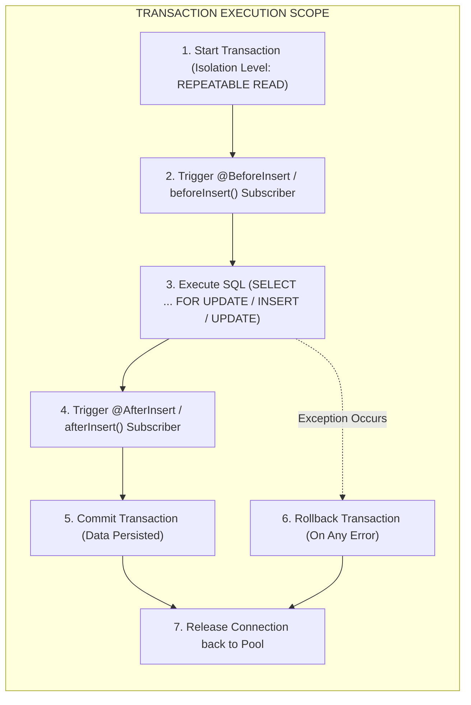
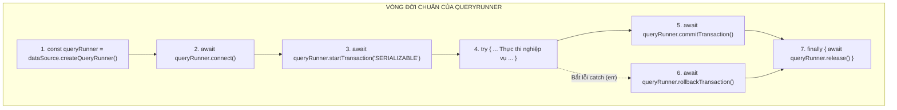

## I. KHÁI QUÁT (OVERVIEW)

Trong phát triển hệ thống Backend doanh nghiệp (Enterprise Applications), việc đảm bảo tính toàn vẹn dữ liệu, kiểm toán biến động (Audit Logging) và tính nhất quán tuyệt đối theo tiêu chuẩn **ACID (Atomicity, Consistency, Isolation, Durability)** là nhiệm vụ sống còn.

**TypeORM** cung cấp một hệ sinh thái toàn diện để xử lý các yêu cầu này thông qua hai trụ cột:
1. **Entity Lifecycle Hooks (Listeners & Subscribers):** Cho phép can thiệp, biến đổi dữ liệu tự động trước và sau khi các thao tác ORM diễn ra (ví dụ: băm mật khẩu, ghi log lịch sử thay đổi, kiểm tra quyền, xóa file liên quan trên S3).
2. **Transaction Management Engine:** Cung cấp cả hai mô hình quản trị giao dịch:
   * **Declarative Transaction (`dataSource.transaction`):** Tự động hóa hoàn toàn việc Commit, Rollback và đóng kết nối.
   * **Explicit Transaction (`QueryRunner`):** Kiểm soát thủ công từng bước vòng đời của Transaction, cấu hình mức độ cô lập (Isolation Levels) và triển khai Khóa bi quan (Pessimistic Locking) để chống Race Condition và Deadlock.



---

## II. CHI TIẾT KỸ THUẬT

### 1. Decorator Entity Listeners (Can Thiệp Trực Tiếp Trong Entity)

Decorator Listeners được đặt trực tiếp trên các phương thức bên trong Entity Class. Chúng tự động thực thi khi Entity đó đi qua các giai đoạn trong vòng đời.

```typescript
@Entity('users')
export class UserEntity {
  // 1. Kích hoạt TRƯỚC khi INSERT bản ghi mới vào DB
  @BeforeInsert()
  async hashPasswordBeforeInsert() { ... }

  // 2. Kích hoạt SAU khi INSERT thành công
  @AfterInsert()
  logAfterInsert() { ... }

  // 3. Kích hoạt TRƯỚC khi UPDATE bản ghi hiện có
  @BeforeUpdate()
  validateBeforeUpdate() { ... }

  // 4. Kích hoạt SAU khi UPDATE thành công
  @AfterUpdate()
  logAfterUpdate() { ... }

  // 5. Kích hoạt TRƯỚC / SAU khi xóa bằng remove()
  @BeforeRemove()
  beforeRemoveCheck() { ... }

  @AfterRemove()
  cleanupExternalResources() { ... }

  // 6. Kích hoạt SAU khi dữ liệu được load từ DB lên bộ nhớ (Hydration)
  @AfterLoad()
  computeVirtualFields() { ... }
}
```

> [!NOTE]
> `@AfterLoad()` là decorator duy nhất được kích hoạt khi đọc dữ liệu (`SELECT`). Nó cực kỳ hữu ích để tính toán các thuộc tính ảo (Computed / Virtual Properties) mà không cần lưu trong Database (ví dụ: ghép `firstName + lastName`, tính `age` từ `dateOfBirth`).

---

### 2. Event Subscribers Chuyên Biệt (`@EventSubscriber()`)

Trong các dự án lớn, việc nhét quá nhiều logic kiểm toán, ghi log hoặc gửi sự kiện vào Entity Class sẽ làm vi phạm nguyên lý **Single Responsibility Principle (SRP)**. TypeORM cung cấp **Subscribers** để tách biệt hoàn toàn tầng lắng nghe sự kiện ra khỏi cấu trúc Entity.

Một Subscriber là một Class được trang trí bởi `@EventSubscriber()` và triển khai interface `EntitySubscriberInterface<T>`:

```typescript
export interface EntitySubscriberInterface<Entity = any> {
  // Chỉ định Entity cần lắng nghe (hoặc return Object nếu muốn nghe toàn bộ hệ thống)
  listenTo?(): Function | string;

  // Insert Events
  beforeInsert?(event: InsertEvent<Entity>): Promise<any> | void;
  afterInsert?(event: InsertEvent<Entity>): Promise<any> | void;

  // Update Events
  beforeUpdate?(event: UpdateEvent<Entity>): Promise<any> | void;
  afterUpdate?(event: UpdateEvent<Entity>): Promise<any> | void;

  // Remove Events
  beforeRemove?(event: RemoveEvent<Entity>): Promise<any> | void;
  afterRemove?(event: RemoveEvent<Entity>): Promise<any> | void;

  // Transaction Events
  beforeTransactionStart?(event: TransactionStartEvent): Promise<any> | void;
  afterTransactionCommit?(event: TransactionCommitEvent): Promise<any> | void;
  afterTransactionRollback?(event: TransactionRollbackEvent): Promise<any> | void;
}
```

#### Phân Tích Thuộc Tính Thay Đổi (`event.updatedColumns`)
Trong sự kiện `UpdateEvent<T>`, TypeORM cung cấp mảng `event.updatedColumns` và `event.databaseEntity` (trạng thái của entity trong DB trước khi update). Điều này cho phép tạo hệ thống **Audit Trail** ghi vết chi tiết: Cột nào bị thay đổi? Giá trị cũ là gì? Giá trị mới là gì?

```typescript
@EventSubscriber()
export class UniversalAuditSubscriber implements EntitySubscriberInterface {
  listenTo() {
    return Object; // Lắng nghe MỌI Entity trong ứng dụng
  }

  async afterUpdate(event: UpdateEvent<any>) {
    if (!event.entity || !event.databaseEntity) return;

    const changedColumns = event.updatedColumns.map((col) => col.propertyName);
    console.log(`Bảng ${event.metadata.tableName} vừa cập nhật các cột:`, changedColumns);
  }
}
```

---

### 3. Quản Lý Giao Dịch Chuyên Sâu (Transaction Management)

#### A. Mô hình Declarative Transaction (`dataSource.transaction`)
Phương thức này nhận vào một callback và tự động quản lý kết nối. Nếu callback thực thi thành công, giao dịch sẽ tự động `COMMIT`. Nếu có bất kỳ lỗi nào (`throw Error`), giao dịch sẽ tự động `ROLLBACK`.

```typescript
await dataSource.transaction(
  'REPEATABLE READ', // Cấu hình Isolation Level (tùy chọn)
  async (transactionalEntityManager) => {
    // BẮT BUỘC sử dụng transactionalEntityManager để thao tác DB
    const userRepo = transactionalEntityManager.getRepository(UserEntity);
    const walletRepo = transactionalEntityManager.getRepository(WalletEntity);

    await userRepo.update(userId, { status: 'ACTIVE' });
    await walletRepo.increment({ userId }, 'balance', 100);
  }
);
```

---

#### B. Mô hình Explicit Transaction với `QueryRunner`
Khi cần kiểm soát chi tiết từng bước, can thiệp vào tiến trình khóa dữ liệu hoặc điều phối các tiến trình phức tạp, `QueryRunner` là công cụ tối thượng.



#### Bảng tra cứu các mức độ cô lập Transaction (Isolation Levels):

| Mức Độ Cô Lập (Isolation Level) | Ngăn Ngừa Dirty Read | Ngăn Ngừa Non-Repeatable Read | Ngăn Ngừa Phantom Read | Tác Động Hiệu Năng |
| :--- | :---: | :---: | :---: | :--- |
| **`READ UNCOMMITTED`** | $\times$ | $\times$ | $\times$ | Nhanh nhất, không an toàn |
| **`READ COMMITTED`** *(Default PG/MySQL)* | $\checkmark$ | $\times$ | $\times$ | Tốt, cân bằng |
| **`REPEATABLE READ`** | $\checkmark$ | $\checkmark$ | $\times$ (PG chống được) | Cao, an toàn tài chính |
| **`SERIALIZABLE`** | $\checkmark$ | $\checkmark$ | $\checkmark$ | Chậm nhất, dễ gặp Serialization Failure |

---

## III. VÍ DỤ MINH HỌA VÀ PHÂN TÍCH CODE

Dưới đây là một kịch bản giao dịch tài chính hoàn chỉnh:
1. `UserEntity` sử dụng `@BeforeInsert` và `@AfterLoad`.
2. `AuditLogSubscriber` ghi vết mọi biến động số dư tài khoản vào bảng `audit_logs`.
3. `BankingTransferService` thực hiện chuyển tiền giữa 2 ví bằng `QueryRunner`, sử dụng mức cô lập `REPEATABLE READ`, áp dụng **Pessimistic Locking** và thuật toán **Lock Ordering** để triệt tiêu hoàn toàn nguy cơ **Deadlock**.

### 1. Khai Báo Entity & Lifecycle Listeners

```typescript
import {
  Entity,
  PrimaryGeneratedColumn,
  Column,
  CreateDateColumn,
  UpdateDateColumn,
  BeforeInsert,
  BeforeUpdate,
  AfterLoad,
  VersionColumn,
} from 'typeorm';
import * as crypto from 'crypto';

@Entity('bank_users')
export class BankUserEntity {
  @PrimaryGeneratedColumn('uuid')
  id: string;

  @Column({ type: 'varchar', length: 150, unique: true })
  email: string;

  @Column({ name: 'first_name', type: 'varchar', length: 50 })
  firstName: string;

  @Column({ name: 'last_name', type: 'varchar', length: 50 })
  lastName: string;

  @Column({ name: 'password_hash', type: 'varchar', length: 255, select: false })
  passwordHash: string;

  // Thuộc tính ảo (không lưu vào DB)
  fullName: string;

  @CreateDateColumn({ name: 'created_at', type: 'timestamptz' })
  createdAt: Date;

  // 1. Listener băm mật khẩu trước khi INSERT
  @BeforeInsert()
  hashPassword() {
    if (this.passwordHash && !this.passwordHash.startsWith('$sha256$')) {
      const salt = crypto.randomBytes(16).toString('hex');
      const hash = crypto.pbkdf2Sync(this.passwordHash, salt, 10000, 64, 'sha512').toString('hex');
      this.passwordHash = `$sha256$${salt}$${hash}`;
    }
  }

  // 2. Listener tính toán trường ảo sau khi nạp từ DB lên RAM
  @AfterLoad()
  generateFullName() {
    this.fullName = `${this.firstName} ${this.lastName}`.trim();
  }
}

@Entity('wallets')
export class WalletEntity {
  @PrimaryGeneratedColumn('uuid')
  id: string;

  @Column({ name: 'user_id', type: 'uuid', unique: true })
  userId: string;

  @Column({ type: 'decimal', precision: 18, scale: 4, default: 0 })
  balance: number;

  @Column({ type: 'varchar', length: 10, default: 'VND' })
  currency: string;

  @VersionColumn()
  version: number;
}
```

---

### 2. Triển Khai AuditLogSubscriber Ghi Vết Biến Động Số Dư

```typescript
import {
  EventSubscriber,
  EntitySubscriberInterface,
  UpdateEvent,
  InsertEvent,
  DataSource,
} from 'typeorm';
import { WalletEntity } from './bank-user.entity';

@EventSubscriber()
export class WalletAuditSubscriber implements EntitySubscriberInterface<WalletEntity> {
  constructor(dataSource: DataSource) {
    dataSource.subscribers.push(this);
  }

  listenTo() {
    return WalletEntity; // Chỉ lắng nghe các sự kiện của WalletEntity
  }

  async afterUpdate(event: UpdateEvent<WalletEntity>) {
    // Kiểm tra xem cột 'balance' có nằm trong danh sách các cột vừa bị thay đổi không
    const isBalanceChanged = event.updatedColumns.some((col) => col.propertyName === 'balance');

    if (isBalanceChanged && event.databaseEntity && event.entity) {
      const oldBalance = event.databaseEntity.balance;
      const newBalance = event.entity.balance;
      const walletId = event.databaseEntity.id;

      console.log(
        `[AUDIT LOG] Ví [${walletId}] biến động số dư: ${oldBalance} -> ${newBalance} (Diff: ${
          Number(newBalance) - Number(oldBalance)
        })`
      );

      // Ghi log vào bảng audit_logs thông qua QueryRunner của chính transaction hiện tại
      await event.queryRunner.manager.query(
        `INSERT INTO audit_logs (wallet_id, old_balance, new_balance, created_at)
         VALUES ($1, $2, $3, NOW())`,
        [walletId, oldBalance, newBalance]
      );
    }
  }
}
```

---

### 3. Service Chuyển Tiền Chuyên Nghiệp với QueryRunner & Deadlock Prevention

```typescript
import { Injectable } from '@nestjs/common';
import { DataSource } from 'typeorm';
import { WalletEntity } from './bank-user.entity';

export class BankingTransferService {
  constructor(private readonly dataSource: DataSource) {}

  async transferMoney(fromUserId: string, toUserId: string, amount: number) {
    if (amount <= 0) {
      throw new Error('Số tiền chuyển khoản phải lớn hơn 0!');
    }

    // 1. Khởi tạo QueryRunner từ DataSource Connection Pool
    const queryRunner = this.dataSource.createQueryRunner();

    // 2. Thiết lập kết nối vật lý tới Database
    await queryRunner.connect();

    // 3. Khởi tạo Transaction với mức cô lập REPEATABLE READ
    await queryRunner.startTransaction('REPEATABLE READ');

    try {
      const walletRepo = queryRunner.manager.getRepository(WalletEntity);

      // =========================================================================
      // QUY TẮC CHỐNG DEADLOCK: LOCK ORDERING
      // Luôn luôn sắp xếp thứ tự ID cần khóa tăng dần. 
      // Dù luồng A chuyển (User1 -> User2) và luồng B chuyển (User2 -> User1),
      // cả hai luồng đều bắt buộc phải lock ví có ID nhỏ hơn trước!
      // =========================================================================
      const [firstUserId, secondUserId] = [fromUserId, toUserId].sort();

      // Khóa bi quan ví thứ nhất (SELECT ... FOR UPDATE)
      const firstWallet = await walletRepo.findOne({
        where: { userId: firstUserId },
        lock: { mode: 'pessimistic_write' },
      });

      // Khóa bi quan ví thứ hai (SELECT ... FOR UPDATE)
      const secondWallet = await walletRepo.findOne({
        where: { userId: secondUserId },
        lock: { mode: 'pessimistic_write' },
      });

      if (!firstWallet || !secondWallet) {
        throw new Error('Một trong hai tài khoản ví không tồn tại!');
      }

      // Xác định chính xác ví gửi và ví nhận sau khi đã khóa an toàn
      const senderWallet = firstWallet.userId === fromUserId ? firstWallet : secondWallet;
      const receiverWallet = firstWallet.userId === toUserId ? firstWallet : secondWallet;

      // Kiểm tra số dư khả dụng
      if (Number(senderWallet.balance) < amount) {
        throw new Error(`Số dư không đủ! Số dư hiện tại: ${senderWallet.balance}`);
      }

      // Thực hiện trừ tiền ví gửi và cộng tiền ví nhận
      senderWallet.balance = Number(senderWallet.balance) - amount;
      receiverWallet.balance = Number(receiverWallet.balance) + amount;

      // Lưu thay đổi (Sẽ tự động kích hoạt WalletAuditSubscriber ghi log)
      await walletRepo.save(senderWallet);
      await walletRepo.save(receiverWallet);

      // 4. Commit toàn bộ thay đổi khi mọi thứ hoàn tất thành công
      await queryRunner.commitTransaction();

      return {
        success: true,
        message: 'Chuyển tiền thành công',
        transferredAmount: amount,
        senderNewBalance: senderWallet.balance,
      };
    } catch (error) {
      // 5. Rollback toàn bộ trạng thái DB nếu có bất kỳ ngoại lệ nào
      await queryRunner.rollbackTransaction();
      throw error;
    } finally {
      // 6. QUAN TRỌNG NHẤT: Bắt buộc giải phóng kết nối trả về Connection Pool
      await queryRunner.release();
    }
  }
}
```

---

## IV. LƯU Ý CẠM BẪY VÀ QUY TẮC CỐT LÕI

### 1. Thảm Họa Rò Rỉ Kết Nối (Connection Pool Leak)

```typescript
// NGUY HIỂM CHẾT NGƯỜI:
const queryRunner = dataSource.createQueryRunner();
await queryRunner.connect();
await queryRunner.startTransaction();

try {
  // Xử lý logic...
  await queryRunner.commitTransaction();
  await queryRunner.release(); // ĐẶT TRONG TRY LÀ SAI LẦM!
} catch (err) {
  await queryRunner.rollbackTransaction();
  // Quên release() trong catch -> MẤT 1 KẾT NỐI VĨNH VIỄN!
}
```

> [!CAUTION]
> Nếu bạn đặt `queryRunner.release()` bên trong khối `try`, khi xảy ra lỗi bất ngờ, dòng code đó sẽ bị nhảy qua. Kết nối DB sẽ bị **treo vĩnh viễn (Leaked Connection)**. 
> Sau vài giờ hoạt động, toàn bộ Connection Pool (thường từ 10 - 50 connections) sẽ cạn kiệt, khiến mọi API trong toàn bộ hệ thống bị treo (`Timeout Error`).
> * **Quy tắc bất di bất dịch:** `await queryRunner.release();` **BẮT BUỘC PHẢI NẰM TRONG KHỐI `finally`**.

---

### 2. Cạm bẫy Gọi Sai Repository Bên Trong Transaction Callback

```typescript
// SAI LẦM PHỔ BIẾN:
await dataSource.transaction(async (manager) => {
  // LỖI: Gọi userRepository từ biến bên ngoài thay vì lấy từ manager!
  // Câu lệnh này sẽ chạy NGOÀI Transaction trên một kết nối khác độc lập!
  await this.userRepository.update(id, { status: 'ACTIVE' }); 

  // Nếu dòng này quăng lỗi, lệnh update ở trên VẪN ĐÃ BỊ LƯU và không thể rollback!
  throw new Error('System crash!');
});

// ĐÚNG CHUẨN:
await dataSource.transaction(async (manager) => {
  const userRepo = manager.getRepository(UserEntity); // Lấy từ manager
  await userRepo.update(id, { status: 'ACTIVE' }); 
});
```

---

### 3. Cạm bẫy Bỏ Qua Hooks khi Dùng Raw Methods / QueryBuilder

> [!WARNING]
> Toàn bộ các Decorator Listeners (`@BeforeInsert`, `@BeforeUpdate`, v.v.) và Subscribers **CHỈ HOẠT ĐỘNG** khi bạn gọi các phương thức quản trị vòng đời: `save()`, `remove()`, `softRemove()`, `recover()`.
> * Các phương thức: `insert()`, `update()`, `delete()`, `softDelete()`, `upsert()` hoặc `QueryBuilder` **HOÀN TOÀN KHÔNG KÍCH HOẠT** bất kỳ Listener hay Subscriber nào.

---

### 4. Bảng So Sánh Quyết Định Các Giải Pháp Quản Lý Giao Dịch

| Tiêu Chí | `dataSource.transaction()` (Declarative) | `QueryRunner` (Explicit Programmatic) |
| :--- | :--- | :--- |
| **Độ phức tạp code** | Rất thấp (Ngắn gọn, tự động commit/rollback) | Trung bình (Cần viết đầy đủ `try/catch/finally`) |
| **Rủi ro rò rỉ kết nối** | $0\%$ (TypeORM tự động giải phóng) | Có nguy cơ cao nếu quên `queryRunner.release()` |
| **Kiểm soát Isolation Level** | Hỗ trợ truyền tham số đầu vào | Kiểm soát chi tiết từng giai đoạn |
| **Tích hợp Pessimistic Lock** | Khá tốt | **Tối ưu tuyệt đối** (Hỗ trợ lock thủ công từng dòng) |
| **Ngữ cảnh sử dụng** | Các transaction CRUD chuẩn 2-3 bảng | Xử lý tài chính, phân bổ kho, chuyển tiền, chống Deadlock |
