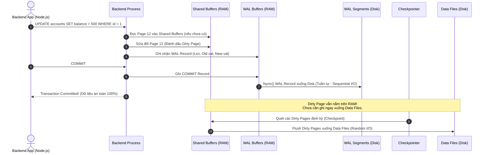
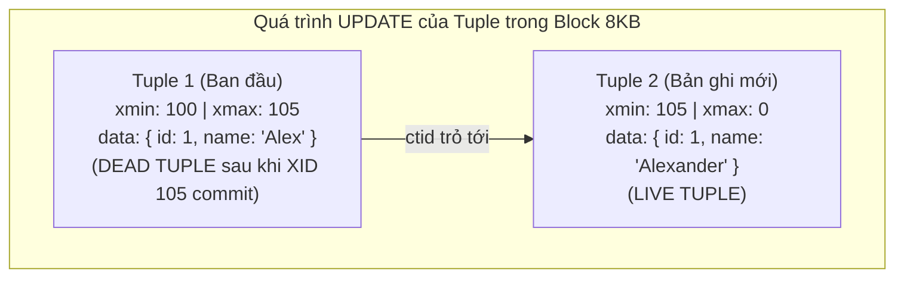
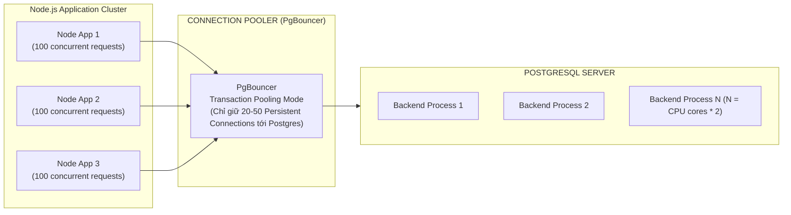

## I. KHÁI QUÁT (OVERVIEW)

### 1. Vị thế và Bản chất Kiến trúc của PostgreSQL
PostgreSQL (thường gọi tắt là Postgres) là hệ quản trị cơ sở dữ liệu quan hệ đối tượng (ORDBMS - Object-Relational Database Management System) mã nguồn mở tiên tiến nhất hiện nay. Không giống như các RDBMS truyền thống chỉ dừng lại ở mô hình quan hệ thuần túy của Edgar F. Codd, PostgreSQL kết hợp sức mạnh của các cấu trúc dữ liệu phức tạp (JSONB, Arrays, Hstore, GiST/GIN) với sự tuân thủ nghiêm ngặt chuẩn SQL (SQL:2016) và các đặc tính ACID hoàn hảo.

Khác biệt cốt lõi của PostgreSQL nằm ở mô hình kiến trúc tiến trình (**Process-based Model**) thay vì mô hình đa luồng (**Thread-based Model** như MySQL hoặc MS SQL Server), cùng với cơ chế kiểm soát đồng thời đa phiên bản (**MVCC - Multi-Version Concurrency Control**) dựa trên việc không bao giờ ghi đè trực tiếp dữ liệu tại chỗ (In-place Update), mà tạo ra các phiên bản mới của dòng dữ liệu (Tuples).

```mermaid
flowchart TD
    Client1["Client App (Node.js / Go)"] -->|TCP Connection| Postmaster["Postmaster Process (Main Daemon)"]
    Client2["Client App (Python / Java)"] -->|TCP Connection| Postmaster
    
    Postmaster -->|fork() per connection| BP1["Backend Process 1<br/>(Dedicated Memory / work_mem)"]
    Postmaster -->|fork() per connection| BP2["Backend Process 2<br/>(Dedicated Memory / work_mem)"]
    
    subgraph SharedMemory["POSTGRESQL SHARED MEMORY (SRAM)"]
        SB["Shared Buffers<br/>(Data Pages Cache)"]
        WB["WAL Buffers<br/>(Transaction Log Buffer)"]
        CLOG["Commit Log / pg_xact<br/>(Transaction Status)"]
        Locks["Lock Table<br/>(Shared / Exclusive Locks)"]
    end

    BP1 <--> SharedMemory
    BP2 <--> SharedMemory

    subgraph BackgroundProcesses["HỆ THỐNG TIẾN TRÌNH NỀN (BACKGROUND PROCESSES)"]
        BGWriter["Background Writer<br/>(Ghi dirty pages dần vào disk)"]
        Checkpointer["Checkpointer<br/>(Flush dirty pages định kỳ & tạo checkpoint)"]
        WALWriter["WAL Writer<br/>(Flush WAL log buffers xuống disk)"]
        Autovacuum["Autovacuum Launcher & Workers<br/>(Dọn dẹp dead tuples & cập nhật catalog stats)"]
        StatsCollector["Stats Collector<br/>(Thu thập số liệu giám sát)"]
    end

    BackgroundProcesses <--> SharedMemory

    subgraph DiskStorage["DISK STORAGE (NVMe / SSD)"]
        DataFiles["Data Files (Tables, Indexes, FSM, VM)"]
        WALFiles["WAL Segments (pg_wal)"]
    end

    SharedMemory --> DataFiles
    WALWriter --> WALFiles
    Checkpointer --> DataFiles
```

---

### 2. Sơ đồ luồng hoạt động tổng quát của một Truy vấn (Query Lifecycle)
Khi một truy vấn SQL từ ứng dụng backend được gửi tới PostgreSQL:
1. **Connection Initiation:** Postmaster Process nhận yêu cầu bắt tay TCP, xác thực và gọi system call `fork()` để sinh ra một `Backend Process` (Postgres Worker) riêng biệt phục vụ kết nối đó.
2. **Parser & Analyzer:** Chuyển đổi chuỗi văn bản SQL thành cây cú pháp (Parse Tree), kiểm tra tính hợp lệ về kiểu dữ liệu và bảng trong System Catalogs (`pg_class`, `pg_attribute`) để tạo thành `Query Tree`.
3. **Rewriter:** Áp dụng các Rules hoặc View definitions biến đổi `Query Tree`.
4. **Planner / Optimizer:** Trái tim của PostgreSQL. Dựa trên số liệu thống kê (`pg_statistic`) do tiến trình Analyze/Vacuum thu thập, Planner ước tính chi phí CPU và Disk I/O của hàng chục kế hoạch thực thi khác nhau (Seq Scan, Index Scan, Bitmap Scan, Hash Join, Nested Loop, Merge Join) và chọn ra kế hoạch có chi phí (Cost) thấp nhất.
5. **Executor:** Thực thi các bước của Execution Plan, tương tác với `Shared Buffers` để đọc/ghi Data Pages (8KB). Nếu dữ liệu chưa có trên RAM, hệ thống sẽ phát tín hiệu đọc I/O từ Disk lên `Shared Buffers`.
6. **WAL Logging:** Nếu là thao tác ghi (`INSERT`, `UPDATE`, `DELETE`), thay đổi được ghi vào `WAL Buffers` trước khi ghi nhận Transaction thành công (Write-Ahead Logging).

---

## II. CHI TIẾT KỸ THUẬT (DETAILED DEEP DIVE)

### 1. Kiến trúc Bộ nhớ & Tiến trình PostgreSQL

#### a. Kiến trúc Tiến trình (Process Architecture)
PostgreSQL sử dụng kiến trúc đa tiến trình (Multi-process):
* **Postmaster Process (Supervisor):** Tiến trình cha chạy ở cổng 5432, lắng nghe kết nối mới, khởi tạo và giám sát các tiến trình nền.
* **Backend Processes (Postgres Workers):** Mỗi kết nối từ client ứng dụng là một tiến trình OS độc lập. Bộ nhớ của mỗi Backend Process được cách ly hoàn toàn, gồm có:
  * `work_mem`: Dung lượng RAM dành riêng cho các thao tác sắp xếp (`ORDER BY`), băm (`Hash Join`, `HashAggregate`), hoặc `DISTINCT`. Lưu ý: một truy vấn phức tạp có thể cấp phát nhiều block `work_mem` cùng lúc.
  * `maintenance_work_mem`: RAM dành cho các tác vụ bảo trì như `VACUUM`, `CREATE INDEX`, `ALTER TABLE ADD FOREIGN KEY`.
  * `temp_buffers`: Lưu trữ các bảng tạm (Temporary Tables).

#### b. Vùng nhớ dùng chung (Shared Memory Architecture)
* **Shared Buffers:** Bộ nhớ đệm dùng chung lớn nhất (khuyến nghị cấu hình 25% - 40% tổng dung lượng RAM của Server). Postgres lưu trữ các Data Pages (kích thước mặc định 8KB) tại đây. Khi đọc hay sửa đổi dữ liệu, Postgres đều thực hiện trên Shared Buffers trước.
* **WAL Buffers:** Vùng nhớ đệm chứa các bản ghi WAL (Write-Ahead Log) trước khi được xả (flush) xuống đĩa cứng.
* **CLOG (Commit Log / `pg_xact`):** Mảng bit trạng thái của mọi Transaction ID (`IN_PROGRESS`, `COMMITTED`, `ABORTED`).
* **Lock Table:** Lưu trữ thông tin khóa dòng, khóa bảng (Row-level Locks, Table-level Locks, Heavyweight Locks, Lightweight Locks/LWLocks).

#### c. Write-Ahead Logging (WAL) & Checkpoint
Cơ chế **WAL (Write-Ahead Logging)** tuân thủ nguyên lý vàng của cơ sở dữ liệu: **"Không có Data Page nào được phép ghi xuống đĩa trước khi bản ghi WAL mô tả sự thay đổi đó đã được ghi an toàn xuống đĩa cứng"**.



* **Lợi ích tối thượng của WAL:** Biến các thao tác ghi ngẫu nhiên (Random Write I/O trên Data Files) thành các thao tác ghi tuần tự cực nhanh (Sequential Write I/O trên WAL files).
* **Crash Recovery:** Khi server sập nguồn đột ngột, khi khởi động lại, Postgres đọc Redo Log từ điểm **Checkpoint** gần nhất trên đĩa và replay lại các bản ghi WAL trên `pg_wal` để tái tạo lại trạng thái dữ liệu chính xác.

---

### 2. Thuộc tính ACID & Các Cấp độ Cô lập Giao dịch (Transaction Isolation Levels)

#### a. ACID trong Lõi Database Engine
1. **Atomicity (Nguyên tử):** Toàn bộ các thao tác trong transaction phải thành công, hoặc toàn bộ bị hủy bỏ (`ROLLBACK`). Quản lý bởi Transaction Log và Undo mechanism thông qua MVCC.
2. **Consistency (Nhất quán):** Dữ liệu luôn biến đổi từ trạng thái hợp lệ này sang trạng thái hợp lệ khác, không vi phạm các ràng buộc (`FOREIGN KEY`, `CHECK`, `UNIQUE`).
3. **Isolation (Cô lập):** Các transaction chạy đồng thời không được can thiệp lẫn nhau làm sai lệch trạng thái trung gian.
4. **Durability (Bền vững):** Một khi transaction đã COMMIT, dữ liệu chắc chắn tồn tại vĩnh viễn dù hệ điều hành bị crash, nhờ lệnh `fsync()` đẩy WAL xuống ổ cứng vật lý.

#### b. Các hiện tượng xung đột đồng thời (Read / Write Anomalies)
* **Dirty Read:** Transaction A đọc dữ liệu chưa commit của Transaction B. (PostgreSQL **không bao giờ** bị Dirty Read ở bất kỳ cấp độ nào nhờ cơ chế MVCC).
* **Non-repeatable Read (Fuzzy Read):** Transaction A đọc dòng X. Transaction B cập nhật dòng X và Commit. Transaction A đọc lại dòng X và nhận giá trị khác với lần đọc trước.
* **Phantom Read:** Transaction A truy vấn danh sách bản ghi theo điều kiện `WHERE age > 18` được 10 dòng. Transaction B chèn thêm dòng mới thỏa mãn điều kiện và Commit. Transaction A đọc lại thì thấy 11 dòng.
* **Serialization Anomaly (Write Skew):** Hai transaction đồng thời đọc cùng một tập dữ liệu, dựa trên dữ liệu đó đưa ra quyết định cập nhật hai tập dữ liệu khác nhau, dẫn tới vi phạm ràng buộc logic toàn cục.

#### c. So sánh 4 Cấp độ Cô lập (Isolation Levels)

| Isolation Level | Dirty Read | Non-repeatable Read | Phantom Read | Serialization Anomaly (Write Skew) | Cơ chế hoạt động trong PostgreSQL |
| :--- | :---: | :---: | :---: | :---: | :--- |
| **Read Uncommitted** | ❌ (Không bị) | ✅ Có thể | ✅ Có thể | ✅ Có thể | Trong PG, được xử lý tương đương **Read Committed**. |
| **Read Committed** *(Default)* | ❌ Không | ✅ Có thể | ✅ Có thể | ✅ Có thể | **Snapshot per Statement:** Mỗi câu SQL bên trong transaction chụp một Snapshot mới của database tại thời điểm câu lệnh bắt đầu chạy. |
| **Repeatable Read** | ❌ Không | ❌ Không | ❌ Không | ✅ Có thể | **Snapshot per Transaction:** Chụp 1 Snapshot duy nhất tại thời điểm câu SQL đầu tiên trong transaction chạy. Báo lỗi `could not serialize access` nếu có transaction khác update đè dòng dữ liệu. |
| **Serializable** | ❌ Không | ❌ Không | ❌ Không | ❌ Không | Sử dụng **SSI (Serializable Snapshot Isolation)**. Theo dõi các vết đọc/ghi qua `SIREAD locks` (Lock trừu tượng không block đọc/ghi). Nếu phát hiện chu trình phụ thuộc (Dependency Cycle), tự động Rollback một transaction. |

---

### 3. Cơ chế MVCC (Multi-Version Concurrency Control) & VACUUM

#### a. Cấu trúc một Dòng Dữ liệu (Tuple Header)
Trong PostgreSQL, một bảng không chỉ chứa các cột dữ liệu mà mỗi tuple vật lý còn có header ẩn gồm:
* `xmin`: Transaction ID (XID) của transaction thực hiện lệnh `INSERT` tạo ra tuple này.
* `xmax`: Transaction ID của transaction thực hiện lệnh `DELETE` hoặc `UPDATE` làm tuple này hết hiệu lực (Nếu chưa xóa/update thì `xmax = 0`).
* `t_ctid`: Con trỏ vật lý trỏ tới vị trí block và offset của chính tuple này hoặc tuple kế tiếp mới hơn (nếu vừa bị update).



> [!IMPORTANT]
> Trong PostgreSQL, lệnh `UPDATE` thực chất là một thao tác **`DELETE` (đánh dấu `xmax`) + `INSERT` (tạo tuple mới với `xmin` mới)**. Bản ghi cũ không bị xóa ngay mà trở thành **Dead Tuple**.

#### b. Vấn đề Table Bloat, Index Bloat và Autovacuum
Khi hệ thống có hàng triệu lượt `UPDATE` và `DELETE`, số lượng Dead Tuples tăng vọt làm phình to dung lượng bảng (**Table Bloat**) và Index (**Index Bloat**), khiến các câu lệnh quét tuần tự phải đọc cả các trang dữ liệu rác.

* **VACUUM tiêu chuẩn:** Quét bảng, thu hồi không gian của các Dead Tuples và đánh dấu vào `Free Space Map (FSM)` để các lệnh `INSERT` tiếp theo có thể tái sử dụng không gian này. Không khóa bảng (Non-blocking DML), không trả dung lượng vật lý về cho OS.
* **VACUUM FULL:** Tạo một bản sao bảng mới hoàn toàn, dồn dữ liệu liên tục và trả dung lượng ổ cứng về OS. Khóa bảng độc quyền (**Exclusive Lock - AccessExclusiveLock**), chặn mọi hành vi đọc và ghi.
* **Autovacuum Daemon:** Tiến trình chạy ngầm tự động kích hoạt Vacuum và Analyze khi số lượng Dead Tuples vượt ngưỡng công thức:
$$\text{Threshold} = \text{autovacuum\_vacuum\_threshold} + (\text{autovacuum\_vacuum\_scale\_factor} \times \text{reltuples})$$

---

### 4. Indexing Deep Dive (Cấu trúc chỉ mục & Chiến lược quét)

```mermaid
mindmap
  root((PostgreSQL Indexing))
    B-Tree Index
      Cân bằng chiều cao
      Equality (=) & Range (<, <=, >, >=, BETWEEN)
      Sắp xếp ORDER BY
      Toán tử IN, IS NULL
    Hash Index
      Chỉ so sánh bằng (=)
      O(1) Access time
      Hỗ trợ WAL từ PG 10+
    GIN Index
      Generalized Inverted Index
      JSONB attributes (@>, ?)
      Full-text Search (tsvector)
      Array containment (&&, @>)
    GiST & SP-GiST Index
      Generalized Search Tree
      Spatial Data / GIS (PostGIS)
      Range Types (tsrange, int4range)
      k-Nearest Neighbor (k-NN)
    BRIN Index
      Block Range Index
      Time-series / Append-only logs
      Kích thước siêu nhỏ (Vài KB cho hàng chục GB data)
```

#### a. Phân tích chi tiết các loại Index
1. **B-Tree Index (Default):** Cây cân bằng (Self-balancing Tree). Dữ liệu ở các nút lá (Leaf nodes) được liên kết đôi (Doubly linked list) và lưu trữ con trỏ `ItemPointer` (gồm Block Number + Offset) trỏ trực tiếp tới Heap Page.
2. **GIN (Generalized Inverted Index):** Index đảo ngược. Thay vì lập chỉ mục từ Document $\to$ Elements, GIN tách các phần tử bên trong (ví dụ key của JSONB hoặc từ vựng trong văn bản) $\to$ Danh sách danh mục chứa phần tử đó. Cực kỳ nhanh cho truy vấn JSONB `@>`.
3. **BRIN (Block Range Index):** Không lưu vị trí từng dòng mà chỉ lưu giá trị `[min_val, max_val]` cho mỗi nhóm Block (ví dụ 128 trang = 1MB). Phù hợp cho bảng logs hàng trăm triệu dòng có thứ tự thời gian tăng dần (`created_at`).

#### b. Các Chiến lược Index nâng cao
* **Composite Index (Chỉ mục kết hợp):** Lập index trên nhiều cột `(col_a, col_b, col_c)`. Tuân theo nguyên tắc tiền tố bên trái (**Leftmost Prefix Rule**). Index có tác dụng tốt nhất khi truy vấn lọc theo `col_a`, hoặc `col_a AND col_b`.
* **Partial Index (Chỉ mục một phần):** 
  ```sql
  CREATE INDEX idx_orders_unprocessed ON orders(created_at) WHERE status = 'PENDING';
  ```
  Chỉ đánh index các dòng chưa xử lý (chiếm 1% bảng). Tiết kiệm 99% dung lượng RAM và thời gian bảo trì Index khi Insert.
* **Expression / Functional Index:**
  ```sql
  CREATE INDEX idx_users_lower_email ON users(LOWER(email));
  ```
  Tăng tốc khi truy vấn có hàm biến đổi `WHERE LOWER(email) = 'user@example.com'`.
* **Covering Index (`INCLUDE` Clause):**
  ```sql
  CREATE INDEX idx_users_lookup ON users(email) INCLUDE (id, full_name, role);
  ```
  Cho phép thực hiện **Index Only Scan** mà không cần truy cập ngược lại Heap table để lấy `full_name` và `role`.

#### c. Phân biệt các kiểu Quét dữ liệu (Scan Types)
1. **Sequential Scan (Seq Scan):** Đọc toàn bộ bảng từ block đầu tiên tới block cuối cùng. Tối ưu khi bảng nhỏ hoặc truy vấn lấy ra phần lớn dữ liệu (> 20-30% tổng số dòng).
2. **Index Scan:** Duyệt cây B-Tree để tìm `ItemPointer` (TID), sau đó với mỗi TID, nhảy vào Heap Page trên đĩa để đọc toàn bộ dòng dữ liệu (Random I/O).
3. **Index Only Scan:** Lấy toàn bộ dữ liệu cần thiết trực tiếp từ lá của Index mà không cần đọc Heap Page. PostgreSQL kiểm tra **Visibility Map (VM)**: nếu trang dữ liệu đã all-visible (không có transaction nào đang sửa dở), Postgres bỏ qua hoàn toàn bước kiểm tra MVCC trên Heap.
4. **Bitmap Index Scan & Bitmap Heap Scan:** Khi có nhiều điều kiện hoặc truy vấn lấy ra một lượng dòng vừa phải (5% - 15%), Postgres duyệt Index để xây dựng một **Bitmap** trong bộ nhớ (mỗi bit biểu thị một page có chứa dòng thỏa mãn). Sau đó thực hiện **Bitmap Heap Scan** đọc các pages theo thứ tự vật lý trên đĩa, biến Random I/O thành Sequential I/O và hỗ trợ gộp nhiều Index (`BitmapOr`, `BitmapAnd`).

---

### 5. Query Optimization & EXPLAIN ANALYZE

#### a. Cách đọc Execution Plan
Cú pháp đầy đủ và mạnh mẽ nhất để phân tích:
```sql
EXPLAIN (ANALYZE, BUFFERS, VERBOSE, SETTINGS, COSTS, TIMING) 
SELECT ... ;
```

* `cost=start_cost..total_cost`: Điểm chi phí ước tính của Planner (đo bằng đơn vị tùy biến, trong đó 1.0 là chi phí đọc tuần tự 1 trang đĩa `seq_page_cost`, 4.0 là `random_page_cost`).
* `rows=N`: Số dòng Planner ước tính sẽ trả về.
* `actual time=start_time..total_time`: Thời gian thực tế tính bằng mili-giây (ms).
* `actual rows=N loops=M`: Tổng số dòng thực tế là $N \times M$.
* `Buffers: shared hit=X read=Y dirtied=Z`: 
  * `hit`: Đọc được trực tiếp từ RAM (`Shared Buffers`).
  * `read`: Phải đọc I/O từ Disk.
  * `dirtied`: Số block bị sửa đổi trong RAM.

#### b. Các Thuật toán JOIN vật lý trong PostgreSQL
1. **Nested Loop Join:** Vòng lặp lồng nhau. Lấy từng dòng từ bảng ngoài (Outer Table), quét bảng trong (Inner Table - lý tưởng nhất là qua Index Scan). Tối ưu nhất khi Outer Table rất nhỏ và Inner Table có Index.
2. **Hash Join:** Nạp toàn bộ Outer Table vào một Hash Table trong bộ nhớ `work_mem`. Sau đó quét Inner Table một lần và tra cứu vào Hash Table. Rất nhanh cho các bảng lớn không có index sắp xếp.
3. **Merge Join:** Cả 2 bảng đều được sắp xếp theo JOIN key trước (bằng Index hoặc thao tác Sort). Sau đó 2 con trỏ chạy song song duyệt qua các phần tử khớp nhau. Cực kỳ hiệu quả cho 2 tập dữ liệu khổng lồ đã được sắp xếp sẵn.

---

### 6. Connection Pooling & Quản lý Tài nguyên



#### a. Tại sao cần Connection Pooler?
Vì PostgreSQL cấp phát 1 Process OS cho mỗi kết nối:
* Mỗi Backend Process tiêu tốn khoảng **5MB - 10MB RAM** cơ sở, chưa kể `work_mem`.
* Mở/Đóng kết nối liên tục yêu cầu OS thực hiện system call `fork()`, gây quá tải CPU Context Switching.
* Nếu 1000 kết nối đồng thời chạy truy vấn, 1000 process tranh chấp CPU Core, RAM và LWLocks $\to$ Hiệu năng sụt giảm nghiêm trọng (**Thundering Herd Problem**).

#### b. Công thức tính Kích thước Pool chuẩn (The Pool Sizing Formula)
Công thức chuẩn hóa từ nhóm phát triển PostgreSQL và PostgreSQL Core:
$$\text{Max Connections} = ((\text{CPU Cores} \times 2) + \text{Effective Spindle Count})$$
* Với ổ cứng NVMe / SSD hiện đại, `Effective Spindle Count` coi như 1 đến vài đơn vị.
* **Ví dụ:** Một Server có 16 Cores CPU thì Connection Pool tối ưu nhất cho PostgreSQL chỉ nên duy trì từ **32 đến 40 kết nối trực tiếp**!

#### c. Phân loại Chế độ Pooling của PgBouncer
1. **Session Pooling:** Client giữ nguyên kết nối Postgres từ lúc login tới khi disconnect.
2. **Transaction Pooling (Khuyên dùng cho Backend Microservices):** PgBouncer gán một kết nối Postgres thực sự cho client khi bắt đầu `BEGIN` và thu hồi lại ngay khi `COMMIT`/`ROLLBACK`. Một kết nối database có thể phục vụ hàng trăm HTTP requests. *(Lưu ý: Không dùng được các tính năng cấp Session như `SET TIMEZONE`, `LISTEN/NOTIFY`, Temporary Tables)*.
3. **Statement Pooling:** Thu hồi kết nối sau từng câu lệnh SQL đơn lẻ.

---

## III. VÍ DỤ MINH HỌA VÀ PHÂN TÍCH CODE

### 1. Phân tích Kế hoạch Thực thi (EXPLAIN ANALYZE Benchmark)

Giả sử hệ thống thương mại điện tử có bảng `orders` với 1,000,000 dòng:

```sql
-- Thiết lập cấu hình test và tạo bảng
CREATE TABLE customers (
    id SERIAL PRIMARY KEY,
    name VARCHAR(100) NOT NULL,
    tier VARCHAR(20) DEFAULT 'STANDARD',
    created_at TIMESTAMPTZ DEFAULT NOW()
);

CREATE TABLE orders (
    id SERIAL PRIMARY KEY,
    customer_id INT NOT NULL REFERENCES customers(id),
    total_amount NUMERIC(12, 2) NOT NULL,
    status VARCHAR(30) NOT NULL,
    metadata JSONB,
    created_at TIMESTAMPTZ NOT NULL DEFAULT NOW()
);

-- Nạp 10,000 khách hàng và 1,000,000 đơn hàng mẫu
INSERT INTO customers (name, tier)
SELECT 'Customer ' || i, (ARRAY['STANDARD', 'VIP', 'PLATINUM'])[floor(random() * 3 + 1)]
FROM generate_series(1, 10000) AS i;

INSERT INTO orders (customer_id, total_amount, status, metadata, created_at)
SELECT 
    floor(random() * 10000 + 1)::INT,
    (random() * 5000 + 10)::NUMERIC(12, 2),
    (ARRAY['PENDING', 'PROCESSING', 'COMPLETED', 'CANCELLED'])[floor(random() * 4 + 1)],
    jsonb_build_object('source', (ARRAY['web', 'mobile_ios', 'mobile_android'])[floor(random() * 3 + 1)], 'coupon', 'SALE2026'),
    NOW() - (random() * 365 || ' days')::INTERVAL
FROM generate_series(1, 1000000);
```

#### Case 1: Truy vấn không có Index (Gây Sequential Scan nặng nề)
```sql
EXPLAIN (ANALYZE, BUFFERS)
SELECT * FROM orders 
WHERE status = 'PENDING' AND total_amount > 4500;
```

**Kế hoạch thực thi trả về:**
```text
Seq Scan on orders  (cost=0.00..26345.00 rows=25120 width=142) (actual time=0.045..112.350 rows=24890 loops=1)
  Filter: (((status)::text = 'PENDING'::text) AND (total_amount > 4500))
  Rows Removed by Filter: 975110
  Buffers: shared hit=13845
Planning Time: 0.125 ms
Execution Time: 114.820 ms
```
* **Phân tích:** Postgres phải quét qua 13,845 Data Pages (`shared hit=13845`), đọc toàn bộ 1 triệu bản ghi và loại bỏ 975,110 bản ghi không thỏa mãn, tiêu tốn **114.82 ms**.

#### Case 2: Tối ưu với Composite Index + Partial Index
Nếu hệ thống chỉ thường xuyên tra cứu các đơn hàng chưa hoàn tất (`PENDING`, `PROCESSING`):

```sql
-- Tạo Composite Partial Index
CREATE INDEX idx_orders_active_high_value 
ON orders (total_amount) 
WHERE status IN ('PENDING', 'PROCESSING');
```

Chạy lại truy vấn:
```sql
EXPLAIN (ANALYZE, BUFFERS)
SELECT id, customer_id, total_amount, status 
FROM orders 
WHERE status = 'PENDING' AND total_amount > 4500;
```

**Kế hoạch thực thi mới:**
```text
Bitmap Heap Scan on orders  (cost=490.12..7820.40 rows=25120 width=28) (actual time=4.120..15.840 rows=24890 loops=1)
  Recheck Cond: ((status = 'PENDING'::text) AND (total_amount > 4500))
  Buffers: shared hit=4210
  ->  Bitmap Index Scan on idx_orders_active_high_value  (cost=0.00..483.84 rows=25120 width=0) (actual time=3.850..3.850 rows=24890 loops=1)
        Index Cond: (total_amount > 4500)
Planning Time: 0.180 ms
Execution Time: 17.150 ms
```
* **Phân tích:** Thời gian thực thi giảm từ **114.82 ms xuống 17.15 ms (nhanh hơn gần 7 lần)**. Bộ nhớ đệm đọc giảm từ 13,845 pages xuống còn 4,210 pages.

---

### 2. Giải quyết bài toán N+1 Query trong Node.js / TypeScript

#### Đoạn code gây thảm họa N+1 (Thường gặp trong ORM như TypeORM / Sequelize / Prisma nếu viết sai):
```typescript
// BAD CODE: Gây ra 1 + N truy vấn mạng (Round-trips)
async function getVipCustomersWithLatestOrdersBad() {
  // Query 1: Lấy danh sách 100 khách hàng VIP
  const vipCustomers = await db.query(
    "SELECT id, name FROM customers WHERE tier = 'VIP' LIMIT 100"
  );

  const results = [];
  // Loop 100 lần -> Tạo thêm 100 round-trips độc lập tới DB!
  for (const customer of vipCustomers.rows) {
    const orders = await db.query(
      "SELECT id, total_amount, status, created_at FROM orders WHERE customer_id = $1 ORDER BY created_at DESC LIMIT 5",
      [customer.id]
    );
    results.push({
      ...customer,
      recentOrders: orders.rows,
    });
  }
  return results; // Tổng cộng mất 101 queries!
}
```

#### Giải pháp tối ưu: Xử lý bằng 1 Query duy nhất với SQL Aggregation (`json_agg` & Subquery / Lateral Join):
```typescript
// GOOD CODE: 1 Single Query - Tối ưu 100% tài nguyên kết nối & Network latency
async function getVipCustomersWithLatestOrdersOptimized() {
  const query = `
    SELECT 
      c.id, 
      c.name, 
      c.tier,
      COALESCE(o.recent_orders, '[]'::json) AS recent_orders
    FROM customers c
    LEFT JOIN LATERAL (
      SELECT json_agg(
        json_build_object(
          'id', ord.id,
          'total_amount', ord.total_amount,
          'status', ord.status,
          'created_at', ord.created_at
        ) ORDER BY ord.created_at DESC
      ) AS recent_orders
      FROM (
        SELECT id, total_amount, status, created_at
        FROM orders
        WHERE customer_id = c.id
        ORDER BY created_at DESC
        LIMIT 5
      ) ord
    ) o ON true
    WHERE c.tier = 'VIP'
    LIMIT 100;
  `;

  const { rows } = await db.query(query);
  return rows; // Chỉ mất đúng 1 round-trip duy nhất!
}
```

---

## IV. LƯU Ý, CẠM BẪY VÀ QUY TẮC CỐT LÕI (BEST PRACTICES)

> [!CAUTION]
> ### 1. Cạm bẫy Deadlocks do Thứ tự Khóa không Nhất quán (Lock Ordering)
> Deadlock xảy ra khi Transaction 1 giữ khóa trên Row A và chờ Row B, trong khi Transaction 2 đang giữ khóa trên Row B và chờ Row A.
> 
> ```mermaid
> sequenceDiagram
>     participant T1 as Transaction 1
>     participant DB as PostgreSQL Engine
>     participant T2 as Transaction 2
>     
>     T1->>DB: UPDATE accounts SET balance = balance - 100 WHERE id = 1; (Lock Row 1)
>     T2->>DB: UPDATE accounts SET balance = balance + 200 WHERE id = 2; (Lock Row 2)
>     T1->>DB: UPDATE accounts SET balance = balance + 100 WHERE id = 2; (Chờ Row 2 giải phóng...)
>     T2->>DB: UPDATE accounts SET balance = balance - 200 WHERE id = 1; (Chờ Row 1 giải phóng...)
>     Note over DB: DEADLOCK DETECTED sau deadlock_timeout (mặc định 1s)!<br/>Postgres tự động abort và rollback 1 Transaction.
> ```
> 
> **Quy tắc vàng phòng chống Deadlock:**
> - **Sắp xếp thứ tự cập nhật ID theo quy chuẩn nhất quán (Deterministic Ordering):** Luôn khóa/cập nhật các tài nguyên theo thứ tự tăng dần của Primary Key: `ORDER BY id ASC`.
> - **Sử dụng mệnh đề `NOWAIT` hoặc `SKIP LOCKED`:**
>   ```sql
>   -- Cho tác vụ Worker lấy Job trong hàng đợi mà không bị tranh chấp:
>   SELECT * FROM task_queue 
>   WHERE status = 'QUEUED' 
>   LIMIT 1 
>   FOR UPDATE SKIP LOCKED;
>   ```

> [!WARNING]
> ### 2. Cạm bẫy Transaction Sống Quá Lâu (Long-running Transactions)
> Một transaction mở quá lâu (ví dụ do gọi API bên thứ ba như Stripe/PayPal bên trong transaction) sẽ giữ nguyên snapshot cũ. 
> 
> **Hậu quả nghiêm trọng:**
> - Giữ chặt giá trị `xmin` cũ, khiến tiến trình `Autovacuum` **hoàn toàn không thể dọn dẹp bất kỳ Dead Tuple nào** được sinh ra sau thời điểm `xmin` đó trên toàn bộ database.
> - Bảng và Index phình to mất kiểm soát (**Catastrophic Table Bloat**), dẫn tới cạn kiệt đĩa và suy kiệt RAM.
> 
> **Quy tắc cốt lõi:**
> - Tuyệt đối không thực hiện các I/O network bên ngoài (HTTP call, gửi email, gRPC) bên trong một Database Transaction.
> - Cấu hình timeout bảo vệ: `idle_in_transaction_session_timeout = '10s'` và `statement_timeout = '30s'`.

> [!IMPORTANT]
> ### 3. Cạm bẫy Type Mismatch làm vô hiệu hóa B-Tree Index (Index Invalidation)
> B-Tree Index chỉ được kích hoạt khi kiểu dữ liệu của biến lọc trùng khớp hoàn toàn với kiểu dữ liệu của cột trong bảng:
> 
> ```sql
> -- Cột phone_number có kiểu VARCHAR(20)
> -- TRUY VẤN SAI (Ép kiểu ngầm định làm vô hiệu hóa B-Tree):
> SELECT * FROM users WHERE phone_number = 0912345678; 
> -- (Postgres ép kiểu cột phone_number về INT, dẫn tới Seq Scan toàn bảng!)
> 
> -- TRUY VẤN ĐÚNG:
> SELECT * FROM users WHERE phone_number = '0912345678';
> ```

> [!TIP]
> ### 4. Chiến lược Zero-Downtime Indexing trong Production
> Lệnh `CREATE INDEX` tiêu chuẩn sẽ giữ `ShareLock` trên bảng, **chặn tất cả các thao tác `INSERT`, `UPDATE`, `DELETE`** cho tới khi quá trình quét tạo index hoàn tất (có thể mất vài chục phút trên bảng lớn).
> 
> **Quy tắc bắt buộc:** Luôn sử dụng cờ `CONCURRENTLY` khi tạo hoặc xóa Index trên môi trường Production:
> ```sql
> CREATE INDEX CONCURRENTLY idx_users_email ON users(email);
> DROP INDEX CONCURRENTLY idx_users_old_index;
> ```
