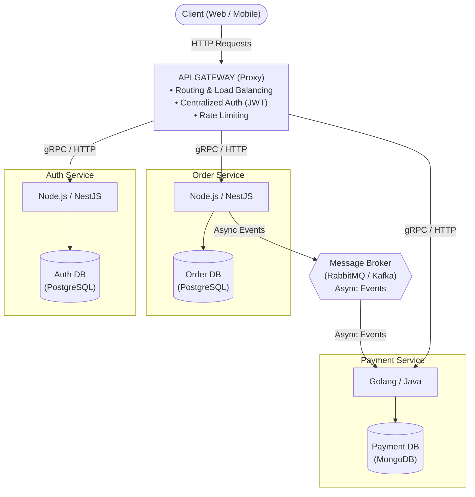
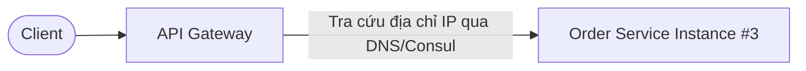

## I. KHÁI QUÁT (OVERVIEW)

### 1. Microservices Architecture là gì?
**Kiến trúc vi dịch vụ (Microservices Architecture)** là phương pháp tiếp cận thiết kế hệ thống phần mềm dưới dạng một tập hợp gồm nhiều dịch vụ nhỏ (services), độc lập và có tính liên kết lỏng lẻo (loosely coupled):
* **Phạm vi nghiệp vụ đơn nhất (Single Responsibility):** Mỗi service chỉ đảm nhận một miền nghiệp vụ chuyên biệt (Bounded Context) theo triết lý UNIX ("Do one thing and do it well").
* **Triển khai và Mở rộng độc lập (Independently Deployable & Scalable):** Mỗi service sở hữu quy trình CI/CD và vòng đời release riêng biệt mà không ảnh hưởng tới các dịch vụ khác.
* **Cơ sở dữ liệu riêng biệt (Database per Service):** Mỗi service sở hữu toàn quyền quản lý CSDL riêng của mình (Polyglot Persistence), các service khác không được phép truy cập trực tiếp vào DB của nhau.



---

## II. CHI TIẾT KỸ THUẬT (DETAILED DEEP DIVE)

### 1. Giao tiếp liên dịch vụ (Inter-Service Communication)

#### A. Giao tiếp đồng bộ (Synchronous)
Dịch vụ gọi (caller) gửi yêu cầu và **bắt buộc phải chờ phản hồi** từ dịch vụ nhận trước khi tiếp tục:
* **REST API (HTTP/1.1 JSON):** Cực kỳ phổ biến, dễ đọc hiểu và debug. Nhược điểm là tiêu tốn nhiều tài nguyên chuyển đổi JSON và độ trễ cao.
* **gRPC (HTTP/2 + Protocol Buffers):** Truyền tải dữ liệu dạng nhị phân (binary), chiếm băng thông cực nhỏ, hỗ trợ định kiểu tĩnh mạnh (strongly-typed) và streaming hai chiều. Thích hợp cho giao tiếp nội bộ tốc độ cao giữa các backend services.

#### B. Giao tiếp bất đồng bộ (Asynchronous Event-Driven)
Dịch vụ gửi thông điệp (Event/Message) vào trung gian (Broker) và **tiếp tục xử lý ngay lập tức** mà không cần đợi người nhận:
* **Message Queues (RabbitMQ):** Định tuyến thông điệp linh hoạt (Routing Key, Exchange), đảm bảo thông điệp không bị mất (ACK/NACK), phù hợp cho các tác vụ cần xử lý tuần tự hoặc phân phát việc (Job Queue).
* **Event Streaming (Apache Kafka):** Lưu trữ luồng sự kiện theo log tuần tự, thông lượng cực cao (hàng triệu events/giây), cho phép tua lại dữ liệu (Event Replay), phù hợp cho hệ thống tài chính, Big Data, phân tích hành vi.
* **Redis Pub/Sub:** Siêu nhẹ, độ trễ cực thấp, hoạt động theo cơ chế phát tán nhanh (Fire-and-Forget).

---

### 2. Thành phần thiết yếu: API Gateway & Service Discovery



* **API Gateway Pattern:** Đóng vai trò là cửa ngõ duy nhất (Single Entry Point) cho toàn bộ client bên ngoài:
  * Định tuyến yêu cầu (Reverse Proxy & Dynamic Routing).
  * Xác thực tập trung (Authentication & Authorization token validation).
  * Giới hạn tần suất gọi (Rate Limiting & Throttling) chống tấn công DDoS.
  * Gom dữ liệu (Request Aggregation / Backend-for-Frontend - BFF).
* **Service Discovery:** Trong môi trường đám mây hoặc Kubernetes, các container dịch vụ liên tục được sinh ra và hủy đi với IP biến đổi liên tục. Service Discovery giúp các service tự động đăng ký và tìm thấy địa chỉ IP hiện tại của nhau thông qua **DNS-based** (Kubernetes CoreDNS) hoặc **Service Registry** (HashiCorp Consul, Netflix Eureka).

---

### 3. Phân tích Đánh đổi: Ưu điểm vs Nhược điểm

| Tiêu chí | Ưu điểm (Pros) | Nhược điểm & Thách thức (Cons) |
| :--- | :--- | :--- |
| **Mở rộng (Scalability)** | Scale linh hoạt chỉ riêng dịch vụ chịu tải cao, tối ưu chi phí hạ tầng. | Hạ tầng phức tạp, tốn nhiều chi phí duy trì cụm K8s, Broker, Monitoring. |
| **Tự chủ (Autonomy)** | Các nhóm phát triển có thể release độc lập mà không cần chờ đợi nhau. | Khó kiểm thử tích hợp (End-to-End Testing) giữa các dịch vụ phân tán. |
| **Công nghệ (Polyglot)** | Tự do chọn công nghệ phù hợp nhất (Auth dùng Node.js, AI dùng Python, Payment dùng Go). | Đòi hỏi đội ngũ phải có kỹ năng đa dạng và kinh nghiệm sâu về hệ phân tán. |
| **Toàn vẹn dữ liệu** | Cô lập dữ liệu, lỗi một DB không ảnh hưởng các DB khác. | Mất tính nhất quán tức thời (ACID); phải áp dụng **Eventual Consistency** và **Saga Pattern**. |

---

## III. VÍ DỤ MINH HỌA VÀ PHÂN TÍCH CODE (CODE ANALYSIS)

Dưới đây là mô hình giao tiếp bất đồng bộ chuẩn: **Order Service** sau khi tạo đơn hàng sẽ phát ra sự kiện `order.created` qua **RabbitMQ**, **Notification Service** bắt sự kiện này để gửi email mà không làm chậm luồng tạo đơn của khách hàng.

### 1. Dịch vụ gửi sự kiện (Order Service phát event lên RabbitMQ)

```typescript
// ==============================================================
// File: order-service/src/orders/orders.service.ts
// ==============================================================
import { Injectable, Inject } from '@nestjs/common';
import { ClientProxy } from '@nestjs/microservices';

@Injectable()
export class OrdersService {
  constructor(
    // Inject RabbitMQ Client đã được đăng ký trong Module
    @Inject('NOTIFICATION_SERVICE') private readonly client: ClientProxy,
  ) {}

  async createOrder(orderData: { userId: string; amount: number }) {
    const newOrder = {
      orderId: `ORD-${Date.now()}`,
      userId: orderData.userId,
      amount: orderData.amount,
      createdAt: new Date(),
    };

    // 1. Lưu đơn hàng vào CSDL của riêng Order Service
    console.log(`[OrderService] Đã tạo đơn hàng thành công: ${newOrder.orderId}`);

    // 2. Phát tán Event bất đồng bộ (Fire-and-Forget) tới Message Broker
    this.client.emit('order.created', newOrder);
    console.log(`[OrderService] Đã gửi event 'order.created' tới RabbitMQ`);

    return newOrder;
  }
}
```

---

### 2. Dịch vụ nhận sự kiện (Notification Service lắng nghe từ RabbitMQ)

```typescript
// ==============================================================
// File: notification-service/src/notifications/notifications.controller.ts
// ==============================================================
import { Controller } from '@nestjs/common';
import { EventPattern, Payload, Ctx, RmqContext } from '@nestjs/microservices';

@Controller()
export class NotificationsController {
  
  // Lắng nghe sự kiện mang tên 'order.created'
  @EventPattern('order.created')
  async handleOrderCreated(@Payload() data: any, @Ctx() context: RmqContext) {
    console.log(`[NotificationService] Nhận được sự kiện đơn hàng mới:`, data);

    // Xử lý gửi email hoặc thông báo đẩy cho người dùng
    await this.sendConfirmationEmail(data.userId, data.orderId, data.amount);

    // Xác nhận đã xử lý message thành công (Manual Acknowledgment)
    const channel = context.getChannelRef();
    const originalMsg = context.getMessage();
    channel.ack(originalMsg);
  }

  private async sendConfirmationEmail(userId: string, orderId: string, amount: number) {
    console.log(`✉️ Đang gửi email xác nhận cho User ${userId}: Đơn hàng ${orderId} - Tổng tiền: ${amount} VND`);
  }
}
```

---

## IV. LƯU Ý, CẠM BẪY VÀ QUY TẮC CỐT LÕI (BEST PRACTICES)

> [!CAUTION]
> ### 1. Cạm bẫy "Distributed Monolith" (Kiến trúc nguyên khối phân tán)
> Đây là thảm họa kiến trúc phổ biến nhất: Bạn chia hệ thống thành 20 microservices nhưng các dịch vụ này:
> - Vẫn chọc chung vào 1 Database duy nhất.
> - Hoặc gọi lồng nhau liên tiếp qua HTTP đồng bộ (Service A -> Service B -> Service C).
> 
> Hậu quả là bạn phải chịu **toàn bộ nhược điểm của Monolith cộng thêm toàn bộ sự phức tạp của hệ phân tán** (độ trễ mạng cộng dồn, nghẽn chuỗi cascading failure, deploy phụ thuộc).

> [!WARNING]
> ### 2. Cạm bẫy bóc tách vi dịch vụ quá sớm (Premature Decomposition)
> Tách microservices khi domain nghiệp vụ chưa ổn định hoặc đội ngũ kỹ thuật dưới 10 người sẽ làm chậm tốc độ phát triển dự án từ 3 - 5 lần do chi phí vận hành mạng, phân tán mã nguồn và thiết lập hạ tầng lấn át thời gian viết tính năng.

> [!IMPORTANT]
> ### 3. Nguyên tắc "Database per Service" là bất khả xâm phạm
> Tuyệt đối không bao giờ để Service A kết nối thẳng vào bảng DB của Service B để truy vấn dữ liệu. Nếu Service A cần dữ liệu của Service B, bắt buộc phải thông qua API công khai hoặc cơ chế nhân bản dữ liệu qua Event Stream (CQRS pattern).

> [!TIP]
> ### 4. Luôn triển khai Correlation ID (Distributed Tracing)
> Trong hệ thống phân tán, một yêu cầu từ người dùng có thể đi qua Gateway và 5 services khác nhau. Hãy gán một mã định danh duy nhất (`X-Correlation-ID`) tại API Gateway và truyền mã này qua tất cả các gói tin HTTP/gRPC/Message Queue để có thể tra cứu toàn bộ vết xử lý lỗi trên hệ thống giám sát tập trung (Jaeger, Zipkin, OpenTelemetry).
