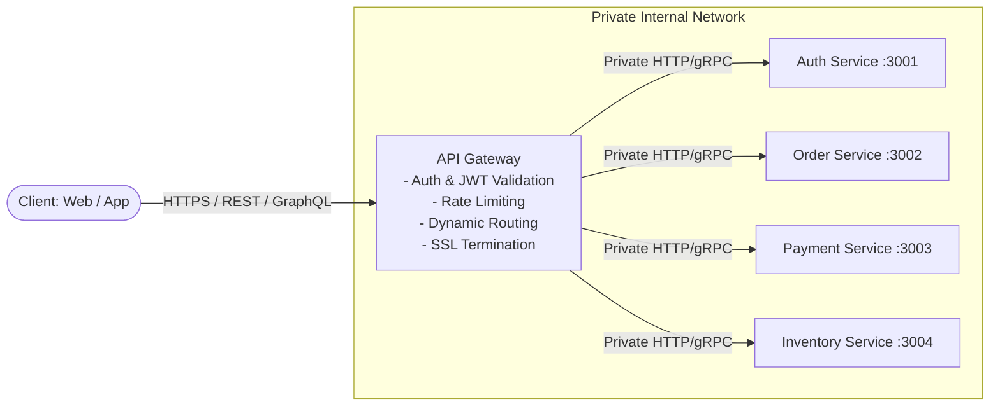
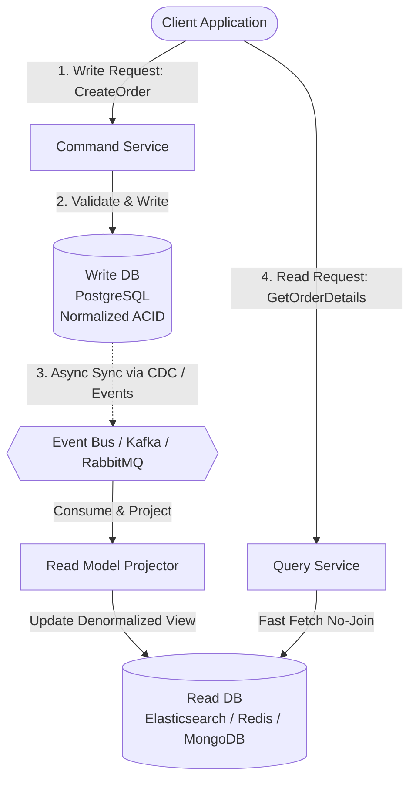
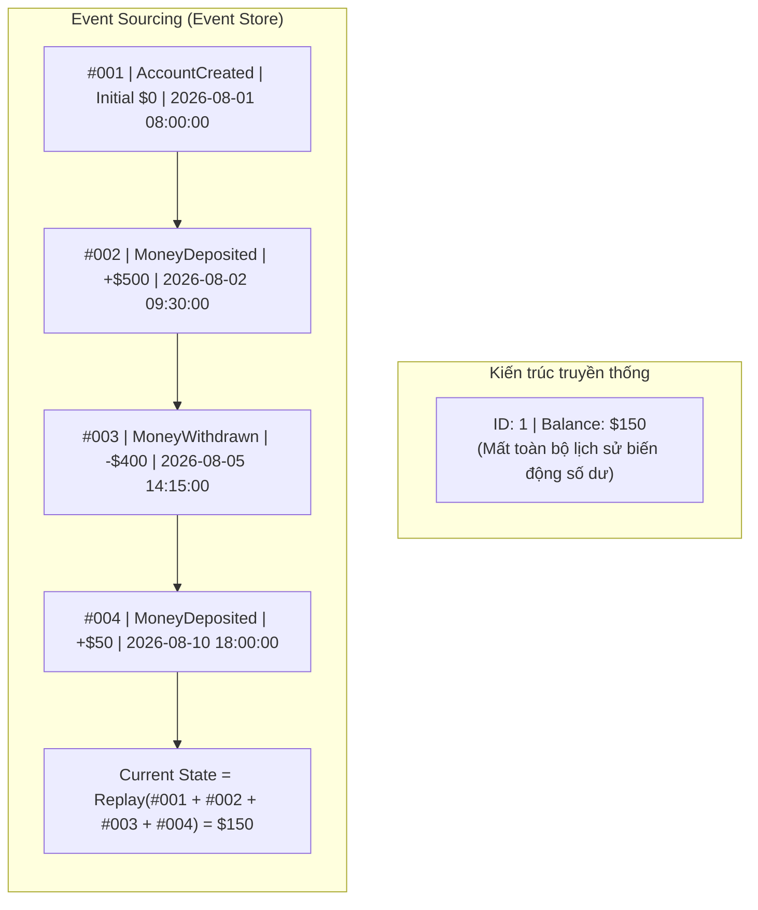
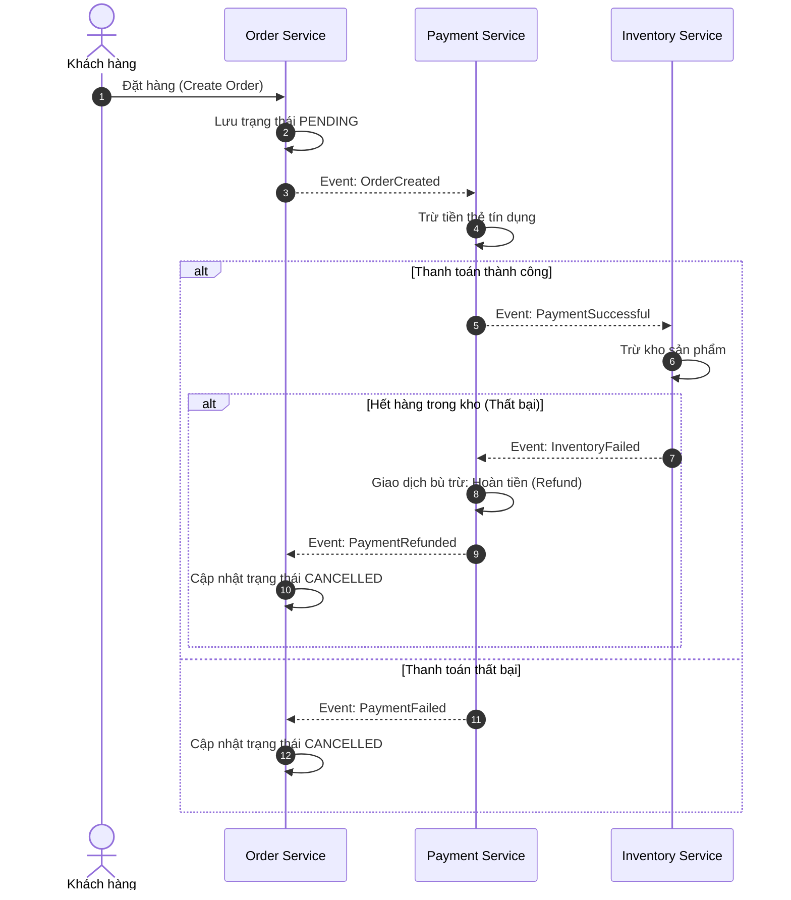
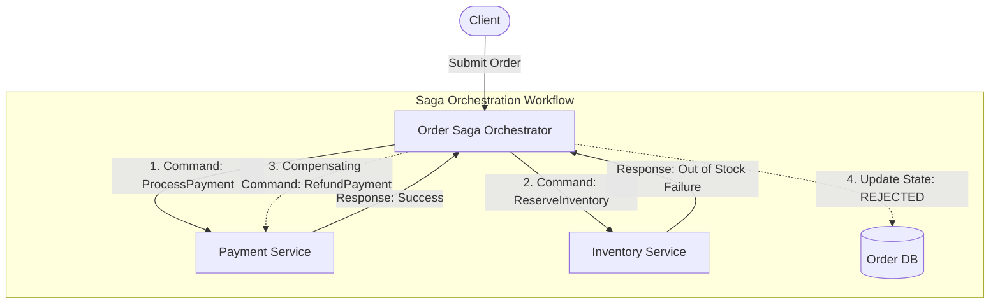
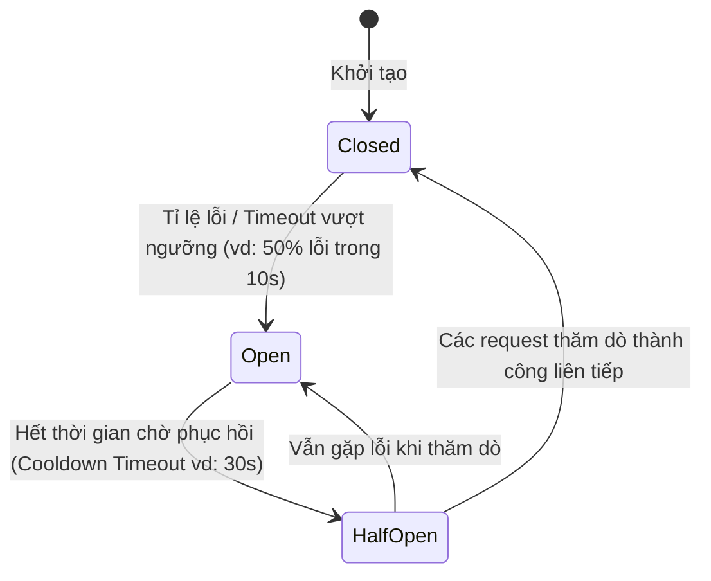
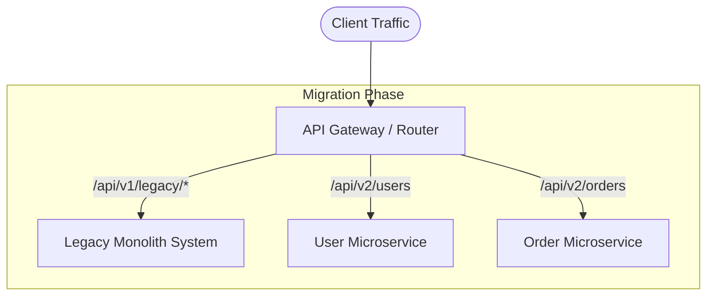

## I. KHÁI QUÁT (OVERVIEW)

### 1. Thách thức cốt lõi của Kiến trúc Microservices
Khi chuyển đổi từ kiến trúc Nguyên khối (Monolith) sang Đa dịch vụ (Microservices), hệ thống được chia nhỏ thành nhiều dịch vụ độc lập, mỗi dịch vụ quản lý cơ sở dữ liệu riêng (*Database-per-Service*). Sự phân tán này giải quyết được bài toán mở rộng quy mô nhóm phát triển và tài nguyên hạ tầng, nhưng đồng thời mang lại hàng loạt thách thức kiến trúc nghiêm trọng:

* **Quản lý giao dịch phân tán (Distributed Transactions):** Không còn cơ chế ACID transaction của một Database duy nhất. Một nghiệp vụ thương mại điện tử (Đặt hàng -> Trừ tiền ví -> Trừ tồn kho -> Vận chuyển) trải dài qua 4 services khác nhau. Nếu bước vận chuyển thất bại, làm sao khôi phục dữ liệu ở 3 bước trước?
* **Điểm tiếp nhận và điều hướng (Routing & Security):** Client (Mobile/Web) không thể và không nên kết nối trực tiếp đến hàng chục microservices nằm trong mạng nội bộ với các địa chỉ IP động.
* **Suy sụp dây chuyền (Cascading Failures):** Nếu Service A gọi Service B (đồng bộ qua HTTP), Service B gọi Service C, và Service C bị quá tải phản hồi chậm chạp, toàn bộ luồng xử lý và tài nguyên (thread, memory) của Service A và B sẽ bị cạn kiệt, kéo sập toàn bộ hệ sinh thái.
* **Truy vấn dữ liệu phức tạp (Cross-Service Queries):** Không thể thực hiện lệnh `JOIN` giữa 2 bảng nằm ở 2 cơ sở dữ liệu vật lý riêng biệt.

---

### 2. Tổng quan các Design Patterns kinh điển
Để giải quyết triệt để các vấn đề trên, cộng đồng kiến trúc phần mềm đã đúc kết các mẫu thiết kế (Design Patterns) chuẩn mực:

1. **API Gateway Pattern:** Cổng vào tập trung duy nhất, xử lý định tuyến, bảo mật, giới hạn tần suất và chuyển đổi giao thức.
2. **CQRS (Command Query Responsibility Segregation):** Tách bạch hoàn toàn luồng ghi (Command) và luồng đọc (Query) nhằm tối ưu hóa hiệu năng và mở rộng độc lập.
3. **Event Sourcing:** Lưu lại lịch sử toàn bộ các sự kiện thay đổi trạng thái theo thời gian thay vì chỉ ghi đè giá trị cuối cùng vào database.
4. **Saga Pattern:** Điều phối giao dịch phân tán thông qua chuỗi các giao dịch cục bộ và giao dịch bù trừ (Compensating Transactions).
5. **Circuit Breaker Pattern:** Cầu dao tự ngắt cuộc gọi đến dịch vụ đang lỗi để tránh quá tải và khôi phục tự động.
6. **Strangler Fig Pattern:** Chiến lược chia tách và di chuyển từng phần tính năng từ Monolith sang Microservices một cách an toàn mà không cần viết lại toàn bộ hệ thống từ đầu.

---

## II. CHI TIẾT KỸ THUẬT (DETAILED ARCHITECTURE DEEP DIVE)

### 1. API Gateway Pattern
API Gateway đóng vai trò như một Reverse Proxy thông minh đứng chắn trước toàn bộ mạng lưới microservices nội bộ.



#### Các chức năng cốt lõi:
* **Single Entry Point (Điểm vào duy nhất):** Ẩn giấu topology mạng nội bộ, client chỉ cần biết một domain duy nhất (vd: `api.example.com`).
* **Centralized Authentication & Authorization:** Xác thực JWT token, API Key ngay tại Gateway trước khi cho phép request đi sâu vào mạng nội bộ.
* **Rate Limiting & Throttling:** Chặn các cuộc tấn công Brute Force, DoS bằng cách giới hạn số lượng request theo IP/User (sử dụng Redis Token Bucket).
* **Protocol Translation:** Nhận HTTP/1.1 hoặc HTTP/2 từ Client, chuyển đổi sang gRPC hoặc Message Queue bên trong mạng nội bộ để đạt hiệu năng tối đa.
* **Công nghệ phổ biến:** Kong Gateway, Apache APISIX, Traefik, Nginx, NestJS Gateway (sử dụng `@nestjs/platform-express` + reverse proxy middleware).

---

### 2. CQRS Pattern (Command Query Responsibility Segregation)
Trong kiến trúc truyền thống (CRUD), cùng một Data Model được sử dụng cho cả thao tác Đọc và Ghi. Khi lượng truy cập tăng vọt, thao tác Đọc (chiếm 90% traffic, cần join nhiều bảng, search full-text) sẽ xung đột khóa (lock) với thao tác Ghi (cần tính toàn vẹn dữ liệu, validate chặt chẽ).

CQRS tách biệt hệ thống thành 2 nhánh:
1. **Command Side (Ghi/Cập nhật/Xóa):** Chỉ tập trung vào business logic, validate dữ liệu, ghi vào Write DB (thường là RDBMS chuẩn hóa cao như PostgreSQL/MySQL). Trả về kết quả xác nhận nhanh chóng.
2. **Query Side (Đọc):** Đọc từ Read DB được tối ưu hóa riêng cho việc truy vấn (denormalized data trong MongoDB, Elasticsearch hoặc Redis).



* **Khi nào nên dùng:**
  * Hệ thống có tỉ lệ đọc/ghi chênh lệch lớn (ví dụ: 100 Đọc / 1 Ghi).
  * Giao diện người dùng yêu cầu gom dữ liệu từ nhiều nguồn phức tạp.
  * Cần tối ưu hóa tốc độ tìm kiếm văn bản phức tạp (Elasticsearch).
* **Khi nào KHÔNG nên dùng:**
  * Ứng dụng CRUD đơn giản, lượng truy cập thấp đến trung bình.
  * Nghiệp vụ bắt buộc dữ liệu đọc phải nhất quán ngay lập tức (Strong Consistency), vì CQRS sử dụng **Eventual Consistency** (nhất quán sau một khoảng trễ đồng bộ ngắn).

---

### 3. Event Sourcing Pattern
Thay vì cập nhật trực tiếp trạng thái hiện tại của một bản ghi (ví dụ: `UPDATE bank_account SET balance = 1500 WHERE id = 1`), Event Sourcing lưu trữ tất cả các sự kiện thay đổi dưới dạng một chuỗi sự kiện bất biến (**Immutable Append-Only Log**).



#### Các khái niệm trọng yếu:
* **Event Store:** Cơ sở dữ liệu chuyên dụng để append-only các event (EventStoreDB, Kafka, hoặc bảng Postgres có index version).
* **Replay Events:** Tái dựng lại trạng thái của hệ thống tại bất kỳ thời điểm nào trong quá khứ (Time Travel Debugging / Audit Trail).
* **Snapshotting:** Nếu một Aggregate có hàng triệu sự kiện, việc replay từ đầu sẽ rất chậm. Cứ sau mỗi $N$ sự kiện (ví dụ: 1000 events), hệ thống tạo một bản ghi Snapshot trạng thái hiện tại. Khi cần load, hệ thống chỉ cần đọc Snapshot mới nhất rồi replay các event phát sinh sau đó.

---

### 4. Saga Pattern
Saga là chuỗi các giao dịch cục bộ (Local Transactions). Mỗi giao dịch cục bộ cập nhật database của một service riêng lẻ và phát ra Event/Message kích hoạt bước tiếp theo. Nếu một bước thất bại, Saga sẽ kích hoạt các **Compensating Transactions (Giao dịch bù trừ)** theo thứ tự ngược lại để hoàn tác các thay đổi đã thực hiện.

Có 2 mô hình triển khai Saga:

#### Mô hình 1: Choreography-based Saga (Event-driven phân tán)
Các service tự lắng nghe event của nhau và tự quyết định hành động tiếp theo mà không có người điều phối trung tâm.



#### Mô hình 2: Orchestration-based Saga (Điều phối tập trung)
Một Service đóng vai trò là **Saga Orchestrator** quản lý state machine, gửi lệnh (Command) đến từng service và lắng nghe phản hồi.



| Tiêu chí | Choreography Saga | Orchestration Saga |
| :--- | :--- | :--- |
| **Độ phức tạp** | Đơn giản khi chỉ có 2-4 bước | Cần cài đặt Orchestrator State Machine |
| **Khớp nối (Coupling)** | Khớp nối lỏng (Loose coupling qua Event) | Khớp nối tập trung vào Orchestrator |
| **Theo dõi luồng (Visibility)** | Rất khó debug khi workflow có nhiều bước | Rất dễ theo dõi trạng thái tổng thể tại một nơi |
| **Nguy cơ lặp vòng (Cyclic)** | Dễ bị lặp vô tận nếu cấu hình sai event | Kiểm soát chặt chẽ bằng code điều phối |

---

### 5. Circuit Breaker Pattern
Ngăn chặn sự cố sập nguồn dây chuyền khi một dịch vụ phụ thuộc phản hồi chậm hoặc ngừng hoạt động. Cầu dao hoạt động với 3 trạng thái:



1. **Closed (Đóng):** Mọi request đi qua bình thường. Hệ thống đếm tỉ lệ thất bại.
2. **Open (Mở/Ngắt mạch):** Cầu dao ngắt kết nối ngay lập tức! Các request đến sẽ bị từ chối ngay lập tức hoặc trả về kết quả dự phòng (**Fallback**) mà không tốn tài nguyên gọi service đích.
3. **Half-Open (Nửa mở):** Cho phép một số lượng giới hạn request đi qua để thăm dò. Nếu thành công -> chuyển về Closed. Nếu vẫn lỗi -> quay lại Open.

---

### 6. Strangler Fig Pattern (Chiến lược bóp nghẹt Monolith)
Lấy cảm hứng từ loài dây leo siết cây gỗ (Strangler Fig), mô hình này đặt một Interceptor (thường là API Gateway) trước hệ thống Monolith cũ. Từng tính năng mới hoặc từng module cũ được bóc tách và viết thành Microservices mới. Gateway sẽ chuyển dần traffic sang Microservices cho đến khi toàn bộ Monolith không còn nhận traffic và bị khai tử hoàn toàn.



---

## III. VÍ DỤ MINH HỌA VÀ PHÂN TÍCH CODE (CODE ANALYSIS)

### 1. Triển khai Circuit Breaker với Opossum trong Node.js

```typescript
// circuit-breaker.service.ts
import CircuitBreaker from 'opossum';
import axios from 'axios';

// Interface dữ liệu sản phẩm
interface ProductDetail {
  id: string;
  name: string;
  price: number;
  stock: number;
}

export class ProductClientService {
  private breaker: CircuitBreaker<[string], ProductDetail>;

  constructor() {
    // 1. Hàm thực thi gọi downstream service
    const fetchProductFromDownstream = async (productId: string): Promise<ProductDetail> => {
      const response = await axios.get<ProductDetail>(
        `http://inventory-service:3002/api/products/${productId}`,
        { timeout: 2000 } // Timeout 2 giây
      );
      return response.data;
    };

    // 2. Cấu hình Circuit Breaker
    const options: CircuitBreaker.Options = {
      timeout: 2500,               // Nếu request quá 2.5s coi như lỗi
      errorThresholdPercentage: 50, // Nếu >= 50% request lỗi trong rolling window -> OPEN
      resetTimeout: 10000,          // Sau 10s ở trạng thái OPEN -> chuyển sang HALF-OPEN
      rollingCountTimeout: 10000,   // Cửa sổ thống kê trượt: 10 giây
      rollingCountBuckets: 10       // Chia nhỏ thành 10 bucket (mỗi bucket 1s)
    };

    this.breaker = new CircuitBreaker(fetchProductFromDownstream, options);

    // 3. Cấu hình cơ chế Fallback (Dự phòng khi sập mạng)
    this.breaker.fallback((productId: string) => {
      console.warn(`[CircuitBreaker] Fallback kích hoạt cho Product ID: ${productId}`);
      return {
        id: productId,
        name: 'Sản phẩm tạm thời không hiển thị chi tiết (Dữ liệu Offline)',
        price: 0,
        stock: 0
      };
    });

    // 4. Lắng nghe các sự kiện trạng thái của Cầu dao
    this.breaker.on('open', () => {
      console.error('[CircuitBreaker] ⚠️ CẦU DAO ĐÃ MỞ (OPEN)! Downstream sập, chuyển sang Fallback.');
    });

    this.breaker.on('halfOpen', () => {
      console.log('[CircuitBreaker] 🔄 CẦU DAO NỬA MỞ (HALF-OPEN): Đang gửi request thăm dò...');
    });

    this.breaker.on('close', () => {
      console.log('[CircuitBreaker] ✅ CẦU DAO ĐÃ ĐÓNG (CLOSED): Dịch vụ downstream đã hồi phục.');
    });
  }

  public async getProduct(productId: string): Promise<ProductDetail> {
    // Thực thi thông qua breaker
    return await this.breaker.fire(productId);
  }
}
```

---

### 2. Triển khai Saga Orchestrator cho quy trình Đặt hàng

```typescript
// order-saga-orchestrator.ts
import { EventEmitter } from 'events';

export interface OrderState {
  orderId: string;
  customerId: string;
  amount: number;
  items: Array<{ sku: string; qty: number }>;
  status: 'PENDING' | 'PAYMENT_COMPLETED' | 'INVENTORY_RESERVED' | 'CONFIRMED' | 'FAILED';
  failureReason?: string;
}

export class OrderSagaOrchestrator {
  // Giả lập các HTTP/gRPC Client gọi microservices
  private async callPaymentService(order: OrderState): Promise<boolean> {
    console.log(`[PaymentService] Đang trừ tiền $${order.amount} của User: ${order.customerId}`);
    // Giả lập logic kiểm tra: nếu amount > 10000 thì từ chối do vượt hạn mức
    if (order.amount > 10000) throw new Error('Vượt hạn mức tín dụng');
    return true;
  }

  private async callPaymentRefund(order: OrderState): Promise<void> {
    console.log(`[Compensating] 💸 HOÀN TIỀN $${order.amount} cho User: ${order.customerId}`);
  }

  private async callInventoryService(order: OrderState): Promise<boolean> {
    console.log(`[InventoryService] Đang khóa tồn kho cho đơn hàng: ${order.orderId}`);
    // Giả lập lỗi hết hàng cho SKU cụ thể
    for (const item of order.items) {
      if (item.sku === 'OUT_OF_STOCK_ITEM') {
        throw new Error(`Mặt hàng ${item.sku} đã hết`);
      }
    }
    return true;
  }

  private async callInventoryRelease(order: OrderState): Promise<void> {
    console.log(`[Compensating] 📦 NHẢ TỒN KHO cho đơn hàng: ${order.orderId}`);
  }

  // Luồng điều phối Saga chính
  public async executeSaga(order: OrderState): Promise<OrderState> {
    console.log(`\n--- BẮT ĐẦU SAGA ĐẶT HÀNG: ${order.orderId} ---`);
    let paymentSuccess = false;
    let inventorySuccess = false;

    try {
      // BƯỚC 1: Xử lý thanh toán
      await this.callPaymentService(order);
      paymentSuccess = true;
      order.status = 'PAYMENT_COMPLETED';

      // BƯỚC 2: Khóa tồn kho
      await this.callInventoryService(order);
      inventorySuccess = true;
      order.status = 'INVENTORY_RESERVED';

      // BƯỚC 3: Hoàn tất đơn hàng
      order.status = 'CONFIRMED';
      console.log(`[Saga] 🎉 ĐƠN HÀNG ${order.orderId} ĐÃ XÁC NHẬN THÀNH CÔNG!`);
      return order;

    } catch (error: any) {
      console.error(`[Saga] ❌ LỖI TẠI BƯỚC THỰC THI: ${error.message}`);
      order.status = 'FAILED';
      order.failureReason = error.message;

      // KÍCH HOẠT COMPENSATING TRANSACTIONS (GIAO DỊCH BÙ TRỪ)
      console.log(`[Saga] ⚠️ ĐANG KÍCH HOẠT GIAO DỊCH BÙ TRỪ...`);

      if (inventorySuccess) {
        // Nếu kho đã trừ nhưng bước sau chết -> Nhả kho
        await this.callInventoryRelease(order);
      }

      if (paymentSuccess) {
        // Nếu tiền đã trừ nhưng kho thất bại -> Hoàn lại tiền
        await this.callPaymentRefund(order);
      }

      console.log(`[Saga] 🏁 HOÀN TẤT ROLLBACK PHÂN TÁN CHO ĐƠN HÀNG ${order.orderId}`);
      return order;
    }
  }
}
```

---

## IV. LƯU Ý CẠM BẪY VÀ QUY TẮC CỐT LÕI (BEST PRACTICES)

> [!CAUTION]
> ### 1. Giao dịch bù trừ (Compensating Transactions) không thể Rollback 100%
> Không giống như lệnh `ROLLBACK` trong SQL (xóa sạch dấu vết như chưa từng xảy ra), giao dịch bù trừ trong Saga là một **hành động mới** mang tính điều chỉnh (ví dụ: `REFUND` tiền). 
> * Cạm bẫy: Khách hàng có thể nhìn thấy tài khoản bị trừ tiền rồi lại được hoàn tiền 5 giây sau đó.
> * Bạn bắt buộc phải thiết kế giao diện UI xử lý trạng thái chờ (Pending) một cách thân thiện với người dùng.

> [!WARNING]
> ### 2. Tránh "Over-Engineering" với CQRS và Event Sourcing
> * Không bao giờ áp dụng CQRS + Event Sourcing cho toàn bộ mọi entity trong hệ thống.
> * Chỉ áp dụng CQRS cho những module có sự khác biệt rõ rệt về tần suất đọc/ghi hoặc cấu trúc hiển thị dữ liệu phức tạp.
> * Event Sourcing đòi hỏi cơ chế quản lý Schema Evolution (khi cấu trúc Event thay đổi theo năm tháng) rất phức tạp.

> [!IMPORTANT]
> ### 3. Tính Idempotency (Bất biến lũy thừa) là bắt buộc
> Trong Saga và Event-driven architecture, sự cố mạng chập chờn có thể khiến Message Broker gửi lại một Event/Command 2 lần. 
> * Tất cả các hàm xử lý bù trừ hoặc xử lý thanh toán **bắt buộc phải idempotent** (thực thi 1 lần hay 10 lần đều cho cùng một kết quả duy nhất).
> * Sử dụng `idempotency_key` (hoặc `transaction_id`) lưu vào Redis/Database để kiểm tra xem request đã từng được xử lý hay chưa.

> [!TIP]
> ### 4. Quy tắc vàng khi áp dụng Strangler Fig Pattern
> Khi di chuyển từ Monolith sang Microservices:
> 1. Bắt đầu với những module "ngoại biên" ít quan trọng, ít phụ thuộc (ví dụ: Notification Service, Image Processing Service).
> 2. Thiết lập quy chuẩn Observability (Distributed Tracing với OpenTelemetry, Correlation ID) ngay từ ngày đầu tiên để có thể truy vết request xuyên suốt từ Monolith sang các Microservices mới.
