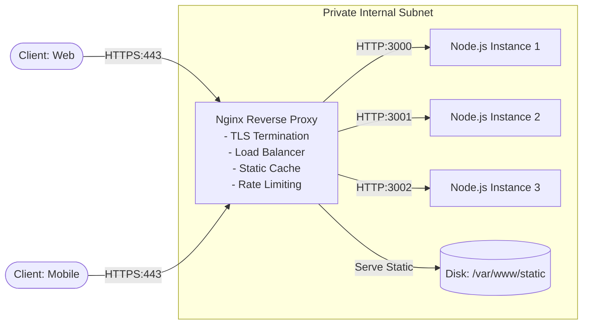
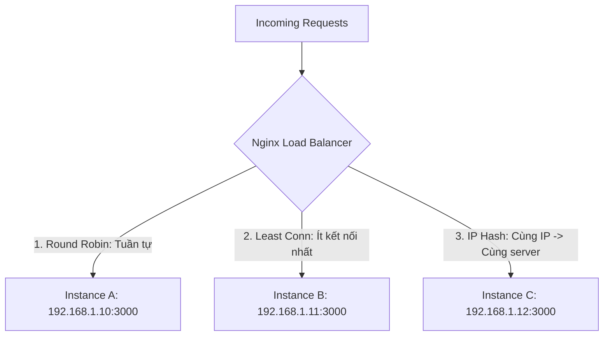

## I. KHÁI QUÁT (OVERVIEW)

### 1. Reverse Proxy là gì?
Trong kiến trúc Web hiện đại, ứng dụng Node.js/NestJS hiếm khi được mở trực tiếp ra mạng Internet công cộng. Thay vào đó, **Nginx** được đặt ở tiền tuyến làm **Reverse Proxy**.

* **Forward Proxy:** Đứng trước Client để đại diện cho Client gửi request ra ngoài Internet (ẩn danh IP của người dùng, vượt tường lửa).
* **Reverse Proxy:** Đứng trước các Backend Servers để đại diện cho Server tiếp nhận toàn bộ request từ Internet gửi vào. Client chỉ giao tiếp với Nginx mà không hề biết sự tồn tại, địa chỉ IP hay số lượng server Node.js chạy phía sau.



---

### 2. Tại sao Nginx là thành phần không thể thiếu cho Node.js?
Node.js hoạt động dựa trên cơ chế đơn luồng (Single-threaded Event Loop). Mặc dù rất mạnh về xử lý I/O bất đồng bộ, Node.js sẽ bị nghẽn nghiêm trọng nếu phải gánh các tác vụ:
1. **Mã hóa / Giải mã SSL/TLS (HTTPS Handshake):** Tốn rất nhiều chu kỳ xử lý CPU (CPU-bound).
2. **Phục vụ tệp tĩnh (Static Assets):** Đọc file ảnh, video, CSS từ ổ đĩa và stream cho hàng ngàn người dùng làm lãng phí Event Loop.
3. **Chống tấn công DDoS & Brute Force:** Nginx được viết bằng C với kiến trúc Asynchronous Event-driven (epoll/kqueue) có thể xử lý hơn 100.000 kết nối đồng thời với bộ nhớ RAM cực thấp.

---

## II. CHI TIẾT KỸ THUẬT (DETAILED DEEP DIVE)

### 1. Cấu trúc tệp cấu hình Nginx (`nginx.conf`)
Cấu hình Nginx được tổ chức theo dạng cây phân cấp lồng nhau:

```text
main (Global Context: user, worker_processes, pid)
 └── events (Số kết nối đồng thời: worker_connections)
      └── http (Cấu hình chung HTTP, Gzip, MIME types, Upstreams)
           ├── server (Khai báo Virtual Host / Domain / Port)
           │    ├── location / (Định tuyến URL cụ thể)
           │    └── location /static (Phục vụ tệp tĩnh)
           └── server (Virtual Host thứ hai)
```

---

### 2. Các thuật toán Cân bằng tải (Load Balancing Algorithms)
Khối `upstream` trong Nginx cho phép gom nhóm nhiều instance ứng dụng Node.js và phân phối tải theo các chiến lược:



1. **Round Robin (Mặc định):** Phân phối tuần tự từng request lần lượt cho từng server trong danh sách.
2. **Least Connections (`least_conn`):** Chuyển request đến server hiện đang có ít kết nối hoạt động (active connections) nhất. Rất thích hợp cho các request tốn thời gian xử lý không đồng đều (ví dụ: upload file, xuất báo cáo PDF).
3. **IP Hash (`ip_hash`):** Băm địa chỉ IP của Client để xác định server phục vụ. Đảm bảo cùng một IP sẽ luôn luôn được kết nối đến cùng một server (duy trì Stateful Session nếu chưa chuyển sang dùng Redis Session).
4. **Weighted Load Balancing (`weight=n`):** Phân phối theo tỉ lệ cấu hình phần cứng. Server có cấu hình mạnh hơn sẽ gánh nhiều traffic hơn:
   ```nginx
   upstream backend_nodes {
       server 10.0.0.1:3000 weight=3; # Nhận 3/4 tổng lưu lượng
       server 10.0.0.2:3000 weight=1; # Nhận 1/4 tổng lưu lượng
   }
   ```
5. **Dự phòng & Cách ly (`backup` và `down`):**
   ```nginx
   upstream backend_nodes {
       server 10.0.0.1:3000;
       server 10.0.0.2:3000 down;   # Tạm thời bảo trì, không nhận traffic
       server 10.0.0.3:3000 backup; # Chỉ kích hoạt khi các server trên sập hoàn toàn
   }
   ```

---

### 3. TLS / SSL Termination (Giải mã SSL tập trung)
Nginx nhận kết nối HTTPS (Port 443) từ Client, thực hiện bắt tay mã hóa SSL và giải mã payload, sau đó chuyển request dưới dạng **HTTP thuần túy (Port 3000)** qua mạng nội bộ bảo mật (Private Subnet) đến Node.js.
* **Lợi ích:** Node.js hoàn toàn giải phóng năng lực tính toán để tập trung 100% cho Business Logic.
* **Quản lý chứng chỉ tập trung:** Bạn chỉ cần cài đặt và gia hạn chứng chỉ SSL (Let's Encrypt / Certbot) tại 1 vị trí duy nhất trên máy chủ Nginx.

---

### 4. Phục vụ và Bộ đệm tệp tĩnh (Static Asset Caching)
Nginx sử dụng lệnh hệ thống `sendfile` và `tcp_nopush` của nhân Linux để truyền trực tiếp nội dung file từ đĩa cứng ra card mạng mà không cần copy qua vùng nhớ ứng dụng (Zero-copy).

```nginx
location /static/ {
    alias /var/www/my-app/public/;
    expires 30d;
    add_header Cache-Control "public, no-transform, immutable";
    access_log off; # Tắt log để tiết kiệm I/O đĩa
}
```

---

### 5. Giới hạn tần suất truy cập (Rate Limiting)
Nginx sử dụng thuật toán **Leaky Bucket (Thùng rò rỉ)** để kiểm soát tốc độ request:
* `limit_req_zone`: Định nghĩa vùng nhớ lưu trữ trạng thái IP và tốc độ cho phép (ví dụ: `10r/s` = 10 requests/giây).
* `limit_req`: Áp dụng vào location cụ thể với các tham số:
  * `burst=N`: Số request tối đa được phép xếp hàng đợi tạm thời khi có đột biến vượt ngưỡng.
  * `nodelay`: Xử lý ngay lập tức các request trong vùng burst mà không bắt client phải chờ, nhưng nếu vượt quá tổng `rate + burst` thì lập tức trả về lỗi `HTTP 429 Too Many Requests`.

---

## III. VÍ DỤ MINH HỌA VÀ PHÂN TÍCH CODE (CODE ANALYSIS)

Dưới đây là tệp cấu hình `nginx.conf` hoàn chỉnh chuẩn Production, hỗ trợ cân bằng tải đa instance NestJS, giải mã SSL/TLS, nén Gzip, Proxy WebSockets và cơ chế kiểm tra sức khỏe backend:

```nginx
# /etc/nginx/nginx.conf

user nginx;
# Tự động phát hiện và sử dụng toàn bộ số nhân CPU có trên máy chủ
worker_processes auto;
pid /var/run/nginx.pid;

events {
    # Số kết nối đồng thời tối đa trên mỗi worker process
    worker_connections 2048;
    # Cho phép 1 worker chấp nhận nhiều kết nối mới cùng lúc
    multi_accept on;
    # Sử dụng cơ chế I/O multiplexing hiệu năng cao nhất trên Linux
    use epoll;
}

http {
    include /etc/nginx/mime.types;
    default_type application/octet-stream;

    # Tối ưu hóa truyền tải dữ liệu đĩa cứng (Zero-Copy)
    sendfile on;
    tcp_nopush on;
    tcp_nodelay on;
    keepalive_timeout 65;
    types_hash_max_size 2048;

    # Ẩn thông tin phiên bản Nginx để tăng cường bảo mật
    server_tokens off;

    # =========================================================================
    # CẤU HÌNH GZIP NÉN DỮ LIỆU TRẢ VỀ CHO CLIENT
    # =========================================================================
    gzip on;
    gzip_vary on;
    gzip_proxied any;
    gzip_comp_level 6; # Mức nén cân bằng giữa CPU và dung lượng
    gzip_min_length 1024;
    gzip_types
        text/plain
        text/css
        text/xml
        text/javascript
        application/json
        application/javascript
        application/xml
        application/xml+rss
        image/svg+xml;

    # =========================================================================
    # RATE LIMITING: Chống Brute Force & Spam Request
    # =========================================================================
    # Tạo vùng nhớ 10MB lưu trữ IP, giới hạn tốc độ 10 requests/giây
    limit_req_zone $binary_remote_addr zone=api_limit_zone:10m rate=10r/s;
    # Giới hạn khắt khe hơn cho trang Login (5 requests/phút)
    limit_req_zone $binary_remote_addr zone=login_limit_zone:10m rate=5r/m;
    # Mã lỗi trả về khi bị chặn
    limit_req_status 429;

    # =========================================================================
    # LOAD BALANCING UPSTREAM: Cụm máy chủ NestJS / Node.js
    # =========================================================================
    upstream nestjs_cluster {
        # Thuật toán ưu tiên server ít kết nối nhất
        least_conn;

        # Danh sách các instance ứng dụng nội bộ
        # max_fails=3 fail_timeout=10s: Nếu lỗi 3 lần liên tiếp trong 10s, tạm coi như server chết
        server 127.0.0.1:3001 max_fails=3 fail_timeout=10s;
        server 127.0.0.1:3002 max_fails=3 fail_timeout=10s;
        server 127.0.0.1:3003 max_fails=3 fail_timeout=10s backup;

        # Duy trì kết nối TCP keepalive đến backend để giảm chi phí bắt tay TCP
        keepalive 32;
    }

    # =========================================================================
    # SERVER BLOCK: HTTP CHUYỂN HƯỚNG SANG HTTPS (Port 80 -> 443)
    # =========================================================================
    server {
        listen 80;
        listen [::]:80;
        server_name api.myservice.com;

        # Chuyển hướng vĩnh viễn toàn bộ traffic sang HTTPS
        return 301 https://$host$request_uri;
    }

    # =========================================================================
    # SERVER BLOCK: HTTPS CHÍNH (Port 443)
    # =========================================================================
    server {
        listen 443 ssl http2;
        listen [::]:443 ssl http2;
        server_name api.myservice.com;

        # Cấu hình SSL / TLS
        ssl_certificate /etc/letsencrypt/live/api.myservice.com/fullchain.pem;
        ssl_certificate_key /etc/letsencrypt/live/api.myservice.com/privkey.pem;
        ssl_protocols TLSv1.2 TLSv1.3;
        ssl_ciphers HIGH:!aNULL:!MD5;
        ssl_prefer_server_ciphers on;
        ssl_session_cache shared:SSL:10m;
        ssl_session_timeout 1d;

        # Giới hạn kích thước file upload tối đa (Tránh tràn RAM)
        client_max_body_size 25M;

        # Cấu hình Security Headers
        add_header X-Frame-Options "SAMEORIGIN" always;
        add_header X-XSS-Protection "1; mode=block" always;
        add_header X-Content-Type-Options "nosniff" always;
        add_header Referrer-Policy "no-referrer-when-downgrade" always;

        # ---------------------------------------------------------------------
        # 1. Phục vụ Static Files trực tiếp từ ổ cứng
        # ---------------------------------------------------------------------
        location /static/ {
            alias /var/www/nestjs-app/public/;
            expires 7d;
            add_header Cache-Control "public, max-age=604800, immutable";
            access_log off;
        }

        # ---------------------------------------------------------------------
        # 2. Rate Limiting đặc biệt cho Route Xác thực (Login / Register)
        # ---------------------------------------------------------------------
        location /api/v1/auth/login {
            limit_req zone=login_limit_zone burst=3 nodelay;

            proxy_pass http://nestjs_cluster;
            include /etc/nginx/proxy_params_common;
        }

        # ---------------------------------------------------------------------
        # 3. Proxy API Request & Hỗ trợ WebSockets
        # ---------------------------------------------------------------------
        location / {
            # Áp dụng Rate Limit cho toàn bộ API thông thường
            limit_req zone=api_limit_zone burst=20 nodelay;

            # Chuyển tiếp request đến cụm upstream
            proxy_pass http://nestjs_cluster;

            # BẮT BUỘC: Cấu hình HTTP/1.1 và Headers cho WebSockets / SSE
            proxy_http_version 1.1;
            proxy_set_header Upgrade $http_upgrade;
            proxy_set_header Connection "upgrade";

            # BẮT BUỘC: Chuyển tiếp đúng IP thật của Client vào Node.js
            proxy_set_header Host $host;
            proxy_set_header X-Real-IP $remote_addr;
            proxy_set_header X-Forwarded-For $proxy_add_x_forwarded_for;
            proxy_set_header X-Forwarded-Proto $scheme;

            # Tối ưu hóa Buffer phản hồi để tránh lỗi 502 Bad Gateway
            proxy_buffering on;
            proxy_buffer_size 128k;
            proxy_buffers 4 256k;
            proxy_busy_buffers_size 256k;

            # Cấu hình Timeout kết nối đến backend Node.js
            proxy_connect_timeout 5s;
            proxy_send_timeout 60s;
            proxy_read_timeout 60s;
        }
    }
}
```

---

## IV. LƯU Ý CẠM BẪY VÀ QUY TẮC CỐT LÕI (BEST PRACTICES)

> [!CAUTION]
> ### 1. Cạm bẫy WebSocket Proxy (Lỗi ngắt kết nối liên tục)
> Mặc định Nginx sử dụng giao thức `HTTP/1.0` khi proxy và xóa bỏ header `Upgrade`. 
> Nếu bạn xây dựng tính năng Chat hoặc Realtime bằng Socket.io / NestJS WebSockets:
> * **Bắt buộc** phải có 2 dòng sau trong `location`:
>   ```nginx
>   proxy_http_version 1.1;
>   proxy_set_header Upgrade $http_upgrade;
>   proxy_set_header Connection "upgrade";
>   ```
> * Nếu thiếu, kết nối WebSocket sẽ bị Nginx hạ cấp về HTTP polling hoặc bị đóng kết nối ngay lập tức!

> [!WARNING]
> ### 2. Lỗi `502 Bad Gateway` do Buffer Size quá nhỏ
> Khi API trả về response JSON kích thước lớn hoặc Cookie/JWT header có độ dài vượt quá giới hạn mặc định (4KB hoặc 8KB), Nginx sẽ ghi log: `upstream sent too big header while reading response header from upstream` và trả về mã lỗi `502 Bad Gateway` cho client.
> * **Khắc phục:** Tăng kích thước bộ đệm `proxy_buffer_size 128k;` và `proxy_buffers 4 256k;`.

> [!IMPORTANT]
> ### 3. Lấy đúng Client IP trong Express / NestJS (`trust proxy`)
> Khi request đi qua Nginx, biến `req.ip` hoặc `req.socket.remoteAddress` trong Node.js mặc định sẽ trả về địa chỉ IP cục bộ của Nginx (`127.0.0.1`).
> * Để Node.js đọc đúng IP thật của người dùng từ header `X-Forwarded-For`, bạn **bắt buộc** phải kích hoạt `trust proxy` trong NestJS/Express:
>   ```typescript
>   // main.ts trong NestJS
>   import { NestFactory } from '@nestjs/core';
>   import { NestExpressApplication } from '@nestjs/platform-express';
>   import { AppModule } from './app.module';
>
>   async function bootstrap() {
>     const app = await NestFactory.create<NestExpressApplication>(AppModule);
>     app.set('trust proxy', 1); // 1 = Tin tưởng Reverse Proxy đầu tiên đứng trước
>     await app.listen(3000);
>   }
>   bootstrap();
>   ```

> [!TIP]
> ### 4. Kiểm tra cú pháp trước khi Reload cấu hình Nginx
> Không bao giờ chạy trực tiếp lệnh reload khi chưa kiểm tra tính hợp lệ của cú pháp. Chỉ một dấu chấm phẩy `;` bị thiếu có thể đánh sập toàn bộ hệ thống đang chạy.
> * **Quy trình chuẩn trong Production:**
>   ```bash
>   # Bước 1: Kiểm tra tính hợp lệ của file cấu hình
>   nginx -t
>   
>   # Bước 2: Chỉ khi output báo 'syntax is ok', mới thực hiện Zero-Downtime Reload
>   nginx -s reload
>   ```
