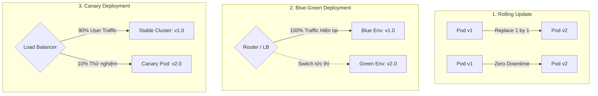

## I. KHÁI QUÁT (OVERVIEW)

### 1. Tại sao Backend Developer cần CI/CD?
Trong quy trình phát triển truyền thống, việc kiểm thử và triển khai ứng dụng thường làm thủ công: Lập trình viên chạy lệnh `npm test` trên máy cá nhân, sau đó SSH vào máy chủ Production, chạy lệnh `git pull`, `npm run build`, và `pm2 restart`.

Quy trình thủ công này chứa đựng nhiều rủi ro nghiêm trọng:
* **"Chạy được trên máy em nhưng lỗi trên server":** Thiếu môi trường kiểm chuẩn tự động và độc lập.
* **Lọt lỗi (Human Error):** Quên chạy linter, quên chạy test trước khi deploy, hoặc deploy nhầm branch/commit.
* **Thời gian gián đoạn (Downtime):** Máy chủ bị ngắt kết nối trong lúc build code hoặc gặp sự cố crash mà không thể rollback nhanh.

**CI/CD (Continuous Integration & Continuous Delivery/Deployment)** là quy trình tự động hóa toàn diện từ lúc lập trình viên `git push` mã nguồn cho đến khi ứng dụng được kiểm thử, đóng gói thành Docker Image và triển khai an toàn lên Production.

```mermaid
flowchart LR
    Dev([Developer]) -->|1. Git Push| Repo[Git Repository\nGitHub / GitLab]
    
    subgraph CI Pipeline: Continuous Integration
        Repo -->|Trigger| Lint[1. Lint & Type Check]
        Lint -->|Pass| Test[2. Unit & E2E Tests]
        Test -->|Pass| BuildPkg[3. Build Artifact / Docker]
    end
    
    subgraph CD Pipeline: Delivery & Deployment
        BuildPkg --> PushRegistry[4. Push Image to Registry\n(Docker Hub / GHCR / ECR)]
        PushRegistry --> DeployEnv[5. Deploy to Production\n(K8s / ECS / VPS)]
    end
```

---

### 2. Phân biệt Continuous Delivery vs Continuous Deployment

| Tiêu chí | Continuous Delivery (Chuyển giao liên tục) | Continuous Deployment (Triển khai liên tục) |
| :--- | :--- | :--- |
| **Quy trình Build & Test** | Tự động hóa 100% | Tự động hóa 100% |
| **Quy trình triển khai Staging** | Tự động hóa 100% | Tự động hóa 100% |
| **Bước triển khai Production** | **Cần phê duyệt thủ công (Manual Approval)** của Tech Lead / Release Manager | **Tự động hóa hoàn toàn 100%** ngay sau khi bộ test vượt qua thành công |
| **Mức độ rủi ro** | Thấp, kiểm soát chặt chẽ theo lịch phát hành (Release Schedule) | Yêu cầu hệ thống Automated Testing & Observability cực kỳ vững chắc |

---

## II. CHI TIẾT KỸ THUẬT (DETAILED DEEP DIVE)

### 1. Cấu trúc cốt lõi của GitHub Actions
GitHub Actions là nền tảng CI/CD tích hợp trực tiếp trong GitHub. Các tệp cấu hình được viết bằng YAML đặt tại thư mục `.github/workflows/*.yml`.

```mermaid
flowchart TD
    Event[Event Trigger: push / pull_request / workflow_dispatch] --> Workflow[Workflow File]
    
    subgraph Workflow Execution
        Workflow --> Job1[Job 1: test & lint]
        Job1 -->|Pass (needs: test)| Job2[Job 2: build & push docker]
        Job2 -->|Pass (needs: build)| Job3[Job 3: deploy to server]
    end
    
    subgraph Runner Environment
        Job1 --> S1[Step 1: actions/checkout@v4]
        Job1 --> S2[Step 2: actions/setup-node@v4]
        Job1 --> S3[Step 3: npm ci & npm run test]
    end
```

* **Workflow:** Quy trình tự động hóa cấp cao nhất.
* **Events / Triggers:** Sự kiện kích hoạt workflow (ví dụ: `push` vào branch `main`, tạo `pull_request`, theo lịch `schedule: cron`, hoặc kích hoạt bằng tay `workflow_dispatch`).
* **Jobs:** Các khối tác vụ chạy trên máy ảo biệt lập (**Runner**, ví dụ: `ubuntu-latest`). Mặc định các Job chạy **song song (parallel)**. Nếu muốn chạy tuần tự, sử dụng chỉ dẫn `needs: [job_name]`.
* **Steps:** Các bước thực thi tuần tự bên trong một Job (chạy lệnh shell hoặc tái sử dụng Action có sẵn từ GitHub Marketplace).

---

### 2. Chiến lược Triển khai phần mềm (Deployment Strategies)



1. **Recreate Deployment:** Dừng toàn bộ phiên bản cũ (v1) rồi mới khởi động phiên bản mới (v2). Có thời gian chết (**Downtime**), chỉ dùng cho môi trường dev/staging nội bộ.
2. **Rolling Update:** Cập nhật dần từng instance một (ví dụ: tắt 1 container v1, bật 1 container v2; kiểm tra sống rồi mới tắt tiếp container v1 thứ hai). **Không có downtime**, phù hợp cho đa số ứng dụng web.
3. **Blue-Green Deployment:** Duy trì 2 môi trường Production giống hệt nhau (Blue chạy v1 đang online, Green chạy v2 mới deploy). Sau khi kiểm thử toàn diện trên Green, Load Balancer chỉ việc đổi hướng toàn bộ traffic sang Green trong tích tắc (Zero-downtime & Instant Rollback).
4. **Canary Deployment:** Triển khai phiên bản mới cho một nhóm nhỏ người dùng (5% - 10% traffic). Theo dõi sát sao tỉ lệ lỗi (Error Rate) và độ trễ (Latency). Nếu ổn định mới tăng dần lên 25%, 50%, 100%.

---

### 3. Docker Registry & Quản lý Container Images
Docker Image sau khi build thành công trong CI Pipeline cần được lưu trữ tại một **Container Registry** tập trung trước khi máy chủ Production kéo về chạy:
* **GitHub Container Registry (ghcr.io):** Tích hợp sâu với GitHub repo, miễn phí cho public repo và phân quyền trực tiếp qua GitHub Token.
* **Docker Hub:** Registry phổ biến nhất thế giới (`docker.io`).
* **AWS ECR (Elastic Container Registry) / GCP Artifact Registry:** Lựa chọn hàng đầu cho hệ thống chạy trên AWS ECS/EKS hoặc Google Kubernetes Engine.

**Quy tắc gắn thẻ (Tagging Best Practices):**
* ❌ Không bao giờ chỉ dùng mỗi tag `:latest` ở Production vì không thể biết chính xác bản build nào đang chạy và không thể rollback.
* ✅ Luôn gắn tag theo **Git Commit SHA ngắn** (vd: `my-app:sha-a1b2c3d`) hoặc **Semantic Versioning** (vd: `my-app:v1.4.2`).

---

### 4. Quản lý Bí mật (Secrets Management) trong CI/CD
* Toàn bộ mật khẩu Database, API Keys, SSH Private Keys, Docker Tokens **tuyệt đối không bao giờ được commit vào Git repo**.
* Lưu trữ trong **GitHub Repository Secrets** (`Settings -> Secrets and variables -> Actions`).
* Trong file workflow YAML, gọi biến bảo mật qua cú pháp: `${{ secrets.DOCKER_PASSWORD }}`. GitHub Actions sẽ tự động làm mờ (`***`) các giá trị này trong log đầu ra.

---

## III. VÍ DỤ MINH HỌA VÀ PHÂN TÍCH CODE (CODE ANALYSIS)

Dưới đây là tệp workflow `.github/workflows/production-pipeline.yml` chuẩn công nghiệp cho ứng dụng NestJS / Node.js TypeScript:

```yaml
# .github/workflows/production-pipeline.yml
name: Production CI/CD Pipeline

# Kích hoạt khi có commit đẩy lên branch main hoặc khi tạo Pull Request vào main
on:
  push:
    branches: [ main ]
  pull_request:
    branches: [ main ]
  workflow_dispatch: # Cho phép kích hoạt thủ công từ giao diện web GitHub

env:
  REGISTRY: ghcr.io
  IMAGE_NAME: ${{ github.repository }}

jobs:
  # ===========================================================================
  # JOB 1: CODE QUALITY & AUTOMATED TESTING
  # ===========================================================================
  test-and-quality:
    name: 🧪 Lint, TypeCheck & Test
    runs-on: ubuntu-latest
    
    # Sử dụng Matrix Strategy để kiểm thử trên nhiều phiên bản Node.js nếu cần
    strategy:
      matrix:
        node-version: [ 20.x ]

    steps:
      - name: 📥 Checkout source code
        uses: actions/checkout@v4

      - name: ⚙️ Setup Node.js ${{ matrix.node-version }}
        uses: actions/setup-node@v4
        with:
          node-version: ${{ matrix.node-version }}
          # Kích hoạt caching tự động cho npm dependencies dựa trên package-lock.json
          cache: 'npm'

      - name: 📦 Cài đặt thư viện (npm ci để đảm bảo nhất quán)
        run: npm ci

      - name: 🔍 Kiểm tra mã tĩnh (ESLint)
        run: npm run lint

      - name: 🏗️ Kiểm tra lỗi kiểu dữ liệu TypeScript (TypeCheck)
        run: npx tsc --noEmit

      - name: 🧪 Chạy Unit Tests & Thu thập độ bao phủ (Coverage)
        run: npm run test:cov

      - name: 🧪 Chạy Integration / E2E Tests
        run: npm run test:e2e

  # ===========================================================================
  # JOB 2: DOCKER BUILD & PUSH TO REGISTRY (Chỉ chạy khi Job 1 thành công)
  # ===========================================================================
  build-and-push-docker:
    name: 🐳 Build & Push Docker Image
    needs: test-and-quality
    # Chỉ push image khi commit thực sự được merge vào branch main (bỏ qua PR)
    if: github.ref == 'refs/heads/main' && github.event_name == 'push'
    runs-on: ubuntu-latest
    
    permissions:
      contents: read
      packages: write

    steps:
      - name: 📥 Checkout source code
        uses: actions/checkout@v4

      - name: 🛠️ Thiết lập Docker Buildx (Hỗ trợ multi-platform và bộ đệm cache nâng cao)
        uses: docker/setup-buildx-action@v3

      - name: 🔑 Đăng nhập vào GitHub Container Registry (GHCR)
        uses: docker/login-action@v3
        with:
          registry: ${{ env.REGISTRY }}
          username: ${{ github.actor }}
          password: ${{ secrets.GITHUB_TOKEN }}

      - name: 🏷️ Trích xuất Metadata và sinh Tags cho Docker
        id: meta
        uses: docker/metadata-action@v5
        with:
          images: ${{ env.REGISTRY }}/${{ env.IMAGE_NAME }}
          tags: |
            type=raw,value=latest
            type=sha,format=short,prefix=sha-
            type=semver,pattern={{version}}

      - name: 🚀 Build và Push Docker Image với GitHub Actions Layer Cache
        uses: docker/build-push-action@v5
        with:
          context: .
          file: ./Dockerfile
          push: true
          tags: ${{ steps.meta.outputs.tags }}
          labels: ${{ steps.meta.outputs.labels }}
          # Sử dụng GitHub Actions Cache để tăng tốc độ build Docker từ 5 phút xuống 20 giây!
          cache-from: type=gha
          cache-to: type=gha,mode=max

  # ===========================================================================
  # JOB 3: DEPLOYMENT TO PRODUCTION (Rolling Update qua SSH)
  # ===========================================================================
  deploy-production:
    name: 🚀 Deploy to Production Server
    needs: build-and-push-docker
    runs-on: ubuntu-latest

    steps:
      - name: 🔑 SSH vào Production Server và kích hoạt Container mới
        uses: appleboy/ssh-action@v1.0.3
        with:
          host: ${{ secrets.PROD_SERVER_IP }}
          username: ${{ secrets.PROD_SERVER_USER }}
          key: ${{ secrets.PROD_SSH_PRIVATE_KEY }}
          envs: REGISTRY,IMAGE_NAME,GITHUB_SHA
          script: |
            echo "--- BẮT ĐẦU TRIỂN KHAI PRODUCTION ---"
            
            # Đăng nhập vào Registry trên máy chủ
            echo "${{ secrets.GITHUB_TOKEN }}" | docker login ${{ env.REGISTRY }} -u ${{ github.actor }} --password-stdin
            
            # Kéo Docker Image mới nhất về máy chủ
            SHORT_SHA=$(echo ${{ github.sha }} | cut -c1-7)
            IMAGE_TAG="${{ env.REGISTRY }}/${{ env.IMAGE_NAME }}:sha-${SHORT_SHA}"
            docker pull $IMAGE_TAG
            
            # Cập nhật tag trong docker-compose.prod.yml và chạy rolling restart
            export APP_IMAGE=$IMAGE_TAG
            cd /opt/my-app
            docker compose -f docker-compose.prod.yml up -d --no-deps --remove-orphans nestjs-app
            
            # Dọn dẹp các Docker image cũ không còn sử dụng
            docker image prune -af --filter "until=72h"
            
            echo "✅ Triển khai thành công commit: $SHORT_SHA"
```

---

## IV. LƯU Ý CẠM BẪY VÀ QUY TẮC CỐT LÕI (BEST PRACTICES)

> [!CAUTION]
> ### 1. Tuyệt đối không dùng `npm install` trong CI Pipeline
> Trong môi trường CI/CD, luôn luôn sử dụng lệnh:
> ```bash
> npm ci
> ```
> * `npm install` có thể tự ý cập nhật các thư viện con theo dấu mũ `^` hoặc `~` trong `package.json`, khiến mã nguồn build trên CI bị sai lệch so với bản chạy trên máy dev.
> * `npm ci` xóa sạch thư mục `node_modules` và cài đặt chính xác 100% các phiên bản cố định được ghi trong file `package-lock.json`.

> [!WARNING]
> ### 2. Cạm bẫy Flaky Tests (Kiểm thử chập chờn)
> Flaky test là các bài test thỉnh thoảng PASS, thỉnh thoảng FAIL mà không do thay đổi code (thường do phụ thuộc thời gian `Date.now()`, mạng chập chờn hoặc race conditions trong database async).
> * Flaky test sẽ làm tê liệt toàn bộ CI/CD Pipeline và khiến các lập trình viên mất niềm tin vào hệ thống test tự động.
> * **Quy tắc:** Luôn cô lập database cho từng test runner hoặc mock các dịch vụ mạng bên thứ ba khi chạy Unit/Integration Tests.

> [!IMPORTANT]
> ### 3. Tối ưu tốc độ CI bằng Caching đa tầng
> Một pipeline mất 15 phút để chạy sẽ làm chậm tiến độ làm việc của cả đội ngũ phát triển. Áp dụng 2 kỹ thuật cache bắt buộc:
> 1. **Cache `node_modules` / npm:** Tận dụng `cache: 'npm'` trong `actions/setup-node@v4`.
> 2. **Cache Docker Layer:** Sử dụng `cache-from: type=gha` và `cache-to: type=gha,mode=max` trong `docker/build-push-action`. Các layer không thay đổi sẽ không bao giờ bị build lại.

> [!TIP]
> ### 4. Bảo vệ Branch chính (Branch Protection Rules)
> Trong GitHub Repo Settings, hãy kích hoạt các quy tắc bảo vệ branch `main`:
> 1. **Require pull request reviews before merging:** Bắt buộc có ít nhất 1 Senior/Peer review code.
> 2. **Require status checks to pass before merging:** Bắt buộc Job `test-and-quality` trong GitHub Actions phải vượt qua 100% màu xanh thì nút Merge mới sáng lên.
