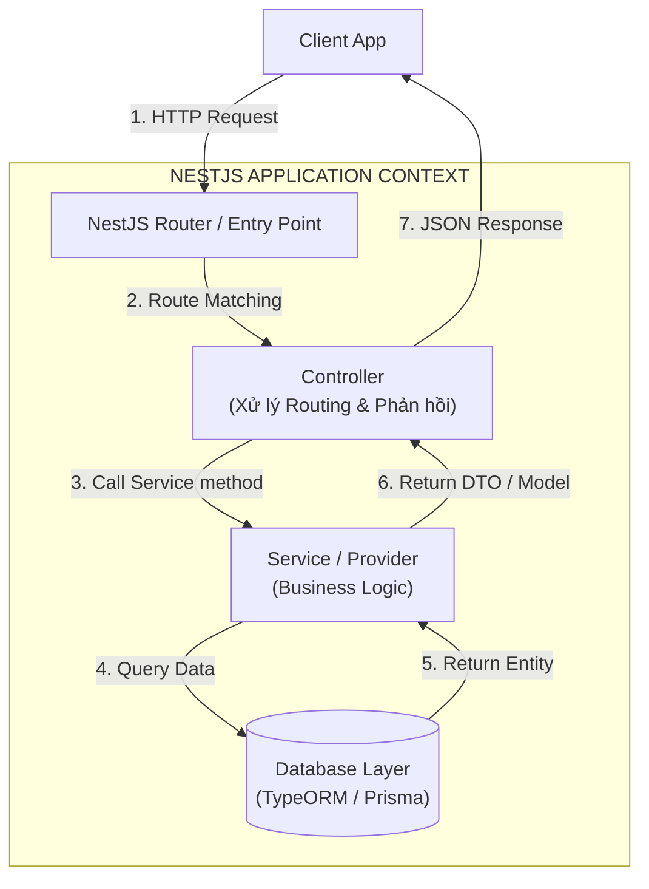
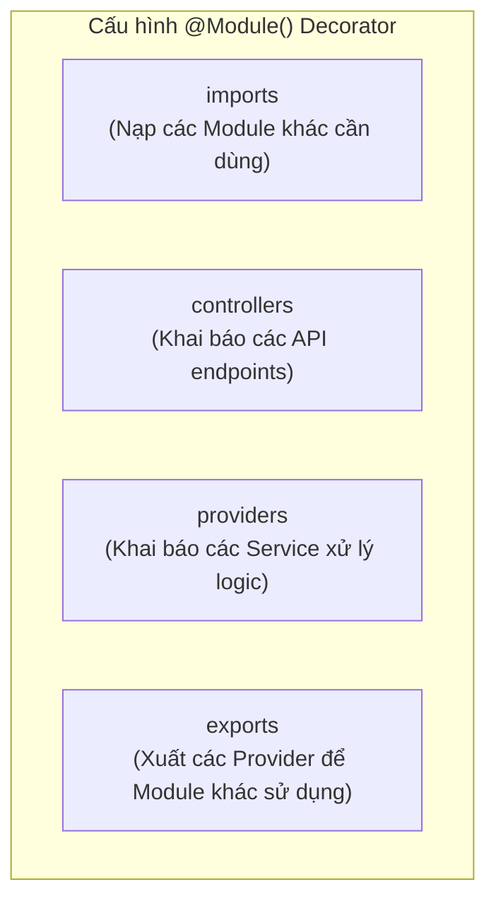
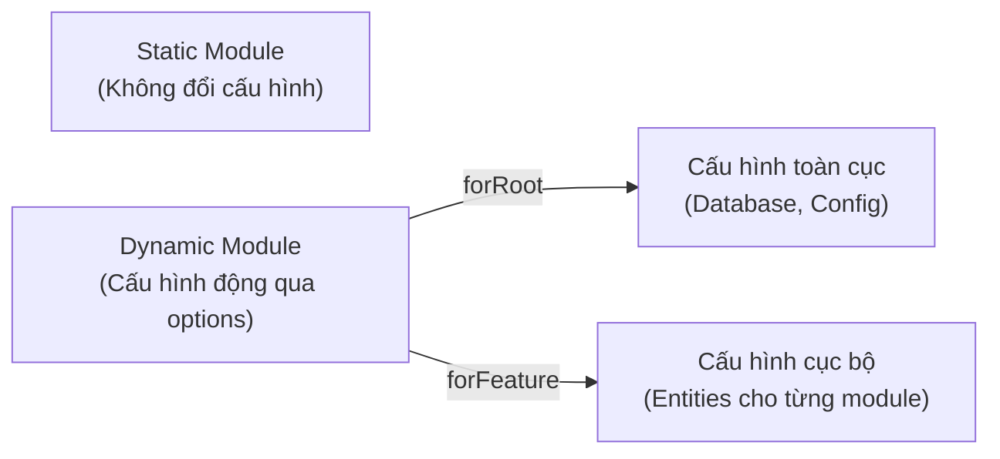

## I. KHÁI QUÁT (OVERVIEW)

### 1. Triết lý Thiết kế của NestJS (NestJS Design Philosophy)
Trong thế giới Node.js, sự linh hoạt là một điểm cộng nhưng cũng là điểm yếu chí mạng. Các framework truyền thống như Express.js hay Fastify cung cấp các API tối giản, cho phép lập trình viên tự do tổ chức mã nguồn theo ý muốn. Điều này thường dẫn đến hiện tượng **"Big Ball of Mud"** (code spaghetti) khi dự án phình to, đặc biệt là trong các đội ngũ phát triển lớn.

**NestJS** ra đời để giải quyết triệt để bài toán kiến trúc này bằng cách cung cấp một bộ khung (Framework) vững chắc, có tính cấu trúc cực kỳ cao, lấy cảm hứng từ triết lý thiết kế của **Angular**.
*   **OOP (Object-Oriented Programming):** Tận dụng tối đa sức mạnh của Class, Decorators, Interface và tính kế thừa để tổ chức mã nguồn sạch sẽ.
*   **FP (Functional Programming):** Sử dụng các hàm thuần túy (pure functions) và các khái niệm bất biến (immutability) trong các tầng xử lý dữ liệu.
*   **FRP (Functional Reactive Programming):** Tích hợp sâu thư viện **RxJS** để xử lý các luồng sự kiện bất đồng bộ và Reactive streams (đặc biệt trong WebSockets và Microservices).

### 2. Nguyên lý IoC (Inversion of Control) và Dependency Injection (DI)
Trái tim của NestJS là bộ điều phối **IoC Container**. Thay vì các Class tự khởi tạo các dependency của mình theo cách thủ công (chặt chẽ - Tightly Coupled):

```typescript
// Anti-pattern: Tightly Coupled
class UserController {
  private userService = new UserService(); // Tự khởi tạo -> Không thể Unit Test độc lập
}
```

NestJS áp dụng **Inversion of Control (Đảo ngược điều khiển)**: Lớp quản lý (IoC Container) sẽ chịu trách nhiệm khởi tạo đối tượng và "bơm" (Inject) các dependency vào Class qua Constructor:

```typescript
// Best Practice: Loosely Coupled via Dependency Injection
@Controller('users')
class UserController {
  constructor(private readonly userService: UserService) {} // Dependency được inject tự động
}
```

---

## II. CHI TIẾT KỸ THUẬT (DETAILED DEEP DIVE)

### 1. Sơ đồ Kiến trúc Luồng Xử lý trong NestJS
Dưới đây là sơ đồ kiến trúc tổng quan thể hiện luồng đi của một HTTP Request từ Client qua các tầng xử lý của NestJS để trả về Response:



---

### 2. Hệ thống Module - Khối xây dựng Cốt lõi (The Module System)
Trong NestJS, ứng dụng là một cái cây gồm các Module (`Module Tree`). Module là nơi gom nhóm các thành phần có liên quan chặt chẽ về mặt nghiệp vụ (ví dụ: `AuthModule`, `UserModule`, `OrderModule`).

Mỗi Module được định nghĩa bằng Decorator `@Module()` với 4 thuộc tính cấu hình cốt lõi:



*   **`imports`:** Danh sách các module xuất khẩu (exported) các provider mà module hiện tại cần sử dụng.
*   **`controllers`:** Danh sách các controllers được khởi tạo trong module này để xử lý các yêu cầu HTTP/gRPC/WebSocket.
*   **`providers`:** Danh sách các providers sẽ được khởi tạo bởi IoC Container và có thể được chia sẻ tối thiểu trong phạm vi module này.
*   **`exports`:** Danh sách các providers (thường là các Service) được định nghĩa trong module này mà các module khác khi import module này có thể sử dụng được.

#### Quy tắc đóng gói (Encapsulation Rule)
Trong NestJS, các module mặc định đóng gói các provider của mình. Nếu `UserService` nằm trong `UserModule` và `OrderModule` muốn sử dụng nó:
1. `UserModule` bắt buộc phải đưa `UserService` vào mảng `exports`.
2. `OrderModule` bắt buộc phải đưa `UserModule` vào mảng `imports`.
3. Lúc này `OrderService` mới có thể inject được `UserService` vào constructor.

> [!IMPORTANT]
> Nếu bạn cố tình inject `UserService` vào `OrderService` mà không thực hiện đúng 2 bước trên, IoC Container sẽ ném ra lỗi kinh điển:
> `Nest cannot resolve dependencies of the OrderService (?, ...). Please make sure that the argument UserService at index [0] is available in the OrderModule context.`

---

### 3. Dynamic Modules (Module Động)
Mặc định, mảng `imports` của `@Module()` chỉ nhận các module tĩnh. Tuy nhiên, trong thực tế sản xuất, chúng ta cần cấu hình module dựa trên các tham số động (ví dụ: cấu hình kết nối database, khóa API bên thứ ba thay đổi theo môi trường).

NestJS cung cấp cơ chế **Dynamic Modules** thông qua các phương thức tĩnh phổ biến: `register()`, `forRoot()`, hoặc `forFeature()`.



#### Ví dụ thiết kế Dynamic Module cho Mail Service:
```typescript
import { Module, DynamicModule, Provider } from '@nestjs/common';

export interface MailOptions {
  apiKey: string;
  domain: string;
  fromEmail: string;
}

@Module({})
export class MailModule {
  // Phương thức tĩnh trả về một DynamicModule Object
  static register(options: MailOptions): DynamicModule {
    const mailOptionsProvider: Provider = {
      provide: 'MAIL_OPTIONS',
      useValue: options,
    };

    return {
      module: MailModule,
      providers: [
        mailOptionsProvider,
        MailService, // Service này sẽ inject 'MAIL_OPTIONS'
      ],
      exports: [MailService],
    };
  }
}
```

---

### 4. Custom Providers & Token-based Injection
Khi viết `@Injectable() class UserService {}` và đưa vào mảng `providers`, thực chất NestJS đang sử dụng cú pháp rút gọn của:

```typescript
providers: [
  {
    provide: UserService, // Token định danh (Class)
    useClass: UserService, // Class thực tế để khởi tạo
  }
]
```

NestJS hỗ trợ 4 kiểu đăng ký Provider nâng cao để giải quyết mọi bài toán injection:

| Kiểu Provider | Cú pháp đăng ký | Trường hợp sử dụng thực tế |
| :--- | :--- | :--- |
| **`useValue`** | `{ provide: 'API_KEY', useValue: 'secret_123' }` | Tiêm các hằng số, giá trị cấu hình tĩnh, hoặc mock object khi viết Unit Test. |
| **`useClass`** | `{ provide: Logger, useClass: ProductionLogger }` | Đa hình (Polymorphism). Thay thế class triển khai dựa trên môi trường (Dev vs Prod). |
| **`useFactory`** | `{ provide: 'DB_CONNECTION', useFactory: async (config: Config) => { ... }, inject: [ConfigService] }` | Khởi tạo bất đồng bộ (Async). Tạo kết nối DB, nạp dữ liệu từ xa trước khi ứng dụng chạy. |
| **`useExisting`** | `{ provide: 'AliasLogger', useExisting: Logger }` | Tạo bí danh (Alias) cho một provider đã tồn tại để tương thích ngược. |

---

### 5. Provider Scope (Phạm vi thời gian sống)
Mặc định, tất cả các provider trong NestJS đều là **Singletons** (chỉ có duy nhất một instance được tạo ra cho toàn bộ vòng đời ứng dụng). Tuy nhiên, bạn có thể thay đổi phạm vi hoạt động của provider thông qua thuộc tính `scope`:

```typescript
import { Injectable, Scope } from '@nestjs/common';

@Injectable({ scope: Scope.REQUEST }) // Chuyển sang Request Scope
export class QueryService {}
```

#### Phân biệt 3 loại Scope:
1.  **`DEFAULT` (Singleton):** Một thực thể duy nhất được chia sẻ toàn hệ thống. Khởi tạo một lần khi bootstrap app. Khuyên dùng tối đa vì hiệu năng cao nhất.
2.  **`REQUEST`:** Một thực thể mới được tạo ra cho **mỗi HTTP Request**. Thực thể này sẽ tự động bị giải phóng (Garbage Collected) khi request kết thúc.
    > [!WARNING]
    > **Hiệu ứng Domino:** Nếu Service A là Request Scope, và bạn inject Service A vào Service B (mặc định là Singleton), thì Service B cũng sẽ bị ép buộc chuyển thành Request Scope. Việc này gây hao phí tài nguyên CPU/RAM nghiêm trọng ở tải lớn.
3.  **`TRANSIENT`:** Một thực thể mới được tạo ra cho **mỗi nơi inject**. Nếu Service A được inject vào cả Controller B và Service C, hai instance độc lập của Service A sẽ được tạo ra.

---

## III. VÍ DỤ MINH HỌA VÀ PHÂN TÍCH CODE (CODE EXAMPLES & ANALYSIS)

### 1. Triển khai Hệ thống Module & Custom Provider thực tế
Dưới đây là ví dụ hoàn chỉnh về cách cấu hình một Dynamic Database Module sử dụng `useFactory` kết hợp nạp cấu hình không đồng bộ:

```typescript
// ==============================================================
// File: src/database/database.module.ts
// Dynamic Module kết nối Database bất đồng bộ sử dụng useFactory
// ==============================================================
import { Module, DynamicModule, Provider } from '@nestjs/common';

export interface DatabaseConfig {
  host: string;
  port: number;
  uri: string;
}

export class DatabaseConnection {
  constructor(private readonly config: DatabaseConfig) {}
  
  async connect(): Promise<string> {
    // Giả lập kết nối DB bất đồng bộ
    return new Promise((resolve) => {
      setTimeout(() => resolve(`Connected to DB at ${this.config.host}:${this.config.port}`), 100);
    });
  }
  
  async query(sql: string) {
    return `Executed: ${sql}`;
  }
}

@Module({})
export class DatabaseModule {
  static forRoot(options: DatabaseConfig): DynamicModule {
    // 1. Tạo Provider đại diện cho kết nối Database
    const dbProvider: Provider = {
      provide: 'DATABASE_CONNECTION',
      useFactory: async () => {
        const connection = new DatabaseConnection(options);
        const status = await connection.connect();
        console.log(status);
        return connection;
      },
    };

    return {
      module: DatabaseModule,
      providers: [dbProvider],
      exports: [dbProvider], // Xuất ra ngoài để module khác sử dụng
      global: true, // Biến DatabaseModule thành Global (Không cần import lại)
    };
  }
}
```

```typescript
// ==============================================================
// File: src/users/users.service.ts
// Inject Custom Provider bằng Token 'DATABASE_CONNECTION'
// ==============================================================
import { Injectable, Inject } from '@nestjs/common';
import { DatabaseConnection } from '../database/database.module';

@Injectable()
export class UsersService {
  // Bắt buộc dùng decorator @Inject('TOKEN') khi token là một String/Symbol thay vì Class
  constructor(
    @Inject('DATABASE_CONNECTION') 
    private readonly dbConnection: DatabaseConnection
  ) {}

  async getUserDashboard(userId: string) {
    const result = await this.dbConnection.query(`SELECT * FROM users WHERE id = '${userId}'`);
    return {
      userId,
      data: result
    };
  }
}
```

---

## IV. LƯU Ý CẠM BẪY VÀ QUY TẮC CỐT LÕI (PITFALLS & CORE RULES)

### 1. Cạm bẫy Vòng lặp Phụ thuộc (Circular Dependency)
Khi `UserModule` cần import `AuthModule` (để dùng `AuthService`), đồng thời `AuthModule` lại cần import `UserModule` (để dùng `UserService`). IoC Container sẽ bị rơi vào vòng lặp vô chậm khi phân tích cây phụ thuộc và báo lỗi: `Circular dependency between modules`.

#### Cách giải quyết: Sử dụng `forwardRef()` ở cả hai đầu:

```typescript
// Trong auth.module.ts
@Module({
  imports: [forwardRef(() => UserModule)],
  providers: [AuthService],
  exports: [AuthService],
})
export class AuthModule {}

// Trong user.module.ts
@Module({
  imports: [forwardRef(() => AuthModule)],
  providers: [UserService],
  exports: [UserService],
})
export class UserModule {}
```

Và tương tự khi inject service trong constructor:
```typescript
// Trong auth.service.ts
constructor(
  @Inject(forwardRef(() => UserService))
  private readonly userService: UserService,
) {}
```

### 2. Sự nguy hiểm của `@Global()` Module
Việc lạm dụng Decorator `@Global()` khiến mọi module đều có thể truy cập các provider của module đó mà không cần import. 
*   **Hậu quả:** Làm mất đi tính tường minh của thiết kế Modular, gây khó khăn cho việc đóng gói, tái sử dụng mã nguồn và cô lập lỗi khi viết Unit Test.
*   **Quy tắc:** Chỉ đặt `@Global()` cho các module hạ tầng thực sự dùng chung ở khắp mọi nơi (như `DatabaseModule`, `ConfigModule`, `LoggerModule`). Các module nghiệp vụ tuyệt đối không dùng `@Global()`.

---

## 💡 5 QUY TẮC VÀNG KHI THIẾT KẾ KIẾN TRÚC NESTJS
1.  **Quy tắc Đóng gói nghiêm ngặt:** Luôn coi các module là các hộp đen (Black-box). Chỉ chia sẻ những gì thực sự cần thiết qua mảng `exports`.
2.  **Singleton làm mặc định:** Luôn ưu tiên sử dụng `Scope.DEFAULT`. Chỉ dùng `REQUEST` scope khi bắt buộc phải xử lý dữ liệu đặc thù theo từng luồng request (như Multi-tenant DB connection).
3.  **Token-based cho Interface:** Khi làm việc với Dependency Inversion (SOLID), hãy dùng String/Symbol Token để inject các Interface thay vì Class cụ thể để phục vụ việc Mocking dễ dàng.
4.  **Bất đồng bộ hóa qua useFactory:** Bất kỳ thao tác I/O nào cần thực hiện trước khi app lắng nghe request (như kết nối DB, nạp Cache khởi tạo) phải được xử lý bất đồng bộ thông qua `useFactory` ở Dynamic Module.
5.  **Fail-fast khi Bootstrap:** Validate toàn bộ tham số đầu vào của Dynamic Modules (sử dụng thư viện Joi hoặc class-validator) ngay trong pha khởi động để ứng dụng crash ngay lập tức nếu thiếu cấu hình quan trọng.
