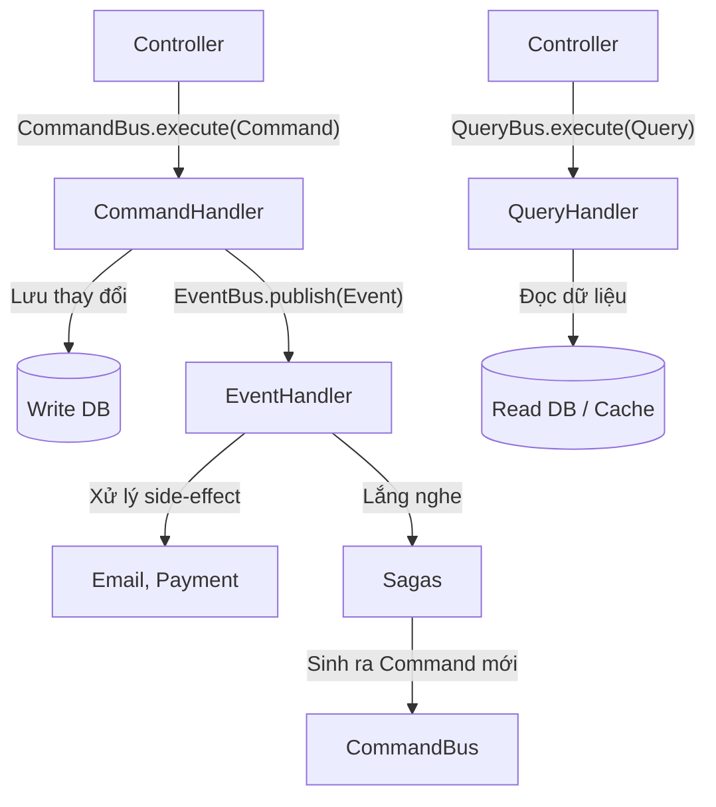

## I. KHÁI QUÁT (OVERVIEW)

CQRS (Command Query Responsibility Segregation) là một mẫu thiết kế kiến trúc phân tách rạch ròi các thao tác đọc dữ liệu (Queries) và ghi/sửa đổi dữ liệu (Commands) thành các model, đường dẫn luồng xử lý riêng biệt.

Trong một ứng dụng NestJS lớn (Enterprise-scale), việc áp dụng CQRS mang lại lợi ích khổng lồ:
- Tách biệt logic kinh doanh phức tạp (Command) khỏi logic trích xuất dữ liệu (Query).
- Cho phép tối ưu cơ sở dữ liệu riêng rẽ (Read replica, Caching cho Query và Write Master cho Command).
- Dễ dàng kết hợp với Event Sourcing và thiết kế theo Domain-Driven Design (DDD).

NestJS cung cấp một module hỗ trợ CQRS rất mạnh mẽ là `@nestjs/cqrs`.

> [!NOTE]
> Command là tác vụ làm thay đổi trạng thái của hệ thống (Create, Update, Delete) và thường KHÔNG nên trả về dữ liệu (ngoại trừ ID mới tạo hoặc trạng thái). Query là tác vụ lấy dữ liệu (Read) và tuyệt đối KHÔNG làm thay đổi trạng thái của hệ thống.

## II. CHI TIẾT KỸ THUẬT

### 1. Cài đặt và thiết lập Module
Cài đặt package CQRS chính thức từ NestJS:
```bash
npm install @nestjs/cqrs
```

Import `CqrsModule` vào Module cần sử dụng hoặc Global Module:
```typescript
import { Module } from '@nestjs/common';
import { CqrsModule } from '@nestjs/cqrs';

@Module({
  imports: [CqrsModule],
  // Khai báo các handler ở providers
  providers: [CreateOrderHandler, GetOrdersHandler, OrderCreatedEventHandler],
})
export class OrderModule {}
```

### 2. Định nghĩa Command & Command Handler

**Command:** Là một class đơn giản chứa dữ liệu cần thiết để thực thi tác vụ.
```typescript
// commands/create-order.command.ts
export class CreateOrderCommand {
  constructor(
    public readonly userId: string,
    public readonly productId: string,
    public readonly amount: number,
  ) {}
}
```

**Command Handler:** Là nơi chứa logic thực thi command đó.
```typescript
// handlers/create-order.handler.ts
import { CommandHandler, ICommandHandler } from '@nestjs/cqrs';
import { CreateOrderCommand } from '../commands/create-order.command';

@CommandHandler(CreateOrderCommand)
export class CreateOrderHandler implements ICommandHandler<CreateOrderCommand> {
  constructor(private orderRepository: OrderRepository) {}

  async execute(command: CreateOrderCommand): Promise<any> {
    const { userId, productId, amount } = command;
    // Xử lý logic nghiệp vụ
    const order = this.orderRepository.create({ userId, productId, amount });
    await this.orderRepository.save(order);
    
    return order.id; // Command có thể trả về ID
  }
}
```

### 3. Định nghĩa Query & Query Handler

Tương tự như Command, Query dùng để định nghĩa các yêu cầu lấy dữ liệu.

**Query:**
```typescript
export class GetOrderQuery {
  constructor(public readonly orderId: string) {}
}
```

**Query Handler:**
```typescript
import { IQueryHandler, QueryHandler } from '@nestjs/cqrs';
import { GetOrderQuery } from '../queries/get-order.query';

@QueryHandler(GetOrderQuery)
export class GetOrderHandler implements IQueryHandler<GetOrderQuery> {
  async execute(query: GetOrderQuery): Promise<any> {
    // Có thể query thẳng qua Query Builder, bỏ qua ORM Model phức tạp
    // return this.database.query('SELECT * FROM orders WHERE id = ?', [query.orderId]);
    return { id: query.orderId, status: 'PENDING' };
  }
}
```

### 4. Triển khai Controller (Sử dụng Bus)

Trong Controller, ta không gọi Service nữa mà tiêm `CommandBus` và `QueryBus`.

```typescript
import { Controller, Post, Get, Body, Param } from '@nestjs/common';
import { CommandBus, QueryBus } from '@nestjs/cqrs';
import { CreateOrderCommand } from './commands/create-order.command';
import { GetOrderQuery } from './queries/get-order.query';

@Controller('orders')
export class OrderController {
  constructor(
    private readonly commandBus: CommandBus,
    private readonly queryBus: QueryBus,
  ) {}

  @Post()
  async createOrder(@Body() dto: any) {
    return this.commandBus.execute(
      new CreateOrderCommand(dto.userId, dto.productId, dto.amount)
    );
  }

  @Get(':id')
  async getOrder(@Param('id') id: string) {
    return this.queryBus.execute(new GetOrderQuery(id));
  }
}
```

### 5. Event Sourcing và Event Handling

Sau khi một Command thực thi thay đổi thành công, hệ thống thường phát ra các **Event** để các module khác phản ứng lại (Ví dụ: OrderCreatedEvent -> Gửi Email, Trừ tồn kho).

```typescript
// events/order-created.event.ts
export class OrderCreatedEvent {
  constructor(public readonly orderId: string) {}
}
```

**Event Handler:** (Xử lý bất đồng bộ, không block luồng tạo order)
```typescript
import { EventsHandler, IEventHandler } from '@nestjs/cqrs';
import { OrderCreatedEvent } from '../events/order-created.event';

@EventsHandler(OrderCreatedEvent)
export class OrderCreatedEventHandler implements IEventHandler<OrderCreatedEvent> {
  handle(event: OrderCreatedEvent) {
    console.log(`Bắt đầu tiến trình gửi Email xác nhận cho Order ID: ${event.orderId}`);
    // Thực thi các tác vụ side-effect
  }
}
```

Để phát sự kiện từ Command Handler, có thể dùng `EventBus`:
```typescript
constructor(private eventBus: EventBus) {}
// Trong hàm execute:
this.eventBus.publish(new OrderCreatedEvent(order.id));
```
Hoặc kết hợp `AggregateRoot` và `EventPublisher` theo chuẩn DDD.

### 6. Sagas để điều phối luồng phức tạp

Sagas là một tính năng mạnh mẽ trong `@nestjs/cqrs`. Nó lắng nghe một chuỗi các Events và ánh xạ (map) chúng thành các Commands tiếp theo.

```typescript
import { Injectable } from '@nestjs/common';
import { Saga, ICommand, ofType } from '@nestjs/cqrs';
import { Observable } from 'rxjs';
import { delay, map } from 'rxjs/operators';
import { OrderCreatedEvent } from '../events/order-created.event';
import { ShipOrderCommand } from '../commands/ship-order.command';

@Injectable()
export class OrderSagas {
  @Saga()
  orderCreated = (events$: Observable<any>): Observable<ICommand> => {
    return events$.pipe(
      ofType(OrderCreatedEvent),
      delay(1000), // Ví dụ chờ 1 giây
      map(event => {
        console.log(`Saga phát hiện order: ${event.orderId}. Chuẩn bị Command Giao hàng.`);
        return new ShipOrderCommand(event.orderId);
      }),
    );
  }
}
```

## III. VÍ DỤ MINH HỌA VÀ PHÂN TÍCH CODE

Kiến trúc luồng xử lý:


> [!TIP]
> Việc dùng Saga rất phù hợp để triển khai các Distributed Transaction theo pattern Choreography, khi mà mỗi service tự lắng nghe Event của service trước đó và xử lý phần việc của mình.

## IV. LƯU Ý CẠM BẪY VÀ QUY TẮC CỐT LÕI

1. **Đừng áp dụng CQRS cho mọi dự án**: 
   CQRS tạo ra rất nhiều Boilerplate code (nhiều files class nhỏ rải rác). Chỉ nên dùng khi logic ứng dụng của bạn đủ độ phức tạp, hoặc project được thiết kế Microservices/DDD rõ rệt. Với ứng dụng CRUD đơn giản, việc dùng CQRS là "dùng dao mổ trâu giết gà".

2. **Tính Nhất quán Cuối cùng (Eventual Consistency)**:
   Bởi vì Data Write và Read có thể tách biệt, dữ liệu Read có thể cập nhật trễ hơn một chút (đặc biệt khi dùng hệ thống Queue hoặc 2 database riêng). Code Frontend cần được thiết kế để xử lý UX khéo léo cho độ trễ này.

3. **Event Handle lỗi**:
   Khi `EventHandler` throw Exception, nó **KHÔNG** làm `Command` ban đầu bị rollback (do nó xử lý bất đồng bộ hoặc chạy ở một context khác). Nếu muốn đảm bảo Transaction cho cả Command và Event, đừng dùng Event thông qua Bus mà hãy xử lý đồng bộ hoặc triển khai hệ thống Inbox/Outbox pattern.
