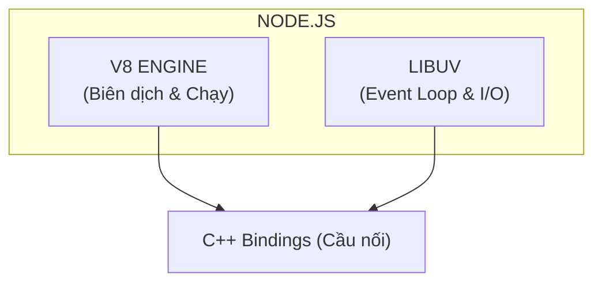
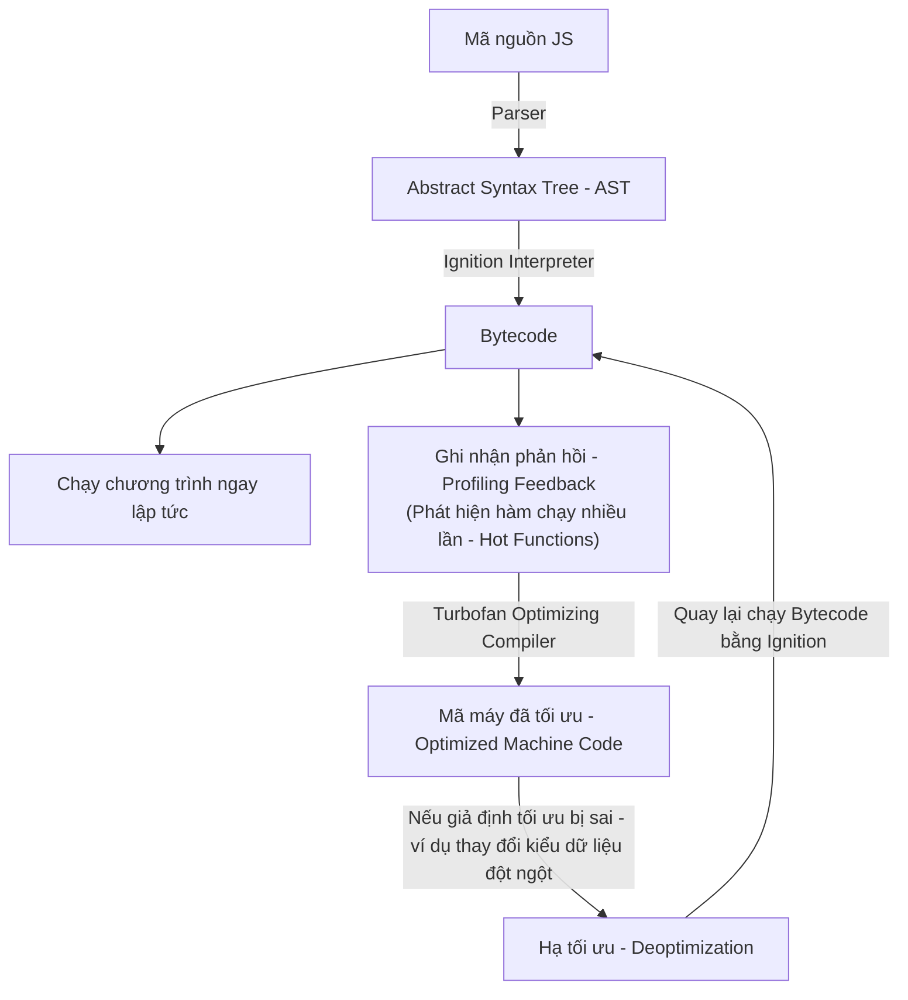

## I. KHÁI QUÁT (OVERVIEW)

### 1. Vai trò và vị trí của V8 trong Node.js
JavaScript ban đầu được thiết kế như một ngôn ngữ kịch bản chạy trên trình duyệt (Client-side). Để JavaScript có thể chạy được trên máy chủ (Server-side) như một ngôn ngữ độc lập giống Python hay Java, Ryan Dahl đã tạo ra **Node.js** vào năm 2009. 

Node.js thực chất là một môi trường chạy (Runtime Environment) viết bằng C++, đóng vai trò là "lớp vỏ bọc" (wrapper) tích hợp:
* **Lõi thực thi:** **V8 Engine** (Lấy từ Google Chrome) đảm nhận nhiệm vụ biên dịch và chạy code JavaScript.
* **Lõi bất đồng bộ & I/O:** **libuv** (Thư viện C++) đảm nhận nhiệm vụ xử lý File System, Network, Thread Pool.
* **C++ Bindings:** Cầu nối giúp JavaScript gọi được các tính năng hệ thống viết bằng C++ của OS.




---

### 2. Nguyên lý hoạt động cốt lõi của V8
V8 là công cụ biên dịch trực tiếp (JIT - Just-In-Time Compiler). Thay vì thông dịch từng dòng code khi chạy (như JavaScript cũ) hoặc biên dịch trước toàn bộ thành file thực thi (như C/C++), V8 thực hiện biên dịch code JavaScript thành mã máy (machine code) **ngay trong lúc chương trình đang chạy** để tối ưu hóa hiệu năng tối đa.

---

## II. CHI TIẾT KỸ THUẬT (DETAILED DEEP DIVE)

### 1. Vòng đời biên dịch của V8 (V8 Compilation Pipeline)

Khi bạn chạy một file Node.js, V8 thực hiện quy trình biên dịch qua các bước nghiêm ngặt sau:



#### Bước 1: Phân tích cú pháp (Parsing) & Tạo cây AST
* **Bộ phân tích cú pháp (Parser):** V8 phân tích mã nguồn JavaScript và chuyển đổi thành **AST (Abstract Syntax Tree - Cây cú pháp trừu tượng)** để cấu trúc hóa logic của code.

#### Bước 2: Ignition Interpreter (Trình thông dịch Ignition)
* **Bytecode:** Ignition nhận cây AST và biên dịch cực nhanh thành **Bytecode** (mã trung gian). Sau đó Ignition thực thi ngay Bytecode này giúp chương trình khởi động nhanh chóng.

#### Bước 3: Thu thập dữ liệu chạy (Profiling) & Tối ưu hóa với Turbofan
* **Phát hiện hàm nóng (Hot Functions):** Khi Bytecode chạy, V8 ghi nhận tần suất gọi hàm và kiểu dữ liệu truyền vào. Nếu một hàm được gọi lặp đi lặp lại nhiều lần với cùng một kiểu dữ liệu, nó được đánh dấu là "Hot Function".
* **Turbofan Compiler:** V8 gửi hàm này tới bộ tối ưu Turbofan để biên dịch thẳng thành **Mã máy đã tối ưu (Optimized Machine Code)** chạy trực tiếp trên CPU với tốc độ cực đại.

#### Bước 4: Hạ cấp tối ưu (Deoptimization)
* Nếu "Hot Function" đã tối ưu đột ngột nhận vào một kiểu dữ liệu khác (ví dụ: bình thường truyền `number`, nay truyền `string`), giả định tối ưu của Turbofan bị sai. V8 lập tức vứt bỏ mã máy đã tối ưu và quay lại chạy bằng trình thông dịch Bytecode (Deoptimization).

---

### 2. Quản lý Bộ nhớ: Call Stack vs Memory Heap

```typescript
const age = 25; // age và giá trị 25 lưu ở Call Stack
const user = { name: "Alice", age: 25 }; // Biến 'user' (địa chỉ bộ nhớ) ở Stack, thực thể object ở Heap
```

#### a. Call Stack (Vùng nhớ Stack)
* **Đặc điểm:** Hoạt động theo cơ chế LIFO (Last In First Out).
* **Lưu trữ:** Ngữ cảnh thực thi hàm (Execution Context) và các biến cục bộ có kiểu nguyên thủy (`number`, `string`, `boolean`, `null`, `undefined`).
* **Cơ chế hoạt động:** Khi một hàm được gọi, một khung Stack (Stack Frame) chứa thông tin hàm đó được đẩy vào Call Stack. Khi hàm kết thúc, Stack Frame đó lập tức bị xóa bỏ (Pop) tự động.

#### b. Memory Heap (Vùng nhớ Heap)
* **Đặc điểm:** Vùng nhớ lớn không có cấu trúc tuyến tính, cấp phát động.
* **Lưu trữ:** Đối tượng phức tạp (Objects, Arrays, Functions, Instances của Class). Call Stack chỉ lưu giữ **địa chỉ con trỏ bộ nhớ (Memory Pointer)** trỏ tới vùng nhớ thực tế trên Heap.

---

### 3. Cơ chế Garbage Collection (GC) chi tiết

V8 áp dụng giả thuyết **"Generational Hypothesis"**: Hầu hết các đối tượng trong ứng dụng có vòng đời rất ngắn (tạo ra rồi biến mất nhanh chóng). Do đó Heap được chia làm hai khu vực:

#### a. Thế hệ trẻ (Young Generation / New Space)
* **Dung lượng:** Nhỏ (thường từ 1MB đến 8MB).
* **Đối tượng chứa:** Các đối tượng vừa mới được khởi tạo.
* **Cơ chế GC (Scavenger):** 
  * Sử dụng giải thuật **Cheney's Copying Algorithm**. Vùng nhớ được chia đều làm 2 nửa: `From-space` và `To-space`.
  * Dữ liệu mới được viết vào `From-space`. Khi thực hiện GC, V8 quét qua và chỉ copy các đối tượng còn hoạt động sang `To-space`, sau đó dọn sạch toàn bộ `From-space`.
  * Sau đó, hai vùng nhớ hoán đổi vai trò cho nhau (`To-space` biến thành `From-space`).
  * Nếu một đối tượng sống sót qua **2 đợt Scavenger**, nó sẽ được thăng cấp (promoted) chuyển sang thế hệ già.

#### b. Thế hệ già (Old Generation / Old Space)
* **Dung lượng:** Chiếm phần lớn dung lượng Heap (lên tới hàng Gigabyte tùy cấu hình máy).
* **Đối tượng chứa:** Các đối tượng sống lâu hoặc được thăng cấp từ thế hệ trẻ.
* **Cơ chế GC (Major GC - Mark-Sweep-Compact):**
  1. **Marking (Đánh dấu):** GC đi từ các biến gốc (GC Roots) của ứng dụng, duyệt theo các liên kết tham chiếu để tìm và đánh dấu tất cả các đối tượng còn có thể tiếp cận được (Reachable).
  2. **Sweeping (Quét):** GC duyệt qua toàn bộ vùng nhớ Heap, giải phóng không gian của các đối tượng không được đánh dấu (Unreachable).
  3. **Compacting (Nén bộ nhớ):** Để tránh phân mảnh bộ nhớ (Memory Fragmentation) khiến không cấp phát được đối tượng lớn, GC dồn tất cả các đối tượng còn sống lại gần nhau về một phía của bộ nhớ.

---

## III. VÍ DỤ MINH HỌA VÀ PHÂN TÍCH BỘ NHỚ (CODE ANALYSIS)

Hãy xem đoạn code sau đây chạy trong Node.js và phân tích bộ nhớ:

```javascript
function createAdmin() {
  const adminInfo = { role: "admin", code: 999 }; // (1)
  return adminInfo;
}

const activeAdmin = createAdmin(); // (2)
```

### Phân tích trạng thái bộ nhớ từng bước:
* **Tại bước (1):**
  * Hàm `createAdmin` được đẩy vào **Call Stack**.
  * Hằng số `adminInfo` nằm ở **Call Stack** chứa địa chỉ trỏ tới đối tượng thực tế `{ role: "admin", code: 999 }` nằm ở **Memory Heap**.
* **Tại bước (2):**
  * Hàm `createAdmin` kết thúc và bị xóa khỏi **Call Stack**. Vùng nhớ Stack của hàm này bị thu hồi.
  * Tuy nhiên, vì đối tượng `{ role: "admin", code: 999 }` ở **Heap** đã được return và gán vào biến toàn cục `activeAdmin` (nằm ở Stack toàn cục), đối tượng này vẫn có mối liên kết tham chiếu (Reachable).
  * Do đó, Garbage Collector sẽ **KHÔNG** xóa đối tượng này khỏi Heap.

---

## IV. LƯU Ý, CẠM BẪY VÀ QUY TẮC CỐT LÕI (BEST PRACTICES)

> [!CAUTION]
> ### 1. Cạm bẫy "Hidden Classes" và "Inline Caches"
> V8 tối ưu hóa truy xuất đối tượng bằng cách tạo ra các **Hidden Classes (hoặc Shapes)** ngầm định cho các Object. Nếu bạn tạo các đối tượng có thuộc tính giống nhau nhưng khởi tạo khác thứ tự, V8 sẽ tạo ra các Hidden Classes khác nhau, làm mất đi khả năng tối ưu hóa của Inline Cache.
> 
> **Ví dụ viết code tệ (Làm chậm V8):**
> ```javascript
> const obj1 = {};
> obj1.x = 10;
> obj1.y = 20; // V8 tạo ra Shape A: { x, y }
> 
> const obj2 = {};
> obj2.y = 20; // Thứ tự khởi tạo khác
> obj2.x = 10; // V8 tạo ra Shape B: { y, x } -> Mất khả năng tối ưu hóa!
> ```
> 
> **Quy tắc cốt lõi:** Luôn khởi tạo tất cả các thuộc tính của đối tượng trong hàm tạo (Constructor) hoặc Object Literal với thứ tự các key giống hệt nhau.

> [!WARNING]
> ### 2. Hiện tượng dừng thế giới (Stop-the-World) của Major GC
> Khi Major GC thực hiện dọn dẹp Old Space, nó bắt buộc phải **tạm dừng hoàn toàn việc thực thi mã nguồn JavaScript** của ứng dụng Node.js để đảm bảo dữ liệu không bị thay đổi trong quá trình GC quét (gọi là Stop-the-World).
>
> Nếu Heap của bạn quá lớn (ví dụ trên 4GB) và chứa hàng triệu đối tượng nhỏ liên kết chéo, một đợt Major GC có thể làm nghẽn ứng dụng của bạn tới **vài trăm mili-giây** hoặc thậm chí hàng giây.
>
> **Quy tắc cốt lõi:**
> - Hạn chế lưu trữ các bộ đệm dữ liệu quá lớn (In-memory Cache) trực tiếp trong RAM của Node.js. Hãy đẩy chúng sang các dịch vụ chuyên biệt như **Redis**.
> - Bật cờ kiểm tra RAM nếu cần debug rò rỉ bộ nhớ: `node --expose-gc index.js`.
