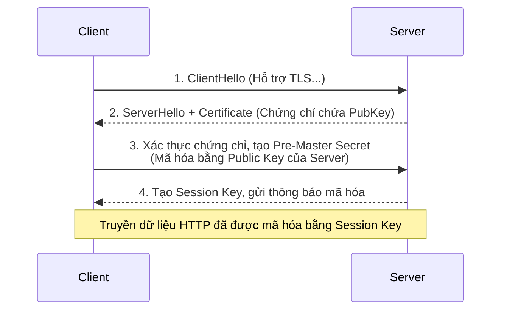

## I. KHÁI QUÁT (OVERVIEW)

### 1. Tại sao cần HTTPS và SSL/TLS?
Khi bạn sử dụng giao thức HTTP thông thường, toàn bộ dữ liệu truyền qua mạng (bao gồm mật khẩu, thông tin thẻ tín dụng, dữ liệu nhạy cảm) đều ở dưới dạng văn bản thuần (plain text). Hacker ở cùng mạng Wifi công cộng hoặc các thiết bị trung gian hoàn toàn có thể nghe lén bằng phương pháp **Man-in-the-Middle (MitM)**.

**HTTPS (HTTP Secure)** là phiên bản bảo mật của HTTP, sử dụng giao thức mật mã **SSL (Secure Sockets Layer)** hoặc phiên bản nâng cấp hiện đại của nó là **TLS (Transport Layer Security)** để mã hóa mọi dữ liệu truyền đi giữa Client và Server.

---

### 2. Nguyên lý mã hóa trong SSL/TLS
Quá trình bảo mật của TLS sử dụng hai phương thức mã hóa:
1. **Mã hóa bất đối xứng (Asymmetric Encryption):** Sử dụng cặp khóa **Public Key** (công khai) và **Private Key** (bí mật) để xác thực danh tính của Server và trao đổi khóa đối xứng một cách an toàn lúc bắt đầu kết nối (TLS Handshake).
2. **Mã hóa đối xứng (Symmetric Encryption):** Sau khi đã trao đổi khóa an toàn, toàn bộ dữ liệu truyền tải thực tế sẽ được mã hóa bằng một khóa đối xứng duy nhất (Session Key) để đảm bảo tốc độ mã hóa và giải mã cực nhanh.

---

## II. CHI TIẾT KỸ THUẬT (DETAILED DEEP DIVE)

### 1. Quy trình bắt tay TLS (TLS Handshake)

Trước khi bất kỳ dữ liệu HTTP nào được truyền đi, Client và Server phải thực hiện quy trình bắt tay TLS để thiết lập kết nối an toàn:



---

### 2. Tạo chứng chỉ tự ký (Self-signed Certificate) bằng OpenSSL
Để chạy thử nghiệm HTTPS trên môi trường Local (localhost), bạn cần tự tạo một cặp khóa và chứng chỉ giả lập:

```bash
openssl req -x509 -newkey rsa:2048 -keyout key.pem -out cert.pem -sha256 -days 365 -nodes
```
Lệnh này sẽ tạo ra 2 file:
* **`key.pem`**: Khóa riêng tư (Private Key) - bắt buộc phải giữ bí mật tuyệt đối trên Server.
* **`cert.pem`**: Chứng chỉ SSL chứa khóa công khai (Public Key).

---

### 3. Tạo HTTPS Server trong Node.js

Node.js cung cấp mô-đun tích hợp sẵn **`https`** để khởi chạy Server bảo mật. Bạn cần nạp chứng chỉ và khóa riêng tư vào cấu hình khởi tạo:

```javascript
const https = require('https');
const fs = require('fs');

// Đọc chứng chỉ từ ổ cứng
const options = {
  key: fs.readFileSync('key.pem'),
  cert: fs.readFileSync('cert.pem')
};

const server = https.createServer(options, (req, res) => {
  res.writeHead(200);
  res.end('Kết nối HTTPS an toàn thành công!\n');
});

server.listen(4433, () => {
  console.log('HTTPS Server đang chạy trên port 4433');
});
```

---

## III. VÍ DỤ MINH HỌA VÀ PHÂN TÍCH CODE (CODE ANALYSIS)

Khi viết Client gọi API HTTPS tự ký ở local, mặc định Node.js sẽ từ chối kết nối vì chứng chỉ này không được ký bởi một tổ chức xác thực uy tín (Certificate Authority - CA).

Hãy cùng xem cách thiết lập Client gọi HTTPS vượt qua cảnh báo chứng chỉ an toàn khi phát triển (development):

```javascript
const https = require('https');

// Tạo cấu hình Agent bỏ qua kiểm tra chứng chỉ tự ký (chỉ dùng khi test ở local)
const agent = new https.Agent({
  rejectUnauthorized: false // ⚠️ CẤM dùng cấu hình này ở Production!
});

https.get('https://localhost:4433', { agent }, (res) => {
  console.log(`Mã trạng thái: ${res.statusCode}`);
  
  res.on('data', (d) => {
    process.stdout.write(d);
  });
}).on('error', (e) => {
  console.error(e);
});
```

---

## IV. LƯU Ý, CẠM BẪY VÀ QUY TẮC CỐT LÕI (BEST PRACTICES)

> [!CAUTION]
> ### 1. Cạm bẫy hiệu năng: TLS Termination (Ủy quyền TLS) ở Node.js
> Việc mã hóa và giải mã dữ liệu của giao thức TLS tiêu tốn rất nhiều tài nguyên tính toán của CPU. Nếu bạn chạy HTTPS trực tiếp trên Node.js ở môi trường Production chịu tải lớn, Node.js Server sẽ nhanh chóng bị quá tải CPU chỉ để giải mã gói tin.
> 
> **Giải pháp kiến trúc chuẩn:** 
> Thực hiện **TLS Termination (Giải mã TLS)** tại các Reverse Proxy chuyên dụng ở tầng ngoài (như **Nginx**, **HAProxy**, hoặc dịch vụ đám mây **Cloudflare / AWS ALB**). 
> Các Proxy này giải mã gói tin HTTPS thành HTTP thường rồi chuyển tiếp gói tin HTTP đó về Node.js thông qua mạng nội bộ. Việc này giải phóng 100% CPU cho Node.js tập trung xử lý logic.

> [!WARNING]
> ### 2. Bảo mật Private Key
> File `key.pem` là chìa khóa duy nhất để giải mã dữ liệu của khách hàng. Tuyệt đối không được commit file này lên Git (GitHub/GitLab). Hãy quản lý nó qua các công cụ lưu trữ bảo mật (như AWS Secrets Manager, Vault) hoặc nạp qua các biến môi trường cấu hình của hệ thống.
