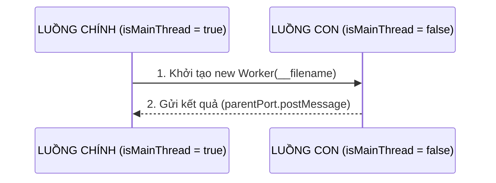

## I. KHÁI QUÁT (OVERVIEW)

### 1. Tại sao cần Worker Threads?
Như đã phân tích ở Bài 02 (Event Loop) và Bài 08 (Cluster), Node.js chạy JavaScript đơn luồng. Nếu bạn chạy một tác vụ tính toán CPU cực nặng (CPU-intensive task) trên luồng chính, Event Loop sẽ bị chặn đứng (blocked), khiến Server không thể nhận thêm bất kỳ kết nối nào khác.

Để giải quyết triệt để vấn đề này mà không cần nhân bản toàn bộ tiến trình RAM lớn (như dùng `child_process` hay `cluster`), Node.js cung cấp mô-đun **`worker_threads`** (ra mắt từ bản v10.5.0) cho phép bạn tạo ra các **luồng làm việc (Worker Threads) thực tế chạy song song bên trong cùng một tiến trình**.

---

### 2. Sự khác biệt: Worker Threads vs Cluster

| Đặc điểm | Worker Threads (Đa luồng) | Cluster (Đa tiến trình) |
| :--- | :--- | :--- |
| **Bản chất** | Chạy nhiều luồng song song **trong cùng 1 tiến trình**. | Chạy nhiều tiến trình độc lập **trên các cổng nhớ riêng**. |
| **Chia sẻ bộ nhớ (RAM)** | ✅ **Có**. Có thể chia sẻ trực tiếp vùng nhớ RAM bằng `SharedArrayBuffer`. | ❌ **Không**. Muốn giao tiếp phải gửi tin nhắn qua kênh IPC rất chậm. |
| **Mục đích sử dụng** | Giải quyết các tác vụ tính toán CPU nặng (xử lý ảnh, mã hóa dữ liệu...). | Nhân bản Server để tối ưu hóa chịu tải kết nối HTTP. |

---

## II. CHI TIẾT KỸ THUẬT (DETAILED DEEP DIVE)

### 1. Cấu trúc hoạt động của mô-đun `worker_threads`

Mô-đun cung cấp các thuộc tính cốt lõi để điều phối luồng:
* **`isMainThread`**: Biến boolean báo hiệu đoạn code đang chạy ở luồng chính (`true`) hay ở luồng con (`false`).
* **`Worker`**: Class dùng để khởi tạo một luồng con mới.
* **`parentPort`**: Kênh giao tiếp gửi tin nhắn ngược lại từ luồng con về luồng chính.



---

### 2. Truyền dữ liệu và Chia sẻ bộ nhớ nâng cao (SharedArrayBuffer)

Mặc định, khi bạn gửi tin nhắn giữa luồng chính và luồng con bằng phương thức `.postMessage(data)`, Node.js sẽ sử dụng thuật toán **HTML structured clone algorithm** để copy toàn bộ đối tượng dữ liệu đó sang vùng nhớ mới của luồng con (không dùng chung vùng nhớ).

Để truyền dữ liệu dung lượng lớn (như mảng chứa hàng triệu điểm ảnh) siêu tốc mà không tốn công sức copy, bạn có thể sử dụng **`SharedArrayBuffer`**:

```typescript
// Luồng chính cấp phát 1 vùng nhớ chia sẻ dung lượng 1024 bytes (1KB)
const sharedBuffer = new SharedArrayBuffer(1024);

// Luồng chính và luồng con có thể đọc ghi trực tiếp lên sharedBuffer này song song.
// Sử dụng thư viện Atomics để đảm bảo các thao tác đọc ghi đồng bộ không bị ghi đè chồng chéo (Race Conditions).
```

---

## III. VÍ DỤ MINH HỌA VÀ PHÂN TÍCH CODE (CODE ANALYSIS)

Hãy cùng viết một file code có khả năng tự động phân tách luồng: Nếu là luồng chính, chạy một HTTP Server; nếu nhận request tính toán nặng, đẩy sang luồng con xử lý để luồng chính luôn rảnh rỗi nhận kết nối khác:

```javascript
const { Worker, isMainThread, parentPort, workerData } = require('worker_threads');
const http = require('http');

if (isMainThread) {
  // --- CODE CHẠY TRÊN LUỒNG CHÍNH ---
  const server = http.createServer((req, res) => {
    if (req.url === '/heavy') {
      console.log("[Main] Nhận request tính toán nặng. Đang chuyển sang Worker...");
      
      // Tạo Worker con, chạy chính file này nhưng ở chế độ con, truyền kèm dữ liệu
      const worker = new Worker(__filename, { workerData: 40 }); // Tính Fibonacci của 40
      
      worker.on('message', (result) => {
        res.writeHead(200);
        res.end(`Kết quả tính toán: ${result}\n`);
      });
      
      worker.on('error', (err) => {
        res.writeHead(500);
        res.end(err.message);
      });
      
    } else {
      res.writeHead(200);
      res.end("Luồng chính phản hồi tức thì!\n");
    }
  });

  server.listen(3000, () => console.log('Server đang chạy trên port 3000'));

} else {
  // --- CODE CHẠY TRÊN LUỒNG CON (WORKER) ---
  const number = workerData; // Lấy dữ liệu truyền từ luồng chính
  
  // Hàm tính Fibonacci đệ quy cực kỳ nặng nề
  function fibonacci(n) {
    if (n < 2) return n;
    return fibonacci(n - 1) + fibonacci(n - 2);
  }
  
  const result = fibonacci(number);
  
  // Gửi kết quả ngược lại cho luồng chính
  parentPort.postMessage(result);
}
```

---

## IV. LƯU Ý, CẠM BẪY VÀ QUY TẮC CỐT LÕI (BEST PRACTICES)

> [!CAUTION]
> ### 1. Chi phí khởi tạo Worker Thread rất lớn
> Việc tạo mới một Worker Thread (`new Worker()`) tốn rất nhiều tài nguyên hệ thống. V8 phải khởi tạo một môi trường thực thi hoàn toàn mới (V8 Isolate, Call Stack...). 
> 
> Nếu bạn tạo mới một Worker trên mỗi HTTP Request gửi đến, Server sẽ bị sụt giảm hiệu năng nghiêm trọng do chi phí tạo/hủy luồng còn lớn hơn thời gian tính toán.
>
> **Quy tắc cốt lõi:** Luôn sử dụng một **Worker Pool** (bể luồng con được khởi tạo sẵn từ đầu và tái sử dụng liên tục khi có việc). Bạn nên sử dụng thư viện chuyên dụng chất lượng cao cho việc này như **`piscina`** trên Production.

> [!WARNING]
> ### 2. Worker Threads không sinh ra để tăng tốc I/O
> Worker Threads chỉ dùng để giải quyết các tác vụ nghẽn **CPU**. 
>
> Đối với các tác vụ nghẽn **I/O** (đọc ghi file, gọi mạng, truy vấn DB), hãy sử dụng cơ chế Async/Await mặc định của Node.js (được quản lý bởi libuv) vì nó tối ưu hơn việc dùng luồng Worker rất nhiều.
