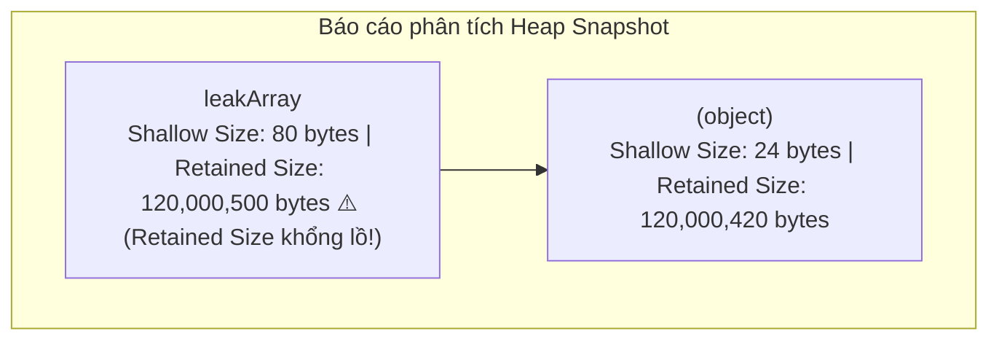
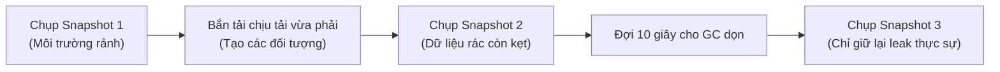

## I. KHÁI QUÁT (OVERVIEW)

### 1. Rò rỉ bộ nhớ (Memory Leak) là gì?
Như đã giới thiệu ở Bài 01 (V8 Engine), **rò rỉ bộ nhớ** xảy ra khi ứng dụng của bạn liên tục cấp phát RAM cho các đối tượng mới nhưng không giải phóng các đối tượng cũ khi không còn dùng đến. Lượng RAM tiêu thụ của Server sẽ tăng dần theo đồ thị tuyến tính thẳng đứng cho đến khi chạm mốc giới hạn vật lý và hệ điều hành sẽ cưỡng chế sập tiến trình Node.js (Lỗi `Out of Memory`).

---

### 2. Sự khác biệt: CPU Profile vs Heap Snapshot
* **CPU Profile:** Theo dõi thời gian thực thi mã nguồn theo **trục thời gian** (Nhanh hay Chậm).
* **Heap Snapshot:** Chụp lại toàn bộ **bản đồ bộ nhớ Heap** tại một thời điểm chính xác (RAM đang chứa những đối tượng nào, dung lượng bao nhiêu, liên kết với nhau ra sao).

---

## II. CHI TIẾT KỸ THUẬT (DETAILED DEEP DIVE)

### 1. Các phương pháp xuất Heap Snapshot

#### a. Xuất tự động khi RAM sắp tràn (Cực kỳ khuyên dùng cho Production)
Node.js cung cấp một cờ cấu hình vô cùng thông minh giúp bạn tự động chụp lại bản đồ bộ nhớ ngay trước khi Server bị crash vì tràn RAM:

```bash
node --heapsnapshot-near-heap-limit=3 server.js
```
*Ý nghĩa:* Khi lượng RAM Heap sắp vượt quá giới hạn và chuẩn bị sập nguồn, Node.js sẽ tự động xuất ra tối đa `3` file Heap Snapshot dạng `.heapsnapshot` vào ổ cứng. Bạn có thể mang file này về máy cá nhân để phân tích nguyên nhân crash.

---

#### b. Xuất bằng code chủ động (Programmatic Heap Snapshot)
Bạn có thể tự viết code để chụp bộ nhớ khi cần thiết (ví dụ: tạo 1 endpoint API ẩn `/debug/heap-dump` chỉ dành cho admin):

```javascript
const v8 = require('v8');
const fs = require('fs');

function takeSnapshot() {
  const filepath = `./snapshot-${Date.now()}.heapsnapshot`;
  // Viết trực tiếp dữ liệu Heap Snapshot ra file
  const snapshotPath = v8.writeHeapSnapshot(filepath);
  console.log(`Đã xuất Heap Snapshot thành công tại: ${snapshotPath}`);
}
```

---

### 2. Cách phân tích Heap Snapshot bằng Chrome DevTools

Mở Chrome DevTools (F12) -> Chọn tab **Memory** -> Click **Load** và chọn file `.heapsnapshot` đã chụp.

Báo cáo phân tích sẽ cung cấp hai thông số đo lường cực kỳ quan trọng:



1. **Shallow Size:** Dung lượng bộ nhớ thực tế được cấp phát cho **bản thân đối tượng đó** (không bao gồm các đối tượng con mà nó tham chiếu tới). Thường chỉ vài chục đến vài trăm byte.
2. **Retained Size:** Tổng dung lượng bộ nhớ sẽ được **giải phóng hoàn toàn** nếu đối tượng này bị xóa và các đối tượng con của nó không còn ai tham chiếu tới. 
   * *Mẹo tìm lỗi:* Hãy sắp xếp cột **Retained Size** từ lớn đến bé. Đối tượng nào có Retained Size khổng lồ chính là "Gốc rễ" (GC Root) đang giữ chặt dữ liệu rác không cho Garbage Collector dọn dẹp.

---

## III. QUY TRÌNH SĂN LÙNG RÒ RÌ BỘ NHỚ (LEAK HUNTING PIPELINE)

Để tìm lỗi rò rỉ bộ nhớ một cách khoa học, bạn nên thực hiện quy trình so sánh **3 Snapshots (3-Snapshot Technique)**:



1. **Snapshot 1:** Chụp khi ứng dụng vừa khởi động và ở trạng thái nghỉ (Baseline).
2. **Snapshot 2:** Chụp sau khi dùng công cụ bắn tải `autocannon` gửi hàng nghìn request gọi vào Server.
3. **Snapshot 3:** Đợi khoảng 10 giây cho V8 thực hiện Garbage Collection tự động, sau đó chụp Snapshot 3.
4. **So sánh:** Trên Chrome DevTools, chọn Snapshot 3, đổi chế độ hiển thị từ *Summary* thành **Comparison** và chọn so sánh với Snapshot 1. Bạn sẽ thấy danh sách các đối tượng được sinh ra trong quá trình chạy nhưng **không bị biến mất** sau khi GC đã dọn dẹp.

---

## IV. LƯU Ý, CẠM BẪY VÀ QUY TẮC CỐT LÕI (BEST PRACTICES)

> [!CAUTION]
> ### 1. Cạm bẫy sập nguồn Server khi chụp Heap Snapshot
> Việc chụp Heap Snapshot yêu cầu Node.js phải quét toàn bộ hàng triệu đối tượng trong bộ nhớ RAM, chuyển đổi cấu trúc và ghi ra đĩa cứng. Thao tác này cực kỳ nặng và sẽ **đóng băng hoàn toàn (freeze) luồng chính của Node.js** trong vài giây (thậm chí vài phút nếu Heap lên tới hàng GB).
> 
> Nếu bạn cố tình chạy lệnh xuất Heap Snapshot trên một Server đang chạy Production chịu tải cao, Server của bạn sẽ bị timeout kết nối và ngắt hoạt động lập tức.
>
> **Quy tắc cốt lõi:** Chỉ thực hiện xuất Heap Snapshot trên máy local hoặc môi trường test. Nếu bắt buộc phải chạy ở Production, hãy thực hiện trên một máy chủ clone (đã được rút khỏi bộ cân bằng tải Load Balancer).
