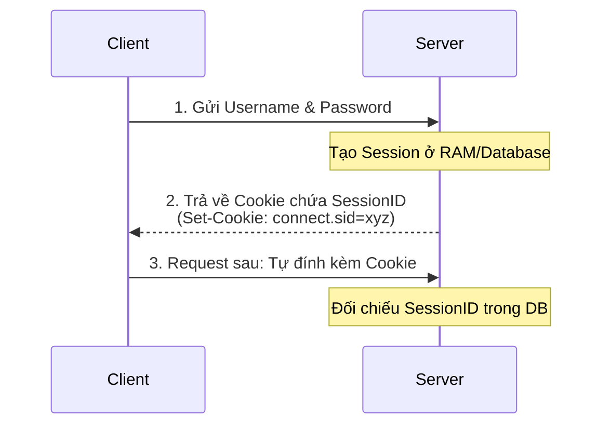
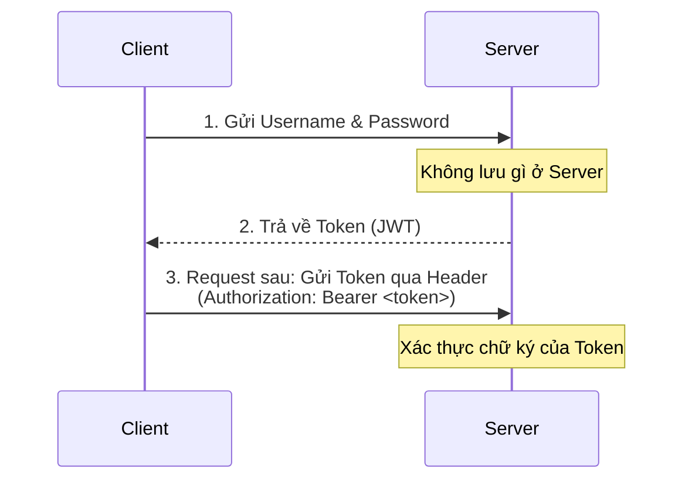

## I. KHÁI QUÁT (OVERVIEW)

### 1. Bản chất bất trạng thái (Stateless) của HTTP
Giao thức HTTP mặc định là **Stateless (Bất trạng thái)**. Nghĩa là mỗi Request gửi lên từ Client hoàn toàn độc lập và Server không hề biết Request này có phải là của người dùng đã đăng nhập ở Request trước đó hay không.

Để giải quyết vấn đề này, chúng ta cần cơ chế xác thực người dùng. Hai trường phái thiết kế xác thực phổ biến nhất trong phát triển ứng dụng Web là:
1. **Session-based Authentication (Stateful - Có trạng thái)**.
2. **Token-based Authentication (Stateless - Không trạng thái / JWT)**.

---

## II. CHI TIẾT KỸ THUẬT (DETAILED DEEP DIVE)

### 1. Session-based Authentication (Stateful)



* **Cơ chế:**
  1. Khi người dùng đăng nhập thành công, Server tạo ra một bản ghi phiên làm việc (Session) trong bộ nhớ (RAM Server hoặc Database) và cấp cho nó một mã định danh duy nhất gọi là **Session ID**.
  2. Server gửi Session ID này về cho Client qua Header **`Set-Cookie`**.
  3. Trình duyệt của Client tự động lưu Cookie này và tự động đính kèm nó vào tất cả các Request tiếp theo gửi lên Server.
  4. Server đọc Session ID từ Cookie và đối chiếu với dữ liệu Session lưu ở Database/RAM để nhận dạng người dùng.
* **Cấu hình Cookie bảo mật (Bắt buộc phải thuộc lòng):**
  Để chống đánh cắp Session Cookie, bạn phải cấu hình các thuộc tính sau khi tạo Cookie:
  * **`HttpOnly`**: ❌ Không cho phép JavaScript (như lệnh `document.cookie`) đọc Cookie này -> Phòng chống tấn công **XSS**.
  * **`Secure`**: Chỉ cho phép trình duyệt gửi Cookie qua kết nối đã được mã hóa **HTTPS**.
  * **`SameSite`**: Điều khiển việc gửi Cookie trên các request chéo trang (Cross-Origin) để chống tấn công **CSRF**:
    * `Strict`: Chỉ gửi Cookie nếu request xuất phát từ chính trang web đó.
    * `Lax` (Mặc định): Chỉ gửi Cookie khi người dùng click vào một đường link trỏ tới trang web (an toàn và tiện lợi).
    * `None`: Gửi Cookie trong mọi trường hợp (yêu cầu phải có cờ `Secure`).

---

### 2. Token-based Authentication (Stateless / JWT)



* **Cơ chế:**
  1. Khi đăng nhập thành công, Server mã hóa thông tin người dùng (như userId, role) thành một chuỗi mã hóa ký số gọi là **Token (JWT)** và trả về cho Client. Server **không lưu trữ** bất kỳ thông tin phiên nào trong cơ sở dữ liệu.
  2. Client tự chịu trách nhiệm lưu trữ Token này (thường lưu ở `LocalStorage`, `SessionStorage` hoặc HTTP-Only Cookie).
  3. Client chủ động gửi Token này lên Server ở các request sau thông qua HTTP Header: `Authorization: Bearer <token>`.
  4. Server chỉ cần giải mã ký số của Token bằng khóa bí mật (Secret Key) của mình để xác thực. Nếu hợp lệ, chấp nhận request.

---

### 3. Bảng so sánh toàn diện

| Tiêu chí | Session-based (Stateful) | Token-based (Stateless) |
| :--- | :--- | :--- |
| **Nơi lưu trạng thái** | Trên máy chủ (RAM, Redis, DB). | Trên thiết bị khách hàng (Client). |
| **Khả năng mở rộng (Scale)** | ❌ Kém. Nếu chạy Cluster nhiều node, bạn phải dùng Redis tập trung để chia sẻ Session. | ✅ Cực tốt. Server không lưu gì nên request có thể bay vào bất kỳ node nào vẫn xác thực được. |
| **Thu hồi quyền (Revoke)** | ✅ Dễ dàng. Chỉ cần xóa Session ID trong DB là người dùng lập tức bị log out. | ❌ Khó. Token một khi đã phát ra sẽ có hiệu lực cho đến khi hết hạn (chỉ có thể giải quyết bằng Blacklist). |
| **Hỗ trợ Mobile Apps** | ❌ Kém. Các ứng dụng mobile không có cơ chế tự động quản lý Cookie giống trình duyệt. | ✅ Hoàn hảo. Phù hợp cho việc xây dựng RESTful APIs dùng chung cho cả Web và Mobile. |

---

## III. VÍ DỤ MINH HỌA VÀ PHÂN TÍCH CODE (CODE ANALYSIS)

Hãy xem cách viết code Node.js thiết lập Cookie an toàn bằng Express:

```javascript
const express = require('express');
const app = express();

app.get('/login', (req, res) => {
  // Giả lập đăng nhập thành công
  const sessionId = "session_secret_123456";
  
  // Thiết lập cookie an toàn
  res.cookie('sid', sessionId, {
    httpOnly: true, // Chống XSS đọc trộm cookie
    secure: true,   // Chỉ gửi qua HTTPS
    sameSite: 'lax',// Chống CSRF
    maxAge: 24 * 60 * 60 * 1000 // Hạn dùng 1 ngày (ms)
  });
  
  res.send('Đăng nhập thành công và cấu hình Cookie bảo mật!');
});

app.listen(3000);
```

---

## IV. LƯU Ý, CẠM BẪY VÀ QUY TẮC CỐT LÕI (BEST PRACTICES)

> [!CAUTION]
> ### Cạm bẫy lưu trữ JWT ở LocalStorage
> Hầu hết các nhà phát triển web mới thường lưu JWT ở `LocalStorage` vì nó tiện lợi và dễ lấy ra bằng JS: `localStorage.getItem('token')`.
> 
> Tuy nhiên, `LocalStorage` hoàn toàn không có cơ chế bảo vệ trước các cuộc tấn công **XSS (Cross-Site Scripting)**. Nếu Hacker nhúng được một đoạn mã JS độc hại vào trang web của bạn (qua phần bình luận, qua thư viện ngoài), chúng có thể đọc sạch sẽ JWT trong LocalStorage và gửi về server của chúng để cướp tài khoản.
>
> **Quy tắc cốt lõi:**
> - Nếu ứng dụng của bạn là Web thuần (SSR hoặc Single Page App cùng Domain), giải pháp lưu trữ JWT an toàn nhất là lưu nó bên trong **HTTP-Only Cookie** cấu hình `Secure` và `SameSite: Lax`.
