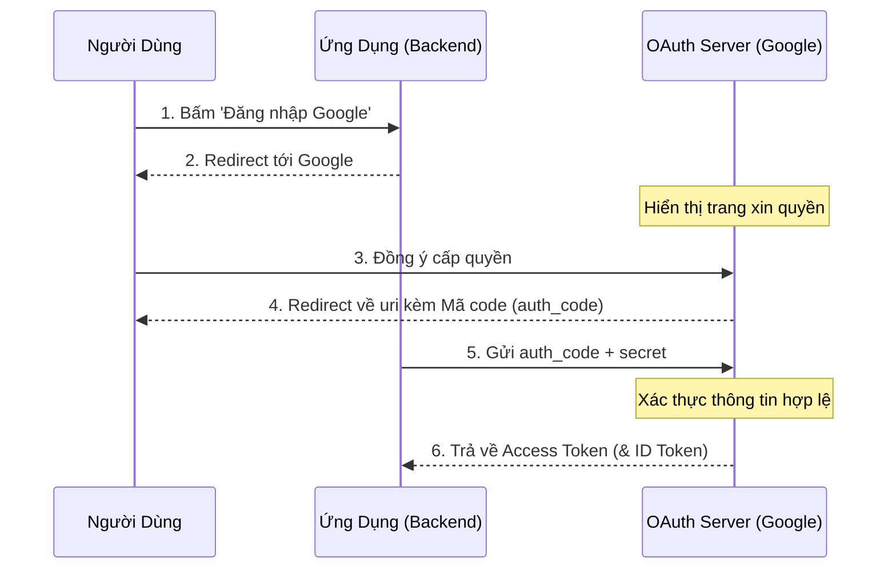

## I. KHÁI QUÁT (OVERVIEW)

### 1. OAuth2 là gì?
Khi bạn sử dụng tính năng *"Đăng nhập bằng Google"* hoặc *"Đăng nhập bằng Facebook"* trên một trang web bất kỳ, bạn đang sử dụng giao thức **OAuth2**.

**OAuth 2.0** là một khung giao thức (Framework) tiêu chuẩn công nghiệp dành cho **Ủy quyền (Authorization)**. Nó cho phép một ứng dụng bên thứ ba (Client) truy cập một phần tài nguyên giới hạn của người dùng (Resource Owner) trên một dịch vụ khác (Resource Server) mà người dùng không cần phải tiết lộ mật khẩu đăng nhập của mình cho ứng dụng bên thứ ba đó.

---

### 2. Sự khác biệt: OAuth2 (Ủy quyền) vs OpenID Connect (Xác thực)
* **OAuth 2.0:** Chỉ sinh ra để **Ủy quyền (Authorization)**. Nó trả về một `Access Token` giúp ứng dụng của bạn gọi các API của Google lấy dữ liệu. Nó không trả lời cho câu hỏi: *"Người dùng này là ai?"*.
* **OpenID Connect (OIDC):** Là một lớp nhận dạng (Identity Layer) được xây dựng **đè lên trên OAuth 2.0** để phục vụ cho việc **Xác thực (Authentication)**. Nó giới thiệu thêm khái niệm **ID Token** (luôn là một JWT) chứa các thông tin cá nhân của người dùng (như name, email, avatar).

---

## II. CHI TIẾT KỸ THUẬT (DETAILED DEEP DIVE)

### 1. Luồng mã ủy quyền (Authorization Code Flow)

Đây là luồng chuẩn, bảo mật nhất của OAuth2 dành cho các ứng dụng có Server Web truyền thống (Backend):



#### Bước 1 & 2: Redirect tới trang ủy quyền
Ứng dụng chuyển hướng trình duyệt của người dùng tới máy chủ OAuth của Google kèm theo các tham số:
* `client_id`: Định danh của ứng dụng.
* `redirect_uri`: Địa chỉ URL của Backend mà Google sẽ gửi mã Code về sau khi người dùng đồng ý.
* `scope`: Các quyền muốn xin (ví dụ: `email`, `profile`).
* `state`: Một chuỗi ngẫu nhiên sinh ra để chống tấn công **CSRF**.

#### Bước 3 & 4: Nhận Authorization Code
Người dùng đăng nhập và bấm nút xác nhận đồng ý cho phép ứng dụng truy cập. Google chuyển hướng trình duyệt của người dùng quay trở lại `redirect_uri` của ứng dụng, đính kèm một mã tạm thời gọi là **`code` (Authorization Code)** trên thanh URL.

#### Bước 5 & 6: Trao đổi Code lấy Token
Server Backend của ứng dụng nhận mã `code` từ URL, sau đó gửi một request POST ẩn (mặt sau - backchannel) trực tiếp lên Server của Google, truyền kèm mã `code` đó cùng với khóa bí mật **`client_secret`** của ứng dụng. Google xác thực và trả về **`Access Token`** (và **`ID Token`** nếu dùng OIDC).

---

## III. VÍ DỤ MINH HỌA VÀ PHÂN TÍCH CODE (CODE ANALYSIS)

Dưới đây là đoạn code thô mô tả cách Backend Node.js thực hiện bước 5 & 6 (trao đổi `code` lấy Token từ Google API Server):

```javascript
const axios = require('axios'); // Thư viện gọi HTTP Request

async function handleGoogleCallback(authCode) {
  try {
    const response = await axios.post('https://oauth2.googleapis.com/token', {
      code: authCode,
      client_id: 'GOOGLE_CLIENT_ID_REAL.apps.googleusercontent.com',
      client_secret: 'GOOGLE_CLIENT_SECRET_SECRET',
      redirect_uri: 'http://localhost:3000/auth/google/callback',
      grant_type: 'authorization_code' // Ép buộc chỉ định luồng
    });

    const { access_token, id_token } = response.data;
    console.log("Access Token dùng để gọi API:", access_token);
    console.log("ID Token (JWT) chứa thông tin User:", id_token);
    
    return { access_token, id_token };
  } catch (error) {
    console.error("Trao đổi Token thất bại:", error.response.data);
  }
}
```

---

## IV. LƯU Ý, CẠM BẪY VÀ QUY TẮC CỐT LÕI (BEST PRACTICES)

> [!CAUTION]
> ### 1. Cấm lộ `client_secret` và Cấu hình bảo mật PKCE
> File khóa bí mật `client_secret` do Google cấp là chứng chỉ tối cao để xác thực ứng dụng của bạn. 
> * **Quy tắc cốt lõi:** Tuyệt đối không được nhét `client_secret` vào code Frontend (Angular, React, Vue) hoặc ứng dụng Mobile (iOS/Android). Vì hacker có thể tải file ứng dụng về, giải nén và dịch ngược để lấy trộm khóa.
> * **Giải pháp cho Mobile/Single Page App:** Sử dụng luồng mở rộng **Authorization Code Flow with PKCE (Proof Key for Code Exchange)**. Luồng này sử dụng cơ chế băm mật khẩu động bằng mã `code_verifier` và `code_challenge` để trao đổi token an toàn mà hoàn toàn không cần dùng đến `client_secret`.

> [!IMPORTANT]
> ### 2. Luôn sử dụng tham số `state`
> Tham số `state` gửi đi ở Bước 2 phải được lưu tạm trong Session của Client (hoặc Cookie được mã hóa). Khi Google trả code về ở Bước 4 kèm theo trường `state`, bạn phải đối chiếu xem 2 giá trị `state` này có khớp nhau hay không. 
>
> Nếu không khớp, từ chối xử lý ngay lập tức vì đây có thể là cuộc tấn công **CSRF** giả mạo redirect.
