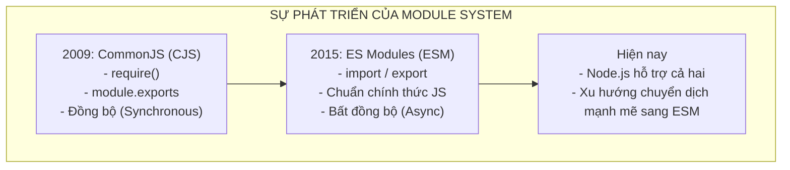
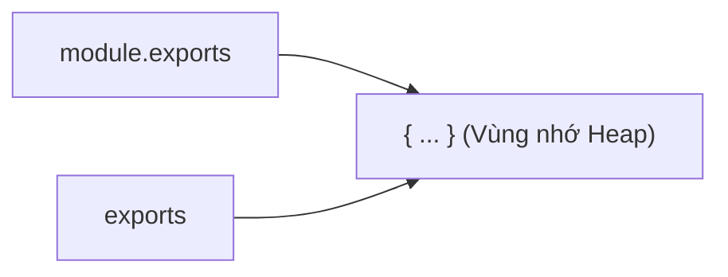
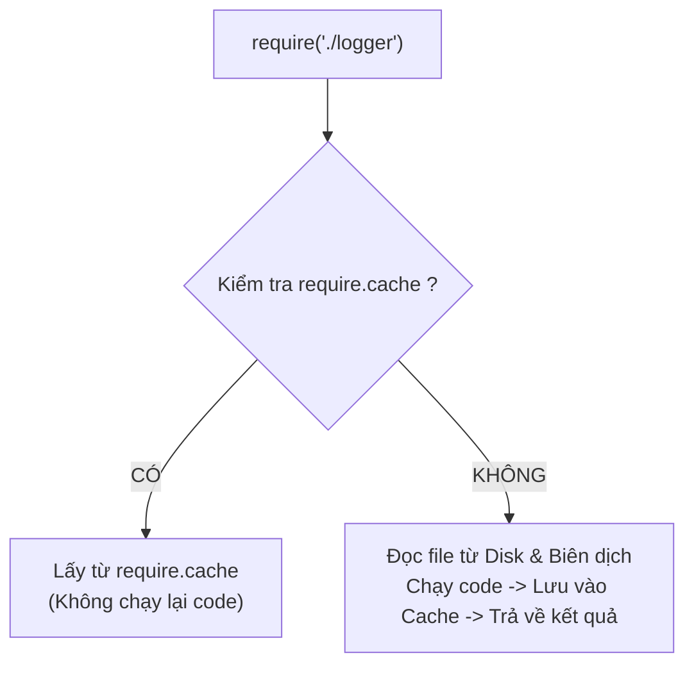
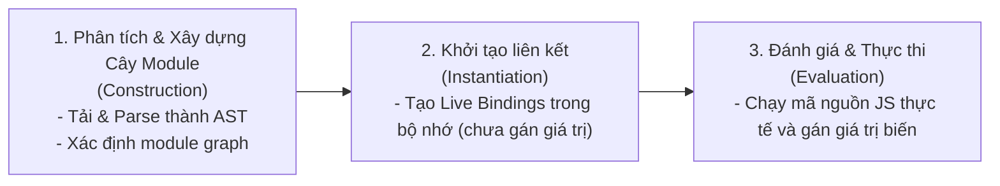
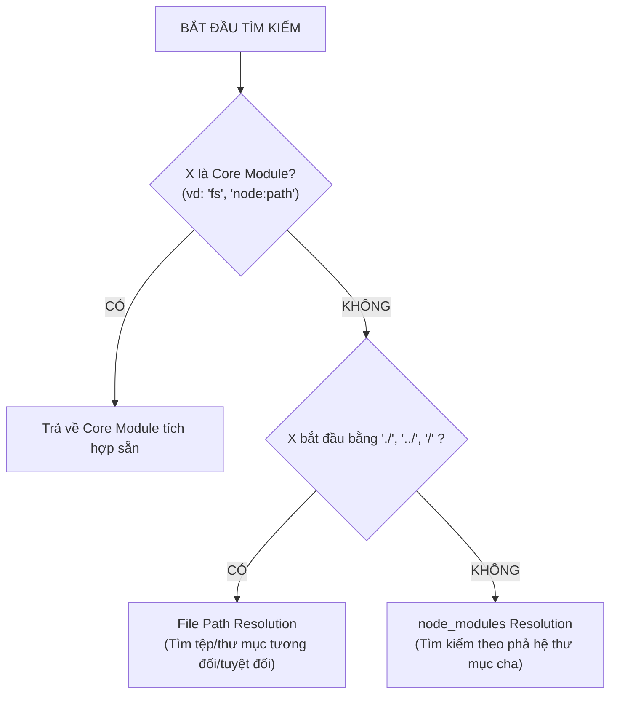
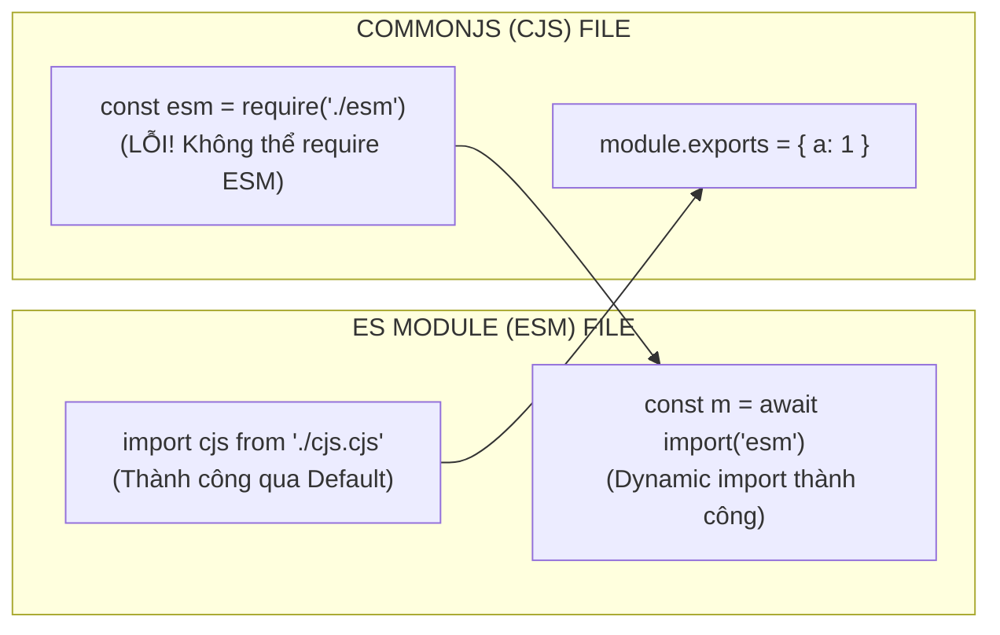
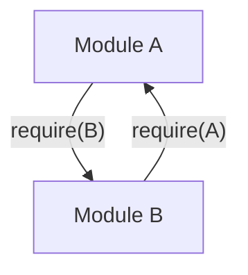

## I. KHÁI QUÁT (OVERVIEW)

### 1. Sự tiến hóa của Hệ thống Module trong JavaScript và Node.js
Trong những ngày đầu của JavaScript, ngôn ngữ này không có bất kỳ hệ thống quản lý module chính thức nào. Tất cả biến, hàm và đối tượng đều được đưa vào không gian tên toàn cục (**Global Scope** / `window`). Điều này dẫn đến các thảm họa trong các ứng dụng quy mô lớn:
- **Ô nhiễm không gian tên toàn cục (Global Namespace Pollution):** Các thư viện dễ dàng ghi đè biến của nhau.
- **Xung đột tên biến (Naming Collisions):** Khó kiểm soát việc trùng tên hàm hoặc biến.
- **Khó quản lý phụ thuộc (Dependency Hell):** Thứ tự tải thẻ `<script>` trong HTML quyết định sự sống còn của ứng dụng.

Để giải quyết bài toán này trên môi trường máy chủ (Server-side), **Node.js** (từ 2009) đã áp dụng đặc tả **CommonJS (CJS)**. Cho đến năm 2015, khi ECMAScript 2015 (ES6) ra đời, chuẩn **ES Modules (ESM)** chính thức được đưa vào đặc tả JavaScript tiêu chuẩn.



---

### 2. So sánh tổng quan giữa CommonJS (CJS) và ES Modules (ESM)

| Tiêu chí | CommonJS (CJS) | ES Modules (ESM) |
| :--- | :--- | :--- |
| **Cú pháp cốt lõi** | `const pkg = require('./pkg')`<br>`module.exports = ...` | `import pkg from './pkg.js'`<br>`export default ...` / `export { ... }` |
| **Cơ chế nạp (Loading)** | **Đồng bộ (Synchronous)** - Chặn luồng thực thi khi nạp module | **Bất đồng bộ (Asynchronous)** - Nạp và phân tích cú pháp không chặn |
| **Thời điểm phân tích** | **Runtime** (Khi code đang chạy mới xác định module) | **Static / Compile-time** (Phân tích cấu trúc trước khi code chạy) |
| **Tree-shaking (Dọn mã thừa)** | Rất khó hoặc không thể tối ưu tĩnh | **Tuyệt vời** nhờ cấu trúc tĩnh (Static Analysis) |
| **Top-level Await** | Không hỗ trợ (phải bọc trong `async IIFE`) | **Hỗ trợ sẵn** từ Node.js 14.8+ |
| **Giá trị trả về** | **Bản sao giá trị / Đối tượng tham chiếu** (Value Copy/Ref) | **Live Bindings** (Liên kết trực tiếp tới biến gốc) |
| **Biến môi trường sẵn có** | `__dirname`, `__filename`, `exports`, `require` | Không có (thay thế bằng `import.meta.url`) |
| **Từ khóa `this` ở Root** | Trỏ tới đối tượng `exports` (`this === exports`) | `undefined` |
| **Đuôi mở rộng mặc định** | `.cjs` (hoặc `.js` khi không khai báo type) | `.mjs` (hoặc `.js` khi `package.json` có `"type": "module"`) |

---

## II. CHI TIẾT KỸ THUẬT (DETAILED DEEP DIVE)

### 1. CommonJS (CJS) Deep Dive

#### a. Cơ chế Module Wrapper Function (Bọc hàm ngầm định)
Khi bạn viết một file trong CommonJS, Node.js không thực thi trực tiếp mã nguồn thô của bạn. Thay vào đó, Node.js bọc toàn bộ nội dung file vào một hàm ẩn danh với 5 tham số:

```javascript
// Node.js ngầm thực thi hàm bọc này:
(function(exports, require, module, __filename, __dirname) {
  // --- MÃ NGUỒN CỦA BẠN ĐƯỢC ĐẶT TẠI ĐÂY ---
  const myVar = 100;
  module.exports = { myVar };
  // ----------------------------------------
});
```

Chính nhờ hàm wrapper này mà:
- Biến khai báo ở cấp cao nhất (Top-level variables như `const myVar`) không bị rò rỉ ra phạm vi toàn cục (`global`).
- Các biến `exports`, `require`, `module`, `__filename`, `__dirname` luôn sẵn sàng để sử dụng dù bạn không hề khai báo hay import chúng.

#### b. Bản chất của `module.exports` và `exports`
Một trong những lỗi phổ biến nhất trong Node.js là hiểu sai mối liên hệ giữa `module.exports` và `exports`.
- Thực chất, `exports` chỉ là một **biến tham chiếu (reference pointer)** trỏ tới cùng vùng nhớ của `module.exports`:



- Node.js sẽ luôn luôn trả về giá trị của **`module.exports`** khi một module khác `require()` file đó.
- Nếu bạn gán lại `exports = { ... }`, bạn đã cắt đứt sợi dây liên kết tới `module.exports`. Lúc này `module.exports` vẫn là đối tượng cũ (mặc định là `{}`), khiến module không export được gì.

```javascript
// ĐÚNG: Gắn thêm thuộc tính vào đối tượng chung
exports.getName = () => "Node.js"; // module.exports cũng có { getName }

// ĐÚNG: Gán lại trực tiếp cho module.exports
module.exports = { getName: () => "Node.js" };

// SAI HOÀN TOÀN: Làm đứt liên kết tham chiếu
exports = { getName: () => "Node.js" }; // module.exports vẫn là {} rỗng!
```

#### c. Cơ chế Module Caching (`require.cache`)
Khi một module được `require()` lần đầu tiên:
1. Node.js tìm kiếm, đọc file từ ổ đĩa và biên dịch mã nguồn.
2. Thực thi mã trong Module Wrapper.
3. Lưu đối tượng `module.exports` đã hoàn thiện vào **`require.cache`**.
4. Các lần gọi `require()` tiếp theo với cùng đường dẫn tuyệt đối (Absolute Path) sẽ **KHÔNG** đọc lại file hay thực thi lại mã nguồn, mà trả về ngay lập tức giá trị đã lưu trong cache.



```javascript
// Xem toàn bộ cache các module đã nạp:
console.log(require.cache);

// Xóa cache của một module để buộc nạp lại khi require tiếp theo:
const targetPath = require.resolve('./my-module');
delete require.cache[targetPath];
```

---

### 2. ES Modules (ESM) Deep Dive

#### a. Quy trình nạp 3 giai đoạn của ESM (3-Phase Loading Pipeline)
Khác với CJS (vốn đọc và thực thi code đồng bộ từ trên xuống dưới tại thời điểm chạy), ES Modules hoạt động bất đồng bộ theo 3 giai đoạn độc lập:



1. **Construction (Xây dựng):** Node.js tìm kiếm tất cả các file được import, tải nội dung và phân tích cú pháp (Parsing) thành Module Record. Toàn bộ đồ thị phụ thuộc (Module Dependency Graph) được xây dựng hoàn tất trước khi bất kỳ dòng code nào chạy.
2. **Instantiation (Khởi tạo liên kết):** Tạo các vị trí lưu trữ trong bộ nhớ cho tất cả các phần tử export và import, kết nối chúng bằng cơ chế **Live Bindings**. Tại bước này, các biến chưa được gán giá trị thực tế.
3. **Evaluation (Đánh giá & Thực thi):** Chạy mã JavaScript thực tế từ các node lá (leaf modules) lên đến node gốc. Các biến được gán giá trị thực tế.

#### b. Bản chất Live Bindings trong ESM
Trong CommonJS, khi bạn import một biến có kiểu nguyên thủy, bạn chỉ nhận được **bản sao giá trị (Value Copy)** tại thời điểm export. Nếu module gốc thay đổi biến đó, bên import không hề biết.

Ngược lại, ESM sử dụng **Live Bindings (Liên kết trực tiếp)**:
- Bên import nhận được một con trỏ tham chiếu động (Read-only live view) trỏ thẳng vào biến của module export.
- Khi module export cập nhật giá trị biến, module import lập tức thấy được giá trị mới nhất!

```javascript
// counter.mjs
export let count = 0;
export function increment() {
  count++;
}

// main.mjs
import { count, increment } from './counter.mjs';

console.log(count); // In ra: 0
increment();
console.log(count); // In ra: 1 (Tự động cập nhật nhờ Live Binding!)
// count = 10;      // LỖI: TypeError: Assignment to constant variable (Bên import không được tự sửa biến)
```

#### c. Top-Level Await trong ESM
Trong ESM, bạn có thể sử dụng từ khóa `await` trực tiếp ở cấp cao nhất của module mà không cần phải bọc trong một hàm `async` tự gọi (IIFE). Module cha import module này sẽ tự động chờ cho đến khi Promise ở Top-level của module con hoàn thành (Resolve).

```javascript
// database.js (ESM)
import { createConnection } from 'some-db-library';

// Top-level await: Tự động chặn quá trình Evaluation của module cho đến khi kết nối DB xong
export const dbConnection = await createConnection({ host: 'localhost', port: 5432 });
```

---

### 3. Cấu hình `"type": "module"` trong package.json và ý nghĩa của File Extensions

Node.js xác định một file là CJS hay ESM dựa trên 2 yếu tố: **Phần mở rộng của tệp (.extension)** và **Trường `"type"` trong `package.json` gần nhất**.

```mermaid
flowchart TD
    EXT{"Phần mở rộng tệp?"}
    EXT -->|".mjs file"| ESM1["Luôn là ESM"]
    EXT -->|".cjs file"| CJS1["Luôn là CJS"]
    EXT -->|".js file"| PKG{"Kiểm tra \"type\" trong package.json gần nhất"}
    PKG -->|"\"type\": \"module\" (hoặc không có)"| ESM2["Xử lý là ESM"]
    PKG -->|"\"type\": \"commonjs\""| CJS2["Xử lý là CJS"]
```

- **Quy tắc phạm vi (Scope Rule):** Khai báo `"type"` trong `package.json` áp dụng cho tất cả các file `.js` trong cùng thư mục đó và tất cả các thư mục con, trừ khi một thư mục con chứa một file `package.json` riêng biệt định nghĩa lại `"type"`.

---

### 4. Thuật toán phân giải Module (Module Resolution Algorithm)

Khi bạn gọi `require(X)` hoặc `import X from '...'`, Node.js thực hiện thuật toán tìm kiếm nghiêm ngặt theo các bước sau:



#### a. File Paths Resolution (Đường dẫn tệp)
1. **Tìm chính xác X:** Kiểm tra xem đường dẫn `X` có tồn tại chính xác dưới dạng file không.
2. **Thử thêm các đuôi mở rộng (Extension probing):**
   - Trong CommonJS: Tự động thử `X.js` -> `X.json` -> `X.node`.
   - Trong ES Modules: **Bắt buộc** phải ghi rõ extension (ví dụ: `import './user.js'`), Node.js ESM mặc định không tự động đoán extension (trừ khi bật cờ thực nghiệm).
3. **Tìm trong Thư mục (Directory Index):**
   - Nếu `X` là thư mục: Kiểm tra `X/package.json` xem có trường `"main"` hay không.
   - Nếu không có, thử tìm `X/index.js` -> `X/index.json` -> `X/index.node`.

#### b. node_modules Resolution (Tìm kiếm module bên thứ 3)
Nếu `X` không phải là Core Module và không bắt đầu bằng `./`, `../` hoặc `/` (ví dụ `require('express')`):
Node.js sẽ tìm thư mục `node_modules` ở thư mục hiện tại, nếu không thấy sẽ lùi dần lên thư mục cha, rồi cha của cha, cho đến tận gốc ổ đĩa (`/` trên Linux hoặc `C:\` trên Windows).

```text
Giả sử file đang chạy tại: /home/user/projects/my-app/src/index.js
Node.js sẽ lần lượt tìm 'express' tại:
1. /home/user/projects/my-app/src/node_modules/express
2. /home/user/projects/my-app/node_modules/express
3. /home/user/projects/node_modules/express
4. /home/user/node_modules/express
5. /home/node_modules/express
6. /node_modules/express
(Nếu vẫn không thấy -> Bắn lỗi MODULE_NOT_FOUND)
```

#### c. Trường `"exports"` trong `package.json` (Package Entry Points)
Các package hiện đại sử dụng trường `"exports"` trong `package.json` để kiểm soát các điểm truy cập công khai và hỗ trợ cả CJS lẫn ESM (Conditional Exports):

```json
{
  "name": "my-awesome-lib",
  "exports": {
    "import": "./dist/esm/index.js",
    "require": "./dist/cjs/index.cjs",
    "./feature": "./dist/esm/feature.js"
  }
}
```

---

### 5. Interoperability (Tương tác qua lại giữa CJS và ESM)

Khi dự án đang trong quá trình chuyển đổi giữa hai hệ thống module, bạn sẽ gặp các trường hợp tương tác qua lại:



#### a. Import CommonJS từ ES Modules
- **Hỗ trợ đầy đủ qua Default Import:** Khi import một file CJS từ ESM, toàn bộ `module.exports` của CJS sẽ trở thành `default` export trong ESM.
  ```javascript
  // Trong file ESM:
  import cjsModule from './legacy-module.cjs';
  console.log(cjsModule); // Chính là module.exports của file CJS
  ```
- **Cạm bẫy Named Import từ CJS:** Node.js sử dụng bộ phân tích tĩnh (CJS-Lexer) để cố gắng đoán các Named exports từ file CJS. Tuy nhiên, nếu CJS export đối tượng động tại runtime, Named import sẽ bị lỗi:
  ```javascript
  // dynamic-cjs.cjs
  const methods = ['get', 'post'];
  methods.forEach(m => { exports[m] = () => console.log(m); });
  
  // app.mjs
  // import { get } from './dynamic-cjs.cjs'; // LỖI: SyntaxError: Named export 'get' not found
  import pkg from './dynamic-cjs.cjs';         // ĐÚNG: Import default rồi truy cập thuộc tính
  pkg.get();
  ```

#### b. Import ES Modules từ CommonJS
- **`require(ESM)` là KHÔNG THỂ:** Vì `require()` là hàm đồng bộ (Synchronous), trong khi ESM có thể chứa Top-Level Await và quy trình nạp bất đồng bộ, nên `require('./file.mjs')` sẽ ném ra lỗi `ERR_REQUIRE_ESM`.
- **Giải pháp duy nhất:** Phải sử dụng **Dynamic `import()`**:
  ```javascript
  // Trong file CJS:
  async function loadESModule() {
    const esmModule = await import('./modern-module.mjs');
    esmModule.someFunction();
  }
  ```

---

### 6. Circular Dependencies (Phụ thuộc vòng lặp)

Hiện tượng Circular Dependency xảy ra khi Module A require Module B, và Module B lại require ngược lại Module A.



#### a. Cách CommonJS xử lý Circular Dependency
Trong CJS, khi phát hiện vòng lặp, Node.js sẽ trả về ngay lập tức đối tượng `module.exports` của module đang được gọi **tại thời điểm dở dang hiện tại (Incomplete copy)**.

```javascript
// a.js
exports.done = false;
const b = require('./b.js');
console.log('Trong a.js, b.done =', b.done);
exports.done = true;
console.log('a.js hoàn thành');

// b.js
exports.done = false;
const a = require('./a.js'); // Tại đây a.js chưa chạy xong, a.done mới là false!
console.log('Trong b.js, a.done =', a.done);
exports.done = true;
console.log('b.js hoàn thành');

// main.js
require('./a.js');
```
*Kết quả chạy CJS:*
1. `b.js` được gọi từ `a.js`.
2. `b.js` require lại `a.js` -> Nhận bản sao dở dang `{ done: false }`.
3. `b.js` chạy xong (`b.done = true`).
4. Quay lại `a.js` tiếp tục chạy nốt.

#### b. Cách ESM xử lý Circular Dependency
Nhờ tách biệt pha **Instantiation** (tạo liên kết biến) và **Evaluation** (chạy code), ESM hỗ trợ Circular Dependencies mượt mà hơn nhờ **Live Bindings**. Tuy nhiên, nếu bạn truy cập vào biến `let` / `const` trước khi dòng khai báo của nó được thực thi, bạn sẽ gặp lỗi **TDZ (Temporal Dead Zone - `ReferenceError: Cannot access before initialization`)**. Nếu truy cập hàm (`function declaration`), việc gọi chéo vẫn thành công nhờ cơ chế Function Hoisting.

---

## III. VÍ DỤ MINH HỌA VÀ PHÂN TÍCH CODE (CODE EXAMPLES & ANALYSIS)

### Ví dụ 1: So sánh cơ chế Caching và Invalidation trong CommonJS

Tạo cấu trúc module kiểm chứng tính chất Singleton của Module Cache:

```javascript
// configStore.js
console.log("[configStore.js] Đang khởi tạo module lần đầu...");

let config = {
  theme: "dark",
  apiUrl: "https://api.example.com",
  timestamp: Date.now()
};

module.exports = {
  getConfig: () => config,
  setTheme: (newTheme) => { config.theme = newTheme; }
};
```

```javascript
// app.js
console.log("--- BƯỚC 1: Require lần thứ nhất ---");
const store1 = require('./configStore');
console.log("Theme ban đầu:", store1.getConfig().theme);

console.log("\n--- BƯỚC 2: Thay đổi dữ liệu qua store1 ---");
store1.setTheme("light");

console.log("\n--- BƯỚC 3: Require lần thứ hai tại một nơi khác ---");
// Không in ra dòng '[configStore.js] Đang khởi tạo...', vì lấy từ require.cache
const store2 = require('./configStore');
console.log("Theme từ store2:", store2.getConfig().theme); // In ra "light" do dùng chung cache!

console.log("\n--- BƯỚC 4: Xóa Cache (Cache Invalidation) và Require lại ---");
const resolvedPath = require.resolve('./configStore');
delete require.cache[resolvedPath]; // Xóa khỏi cache

const store3 = require('./configStore'); // File configStore.js được thực thi lại từ đầu!
console.log("Theme sau khi reset cache:", store3.getConfig().theme); // Trở về "dark"
```

---

### Ví dụ 2: Thay thế `__dirname` và `__filename` trong ES Modules chuẩn mực

Trong ES Modules, các biến toàn cục `__dirname` và `__filename` không hề tồn tại. Để lấy đường dẫn thư mục và file hiện tại một cách chuẩn xác trên mọi hệ điều hành (Windows, Linux, macOS), ta sử dụng `import.meta.url` kết hợp với module `node:url` và `node:path`:

```javascript
// utils-esm.js (ESM)
import { fileURLToPath } from 'node:url';
import path from 'node:path';

// 1. import.meta.url trả về URL dạng: 'file:///home/user/project/src/utils-esm.js'
console.log("URL hiện tại:", import.meta.url);

// 2. Chuyển đổi URL thành đường dẫn tệp tuyệt đối phù hợp với OS (__filename tương đương)
const __filename = fileURLToPath(import.meta.url);
console.log("__filename tương đương:", __filename);

// 3. Lấy đường dẫn thư mục chứa tệp (__dirname tương đương)
const __dirname = path.dirname(__filename);
console.log("__dirname tương đương:", __dirname);

// 4. Tạo đường dẫn an toàn tới file cấu hình nằm ở thư mục cha
const configPath = path.resolve(__dirname, '../config/app.json');
console.log("Đường dẫn config:", configPath);
```

---

### Ví dụ 3: Sử dụng Dynamic `import()` để tối ưu hiệu năng (Lazy Loading)

Dynamic `import()` là hàm bất đồng bộ trả về một Promise, có thể dùng ở cả CJS và ESM để nạp module theo điều kiện:

```javascript
// paymentProcessor.js
async function processPayment(paymentMethod, amount) {
  console.log(`Đang khởi tạo thanh toán ${amount} VND...`);

  if (paymentMethod === 'stripe') {
    // Chỉ nạp thư viện Stripe khi người dùng thực sự chọn Stripe (Lazy Load)
    const { StripeService } = await import('./services/stripeService.js');
    const stripe = new StripeService();
    return stripe.charge(amount);
  } else if (paymentMethod === 'paypal') {
    // Chỉ nạp thư viện Paypal khi cần
    const { PaypalService } = await import('./services/paypalService.js');
    const paypal = new PaypalService();
    return paypal.pay(amount);
  } else {
    throw new Error(`Phương thức thanh toán không hỗ trợ: ${paymentMethod}`);
  }
}
```

---

## IV. LƯU Ý, CẠM BẪY VÀ QUY TẮC CỐT LÕI (BEST PRACTICES & CAVEATS)

> [!CAUTION]
> ### 1. Cạm bẫy gán đè `exports = ...` trong CommonJS
> Tuyệt đối không gán trực tiếp một giá trị mới vào biến `exports`.
> ```javascript
> // SAI: Sẽ làm đứt liên kết với module.exports, bên ngoài require sẽ nhận {} rỗng!
> exports = class UserService {};
> 
> // ĐÚNG: Gán thẳng vào module.exports
> module.exports = class UserService {};
> ```

> [!WARNING]
> ### 2. Cạm bẫy nạp module ESM từ CommonJS bằng `require()`
> Không thể sử dụng `require('./my-esm-file.mjs')`. Node.js sẽ ngay lập tức dừng chương trình với lỗi `ERR_REQUIRE_ESM`.
> Khi bắt buộc phải nạp mã ESM từ một codebase CJS cũ, bạn **phải** dùng cú pháp Dynamic Import:
> ```javascript
> // Giải pháp cho CJS nạp ESM:
> async function main() {
>   const myEsmModule = await import('./my-esm-file.mjs');
>   myEsmModule.run();
> }
> ```

> [!IMPORTANT]
> ### 3. Bắt buộc có phần mở rộng file (Extensions) trong ES Modules
> Khi viết mã nguồn theo chuẩn ESM thuần trong Node.js (với `"type": "module"`):
> ```javascript
> // SAI trong Node.js ESM mặc định (sẽ gây lỗi ERR_MODULE_NOT_FOUND):
> import { helper } from './utils';
> 
> // ĐÚNG: Phải ghi rõ phần mở rộng .js / .mjs
> import { helper } from './utils.js';
> ```

> [!TIP]
> ### 4. Quy chuẩn xây dựng thư viện Hybrid (Hỗ trợ cả CJS và ESM)
> Nếu bạn xây dựng một thư viện (npm package) cho cộng đồng, hãy thiết lập `package.json` với trường `"exports"` đa điều kiện (Conditional Exports) để cả người dùng CJS lẫn ESM đều có thể sử dụng mượt mà không gặp lỗi:
> ```json
> {
>   "name": "my-library",
>   "version": "1.0.0",
>   "type": "module",
>   "main": "./dist/index.cjs",
>   "module": "./dist/index.js",
>   "exports": {
>     ".": {
>       "import": "./dist/index.js",
>       "require": "./dist/index.cjs"
>     },
>     "./package.json": "./package.json"
>   }
> }
> ```
