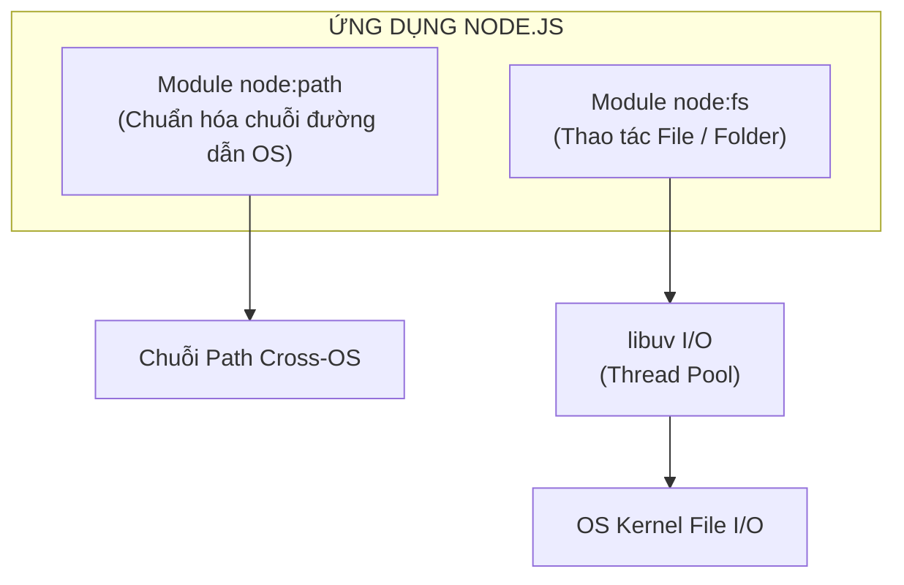
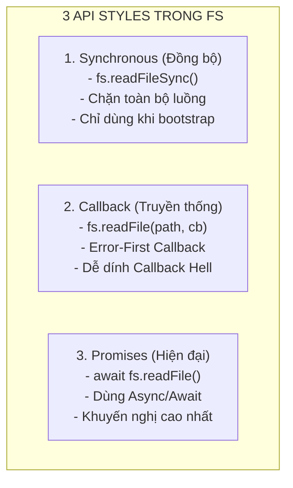
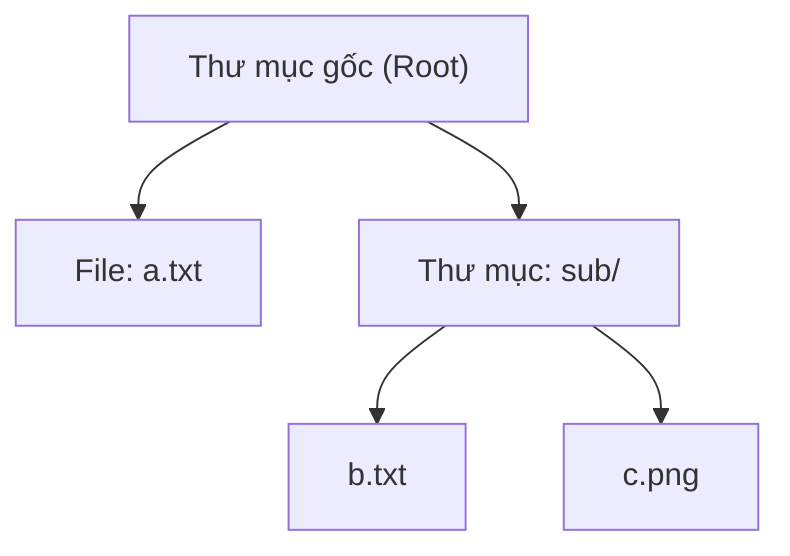
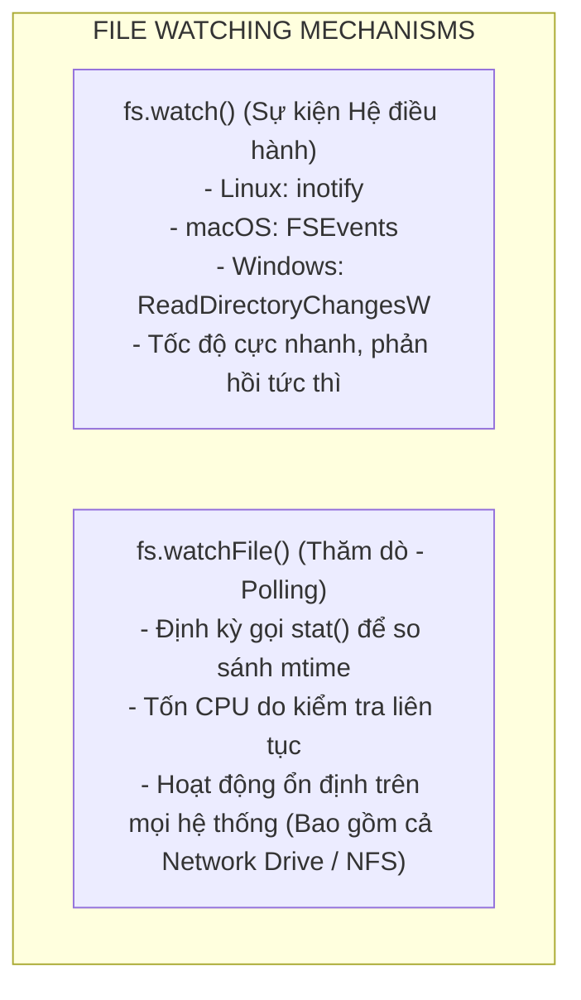
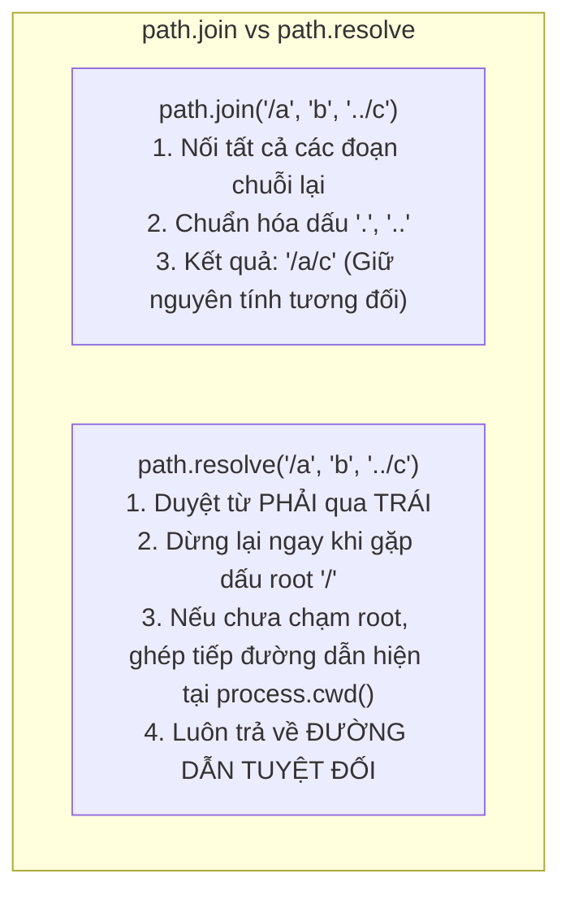

## I. KHÁI QUÁT (OVERVIEW)

### 1. Vai trò của File System (`node:fs`) và Path (`node:path`) trong Backend Node.js
Trong kiến trúc phần mềm Backend, tương tác với hệ thống tệp tin (File I/O) là một trong những tác vụ thiết yếu và phổ biến nhất: từ việc đọc cấu hình (.env, .json), lưu trữ ảnh/video của người dùng, ghi log hệ thống, xử lý tệp CSV/Excel báo cáo, đến việc xây dựng các công cụ build tool và cơ chế Hot-Reload.

Node.js cung cấp hai module hạt nhân (Core Modules) chuyên trách:
* **`node:fs` (File System):** Cung cấp API tương tác trực tiếp với hệ thống tập tin của hệ điều hành (POSIX standard). Mọi tác vụ I/O nặng đều được libuv ủy quyền ngầm cho **Thread Pool** (mặc định 4 threads) để không làm nghẽn Event Loop.
* **`node:path` (Path):** Cung cấp các tiện ích chuẩn hóa, trích xuất và biến đổi các chuỗi đường dẫn tệp tin sao cho tương thích tuyệt đối trên các hệ điều hành khác nhau (POSIX như Linux/macOS vs Windows).



---

### 2. 3 Kiểu API trong Mô-đun `fs` (API Styles)

Mô-đun `fs` hỗ trợ 3 phong cách lập trình để phù hợp với từng ngữ cảnh sử dụng:



| Kiểu API | Cú pháp Import | Ưu điểm | Nhược điểm / Khuyến cáo |
| :--- | :--- | :--- | :--- |
| **Promises API** *(Khuyến nghị)* | `import fs from 'node:fs/promises'` hoặc `const fs = require('node:fs/promises')` | Cú pháp `async/await` sạch sẽ, dễ bắt lỗi qua `try/catch`, không chặn Event Loop | Không hỗ trợ trên các phiên bản Node.js cổ xưa (< 10.0) |
| **Callback API** | `import fs from 'node:fs'` hoặc `const fs = require('node:fs')` | Bất đồng bộ, tương thích 100% với mọi phiên bản Node.js từ xưa đến nay | Dễ dẫn đến hiện tượng Callback Hell nếu lồng nhiều tác vụ I/O |
| **Synchronous API** | `fs.readFileSync()`, `fs.writeFileSync()` | Đơn giản, thực thi tuần tự, không cần Promise | **Chặn hoàn toàn Event Loop**. Tuyệt đối không dùng trong Request Handlers của Web Server |

---

## II. CHI TIẾT KỸ THUẬT (DETAILED DEEP DIVE)

### 1. Các thao tác tập tin cốt lõi (Core File Operations)

#### a. Đọc tập tin (`readFile`)
Khi đọc tập tin, nếu không chỉ định kiểu mã hóa (`encoding`), Node.js sẽ trả về một đối tượng **`Buffer`** (dữ liệu nhị phân thô). Để nhận chuỗi văn bản, cần truyền encoding `'utf-8'`.

```javascript
import fs from 'node:fs/promises';

// Trả về chuỗi văn bản (String)
const contentText = await fs.readFile('./data.txt', { encoding: 'utf-8' });

// Trả về Buffer nhị phân (phù hợp cho file nhị phân: ảnh, pdf, video)
const contentBuffer = await fs.readFile('./image.png');
```

#### b. Ghi và Nối tập tin (`writeFile`, `appendFile`)
- **`writeFile`:** Ghi đè toàn bộ nội dung tệp. Nếu tệp chưa tồn tại, Node.js sẽ tự động tạo mới tệp.
- **`appendFile`:** Chèn thêm nội dung vào cuối tệp hiện có. Nếu tệp chưa tồn tại, nó cũng sẽ được tạo mới.

```javascript
import fs from 'node:fs/promises';

// Ghi đè file
await fs.writeFile('./app.log', 'Khởi động ứng dụng\n', { encoding: 'utf-8', flag: 'w' });

// Nối tiếp vào cuối file (phù hợp cho logging)
await fs.appendFile('./app.log', '[INFO] Người dùng đăng nhập thành công\n', { encoding: 'utf-8' });
```

#### c. Đổi tên, Di chuyển và Xóa tệp (`rename`, `unlink`, `rm`)
- **`rename(oldPath, newPath)`:** Đổi tên hoặc di chuyển tệp từ vị trí này sang vị trí khác (nguyên tử - atomic operation trong cùng ổ đĩa).
- **`unlink(path)`:** Xóa vĩnh viễn một tệp tin (File).
- **`rm(path, { recursive: true, force: true })`:** Xóa tệp hoặc thư mục (thay thế cho `rmdir` cũ), hỗ trợ xóa đệ quy cả cây thư mục tương đương `rm -rf`.

```javascript
import fs from 'node:fs/promises';

// Đổi tên hoặc di chuyển
await fs.rename('./temp.txt', './archive/temp-2026.txt');

// Xóa tệp đơn lẻ
await fs.unlink('./junk.txt');

// Xóa toàn bộ thư mục và các tệp con bên trong (tương đương rm -rf)
await fs.rm('./temp-folder', { recursive: true, force: true });
```

#### d. Lấy thông tin Metadata của tệp (`stat`, `lstat`)
Phương thức `fs.stat()` trả về đối tượng `fs.Stats` chứa toàn bộ siêu dữ liệu của tệp tin hoặc thư mục:

```javascript
import fs from 'node:fs/promises';

const stats = await fs.stat('./document.pdf');

console.log("Kích thước (bytes):", stats.size);
console.log("Là tệp tin?", stats.isFile());
console.log("Là thư mục?", stats.isDirectory());
console.log("Là Symbolic Link?", stats.isSymbolicLink());
console.log("Thời gian tạo (birthtime):", stats.birthtime);
console.log("Thời gian chỉnh sửa gần nhất (mtime):", stats.mtime);
console.log("Quyền hạn (Mode POSIX):", (stats.mode & parseInt('777', 8)).toString(8));
```

---

### 2. Thao tác và Đệ quy thư mục (Directory Traversal)

#### a. Tạo và Đọc thư mục (`mkdir`, `readdir`)
Khi tạo thư mục lồng nhau nhiều cấp, cờ `{ recursive: true }` cho phép tạo toàn bộ chuỗi thư mục cha nếu chúng chưa tồn tại (tương đương lệnh `mkdir -p` trên Linux):

```javascript
import fs from 'node:fs/promises';

// Tạo cây thư mục lồng nhau an toàn
await fs.mkdir('./storage/uploads/2026/08', { recursive: true });

// Đọc danh sách các mục trong thư mục
const files = await fs.readdir('./storage'); // ['uploads', 'config.json']
```

#### b. Đệ quy thư mục hiện đại (Node.js 18.17+ / 20+)
Kể từ các phiên bản Node.js mới, `fs.readdir` hỗ trợ trực tiếp tham số `{ recursive: true, withFileTypes: true }`, cho phép quét toàn bộ cây thư mục mà không cần tự viết hàm đệ quy phức tạp:

```javascript
import fs from 'node:fs/promises';
import path from 'node:path';

async function scanDirectoryModern(dirPath) {
  const entries = await fs.readdir(dirPath, { recursive: true, withFileTypes: true });

  for (const entry of entries) {
    // entry.parentPath (Node 20+) hoặc path.join(dirPath, ...)
    const fullPath = path.join(entry.parentPath || dirPath, entry.name);
    console.log(`${entry.isDirectory() ? '📁 [DIR]' : '📄 [FILE]'} ${fullPath}`);
  }
}
```

#### c. Tự xây dựng hàm duyệt đệ quy (Custom Recursive Traversal)
Để hiểu sâu thuật toán duyệt cây thư mục (Depth-First Search - DFS) và đảm bảo tương thích mọi môi trường:



```javascript
import fs from 'node:fs/promises';
import path from 'node:path';

async function getFilesRecursively(dir) {
  let results = [];
  const entries = await fs.readdir(dir, { withFileTypes: true });

  for (const entry of entries) {
    const fullPath = path.join(dir, entry.name);
    if (entry.isDirectory()) {
      const subFiles = await getFilesRecursively(fullPath);
      results = results.concat(subFiles);
    } else if (entry.isFile()) {
      results.push(fullPath);
    }
  }

  return results;
}
```

---

### 3. Cơ chế Theo dõi thay đổi tệp (`fs.watch` vs `fs.watchFile`)

Node.js cung cấp hai cơ chế để phát hiện sự kiện file/thư mục bị chỉnh sửa, tạo mới hoặc xóa:



| Đặc điểm | `fs.watch()` | `fs.watchFile()` |
| :--- | :--- | :--- |
| **Cơ chế cốt lõi** | Lắng nghe Kernel Events của HĐH | Polling (thăm dò định kỳ `fs.stat`) |
| **Hiệu năng & Tải CPU** | **Rất thấp / Cực kỳ tối ưu** | Cao hơn đáng kể nếu theo dõi nhiều tệp |
| **Hỗ trợ theo dõi thư mục** | Có (bao gồm cờ `recursive: true` trên macOS/Windows) | Không (chỉ theo dõi từng file đơn lẻ) |
| **Độ ổn định sự kiện** | Đôi khi bắn trùng lặp 2 sự kiện `change` cho 1 lần lưu | Nhất quán, chỉ bắn khi `curr.mtime !== prev.mtime` |

```javascript
import fs from 'node:fs';

// 1. Sử dụng fs.watch (Khuyến nghị cho công cụ Hot-Reload / Dev Server)
const watcher = fs.watch('./src', { recursive: true }, (eventType, filename) => {
  console.log(`[HOT-RELOAD] Sự kiện: ${eventType} tại file: ${filename}`);
});
// Đóng watcher khi không dùng: watcher.close();

// 2. Sử dụng fs.watchFile (Dành cho file đơn lẻ trên Network Mount)
fs.watchFile('./config.json', { interval: 1000 }, (currStats, prevStats) => {
  if (currStats.mtimeMs !== prevStats.mtimeMs) {
    console.log('[CONFIG] File cấu hình đã thay đổi thời gian cập nhật!');
  }
});
// Hủy theo dõi: fs.unwatchFile('./config.json');
```

---

### 4. Mô-đun `node:path` và Xử lý Đường dẫn Đa Nền tảng (Cross-Platform)

Hệ điều hành Windows sử dụng dấu gạch chéo ngược (`\`) làm dấu phân tách đường dẫn (ví dụ: `C:\Users\Admin\file.txt`), trong khi hệ thống POSIX (Linux, macOS, Unix) sử dụng dấu gạch chéo xuôi (`/`) (ví dụ: `/home/admin/file.txt`). 

Tuyệt đối **KHÔNG** tự cộng chuỗi đường dẫn bằng dấu `+` (ví dụ `dir + '/' + file`), mà phải luôn sử dụng `node:path`.

#### a. Các phương thức xử lý đường dẫn quan trọng nhất

```javascript
import path from 'node:path';

const samplePath = '/projects/my-app/src/controllers/userController.js';

// 1. Lấy tên tệp kèm đuôi
console.log(path.basename(samplePath)); // 'userController.js'

// 2. Lấy tên tệp bỏ đuôi mở rộng
console.log(path.basename(samplePath, '.js')); // 'userController'

// 3. Lấy phần mở rộng (Extension)
console.log(path.extname(samplePath)); // '.js'

// 4. Lấy thư mục cha
console.log(path.dirname(samplePath)); // '/projects/my-app/src/controllers'

// 5. Phân tích chuỗi đường dẫn thành Object chi tiết
const parsed = path.parse(samplePath);
console.log(parsed);
/* Output:
{
  root: '/',
  dir: '/projects/my-app/src/controllers',
  base: 'userController.js',
  ext: '.js',
  name: 'userController'
}
*/

// 6. Định dạng ngược lại từ Object thành chuỗi đường dẫn
console.log(path.format(parsed)); // '/projects/my-app/src/controllers/userController.js'

// 7. Chuẩn hóa đường dẫn chứa các dấu '.', '..' hoặc gạch chéo kép '//'
console.log(path.normalize('/foo/bar//baz/asdf/quux/..')); // '/foo/bar/baz/asdf'
```

#### b. Phân biệt chuyên sâu: `path.join()` vs `path.resolve()`

Đây là hai phương thức dễ gây nhầm lẫn nhất nhưng có bản chất hoạt động hoàn toàn khác nhau:



```javascript
import path from 'node:path';

// Giả sử thư mục chạy ứng dụng hiện tại (process.cwd()) là: '/home/user/app'

// --- path.join(): Đơn thuần là nối và chuẩn hóa chuỗi ---
path.join('a', 'b', 'c');            // Trả về: 'a/b/c' (Đường dẫn tương đối)
path.join('/a', 'b', '../c');        // Trả về: '/a/c'
path.join('/a', '/b', 'c');          // Trả về: '/a/b/c' (Coi '/b' như một đoạn bình thường)

// --- path.resolve(): Xử lý như chuỗi lệnh 'cd' liên tiếp trong Terminal ---
path.resolve('a', 'b', 'c');         // Trả về: '/home/user/app/a/b/c' (Gắn thêm process.cwd())
path.resolve('/a', 'b', 'c');        // Trả về: '/a/b/c' (Dừng lại ở '/a' vì là root)
path.resolve('/a', '/b', 'c');       // Trả về: '/b/c' (Gặp '/b' là root mới, vứt bỏ toàn bộ phía trước '/a')
```

#### c. Cross-Platform: `path.sep`, `path.posix`, `path.win32`
- **`path.sep`:** Dấu phân cách của hệ thống hiện tại (`/` trên Linux/macOS, `\` trên Windows).
- **`path.delimiter`:** Dấu phân cách biến môi trường PATH (`:` trên POSIX, `;` trên Windows).
- **`path.posix`:** Luôn hoạt động theo quy tắc chuẩn POSIX kể cả khi code đang chạy trên Windows.
- **`path.win32`:** Luôn hoạt động theo quy tắc Windows kể cả khi code đang chạy trên Linux.

---

## III. VÍ DỤ MINH HỌA VÀ PHÂN TÍCH CODE (CODE EXAMPLES & ANALYSIS)

### Ví dụ 1: Xây dựng Bộ ghi Log tệp An toàn với cơ chế Atomic Write

Khi nhiều request ghi đồng thời vào file, việc ghi trực tiếp có thể gây lỗi corrupt dữ liệu nếu tiến trình bị crash giữa chừng. Cơ chế **Atomic Write (Ghi qua file tạm rồi Rename)** đảm bảo dữ liệu file luôn toàn vẹn 100%:

```javascript
import fs from 'node:fs/promises';
import path from 'node:path';
import crypto from 'node:crypto';

class SafeJsonStorage {
  constructor(filePath) {
    this.targetPath = path.resolve(filePath);
  }

  // Ghi dữ liệu nguyên tử (Atomic Write)
  async writeData(data) {
    const jsonString = JSON.stringify(data, null, 2);
    
    // 1. Đảm bảo thư mục cha tồn tại
    const dir = path.dirname(this.targetPath);
    await fs.mkdir(dir, { recursive: true });

    // 2. Tạo đường dẫn file tạm với mã hash ngẫu nhiên
    const randomSuffix = crypto.randomBytes(6).toString('hex');
    const tempPath = `${this.targetPath}.${randomSuffix}.tmp`;

    try {
      // 3. Ghi toàn bộ dữ liệu vào file tạm
      await fs.writeFile(tempPath, jsonString, { encoding: 'utf-8' });

      // 4. Đổi tên file tạm đè lên file đích (HĐH đảm bảo Atomic Swap trên cùng phân vùng ổ đĩa)
      await fs.rename(tempPath, this.targetPath);
      console.log(`[SUCCESS] Dữ liệu đã được lưu an toàn tại: ${this.targetPath}`);
    } catch (error) {
      // Nếu có lỗi, dọn dẹp file tạm
      await fs.unlink(tempPath).catch(() => {});
      throw error;
    }
  }

  // Đọc dữ liệu với xử lý lỗi ENOENT (chưa có file)
  async readData() {
    try {
      const content = await fs.readFile(this.targetPath, { encoding: 'utf-8' });
      return JSON.parse(content);
    } catch (error) {
      if (error.code === 'ENOENT') {
        console.warn(`[WARN] File chưa tồn tại, khởi tạo dữ liệu mặc định rỗng.`);
        return null;
      }
      throw error;
    }
  }
}

// Chạy thử nghiệm
async function runDemo() {
  const db = new SafeJsonStorage('./storage/database.json');
  await db.writeData({ users: [{ id: 1, name: "Alice" }], version: "1.0.0" });
  const data = await db.readData();
  console.log("Dữ liệu đọc được:", data);
}

runDemo();
```

---

### Ví dụ 2: Ứng dụng File Watcher xây dựng mini Hot-Reload Engine với Debounce

Vì `fs.watch` của hệ điều hành có thể phát ra liên tiếp nhiều sự kiện cho một lần chỉnh sửa file đơn lẻ, ta kết hợp thuật toán **Debounce** để gom sự kiện:

```javascript
import fs from 'node:fs';
import path from 'node:path';

function createHotReloadWatcher(watchDir, onChangeCallback, delayMs = 300) {
  let debounceTimer = null;
  const absoluteDir = path.resolve(watchDir);

  console.log(`[WATCHER] Đang theo dõi các thay đổi tại thư mục: ${absoluteDir}`);

  const watcher = fs.watch(absoluteDir, { recursive: true }, (eventType, filename) => {
    if (!filename) return;

    // Bỏ qua các tệp ẩn hoặc thư mục node_modules, .git
    if (filename.startsWith('.') || filename.includes('node_modules')) {
      return;
    }

    // Debounce: Hủy timeout trước đó và hẹn giờ lại
    clearTimeout(debounceTimer);
    debounceTimer = setTimeout(() => {
      console.log(`\n⚡ [CHANGE DETECTED] File: ${filename} (Event: ${eventType})`);
      onChangeCallback(path.join(absoluteDir, filename));
    }, delayMs);
  });

  return watcher;
}

// Sử dụng Watcher
const watcher = createHotReloadWatcher('./src', (filePath) => {
  console.log(`-> Kích hoạt reload logic cho: ${filePath}`);
});
```

---

## IV. LƯU Ý, CẠM BẪY VÀ QUY TẮC CỐT LÕI (BEST PRACTICES & CAVEATS)

> [!CAUTION]
> ### 1. Lỗ hổng bảo mật nghiêm trọng: Path Traversal Attack
> Kẻ tấn công có thể truyền các chuỗi như `../../../../etc/passwd` hoặc `..%2f..%2fconfig.json` vào tham số API để đọc trộm các tệp nhạy cảm trên máy chủ.
> 
> **Cách tấn công:**
> ```javascript
> // VÍ DỤ NGUY HIỂM:
> app.get('/download', async (req, res) => {
>   const userFileName = req.query.file; // Kẻ tấn công gửi: '../../../../etc/passwd'
>   const filePath = path.join('/var/www/uploads', userFileName); 
>   // filePath trở thành: '/etc/passwd' -> RÒ RỈ DỮ LIỆU HỆ THỐNG!
>   const content = await fs.readFile(filePath);
>   res.send(content);
> });
> ```
> 
> **Quy tắc cốt lõi để phòng chống triệt để:**
> Luôn dùng `path.resolve` và kiểm tra xem đường dẫn kết quả có bắt đầu bằng thư mục gốc được phép (`SAFE_DIRECTORY`) hay không:
> ```javascript
> function getSafeFilePath(baseDir, userPath) {
>   const safeBase = path.resolve(baseDir);
>   const resolvedPath = path.resolve(safeBase, userPath);
> 
>   // Kiểm tra đường dẫn có nằm gọn trong thư mục gốc hay không
>   if (!resolvedPath.startsWith(safeBase + path.sep) && resolvedPath !== safeBase) {
>     throw new Error("ACCESS_DENIED: Phát hiện tấn công Path Traversal!");
>   }
>   return resolvedPath;
> }
> ```

> [!WARNING]
> ### 2. Tuyệt đối không dùng API Synchronous (`fs.*Sync`) trong Production Server
> Các hàm đồng bộ như `fs.readFileSync()`, `fs.writeFileSync()` sẽ chặn đứng luồng chính (Main Thread). Trong thời gian đọc file 100ms, hàng ngàn request HTTP khác đến server sẽ bị treo hoàn toàn và không thể phản hồi.
> 
> **Quy tắc:**
> - Chỉ dùng `fs.*Sync` khi khởi động ứng dụng (Bootstrap phase) trước khi `server.listen()` được gọi.
> - Trong toàn bộ quá trình xử lý Request của Web Server, bắt buộc 100% dùng `fs.promises.*` hoặc Streams.

> [!IMPORTANT]
> ### 3. Xử lý các mã lỗi hệ thống cốt lõi (System Error Codes)
> Khi làm việc với `fs`, luôn bắt lỗi và kiểm tra thuộc tính `error.code`:
> - **`ENOENT` (Error NO ENTry):** File hoặc thư mục không tồn tại.
> - **`EACCES` / `EPERM` (Error ACCESs / PERMission):** Không có quyền đọc/ghi tệp.
> - **`EEXIST` (Error EXISTs):** Tệp/thư mục đã tồn tại khi gọi thao tác tạo mới độc quyền.
> - **`EMFILE` / `ENFILE` (Error Max FILEs):** Hệ điều hành đã hết File Descriptors khả dụng do mở quá nhiều file cùng lúc mà không đóng lại.
> 
> ```javascript
> try {
>   await fs.unlink('./target.txt');
> } catch (err) {
>   if (err.code === 'ENOENT') {
>     console.log('File không tồn tại, bỏ qua việc xóa.');
>   } else if (err.code === 'EACCES') {
>     console.error('Không có quyền hạn xóa file này!');
>   } else {
>     throw err;
>   }
> }
> ```

> [!TIP]
> ### 4. Quản lý bộ nhớ khi xử lý file lớn: Dùng Stream thay vì `readFile`
> Nếu đọc một file 2GB bằng `fs.readFile()`, Node.js sẽ cố gắng nạp toàn bộ 2GB vào RAM Heap, dễ dẫn đến lỗi `JavaScript heap out of memory` làm sập server.
> 
> **Quy tắc:** Với bất kỳ tệp tin nào có dung lượng không xác định hoặc lớn hơn vài chục Megabytes, luôn chuyển sang sử dụng **`fs.createReadStream()`** và **`fs.createWriteStream()`** kết hợp với `stream.pipeline()`.
