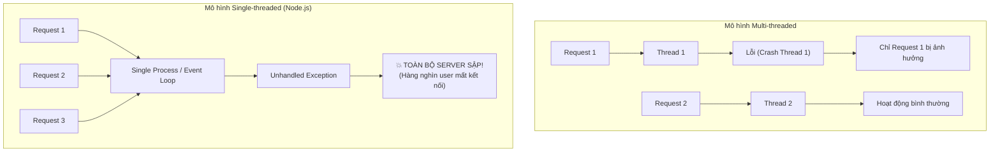
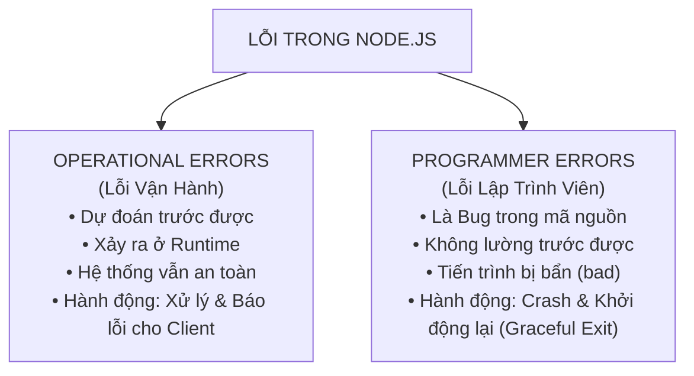
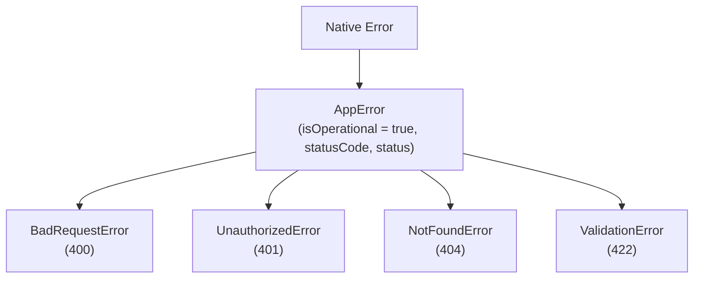
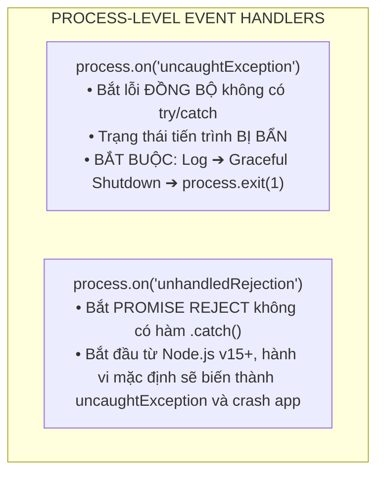
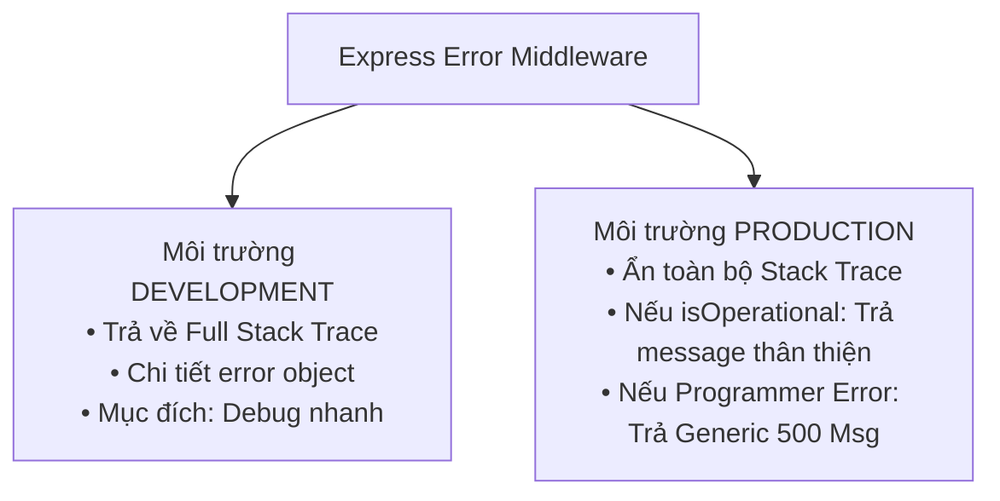

## I. KHÁI QUÁT (OVERVIEW)

### 1. Tầm quan trọng của Xử lý lỗi trong Node.js
Node.js vận hành trên mô hình **Single-threaded Event Loop** (Vòng lặp sự kiện đơn luồng). Khác với các mô hình đa luồng truyền thống (như Java Spring Boot hay PHP-FPM - nơi mỗi request được phục vụ bởi một thread/process độc lập), trong Node.js, toàn bộ hàng nghìn người dùng đồng thời đều chia sẻ chung một tiến trình (process) duy nhất.



Nếu một ngoại lệ (exception) không được xử lý (unhandled exception) xảy ra tại bất kỳ điểm nào trong mã nguồn, toàn bộ tiến trình Node.js sẽ bị hủy hoại và thoát ngay lập tức (`crash`). Điều này đồng nghĩa với việc **tất cả người dùng khác đang kết nối vào hệ thống cũng sẽ bị ngắt đột ngột**.

Do đó, xây dựng một chiến lược **Xử lý lỗi toàn diện (Comprehensive Error Handling Strategy)** không chỉ là việc bắt lỗi để code không văng exception, mà còn là kiến trúc bảo vệ độ ổn định (Stability), khả năng phục hồi (Resilience), và tính bảo mật của toàn bộ hệ thống Backend.

---

### 2. Phân loại lỗi cốt lõi: Operational Errors vs Programmer Errors
Để xử lý lỗi đúng đắn, tiêu chuẩn kỹ thuật đầu tiên trong Node.js là phải phân biệt rạch ròi giữa hai loại lỗi:



#### a. Operational Errors (Lỗi Vận Hành - Có thể lường trước)
Operational Errors là những lỗi đã được dự kiến trước sẽ xảy ra trong điều kiện vận hành thực tế của hệ thống. Đây **không phải là bug của lập trình viên**, mà là các tình huống ngoại cảnh hoặc hành vi người dùng:
* Người dùng gửi dữ liệu không hợp lệ (Validation Failure - ví dụ: email sai định dạng, thiếu mật khẩu).
* Người dùng yêu cầu tài nguyên không tồn tại (Resource Not Found - 404).
* Thất bại khi xác thực hoặc phân quyền (Invalid Token, Forbidden Access - 401, 403).
* Database bị timeout tạm thời hoặc mất kết nối mạng (Network blip / Socket timeout).
* Hệ thống file hết dung lượng đĩa hoặc file cần đọc không tồn tại.
* Dịch vụ bên thứ ba (Third-party API như Stripe, SendGrid) trả về mã lỗi 500 hoặc bị gián đoạn.

> **Chiến lược xử lý:** Bắt lỗi, ghi log mức độ cảnh báo (WARN/INFO), và trả về phản hồi thích hợp (HTTP Status Code tương ứng + Thông điệp rõ ràng) cho client. **Không bao giờ làm sập tiến trình Node.js**.

#### b. Programmer Errors (Lỗi Lập Trình Viên - Bugs)
Programmer Errors là những lỗi phát sinh do sai sót trong quá trình viết code của lập trình viên. Đây là các **Bugs thực sự**:
* Truy cập thuộc tính của `undefined` hoặc `null` (`TypeError: Cannot read properties of undefined`).
* Sử dụng biến chưa khai báo (`ReferenceError: x is not defined`).
* Truyền tham số sai kiểu dữ liệu vào hàm.
* Quên từ khóa `await` trước một Promise khiến mã nguồn xử lý đối tượng Promise thay vì dữ liệu thực.
* Gọi một phương thức không tồn tại trên đối tượng.
* Vòng lặp vô hạn gây cạn kiệt Call Stack (`RangeError: Maximum call stack size exceeded`).

> **Chiến lược xử lý:** Vì đây là bug không lường trước, trạng thái bộ nhớ của ứng dụng có thể đã bị "bẩn" (corrupted state / memory leak / dangling sockets). Cách an toàn nhất là: Ghi log khẩn cấp kèm Full Stack Trace (ERROR/FATAL) ➔ Thực hiện **Graceful Shutdown** ➔ Thoát tiến trình (`process.exit(1)`) để Process Manager (PM2 / Kubernetes) khởi tạo lại instance sạch.

#### Bảng so sánh chi tiết:

| Tiêu chí | Operational Errors | Programmer Errors |
| :--- | :--- | :--- |
| **Bản chất** | Tình huống ngoại cảnh, dữ liệu người dùng | Lỗi logic mã nguồn (Bugs) |
| **Khả năng dự đoán** | Hoàn toàn dự đoán và lên kịch bản trước | Không lường trước được tại runtime |
| **Ví dụ điển hình** | `UserNotFoundError`, `InvalidInputError` | `TypeError`, `ReferenceError`, `SyntaxError` |
| **Tính toàn vẹn bộ nhớ** | Bộ nhớ và trạng thái app vẫn sạch | Trạng thái ứng dụng có thể bị sai lệch (Corrupted) |
| **Hành động hệ thống** | Trả HTTP 4xx/5xx cho client, tiếp tục chạy | Log Full Stack Trace ➔ Graceful Shutdown ➔ Restart |
| **Đánh dấu kỹ thuật** | Gán cờ `isOperational = true` | Mặc định `isOperational = false` |

---

## II. CHI TIẾT KỸ THUẬT (DETAILED DEEP DIVE)

### 1. Cơ chế xử lý lỗi qua các kỷ nguyên phát triển của Node.js

#### a. Đồng bộ: `try...catch` và `throw new Error()`
Đối với các thao tác đồng bộ (Synchronous execution), khối `try...catch` hoạt động hoàn hảo:

```javascript
function parseJSON(jsonString) {
  try {
    return JSON.parse(jsonString);
  } catch (error) {
    // Bắt lỗi cú pháp JSON và chuyển hóa thành lỗi có ngữ cảnh
    throw new Error(`Dữ liệu JSON không hợp lệ: ${error.message}`);
  }
}
```

#### b. Bất đồng bộ Kỷ nguyên 1: Callback Error-First Pattern
Trước khi Promise xuất hiện, Node.js chuẩn hóa việc xử lý lỗi bằng quy ước **Error-First Callback**: Tham số đầu tiên của mọi callback luôn là đối tượng lỗi (`err`), nếu không có lỗi thì `err` là `null` hoặc `undefined`.

```javascript
const fs = require('fs');

fs.readFile('/path/to/config.json', 'utf8', (err, data) => {
  // 1. Luôn kiểm tra lỗi đầu tiên
  if (err) {
    console.error('Đọc file thất bại:', err.message);
    return; // Dừng thực thi ngay lập tức
  }
  
  // 2. Xử lý dữ liệu khi không có lỗi
  console.log('Nội dung file:', data);
});
```

> [!CAUTION]
> **Cạm bẫy try/catch với Async Callback truyền thống:**
> Khối `try...catch` **hoàn toàn vô dụng** khi bọc xung quanh một hàm nhận callback bất đồng bộ, vì callback được thực thi trong một Event Loop tick khác, khi Call Stack của khối `try...catch` đã biến mất!
> ```javascript
> try {
>   setTimeout(() => {
>     throw new Error("Lỗi nổ tung!"); // ❌ try/catch KHÔNG bắt được, process sẽ sập!
>   }, 1000);
> } catch (err) {
>   console.log("Không bao giờ chạy vào đây!");
> }
> ```

#### c. Bất đồng bộ Kỷ nguyên 2: Promise và `.catch()`
Promise đóng gói trạng thái bất đồng bộ thành 3 trạng thái: `pending`, `fulfilled`, và `rejected`. Khi lỗi xảy ra, Promise chuyển sang `rejected` và truyền qua chuỗi `.catch()`:

```javascript
fetchUserData(userId)
  .then((user) => fetchUserOrders(user.id))
  .then((orders) => calculateDiscount(orders))
  .catch((err) => {
    // Bắt toàn bộ lỗi phát sinh ở bất kỳ bước nào trong chuỗi then
    console.error('Xử lý đơn hàng thất bại:', err);
  });
```

#### d. Bất đồng bộ Kỷ nguyên 3: Async/Await và `try...catch`
`async/await` đưa cú pháp xử lý lỗi bất đồng bộ quay trở về dạng đồng bộ trực quan với `try...catch`:

```javascript
async function getUserDashboard(userId) {
  try {
    const user = await userRepository.findById(userId);
    if (!user) {
      throw new AppError('Không tìm thấy người dùng', 404);
    }
    const orders = await orderRepository.findByUserId(user.id);
    return { user, orders };
  } catch (error) {
    // Bắt được cả lỗi đồng bộ lẫn lỗi từ Promise bị reject
    throw error;
  }
}
```

#### e. Async Handler Wrapper Pattern (Khử Boilerplate Try/Catch)
Trong Express, việc viết `try...catch` ở từng route handler làm code bị lặp lại và rối rắm. Chúng ta sử dụng một **Higher-Order Function** để bọc route handler:

```javascript
// async-handler.js
const catchAsync = (fn) => {
  return (req, res, next) => {
    // fn(req, res, next) trả về một Promise.
    // Nếu có lỗi, .catch(next) sẽ tự động đẩy lỗi vào Express Error Middleware!
    fn(req, res, next).catch(next);
  };
};

module.exports = catchAsync;
```

---

### 2. Thiết kế Custom Error Classes (Enterprise Error Hierarchy)

Để quản lý lỗi có cấu trúc, chúng ta xây dựng cây kế thừa từ class `Error` chuẩn của JavaScript.



#### Triển khai chi tiết:

```javascript
// errors/AppError.js
class AppError extends Error {
  constructor(message, statusCode) {
    super(message);

    this.statusCode = statusCode;
    // 4xx là 'fail' (lỗi từ phía client), 5xx là 'error' (lỗi hệ thống)
    this.status = `${statusCode}`.startsWith('4') ? 'fail' : 'error';
    // Đánh dấu đây là lỗi vận hành đã dự kiến
    this.isOperational = true;

    // Giữ nguyên stack trace sạch, loại trừ constructor này khỏi vết ngăn xếp
    Error.captureStackTrace(this, this.constructor);
  }
}

// Các class chuyên biệt hóa cho từng trường hợp HTTP:
class BadRequestError extends AppError {
  constructor(message = 'Dữ liệu yêu cầu không hợp lệ') {
    super(message, 400);
  }
}

class UnauthorizedError extends AppError {
  constructor(message = 'Bạn chưa được xác thực danh tính') {
    super(message, 401);
  }
}

class ForbiddenError extends AppError {
  constructor(message = 'Bạn không có quyền thực hiện thao tác này') {
    super(message, 403);
  }
}

class NotFoundError extends AppError {
  constructor(message = 'Tài nguyên yêu cầu không tồn tại') {
    super(message, 404);
  }
}

class ValidationError extends AppError {
  constructor(message = 'Dữ liệu đầu vào không vượt qua kiểm tra', errors = []) {
    super(message, 422);
    this.errors = errors; // Mảng chi tiết các trường bị lỗi
  }
}

module.exports = {
  AppError,
  BadRequestError,
  UnauthorizedError,
  ForbiddenError,
  NotFoundError,
  ValidationError,
};
```

---

### 3. Mô hình Lan truyền Lỗi đa tầng (Error Propagation)

Trong kiến trúc phân lớp chuẩn (Layered Architecture: Controller ➔ Service ➔ Repository), lỗi phải được lan truyền có kiểm soát:

```mermaid
flowchart TD
    REQ["HTTP Request"] --> CTRL["CONTROLLER LAYER<br/>• Tiếp nhận req, gọi Service qua catchAsync()"]
    CTRL -->|"1. Gọi hàm"| SVC["SERVICE LAYER (Business Logic)<br/>• Thực thi nghiệp vụ. Nếu vi phạm quy tắc:<br/>throw new NotFoundError(\"Không tìm thấy user\")"]
    SVC -->|"2. Query DB"| REPO["REPOSITORY / DATA ACCESS LAYER<br/>• Tương tác CSDL/Cache/Third-party"]
    REPO -->|"3. Ném DB Error / Timeout"| SVC
    SVC -->|"4. Đẩy lỗi qua next(err)"| CTRL
    CTRL --> MW["CENTRALIZED ERROR HANDLING MIDDLEWARE (app.use(err, ...))<br/>• Phân loại Operational vs Programmer Error<br/>• Ghi Log chi tiết hệ thống<br/>• Phản hồi JSON chuẩn hóa cho Client"]
```

**Quy tắc lan truyền:**
1. **Repository/DAO:** Bắt lỗi driver cấp thấp (ví dụ: duplicate key code 11000 của MongoDB hoặc 23505 của Postgres) ➔ Có thể chuyển hóa thành Custom Domain Error hoặc ném nguyên bản lên Service.
2. **Service Layer:** Chứa toàn bộ Business Rules. Khi phát hiện dữ liệu vi phạm nghiệp vụ ➔ Chủ động `throw new AppError(...)`.
3. **Controller Layer:** Không viết logic xử lý mã lỗi tại đây. Chỉ cần bọc handler bằng `catchAsync`, nếu Service ném lỗi, `catchAsync` tự động chuyển tiếp tới `next(err)`.
4. **Error Middleware:** Điểm chặn cuối cùng (Single Point of Truth) để xử lý định dạng response và ghi log.

---

### 4. Sự kiện toàn cục bắt lỗi ở cấp độ Tiến trình (Process-Level Safety)

Ngay cả khi bạn cấu hình error middleware cẩn thận, vẫn có những lỗi xảy ra ngoài phạm vi Express Request-Response Cycle (ví dụ: lỗi trong background worker, cron job, hoặc kết nối CSDL khi khởi động). Node.js cung cấp 2 sự kiện toàn cục quan trọng:



#### a. `process.on('uncaughtException')`
Bắt các lỗi đồng bộ chưa được xử lý ở bất kỳ đâu trong ứng dụng.

> [!CAUTION]
> **Quy tắc sinh tử với uncaughtException:**
> Khi `uncaughtException` được kích hoạt, tiến trình JavaScript đã ở trong trạng thái không xác định (**corrupted state** - các biến có thể ở trạng thái dở dang, tài nguyên file bị rò rỉ, lock không được giải phóng).
> **TUYỆT ĐỐI KHÔNG ĐƯỢC** bỏ qua lỗi này và tiếp tục phục vụ request! Bạn **bắt buộc phải ghi log và thoát tiến trình (`process.exit(1)`)**.

```javascript
process.on('uncaughtException', (err) => {
  console.error('💥 UNCAUGHT EXCEPTION! Tiến trình đang bị lỗi nghiêm trọng...');
  console.error(err.name, err.message, err.stack);

  // 1. Ghi log khẩn cấp vào hệ thống lưu trữ bên ngoài (Winston/Pino/File)
  // 2. Đóng tiến trình ngay lập tức để Process Manager tự restart instance mới sạch sẽ
  process.exit(1);
});
```

#### b. `process.on('unhandledRejection')`
Xảy ra khi một Promise bị `reject` nhưng không có bất kỳ khối `.catch()` nào xử lý.

```javascript
process.on('unhandledRejection', (reason, promise) => {
  console.error('💥 UNHANDLED PROMISE REJECTION! Đang tắt server...');
  console.error('Lý do:', reason);

  // Thực hiện Graceful Shutdown:
  // Đóng HTTP server trước để hoàn tất các request đang xử lý dở dang
  if (global.serverInstance) {
    global.serverInstance.close(() => {
      process.exit(1);
    });
  } else {
    process.exit(1);
  }
});
```

---

### 5. Express Error Middleware (Cơ chế 4 tham số)

Trong Express, một middleware được nhận diện là **Error-Handling Middleware** khi và chỉ khi hàm nhận chính xác **4 tham số**: `(err, req, res, next)`.

```javascript
// Express kiểm tra Function.prototype.length:
// fn.length === 4 ──► Express coi đây là Error Middleware
// fn.length < 4   ──► Express coi đây là Route Handler hoặc Standard Middleware
app.use((err, req, res, next) => {
  // Logic xử lý lỗi tập trung
});
```

---

### 6. Chiến lược xử lý lỗi ở Production vs Development



1. **Development:** Nhà phát triển cần biết chính xác dòng code nào bị lỗi, file nào, stack trace ra sao để sửa bug ngay lập tức.
2. **Production:**
   * **Bảo mật:** Không bao giờ để lộ đường dẫn file nội bộ (`/app/src/controllers/...`), truy vấn SQL, tên collection CSDL, hoặc token lên response của client. Hacker có thể lợi dụng stack trace để khai thác lỗ hổng hệ thống.
   * **Trải nghiệm người dùng (UX):** Trả về mã lỗi rõ ràng, thông điệp dễ hiểu.

---

## III. VÍ DỤ MINH HỌA VÀ PHÂN TÍCH CODE (CODE ANALYSIS)

Dưới đây là kiến trúc xử lý lỗi toàn diện chuẩn Production, kết hợp đầy đủ Custom Errors, Async Handler, Centralized Error Middleware và Graceful Shutdown.

### Cấu trúc thư mục khuyến nghị:
```text
src/
├── app.js
├── server.js
├── errors/
│   ├── AppError.js
│   └── index.js
├── middlewares/
│   ├── async.middleware.js
│   └── error.middleware.js
└── routes/
    └── user.routes.js
```

### 1. File: `src/errors/AppError.js`
```javascript
class AppError extends Error {
  constructor(message, statusCode) {
    super(message);
    this.statusCode = statusCode;
    this.status = `${statusCode}`.startsWith('4') ? 'fail' : 'error';
    this.isOperational = true; // Cờ phân biệt lỗi vận hành vs lỗi lập trình

    Error.captureStackTrace(this, this.constructor);
  }
}

module.exports = AppError;
```

### 2. File: `src/middlewares/async.middleware.js`
```javascript
// Bọc tất cả controller bất đồng bộ để tự động bắt lỗi đẩy sang next(err)
const catchAsync = (fn) => {
  return (req, res, next) => {
    fn(req, res, next).catch(next);
  };
};

module.exports = catchAsync;
```

### 3. File: `src/middlewares/error.middleware.js`
```javascript
const AppError = require('../errors/AppError');

// Hàm xử lý các lỗi đặc thù từ Driver CSDL thành Operational Error
const handleCastErrorDB = (err) => {
  const message = `Dữ liệu không hợp lệ cho trường: ${err.path}: ${err.value}`;
  return new AppError(message, 400);
};

const handleDuplicateFieldsDB = (err) => {
  const value = err.message.match(/(["'])(\\?.)*?\1/)[0];
  const message = `Giá trị trường ${value} đã tồn tại trong hệ thống. Vui lòng chọn giá trị khác!`;
  return new AppError(message, 400);
};

const handleJWTError = () =>
  new AppError('Token xác thực không hợp lệ. Vui lòng đăng nhập lại!', 401);

const handleJWTExpiredError = () =>
  new AppError('Phiên đăng nhập đã hết hạn. Vui lòng đăng nhập lại!', 401);

// Phản hồi chi tiết cho môi trường DEV
const sendErrorDev = (err, req, res) => {
  return res.status(err.statusCode).json({
    status: err.status,
    error: err,
    message: err.message,
    stack: err.stack,
  });
};

// Phản hồi an toàn cho môi trường PROD
const sendErrorProd = (err, req, res) => {
  // A) Lỗi vận hành đã lường trước (Operational Error): Trả thông điệp cho client
  if (err.isOperational) {
    return res.status(err.statusCode).json({
      status: err.status,
      message: err.message,
    });
  }

  // B) Lỗi lập trình (Programmer Error / Bug ẩn): Không để lộ thông tin nhạy cảm
  // 1. Ghi log chi tiết ra console/log server để đội dev sửa bug
  console.error('💥 [PROGRAMMER ERROR]:', err);

  // 2. Gửi phản hồi chung chung cho khách hàng
  return res.status(500).json({
    status: 'error',
    message: 'Đã có lỗi nghiêm trọng xảy ra từ phía máy chủ!',
  });
};

// Global Error Handler Middleware
module.exports = (err, req, res, next) => {
  err.statusCode = err.statusCode || 500;
  err.status = err.status || 'error';

  if (process.env.NODE_ENV === 'development') {
    sendErrorDev(err, req, res);
  } else {
    let error = { ...err };
    error.message = err.message;
    error.name = err.name;

    // Chuyển hóa các lỗi hệ thống phổ biến thành Operational Error
    if (error.name === 'CastError') error = handleCastErrorDB(error);
    if (error.code === 11000) error = handleDuplicateFieldsDB(error);
    if (error.name === 'JsonWebTokenError') error = handleJWTError();
    if (error.name === 'TokenExpiredError') error = handleJWTExpiredError();

    sendErrorProd(error, req, res);
  }
};
```

### 4. File: `src/app.js`
```javascript
const express = require('express');
const catchAsync = require('./middlewares/async.middleware');
const AppError = require('./errors/AppError');
const globalErrorHandler = require('./middlewares/error.middleware');

const app = express();
app.use(express.json());

// Tuyến đường mẫu sử dụng catchAsync
app.get(
  '/api/users/:id',
  catchAsync(async (req, res, next) => {
    const { id } = req.params;

    // Giả lập kiểm tra dữ liệu
    if (id === 'notfound') {
      throw new AppError('Không tìm thấy người dùng với ID này!', 404);
    }

    if (id === 'bug') {
      // Giả lập lỗi lập trình viên (Programmer Error)
      const obj = null;
      obj.someMethod(); // TypeError
    }

    res.status(200).json({ status: 'success', data: { id, name: 'Alice' } });
  })
);

// Bắt tất cả các route không tồn tại (Unmatched Routes - 404 Handler)
app.all('*', (req, res, next) => {
  next(new AppError(`Không tìm thấy đường dẫn ${req.originalUrl} trên máy chủ!`, 404));
});

// Đăng ký Error Middleware ở CUỐI CÙNG của pipeline
app.use(globalErrorHandler);

module.exports = app;
```

### 5. File: `src/server.js` (Khởi động & Graceful Shutdown)
```javascript
const app = require('./app');

// 1. Bắt lỗi Uncaught Exception TRƯỚC KHI bất kỳ code nào khác chạy
process.on('uncaughtException', (err) => {
  console.error('💥 UNCAUGHT EXCEPTION! Đang tắt ứng dụng ngay lập tức...');
  console.error(err.name, err.message, err.stack);
  process.exit(1);
});

const PORT = process.env.PORT || 3000;
const server = app.listen(PORT, () => {
  console.log(`Server đang chạy trên cổng ${PORT} trong môi trường ${process.env.NODE_ENV || 'development'}`);
});

// 2. Bắt lỗi Unhandled Rejection toàn cục
process.on('unhandledRejection', (err) => {
  console.error('💥 UNHANDLED REJECTION! Đang thực hiện Graceful Shutdown...');
  console.error(err.name, err.message);

  // Đóng server HTTP rồi mới thoát process
  server.close(() => {
    process.exit(1);
  });
});

// 3. Bắt tín hiệu kết thúc từ Hệ điều hành (SIGTERM/SIGINT) để Graceful Shutdown
process.on('SIGTERM', () => {
  console.log('👋 Nhận tín hiệu SIGTERM. Đóng server nhẹ nhàng...');
  server.close(() => {
    console.log('💥 Tiến trình đã được giải phóng an toàn!');
  });
});
```

---

## IV. LƯU Ý, CẠM BẪY VÀ QUY TẮC CỐT LÕI (BEST PRACTICES)

> [!CAUTION]
> ### 1. Cạm bẫy "Nuốt lỗi" (Swallowing Errors)
> Lỗi kinh điển và nguy hiểm nhất của lập trình viên là sử dụng khối `catch` rỗng hoặc chỉ `console.log` rồi bỏ qua mà không xử lý:
> ```javascript
> // ❌ CỰC KỲ NGUY HIỂM (Nuốt lỗi)
> async function chargeCustomer(userId, amount) {
>   try {
>     await paymentGateway.charge(userId, amount);
>   } catch (error) {
>     // Nuốt lỗi: Không ghi log, không ném lại lỗi, không thông báo cho controller!
>     // Hệ thống tưởng thanh toán thành công và tiếp tục giao hàng miễn phí cho khách!
>   }
> }
> ```
> **Quy tắc cốt lõi:** Nếu bạn `catch` một lỗi mà không thể khôi phục lại trạng thái bình thường (recover) ngay tại đó, **bắt buộc phải `throw` lại lỗi** hoặc truyền cho `next(err)`.

> [!WARNING]
> ### 2. Cạm bẫy try/catch không bắt được lỗi trong async timers / event listeners
> Khối `try/catch` bọc ngoài `setTimeout`, `setInterval`, `setImmediate`, hoặc `EventEmitter.on()` không thể bắt được lỗi xảy ra bên trong callback:
> ```javascript
> // ❌ try/catch bên ngoài không hoạt động!
> try {
>   setTimeout(() => {
>     throw new Error("Lỗi nổ tung trong timer!");
>   }, 100);
> } catch (err) {
>   console.log("Không bao giờ bắt được!");
> }
> ```
> **Giải pháp:** Phải đặt `try/catch` **bên trong** phần thân của callback timer, hoặc đảm bảo mọi EventEmitter đều có listener đăng ký sự kiện `'error'`.

> [!CAUTION]
> ### 3. Lỗi treo Request do quên gọi `next(err)` hoặc quên `return` sau phản hồi
> Khi xử lý lỗi trong middleware, nếu bạn không gọi `next(err)` hoặc không gửi response `res.status().json()`, request từ phía client sẽ bị treo vô tận cho đến khi dính timeout.
>
> Ngoài ra, nếu quên từ khóa `return` sau khi gọi `res.json()`, mã nguồn phía dưới vẫn tiếp tục chạy và gây lỗi:
> `Error [ERR_HTTP_HEADERS_SENT]: Cannot set headers after they are sent to the client`.
> ```javascript
> // ❌ Sai: Quên return
> if (!user) {
>   res.status(404).json({ message: "Not found" });
> }
> res.status(200).json(user); // Lỗi: Gửi header 2 lần!
>
> // ✅ Đúng: Luôn có return
> if (!user) {
>   return res.status(404).json({ message: "Not found" });
> }
> return res.status(200).json(user);
> ```

> [!IMPORTANT]
> ### 4. Tuyệt đối không cố giữ tiến trình sống sót khi gặp uncaughtException
> Nhiều lập trình viên cố tình đăng ký `process.on('uncaughtException', (err) => { console.log(err); })` mà **không gọi `process.exit(1)`** với hy vọng server không bao giờ sập.
> 
> Đây là hành vi chống lại thiết kế của Node.js:
> - Trạng thái biến toàn cục, closure, heap memory lúc này đã mất tính nhất quán.
> - Các request tiếp theo có thể nhận dữ liệu của người dùng khác, hoặc rơi vào vòng lặp vô hạn gây rò rỉ RAM (Memory Leak).
> 
> **Quy tắc:** Hãy để tiến trình chết nhanh chóng (**Fail Fast**) và để các công cụ quản lý tiến trình như **PM2**, **Docker restart policy**, hoặc **Kubernetes Pod Lifecycle** tự khởi động lại một bản sao hoàn toàn mới và sạch sẽ.

> [!TIP]
> ### 5. Tránh lạm dụng Error Object cho Luồng điều khiển thông thường (Control Flow)
> Việc tạo đối tượng `new Error()` trong V8 rất tốn kém tài nguyên vì nó phải thu thập toàn bộ Stack Trace (`Error.captureStackTrace`). 
> - Đừng ném Error chỉ để điều hướng rẽ nhánh `if/else` thông thường.
> - Chỉ ném Error khi một thao tác thực sự thất bại hoặc vi phạm ràng buộc nghiệp vụ.
