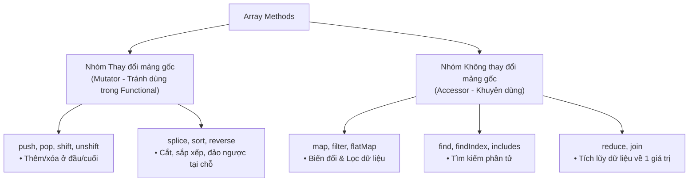

## I. KHÁI QUÁT (OVERVIEW)

Trong JavaScript, mảng là một danh sách động có thể chứa bất kỳ kiểu dữ liệu nào cùng một lúc (số, chuỗi, object...). Sự tự do này rất dễ sinh ra lỗi logic khi thao tác với phần tử trong mảng.

TypeScript giúp bạn kiểm soát mảng chặt chẽ bằng cách quy định **mảng chỉ được chứa các phần tử thuộc một kiểu dữ liệu cố định** (hoặc một nhóm kiểu dữ liệu xác định trước) ở Compile-time, đồng thời tối ưu hóa việc kiểm soát kiểu dữ liệu đầu vào/đầu ra của toàn bộ các hàm thao tác mảng (Array Methods) phổ biến, ngăn ngừa các lỗi runtime kinh điển như `Cannot read properties of undefined`.

---

## II. CHI TIẾT KỸ THUẬT (DETAILED DEEP DIVE)

### 1. Cú pháp Khai báo kiểu Mảng (Array Type Annotation)
TypeScript hỗ trợ hai cách để chú thích kiểu cho mảng. Về mặt tính năng, hai cách này hoàn toàn tương đương nhau.

#### Cách 1: Sử dụng cặp ngoặc vuông `type[]` (Khuyên dùng)
Đây là cú pháp phổ biến, ngắn gọn và dễ đọc nhất.
```typescript
let listNumbers: number[] = [1, 2, 3, 4, 5];
let listStrings: string[] = ["Apple", "Banana", "Cherry"];
```

#### Cách 2: Sử dụng cú pháp Generic `Array<type>`
```typescript
let listNumbersGeneric: Array<number> = [1, 2, 3, 4, 5];
let listStringsGeneric: Array<string> = ["Apple", "Banana", "Cherry"];
```

---

### 2. Các dạng mảng đặc biệt nâng cao

#### A. Mảng chứa nhiều kiểu dữ liệu (Array of Unions)
Để định nghĩa một mảng có thể chứa đồng thời nhiều kiểu dữ liệu khác nhau, ta sử dụng dấu ngoặc đơn kết hợp toán tử hoặc `|`:
```typescript
// Mảng chứa cả number và string
let mixedArray: (number | string)[] = [1, "two", 3, "four"];
```
> [!WARNING]
> Phải bao bọc kiểu kết hợp trong dấu ngoặc đơn `(number | string)[]`. 
> Nếu viết là `number | string[]`, TypeScript sẽ hiểu biến đó có kiểu là "hoặc một số đơn lẻ" hoặc "một mảng chỉ chứa chuỗi".

#### B. Mảng chứa các đối tượng (Array of Objects)
Bạn có thể tạo mảng chứa các đối tượng có cấu trúc định sẵn bằng cách kết hợp với Type Alias hoặc Interface:
```typescript
type User = {
  id: number;
  name: string;
};

let users: User[] = [
  { id: 1, name: "Alice" },
  { id: 2, name: "Bob" }
];
```

#### C. Mảng nhiều chiều (Multi-dimensional Arrays)
Khai báo mảng chứa mảng khác bằng cách viết thêm các cặp ngoặc vuông `[]`:
```typescript
// Mảng hai chiều (Ma trận số)
let matrix: number[][] = [
  [1, 2, 3],
  [4, 5, 6]
];
```

#### D. Mảng chỉ đọc (Readonly Array)
Trong nhiều trường hợp (như truyền dữ liệu vào các Services xử lý logic), bạn muốn đảm bảo mảng sau khi tạo ra sẽ **không bị sửa đổi** (không thể push, pop, shift, splice hoặc gán lại phần tử). TypeScript cung cấp hai cú pháp bảo vệ dữ liệu:
```typescript
// Cách 1: Sử dụng từ khóa readonly ở trước
let readableList: readonly number[] = [1, 2, 3];

// Cách 2: Sử dụng kiểu ReadonlyArray<type>
let readableList2: ReadonlyArray<string> = ["A", "B", "C"];

// Tất cả các phương thức làm thay đổi mảng đều bị báo lỗi:
// readableList.push(4);      // ❌ Lỗi: Property 'push' does not exist on type 'readonly number[]'.
// readableList[0] = 10;      // ❌ Lỗi: Index signature in type 'readonly number[]' only permits reading.
```

---

### 3. Cẩm nang toàn tập Array Methods & Type-safety

Dưới đây là hệ thống các hàm thao tác mảng chuyên sâu, được phân loại theo mục đích sử dụng kèm phân tích kiểu dữ liệu trong TypeScript:



#### A. Nhóm Biến đổi Dữ liệu (map, flatMap)
*   **`map()`:** Biến đổi từng phần tử trong mảng cũ thành phần tử trong mảng mới theo một công thức chung. TypeScript tự động suy luận kiểu của mảng trả về dựa trên kiểu trả về của callback.
    ```typescript
    const numbers = [1, 2, 3];
    const strings = numbers.map(num => `ID-${num}`); // TypeScript tự suy luận kiểu: string[]
    ```
*   **`flatMap()`:** Thực hiện map từng phần tử rồi tự động làm phẳng (flatten) kết quả từ 2 chiều về 1 chiều.
    ```typescript
    interface Post { tags: string[] }
    const posts: Post[] = [{ tags: ["ts", "js"] }, { tags: ["node"] }];
    const allTags = posts.flatMap(p => p.tags); // string[]: ['ts', 'js', 'node']
    ```

#### B. Nhóm Lọc & Tìm kiếm (filter, find, findIndex)
*   **`filter()`:** Lọc ra các phần tử thỏa mãn điều kiện và trả về một mảng mới.
    ```typescript
    const ages = [15, 20, 25, 30];
    const adults = ages.filter(age => age >= 18); // number[]
    ```
    > [!IMPORTANT]
    > **Lọc bỏ null/undefined một cách Type-safe (Type Predicates):**
    > Mặc định, nếu bạn dùng `.filter(x => x !== null)`, TypeScript vẫn suy luận kiểu của mảng kết quả là `(T | null)[]`. Bạn bắt buộc phải dùng **Type Predicate** (`val is T`):
    > ```typescript
    > const rawData: (string | null)[] = ["Alice", null, "Bob"];
    > const cleanData: string[] = rawData.filter((val): val is string => val !== null);
    > ```
*   **`find()` và `findIndex()`:** `find()` tìm phần tử đầu tiên thỏa mãn điều kiện và trả về phần tử đó hoặc `undefined`. `findIndex()` trả về chỉ mục của phần tử đó (hoặc `-1` nếu không thấy).
    ```typescript
    const usersList = [{ id: 1, name: "Alice" }, { id: 2, name: "Bob" }];
    const user = usersList.find(u => u.id === 2); // Kiểu: { id: number; name: string } | undefined
    ```

#### C. Nhóm Tích lũy (reduce)
*   **`reduce()`:** Tích lũy các phần tử của mảng thành một giá trị duy nhất (số, chuỗi, object, hoặc mảng mới).
    ```typescript
    const prices = [100, 200, 300];
    const total = prices.reduce((sum, price) => sum + price, 0); // 600
    ```

#### D. Nhóm Thay đổi Mảng Gốc (Mutator) & Cạm bẫy của `sort()`
Các hàm như `push`, `pop`, `shift`, `unshift`, `splice`, `reverse`, `sort` thay đổi trực tiếp mảng trên bộ nhớ. Hạn chế sử dụng chúng trong logic Backend để tránh sinh ra hiệu ứng phụ (Side-effects) xuyên qua các Services.
*   **Cạm bẫy của `sort()`:** Hàm `sort()` mặc định của JavaScript/TypeScript sẽ chuyển đổi các phần tử thành chuỗi (String) rồi mới sắp xếp theo Unicode. Điều này dẫn đến kết quả sai lệch khi sắp xếp số:
    ```typescript
    const scores = [10, 5, 20, 2];
    scores.sort(); // ❌ Kết quả sai: [10, 2, 20, 5] (vì '1' đứng trước '2')
    
    // Quy tắc: Luôn truyền hàm so sánh (Comparator) vào sort
    scores.sort((a, b) => a - b); // ✅ Kết quả đúng: [2, 5, 10, 20]
    ```

---

## III. VÍ DỤ MINH HỌA VÀ PHÂN TÍCH CODE (CODE EXAMPLES & ANALYSIS)

### 1. Xử lý dữ liệu API phức tạp bằng chuỗi phương thức (Method Chaining)
Lấy danh sách ID của các sản phẩm có trạng thái hoạt động (Active), giá lớn hơn 100 USD và sắp xếp giá từ cao xuống thấp:

```typescript
interface Product {
  id: string;
  name: string;
  price: number;
  status: "ACTIVE" | "INACTIVE";
}

const products: Product[] = [
  { id: "p1", name: "Laptop", price: 1200, status: "ACTIVE" },
  { id: "p2", name: "Mouse", price: 25, status: "ACTIVE" },
  { id: "p3", name: "Keyboard", price: 150, status: "INACTIVE" },
  { id: "p4", name: "Monitor", price: 300, status: "ACTIVE" },
];

const activeExpensiveProductIds: string[] = products
  .filter(p => p.status === "ACTIVE" && p.price > 100)
  .sort((a, b) => b.price - a.price)
  .map(p => p.id);

console.log(activeExpensiveProductIds); // Output: ['p1', 'p4']
```

---

## IV. LƯU Ý CẠM BẪY VÀ QUY TẮC CỐT LÕI (PITFALLS & CORE RULES)

> [!IMPORTANT]
> ### 1. Kiểu dữ liệu mặc định của mảng trống `[]`
> Nếu bạn khai báo một mảng rỗng mà không chỉ định kiểu dữ liệu:
> ```typescript
> let items = []; // TypeScript tự động suy luận kiểu là 'any[]'
> ```
> Mảng `any[]` sẽ làm mất hoàn toàn khả năng kiểm soát kiểu dữ liệu. Hãy luôn định nghĩa kiểu rõ ràng cho mảng rỗng khi khởi tạo.
>
> ### 2. Vấn đề truy xuất ngoài phạm vi (Out-of-bounds access)
> TypeScript mặc định **không báo lỗi compile** khi bạn truy cập một phần tử nằm ngoài độ dài của mảng, rất dễ gây ra lỗi `undefined` ở runtime:
> ```typescript
> let names: string[] = ["Alice", "Bob"];
> let secret = names[10]; // TypeScript vẫn hiểu 'secret' là 'string' khi compile!
> // Nhưng ở runtime: 'secret' có giá trị thực tế là 'undefined'.
> ```
> *Để khắc phục điều này, bạn có thể kích hoạt cấu hình `"noUncheckedIndexedAccess": true` trong tệp `tsconfig.json`.*

### 3. Tránh Over-looping khi xài Method Chaining
Khi nối chuỗi nhiều hàm `.filter().map()`, mỗi hàm sẽ duyệt qua mảng và tạo ra một mảng trung gian mới. Đối với các mảng dữ liệu cực lớn, việc này gây hao phí tài nguyên bộ nhớ nghiêm trọng. Hãy tối ưu bằng cách gộp logic vào trong một hàm duy nhất hoặc sử dụng vòng lặp `for...of`.

---

## 💡 5 QUY TẮC VÀNG KHI THAO TÁC VỚI MẢNG
1.  **Luôn khai báo kiểu rõ ràng cho mảng rỗng:** Tránh để biến tự suy luận thành kiểu `any[]`.
2.  **Luôn ưu tiên các hàm không thay đổi mảng gốc (Non-mutating):** Sử dụng `map`, `filter`, `slice` thay vì `splice`, `reverse` để tránh sinh ra Side-effects trong code logic.
3.  **Bắt buộc truyền comparator cho `.sort()`:** Tuyệt đối không gọi `.sort()` không có đối số đối với mảng số.
4.  **Khử trùng lặp qua Set:** Tận dụng cú pháp `[...new Set(array)]` để làm sạch mảng trùng lặp với hiệu năng $O(1)$.
5.  **Dùng ReadonlyArray để bảo vệ dữ liệu:** Sử dụng `readonly T[]` đối với các tham số đầu vào của hàm xử lý logic để ngăn chặn việc chỉnh sửa dữ liệu gốc từ bên ngoài.
