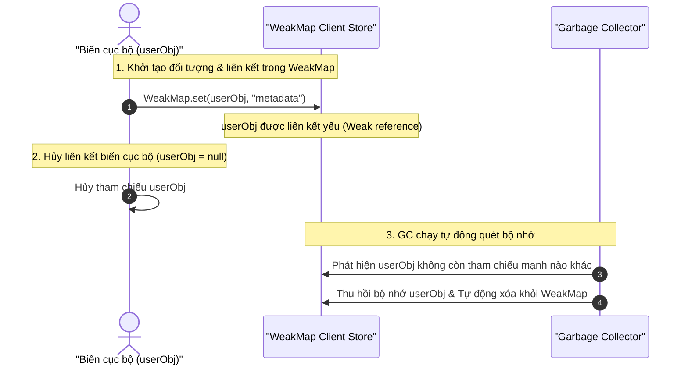

## I. KHÁI QUÁT (OVERVIEW)

Trong JavaScript và TypeScript, cơ chế quản lý bộ nhớ được vận hành tự động bởi **Garbage Collector (GC - Bộ dọn rác)**. GC hoạt động dựa trên triết lý: "Nếu một vùng nhớ không còn bất kỳ đường dẫn tham chiếu mạnh (Strong Reference) nào trỏ tới, vùng nhớ đó sẽ bị coi là rác và bị giải phóng khỏi RAM".

Tuy nhiên, các cấu trúc dữ liệu mặc định như **Object**, **Array**, **Map**, và **Set** giữ các **tham chiếu mạnh** đến các đối tượng bên trong chúng. 
*   Nếu bạn đưa một đối tượng (Object) vào làm Key trong một `Map`, ngay cả khi ngoài chương trình chính bạn đã gán biến trỏ tới đối tượng đó bằng `null`, đối tượng đó **vẫn không bị giải phóng** vì `Map` vẫn đang giữ tham chiếu mạnh đến nó.
*   Hậu quả: Ứng dụng tích tụ dữ liệu thừa và bị **rò rỉ bộ nhớ (Memory Leak)** nghiêm trọng theo thời gian.

Để giải quyết triệt để vấn đề này, ES6 giới thiệu **`WeakMap`** và **`WeakSet`** sử dụng cơ chế **Tham chiếu yếu (Weak Reference)**, cho phép GC tự động dọn dẹp các đối tượng khi chúng không còn tham chiếu mạnh nào khác ngoài chương trình.

---

## II. CHI TIẾT KỸ THUẬT (DETAILED DEEP DIVE)

### 1. Sơ đồ cơ chế Garbage Collection với WeakMap



---

### 2. Cấu trúc WeakMap trong TypeScript
`WeakMap` là tập hợp các cặp Key-Value có các ràng buộc nghiêm ngặt:

#### A. Luật bắt buộc: Key phải là Object
Bạn không thể dùng các kiểu dữ liệu nguyên thủy (string, number, boolean) làm Key trong `WeakMap`.

```typescript
const weakMap = new WeakMap<object, string>();

// Khai báo đúng ✅
const keyObj = { id: 1 };
weakMap.set(keyObj, "Metadata");

// Khai báo sai (Báo lỗi biên dịch TypeScript) ❌
weakMap.set("key-string", "Metadata"); // Error: Argument of type 'string' is not assignable to parameter type 'object'
```

#### B. Các phương thức Core API của WeakMap:
Vì lý do bảo mật và cơ chế dọn rác tự động chạy ngầm bất đồng bộ, `WeakMap` **chỉ có 4 phương thức** duy nhất:
*   `set(key, value)`: Lưu trữ cặp Key-Value.
*   `get(key)`: Lấy giá trị theo Key Object.
*   `has(key)`: Kiểm tra sự tồn tại của Key Object.
*   `delete(key)`: Xóa cặp Key-Value theo Key Object.

> [!IMPORTANT]
> **Các giới hạn vật lý của WeakMap:**
> 1.  **Không có thuộc tính `.size`:** Bạn không thể biết hiện có bao nhiêu phần tử bên trong.
> 2.  **Không có phương thức `.clear()`:** Bạn không thể xóa hàng loạt.
> 3.  **Không thể duyệt qua (Non-iterable):** Không thể dùng vòng lặp `for...of`, không có các phương thức `.keys()`, `.values()`, `.entries()`.
> 
> Sở dĩ có các giới hạn này vì Garbage Collector có thể quét và dọn dẹp các Key bất cứ lúc nào bất đồng bộ, việc cho phép duyệt hoặc đếm số lượng sẽ dẫn đến kết quả không nhất quán (Non-deterministic behavior).

---

### 3. Cấu trúc WeakSet trong TypeScript
Tương tự như `WeakMap`, `WeakSet` là tập hợp các Object duy nhất được tham chiếu yếu.

#### A. Các giới hạn:
*   Phần tử bên trong **bắt buộc phải là Object**.
*   Không thể duyệt qua (Non-iterable), không có `.size`, không có `.clear()`.
*   Chỉ có 3 phương thức: `add(value)`, `has(value)`, `delete(value)`.

---

## III. VÍ DỤ MINH HỌA VÀ PHÂN TÍCH CODE (CODE EXAMPLES & ANALYSIS)

### 1. Đính kèm Metadata vào DOM Elements không gây rò rỉ bộ nhớ
Khi xây dựng ứng dụng web hoặc ứng dụng backend kết xuất giao diện, chúng ta thường cần đính kèm các cấu hình phụ trợ cho các Object (như DOM elements hoặc các Client Socket).

```typescript
// Định nghĩa WeakMap lưu trữ lượt click của từng button
interface CustomDOMElement {
  tagName: string;
  id: string;
}

const clickCounts = new WeakMap<CustomDOMElement, number>();

function recordClick(element: CustomDOMElement): void {
  const count = clickCounts.get(element) || 0;
  clickCounts.set(element, count + 1);
  console.log(`Element ${element.id} clicked ${count + 1} times.`);
}

// Chạy thử nghiệm
let btnSubmit: CustomDOMElement | null = { tagName: "BUTTON", id: "btn-submit" };

recordClick(btnSubmit); // Clicked 1 times

// Khi button bị xóa khỏi giao diện (hoặc chuyển trang)
btnSubmit = null; // Hủy tham chiếu mạnh
// GC chạy ngầm sẽ tự động giải phóng vùng nhớ của btnSubmit và tự xóa khỏi clickCounts WeakMap.
```

### 2. Lưu trữ dữ liệu Private cho Class an toàn tuyệt đối ở Runtime
TypeScript hỗ trợ từ khóa `private` ở compile-time, nhưng khi biên dịch sang JavaScript, dữ liệu đó vẫn hiển thị trên đối tượng và có thể bị đọc/ghi tự do. `WeakMap` giải quyết triệt để bài toán đóng gói này:

```typescript
// WeakMap nằm ngoài Class (Internal Capsule)
const privateSecrets = new WeakMap<UserAccount, { passwordHash: string }>();

export class UserAccount {
  public username: string;

  constructor(username: string, pass: string) {
    this.username = username;
    // Đóng gói thông tin nhạy cảm vào WeakMap bên ngoài đối tượng
    privateSecrets.set(this, { passwordHash: `hash_algo_${pass}` });
  }

  verifyPassword(pass: string): boolean {
    const secret = privateSecrets.get(this);
    if (!secret) return false;
    return secret.passwordHash === `hash_algo_${pass}`;
  }
}

const user = new UserAccount("admin", "12345");
console.log(Object.keys(user)); // Output: ['username'] (Mật khẩu hoàn toàn biến mất khỏi instance)
```

---

## IV. LƯU Ý CẠM BẪY VÀ QUY TẮC CỐT LÕI (PITFALLS & CORE RULES)

### 1. So sánh tổng quát Map vs WeakMap

| Tiêu chí | Map | WeakMap |
| :--- | :--- | :--- |
| **Kiểu của Key** | Bất kỳ kiểu dữ liệu nào | Chỉ chấp nhận Object (hoặc Symbol) |
| **Cơ chế tham chiếu** | Tham chiếu mạnh (Strong Reference) | Tham chiếu yếu (Weak Reference) |
| **Duyệt phần tử** | Có (Duyệt qua `for...of`, `.forEach`) | Không (Non-iterable) |
| **Độ dài (.size)** | Có thuộc tính `.size` | Không có (Không thể đếm) |
| **Garbage Collection** | Ngăn cản GC giải phóng Key | Cho phép GC giải phóng Key tự do |

---

## 💡 5 QUY TẮC VÀNG KHI SỬ DỤNG WEAKMAP & WEAKSET
1.  **Chỉ dùng WeakMap để lưu dữ liệu phụ trợ gắn liền với vòng đời của Object:** Khi Object bị xóa, metadata đính kèm cũng phải biến mất theo để giải phóng RAM.
2.  **Tuyệt đối không dùng WeakMap cho cấu trúc dữ liệu cần duyệt:** Nếu nghiệp vụ yêu cầu in ra danh sách, tìm kiếm toàn bộ, hãy dùng `Map`.
3.  **Tận dụng WeakMap để đóng gói dữ liệu Private:** Sử dụng WeakMap module-level để che giấu các trường nhạy cảm trong Class runtime.
4.  **Bảo vệ ô nhớ bằng cách giữ tham chiếu mạnh bên ngoài:** Hãy nhớ rằng nếu bạn không lưu trữ Key Object vào ít nhất một biến tham chiếu mạnh nào khác ngoài WeakMap, cặp Key-Value đó sẽ bị GC quét sạch bất cứ lúc nào.
5.  **Dùng WeakSet để đánh dấu các Object đang hoạt động:** Khi cần kiểm tra trạng thái hoạt động của các đối tượng (như các kết nối WebSocket, các tác vụ đang chạy) mà không muốn chặn GC giải phóng chúng khi sập kết nối, hãy dùng `WeakSet`.
