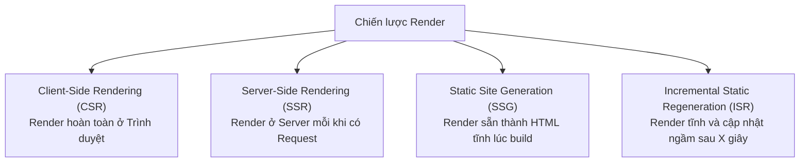

## I. KHÁI QUÁT (OVERVIEW)

### 1. Bản chất của việc kết xuất giao diện (Rendering)
Trong kiến trúc web, **Rendering** (kết xuất) là quá trình chuyển đổi mã nguồn (HTML, CSS, JavaScript) thành giao diện trực quan hiển thị trên màn hình của người dùng.

Với sự phát triển của các thư viện Single Page Application (React, Vue, Angular) và các Framework Fullstack (Next.js, Remix):
*   Nơi thực thi việc render không còn bị giới hạn ở một phía duy nhất.
*   Ứng dụng có thể render hoàn toàn ở trình duyệt của người dùng (Client-Side), render ở máy chủ (Server-Side), hoặc render sẵn lúc biên dịch (Static).
*   *Lựa chọn chiến lược render phù hợp:* Là quyết định kiến trúc quan trọng nhất ảnh hưởng trực tiếp đến chỉ số SEO, tốc độ phản hồi trang (FCP, TTFB) và tải trọng của hệ thống máy chủ.



---

## II. CHI TIẾT KỸ THUẬT (DETAILED DEEP DIVE)

### 1. Client-Side Rendering (CSR - Kết xuất phía Trình duyệt)
*   **Mô hình hoạt động:** 
    1.  Người dùng truy cập URL $\rightarrow$ Server trả về duy nhất 1 file HTML trống rỗng (chỉ chứa thẻ `<div id="root"></div>`) kèm file JS bundle lớn.
    2.  Trình duyệt tải và thực thi file JS bundle.
    3.  JavaScript tạo ra các node DOM ảo và render giao diện thực tế trực tiếp lên trình duyệt.
*   **Ưu điểm:** Chuyển trang mượt mà không cần reload (SPA), giảm tải tối đa cho server (server chỉ đóng vai trò phân phối file tĩnh).
*   **Hạn chế:** SEO cực kém (bot tìm kiếm không chạy JS sẽ chỉ thấy trang trắng), FCP chậm (trang trắng hiển thị lâu trong lúc tải file JS lớn).

---

### 2. Server-Side Rendering (SSR - Kết xuất phía Máy chủ)
*   **Mô hình hoạt động:**
    1.  Người dùng gửi request $\rightarrow$ Server Node.js nhận request, fetch dữ liệu từ Database, render React Component thành chuỗi HTML hoàn chỉnh.
    2.  Server trả về file HTML có đầy đủ nội dung chữ và ảnh cho trình duyệt.
    3.  Người dùng thấy ngay giao diện lập tức.
    4.  Trình duyệt tải file JS nhỏ về để gắn các sự kiện tương tác (Quá trình này gọi là **Hydration**).
*   **Ưu điểm:** SEO xuất sắc (bot nhận HTML đầy đủ), hiển thị nội dung cực nhanh (FCP nhanh).
*   **Hạn chế:** TTFB (Time to First Byte) chậm hơn vì server mất thời gian chạy code render HTML, tải trọng server nặng khi có lượng truy cập lớn.

---

### 3. Static Site Generation (SSG) & Incremental Static Regeneration (ISR)
*   **SSG (Kết xuất tĩnh):** HTML được tạo ra **duy nhất 1 lần** trong quá trình build dự án và đẩy lên CDN. Người dùng tải về tức thì mà không cần server tính toán.
*   **ISR (Tĩnh cập nhật ngầm):** Cho phép làm mới trang tĩnh theo chu kỳ thời gian (ví dụ sau 60 giây) bằng cách chạy một tiến trình build ngầm ở server khi có người dùng truy cập.

---

## III. VÍ DỤ MINH HỌA VÀ PHÂN TÍCH CODE (CODE EXAMPLES & ANALYSIS)

### 1. Phân tích Cấu trúc HTML trả về giữa CSR và SSR
Dưới đây là sự khác biệt trực quan của mã nguồn HTML phản hồi từ Server mà trình duyệt nhận được ở lượt request đầu tiên.

#### Trường hợp 1: Client-Side Rendering (CSR - SPA truyền thống)
```html
<!DOCTYPE html>
<html lang="vi">
<head>
    <meta charset="UTF-8">
    <title>Trang Web CSR</title>
    <!-- File JS bundle lớn chứa toàn bộ logic React -->
    <script defer src="/static/js/bundle.js"></script>
</head>
<body>
    <!-- ⚠️ CHÚ Ý: Thẻ root trống rỗng. Trình duyệt chưa có nội dung để hiển thị hoặc SEO. -->
    <div id="root"></div>
</body>
</html>
```

#### Trường hợp 2: Server-Side Rendering (SSR - Next.js)
```html
<!DOCTYPE html>
<html lang="vi">
<head>
    <meta charset="UTF-8">
    <title>Điện thoại thông minh AI | Cửa hàng</title>
    <script defer src="/_next/static/chunks/main.js"></script>
</head>
<body>
    <!-- 
      ✅ CHÚ Ý: HTML đã được render sẵn đầy đủ nội dung chữ và ảnh từ Server. 
      Googlebot có thể đọc và xếp hạng SEO lập tức. Người dùng thấy ảnh ngay mà không bị trắng trang.
    -->
    <div id="root">
        <main class="p-8">
            <h1 class="text-2xl font-bold">Điện thoại thông minh AI</h1>
            <p class="text-slate-600">Mô tả sản phẩm tích hợp vi xử lý AI thế hệ mới.</p>
            <span class="text-emerald-600 font-bold">24.000.000đ</span>
        </main>
    </div>
</body>
</html>
```

---

## IV. LƯU Ý, CẠM BẪY VÀ QUY TẮC CỐT LÕI (PITFALLS & BEST PRACTICES)

### 1. Lỗi Bất đồng bộ Hydration (Hydration Mismatch Error)
*   **Vấn đề:** Khi sử dụng SSR, cấu trúc HTML sinh ra ở phía Server bắt buộc phải trùng khớp 100% với cấu trúc HTML render đầu tiên ở phía Client.
*   **Hậu quả:** Nếu bạn viết code sử dụng các biến động chỉ có ở trình duyệt (ví dụ: `window.innerWidth` hoặc `new Date().toLocaleTimeString()`), cấu trúc HTML của server và client sẽ bị lệch nhau, React sẽ báo lỗi đỏ rực: *"Hydration failed because the initial UI does not match what was rendered on the server."*
*   ✅ *Best practice:* Chỉ chạy các logic động phụ thuộc vào trình duyệt bên trong hook `useEffect` (khi quá trình Hydration đã hoàn thành ở client).

---

## 💡 5 QUY TẮC VÀNG VỀ RENDERING STRATEGIES
1.  **Dùng CSR cho trang quản trị (Dashboard):** Nơi không cần SEO và yêu cầu trải nghiệm tương tác SPA mượt mà.
2.  **Dùng SSR cho trang cá nhân người dùng:** Nơi thông tin thay đổi liên tục theo tài khoản và cần tải nhanh.
3.  **Dùng SSG cho trang tĩnh thương hiệu (Landing Page):** Đạt tốc độ tải trang nhanh nhất và tiết kiệm chi phí máy chủ tối đa.
4.  **Dùng ISR cho Blog/Tin tức/Cửa hàng:** Cập nhật ngầm dữ liệu tự động mà không cần rebuild toàn bộ hệ thống.
5.  **Tránh gọi biến trình duyệt (window, document) ngoài useEffect:** Ngăn chặn tuyệt đối các lỗi Hydration Mismatch nguy hiểm của SSR.
