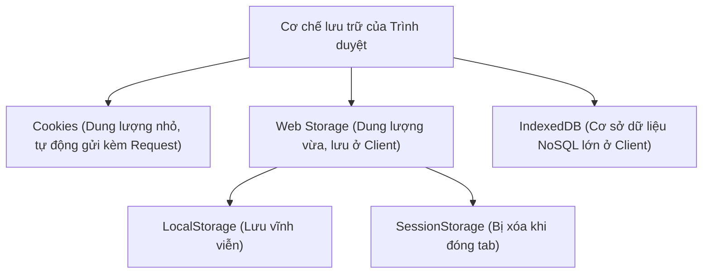

## I. KHÁI QUÁT (OVERVIEW)

### 1. Tại sao trình duyệt cần các cơ chế lưu trữ dữ liệu?
Giao thức HTTP mặc định là một giao thức **Không lưu trạng thái (Stateless)**. Có nghĩa là mỗi yêu cầu (request) gửi lên máy chủ là hoàn toàn độc lập, server không hề biết request này có phải của người vừa click nút mua hàng trước đó hay không.

Để giúp trình duyệt "nhớ" trạng thái của người dùng (giỏ hàng đang chứa gì, họ đã đăng nhập chưa, họ thích theme màu tối hay sáng), các trình duyệt web cung cấp các công cụ lưu trữ dữ liệu cục bộ. Việc hiểu rõ sự khác biệt của từng công cụ là chìa khóa để thiết kế hệ thống Frontend bảo mật và tối ưu hiệu năng.



---

## II. CHI TIẾT KỸ THUẬT (DETAILED DEEP DIVE)

### 1. So sánh chi tiết các công cụ lưu trữ trên Trình duyệt

| Tiêu chí | Cookies | LocalStorage | SessionStorage |
| :--- | :--- | :--- | :--- |
| **Dung lượng tối đa** | **~4 KB** | **~5MB - 10MB** | **~5MB** |
| **Thời gian sống** | Tùy biến (Max-Age hoặc hết phiên) | Vĩnh viễn (cho đến khi chủ động xóa) | Bị xóa ngay khi đóng tab trình duyệt |
| **Truyền tải lên Server**| **Tự động gửi kèm** header của mọi HTTP request | Chỉ nằm ở Client, không gửi đi | Chỉ nằm ở Client, không gửi đi |
| **Tính bảo mật** | Tốt nếu cấu hình `HttpOnly`, `Secure` | Kém (dễ bị tấn công XSS đọc trộm bằng JS) | Kém |
| **Phù hợp nhất với** | Quản lý Session đăng nhập (JWT Token) | Lưu theme, ngôn ngữ, cache UI | Lưu form nhập liệu dở dang |

---

### 2. Chi tiết các thuộc tính bảo mật của Cookie
Cookie không chỉ là nơi lưu trữ chuỗi chữ đơn giản, nó cung cấp các cờ cấu hình (attributes) cực kỳ mạnh mẽ để bảo vệ dữ liệu:

1.  **`HttpOnly`**: 
    *   *Ý nghĩa:* Chặn không cho code JavaScript truy cập cookie qua lệnh `document.cookie`.
    *   *Mục đích:* **Chống tấn công XSS 100%** (mã độc JS không thể ăn cắp cookie này gửi ra ngoài).
2.  **`Secure`**:
    *   *Ý nghĩa:* Chỉ cho phép trình duyệt gửi kèm cookie lên server khi đường truyền sử dụng kết nối bảo mật **HTTPS** mã hóa.
3.  **`SameSite` (Strict / Lax / None)**:
    *   *Ý nghĩa:* Điều khiển việc gửi cookie trong các request liên kết chéo tên miền (Cross-origin requests) để **chống tấn công CSRF**.
        *   `Strict`: Tuyệt đối không gửi cookie đi nếu request xuất phát từ một trang web khác.
        *   `Lax` (Mặc định): Chỉ gửi cookie khi người dùng click vào một liên kết thông thường (thẻ `<a>`) chuyển hướng sang trang của bạn, không gửi khi gọi API ngầm từ trang khác.

---

### 3. IndexedDB: Cơ sở dữ liệu NoSQL trong trình duyệt
Khi bạn cần lưu trữ lượng dữ liệu khổng lồ (hàng trăm MB, ví dụ dữ liệu game web, dữ liệu offline hoàn chỉnh của ứng dụng ghi chú):
*   IndexedDB cung cấp cơ chế lưu trữ NoSQL hướng đối tượng, hỗ trợ transaction (giao dịch an toàn), tạo index để tìm kiếm tốc độ cao.

---

## III. VÍ DỤ MINH HỌA VÀ PHÂN TÍCH CODE (CODE EXAMPLES & ANALYSIS)

### 1. Thao tác đọc ghi an toàn với Web Storage & Cài đặt Cookie ở Server
Dưới đây là ví dụ minh họa cách lưu/đọc cấu hình Theme giao diện bằng LocalStorage trên Frontend, và cách thiết lập một Cookie bảo mật từ phía Server.

#### Ví dụ 1: Quản lý Theme bằng LocalStorage (Chạy ở Client)
```typescript
// File: src/utils/theme.ts

export const toggleTheme = () => {
  const currentTheme = localStorage.getItem('app-theme') || 'light';
  const newTheme = currentTheme === 'light' ? 'dark' : 'light';
  
  // Ghi vào LocalStorage
  localStorage.setItem('app-theme', newTheme);
  
  // Áp dụng class CSS vào thẻ body
  document.body.className = newTheme;
  console.log(`Đã chuyển giao diện sang theme: ${newTheme}`);
};

export const applySavedTheme = () => {
  const savedTheme = localStorage.getItem('app-theme');
  if (savedTheme) {
    document.body.className = savedTheme;
  }
};
```

#### Ví dụ 2: Thiết lập Cookie bảo mật từ Server (Mã Node.js Express Backend giả lập)
```javascript
// File: server/auth.js (Backend Node.js)

app.post('/api/login', (req, res) => {
  const token = generateJWTToken(req.body.user);

  // Thiết lập thiết lập Cookie bảo mật gửi về trình duyệt của khách hàng
  res.cookie('auth-token', token, {
    httpOnly: true, // 🔒 Chặn đứng mã độc JS đọc trộm (chống XSS)
    secure: true,   // 🔒 Chỉ truyền qua kênh mã hóa HTTPS
    sameSite: 'lax', // 🔒 Chống tấn công giả mạo yêu cầu chéo CSRF
    maxAge: 3600000 * 24 // Thời gian sống 24 tiếng
  });

  res.json({ success: true, message: "Đăng nhập thành công!" });
});
```

---

## IV. LƯU Ý, CẠM BẪY VÀ QUY TẮC CỐT LÕI (PITFALLS & BEST PRACTICES)

### 1. Cạm bẫy tràn bộ nhớ khi ghi đè LocalStorage quá đà
*   **Vấn đề:** Các trình duyệt thiết lập giới hạn dung lượng cứng cho LocalStorage (thường là 5MB). Nếu bạn liên tục ghi đè các chuỗi dữ liệu JSON lớn không dọn dẹp.
*   **Hậu quả:** Trình duyệt sẽ ném ra lỗi ngoại lệ `QuotaExceededError` và làm sập ứng dụng.
*   ✅ *Best practice:* Luôn bọc lệnh ghi `localStorage.setItem` trong khối lệnh `try/catch` để chủ động bắt lỗi nếu bộ nhớ bị đầy và đề xuất dọn dẹp cache.

---

## 💡 5 QUY TẮC VÀNG VỀ WEB STORAGE & COOKIES
1.  **Dùng HttpOnly Cookies cho JWT Token:** Đảm bảo an toàn thông tin danh tính tối đa, chống mã độc JS đọc trộm qua tấn công XSS.
2.  **Thiết lập cờ SameSite=Lax mặc định cho Cookies:** Ngăn ngừa triệt để các rủi ro bị gửi trộm yêu cầu từ trang web lạ (CSRF).
3.  **Dùng LocalStorage cho các thiết lập UI tĩnh:** Thích hợp lưu trữ theme màu, cấu hình ngôn ngữ hiển thị.
4.  **Dùng SessionStorage cho luồng dữ liệu ngắn:** Lưu thông tin các bước điền form nhiều bước (Wizard form) đề phòng người dùng vô tình reload trang.
5.  **Luôn bắt lỗi `QuotaExceededError` khi dùng LocalStorage:** Đảm bảo an toàn hệ thống không bị crash khi bộ nhớ đệm của trình duyệt bị đầy.
