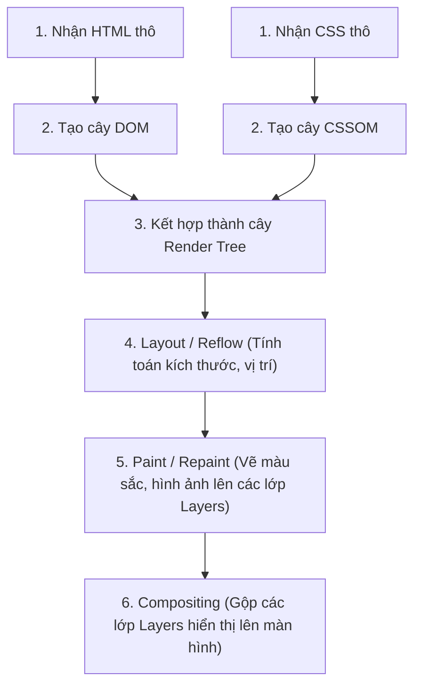

## I. KHÁI QUÁT (OVERVIEW)

### 1. Tại sao lập trình viên Frontend cần hiểu cơ chế hoạt động của Trình duyệt?
Một lập trình viên Frontend giỏi không chỉ dừng lại ở việc viết code chạy được, họ cần viết code chạy **hiệu năng cao và mượt mà (60 FPS)**. Để làm được điều đó, bạn bắt buộc phải hiểu cách trình duyệt xử lý các file văn bản HTML, CSS, JavaScript thô của bạn thành các điểm ảnh (pixels) hiển thị trên màn hình.

Quá trình này gọi là **Critical Rendering Path (CRP - Luồng xử lý kết xuất quan trọng)**. Bất kỳ một sự lãng phí tài nguyên hoặc cấu trúc code sai lệch nào trong CRP cũng sẽ dẫn đến các lỗi giật lag màn hình (drop FPS), treo trình duyệt hoặc làm trang tải chậm.



---

## II. CHI TIẾT KỸ THUẬT (DETAILED DEEP DIVE)

### 1. Phân tích chi tiết Luồng Xử lý Kết xuất (Critical Rendering Path)

#### Bước 1: Xây dựng cây DOM (Document Object Model)
*   Trình duyệt nhận các byte dữ liệu HTML thô từ mạng, chuyển đổi thành các ký tự, token, nodes, và cuối cùng dựng thành một cấu trúc cây phân cấp gọi là **DOM Tree**.
*   *Lưu ý:* Tiến trình này có tính chất tuần tự và có thể bị chặn (blocking) bởi các thẻ `<script>` đồng bộ.

#### Bước 2: Xây dựng cây CSSOM (CSS Object Model)
*   Song song với HTML, trình duyệt tải và parse toàn bộ CSS để dựng cây **CSSOM Tree** định nghĩa các thuộc tính style tương ứng cho từng node.
*   *Lưu ý:* CSS được coi là tài nguyên chặn render (**Render-blocking resource**). Trình duyệt sẽ không vẽ bất kỳ thứ gì lên màn hình nếu chưa dựng xong CSSOM để tránh hiện tượng vỡ giao diện xấu xí.

#### Bước 3: Tạo dựng cây Render Tree
*   Kết hợp DOM Tree và CSSOM Tree lại thành **Render Tree**.
*   *Đặc điểm:* Render Tree **chỉ chứa các phần tử thực sự hiển thị** trên màn hình. Thẻ có thuộc tính `display: none` hoặc các thẻ ẩn như `<head>`, `<script>` sẽ bị loại trừ hoàn toàn khỏi Render Tree (khác với thuộc tính `visibility: hidden` vẫn nằm trên Render Tree nhưng không vẽ).

#### Bước 4: Giai đoạn Layout (Reflow)
*   Trình duyệt tính toán chính xác kích thước (width, height) và tọa độ vị trí (X, Y) của từng phần tử trên màn hình dựa trên kích thước khung nhìn (Viewport).

#### Bước 5: Giai đoạn Paint (Repaint)
*   Trình duyệt vẽ màu sắc, hình nền, viền, bóng đổ của từng phần tử lên các lớp màn hình khác nhau (Layers) cục bộ.

#### Bước 6: Giai đoạn Compositing (Gộp lớp)
*   Gửi các lớp vẽ (Layers) xuống GPU của thiết bị để gộp lại và hiển thị lên màn hình chính. Đây là bước chạy trực tiếp trên card đồ họa, tốc độ xử lý cực nhanh.

---

### 2. Sự khác biệt giữa Reflow và Repaint (Tối ưu hiệu năng)

| Tiêu chí | Reflow (Layout) | Repaint (Paint) |
| :--- | :--- | :--- |
| **Bản chất** | Tính toán lại cấu trúc hình học (kích thước, vị trí) của phần tử. | Vẽ lại màu sắc, hình ảnh bề mặt của phần tử mà không đổi vị trí. |
| **Tải trọng** | **Cực kỳ nặng** (gây re-render dây chuyền toàn bộ các thẻ con liên quan). | Nhẹ hơn Reflow nhưng vẫn tốn tài nguyên CPU. |
| **Tác nhân kích hoạt** | Đổi kích thước trình duyệt, đổi font chữ, thay đổi thuộc tính `width`, `height`, `margin`, `padding`, `top`, `left`, chèn thêm thẻ HTML mới. | Thay đổi `color`, `background-color`, `visibility`, `box-shadow`. |

---

## III. VÍ DỤ MINH HỌA VÀ PHÂN TÍCH CODE (CODE EXAMPLES & ANALYSIS)

### 1. Tối ưu hóa hiệu năng chuyển động bằng GPU Acceleration (Bỏ qua Reflow/Repaint)
Dưới đây là một ví dụ thực tế so sánh giữa 2 cách viết CSS cho một hiệu ứng dịch chuyển phần tử (Animation Translate). Cách 1 gây ra nghẽn Reflow liên tục làm lag giao diện, cách 2 sử dụng GPU để tăng tốc độ xử lý siêu mượt mà.

#### Cách 1: Sử dụng thuộc tính `left` (Gây Reflow liên tục - Rất tệ)
```css
/* File: src/styles/animation_bad.css */
.box-animation-bad {
  position: absolute;
  left: 0px;
  transition: left 2s ease-in-out;
}
.box-animation-bad:hover {
  /* 
    ⚠️ LỖI HIỆU NĂNG: Thay đổi thuộc tính left ép buộc trình duyệt phải tính toán lại 
    bố cục hình học (Reflow) của toàn bộ các phần tử xung quanh ở mỗi khung hình!
  */
  left: 200px; 
}
```

#### Cách 2: Sử dụng `transform: translateX` (GPU Acceleration - Tối ưu)
```css
/* File: src/styles/animation_good.css */
.box-animation-good {
  position: absolute;
  transform: translateX(0);
  transition: transform 2s ease-in-out;
  
  /* 
    💡 CHỦ ĐỘNG BÁO TRƯỚC CHO TRÌNH DUYỆT:
    Khai báo thuộc tính change sẽ biến đổi để trình duyệt đưa phần tử này lên một Layer riêng biệt.
  */
  will-change: transform; 
}
.box-animation-good:hover {
  /* 
    ✅ TỐI ƯU TUYỆT ĐỐI: 
    Thuộc tính transform không kích hoạt Reflow cũng không kích hoạt Repaint.
    Trình duyệt chỉ gửi Layer này xuống GPU để di chuyển ở giai đoạn Compositing -> Đạt mượt mà 60fps/120fps.
  */
  transform: translateX(200px);
}
```

---

## IV. LƯU Ý, CẠM BẪY VÀ QUY TẮC CỐT LÕI (PITFALLS & BEST PRACTICES)

### 1. Cạm bẫy truy vấn Layout liên tục gây lỗi Thrashing (Layout Thrashing)
*   **Vấn đề:** Trong JavaScript, nếu bạn liên tục viết xen kẽ việc đọc giá trị hình học (như `offsetHeight`) và viết giá trị mới (như `style.height`):
    ```javascript
    // ❌ ANTI-PATTERN: Gây Layout Thrashing
    for (let i = 0; i < paragraphs.length; i++) {
      paragraphs[i].style.width = box.offsetWidth + 'px'; // Trình duyệt bị ép Reflow liên tục ở mỗi vòng lặp!
    }
    ```
*   **Hậu quả:** Trình duyệt bị ép phải chạy tiến trình Reflow liên tục hàng trăm lần trong một phần nghìn giây để tính giá trị mới $\rightarrow$ Trình duyệt bị đóng băng đơ UI.
*   ✅ *Best practice:* Hãy đọc toàn bộ các giá trị đo đạc trước (read batch), lưu vào các biến tạm, sau đó mới thực hiện việc ghi giá trị hàng loạt (write batch).

---

## 💡 5 QUY TẮC VÀNG VỀ HOẠT ĐỘNG CỦA TRÌNH DUYỆT
1.  **Ưu tiên dùng `transform` và `opacity` cho chuyển động:** Bỏ qua hoàn toàn các bước Reflow và Repaint nặng nề, tận dụng tăng tốc phần cứng từ GPU.
2.  **Khai báo `will-change` chọn lọc:** Chỉ khai báo cho các phần tử thực sự chạy animation phức tạp để tránh rò rỉ bộ nhớ RAM GPU của trình duyệt.
3.  **Tránh Layout Thrashing:** Đọc hàng loạt giá trị trước, ghi hàng loạt giá trị sau. Không viết xen kẽ lệnh đo đạc và lệnh thay đổi style DOM trong vòng lặp.
4.  **Đặt thẻ `<script>` ở cuối thẻ `<body>` hoặc dùng `defer`:** Tránh việc trình duyệt tạm dừng dựng DOM Tree để tải và chạy script đồng bộ.
5.  **Tối ưu hóa dung lượng CSS:** CSS chặn render (Render-blocking), hãy giữ cho dung lượng file CSS tải về nhỏ nhất để trang web hiển thị nội dung nhanh nhất.
