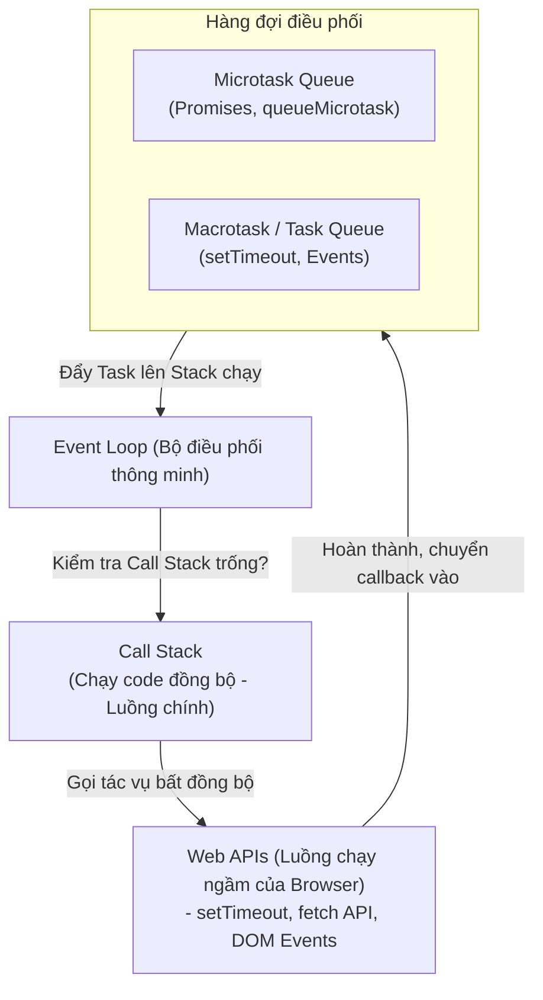

## I. KHÁI QUÁT (OVERVIEW)

### 1. Bản chất đơn luồng (Single-threaded) của JavaScript
Trong JavaScript, luồng thực thi code (JS Engine Call Stack) là **Đơn luồng (Single-threaded)**. Có nghĩa là tại một thời điểm, JavaScript chỉ có thể thực hiện duy nhất một dòng lệnh. 

Tuy nhiên, trình duyệt web vẫn có thể xử lý mượt mà hàng loạt tác vụ bất đồng bộ phức tạp cùng lúc (như vừa tải file từ API mạng, vừa hẹn giờ đếm ngược, vừa bắt sự kiện cuộn trang).
*   **Bí quyết:** Nằm ở kiến trúc **Event Loop (Vòng lặp sự kiện)** tích hợp bên trong môi trường chạy (Runtime) của Trình duyệt. Trình duyệt cung cấp các luồng phụ ngầm (**Web APIs**), sau đó sử dụng Event Loop để điều phối đưa các kết quả chạy xong quay trở lại luồng chính của JavaScript một cách khoa học.



---

## II. CHI TIẾT KỸ THUẬT (DETAILED DEEP DIVE)

### 1. Phân cấp Thứ tự Ưu tiên giữa các Hàng đợi (Tasks vs Microtasks)
Khi các tác vụ Web APIs chạy xong, callback của chúng sẽ được đưa vào các hàng đợi khác nhau:

#### a. Microtask Queue (Hàng đợi Ưu tiên cao)
*   **Chứa các tác vụ:** `Promise.then()`, `Promise.catch()`, `queueMicrotask()`, và `MutationObserver`.
*   *Đặc điểm:* Có độ ưu tiên tuyệt đối. Event Loop bắt buộc phải **chạy sạch toàn bộ các task có trong Microtask Queue** cho đến khi trống rỗng thì mới được phép chuyển sang công việc tiếp theo.

#### b. Macrotask Queue / Task Queue (Hàng đợi Ưu tiên thấp)
*   **Chứa các tác vụ:** `setTimeout()`, `setInterval()`, `setImmediate()`, `postMessage()`, và các sự kiện người dùng (click, hover, input).
*   *Đặc điểm:* Ở mỗi vòng lặp Event Loop, trình duyệt chỉ lấy ra **duy nhất 1 task** ở đầu hàng đợi này lên Call Stack chạy, chạy xong sẽ dừng lại để nhường quyền ưu tiên cho Microtask hoặc luồng vẽ màn hình.

---

### 2. Thuật toán hoạt động của Event Loop (Event Loop Algorithm)
Vòng lặp Event Loop chạy liên tục không ngừng nghỉ theo chu kỳ:
1.  **Chạy code đồng bộ:** Thực thi toàn bộ lệnh trong **Call Stack** cho đến khi stack trống rỗng.
2.  **Dọn dẹp Microtasks:** Chạy sạch toàn bộ callbacks trong **Microtask Queue**. (Nếu trong lúc chạy Microtask sinh thêm Microtask mới, nó cũng được đưa vào hàng đợi này và chạy tiếp luôn trong lượt này).
3.  **Kiểm tra Vẽ màn hình (Render):** Kiểm tra xem màn hình có cần vẽ lại hay không (tần suất 60Hz/120Hz). Nếu có, chạy hàm **`requestAnimationFrame`** và thực hiện vẽ lại giao diện.
4.  **Chạy 1 Macrotask:** Lấy duy nhất **1 task** đầu tiên từ Macrotask Queue lên Call Stack chạy.
5.  Quay trở lại bước 2.

---

## III. VÍ DỤ MINH HỌA VÀ PHÂN TÍCH CODE (CODE EXAMPLES & ANALYSIS)

### 1. Phân tích Luồng thực thi và Dự đoán kết quả console (Tracing Execution)
Dưới đây là một đoạn code kiểm tra phỏng vấn kinh điển về thứ tự in ra của màn hình console. Chúng ta sẽ cùng truy vết luồng đi của từng dòng lệnh.

```javascript
// File: src/utils/eventLoopTrace.ts

console.log("1. Bắt đầu chạy code đồng bộ (Start)");

// 1. setTimeout được đưa sang Web APIs, hẹn giờ 0ms -> đưa vào Macrotask Queue
setTimeout(() => {
  console.log("2. setTimeout (Macrotask) thực thi!");
}, 0);

// 2. Promise được khởi tạo đồng bộ
Promise.resolve().then(() => {
  console.log("3. Promise.then (Microtask #1) thực thi!");
  
  // Microtask lồng bên trong Microtask
  queueMicrotask(() => {
    console.log("4. queueMicrotask (Microtask #2) thực thi!");
  });
});

console.log("5. Kết thúc chạy code đồng bộ (End)");
```

#### Phân tích chi tiết từng bước:
1.  Chạy Call Stack (Đồng bộ):
    *   In ra `"1. Bắt đầu chạy code đồng bộ (Start)"`.
    *   Gặp `setTimeout` $\rightarrow$ Đăng ký với Web API, đẩy callback của nó vào **Macrotask Queue** (Hàng đợi A).
    *   Gặp `Promise.resolve().then` $\rightarrow$ Đẩy callback của nó vào **Microtask Queue** (Hàng đợi B).
    *   In ra `"5. Kết thúc chạy code đồng bộ (End)"`.
2.  Call Stack trống $\rightarrow$ Event Loop kiểm tra **Microtask Queue** (Hàng đợi B):
    *   Lấy callback Promise ra chạy $\rightarrow$ In ra `"3. Promise.then (Microtask #1) thực thi!"`.
    *   Gặp lệnh `queueMicrotask` $\rightarrow$ Đẩy tiếp callback này vào cuối **Microtask Queue** hiện tại.
    *   Do Microtask Queue chưa trống, chạy tiếp callback vừa thêm $\rightarrow$ In ra `"4. queueMicrotask (Microtask #2) thực thi!"`.
3.  Microtask Queue trống $\rightarrow$ Trình duyệt kiểm tra vẽ màn hình (nếu rảnh).
4.  Event Loop lấy **duy nhất 1 task** từ đầu **Macrotask Queue** (Hàng đợi A) lên chạy:
    *   Chạy callback của setTimeout $\rightarrow$ In ra `"2. setTimeout (Macrotask) thực thi!"`.

#### Kết quả in ra chính xác tại Console:
```text
1. Bắt đầu chạy code đồng bộ (Start)
5. Kết thúc chạy code đồng bộ (End)
3. Promise.then (Microtask #1) thực thi!
4. queueMicrotask (Microtask #2) thực thi!
2. setTimeout (Macrotask) thực thi!
```

---

## IV. LƯU Ý, CẠM BẪY VÀ QUY TẮC CỐT LÕI (PITFALLS & BEST PRACTICES)

### 1. Cạm bẫy chặn đứng Luồng vẽ màn hình (Blocking the UI Thread)
*   **Vấn đề:** Do Microtask Queue sẽ chạy liên tục cho đến khi trống rỗng, nếu bạn viết một hàm bất đồng bộ tự gọi đệ quy tạo tiếp Microtask mới (vòng lặp vô tận của Promise):
    ```javascript
    // ❌ LỖI TRANG WEB ĐƠ: Block hoàn toàn UI
    function runInfinitePromise() {
      Promise.resolve().then(runInfinitePromise); 
    }
    ```
*   **Hậu quả:** Trình duyệt bị kẹt cứng ở bước dọn dẹp Microtask. Nó không bao giờ có cơ hội chuyển sang bước 3 (Vẽ lại màn hình) và bước 4 (Xử lý sự kiện click). Trang web bị đơ (Freeze) hoàn toàn, nút bấm không ăn, chuột quay vòng.
*   ✅ *Best practice:* Với các tác vụ lặp liên tục, hãy sử dụng `setTimeout` (hoặc `requestAnimationFrame`) để đẩy callback vào Macrotask. Cách này giúp trình duyệt có khoảng nghỉ xen kẽ ở mỗi vòng lặp để vẽ lại UI và nhận click chuột của người dùng.

---

## 💡 5 QUY TẮC VÀNG VỀ EVENT LOOP
1.  **Hiểu rõ thứ tự: Đồng bộ $\rightarrow$ Microtasks $\rightarrow$ Render $\rightarrow$ Macrotasks:** Áp dụng để viết logic bất đồng bộ chuẩn xác không bị tranh chấp dữ liệu.
2.  **Không tạo vòng lặp vô tận trong Promise.then:** Tránh lỗi block hoàn toàn luồng vẽ màn hình làm đơ trình duyệt.
3.  **Dùng `requestAnimationFrame` cho chuyển động JS:** Đảm bảo hàm thay đổi style DOM luôn được chạy chính xác ngay trước bước vẽ màn hình của trình duyệt.
4.  **Chia nhỏ tác vụ nặng bằng `setTimeout`:** Tránh việc chiếm dụng Call Stack quá 16ms (ngưỡng giật lag của màn hình 60Hz).
5.  **Dùng Web Workers cho phép toán quá nặng:** Đẩy các phép toán phức tạp (như xử lý ảnh, giải mã file) sang một luồng CPU phụ hoàn toàn độc lập, giữ cho luồng chính luôn mượt mà.
