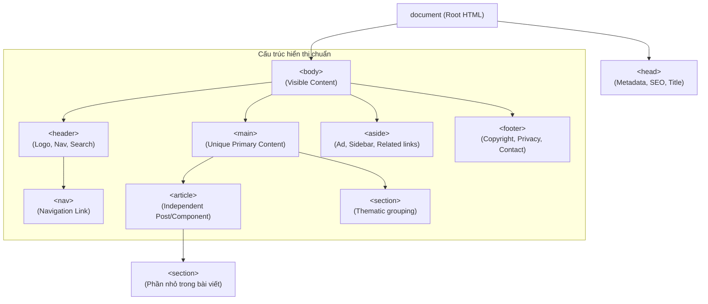

## I. KHÁI QUÁT (OVERVIEW)

### 1. Triết lý cấu trúc tài liệu của HTML5 (HTML5 Document Philosophy)
Trong những năm đầu của sự phát triển web, cấu trúc trang được dựng lên chủ yếu bằng các thẻ vô danh như `<div>` và `<span>`. Các nhà phát triển định nghĩa ý nghĩa của khối qua thuộc tính `id` hoặc `class` (ví dụ: `<div class="header">`, `<div id="menu">`). 
Cách làm này tạo ra hai điểm yếu chí mạng:
*   **Thiếu nhất quán:** Mỗi lập trình viên đặt tên class/id theo ý muốn (`sidebar`, `aside-bar`, `left-column`), khiến các trình duyệt và công cụ tìm kiếm không có một tiêu chuẩn chung nào để hiểu cấu trúc trang.
*   **Mù mờ về mặt ngữ nghĩa (Accessibility & SEO):** Các robot tìm kiếm (Google Bot, Bing Bot) và thiết bị hỗ trợ người khếm thị (Screen Readers) xem trang web như một mớ hỗn độn của các khối hộp lồng nhau mà không phân biệt được đâu là nội dung chính cần lập chỉ mục (index), đâu là phần quảng cáo hay điều hướng phụ trợ.

Sự ra đời của **HTML5 Semantic Tags** (thẻ ngữ nghĩa) nhằm thiết lập một ngôn ngữ chung mang tính kiến trúc cao, giúp định nghĩa rõ ràng vai trò của từng vùng nội dung ngay từ cấp độ cú pháp.

### 2. Sự khác biệt giữa Semantic và Non-Semantic Elements

| Tiêu chí | Semantic Elements (Thẻ ngữ nghĩa) | Non-Semantic Elements (Thẻ phi ngữ nghĩa) |
| :--- | :--- | :--- |
| **Đại diện tiêu biểu** | `<header>`, `<nav>`, `<main>`, `<article>`, `<section>`, `<footer>` | `<div>`, `<span>` |
| **Ý nghĩa cú pháp** | Tên thẻ phản ánh trực tiếp chức năng và loại nội dung chứa bên trong. | Chỉ đóng vai trò làm hộp chứa (container) để gộp nhóm hoặc định dạng CSS. |
| **Ảnh hưởng SEO** | Google Bot đọc hiểu phân đoạn chính-phụ cực nhanh, ưu tiên lập chỉ mục nội dung quan trọng. | Bot phải quét toàn trang và đoán ý nghĩa nội dung dựa trên từ khóa, hiệu quả thấp hơn. |
| **Hỗ trợ A11y (Accessibility)** | Cực kỳ tốt. Trình đọc màn hình dễ dàng bỏ qua phần menu hoặc footer để đi thẳng tới nội dung chính. | Kém. Trình đọc phải quét tuần tự từ trên xuống dưới, làm giảm trải nghiệm người dùng khuyết tật. |

---

## II. CHI TIẾT KỸ THUẬT (DETAILED DEEP DIVE)

### 1. Sơ đồ Kiến trúc phân cấp tài liệu chuẩn HTML5
Dưới đây là sơ đồ phân cấp cấu trúc của một tài liệu HTML5 hiện đại khi hiển thị trên trình duyệt:



---

### 2. Phân tích Chi tiết Cách sử dụng các Thẻ Ngữ nghĩa chính

#### a. Thẻ `<main>`
*   **Quy tắc bất biến:** Mỗi trang web chỉ được phép chứa **duy nhất một** thẻ `<main>`. Nội dung trong thẻ `<main>` phải là duy nhất trên trang đó và không chứa các phần lặp lại trên nhiều trang khác (như sidebar, logo, copyright).
*   **Cấm kỵ:** Không được lồng `<main>` bên trong các thẻ `<header>`, `<nav>`, `<aside>`, hoặc `<footer>`.

#### b. Phân biệt `<article>` vs `<section>`
Đây là hai thẻ dễ bị sử dụng sai lệch nhất trong HTML5.
*   **`<article>` (Khối độc lập):** Đại diện cho một khối nội dung có thể tồn tại hoàn toàn độc lập với phần còn lại của trang. Nếu bạn lấy nội dung này đăng sang một trang web khác hoặc gửi qua RSS Feed, người đọc vẫn hiểu trọn vẹn ý nghĩa của nó.
    *   *Ví dụ:* Bài viết blog, bài báo tin tức, bài đăng diễn đàn, bình luận của người dùng, sản phẩm cụ thể trên trang thương mại điện tử.
*   **`<section>` (Phân đoạn chủ đề):** Đại diện cho một nhóm các nội dung có cùng chủ đề trong trang web hoặc bên trong một `<article>`. Một `<section>` thường bắt đầu bằng một thẻ tiêu đề (`<h2>` đến `<h6>`).
    *   *Ví dụ:* Phần "Giới thiệu", "Tính năng nổi bật", "Đội ngũ sáng lập", các chương của một bài viết.

> [!TIP]
> **Mẹo phân biệt nhanh:**
> *   Nếu nội dung đó có thể đứng một mình trên một trang mới mà vẫn có nghĩa đầy đủ $\rightarrow$ Dùng `<article>`.
> *   Nếu nội dung đó chỉ là một phần cấu thành của trang hiện tại và cần đi kèm các phần khác để có nghĩa $\rightarrow$ Dùng `<section>`.
> *   Bạn hoàn toàn có thể lồng `<section>` bên trong `<article>` (các phần của một bài viết), hoặc lồng `<article>` bên trong `<section>` (danh sách các bài viết của một phần tin tức).

#### c. Thẻ `<aside>` và vị trí ứng dụng
*   Dùng cho các nội dung bổ trợ, gián tiếp liên quan đến nội dung chính xung quanh nó.
*   *Lưu ý:* Thẻ `<aside>` không bắt buộc phải nằm ở cột bên cạnh (sidebar). Nó có thể nằm ở bất kỳ đâu trên trang, ví dụ: một khối trích dẫn nổi bật (pull-quote) nằm giữa bài viết, hoặc một widget quảng cáo ở cuối trang.

---

### 3. Quy chuẩn SEO Core cho Lập trình viên Frontend

Để một trang web đạt điểm tối ưu trên công cụ tìm kiếm, mã HTML của bạn cần tuân thủ nghiêm ngặt các quy tắc sau:

#### a. Cấu hình thẻ `<meta>` tối ưu trong `<head>`
```html
<head>
  <meta charset="UTF-8">
  <meta name="viewport" content="width=device-width, initial-scale=1.0">
  
  <!-- 1. Tiêu đề hiển thị trên Google (Dưới 60 ký tự) -->
  <title>Khóa học React & Next.js chuyên sâu | Lập trình Web Hiện đại</title>
  
  <!-- 2. Mô tả nội dung trang (Khoảng 150-160 ký tự) -->
  <meta name="description" content="Khóa học lập trình Frontend chuyên nghiệp từ cơ bản đến nâng cao. Học React, Next.js, Tailwind CSS với dự án thực tế. Đăng ký nhận tài liệu miễn phí.">
  
  <!-- 3. Từ khóa (Hiện nay Google ít ưu tiên nhưng vẫn nên khai báo) -->
  <meta name="keywords" content="học react, học next.js, khóa học frontend, lập trình web">
  
  <!-- 4. Thẻ Robot để định hướng Bot quét dữ liệu -->
  <meta name="robots" content="index, follow">
</head>
```

#### b. Phân cấp Heading chuẩn xác (Heading Hierarchy)
Hệ thống heading giúp bot lập chỉ mục bố cục nội dung của bạn.
*   **Quy tắc 1:** Chỉ có đúng **1 thẻ `<h1>` duy nhất** trên toàn trang. Thẻ này thường chứa tiêu đề chính của bài viết hoặc tên thương hiệu trang chủ.
*   **Quy tắc 2:** Không được nhảy cóc thứ tự. Ví dụ: từ `<h2>` nhảy thẳng xuống `<h4>` là sai chuẩn. Phải đi tuần tự: `<h1>` $\rightarrow$ `<h2>` $\rightarrow$ `<h3>`.

```text
❌ SAI CHUẨN:
<h1>Học NestJS</h1>
<h4>Bài 01 - Khái quát</h4>  <-- Sai, bỏ qua h2 và h3

✔️ ĐÚNG CHUẨN:
<h1>Học NestJS</h1>
<h2>Phần 1: Kiến thức cốt lõi</h2>
<h3>Bài 01 - Khái quát</h3>
```

#### c. Tối ưu hóa SEO Hình ảnh & Liên kết
*   **Ảnh:** Bắt buộc có thuộc tính `alt` mô tả nội dung hình ảnh một cách tự nhiên, chứa từ khóa chính nếu có thể.
    ```html
    
    ```
*   **Liên kết:** Đảm bảo sử dụng thẻ `<a>` thay vì dùng thẻ `<div>` rồi bắt sự kiện click bằng JavaScript. Đối với các liên kết trỏ ra ngoài trang web, hãy thêm `rel="noopener noreferrer"` để bảo mật.
    ```html
    <a href="https://nextjs.org" target="_blank" rel="noopener noreferrer">Trang chủ Next.js</a>
    ```

---

## III. VÍ DỤ MINH HỌA VÀ PHÂN TÍCH CODE (CODE EXAMPLES & ANALYSIS)

### 1. Phân tích cấu trúc HTML5 chuẩn của một trang Tin tức (E-Magazine)
Dưới đây là một cấu trúc code HTML5 hoàn chỉnh, chuẩn chỉnh về ngữ nghĩa và tối ưu SEO cho một trang chi tiết bài viết:

```html
<!DOCTYPE html>
<html lang="vi">
<head>
  <meta charset="UTF-8">
  <meta name="viewport" content="width=device-width, initial-scale=1.0">
  <title>Bản cập nhật React 19 có gì mới? | Dev Blog</title>
  <meta name="description" content="Khám phá các tính năng mới nhất trong React 19 bao gồm Server Actions, hook useOptimistic, useActionState và những cải tiến hiệu năng vượt trội.">
  <meta name="robots" content="index, follow">
</head>
<body>

  <!-- Phần đầu trang dùng chung cho toàn site -->
  <header class="site-header">
    <div class="logo">
      <a href="/">DevTech Blog</a>
    </div>
    <nav class="main-navigation" aria-label="Menu chính">
      <ul>
        <li><a href="/javascript">Javascript</a></li>
        <li><a href="/react">React</a></li>
        <li><a href="/nextjs">Next.js</a></li>
      </ul>
    </nav>
  </header>

  <!-- Nội dung chính độc nhất của trang này -->
  <main id="primary-content">
    
    <!-- Bài viết cụ thể dạng article -->
    <article class="blog-post">
      <header class="post-header">
        <h1>Bản cập nhật React 19 có gì mới và Hướng dẫn chuyển đổi</h1>
        <div class="post-meta">
          <span>Tác giả: Nguyễn Văn A</span> | 
          <time datetime="2026-08-19">19 Tháng 8, 2026</time>
        </div>
      </header>

      <!-- Nội dung chi tiết của bài viết chia làm các phần chính -->
      <section class="post-body">
        <h2>1. Server Actions - Đột phá kiến trúc</h2>
        <p>React 19 giới thiệu Server Actions cho phép bạn gọi trực tiếp các hàm chạy trên server từ phía client mà không cần viết API endpoint...</p>
        
        <h2>2. Hook mới: useOptimistic</h2>
        <p>Hook này giúp cải thiện trải nghiệm người dùng bằng cách giả lập kết quả thành công của tác vụ gửi lên server ngay lập tức...</p>
      </section>

      <!-- Phần bình luận của độc giả lồng trong article -->
      <section class="post-comments">
        <h2>Bình luận (2)</h2>
        
        <article class="comment">
          <footer>
            <cite>Độc giả Minh Tuấn</cite> - <time datetime="2026-08-19T09:30">09:30 AM</time>
          </footer>
          <p>Bài viết phân tích rất chi tiết, tính năng Server Actions thực sự sẽ thay đổi cách chúng ta viết app React.</p>
        </article>
      </section>
    </article>

  </main>

  <!-- Nội dung phụ trợ bên lề -->
  <aside class="sidebar" aria-label="Thông tin bổ trợ">
    <section class="widget">
      <h3>Bài viết xem nhiều nhất</h3>
      <ul>
        <li><a href="/nextjs-app-router">Làm chủ App Router trong Next.js</a></li>
        <li><a href="/tailwind-css-best-practices">Mẹo viết Tailwind CSS sạch</a></li>
      </ul>
    </section>
  </aside>

  <!-- Phần chân trang -->
  <footer class="site-footer">
    <p>&copy; 2026 DevTech. Tất cả quyền được bảo lưu.</p>
    <nav class="footer-links">
      <a href="/privacy-policy">Chính sách bảo mật</a> | 
      <a href="/terms">Điều khoản sử dụng</a>
    </nav>
  </footer>

</body>
</html>
```

---

## IV. BÀI TẬP THỰC HÀNH (PRACTICE)

### Đề bài: Dựng layout Landing Page giới thiệu sản phẩm Khóa học
Hãy tạo một file `course-landing.html` và viết mã HTML5 chuẩn cấu trúc ngữ nghĩa (chưa cần viết CSS). Yêu cầu cấu trúc phải bao gồm:

1.  **Header:** Chứa logo tên khóa học và Menu điều hướng đến các phần: Giới thiệu, Lộ trình, Đăng ký.
2.  **Main:** Chứa toàn bộ nội dung chính của trang gồm các phần sau:
    *   **Hero Section:** Tiêu đề lớn (`<h1>`), đoạn mô tả ngắn, và 1 link dạng Button kêu gọi đăng ký học.
    *   **Features Section (`<section>`):** Chứa 3 điểm nổi bật của khóa học. Mỗi điểm nổi bật hãy gói gọn trong một thẻ `<article>`.
    *   **Instructor Section (`<section>`):** Giới thiệu về giảng viên (hình ảnh, tên tuổi, tiểu sử ngắn).
3.  **Aside:** Chứa một khung biểu mẫu đăng ký tư vấn nhanh (nhập tên, email, số điện thoại) và một widget hiển thị số lượng học viên đang online.
4.  **Footer:** Chứa thông tin bản quyền và liên kết đến chính sách điều khoản.

#### Yêu cầu chấm điểm tối ưu SEO:
*   [ ] Sử dụng đúng chuẩn các thẻ ngữ nghĩa đã học, không lạm dụng `<div>`.
*   [ ] Có đầy đủ cấu hình thẻ `<title>`, `<meta name="description">` chuẩn độ dài quy định.
*   [ ] Có đúng duy nhất 1 thẻ `<h1>`.
*   [ ] Toàn bộ các thẻ `` sử dụng trong bài phải có thuộc tính `alt` mô tả cụ thể nội dung hình ảnh.
