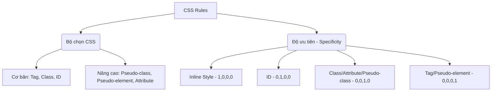

# Bài 02: CSS Selector & Specificity (Bộ chọn CSS & Độ ưu tiên)

## I. KHÁI QUÁT (OVERVIEW)
Bộ chọn (Selector) là cách CSS xác định phần tử HTML nào sẽ được áp dụng các quy tắc định dạng. Độ ưu tiên (Specificity) là thuật toán trình duyệt sử dụng để quyết định quy tắc CSS nào sẽ thắng khi có nhiều quy tắc cùng trỏ đến một phần tử.



> [!NOTE]
> Hiểu rõ Selector và Specificity là nền tảng tối quan trọng để không phải "đánh vật" với CSS khi dự án mở rộng, tránh việc lạm dụng `!important`.

## II. CHI TIẾT KỸ THUẬT (DETAILED DEEP DIVE)

### 1. Phân loại Bộ chọn (Selectors)

| Loại Bộ Chọn | Cú Pháp | Mô Tả | Ví Dụ |
|---|---|---|---|
| Universal | `*` | Chọn tất cả phần tử | `* { margin: 0; }` |
| Type/Tag | `element` | Chọn theo tên thẻ HTML | `p { color: red; }` |
| Class | `.class` | Chọn theo thuộc tính class | `.btn { padding: 10px; }` |
| ID | `#id` | Chọn theo thuộc tính id | `#header { height: 50px; }` |
| Attribute | `[attr=val]`| Chọn theo thuộc tính | `[type="text"] { border: 1px; }` |
| Pseudo-class | `:pseudo` | Trạng thái của phần tử | `:hover { color: blue; }` |
| Pseudo-element| `::pseudo`| Một phần của phần tử | `::before { content: ''; }` |

### 2. Các Combinator (Bộ kết hợp)
- **Descendant (Khoảng trắng):** `A B` (Chọn B nằm trong A, bất kể độ sâu).
- **Child (`>`):** `A > B` (Chọn B là con trực tiếp của A).
- **Adjacent Sibling (`+`):** `A + B` (Chọn B là anh em liền kề ngay sau A).
- **General Sibling (`~`):** `A ~ B` (Chọn B là anh em nằm sau A).

> [!TIP]
> Sử dụng Child combinator (`>`) thay vì Descendant (khoảng trắng) khi có thể để tăng hiệu năng render và giới hạn phạm vi rủi ro.

### 3. Cách tính Độ ưu tiên (Specificity)
Specificity được biểu diễn dưới dạng 4 giá trị: `(a, b, c, d)`
- `a`: Inline style (style="..." trong HTML) = 1000
- `b`: ID selector = 100
- `c`: Class, pseudo-class, attribute selector = 10
- `d`: Type (tag), pseudo-element selector = 1

*Lưu ý:* `!important` không tham gia vào phép tính (a,b,c,d) nhưng nó đánh bại tất cả mọi thứ khác (ngoại trừ một `!important` khác có specificity cao hơn hoặc đến sau trong CSS).

## III. VÍ DỤ MINH HỌA VÀ PHÂN TÍCH CODE (CODE EXAMPLES & ANALYSIS)

```css
/* Specificity: 0, 0, 0, 1 */
div {
    color: blue;
}

/* Specificity: 0, 0, 1, 1 */
div.highlight {
    color: red;
}

/* Specificity: 0, 1, 0, 1 */
div#main {
    color: green;
}

/* Specificity: 0, 1, 1, 1 */
div#main.highlight {
    color: orange;
}
```

**Phân tích Code:**
Nếu có một HTML là `<div id="main" class="highlight">Hello</div>`, trình duyệt sẽ so sánh các specificity. Selector cuối cùng `div#main.highlight` có điểm là (0,1,1,1) cao nhất, do đó chữ sẽ có màu `orange`. Nếu cả 2 quy tắc có cùng điểm specificity, quy tắc nào được khai báo **sau cùng** (dưới cùng trong file) sẽ chiến thắng.

> [!WARNING]
> Mặc dù điểm số trên được viết dạng cơ số 10 để dễ hình dung, trong thực tế 11 class sẽ KHÔNG bao giờ thắng 1 ID. (0,0,11,0) < (0,1,0,0).

## IV. LƯU Ý, CẠM BẪY VÀ QUY TẮC CỐT LÕI (PITFALLS & BEST PRACTICES)

1. **Tránh lạm dụng ID selector:** ID có tính độc nhất (chỉ dùng 1 lần trong 1 trang) và specificity quá cao. CSS hiện đại ưu tiên sử dụng Class thay vì ID để dễ dàng tái sử dụng (BEM là một ví dụ điển hình).
2. **Hạn chế dùng `!important`:** Chỉ dùng `!important` làm cứu cánh cuối cùng (ví dụ: ghi đè style của một thư viện bên thứ 3) hoặc cho các utility classes (như TailwindCSS).
3. **Nesting quá sâu:** `ul li a span` không chỉ gây khó đọc, khó bảo trì, specificity tăng cao một cách không cần thiết mà còn làm chậm quá trình query của trình duyệt. Nên giữ nesting ở mức 2-3 cấp.

### 💡 QUY TẮC VÀNG
> LUÔN giữ Specificity ở mức phẳng nhất có thể. Ưu tiên dùng Class (`.card-title`) thay vì bộ chọn chuỗi dài (`.card .content h2`). Tránh dùng `#id` và `!important` để style nếu không thực sự bắt buộc.