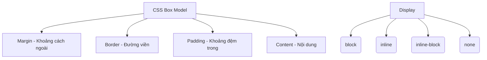

# Bài 03: Box Model & Display (Mô hình hộp & Kiểu hiển thị)

## I. KHÁI QUÁT (OVERVIEW)
CSS Box Model là nền tảng cốt lõi định nghĩa cách mỗi phần tử HTML được trình duyệt dựng hình trên trang dưới dạng các hộp chữ nhật. Thuộc tính `display` quyết định cách thức hộp này tương tác, xếp chồng hay nằm ngang với các hộp khác trong luồng tài liệu (Document Flow).



> [!IMPORTANT]
> Box Model là bài học quan trọng nhất trong CSS để bạn làm chủ việc điều khiển kích thước và khoảng cách giữa các phần tử.

## II. CHI TIẾT KỸ THUẬT (DETAILED DEEP DIVE)

### 1. Thành phần Box Model
Mọi thẻ HTML đều là một khối hình chữ nhật gồm 4 lớp:
- **Content:** Khu vực chứa văn bản, hình ảnh... Kích thước định bởi `width` và `height`.
- **Padding:** Khoảng đệm giữa nội dung (content) và viền (border). Padding nhận màu nền của phần tử.
- **Border:** Đường viền bao quanh padding và content.
- **Margin:** Vùng không gian trong suốt bên ngoài border, đẩy các phần tử khác ra xa.

### 2. Box-Sizing: content-box vs border-box
Mặc định, kích thước phần tử được tính theo `content-box`.
- `content-box` (Mặc định): Width/Height chỉ áp dụng cho Content. Tổng kích thước = Content + Padding + Border. (Cực kỳ khó tính toán).
- `border-box`: Width/Height bao gồm cả Padding và Border. Tổng kích thước = Width/Height.

### 3. Display Properties

| Thuộc tính | Ngắt dòng | Chấp nhận Width/Height | Chấp nhận Margin Top/Bottom |
|---|---|---|---|
| `block` | Có | Có | Có |
| `inline` | Không | Không | Không |
| `inline-block` | Không | Có | Có |
| `none` | Ẩn hoàn toàn, không chiếm không gian | - | - |

> [!CAUTION]
> Phân biệt `display: none` và `visibility: hidden`. `display: none` xóa phần tử khỏi luồng tài liệu (layout). `visibility: hidden` ẩn phần tử nhưng nó vẫn chiếm không gian y hệt lúc hiển thị.

## III. VÍ DỤ MINH HỌA VÀ PHÂN TÍCH CODE (CODE EXAMPLES & ANALYSIS)

```css
/* Reset CSS kinh điển - Áp dụng border-box cho TẤT CẢ phần tử */
*, *::before, *::after {
    box-sizing: border-box;
}

.box {
    width: 200px;
    height: 100px;
    padding: 20px;
    border: 5px solid black;
    margin: 10px;
    background-color: lightblue;
}
```

**Phân tích Code:**
Nhờ có `box-sizing: border-box`, thẻ `.box` sẽ có kích thước thực tế hiển thị trên màn hình là `200px` (chiều rộng) và `100px` (chiều cao). Trình duyệt tự động trừ đi padding và border để tính ra không gian cho Content: 
- Content Width = 200 - (20*2) - (5*2) = 150px.
Nếu không có `border-box`, thẻ `.box` sẽ phình to ra thành Width = 200 + 40 + 10 = 250px.

## IV. LƯU Ý, CẠM BẪY VÀ QUY TẮC CỐT LÕI (PITFALLS & BEST PRACTICES)

1. **Margin Collapsing (Sụp đổ Margin):** Khi 2 thẻ Block nằm cạnh nhau theo chiều dọc, margin-top của thẻ dưới và margin-bottom của thẻ trên sẽ chập vào nhau (lấy giá trị lớn hơn), chứ không cộng dồn. Điều này không xảy ra với phần tử nằm ngang (flex, inline) hoặc nếu có border/padding ngăn cách.
2. **Inline Elements:** Không bao giờ set `margin-top` hoặc `height` cho thẻ `<a>` hay `<span>` khi chưa chuyển nó thành `inline-block` hoặc `block`. Nó sẽ không có tác dụng.
3. **Thói quen Box-sizing:** Luôn luôn bắt đầu dự án bằng đoạn snippet `* { box-sizing: border-box; }`.

### 💡 QUY TẮC VÀNG
> Khai báo `box-sizing: border-box` ở đầu mọi file CSS. Hiểu rõ sự khác biệt giữa `block`, `inline` và `inline-block` sẽ giải quyết 90% các lỗi về layout và khoảng cách ở mức cơ bản.