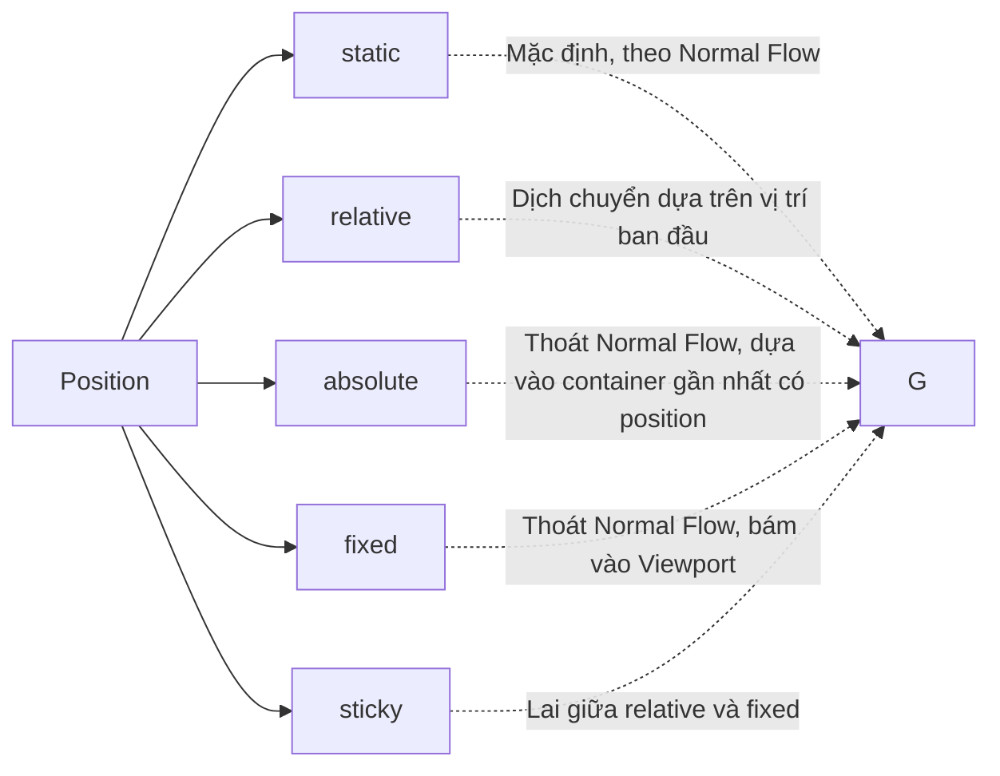

## I. KHÁI QUÁT (OVERVIEW)
Thuộc tính `position` giúp bạn lấy một phần tử ra khỏi luồng tài liệu thông thường (Normal Flow) hoặc thay đổi vị trí tự nhiên của nó bằng cách sử dụng các tọa độ `top`, `right`, `bottom`, `left`. Cùng với `z-index`, bạn có thể kiểm soát thứ tự xếp chồng (layering) của các phần tử.



> [!NOTE]
> Positioning là vũ khí mạnh mẽ tạo ra các Modal, Tooltip, Header bám dính (sticky navbar)... Tuy nhiên lạm dụng nó để làm layout toàn trang là một sai lầm nghiêm trọng (đó là việc của Flexbox/Grid).

## II. CHI TIẾT KỸ THUẬT (DETAILED DEEP DIVE)

### 1. Các giá trị của thuộc tính `position`

| Thuộc tính | Hành vi | Ảnh hưởng đến phần tử khác | Có dùng được T/R/B/L? |
|---|---|---|---|
| `static` (Mặc định) | Nằm đúng vị trí trong luồng tài liệu. | Có (chiếm chỗ) | Không |
| `relative` | Giữ nguyên vị trí ban đầu nhưng dịch chuyển đi 1 đoạn. | Có (phần tử khác vẫn xem nó ở vị trí cũ) | Có |
| `absolute` | Bay ra khỏi luồng, bám vào thẻ cha gần nhất có position khác static. | Không (phần tử khác chiếm chỗ của nó) | Có |
| `fixed` | Bay ra khỏi luồng, bám chặt vào cửa sổ trình duyệt (Viewport). | Không | Có |
| `sticky` | Hoạt động như relative, nhưng khi cuộn qua một ngưỡng thì biến thành fixed. | Có | Có |

### 2. Thuộc tính z-index và Stacking Context
`z-index` chỉ hoạt động với các phần tử có `position` khác `static`. Giá trị số càng lớn, phần tử càng nằm phía trên.
Tuy nhiên, `z-index` bị giới hạn bởi Stacking Context (Ngữ cảnh xếp chồng). Nếu Thẻ Cha A có z-index: 1, Thẻ Cha B có z-index: 2, thì dù Thẻ Con của A có z-index: 9999, nó vẫn nằm dưới Thẻ Con của B.

> [!TIP]
> Tránh việc sử dụng `z-index: 9999`. Hãy thiết lập một hệ thống z-index scale chuẩn xác cho dự án (ví dụ: modal: 100, tooltip: 200).

## III. VÍ DỤ MINH HỌA VÀ PHÂN TÍCH CODE (CODE EXAMPLES & ANALYSIS)

```css
/* Tạo một tooltip đơn giản */
.tooltip-container {
    position: relative; /* Tạo mỏ neo (anchor) cho thẻ con absolute */
    display: inline-block;
    cursor: pointer;
}

.tooltip-text {
    position: absolute;
    bottom: 120%; /* Đẩy lên phía trên tooltip container */
    left: 50%;
    transform: translateX(-50%); /* Căn giữa hoàn hảo */
    
    background-color: black;
    color: white;
    padding: 5px 10px;
    border-radius: 4px;
    
    visibility: hidden;
    opacity: 0;
    transition: opacity 0.3s;
    white-space: nowrap;
}

.tooltip-container:hover .tooltip-text {
    visibility: visible;
    opacity: 1;
}
```

**Phân tích Code:**
Mô hình "Cha Relative - Con Absolute" là kỹ thuật kinh điển nhất. Thẻ cha `.tooltip-container` đóng vai trò là cột mốc tọa độ (nhờ `position: relative`). Thẻ con `.tooltip-text` sử dụng `position: absolute` để dịch chuyển so với gốc tọa độ của thẻ cha. Thuộc tính `left: 50%` cộng với `transform: translateX(-50%)` là trick nổi tiếng để căn giữa hoàn hảo một phần tử absolute.

## IV. LƯU Ý, CẠM BẪY VÀ QUY TẮC CỐT LÕI (PITFALLS & BEST PRACTICES)

1. **Quên đặt cha là Relative:** Nếu thẻ con `absolute` không tìm thấy thẻ cha nào có `position` (khác static), nó sẽ lấy thẻ `<html>` làm mốc, bay thẳng lên góc màn hình.
2. **Fixed bị vỡ trên Mobile:** Khi dùng `position: fixed` trên mobile, thanh địa chỉ của trình duyệt thu nhỏ/phóng to có thể gây lỗi hiển thị chiều cao.
3. **Lạm dụng Absolute làm layout:** Absolute làm mất luồng tài liệu. Nếu nội dung bên trong dài ra, nó sẽ không đẩy các phần tử khác xuống mà sẽ đè lên chúng. Chỉ dùng Absolute cho các tiểu tiết trang trí, nút đóng, overlay, badge.

### 💡 QUY TẮC VÀNG
> Công thức nằm lòng: **Cha `relative`, Con `absolute`**. Không bao giờ dùng position để dàn trang chính, hãy nhường việc đó cho Flexbox và Grid. Kiểm soát `z-index` một cách có hệ thống.
