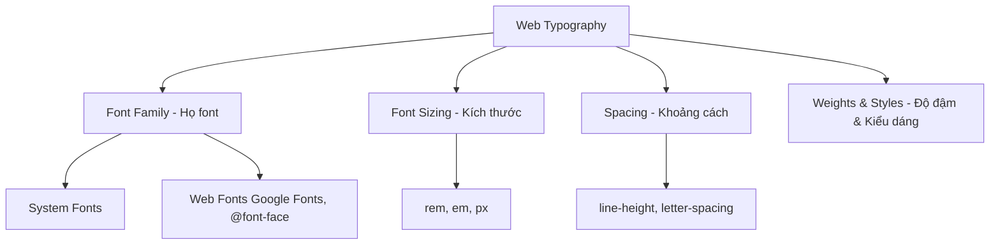

## I. KHÁI QUÁT (OVERVIEW)
Typography là nghệ thuật sắp xếp chữ. Trên web, typography không chỉ là chọn font mà là trải nghiệm đọc của người dùng, liên quan đến kích cỡ, khoảng cách dòng, và độ tương phản. CSS cung cấp các thuộc tính tinh chỉnh chữ mạnh mẽ cùng với cơ chế nhúng font từ bên ngoài như Google Fonts hoặc @font-face.



> [!NOTE]
> Typography chiếm đến 90% diện tích thiết kế web. Một trang web có layout đơn giản nhưng typography tốt sẽ trông chuyên nghiệp hơn nhiều trang web hiệu ứng cầu kỳ nhưng chữ xấu.

## II. CHI TIẾT KỸ THUẬT (DETAILED DEEP DIVE)

### 1. Font Family & Fallbacks
Sử dụng `font-family` để khai báo font. Luôn cần có "fallback fonts" (font dự phòng) phòng trường hợp font chính lỗi.
`font-family: 'Roboto', 'Helvetica Neue', Arial, sans-serif;`

### 2. Các thuộc tính Typography cốt lõi
| Thuộc tính | Ý nghĩa | Ví dụ giá trị |
|---|---|---|
| `font-size` | Kích thước chữ | `16px`, `1.5rem` |
| `font-weight` | Độ đậm (từ 100 đến 900) | `normal` (400), `bold` (700) |
| `line-height` | Chiều cao dòng (cực quan trọng cho độ dễ đọc) | `1.5`, `150%` |
| `letter-spacing`| Khoảng cách giữa các chữ cái | `0.5px`, `-0.02em` |
| `text-align` | Căn lề chữ | `left`, `center`, `justify` |
| `text-transform`| Biến đổi chữ hoa/thường | `uppercase`, `capitalize` |
| `color` | Màu chữ | `#333333`, `rgba(0,0,0,0.8)` |

### 3. Đơn vị đo kích thước: rem vs em vs px
- **px (Pixel):** Tuyệt đối. Không tự động scale khi người dùng đổi cài đặt font trình duyệt (Kém Accessibility).
- **em:** Tương đối. Dựa trên font-size của **thẻ cha**. Dễ gây lỗi tính toán chuỗi (chaining).
- **rem:** Tương đối. Dựa trên font-size của **Root (`<html>`)**, thường là 16px. Đây là tiêu chuẩn hiện đại để làm typography. 1rem = 16px.

> [!TIP]
> Sử dụng `line-height` dạng số không có đơn vị (unitless ratio) như `1.5` thay vì `1.5em` hay `24px` để kế thừa an toàn.

## III. VÍ DỤ MINH HỌA VÀ PHÂN TÍCH CODE (CODE EXAMPLES & ANALYSIS)

```css
/* Thiết lập Root Font Size và Hệ thống Font (System Font Stack) */
html {
    font-size: 100%; /* Giữ nguyên thiết lập mặc định của user, thường là 16px */
}

body {
    font-family: -apple-system, BlinkMacSystemFont, "Segoe UI", Roboto, Helvetica, Arial, sans-serif;
    color: #333;
    line-height: 1.6; /* Chiều cao dòng bằng 1.6 lần font-size */
}

h1, h2, h3 {
    line-height: 1.2; /* Tiêu đề cần khoảng cách dòng hẹp hơn văn bản thường */
    font-weight: 700;
    margin-bottom: 0.5em; /* Dùng em để margin scale theo font-size của chính tiêu đề đó */
    letter-spacing: -0.02em; /* Kéo các chữ lại gần nhau xíu cho tiêu đề to đỡ rời rạc */
}

.article-text {
    font-size: 1.125rem; /* ~18px */
    max-width: 65ch; /* Giới hạn độ dài dòng để mắt dễ theo dõi (65 characters) */
}
```

**Phân tích Code:**
Code trên thể hiện tư duy thiết lập typography hiện đại. 
- Dùng **System Font Stack** giúp web load tức thì (không cần tải font qua mạng) và hiển thị thân thiện với hệ điều hành của user (Mac sẽ thấy font San Francisco, Win thấy Segoe UI). 
- Giới hạn độ rộng đoạn văn bằng `max-width: 65ch` giúp mắt người không phải lia quá xa từ trái sang phải, giảm mỏi mắt khi đọc blog dài.

## IV. LƯU Ý, CẠM BẪY VÀ QUY TẮC CỐT LÕI (PITFALLS & BEST PRACTICES)

1. **FOUT và FOIT (Flash of Unstyled/Invisible Text):** Khi dùng Web font, lúc font đang tải, web sẽ hiện chữ xấu (FOUT) hoặc tàng hình (FOIT). Sử dụng `font-display: swap;` trong `@font-face` hoặc Google Fonts để ép trình duyệt hiển thị font fallback trước.
2. **Kích thước file font lớn:** Tải quá nhiều định dạng (`.ttf`, `.woff`, `.woff2`) và nhiều mức weight (100-900) sẽ làm chậm web. Chỉ import đúng weight cần thiết (thường là 400, 500, 700) và dùng định dạng `woff2`.
3. **Căn lề `justify`:** Hạn chế dùng `text-align: justify` trên web. Khác với Word, trình duyệt không có cơ chế hyphenation (ngắt nối từ) hoàn hảo, dẫn đến các "dòng sông trắng" (River of white) dị hợm giữa đoạn văn.

### 💡 QUY TẮC VÀNG
> Sử dụng **rem** cho `font-size`. Sử dụng số nguyên/thập phân cho `line-height` (không kèm đơn vị). Luôn thiết lập `font-display: swap` khi nhúng Web Font. Giới hạn độ dài dòng văn bản ở mức 60-75 ký tự.
