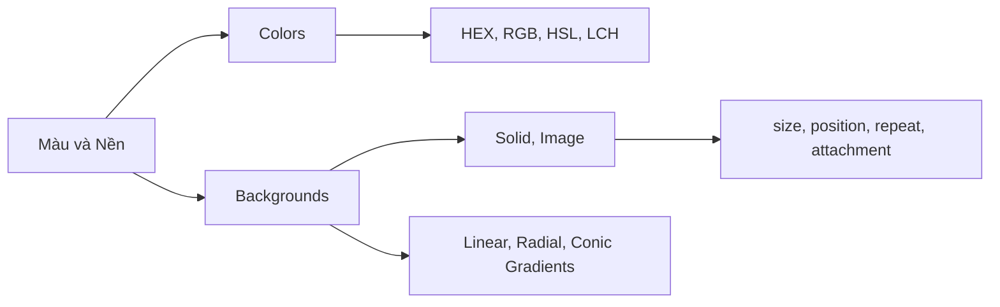

## I. KHÁI QUÁT (OVERVIEW)
Màu sắc và nền tạo nên cảm xúc, nhận diện thương hiệu và sự tách biệt không gian trên website. CSS không chỉ giới hạn ở việc đổ màu đặc (solid color) mà còn cung cấp khả năng kết hợp đa tầng nền (multiple backgrounds), ảnh nền, và các hiệu ứng chuyển sắc (gradient) sống động.



> [!NOTE]
> Việc sử dụng hệ màu nào không quá quan trọng về mặt hiển thị (vì trình duyệt đều render ra giống nhau), nhưng chọn đúng hệ màu (ví dụ: HSL) sẽ giúp developer dễ dàng tạo ra các biến thể sáng/tối bằng toán học hơn là hệ HEX.

## II. CHI TIẾT KỸ THUẬT (DETAILED DEEP DIVE)

### 1. Các hệ Màu sắc (Color Formats)
| Hệ màu | Cú pháp | Đặc điểm & Ứng dụng |
|---|---|---|
| Mảng màu định danh | `red`, `transparent` | Gồm 140 màu chuẩn. Chỉ dùng test nhanh hoặc demo. |
| HEX | `#ff5733` hoặc `#ff5733cc` | Chuẩn phổ biến nhất từ thiết kế (Figma, Photoshop). 2 ký tự cuối (cc) là độ trong suốt (alpha). |
| RGB/RGBA | `rgb(255, 87, 51)` | Dễ lập trình với Javascript (khi cần random màu). |
| HSL/HSLA | `hsl(10, 100%, 60%)` | Hue (Màu), Saturation (Đậm nhạt), Lightness (Sáng tối). **Dễ thao tác nhất cho dev** để tạo theme sáng tối. |

### 2. Thuộc tính Background cốt lõi
Thuộc tính `background` là một thuộc tính viết tắt (shorthand) cho nhiều thuộc tính:
- `background-color`: Màu nền.
- `background-image`: Ảnh nền (bao gồm cả url và gradient).
- `background-size`: `cover` (phủ kín không méo), `contain` (vừa khung không mất góc).
- `background-position`: `center center`, `top left`.
- `background-repeat`: `no-repeat`, `repeat-x`, `repeat-y`.
- `background-attachment`: `scroll`, `fixed` (hiệu ứng parallax đơn giản).

> [!TIP]
> Bạn có thể xếp chồng nhiều ảnh nền lên nhau bằng dấu phẩy. Lớp viết đầu tiên sẽ nằm trên cùng. VD: `background-image: linear-gradient(rgba(0,0,0,0.5), rgba(0,0,0,0.5)), url('anh.jpg');` - Một trick kinh điển để làm đen ảnh nền, giúp chữ trắng nổi bật.

## III. VÍ DỤ MINH HỌA VÀ PHÂN TÍCH CODE (CODE EXAMPLES & ANALYSIS)

```css
/* Ví dụ 1: Button sử dụng Linear Gradient */
.btn-gradient {
    background: linear-gradient(135deg, #ff7e5f 0%, #feb47b 100%);
    color: white;
    border: none;
    padding: 12px 24px;
    border-radius: 8px;
    transition: transform 0.2s;
}

.btn-gradient:hover {
    transform: translateY(-2px);
    /* Thay vì đổi màu gradient, ta có thể dùng trick filter */
    filter: brightness(1.1); 
}

/* Ví dụ 2: Hero Section với ảnh nền và Overlay xám */
.hero-section {
    height: 100vh;
    /* Shorthand background: color image position / size repeat attachment */
    background: 
        linear-gradient(rgba(0, 0, 0, 0.6), rgba(0, 0, 0, 0.6)), /* Lớp 1: Overlay tối */
        url('/images/hero-bg.jpg') center / cover no-repeat fixed; /* Lớp 2: Ảnh nền có parallax (fixed) */
    
    display: flex;
    align-items: center;
    justify-content: center;
    color: white;
}
```

**Phân tích Code:**
Trong ví dụ `.hero-section`, ta sử dụng `linear-gradient` làm một lớp "mặt nạ" (overlay) che lên ảnh thật. Bằng cách truyền `rgba` với độ alpha là 0.6, ảnh gốc sẽ bị tối đi 60%, giúp văn bản màu trắng bên trong container hiển thị rõ ràng với độ tương phản cao, bất chấp ảnh gốc sáng hay tối. Thuộc tính `fixed` tạo hiệu ứng cuộn ảnh giả 3D khá mượt mà.

## IV. LƯU Ý, CẠM BẪY VÀ QUY TẮC CỐT LÕI (PITFALLS & BEST PRACTICES)

1. **Hiệu năng của background-attachment: fixed:** Mặc dù tạo hiệu ứng parallax nhanh chóng, nhưng `fixed` ép trình duyệt phải tính toán (repaint) liên tục khi cuộn trang, gây lag (jank) trên thiết bị di động yếu. 
2. **Ảnh nền quá nặng:** `background-image` vẫn tải tệp hình ảnh. Hãy nén ảnh cẩn thận và cân nhắc dùng định dạng WebP thay vì PNG/JPEG, nếu không LCP (Largest Contentful Paint) của bạn sẽ rất tệ.
3. **Màu sắc và Độ Tương Phản (A11y):** Tránh các tổ hợp màu có độ tương phản thấp (như chữ xám nhạt trên nền xám đậm). Sử dụng chuẩn WCAG để kiểm tra (tối thiểu là 4.5:1 đối với văn bản thường).

### 💡 QUY TẮC VÀNG
> Sử dụng **HSL** khi xây dựng hệ thống Design System. Luôn chồng thêm một lớp Overlay tối màu lên ảnh nền nếu có chứa chữ phía trên. Tránh hiệu ứng gradient quá chói hoặc pha trộn quá 3 màu làm rối mắt người dùng.
