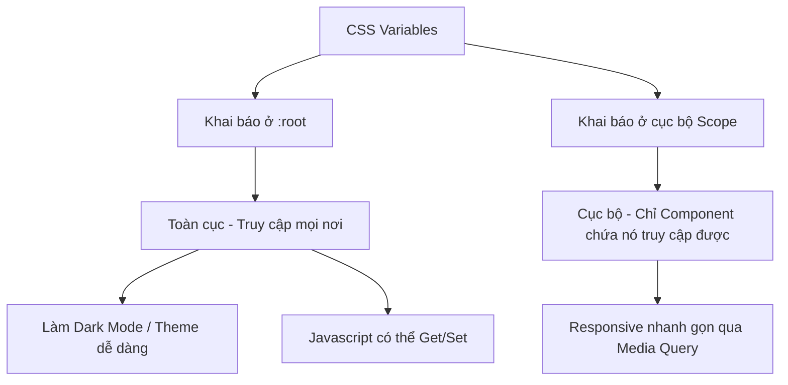

## I. KHÁI QUÁT (OVERVIEW)
CSS Variables (hay Custom Properties) là các biến được khai báo gốc trong CSS bằng tiền tố `--`. Chức năng của chúng giống hệt các biến trong ngôn ngữ lập trình: lưu trữ giá trị (màu sắc, khoảng cách, kích thước...) để tái sử dụng ở nhiều nơi, và chỉ cần đổi một chỗ thì toàn bộ giao diện cập nhật ngay lập tức. Khác với biến SASS/LESS, biến CSS sống (live) trên trình duyệt và có thể thao tác bằng Javascript.



> [!IMPORTANT]
> Đây không phải tính năng "có cũng được không có cũng không sao". CSS Variables là kiến trúc bắt buộc cho mọi dự án web hiện đại để quản lý Design System và Dark Mode.

## II. CHI TIẾT KỸ THUẬT (DETAILED DEEP DIVE)

### 1. Cú pháp khai báo và sử dụng
- **Khai báo:** Bắt buộc bắt đầu bằng `--`. Thường khai báo ở `:root` (tương đương thẻ `<html>`) để dùng toàn cục.
- **Sử dụng:** Bọc tên biến vào trong hàm `var()`. Có thể truyền giá trị dự phòng (fallback) làm tham số thứ hai.

| Bước | Cú Pháp | Mô tả |
|---|---|---|
| Khai báo | `--primary-color: #3498db;` | Định nghĩa biến |
| Sử dụng | `color: var(--primary-color);` | Lấy giá trị biến |
| Fallback | `color: var(--danger-color, red);` | Nếu `--danger-color` không tồn tại, dùng `red` |

### 2. Sức mạnh vượt trội so với SASS/LESS Variables
- **Cascade & Inheritance (Tính kế thừa):** Biến CSS tôn trọng quy luật ưu tiên (Specificity) và thừa kế (Inheritance) của CSS. Bạn có thể ghi đè biến ở một class con. SASS variable thì sẽ bị biên dịch cứng lúc build, không đổi theo HTML structure được.
- **Thay đổi thời gian thực:** Bạn có thể thay đổi biến bên trong `:hover` hoặc `@media` query, và tất cả thẻ dùng biến đó sẽ tự thay đổi. Không cần phải lặp lại code màu sắc, font chữ.

> [!TIP]
> Lưu trữ biến thành các token độc lập thay vì toàn giá trị cứng: Thay vì `--primary: #fff;` và `--text: #fff;`, hãy làm `--white: #fff;`, `--primary: var(--white);`. 

## III. VÍ DỤ MINH HỌA VÀ PHÂN TÍCH CODE (CODE EXAMPLES & ANALYSIS)

```css
/* Khai báo Design System Token ở cấp độ toàn cục */
:root {
    /* Colors */
    --color-surface: #ffffff;
    --color-text: #1a1a1a;
    --color-primary: #007bff;
    
    /* Spacing */
    --spacing-sm: 0.5rem;
    --spacing-md: 1rem;
    --spacing-lg: 2rem;
}

/* Áp dụng Dark Theme siêu nhanh gọn bằng cách ghi đè biến */
[data-theme="dark"] {
    --color-surface: #121212;
    --color-text: #e0e0e0;
    --color-primary: #339af0;
}

/* Áp dụng cho các thành phần */
body {
    background-color: var(--color-surface);
    color: var(--color-text);
    /* Nếu muốn hiệu ứng mượt khi chuyển theme */
    transition: background-color 0.3s ease, color 0.3s ease;
}

.card {
    padding: var(--spacing-md);
    border: 1px solid var(--color-primary);
    margin-bottom: var(--spacing-lg);
}

/* Biến ở dạng cục bộ (Scope) */
.btn {
    --btn-bg: var(--color-primary);
    background-color: var(--btn-bg);
    color: white;
    padding: var(--spacing-sm) var(--spacing-md);
}

.btn.btn-danger {
    /* Ghi đè biến nội bộ, không cần phải viết lại background-color */
    --btn-bg: #dc3545; 
}
```

**Phân tích Code:**
Code trên minh họa sức mạnh thực sự của biến CSS: Thiết kế Theme và Component hóa. Khi người dùng click nút "Dark Mode", Javascript chỉ cần gắn `data-theme="dark"` vào thẻ `<html>` hoặc `<body>`. Ngay lập tức biến đổi giá trị của `--color-surface` và `--color-text`. Toàn bộ website (`body`, `.card`) sử dụng hàm `var()` sẽ động tự chuyển màu mà ta không phải viết CSS lặp lại cho từng phần tử.

## IV. LƯU Ý, CẠM BẪY VÀ QUY TẮC CỐT LÕI (PITFALLS & BEST PRACTICES)

1. **Hiệu năng:** Khai báo quá nhiều biến không cần thiết trên thẻ `*` (universal selector) thay vì `:root` sẽ ảnh hưởng đến hiệu năng dựng hình của trình duyệt. Chỉ gán ở `:root` hoặc thẻ cụ thể.
2. **Không thể ghép chữ trực tiếp vào biến số:** Không thể làm `width: var(--size)px;` nếu `--size: 20`. Phải dùng hàm `calc()`: `width: calc(var(--size) * 1px);`.
3. **Phụ thuộc Javascript quá mức:** Tránh dùng JS để update hàng chục biến CSS mỗi milisecond (ví dụ nhét vào hàm `onscroll`). Thay vào đó, dùng CSS media query kết hợp biến.

### 💡 QUY TẮC VÀNG
> Lưu trữ **tất cả** màu sắc, font, spacing, radius chung của dự án vào `:root`. Bất cứ giá trị CSS nào lặp lại trên 3 lần, hãy biến nó thành CSS Variable. Sử dụng biến CSS kết hợp với thuộc tính HTML `data-*` để làm Dark Theme là chuẩn mực ngành hiện tại.
