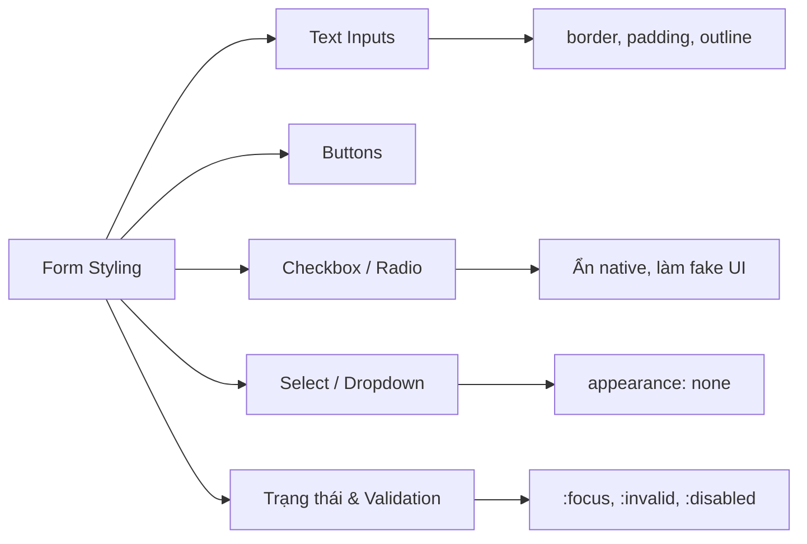

# Bài 08: Forms & Input Styling (Biểu mẫu & Định dạng ô nhập liệu)

## I. KHÁI QUÁT (OVERVIEW)
Biểu mẫu (Forms) là trái tim của mọi tương tác ứng dụng web (Đăng nhập, Thanh toán, Đăng ký). Tuy nhiên, các trình duyệt (Chrome, Safari, Firefox) lại cung cấp giao diện mặc định cho form rất xấu và không đồng nhất. Việc format form field, checkbox, radio button bằng CSS đòi hỏi nhiều thủ thuật vì đây là các yếu tố "nhạy cảm" với hệ điều hành (Native UI components).



> [!NOTE]
> Khó khăn lớn nhất của Form Styling là làm sao để form trông giống hệt nhau trên cả Chrome, Safari Mac và Mobile, trong khi vẫn giữ được khả năng tiếp cận (Accessibility) bằng bàn phím.

## II. CHI TIẾT KỸ THUẬT (DETAILED DEEP DIVE)

### 1. Reset thuộc tính hệ thống mặc định (Appearance)
Trình duyệt tự gắn style 3D/shadow vào thẻ `<input>` trên iOS/Mac. Để triệt tiêu điều này, ta phải sử dụng thuộc tính `appearance: none`.

### 2. Các Pseudo-classes quản lý Trạng Thái Form
Form là thành phần có tính tương tác cao, hãy sử dụng các CSS Pseudo-classes sau để phản hồi người dùng:
| Trạng Thái | Pseudo-class | Mô tả |
|---|---|---|
| Đang trỏ/nhập | `:focus` | Người dùng đang tương tác với ô input. (BẮT BUỘC PHẢI STYLE) |
| Đang vô hiệu hóa| `:disabled` | Input bị khóa, không thể tương tác. |
| Dữ liệu đúng | `:valid` | Dữ liệu đúng định dạng (email, pattern). |
| Dữ liệu sai | `:invalid` | Dữ liệu vi phạm quy tắc validation (như required). |
| Placeholder | `::placeholder` | Format chữ xám mặc định trong ô input. |

### 3. Khắc phục Outline 
Mặc định trình duyệt có viền xanh dương/đen khi `:focus`. Developer thường sai lầm viết `outline: none;` để tắt nó đi mà quên style lại viền khác, khiến người dùng phím tab bị "mù" vị trí.

> [!CAUTION]
> Tội ác lớn nhất trong UX là khai báo `input:focus { outline: none; }` MÀ KHÔNG thêm `box-shadow` hoặc `border` khác thay thế. Nó giết chết khả năng tiếp cận (Accessibility).

## III. VÍ DỤ MINH HỌA VÀ PHÂN TÍCH CODE (CODE EXAMPLES & ANALYSIS)

```css
/* 1. Reset và cấu hình Text Input cơ bản */
.input-text {
    width: 100%;
    padding: 12px 16px;
    font-size: 16px; /* Chặn iOS auto-zoom khi focus */
    border: 1px solid #ccc;
    border-radius: 8px;
    background-color: #fff;
    color: #333;
    transition: border-color 0.2s, box-shadow 0.2s;
    appearance: none; /* Khử style mặc định của HĐH */
}

/* 2. Trạng thái Focus - Rất quan trọng */
.input-text:focus {
    outline: none; /* Tắt outline mặc định xấu xí */
    border-color: #007bff;
    /* Dùng box shadow để giả lập outline, nhìn mềm mại và đẹp hơn */
    box-shadow: 0 0 0 3px rgba(0, 123, 255, 0.25); 
}

/* 3. Validation Feedback */
/* Input bị sai định dạng nhưng không focus */
.input-text:not(:placeholder-shown):invalid {
    border-color: #dc3545;
}

.input-text:not(:placeholder-shown):invalid:focus {
    box-shadow: 0 0 0 3px rgba(220, 53, 69, 0.25);
}

/* 4. Tùy chỉnh Checkbox "Fake" hiện đại */
.custom-checkbox input[type="checkbox"] {
    /* Ẩn checkbox thật khỏi luồng hiển thị nhưng không làm mất trên ScreenReader */
    position: absolute;
    opacity: 0; 
}

.custom-checkbox .checkmark {
    display: inline-block;
    width: 20px;
    height: 20px;
    background-color: #eee;
    border: 2px solid #ccc;
    border-radius: 4px;
    position: relative;
    vertical-align: middle;
    margin-right: 8px;
    transition: 0.2s;
}

/* Trạng thái được chọn */
.custom-checkbox input[type="checkbox"]:checked + .checkmark {
    background-color: #007bff;
    border-color: #007bff;
}

/* Dấu tích trắng bằng pseudo-element */
.custom-checkbox input[type="checkbox"]:checked + .checkmark::after {
    content: "";
    position: absolute;
    left: 5px;
    top: 2px;
    width: 5px;
    height: 10px;
    border: solid white;
    border-width: 0 2px 2px 0;
    transform: rotate(45deg);
}
```

**Phân tích Code:**
Đoạn code trên thể hiện tư duy thiết kế Form chuyên nghiệp.
- **Input text:** Sử dụng `box-shadow` để giả làm outline khi Focus, giúp viền bo theo `border-radius` mượt mà, khác với `outline` mặc định là viền vuông cứng nhắc. Quy tắc `:not(:placeholder-shown):invalid` là một trick CSS thuần túy: Nó chỉ báo lỗi đỏ khi user đã gõ gì đó bị sai, không báo đỏ ngay lúc form chưa nhập gì.
- **Custom Checkbox:** Trình duyệt không cho phép CSS thẳng vào dấu check. Cách làm chuẩn ngành là ẩn `<input type="checkbox">` đi (opacity: 0) nhưng vẫn giữ nó để nhận Focus và Click, sau đó dùng thẻ `<span>` bên cạnh và bộ chọn `+` (Adjacent Sibling) để vẽ hộp và dấu tích giả bằng `::after`.

## IV. LƯU Ý, CẠM BẪY VÀ QUY TẮC CỐT LÕI (PITFALLS & BEST PRACTICES)

1. **Auto-Zoom trên iOS:** Nếu thẻ `input` có `font-size` dưới 16px, Safari trên iPhone sẽ tự động zoom to màn hình khi nhấn vào form, gây phá layout khó chịu. Luôn để font-size của input >= 16px.
2. **Kích thước Hitbox:** Nút bấm và input trên điện thoại phải đủ to để ngón tay bấm không trượt. Kích thước tối thiểu được khuyến nghị bởi Apple và Google là vùng chạm 44px x 44px.
3. **Thẻ Label:** Bắt buộc mọi ô input, checkbox phải đi kèm thẻ `<label for="id">`. Người dùng click vào chữ Label, input sẽ được focus. Điều này cực kỳ tiện lợi cho checkbox nhỏ.

### 💡 QUY TẮC VÀNG
> LUÔN sử dụng thẻ `<label>`. LUÔN style cho trạng thái `:focus`. Dùng `box-shadow` để làm outline tập trung mượt mà. Ẩn các thành phần Form mặc định bằng `appearance: none;` để tạo thiết kế đồng nhất trên mọi nền tảng.