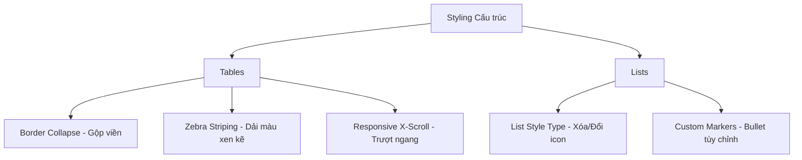

## I. KHÁI QUÁT (OVERVIEW)
Trong quá khứ, Table (Bảng) được lạm dụng để dàn trang, nhưng ngày nay, Table được trả về đúng sứ mệnh: Hiển thị dữ liệu có cấu trúc lưới dòng-cột (Data Grid). List (Danh sách `<ul>`, `<ol>`) là thành phần thiết yếu để hiển thị thông tin dạng liệt kê, menu điều hướng. Mặc định cả hai đều khá thô cứng và cần CSS để có diện mạo hiện đại, dễ đọc dữ liệu.



> [!NOTE]
> Bảng và Danh sách chứa dữ liệu là nơi người dùng phải tập trung thị giác để xử lý thông tin. Styling quá sặc sỡ ở đây là một điểm trừ UX. Yêu cầu lớn nhất là: **Gọn gàng, Rõ ràng, Tương phản tốt và Responsive.**

## II. CHI TIẾT KỸ THUẬT (DETAILED DEEP DIVE)

### 1. Thuộc tính quan trọng cho Tables (Bảng)
| Thuộc tính | Hành vi |
|---|---|
| `border-collapse` | Quyết định các ô có dính liền viền hay rời rạc. Chế độ `collapse` biến bảng viền đôi thành viền đơn gọn gàng. |
| `border-spacing` | Chỉnh khoảng cách giữa các ô (chỉ chạy khi border-collapse là `separate`). |
| `text-align` | Thường căn trái Text, căn giữa Icon, và căn phải đối với Dữ liệu số để dễ so sánh. |
| `:nth-child(even)` | Bộ chọn mạnh mẽ để tô màu so le (Zebra stripe) giúp mắt đọc dòng dài không bị lệch. |

### 2. Thuộc tính quan trọng cho Lists (Danh sách)
| Thuộc tính | Hành vi |
|---|---|
| `list-style-type` | Chỉnh loại icon: `none`, `disc`, `circle`, `square`, `decimal`... |
| `list-style-position`| `inside` (Bullet bị lùi vào trong như chữ), `outside` (Bullet nằm ngoài box, chữ thẳng hàng). |
| `list-style-image` | Dùng ảnh làm bullet (ít dùng vì khó căn chỉnh, thường dev dùng thẻ `::before` kết hợp icon font/svg). |

> [!TIP]
> Khi tạo thanh Navigation Menu (`<nav><ul><li>`), bước đầu tiên luôn là `list-style-type: none; margin: 0; padding: 0;` để xóa sạch dấu bullet và khoảng trống thừa của danh sách.

## III. VÍ DỤ MINH HỌA VÀ PHÂN TÍCH CODE (CODE EXAMPLES & ANALYSIS)

```css
/* =========================
   1. STYLING TABLE HIỆN ĐẠI
   ========================= */
.data-table {
    width: 100%;
    /* Quan trọng nhất để viền không bị nhân đôi, dày cộp */
    border-collapse: collapse; 
    margin-bottom: 24px;
    font-size: 15px;
    text-align: left;
    background: #fff;
    box-shadow: 0 4px 6px rgba(0,0,0,0.05);
    border-radius: 8px; /* Bo góc bảng */
    overflow: hidden; /* Đảm bảo bo góc bao gồm cả Header table */
}

/* Table Header */
.data-table thead tr {
    background-color: #009879;
    color: #ffffff;
    text-align: left;
    font-weight: bold;
}

/* Khoảng đệm cho cột */
.data-table th,
.data-table td {
    padding: 12px 15px;
    border-bottom: 1px solid #dddddd; /* Kẻ vạch ngang từng dòng */
}

/* Tô màu so le (Zebra Striping) để dễ đọc dòng ngang */
.data-table tbody tr:nth-of-type(even) {
    background-color: #f3f3f3;
}

/* Hover tương tác */
.data-table tbody tr:hover {
    background-color: #e8f5e9;
    color: #009879;
    cursor: pointer;
}

/* =========================
   2. TÙY CHỈNH BULLET LIST BẰNG ::before
   ========================= */
.custom-list {
    list-style: none; /* Xóa chấm đen mặc định */
    padding-left: 0;
}

.custom-list li {
    position: relative;
    padding-left: 28px;
    margin-bottom: 12px;
    line-height: 1.5;
}

/* Dùng ký tự emoji hoặc SVG làm dấu bullet mới */
.custom-list li::before {
    content: "✅"; 
    position: absolute;
    left: 0;
    top: 2px;
    font-size: 14px;
}
```

**Phân tích Code:**
- Với Table, `border-collapse: collapse` là chìa khóa. Việc dùng `box-shadow` và `border-radius` bọc ngoài làm cho bảng nhìn giống card nổi lên (Card-style layout). Kỹ thuật dùng `:nth-of-type(even)` tạo bảng vằn ngựa cải thiện UX cực lớn. Cẩn thận: Nếu muốn bảng bo góc mà dùng `border-collapse`, phải kết hợp `overflow: hidden` ở thẻ chứa nó.
- Với List, thay vì phụ thuộc `list-style-type`, chúng ta sử dụng thiết kế Custom Maker bằng giả phần tử `::before` và định vị `absolute`. Cách này cho phép kiểm soát vị trí chính xác đến từng pixel và đổi màu bullet mà không làm ảnh hưởng đến màu chữ.

## IV. LƯU Ý, CẠM BẪY VÀ QUY TẮC CỐT LÕI (PITFALLS & BEST PRACTICES)

1. **Table vỡ trên Mobile:** Table không bao giờ tự Responsive tốt. Nếu dữ liệu nhiều cột, trên mobile bảng sẽ bung ra khỏi màn hình hoặc chữ co nhỏ rách layout. Kỹ thuật khắc phục là bọc thẻ `<table class="data-table">` vào trong một thẻ `<div style="overflow-x: auto;">` để người dùng quẹt ngang riêng cái bảng, không bị tràn màn hình.
2. **Căn chỉnh Dữ Liệu Số:** Đối với các cột như Tiền tệ, Số lượng, ngày tháng ngắn, hãy sử dụng `text-align: right`. Mắt người dễ dàng so sánh độ dài chữ số khi nó căn phải.
3. **Thụt lề danh sách:** Mặc định thẻ `<ul>`, `<ol>` có `padding-left` (thường khoảng 40px) do trình duyệt cài. Nhớ xử lý hoặc reset lại khi tái sử dụng chúng làm các menu layout linh hoạt.

### 💡 QUY TẮC VÀNG
> Luôn dùng `border-collapse: collapse` cho Data Table. Bọc Table trong một wrapper cuộn ngang `overflow-x: auto` trên giao diện Mobile. Sử dụng `::before` pseudo-element để có khả năng tạo list-icons (bullet) tùy biến đa dạng nhất.
