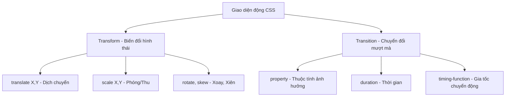

## I. KHÁI QUÁT (OVERVIEW)
Đã qua thời kỳ giao diện web chỉ như một tờ báo đứng yên. CSS Transforms cho phép thao tác toán học 2D/3D lên phần tử (dịch chuyển, phóng to, xoay, bóp méo). CSS Transitions giúp việc thay đổi trạng thái (từ A sang B, ví dụ khi hover) diễn ra mượt mà theo thời gian, thay vì giật cục chớp nhoáng.



> [!IMPORTANT]
> Transform và Opacity là 2 thuộc tính duy nhất được các trình duyệt tối ưu hóa trực tiếp bằng Card Đồ Họa (GPU Hardware Acceleration). Nếu muốn làm hoạt cảnh mượt mà không lag trên Mobile, LUÔN dùng Transform thay vì thay đổi Width/Height/Margin/Top/Left.

## II. CHI TIẾT KỸ THUẬT (DETAILED DEEP DIVE)

### 1. CSS Transforms cơ bản
Transform không làm ảnh hưởng đến không gian layout của các phần tử xung quanh (thẻ bị dịch chuyển nhưng cái bóng chiếm chỗ của nó vẫn nằm y nguyên chỗ cũ).

| Hàm Transform | Công dụng | Ví dụ |
|---|---|---|
| `translate(x, y)`| Dịch chuyển vị trí. Trục X nằm ngang, Y dọc. Tính theo %, px. | `translate(50px, -20%)` |
| `scale(x, y)` | Thu phóng tỷ lệ. 1 là gốc. < 1 thu nhỏ. > 1 phóng to. | `scale(1.2)` (Phóng to 20%)|
| `rotate(angle)` | Xoay phần tử theo tâm. Dùng đơn vị `deg` (độ). | `rotate(45deg)` |
| `skew(x-angle, y)`| Bóp méo xiên hình khối. | `skewX(15deg)` |

### 2. CSS Transitions - Nghệ thuật chuyển động
Thay vì trạng thái thay đổi đột ngột (ví dụ hover thì đổi từ đen sang đỏ ngay), transition giúp nội suy trạng thái tạo chuyển động.
Cú pháp shorthand: `transition: <property> <duration> <timing-function> <delay>;`

- **property:** Thuộc tính cần tạo mượt (vd: `background-color`, `transform`, `all`). Ưu tiên gọi tên cụ thể, hạn chế dùng `all` để tiết kiệm tài nguyên.
- **duration:** Thời lượng diễn ra, vd: `0.3s`, `500ms`.
- **timing-function:** Tốc độ diễn tiến. `linear` (đều), `ease-in` (nhanh dần), `ease-out` (chậm dần về cuối), `cubic-bezier()` (tùy chỉnh mượt mà).

> [!TIP]
> `ease-out` là hàm gia tốc mang lại cảm giác UX tốt nhất cho các hiệu ứng xuất hiện trên UI (vì nó phanh dần lại giống đời thực).

## III. VÍ DỤ MINH HỌA VÀ PHÂN TÍCH CODE (CODE EXAMPLES & ANALYSIS)

```css
/* Card Hover Effect kinh điển */
.card {
    width: 300px;
    height: 400px;
    background-color: white;
    border-radius: 12px;
    box-shadow: 0 4px 6px rgba(0,0,0,0.1);
    
    /* Setup Transition trên class gốc */
    /* Định nghĩa hiệu ứng mượt khi thuộc tính transform và box-shadow thay đổi */
    transition: transform 0.3s cubic-bezier(0.25, 0.8, 0.25, 1),
                box-shadow 0.3s ease;
    
    /* Đảm bảo phần tử tham chiếu tâm xoay ở chính giữa */
    transform-origin: center center;
}

/* Trạng thái Hover: Dịch chuyển lên và nổi bóng đậm lên */
.card:hover {
    /* Dịch chuyển lên 10px và phóng to nhẹ 2% */
    transform: translateY(-10px) scale(1.02);
    box-shadow: 0 15px 25px rgba(0,0,0,0.2);
}

/* Nút ấn với hiệu ứng Ripple / Scale */
.btn {
    padding: 10px 20px;
    background: #007bff;
    color: white;
    border-radius: 4px;
    border: none;
    cursor: pointer;
    transition: transform 0.1s ease-in-out, background 0.2s;
}

.btn:active {
    /* Khi click chuột xuống, nút thu nhỏ lại tạo cảm giác bị ép vật lý */
    transform: scale(0.95);
    background: #0056b3;
}
```

**Phân tích Code:**
Trong ví dụ `.card`, thuộc tính `transition` ĐƯỢC ĐẶT Ở CLASS GỐC (`.card`), KHÔNG phải đặt trong `:hover`. Nếu đặt trong `:hover`, hiệu ứng chỉ mượt khi chuột đi vào, còn khi rút chuột ra, nó sẽ giật mạnh về cũ. Sử dụng `translateY` thay vì `margin-top` mang lại chuyển động 60FPS mượt mà vì nó được máy tính xử lý qua luồng render riêng biệt (Compositor thread) thay vì ép trình duyệt tính toán lại Layout. 

## IV. LƯU Ý, CẠM BẪY VÀ QUY TẮC CỐT LÕI (PITFALLS & BEST PRACTICES)

1. **Hiệu năng tồi tệ do Transition "all":** Viết `transition: all 0.3s;` vô tình khiến trình duyệt theo dõi sự thay đổi của mọi thuộc tính (padding, color, margin). Chỉ định rõ `transition: transform 0.3s, opacity 0.3s`.
2. **Jank (Giật hình):** Cố gắng chuyển động bằng `width`, `height`, `top`, `left`, `margin`. Đây là những thuộc tính kích hoạt Layout Repaint. Chỉ dùng Transform và Opacity cho hoạt ảnh tĩnh.
3. **Mờ chữ (Blur Text):** Đôi khi áp dụng `transform: translate` bằng giá trị thập phân (ví dụ `10.5px`) có thể làm chữ bên trong khối bị mờ nhòe. Thêm thủ thuật `transform: translateZ(0)` để đẩy khối đó vào kết xuất 3D phần cứng, giúp xử lý lỗi nét mờ.

### 💡 QUY TẮC VÀNG
> Công thức hiệu năng vàng: **Chỉ làm hoạt hình với Transform và Opacity.** Khai báo `transition` ở class GỐC, không khai báo ở class TRẠNG THÁI (như `:hover`, `.active`). Tốc độ transition lý tưởng cho web là từ `0.15s` đến `0.3s`.
