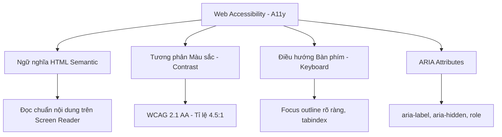

## I. KHÁI QUÁT (OVERVIEW)
Khả năng tiếp cận (Accessibility - viết tắt A11y vì có 11 chữ cái giữa A và y) là việc xây dựng website sao cho TẤT CẢ mọi người đều có thể dùng được. "Mọi người" bao gồm: người mù sử dụng trình đọc màn hình (Screen Readers), người không thể dùng chuột chỉ dùng Bàn phím (Keyboard Navigation), người mù màu, người khiếm thính, hoặc đơn giản là người đang dùng điện thoại dưới trời nắng gắt ngoài đường.



> [!IMPORTANT]
> A11y không phải là một "bổ sung tùy chọn" ở cuối dự án. Tại Mỹ và Châu Âu, việc website thiếu A11y (không theo chuẩn WCAG) hoàn toàn có thể dẫn đến kiện tụng pháp lý thiệt hại hàng triệu đô la. 

## II. CHI TIẾT KỸ THUẬT (DETAILED DEEP DIVE)

### 1. Semantic HTML - Nền móng của CSS A11y
Screen Reader (như VoiceOver trên Mac, NVDA trên Win) "nhìn" web bằng cây HTML, không phải CSS. Nếu bạn làm một cái nút bằng `<div class="btn" onclick="...">`, Screen Reader sẽ báo là "Text", người mù sẽ bỏ qua. Nếu bạn dùng `<button>`, nó báo "Button". 

### 2. Tương phản Màu sắc (Color Contrast)
Văn bản và màu nền phải có độ tương phản đủ cao để dễ đọc.
- Chữ thường: Tỉ lệ tương phản tối thiểu **4.5:1**.
- Chữ lớn (Bold > 18px hoặc Normal > 24px): Tỉ lệ tối thiểu **3.0:1**.
(Sử dụng công cụ Contrast Checker trên DevTools của Chrome).

### 3. Điều hướng Bàn phím (Focus Management)
Nhiều người dùng phím `Tab` để di chuyển qua lại trên web. 
- Mọi yếu tố tương tác (`a`, `button`, `input`) mặc định có thể Tab tới.
- Khi một nút nhận Focus, CSS phải hiển thị rõ ràng nó đang ở đâu (thường là viền).
- Dùng `tabindex="0"` để ép một thẻ `div` tĩnh thành thẻ có thể nhận Tab.
- Dùng `tabindex="-1"` để ngăn thẻ nhận phím Tab.

> [!CAUTION]
> Lỗi phổ biến: `outline: none;` trên trạng thái `:focus`. Nếu tắt outline mà không thay bằng `box-shadow` hay `border`, người dùng bàn phím sẽ không biết họ đang trỏ tới đâu.

## III. VÍ DỤ MINH HỌA VÀ PHÂN TÍCH CODE (CODE EXAMPLES & ANALYSIS)

```html
<!-- Kém A11y: Một nút đóng menu viết bằng thẻ span, không label -->
<span class="close-btn" onclick="closeMenu()">X</span>

<!-- Tốt A11y: Thẻ button chuẩn, aria-label giải thích icon X -->
<button class="close-btn" aria-label="Đóng menu" onclick="closeMenu()">
    <span aria-hidden="true">X</span>
</button>
```

```css
/* =============================
   1. QUẢN LÝ FOCUS RÕ RÀNG
   ============================= */
button, a {
    /* Đảm bảo trạng thái bình thường trông đẹp */
    transition: transform 0.2s, box-shadow 0.2s;
}

/* Áp dụng chuẩn CSS hiện đại: focus-visible
   Nó chỉ hiện outline khi user dùng bàn phím Tab. 
   Nếu user click chuột vào, nó KHÔNG hiện viền, giúp UI trông sạch hơn cho người dùng chuột. */
button:focus-visible, a:focus-visible {
    outline: none; /* Tắt viền xấu mặc định */
    box-shadow: 0 0 0 4px #4facfe, 
                0 0 0 6px white inset; /* Tạo viền 2 lớp rất rõ ràng */
}

/* =============================
   2. HỖ TRỢ TRÌNH ĐỌC MÀN HÌNH (SCREEN READER ONLY)
   ============================= */
/* Class kinh điển '.sr-only' - Ẩn phần tử khỏi mắt nhìn, 
   nhưng Screen Reader VẪN ĐỌC ĐƯỢC (không giống display: none) */
.sr-only {
    position: absolute;
    width: 1px;
    height: 1px;
    padding: 0;
    margin: -1px;
    overflow: hidden;
    clip: rect(0, 0, 0, 0);
    white-space: nowrap;
    border-width: 0;
}
```

**Phân tích Code:**
Trong HTML, đoạn chữ `X` chỉ dùng trang trí, nó không mang ý nghĩa cho người mù. Ta bọc nó lại bằng `aria-hidden="true"` để trình đọc lướt qua. Nhưng ta bù lại bằng `aria-label="Đóng menu"` trên thẻ button gốc, trình đọc sẽ phát tiếng "Đóng menu, Button".
Trong CSS, `.sr-only` là một kỹ thuật huyền thoại. Nếu dùng `display: none` hay `visibility: hidden`, Screen Reader sẽ phớt lờ hoàn toàn. Thay vào đó, ta thu nhỏ thẻ thành 1 pixel, kéo giấu đi, giúp phần nội dung vẫn có mặt trên cây DOM để hệ thống âm thanh đọc lên, trong khi giao diện hiển thị vẫn gọn gàng. `:focus-visible` là tính năng CSS hiện đại, phân biệt thông minh giữa click chuột và phím tab.

## IV. LƯU Ý, CẠM BẪY VÀ QUY TẮC CỐT LÕI (PITFALLS & BEST PRACTICES)

1. **Phụ thuộc quá nhiều vào màu sắc:** "Màu đỏ là lỗi, màu xanh là thành công". Người mù màu sẽ không phân biệt được. Hãy kết hợp màu sắc với Icon hoặc Text (Ví dụ: Thêm dấu "!" cạnh thông báo lỗi).
2. **Bỏ qua thuộc tính alt của ảnh:** Mọi thẻ `` phải có `alt=""`. Nếu ảnh chỉ để trang trí lấp chỗ trống, để `alt=""` (rỗng), máy đọc sẽ tự động bỏ qua. Nếu ảnh là nội dung bài báo, phải viết chi tiết `alt="Con mèo nhảy qua hàng rào"`.
3. **Lạm dụng ARIA:** ARIA giúp bù đắp sự thiếu hụt của HTML cũ. Tuy nhiên, quy tắc số 1 của ARIA là "Không sử dụng ARIA nếu bạn có thể dùng thẻ HTML Semantic gốc". Đừng viết `<div role="button">`, hãy dùng luôn `<button>`.

### 💡 QUY TẮC VÀNG
> Cấu trúc cây HTML đóng vai trò cốt lõi. Hãy test web của bạn bằng cách dùng phím Tab và không đụng vào chuột - nếu bạn bị kẹt hoặc không biết đang ở đâu, website đã thất bại về A11y. Luôn cung cấp `.sr-only` cho text ẩn và giữ focus outline bằng `:focus-visible`.
