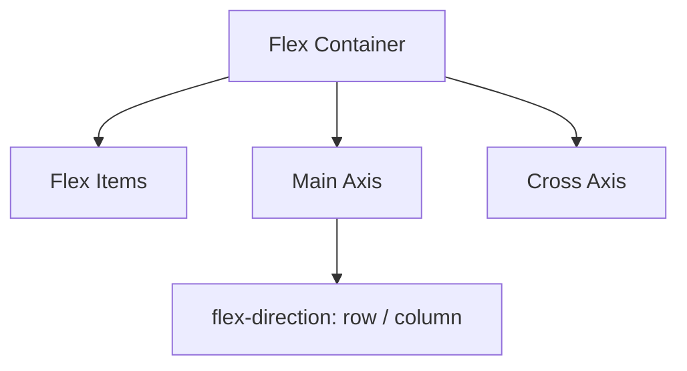

# Bài 01 - Flexbox Layout (Bố cục một chiều linh hoạt)

## I. KHÁI QUÁT

Flexbox (Flexible Box Layout) là một mô hình bố cục trong CSS3, được thiết kế để cung cấp một cách hiệu quả hơn để bố cục, căn chỉnh và phân phối không gian giữa các mục trong một container, ngay cả khi kích thước của chúng không xác định hoặc có tính động (do đó có từ "flex"). 

Mô hình Flexbox hoạt động theo một chiều tại một thời điểm - hoặc theo hàng (row) hoặc theo cột (column). Điều này trái ngược với mô hình Grid Layout (hai chiều).

> [!IMPORTANT]
> Flexbox giải quyết các vấn đề mà các phương pháp bố cục cũ (như floats và positioning) gặp khó khăn, đặc biệt là việc căn giữa theo chiều dọc và chia đều không gian.

### 1. Trục chính (Main Axis) và Trục chéo (Cross Axis)

Bất kỳ bố cục flexbox nào cũng xoay quanh hai trục:
- **Main Axis (Trục chính)**: Trục cơ bản mà các flex item được sắp xếp dọc theo. Hướng của nó được xác định bởi thuộc tính `flex-direction`.
- **Cross Axis (Trục chéo)**: Trục vuông góc với trục chính.



## II. CHI TIẾT KỸ THUẬT

### 1. Các thuộc tính cho Flex Container (Phần chứa)

Để bắt đầu sử dụng Flexbox, bạn cần thiết lập một flex container:

```css
.container {
  display: flex; /* hoặc inline-flex */
}
```

#### a) flex-direction
Xác định hướng của trục chính, từ đó định hướng cách các flex item được đặt trong container.

```css
.container {
  /* Theo chiều ngang từ trái sang phải */
  flex-direction: row; 
  /* Theo chiều ngang từ phải sang trái */
  flex-direction: row-reverse;
  /* Theo chiều dọc từ trên xuống dưới */
  flex-direction: column;
  /* Theo chiều dọc từ dưới lên trên */
  flex-direction: column-reverse;
}
```

#### b) flex-wrap
Mặc định, các flex item sẽ cố gắng nằm trên một dòng duy nhất. Bạn có thể thay đổi điều này.

```css
.container {
  flex-wrap: nowrap; /* Mặc định: tất cả trên 1 dòng */
  flex-wrap: wrap; /* Tràn xuống dòng mới nếu không đủ chỗ */
  flex-wrap: wrap-reverse; /* Tràn xuống dòng mới nhưng ngược hướng */
}
```

> [!TIP]
> Bạn có thể kết hợp `flex-direction` và `flex-wrap` bằng thuộc tính viết tắt `flex-flow`. Ví dụ: `flex-flow: row wrap;`

#### c) justify-content
Xác định cách các item được căn chỉnh dọc theo trục chính (Main Axis).

| Giá trị | Mô tả |
|---------|-------|
| `flex-start` | Các item dồn về đầu container (mặc định). |
| `flex-end` | Các item dồn về cuối container. |
| `center` | Các item nằm giữa container. |
| `space-between` | Item đầu tiên ở đầu, item cuối cùng ở cuối, các item còn lại chia đều khoảng cách. |
| `space-around` | Các item có khoảng trống bằng nhau ở hai bên (làm cho khoảng cách giữa 2 item gấp đôi khoảng cách từ item đến mép). |
| `space-evenly` | Khoảng cách giữa các item và giữa item với mép là bằng nhau. |

#### d) align-items
Xác định cách các item được căn chỉnh dọc theo trục chéo (Cross Axis) trong hàng hiện tại.

```css
.container {
  align-items: stretch; /* Kéo giãn để lấp đầy container (mặc định) */
  align-items: flex-start; /* Dồn về điểm bắt đầu của trục chéo */
  align-items: flex-end; /* Dồn về điểm kết thúc của trục chéo */
  align-items: center; /* Căn giữa theo trục chéo */
  align-items: baseline; /* Căn theo đường cơ sở của văn bản */
}
```

#### e) align-content
Chỉ có tác dụng khi có nhiều hàng (nghĩa là đã dùng `flex-wrap: wrap`). Nó căn chỉnh các hàng dọc theo trục chéo. Giống như `justify-content` nhưng dành cho các hàng thay vì các item riêng lẻ.

### 2. Các thuộc tính cho Flex Item (Phần tử con)

#### a) order
Mặc định, các flex item được hiển thị theo thứ tự trong mã nguồn HTML. Thuộc tính `order` cho phép thay đổi thứ tự này mà không cần đổi HTML.

```css
.item1 {
  order: 2; /* Sẽ xuất hiện sau các item có order nhỏ hơn */
}
.item2 {
  order: 1;
}
```

#### b) flex-grow
Xác định khả năng giãn ra của một item nếu còn không gian trống. Số nguyên không đơn vị đóng vai trò như một tỷ lệ.

```css
.item {
  flex-grow: 1; /* Tất cả các item có flex-grow: 1 sẽ có kích thước bằng nhau */
}
.item2 {
  flex-grow: 2; /* Sẽ chiếm gấp đôi không gian so với item có flex-grow: 1 */
}
```

#### c) flex-shrink
Xác định khả năng co lại của một item nếu không gian bị thiếu. Mặc định là 1.

#### d) flex-basis
Xác định kích thước mặc định của item trước khi không gian trống được phân phối (giống như width hoặc height tùy theo flex-direction).

> [!NOTE]
> Thuộc tính viết tắt `flex` rất được khuyến khích sử dụng. Cú pháp: `flex: flex-grow flex-shrink flex-basis;`. Ví dụ: `flex: 1 1 auto;` hoặc `flex: 1;`.

#### e) align-self
Cho phép ghi đè `align-items` của container đối với một item cụ thể.

## III. VÍ DỤ MINH HỌA

### Căn giữa hoàn hảo (Holy Grail of CSS)

Ngày xưa việc căn giữa một phần tử theo cả hai chiều cực kỳ khó khăn. Với Flexbox, mọi thứ cực kỳ đơn giản:

```html
<div class="container">
  <div class="box">Nội dung căn giữa</div>
</div>
```

```css
.container {
  display: flex;
  justify-content: center; /* Căn giữa trục chính */
  align-items: center;     /* Căn giữa trục chéo */
  height: 100vh;           /* Chiều cao 100% viewport */
  background-color: #f0f0f0;
}

.box {
  padding: 2rem;
  background-color: #3498db;
  color: white;
  border-radius: 8px;
}
```

### Bố cục Navigation Bar (Thanh điều hướng)

```html
<nav class="navbar">
  <div class="logo">Logo</div>
  <ul class="nav-links">
    <li><a href="#">Trang chủ</a></li>
    <li><a href="#">Dịch vụ</a></li>
    <li><a href="#">Liên hệ</a></li>
  </ul>
  <div class="auth-buttons">
    <button>Đăng nhập</button>
  </div>
</nav>
```

```css
.navbar {
  display: flex;
  justify-content: space-between; /* Đẩy các nhóm ra 2 đầu */
  align-items: center;
  padding: 1rem 2rem;
  background: #2c3e50;
  color: white;
}

.nav-links {
  display: flex;
  list-style: none;
  gap: 2rem; /* Khoảng cách giữa các link */
  margin: 0;
  padding: 0;
}

/* Kỹ thuật đẩy auth-buttons sang phải nếu không dùng space-between */
/* .nav-links { margin-right: auto; } */
```

## IV. LƯU Ý CẠM BẪY

> [!WARNING]
> 1. **Vấn đề kích thước hình ảnh**: Khi một hình ảnh là flex item, nó có thể bị kéo giãn một cách không mong muốn. Luôn đảm bảo đặt `align-items` thích hợp hoặc thiết lập `height: auto` và `width` giới hạn cho hình ảnh.
> 2. **flex-basis so với width**: Khi `flex-direction` là `row`, `flex-basis` ghi đè `width`. Khi `flex-direction` là `column`, `flex-basis` ghi đè `height`.
> 3. **Lỗi min-width: auto**: Flex items mặc định không thể nhỏ hơn nội dung bên trong chúng (do `min-width: auto`). Để cho phép chúng thu nhỏ dưới kích thước nội dung (ví dụ khi có text dài hoặc overflow), bạn cần đặt `min-width: 0;`.
> 4. **Trình duyệt cũ**: Flexbox hiện đã được hỗ trợ rộng rãi, nhưng với các hệ thống yêu cầu hỗ trợ IE11 trở xuống, bạn sẽ gặp rất nhiều bug liên quan đến flexbox (đặc biệt là flex-basis và tính toán kích thước).

### Mẹo gỡ lỗi Flexbox
- Trong Chrome/Firefox DevTools, bạn có thể click vào biểu tượng "flex" bên cạnh thuộc tính `display: flex` trong tab Styles để mở một overlay trực quan giúp hình dung và thay đổi các thuộc tính flex một cách dễ dàng.
- Luôn kiểm tra `flex-wrap` khi các item có vẻ bị ép lại với nhau đến mức không đọc được nội dung.
