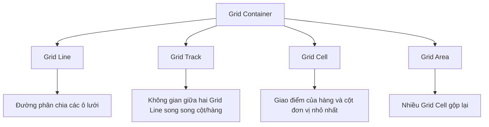

# Bài 02 - Grid Layout (Bố cục lưới hai chiều)

## I. KHÁI QUÁT

CSS Grid Layout (gọi tắt là Grid) là một hệ thống bố cục hai chiều mạnh mẽ nhất hiện có trong CSS. Không giống như Flexbox xử lý bố cục một chiều tại một thời điểm (hàng hoặc cột), Grid xử lý cả cột và hàng đồng thời.

Lợi ích chính của Grid:
- Khả năng kiểm soát chính xác cả hai chiều (ngang và dọc).
- Tạo ra các bố cục phức tạp với ít mã HTML lồng nhau hơn.
- Căn chỉnh nội dung theo các dòng lưới vô hình, tạo ra tính nhất quán tuyệt đối.

> [!IMPORTANT]
> Nên sử dụng Grid cho bố cục cấp vĩ mô (trang tổng thể) và Flexbox cho bố cục cấp vi mô (các phần tử bên trong một khu vực). Tuy nhiên, ranh giới này ngày càng mờ nhạt.

### Thuật ngữ cơ bản trong Grid



## II. CHI TIẾT KỸ THUẬT

### 1. Khởi tạo Grid Container

```css
.container {
  display: grid; /* hoặc inline-grid */
}
```

### 2. Định nghĩa Cột và Hàng

Sử dụng `grid-template-columns` và `grid-template-rows` để định nghĩa số lượng và kích thước các cột/hàng.

```css
.container {
  display: grid;
  grid-template-columns: 200px 1fr 200px; /* 3 cột */
  grid-template-rows: auto 1fr 100px; /* 3 hàng */
}
```

#### Đơn vị `fr` (Fractional Unit)
Đơn vị `fr` cho phép bạn chỉ định một phần của không gian có sẵn trong grid container.
Ví dụ: `grid-template-columns: 1fr 2fr;` -> Cột thứ hai sẽ lớn gấp đôi cột thứ nhất.

#### Hàm `repeat()`
Giúp viết gọn khi có nhiều cột/hàng giống nhau.
```css
/* Tương đương: 1fr 1fr 1fr 1fr */
grid-template-columns: repeat(4, 1fr); 

/* Lặp kết hợp */
grid-template-columns: 200px repeat(2, 1fr) 200px;
```

#### Hàm `minmax()`
Cho phép bạn đặt kích thước linh hoạt với một giới hạn dưới và một giới hạn trên.
```css
/* Cột luôn rộng ít nhất 200px, và sẽ giãn ra nếu còn chỗ */
grid-template-columns: minmax(200px, 1fr) 1fr 1fr;
```

### 3. Vị trí các Grid Items

Bạn có thể đặt các item vào những vị trí cụ thể trên lưới bằng cách tham chiếu đến các Grid Line (đánh số từ 1, hoặc đếm ngược từ -1).

```css
.item {
  grid-column-start: 1;
  grid-column-end: 3;
  /* Hoặc viết tắt: grid-column: 1 / 3; (Chiếm từ đường số 1 đến đường số 3, tức là 2 cột) */
  
  grid-row-start: 2;
  grid-row-end: 4;
  /* Hoặc viết tắt: grid-row: 2 / 4; */
  
  /* Viết tắt tất cả: grid-area: row-start / col-start / row-end / col-end */
  grid-area: 2 / 1 / 4 / 3;
}
```

### 4. Grid Template Areas

Cách trực quan và mạnh mẽ nhất để bố cục lưới. Đặt tên cho các khu vực và ánh xạ chúng trong container.

```css
.container {
  display: grid;
  grid-template-columns: 200px 1fr;
  grid-template-rows: auto 1fr auto;
  grid-template-areas: 
    "header header"
    "sidebar main"
    "footer footer";
}

.header { grid-area: header; }
.sidebar { grid-area: sidebar; }
.main { grid-area: main; }
.footer { grid-area: footer; }
```

### 5. Gap (Khoảng cách)

Xác định khoảng cách giữa các hàng và cột.
```css
.container {
  gap: 20px; /* Cả hàng và cột */
  row-gap: 15px; /* Chỉ hàng */
  column-gap: 20px; /* Chỉ cột */
}
```

## III. VÍ DỤ MINH HỌA

### Bố cục "Holy Grail" với Grid Template Areas

```html
<div class="holy-grail">
  <header class="header">Header</header>
  <nav class="nav">Nav</nav>
  <main class="content">Content</main>
  <aside class="ads">Ads</aside>
  <footer class="footer">Footer</footer>
</div>
```

```css
.holy-grail {
  display: grid;
  height: 100vh;
  grid-template-columns: 200px 1fr 200px;
  grid-template-rows: 60px 1fr 80px;
  grid-template-areas:
    "header header header"
    "nav content ads"
    "footer footer footer";
  gap: 10px;
}

.header { grid-area: header; background: #34495e; color: white; }
.nav { grid-area: nav; background: #95a5a6; }
.content { grid-area: content; background: #ecf0f1; }
.ads { grid-area: ads; background: #95a5a6; }
.footer { grid-area: footer; background: #7f8c8d; color: white; }

/* Responsive dễ dàng */
@media (max-width: 768px) {
  .holy-grail {
    grid-template-columns: 1fr; /* 1 cột duy nhất */
    grid-template-rows: auto auto 1fr auto auto;
    grid-template-areas:
      "header"
      "nav"
      "content"
      "ads"
      "footer";
  }
}
```

### Lưới ảnh (Image Gallery) tự động thích ứng với auto-fill / auto-fit

Kỹ thuật rất phổ biến để làm lưới ảnh mà không cần Media Queries.

```css
.gallery {
  display: grid;
  /* 
    auto-fill: Tạo ra nhiều cột nhất có thể, kể cả khi rỗng.
    auto-fit: Tạo ra các cột, sau đó kéo giãn chúng ra để lấp đầy không gian.
    minmax(250px, 1fr): Mỗi cột ít nhất 250px, tối đa 1 phần của lưới.
  */
  grid-template-columns: repeat(auto-fit, minmax(250px, 1fr));
  gap: 16px;
}

.gallery img {
  width: 100%;
  height: 200px;
  object-fit: cover;
  border-radius: 8px;
}
```

## IV. LƯU Ý CẠM BẪY

> [!CAUTION]
> Lỗi phổ biến nhất khi dùng `fr` là quên rằng nội dung bên trong có thể đẩy kích thước của track lớn hơn dự kiến. Đơn vị `1fr` thực chất không phải là "từ 0 đến 1 phần", mà là `minmax(auto, 1fr)`. Nếu nội dung rộng 500px, `1fr` sẽ là tối thiểu 500px.
> -> **Cách giải quyết**: Sử dụng `minmax(0, 1fr)` thay vì `1fr` để đảm bảo cột có thể thu nhỏ dưới kích thước của nội dung, cho phép cắt chữ hoặc cuộn ngang hoạt động.

> [!WARNING]
> Tính năng `subgrid` (lưới phụ - cho phép item con sử dụng các đường lưới của container cha) hiện tại đã được hỗ trợ trên hầu hết các trình duyệt hiện đại (Firefox, Safari, Chrome 117+), nhưng nếu bạn cần hỗ trợ các trình duyệt rất cũ, hãy thận trọng và cung cấp fallback (ví dụ dùng flexbox lồng nhau).

### Mẹo làm việc
- Hãy sử dụng công cụ Grid Inspector trong Firefox hoặc Chrome DevTools. Chúng sẽ vẽ các đường lưới và hiển thị số thứ tự đường lưới, tên vùng, giúp bạn xác định vị trí rất nhanh.
- Khi tạo bố cục phức tạp, hãy phác thảo ra giấy với các hàng và cột trước khi viết code. Xác định `grid-template-areas` sẽ giúp code dễ đọc hơn rất nhiều so với dùng số thứ tự đường lưới.
