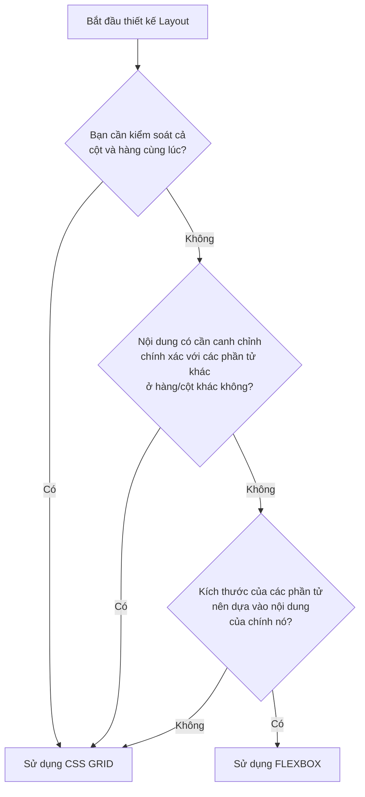

# Bài 03 - Flexbox vs Grid Deep Dive (So sánh & Kết hợp bố cục)

## I. KHÁI QUÁT

Flexbox và Grid Layout là hai công cụ bố cục (layout tools) mạnh mẽ nhất trong CSS hiện đại. Ban đầu, có sự nhầm lẫn rằng Grid sẽ thay thế Flexbox. Thực tế, chúng được thiết kế để bổ sung cho nhau. 

Một nhà phát triển giao diện (Frontend Developer) giỏi không chỉ biết cách sử dụng từng công cụ, mà còn biết khi nào nên chọn công cụ nào và làm thế nào để kết hợp chúng một cách hài hòa nhất.

> [!IMPORTANT]
> Quy tắc ngón tay cái: **"Flexbox cho bố cục một chiều (1D), Grid cho bố cục hai chiều (2D)"**. 
> - Nếu bạn quan tâm đến nội dung (content-first) và cách chúng trải dài theo một hướng, dùng Flexbox.
> - Nếu bạn quan tâm đến cấu trúc tổng thể, vị trí chính xác (layout-first), dùng Grid.

## II. CHI TIẾT KỸ THUẬT & SO SÁNH

### 1. Bảng so sánh chi tiết

| Tính năng | Flexbox | CSS Grid |
|-----------|---------|----------|
| **Kích thước chiều** | 1 chiều (Dọc HOẶC Ngang) | 2 chiều (Cả Dọc VÀ Ngang) |
| **Góc nhìn (Perspective)** | Content-out: Kích thước của item quyết định bố cục | Layout-in: Cấu trúc lưới quyết định kích thước của item |
| **Tính nhất quán** | Khó duy trì các cột/hàng thẳng hàng nếu không cùng một hàng/cột | Các ô lưới được khóa vào cấu trúc chung, căn chỉnh hoàn hảo |
| **Phân bổ không gian** | Dựa trên `flex-grow`, `flex-shrink`, `flex-basis` | Dựa trên `fr`, `grid-template-*` |
| **Ghi đè vị trí** | Hạn chế (chỉ có `order`) | Tự do (`grid-area`, số dòng cột, có thể chồng chéo lên nhau) |
| **Khoảng trống (Gap)** | Có (`gap`) | Có (`gap`) |

### 2. Cây quyết định (Decision Tree)



### 3. Kỹ thuật Content-out (Flexbox) vs Layout-in (Grid)

**Content-out (Flexbox):**
Flexbox nhìn vào nội dung bên trong các hộp (boxes), tính toán xem chúng chiếm bao nhiêu không gian, sau đó phân phối không gian còn lại một cách linh hoạt. Bạn khó có thể nói "hãy ép item này rộng chính xác bằng 2 cột" trừ khi bạn thiết lập các con số phần trăm và tính toán gap phức tạp.

**Layout-in (Grid):**
Với Grid, bạn tạo ra bộ khung (lưới) trước (ví dụ: `grid-template-columns: 200px 1fr 2fr`). Sau đó, bạn đặt nội dung vào. Các item buộc phải tuân theo ranh giới của lưới mà bạn đã định hình sẵn.

## III. VÍ DỤ MINH HỌA: KẾT HỢP GRID VÀ FLEXBOX

Dưới đây là một ví dụ thực tế về một trang Dashboard.
- **Grid** được sử dụng để xây dựng bộ khung lớn (Sidebar, Header, Nội dung chính).
- **Flexbox** được sử dụng trong Header (canh chỉnh logo, avatar) và trong các Card con.

```html
<div class="dashboard">
  <!-- Sidebar -->
  <aside class="sidebar">
    <div class="logo">AppLogo</div>
    <ul class="nav">
      <li>Home</li>
      <li>Analytics</li>
      <li>Settings</li>
    </ul>
  </aside>

  <!-- Header -->
  <header class="header">
    <div class="search-bar">Search...</div>
    <div class="user-profile">
      <span>Welcome, User</span>
      
    </div>
  </header>

  <!-- Main Content -->
  <main class="main-content">
    <div class="card">
      <h3>Doanh thu</h3>
      <p>$10,000</p>
    </div>
    <div class="card">
      <h3>Lượt truy cập</h3>
      <p>5,000</p>
    </div>
  </main>
</div>
```

```css
/* --- 1. SỬ DỤNG GRID CHO BỐ CỤC LỚN --- */
.dashboard {
  display: grid;
  height: 100vh;
  grid-template-columns: 250px 1fr;
  grid-template-rows: 70px 1fr;
  grid-template-areas:
    "sidebar header"
    "sidebar main";
}

.sidebar { 
  grid-area: sidebar; 
  background-color: #2c3e50; 
  color: white; 
}
.header { 
  grid-area: header; 
  background-color: white; 
  border-bottom: 1px solid #ddd;
}
.main-content { 
  grid-area: main; 
  background-color: #f4f7f6; 
  padding: 20px;
}

/* --- 2. SỬ DỤNG FLEXBOX CHO CHI TIẾT BÊN TRONG --- */
.header {
  display: flex;
  justify-content: space-between; /* Đẩy thanh search và user ra 2 mép */
  align-items: center; /* Canh giữa theo chiều dọc */
  padding: 0 20px;
}

.user-profile {
  display: flex;
  align-items: center;
  gap: 10px; /* Khoảng cách giữa chữ và ảnh */
}

/* --- KẾT HỢP: GRID CHO MAIN CONTENT --- */
.main-content {
  display: grid;
  grid-template-columns: repeat(auto-fit, minmax(200px, 1fr));
  gap: 20px;
}

.card {
  /* Có thể dùng flexbox để canh giữa nội dung trong card */
  display: flex;
  flex-direction: column;
  justify-content: center;
  align-items: center;
  background: white;
  padding: 30px;
  border-radius: 8px;
  box-shadow: 0 4px 6px rgba(0,0,0,0.1);
}
```

## IV. LƯU Ý CẠM BẪY

> [!WARNING]
> Đừng ép buộc bản thân dùng duy nhất một công cụ. Việc cố gắng dùng Flexbox để xây dựng một bố cục lưới phức tạp (ví dụ: chia cột 12-col bằng Flexbox, sử dụng các lớp `.col-4`, `.col-8` phức tạp của Bootstrap cũ) thường dẫn đến nhiều đoạn code hacky (như sử dụng phần trăm toán học và margin âm) mà CSS Grid sinh ra để giải quyết một cách thanh lịch.

> [!TIP]
> **Vấn đề Z-index trong Grid/Flexbox**: Khác với luồng văn bản tĩnh thông thường (static flow), bất kỳ phần tử con nào của một flex container hoặc grid container sẽ tự động tạo ra một ngữ cảnh xếp chồng (stacking context) nếu bạn cung cấp cho nó một thuộc tính `z-index` (ngay cả khi chưa set `position: relative`). Điều này rất hữu ích nhưng cũng dễ gây bối rối nếu bạn không nhớ đặc tính này.

> [!CAUTION]
> Chồng chéo phần tử (Overlapping): Nếu bạn cần các phần tử xếp chồng lên nhau (như một layer màu nền nằm dưới văn bản), Grid hoàn toàn có thể làm được mà không cần dùng đến `position: absolute`. Bạn chỉ cần cho 2 phần tử cùng chung một tọa độ `grid-area`. Ví dụ:
> ```css
> .image { grid-area: 1 / 1; }
> .text-overlay { grid-area: 1 / 1; align-self: end; } 
> ```
> Điều này tốt hơn nhiều so với việc bóc tách phần tử khỏi luồng văn bản bằng absolute positioning.
